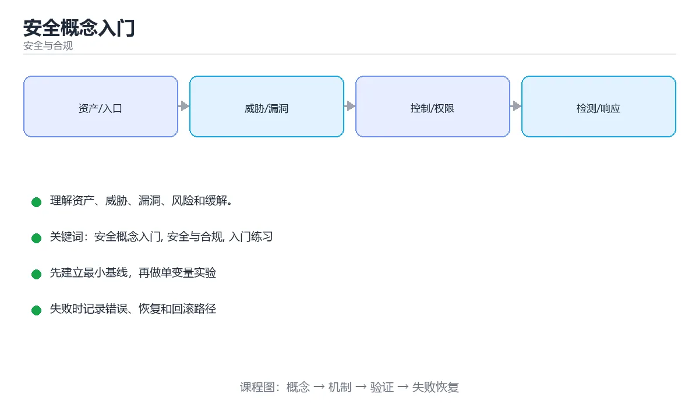

# 安全概念入门



> 内容更新时间：2026-10-03 · 学习阶段：入门 · 预计用时：15 分钟

## 学习目标

- 先认识「安全概念入门」需要的工具、输入和输出。
- 按步骤运行最小示例，并记录结果与错误。
- 用一个边界输入验证自己是否真正掌握。

## 前置知识

- 会进行基本的文件或命令行操作。
- 不需要预先掌握「安全与合规」的高级知识。

## 一句话入门

理解资产、威胁、漏洞、风险和缓解。

## 最小示例

```python
asset = {"name": "用户数据库", "value": 5}
threat = {"name": "弱口令", "likelihood": 4}
vulnerability = {"name": "未启用多因素认证", "severity": 5}
risk = threat["likelihood"] * vulnerability["severity"]
print(asset["name"], threat["name"], risk)
```

## 预期输出

```text
用户数据库 弱口令 20
```

## 常见错误

- 输入或环境与示例不一致，导致结果不符合预期。
- 复制命令时遗漏空格、引号或必要参数。

## 动手练习

1. 原样运行最小示例，保存命令和输出。
2. 把数字 2 改成 10，预测并验证新结果。
3. 制造一个错误输入，写出错误信息和修复方法。

## 本课小结

- 入门阶段先保证能运行、能观察、能解释，再追求复杂功能。
- 每次只改一个变量，记录预测与实际结果。
- 遇到错误先看第一条错误信息，再回到最小示例。

<!-- p0-thicken:v1 -->

## 考点精讲：把选择题还原成判断过程

下面不是答案速查，而是把本课测验里每个选项背后的判断标准展开。先自己作答，再对照解析检查推理链；如果结论正确但理由不完整，仍然需要回到正文补足概念。

### 考点 1：《安全概念入门》的“最小示例”主要使用哪种语言或格式？

- **正确判断**：Python
- **解析**：代码块的语言标记决定了示例的运行方式和复习工具。正确项来自本课最小示例的围栏标记，其他选项来自其他课程或输出说明。阅读代码题时要先确认语言、输入、预期输出，再判断运行环境。本题正确项是「Python」。复习《安全概念入门》时，把这一条写进自己的复述，再用原文示例或练习做一次验证；如果仍说不清，就回到对应章节。
- **迁移检查**：把题目中的一个输入换成边界值，原来的结论还成立吗？为什么？

### 考点 2：《安全概念入门》的“常见错误/误区”提醒优先检查什么？

- **正确判断**：输入或环境与示例不一致，导致结果不符合预期。
- **解析**：这道题来自本课的排错清单。正确项是正文强调的检查点，其他选项把排错方向引向无关细节。遇到错误时应先复现最小案例，只改变一个变量，检查输入、环境、边界和错误信息，再继续修改。本题正确项是「输入或环境与示例不一致，导致结果不符合预期。」。复习《安全概念入门》时，把这一条写进自己的复述，再用原文示例或练习做一次验证；如果仍说不清，就回到对应章节。
- **迁移检查**：如果去掉一个限制条件，哪个选项会变成正确？请写出判断过程。

### 考点 3：《安全概念入门》的“动手练习”首先要求做什么？

- **正确判断**：原样运行最小示例，保存命令和输出。
- **解析**：这道题来自本课练习步骤。正确项对应正文中列出的第一项动手任务，其他选项虽然也是学习动作，但缺少本课要求的输入、步骤或观察目标。做完练习后应记录预测结果和实际输出的差异。本题正确项是「原样运行最小示例，保存命令和输出。」。复习《安全概念入门》时，把这一条写进自己的复述，再用原文示例或练习做一次验证；如果仍说不清，就回到对应章节。
- **迁移检查**：把这道题改写成一次可运行或可人工验证的实验，并记录预期输出。

### 考点 4：《安全概念入门》的“一句话入门”最接近哪一项？

- **正确判断**：理解资产、威胁、漏洞、风险和缓解。
- **解析**：这道题来自本课正文的开篇定义。正确项直接概括了课程主题，其他选项来自其他知识点的定义，不能回答本课的具体问题。复习时先用自己的话复述这句话，再回到最小示例验证理解。本题正确项是「理解资产、威胁、漏洞、风险和缓解。」。复习《安全概念入门》时，把这一条写进自己的复述，再用原文示例或练习做一次验证；如果仍说不清，就回到对应章节。
- **迁移检查**：用自己的话写出正确项和两个错误项的适用边界。

<!-- p0-practice:v1 -->

## 代码实验：把示例跑成证据

这一节不引入新语法，而是把「安全概念入门」的最小示例变成可以复现、可以对照的实验。每次只改变一个条件，先写预测，再运行，最后解释差异。

### 实验一：建立基线

```python
asset = {"name": "用户数据库", "value": 5}
threat = {"name": "弱口令", "likelihood": 4}
vulnerability = {"name": "未启用多因素认证", "severity": 5}
risk = threat["likelihood"] * vulnerability["severity"]
print(asset["name"], threat["name"], risk)
```

先原样运行上面的代码，记录命令、完整输出和退出状态。然后把输出与正文的预期输出逐字对照，不要用“看起来差不多”代替核对；空格、大小写、换行和错误流向都可能暴露环境差异。

### 实验二：只改一个输入

从代码中选一个会影响结果的字面量、参数或输入，把它替换成边界值：数值可尝试 0、1、最大值和最小值，字符串可尝试空串和超长文本，集合可尝试空集合、单元素和重复元素。先写出预测，再运行并记录实际结果。

### 实验三：制造一个可控错误

把复合语句末尾的冒号删掉，或者把字符串直接参与数值运算。先记录解释器报出的第一行错误和行号，再修复并重跑基线。

| 实验 | 改动 | 预测 | 实际 | 结论 |
| --- | --- | --- | --- | --- |
| 基线 | 保持原样 |  |  |  |
| 边界 |  |  |  |  |
| 失败 |  |  |  |  |

### 实验四：用三句话复述

1. 输入是什么，哪些输入属于合法范围，哪些属于边界或非法范围？
2. 程序按什么顺序处理输入，在哪一步产生了状态变化或副作用？
3. 输出如何验证，失败时第一条可观察证据是什么？

### 与测验考点的连接

- 考点 1「《安全概念入门》的“最小示例”主要使用哪种语言或格式？」：先写出你的判断，再回到上方解析核对。正确判断：Python。
- 考点 2「《安全概念入门》的“常见错误/误区”提醒优先检查什么？」：先写出你的判断，再回到上方解析核对。正确判断：输入或环境与示例不一致，导致结果不符合预期。。
- 考点 3「《安全概念入门》的“动手练习”首先要求做什么？」：先写出你的判断，再回到上方解析核对。正确判断：原样运行最小示例，保存命令和输出。。
- 考点 4「《安全概念入门》的“一句话入门”最接近哪一项？」：先写出你的判断，再回到上方解析核对。正确判断：理解资产、威胁、漏洞、风险和缓解。。

<!-- p0-deepdive:v1 -->

## 安全基础机制速览

### 资产、威胁、漏洞与风险

安全工作的起点是资产：数据、账号、服务、代码和声誉都有价值。威胁是可能造成损害的事件或攻击者，漏洞是系统可被利用的弱点，风险是威胁利用漏洞造成损失的可能性和影响。风险 = 可能性 × 影响，控制措施通过降低概率或影响来管理风险。安全不是“消灭所有风险”，而是把风险降到可接受范围并保留证据。

### 机密性、完整性与可用性

CIA 三元组是安全目标的基础：机密性防止未授权读取，完整性防止未授权修改，可用性保证授权用户能及时访问。认证回答“你是谁”，授权回答“你能做什么”，审计记录“你做过什么”。身份验证应使用强密码、多因素认证和安全的会话管理；授权应遵循最小权限和职责分离。日志要记录关键决策，但不能泄露密码、令牌和敏感数据。

### 加密、哈希与密钥

加密用密钥把明文变成密文，对称加密速度快，非对称加密便于密钥交换和签名。哈希把任意长度输入映射成固定长度摘要，用于完整性校验；密码存储必须使用专门的慢哈希算法并加盐，不能用普通 SHA-256 直接保存密码。盐防止彩虹表，pepper 是额外的服务端秘密，密钥必须放在安全的密钥管理系统中，不能提交到代码仓库。

### 输入校验、注入与防御纵深

所有外部输入都不可信，包括表单、URL、Header、文件、第三方 API 和模型输出。输入校验应在边界层完成，输出编码要匹配目标上下文，SQL、命令、模板和日志都有不同的注入风险；参数化查询和最小权限是防止注入的核心。防御纵深要求网络、主机、应用和数据层各自有控制，不能只依赖一道防火墙或一次前端校验。

### 供应链、隐私与事件响应

依赖、构建工具、容器镜像和 CI 凭据都属于供应链范围。锁定版本、校验来源、扫描漏洞、限制发布权限，并保留可复现构建记录。隐私要求最小收集、明确目的、限制保留期限和可删除。发生安全事件时按准备、发现、遏制、根除、恢复和复盘推进，先止损再调查，保留证据链，最后把根因转化为可验证的改进项。

## 本课连接：把机制放回「安全概念入门」

上面的机制速览覆盖了该方向最容易反复出现的概念。下面把它收回到本课，用正文里的真实主题和测验考点建立连接。

### 本课真实主题

- **安全落地补充：安全概念入门**

### 测验考点回链

- 考点 1「《安全概念入门》的“最小示例”主要使用哪种语言或格式？」→ 正确判断：Python。
- 考点 2「《安全概念入门》的“常见错误/误区”提醒优先检查什么？」→ 正确判断：输入或环境与示例不一致，导致结果不符合预期。。
- 考点 3「《安全概念入门》的“动手练习”首先要求做什么？」→ 正确判断：原样运行最小示例，保存命令和输出。。
- 考点 4「《安全概念入门》的“一句话入门”最接近哪一项？」→ 正确判断：理解资产、威胁、漏洞、风险和缓解。。

### 边界检查

1. 本课机制在正常输入下如何工作？
2. 输入为空、越界、类型不符或重复时，哪一步最先失败？
3. 失败后应该保留哪些日志、输出或状态，才能复现并修复？
4. 如果把这套机制换成相邻主题的方案，哪些约束会改变？

<!-- p2-enrichment:v1 -->

## English Overview

**Title:** Security Concepts Basics

**Summary:** Understand assets, threats, vulnerabilities and risk.

**Category:** Security & Compliance  
**Level:** 基础  
**Key terms:** 安全概念入门, 安全与合规, 入门练习

> The full tutorial is written in Chinese. This bilingual overview helps English readers identify the topic, scope and key terms before studying the detailed examples.

## 内容元数据

- 内容版本：v2.0
- 最后更新：2026-10-03
- 学习阶段：基础
- 适用环境：OWASP、云原生与合规安全实践
- 内容来源：内置结构化课程与工程实践整理
- 相关主题：安全概念入门、安全与合规、入门练习
- 质量版本：P0 测验标准 + P1 覆盖扩展 + P2 体验补全

<!-- domain-supplement:v1 -->

## 安全落地补充：安全概念入门

### 一、资产、边界与信任

先回答：保护哪些数据、谁可以访问、哪些组件是信任边界、攻击者能从哪些入口进入。围绕「安全概念入门、安全与合规、入门练习」列出至少 3 个入口和对应的最小权限。

### 二、威胁 → 控制 → 验证

| 威胁 | 预防控制 | 检测方式 | 验证证据 |
| --- | --- | --- | --- |
| 输入被污染 | schema、白名单、编码 | 异常输入日志和告警 | 越权与注入测试 |
| 权限过大 | 最小权限、临时凭证 | 权限审计和异常调用 | 权限边界测试 |
| 密钥泄露 | 密钥管理、轮换 | 仓库和日志扫描 | 轮换与影响范围记录 |
| 操作不可追溯 | 结构化审计日志 | 关键动作告警 | 审计查询和复盘 |
| 恢复失败 | 备份、回滚、演练 | 恢复指标监控 | 演练时间与数据校验 |

### 三、上线前安全清单

- [ ] 所有外部输入经过校验和输出编码。
- [ ] 认证、授权和会话失效逻辑有测试。
- [ ] 密钥不进入源码、镜像和日志。
- [ ] 依赖漏洞、许可证和来源已审查。
- [ ] 高风险操作有确认、审计和回滚。
- [ ] 安全事件有联系人和升级路径。

### 四、事件响应演练

构造一次凭证泄露或越权访问，按发现、隔离、轮换、取证、恢复、复盘六步执行，记录时间线和剩余风险。

<!-- top50-rewrite:v1 -->

## 参考资料与复核

- 最后复核：2026-10-04
- 下次复核：2027-04-04
- 复核范围：版本兼容、API 行为、安全建议与工程实践
- 来源性质：官方文档与标准；本课正文为离线教学重组，不复制原文

| 参考资料 | 本课用途 |
| --- | --- |
| [OWASP Cheat Sheets](https://cheatsheetseries.owasp.org/) | 应用安全实践 |
| [NIST Cybersecurity](https://www.nist.gov/cyberframework) | 风险治理框架 |

> 本课主题：理解资产、威胁、漏洞、风险和缓解。

> App 完全离线展示文字链接，不会自动联网；需要延伸阅读时可复制链接到浏览器。
<!-- p2-references:v1 -->
<!-- top50-rewrite:v1 -->
