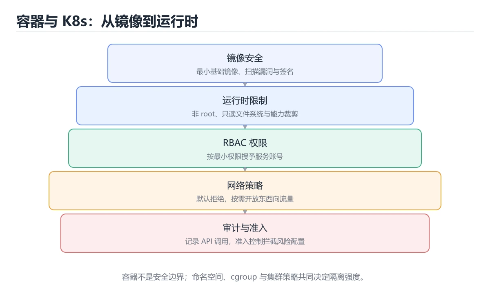

# 容器与 Kubernetes 安全

> 内容更新时间：2026-10-06 · 学习阶段：高级 · 预计用时：40 分钟




## 本节知识框架

**课程定位**：所属分类 `security`（安全与合规），课程主题 `容器与 Kubernetes 安全`，学习阶段 高级，建议用时 45 分钟。

本课主线：覆盖镜像、运行时、RBAC、网络策略和集群最小权限。

**学完本课应当能够**
- 说清 `容器安全` 与 `RBAC` 的含义与区别，并各举一个正例和一个反例。
- 用本课示例验证 `网络策略` 的行为，记录输入、输出与失败条件。
- 遇到「容器以特权模式运行」这类问题时，能说出触发条件与修复顺序。

### 从概念到验证的学习链条

1. `容器安全`：先掌握 从镜像、运行时权限、网络、密钥和宿主机隔离多个层面保护容器工作负载，再用它解释 `RBAC` 为什么会出现。
2. `RBAC`：先掌握 基于角色的访问控制：把权限绑到角色再授予主体，Kubernetes 里按最小权限收敛 ServiceAccount，再用它解释 `网络策略` 为什么会出现。
3. `网络策略`：先掌握 按“容器与 Kubernetes 安全”中 容器安全、RBAC、网络策略 的实践顺序，把四个步骤排成从准备到复盘的合理顺序，再用它解释 `运行时` 为什么会出现。
4. `运行时`：先掌握 容器运行时：负责拉镜像、创建命名空间与 cgroups 并启动进程，逃逸漏洞多出在这一层，再用它解释 本课示例的观察结果 为什么会出现。

**先修与衔接**：本课是「安全与合规」分类的第 12 课。先修内容：《软件供应链安全》。《软件供应链安全》里的 `供应链`、`SBOM` 是本课的前提。相关或后续课程：《云安全与 IAM》。

### 完成判据

- **定义关**：不看正文也能说明 `容器安全` 是 从镜像、运行时权限、网络、密钥和宿主机隔离多个层面保护容器工作负载，并指出一个反例。
- **机制关**：能按“输入 → 转换 → 输出 → 验证”复述 `容器与 Kubernetes 安全`，而不是只背结论。
- **示例关**：能运行或推演 `容器与 Kubernetes 安全` 的 `text` 示例，并说明一个真实出现的标识符或字面量。
- **证据关**：能指出 `容器与 Kubernetes 安全` 示例里的 调用了 `sha256()`，并说明它支持或反驳了本课的哪一条结论。
- **排错关**：能复现 容器以特权模式运行，记录现象并按 关闭特权模式并限制内核能力 修复。
- **迁移关**：能把 `容器安全`、`RBAC`、`网络策略`、`运行时` 放进一个与 `容器与 Kubernetes 安全` 不同的项目场景，并保持输入与验证条件可追踪。
- **复盘关**：学完 `容器与 Kubernetes 安全` 后，用一句话写下仍然不确定的结论，并列出下一次验证需要的输入、环境和成功判据。

### 复习清单

- [ ] 能不看正文复述本课核心术语，并指出一个边界或反例。
- [ ] 能运行或推演本课示例，记录输入、输出与失败现象。
- [ ] 能完成一次自测，并把错题对照错误表定位原因。

## 核心概念定义

| 术语 | 操作性定义 | 常见边界与风险 |
| --- | --- | --- |
| 容器安全 | 从镜像、运行时权限、网络、密钥和宿主机隔离多个层面保护容器工作负载。 | 隔离级别与并发事务会影响可见性，换级别或换存储引擎后要重新验证。 |
| RBAC | 基于角色的访问控制：把权限绑到角色再授予主体，Kubernetes 里按最小权限收敛 ServiceAccount。 | 权限与密钥策略变化会让结论失效，按最小权限并用真实凭据流程复验。 |
| 网络策略 | 按“容器与 Kubernetes 安全”中 容器安全、RBAC、网络策略 的实践顺序，把四个步骤排成从准备到复盘的合理顺序。 | 易错：横向移动毫无阻碍；正确做法是配置默认拒绝的网络策略，再按需放行。 |
| 运行时 | 容器运行时：负责拉镜像、创建命名空间与 cgroups 并启动进程，逃逸漏洞多出在这一层。 | 共享状态与调度顺序会改变结论，单线程或串行测试通过不等于并发下成立。 |

## 原理与运行机制

### 机制总览

**教材衔接：核心知识**

### 1. 镜像要使用可信基础层、非 root 用户和最小化内容。

- 关键做法：先让 容器安全 的最小示例可复现，再加入并发或规模条件。
- 验证标准：容器安全 的结果可复现、错误可解释、失败能恢复。

### 2. Kubernetes RBAC 要按命名空间和动词最小授权，避免 cluster-admin 泛用。

把这条结论放回「容器与 Kubernetes 安全」的完整流程里展开：

- 正文依据：能用自己的话解释：Kubernetes RBAC 要按命名空间和动词最小授权，避免 cluster-admin 泛用。
- 落地检查：把「2. Kubernetes RBAC 要按命名空间和动词最小授权，避免 cluster-admin 泛用。」改写成一条可执行的核对项，逐条验证输入、超时与失败路径。

### 3. 网络策略、Secret 加密和运行时检测共同限制横向移动。

把这条结论放回「容器与 Kubernetes 安全」的完整流程里展开：

- 正文依据：能用自己的话解释：网络策略、Secret 加密和运行时检测共同限制横向移动。
- 落地检查：把「3. 网络策略、Secret 加密和运行时检测共同限制横向移动。」改写成一条可执行的核对项，逐条验证输入、超时与失败路径。

**教材衔接：关键流程**

**教材衔接：实践路径**

**教材衔接：安全落地补充：容器与 Kubernetes 安全**

### 一、资产、边界与信任

先回答：保护哪些数据、谁可以访问、哪些组件是信任边界、攻击者能从哪些入口进入。围绕「容器安全、RBAC、网络策略、运行时」列出至少 3 个入口和对应的最小权限。


### 三、上线前安全清单

- [ ] 所有外部输入经过校验和输出编码。
- [ ] 认证、授权和会话失效逻辑有测试。
- [ ] 密钥不进入源码、镜像和日志。
- [ ] 依赖漏洞、许可证和来源已审查。
- [ ] 高风险操作有确认、审计和回滚。
- [ ] 安全事件有联系人和升级路径。

### 四、事件响应演练

围绕「容器与 Kubernetes 安全」构造一次 容器安全 相关的越权或泄露场景，按发现、隔离、轮换、取证、恢复、复盘六步执行，记录时间线与剩余风险。

**教材衔接：零基础精讲：把容器与 Kubernetes 安全真正讲透**

### 先建立一个直觉

把「容器与 Kubernetes 安全」看成一条防线：先识别资产与威胁，再围绕 容器安全 限制权限、验证输入、记录审计，并为失败准备隔离与恢复方案。

本课的摘要可以当作一张地图：覆盖镜像、运行时、RBAC、网络策略和集群最小权限。

### 逐步拆解

1. 澄清输入与目标。先写清「容器与 Kubernetes 安全」要解决的问题、合法输入范围和成功标准，再进入后续步骤。
2. 描述处理过程。把「容器安全、RBAC、网络策略、运行时」映射到具体步骤，每步都要求能单独验证。
3. 定义输出。把 e884898da28 的返回值、日志和失败信号都写清楚，缺一项都不算完整。
4. 关掉一个看似必要的检查（RBAC相关），观察哪个测试或指标先失败，用证据说明它为什么不能省。
5. 用 e884898da28 贯穿一次小实验：先预测输出，再运行或逐步推演，最后解释差异来自哪一步。

### 把正文串成一条执行链

- 三、上线前安全清单：- [ ] 容器安全 的所有外部输入经过校验和输出编码

### 从测验反推易错点

- 参考判断：镜像要使用可信基础层、非 root 用户和最小化内容。
- 自问：如果去掉题干里的一个限定词，结论还成立吗？

- 参考判断：Kubernetes RBAC 要按命名空间和动词最小授权

- 参考判断：网络策略、Secret 加密和运行时检测共同限制横向移动。

**检查点 4：本课的核心学习目标是什么？**

- 参考判断：覆盖镜像、运行时、RBAC、网络策略和集群最小权限。

- 参考判断：容器安全、RBAC

### 工程排错顺序

| 先查什么 | 要得到的证据 | 判断标准 |
| --- | --- | --- |
| 资产、威胁和行为主体是否明确？ | 日志、输入样例、测试或指标 | 能复现并解释，才算定位 |
| 权限是否默认拒绝并最小化？ | 日志、输入样例、测试或指标 | 能复现并解释，才算定位 |
| 输入、输出与审计是否都有控制？ | 日志、输入样例、测试或指标 | 能复现并解释，才算定位 |
| 发现绕过时能否快速隔离和恢复？ | 日志、输入样例、测试或指标 | 能复现并解释，才算定位 |

### 变式训练

1. 把 容器安全 放进一个只有单机、没有额外依赖的小项目，先保证正确再扩展。
2. 把 容器安全 的输入规模扩大十倍，记录时间、内存和失败路径，找出第一个瓶颈。
3. 把 RBAC 换成失败输入，记录错误信息与恢复动作。
5. 减少一个输入字段后重跑 e884898da28，记录失败信息出现在哪一层，据此判断这个字段是必填还是可推导。
6. 限制 CPU 与内存上限后重跑 e884898da28，观察哪一项参数需要重新设定。


### 迁移案例库

下面用不同约束重复同一套方法，每轮只改变 容器安全 的一个取值并记录结论。

#### 迁移案例 1：围绕「容器安全」做一次小实验

**验收**：至少给出一个反例，说明容器安全在什么情况下会失效；只写成功案例不算通过。

#### 迁移案例 2：围绕「RBAC」做一次小实验

**步骤**：
1. 复述当前方案对「RBAC」的假设，写成一句可证伪的话。

#### 迁移案例 3：围绕「网络策略」做一次小实验

**步骤**：
1. 复述当前方案对「网络策略」的假设，写成一句可证伪的话。

#### 迁移案例 4：围绕「运行时」做一次小实验

**步骤**：
1. 复述当前方案对「运行时」的假设，写成一句可证伪的话。

#### 迁移案例 5：围绕「容器安全」做一次小实验

**步骤**：

#### 迁移案例 6：围绕「RBAC」做一次小实验

**步骤**：

#### 迁移案例 7：围绕「网络策略」做一次小实验

**步骤**：

#### 迁移案例 8：围绕「运行时」做一次小实验

**步骤**：

#### 迁移案例 9：围绕「容器安全」做一次小实验

**步骤**：

#### 迁移案例 10：围绕「RBAC」做一次小实验

**步骤**：

#### 迁移案例 11：围绕「网络策略」做一次小实验

**步骤**：

#### 迁移案例 12：围绕「运行时」做一次小实验

**步骤**：

#### 迁移案例 13：围绕「容器安全」做一次小实验

**步骤**：

#### 迁移案例 14：围绕「RBAC」做一次小实验

**步骤**：

#### 迁移案例 15：围绕「网络策略」做一次小实验

**步骤**：

#### 迁移案例 16：围绕「运行时」做一次小实验

**步骤**：

<!-- p0-depth-v2:end -->

**教材衔接：验证步骤**

### 机制拆解：每一步的输入、动作与输出

#### 1. `容器安全`
- 输入：`容器安全`；本步把 从镜像、运行时权限、网络、密钥和宿主机隔离多个层面保护容器工作负载 当作判断规则。
- 动作：围绕 `容器安全` 保留中间状态，并记录它与 `RBAC` 的对应关系。
- 输出：`RBAC`，它可以被下一段代码、测试或记录继续使用。
- `容器安全` 的失败条件：隔离级别与并发事务会影响可见性，换级别或换存储引擎后要重新验证。

#### 2. `RBAC`
- 输入：`容器安全`；本步把 基于角色的访问控制：把权限绑到角色再授予主体，Kubernetes 里按最小权限收敛 ServiceAccount 当作判断规则。
- 动作：围绕 `RBAC` 保留中间状态，并记录它与 `网络策略` 的对应关系。
- 输出：`网络策略`，它可以被下一段代码、测试或记录继续使用。
- `RBAC` 的失败条件：权限与密钥策略变化会让结论失效，按最小权限并用真实凭据流程复验。

#### 3. `网络策略`
- 输入：`RBAC`；本步把 按“容器与 Kubernetes 安全”中 容器安全、RBAC、网络策略 的实践顺序，把四个步骤排成从准备到复盘的合理顺序 当作判断规则。
- 动作：围绕 `网络策略` 保留中间状态，并记录它与 `运行时` 的对应关系。
- 输出：`运行时`，它可以被下一段代码、测试或记录继续使用。
- `网络策略` 的失败条件：当网络策略默认全通时，会出现横向移动毫无阻碍。

#### 4. `运行时`
- 输入：`网络策略`；本步把 容器运行时：负责拉镜像、创建命名空间与 cgroups 并启动进程，逃逸漏洞多出在这一层 当作判断规则。
- 动作：围绕 `运行时` 保留中间状态，并记录它与 `sha256` 的对应关系。
- 输出：`sha256`，它可以被下一段代码、测试或记录继续使用。
- `运行时` 的失败条件：共享状态与调度顺序会改变结论，单线程或串行测试通过不等于并发下成立。

### 示例中的可观察事实

1. 调用了 `sha256()`；它对应的课程主题是 `容器与 Kubernetes 安全`。
2. 调用了 `hexdigest()`；它对应的课程主题是 `容器与 Kubernetes 安全`。
3. 调用了 `print()`；它对应的课程主题是 `容器与 Kubernetes 安全`。
4. 出现字面量 `password`；它对应的课程主题是 `容器与 Kubernetes 安全`。

### 复现实验记录

- 环境：`容器与 Kubernetes 安全` 使用 `text` 示例，固定 `容器安全`、`RBAC`、`网络策略`、`运行时` 作为第一组条件。
- 首轮输入：先确认 调用了 `sha256()`，预测 `容器安全` 会怎样变化。
- 基线观察：记录命令、输入、输出和错误原文，不用截图代替可复制的文本。
- 单变量修改：只改变 `容器安全`，观察 `运行时` 是否仍满足定义。
- 失败注入：复现 容器以特权模式运行，确认现象是 容器逃逸风险大幅上升。
- 记录结论：把“修改前、修改后、预期变化、实际变化”写成四列表，这样复盘 `容器与 Kubernetes 安全` 时才能区分概念错误与实现错误。

## 典型应用场景

**教材衔接：深度拓展与实战**

这一节把「容器与 Kubernetes 安全」的判断依据、示例和反例整理成复习步骤。

### 机制拆解

- **1. 镜像要使用可信基础层、非 root 用户和最小化内容。**：在「容器与 Kubernetes 安全」里，「1. 镜像要使用可信基础层、非 root 用户和最小化内容。」这一步要先写清输入与预期，再记录实际结果和差异；结果不符时回到对应小节核对前提。
- **2. Kubernetes RBAC 要按命名空间和动词最小授权，避免 cluster-admin 泛用。**：在「容器与 Kubernetes 安全」里，「2. Kubernetes RBAC 要按命名空间和动词最小授权，避免 cluster-admin 泛用。」这一步要先写清输入与预期，再记录实际结果和差异；结果不符时回到对应小节核对前提。
- **3. 网络策略、Secret 加密和运行时检测共同限制横向移动。**：在「容器与 Kubernetes 安全」里，「3. 网络策略、Secret 加密和运行时检测共同限制横向移动。」这一步要先写清输入与预期，再记录实际结果和差异；结果不符时回到对应小节核对前提。
- 一、资产、边界与信任：先回答 容器安全 保护哪些数据、谁能访问、攻击者从哪里进入。
- **二、威胁 → 控制 → 验证**：在「容器与 Kubernetes 安全」里，「二、威胁 → 控制 → 验证」这一步要先写清输入与预期，再记录实际结果和差异；结果不符时回到对应小节核对前提。


### 工程检查表

- [ ] 能否用自己的话说明容器与 Kubernetes 安全解决什么问题，以及它不负责什么？
- [ ] 能否说明 容器安全 的正常输出，以及失败时留下的错误信息？
- [ ] 能否解释本课关键词在真实项目中的边界与取舍？
- [ ] 能否把 容器安全 的方法迁移到相近问题，并说明需要改哪一步？

### 迁移练习

1. 保持正文示例不变，写出它的输入、处理步骤和预期输出。
2. 固定其他输入，只调整 e884898da28 的一个参数，先写预测再验证。
3. 结合容器安全、RBAC、网络策略、运行时，写出一个真实项目中的使用场景。
4. 写下一个反例，说明它在什么条件下会使朴素做法失效。

<!-- p0-depth-v2:start -->

- **容器以特权模式运行**：典型现象是容器逃逸风险大幅上升；正确做法是关闭特权模式并限制内核能力。
- **密钥明文写进配置**：典型现象是任何能看到配置的人都能拿到密钥；正确做法是使用密钥管理并限制读取范围。
- **网络策略默认全通**：典型现象是横向移动毫无阻碍；正确做法是配置默认拒绝的网络策略，再按需放行。

### 最小验证场景

- 准备：保留 `text` 示例的原始输入，先记录 `容器与 Kubernetes 安全` 的基线输出和完整运行命令。
- 观察：先核对 调用了 `sha256()`，再改变一个与 `容器安全` 相关的条件。
- 判定：新结果与 `容器与 Kubernetes 安全` 的基线不同不等于错误；只有当差异破坏了 `容器安全` 的定义或错误表中的约束，才判定为失败。

### 选择与边界

- 使用 `容器安全` 时，先满足它的定义：从镜像、运行时权限、网络、密钥和宿主机隔离多个层面保护容器工作负载；隔离级别与并发事务会影响可见性，换级别或换存储引擎后要重新验证。
- 使用 `RBAC` 时，先满足它的定义：基于角色的访问控制：把权限绑到角色再授予主体，Kubernetes 里按最小权限收敛 ServiceAccount；权限与密钥策略变化会让结论失效，按最小权限并用真实凭据流程复验。
- 使用 `网络策略` 时，先满足它的定义：按“容器与 Kubernetes 安全”中 容器安全、RBAC、网络策略 的实践顺序，把四个步骤排成从准备到复盘的合理顺序；易错：横向移动毫无阻碍；正确做法是配置默认拒绝的网络策略，再按需放行。
- 使用 `运行时` 时，先满足它的定义：容器运行时：负责拉镜像、创建命名空间与 cgroups 并启动进程，逃逸漏洞多出在这一层；共享状态与调度顺序会改变结论，单线程或串行测试通过不等于并发下成立。

## 代码/协议/SQL 示例

### 最小可验证示例

**教材衔接：最小可运行示例**

下面的示例覆盖「容器与 Kubernetes 安全」中 容器安全 的核心路径。先原样运行，再按注释改一处：

```python
import hashlib

digest = hashlib.sha256(b"password").hexdigest()
print(digest[:12])
```

**教材衔接：预期输出**

```text
5e884898da28
```

### 示例精读：先找证据，再改一个条件

1. 调用了 `sha256()`；它出现在 `容器与 Kubernetes 安全` 的示例中，阅读时先确认它前后各发生了什么。
2. 调用了 `hexdigest()`；它出现在 `容器与 Kubernetes 安全` 的示例中，阅读时先确认它前后各发生了什么。
3. 调用了 `print()`；它出现在 `容器与 Kubernetes 安全` 的示例中，阅读时先确认它前后各发生了什么。
4. 出现字面量 `password`；它出现在 `容器与 Kubernetes 安全` 的示例中，阅读时先确认它前后各发生了什么。
- 在 `容器与 Kubernetes 安全` 中与 `容器安全` 对照：示例必须能支持 从镜像、运行时权限、网络、密钥和宿主机隔离多个层面保护容器工作负载，否则说明这一段还缺少实现或验证步骤。
- 在 `容器与 Kubernetes 安全` 中与 `RBAC` 对照：示例必须能支持 基于角色的访问控制：把权限绑到角色再授予主体，Kubernetes 里按最小权限收敛 ServiceAccount，否则说明这一段还缺少实现或验证步骤。
- 在 `容器与 Kubernetes 安全` 中与 `网络策略` 对照：示例必须能支持 按“容器与 Kubernetes 安全”中 容器安全、RBAC、网络策略 的实践顺序，把四个步骤排成从准备到复盘的合理顺序，否则说明这一段还缺少实现或验证步骤。
- 在 `容器与 Kubernetes 安全` 中与 `运行时` 对照：示例必须能支持 容器运行时：负责拉镜像、创建命名空间与 cgroups 并启动进程，逃逸漏洞多出在这一层，否则说明这一段还缺少实现或验证步骤。

## 时间/空间复杂度或性能分析

**性能关注点（容器与 Kubernetes 安全）**：加解密与校验开销随数据量增长：记录处理耗时、密钥长度与内存占用。

**本课特有开销（容器与 Kubernetes 安全 · 容器安全）**：重试与超时会成倍放大尾延迟，记录 P99 而不是平均值。

**测量方法**：以 `容器与 Kubernetes 安全` 的 `容器安全` 场景为对象，固定输入跑一遍记录基线，再把规模或并发度提高一个数量级复测；两次结果的差值与波动范围才是结论依据。

### 需要控制的变量与记录项

- `容器与 Kubernetes 安全` 的 `容器安全`：固定它的版本、输入范围和资源上限，分别记录速度、内存与失败率的变化。
- `容器与 Kubernetes 安全` 的 `RBAC`：固定它的版本、输入范围和资源上限，分别记录速度、内存与失败率的变化。
- `容器与 Kubernetes 安全` 的 `网络策略`：固定它的版本、输入范围和资源上限，分别记录速度、内存与失败率的变化。
- `容器与 Kubernetes 安全` 的 `运行时`：固定它的版本、输入范围和资源上限，分别记录速度、内存与失败率的变化。
- `容器与 Kubernetes 安全` 中 `容器安全` 的边界：隔离级别与并发事务会影响可见性，换级别或换存储引擎后要重新验证。达到边界时不要外推，必须重新测量。
- `容器与 Kubernetes 安全` 中 `RBAC` 的边界：权限与密钥策略变化会让结论失效，按最小权限并用真实凭据流程复验。达到边界时不要外推，必须重新测量。
- `容器与 Kubernetes 安全` 中 `网络策略` 的边界：易错：横向移动毫无阻碍；正确做法是配置默认拒绝的网络策略，再按需放行。达到边界时不要外推，必须重新测量。
- `容器与 Kubernetes 安全` 中 `运行时` 的边界：共享状态与调度顺序会改变结论，单线程或串行测试通过不等于并发下成立。达到边界时不要外推，必须重新测量。
- `容器与 Kubernetes 安全` 的代码证据：先验证 调用了 `sha256()`，再记录该路径的输入规模与耗时；只看代码行数不能推出复杂度。

## 常见误区与易错点

| 容易写错的做法 | 实际现象 | 原因与正确做法 |
| --- | --- | --- |
| 容器以特权模式运行 | 容器逃逸风险大幅上升。 | 关闭特权模式并限制内核能力。 |
| 密钥明文写进配置 | 任何能看到配置的人都能拿到密钥。 | 使用密钥管理并限制读取范围。 |
| 网络策略默认全通 | 横向移动毫无阻碍。 | 配置默认拒绝的网络策略，再按需放行。 |

### 现场 1：容器以特权模式运行

**症状**：容器逃逸风险大幅上升。

**根因与修复**：关闭特权模式并限制内核能力。

**自检**：在本课示例里复现「容器以特权模式运行」，改成关闭特权模式并限制内核能力后重跑；如果症状消失且失败路径按预期变化，说明定位正确。

### 现场 2：密钥明文写进配置

**症状**：任何能看到配置的人都能拿到密钥。

**根因与修复**：使用密钥管理并限制读取范围。

**自检**：在本课示例里复现「密钥明文写进配置」，改成使用密钥管理并限制读取范围后重跑；如果症状消失且失败路径按预期变化，说明定位正确。

### 现场 3：网络策略默认全通

**症状**：横向移动毫无阻碍。

**根因与修复**：配置默认拒绝的网络策略，再按需放行。

**自检**：在本课示例里复现「网络策略默认全通」，改成配置默认拒绝的网络策略，再按需放行后重跑；如果症状消失且失败路径按预期变化，说明定位正确。

## 与其他知识点的关系

**教材衔接：复习与迁移**

### 概念复述

- 用一句话说明「容器与 Kubernetes 安全」解决什么问题：覆盖镜像、运行时、RBAC、网络策略和集群最小权限。
- 写出容器安全、RBAC、网络策略之间的关系，并各举一个例子。
- 说出本课最容易混淆的两个概念，以及区分它们的判据。

### 正文逐节复核

- **零基础精讲：把容器与 Kubernetes 安全真正讲透**：本课的摘要可以当作一张地图：覆盖镜像、运行时、RBAC、网络策略和集群最小权限。


### 迁移练习

- **先修**：`软件供应链安全`。本课默认这些内容已经掌握。
- **相关或后续**：`云安全与 IAM`。本课术语会在这些课程里继续使用。
- **术语归属**：`容器安全`、`RBAC`、`网络策略` 的定义以本课「核心概念定义」为准，换到其他课程时先确认定义是否被改写。

### 先修与后续术语接口

- `软件供应链安全`：两者通过本分类的学习顺序衔接，阅读时重点比较各自的输入与失败条件。
- `云安全与 IAM`：两者通过本分类的学习顺序衔接，阅读时重点比较各自的输入与失败条件。

### 容易混淆的相邻概念

- `容器安全` 与 `RBAC`：前者强调 从镜像、运行时权限、网络、密钥和宿主机隔离多个层面保护容器工作负载；后者强调 基于角色的访问控制：把权限绑到角色再授予主体，Kubernetes 里按最小权限收敛 ServiceAccount。判断时分别检查两条定义的适用范围，不要只看名称相似就互换。
- `RBAC` 与 `网络策略`：前者强调 基于角色的访问控制：把权限绑到角色再授予主体，Kubernetes 里按最小权限收敛 ServiceAccount；后者强调 按“容器与 Kubernetes 安全”中 容器安全、RBAC、网络策略 的实践顺序，把四个步骤排成从准备到复盘的合理顺序。判断时分别检查两条定义的适用范围，不要只看名称相似就互换。
- `网络策略` 与 `运行时`：前者强调 按“容器与 Kubernetes 安全”中 容器安全、RBAC、网络策略 的实践顺序，把四个步骤排成从准备到复盘的合理顺序；后者强调 容器运行时：负责拉镜像、创建命名空间与 cgroups 并启动进程，逃逸漏洞多出在这一层。判断时分别检查两条定义的适用范围，不要只看名称相似就互换。

## 自测题与参考答案

> 先独立作答，再对照参考答案；答案都能在本课正文、术语表或错误表里找到依据。

### 自测 1（概念复述）

不看正文，写出 `容器安全` 的操作性定义，并说明它与 `RBAC` 的区别。

**参考答案**：从镜像、运行时权限、网络、密钥和宿主机隔离多个层面保护容器工作负载。

`RBAC` 的定位是：基于角色的访问控制：把权限绑到角色再授予主体，Kubernetes 里按最小权限收敛 ServiceAccount；两者的差别要从适用对象与失败模式上说明。

### 自测 2（排错）

本课错误表记录了「容器以特权模式运行」这类做法。请写出它会出现的现象、根因，以及修复顺序。

**参考答案**：现象是容器逃逸风险大幅上升；正确做法是关闭特权模式并限制内核能力。修复时先复现现象并保留证据，再改动一处假设重跑，确认现象消失。

### 自测 3（动手验证）

运行本课的 `text` 示例，改动其中一个输入后重新运行，记录输出与错误信息。

**参考答案**：正常输入下 `text` 示例应当复现正文给出的结果；改动输入后，如果结果改变或报错，先核对它是否满足 `容器与 Kubernetes 安全` 中`容器安全` 的适用范围，再检查错误表里是否有同类现象。

### 自测 4（代码阅读）

阅读本课开头的 `text` 示例，说明它体现了`容器安全` 的哪一条性质，并指出改动哪个输入会让这条性质不再成立。

**参考答案**：`容器安全` 的定义是 从镜像、运行时权限、网络、密钥和宿主机隔离多个层面保护容器工作负载，示例正是在实现这条定义。改动与 `容器安全` 有关的一个输入后，如果结果不再符合 `容器与 Kubernetes 安全` 的正文描述，就说明该性质只在当前前提成立。

### 自测 5（迁移）

把 `容器与 Kubernetes 安全` 的方法迁移到自己的项目：围绕 `容器安全` 写出一个与错误表同类的风险点，并说明触发条件和检验方式。

**参考答案**：例如「网络策略默认全通」，它会导致横向移动毫无阻碍；检验方式是按配置默认拒绝的网络策略，再按需放行改一处再复现，确认现象消失且没有引入新的失败分支。

### 自测 6（对比）

用一个表格对比 `容器安全` 与 `RBAC`：各写一行适用场景、一行失败表现。

**参考答案**：`容器安全` 的定义是从镜像、运行时权限、网络、密钥和宿主机隔离多个层面保护容器工作负载；`RBAC` 的定义是基于角色的访问控制：把权限绑到角色再授予主体，Kubernetes 里按最小权限收敛 ServiceAccount。两者的失败表现分别对应本课错误表里与本术语相关的行。

### 自测 7（排错顺序）

面对「容器以特权模式运行」引发的问题，请把“复现 容器逃逸风险大幅上升 → 保留证据 → 关闭特权模式并限制内核能力 → 回归验证”四步写成可执行的检查清单。

**参考答案**：第一步按容器逃逸风险大幅上升复现；第二步记录输入、版本与完整报错；第三步按关闭特权模式并限制内核能力只改一处；第四步重跑并确认失败路径也按预期变化。

### 自测 8（边界判断）

针对 `运行时`，分别写出“可以使用”的条件和“结论不再成立”的条件。

**参考答案**：共享状态与调度顺序会改变结论，单线程或串行测试通过不等于并发下成立。 同时要把 `运行时` 的定义 容器运行时：负责拉镜像、创建命名空间与 cgroups 并启动进程，逃逸漏洞多出在这一层 与实际输入逐项对照。

### 自测 9（机制重建）

不看正文，按输入、转换、输出、验证四段重建 `容器安全` → `RBAC` → `网络策略` → `运行时` 的作用链。

**参考答案**：起点是 `容器安全` 的定义 从镜像、运行时权限、网络、密钥和宿主机隔离多个层面保护容器工作负载；中间每一步都保留可观察状态；终点由 `运行时` 检查，失败时回到错误表定位第一个偏离定义的步骤。

### 自测 10（综合排错）

在 `容器与 Kubernetes 安全` 中，现象是 横向移动毫无阻碍。请围绕 网络策略默认全通 写出最小复现、关键证据、修复动作和回归验证，并说明为什么不能只凭一次运行下结论。

**参考答案**：先复现 网络策略默认全通，记录输入与完整错误；再按 配置默认拒绝的网络策略，再按需放行 只改一处。回归时同时跑正常路径和边界路径，只有两次结果都可解释，才把修复视为完成。

### 自测 11（一分钟复述）

用每分钟约 200 字的速度复述 `容器与 Kubernetes 安全`：先给主问题，再按顺序说出 `容器安全`、`RBAC`、`网络策略`、`运行时`，最后给一个失败案例。

**自评标准**：主问题必须对应 覆盖镜像、运行时、RBAC、网络策略和集群最小权限；每个术语都要能接上一句定义或边界；失败案例必须写成可观察现象，不能用“可能有风险”代替证据。

## 术语速查

| 术语 | 一句话说明 |
| --- | --- |
| `容器安全` | 从镜像、运行时权限、网络、密钥和宿主机隔离多个层面保护容器工作负载。 |
| `RBAC` | 基于角色的访问控制：把权限绑到角色再授予主体，Kubernetes 里按最小权限收敛 ServiceAccount。 |
| `网络策略` | 按“容器与 Kubernetes 安全”中 容器安全、RBAC、网络策略 的实践顺序，把四个步骤排成从准备到复盘的合理顺序。 |
| `运行时` | 容器运行时：负责拉镜像、创建命名空间与 cgroups 并启动进程，逃逸漏洞多出在这一层。 |

**术语关系**：`容器安全`（从镜像、运行时权限、网络、密钥和宿主机隔离多个层面保护容器工作负载） → `RBAC`（基于角色的访问控制：把权限绑到角色再授予主体） → `网络策略`（按“容器与 Kubernetes 安全”中 容器安全、RBAC、网络策略 的实践顺序） → `运行时`（容器运行时：负责拉镜像、创建命名空间与 cgroups 并启动进程）。

## 考点精讲

`容器与 Kubernetes 安全` 的题库有 5 道题，下面逐题给出题干、正确项与判断依据：先自己作答，再核对正确项，最后回到正文对应小节复核。

### 考点 1：第 1 题

- **题目**：按“容器与 Kubernetes 安全”中 容器安全、RBAC、网络策略 的实践顺序，把四个步骤排成从准备到复盘的合理顺序。
- **正确项**：先明确 容器安全 的输入、输出与约束 → 写出最小示例并核对 RBAC 的基线结果 → 只改一个变量，记录边界与失败路径的变化 → 固定版本与证据，把“容器与 Kubernetes 安全”的结论写成可复现记录
- **判断依据**：这道题落在术语 `容器安全` 上：从镜像、运行时权限、网络、密钥和宿主机隔离多个层面保护容器工作负载。复习时把 `容器安全` 的定义、适用边界和一个反例一起说清楚，再回到「核心概念定义」核对原文。

### 考点 2：第 2 题

- **题目**：在 `容器与 Kubernetes 安全` 里，与 `容器安全` 有关的说法中，哪一项最符合覆盖镜像、运行时、RBAC、网络策略和集群最小权限。？
- **正确项**：Kubernetes RBAC 要按命名空间和动词最小授权
- **判断依据**：这道题落在术语 `容器安全` 上：从镜像、运行时权限、网络、密钥和宿主机隔离多个层面保护容器工作负载。复习时把 `容器安全` 的定义、适用边界和一个反例一起说清楚，再回到「核心概念定义」核对原文。

### 考点 3：第 3 题

- **题目**：阅读 `容器与 Kubernetes 安全` 的 `容器安全` 示例。它服务于覆盖镜像、运行时、RBAC、网络策略和集群最小权限。代码中实际包含下列哪一项？
- **正确项**：调用了 `print()`
- **判断依据**：这道题落在术语 `容器安全` 上：从镜像、运行时权限、网络、密钥和宿主机隔离多个层面保护容器工作负载。复习时把 `容器安全` 的定义、适用边界和一个反例一起说清楚，再回到「核心概念定义」核对原文。

### 考点 4：第 4 题

- **题目**：`容器与 Kubernetes 安全` 的主线是：覆盖镜像、运行时、RBAC、网络策略和集群最小权限。下面哪一项与这条主线一致？
- **正确项**：覆盖镜像、运行时、RBAC、网络策略和集群最小权限。
- **判断依据**：这道题落在术语 `RBAC` 上：基于角色的访问控制：把权限绑到角色再授予主体，Kubernetes 里按最小权限收敛 ServiceAccount。复习时把 `RBAC` 的定义、适用边界和一个反例一起说清楚，再回到「核心概念定义」核对原文。

### 考点 5：第 5 题

- **题目**：课程 `覆盖镜像、运行时、RBAC、网络策略和集群最小权限。`。在 `容器与 Kubernetes 安全` 里，`容器安全`、`RBAC` 与下面哪些选项属于同一层概念？（多选）
- **正确项**：容器安全；RBAC
- **判断依据**：这道题落在术语 `容器安全` 上：从镜像、运行时权限、网络、密钥和宿主机隔离多个层面保护容器工作负载。复习时把 `容器安全` 的定义、适用边界和一个反例一起说清楚，再回到「核心概念定义」核对原文。

### 考点 6：`容器安全`

- **要点**：从镜像、运行时权限、网络、密钥和宿主机隔离多个层面保护容器工作负载。
- **容器安全 的边界**：隔离级别与并发事务会影响可见性，换级别或换存储引擎后要重新验证。

### 考点 7：`RBAC`

- **要点**：基于角色的访问控制：把权限绑到角色再授予主体，Kubernetes 里按最小权限收敛 ServiceAccount。
- **RBAC 的边界**：权限与密钥策略变化会让结论失效，按最小权限并用真实凭据流程复验。

### 考点 8：`网络策略`

- **要点**：按“容器与 Kubernetes 安全”中 容器安全、RBAC、网络策略 的实践顺序，把四个步骤排成从准备到复盘的合理顺序。
- **网络策略 的边界**：易错：横向移动毫无阻碍；正确做法是配置默认拒绝的网络策略，再按需放行。

### 考点 9：`运行时`

- **要点**：容器运行时：负责拉镜像、创建命名空间与 cgroups 并启动进程，逃逸漏洞多出在这一层。
- **运行时 的边界**：共享状态与调度顺序会改变结论，单线程或串行测试通过不等于并发下成立。

### 考点 10：排错——容器以特权模式运行

- **现象**：容器逃逸风险大幅上升。
- **处理**：关闭特权模式并限制内核能力。

### 考点 11：排错——密钥明文写进配置

- **现象**：任何能看到配置的人都能拿到密钥。
- **处理**：使用密钥管理并限制读取范围。

### 考点 12：综合辨析——`容器安全` 与 `运行时`

- **辨析点**：`容器安全` 的定义是 从镜像、运行时权限、网络、密钥和宿主机隔离多个层面保护容器工作负载；`运行时` 的定义是 容器运行时：负责拉镜像、创建命名空间与 cgroups 并启动进程，逃逸漏洞多出在这一层。
- **答题要求**：面对 `容器与 Kubernetes 安全` 的题目，先判断描述的是 `容器安全` 还是 `运行时`，再归到对应定义，最后写出一个会让该定义失效的边界输入。

### 考点 13：排错评分点

- **现象分**：能写出 容器逃逸风险大幅上升，而不是只写“程序有错”。
- **证据分**：保留触发 容器以特权模式运行 的输入、版本和错误原文。
- **修复分**：按 关闭特权模式并限制内核能力 只改一处，并同时回归正常路径与边界路径。

## 内容元数据

- 内容版本：v2.0
- 最后更新：2026-10-06
- 学习阶段：高级
- 适用环境：OWASP、云原生与合规安全实践；本课聚焦 容器安全。
- 内容来源：内置结构化课程与工程实践整理
- 相关主题：容器安全、RBAC、网络策略、运行时
- 质量版本：P0 测验标准 + P1 覆盖扩展 + P2 体验补全

## 参考资料与复核

- 最后复核：2026-10-04
- 下次复核：2026-11-24
- 复核范围：版本兼容、API 行为、安全建议与工程实践
- 来源性质：官方文档、标准或权威教材；本课核对关键词：容器安全、RBAC、网络策略、运行时。

| 参考资料 | 本课用途 |
| --- | --- |
| [MITRE ATT&CK](https://attack.mitre.org/) | 攻击技术与防御映射 |
| [NIST 密码标准](https://csrc.nist.gov/projects/cryptographic-standards-and-guidelines) | 密码算法与协议 |
| [NIST 网络安全框架](https://www.nist.gov/cyberframework) | 风险管理与治理 |

| [本课术语索引：容器与 Kubernetes 安全](#核心概念定义) | 按本课输入、术语边界和错误表现逐项核对 |
> 「容器与 Kubernetes 安全」的链接用于离线阅读后的延伸核对；App 不会自动联网。