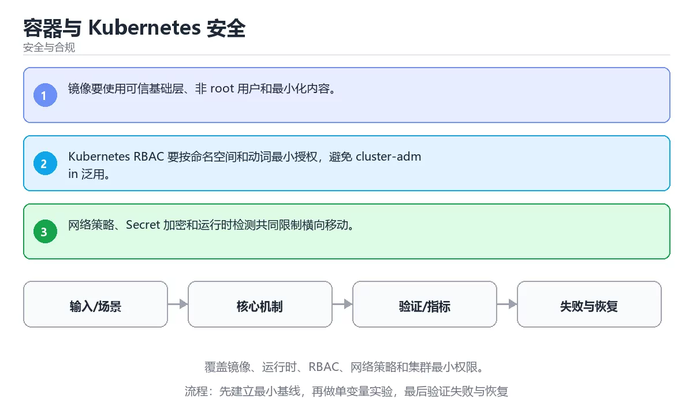

# 容器与 Kubernetes 安全



> 内容更新时间：2026-10-03 · 学习阶段：高级 · 预计用时：25 分钟

## 学习目标

- 能用自己的话解释：镜像要使用可信基础层、非 root 用户和最小化内容。
- 能用自己的话解释：Kubernetes RBAC 要按命名空间和动词最小授权，避免 cluster-admin 泛用。
- 能用自己的话解释：网络策略、Secret 加密和运行时检测共同限制横向移动。
- 能把本课知识放回「安全与合规」，并完成练习与测验。

## 前置知识

- 已完成「安全与合规」的基础课程，能运行正文中的最小示例。
- 本课关键词：容器安全、RBAC、网络策略、运行时。
- 遇到不熟悉的术语先记录问题，完成练习后再回读。

## 核心知识

### 1. 镜像要使用可信基础层、非 root 用户和最小化内容。

- 它解决的问题：把「镜像要使用可信基础层、非 root 用户和最小化内容。」放回真实场景，说明不做它会带来什么后果。
- 关键做法：先用最小示例建立基线，再逐步加入边界、失败和性能条件。
- 验证标准：结果可复现、错误可解释、边界有测试、失败能恢复。

### 2. Kubernetes RBAC 要按命名空间和动词最小授权，避免 cluster-admin 泛用。

- 它解决的问题：把「Kubernetes RBAC 要按命名空间和动词最小授权，避免 cluster-admin 泛用。」放回真实场景，说明不做它会带来什么后果。
- 关键做法：先用最小示例建立基线，再逐步加入边界、失败和性能条件。
- 验证标准：结果可复现、错误可解释、边界有测试、失败能恢复。

### 3. 网络策略、Secret 加密和运行时检测共同限制横向移动。

- 它解决的问题：把「网络策略、Secret 加密和运行时检测共同限制横向移动。」放回真实场景，说明不做它会带来什么后果。
- 关键做法：先用最小示例建立基线，再逐步加入边界、失败和性能条件。
- 验证标准：结果可复现、错误可解释、边界有测试、失败能恢复。

## 关键流程

```text
输入 → 校验 → 核心处理 → 验证 → 记录指标 → 失败恢复
```

## 实践路径

1. 用一句话复述本课要解决的问题。
2. 跑通正文中的最小示例并记录基线。
3. 只改变一个输入或参数，预测并验证结果。
4. 补一个失败路径，记录错误、恢复和指标。
5. 把结论写成可复现的笔记或测试。

## 常见误区

| 误区 | 后果 | 修正 |
| --- | --- | --- |
| 只记术语不做实验 | 遇到真实问题无法判断 | 用最小输入跑通并记录结果 |
| 只测正常路径 | 边界和故障上线才暴露 | 补空值、极值和依赖失败 |
| 没有基线就优化 | 无法证明改进有效 | 先测量再修改 |
| 忽略成本与安全 | 性能和风险失控 | 同时记录资源、权限与失败代价 |

## 动手练习

1. 合上教程，用 3～5 句话解释「容器与 Kubernetes 安全」。
2. 从正文选一个例子，改变一个条件并预测结果。
3. 设计一个失败场景，写出止损与恢复步骤。

**验收标准**：留下输入、命令、输出、差异和下一步问题。

## 本课小结

- 本课属于「安全与合规」，核心关键词是 容器安全、RBAC、网络策略、运行时。
- 先保证正确与可复现，再讨论性能和扩展。
- 完成练习和测验后，把仍然不确定的问题写成下一轮验证清单。

> 本课由 P1 内容扩展生成，重点补充原有课程缺失的主题与工程边界。


## 安全落地补充：容器与 Kubernetes 安全

### 一、资产、边界与信任

先回答：保护哪些数据、谁可以访问、哪些组件是信任边界、攻击者能从哪些入口进入。围绕「容器安全、RBAC、网络策略、运行时」列出至少 3 个入口和对应的最小权限。

### 二、威胁 → 控制 → 验证

| 威胁 | 预防控制 | 检测方式 | 验证证据 |
| --- | --- | --- | --- |
| 输入被污染 | schema、白名单、编码 | 异常输入日志和告警 | 越权与注入测试 |
| 权限过大 | 最小权限、临时凭证 | 权限审计和异常调用 | 权限边界测试 |
| 密钥泄露 | 密钥管理、轮换 | 仓库和日志扫描 | 轮换与影响范围记录 |
| 操作不可追溯 | 结构化审计日志 | 关键动作告警 | 审计查询和复盘 |
| 恢复失败 | 备份、回滚、演练 | 恢复指标监控 | 演练时间与数据校验 |

### 三、上线前安全清单

- [ ] 所有外部输入经过校验和输出编码。
- [ ] 认证、授权和会话失效逻辑有测试。
- [ ] 密钥不进入源码、镜像和日志。
- [ ] 依赖漏洞、许可证和来源已审查。
- [ ] 高风险操作有确认、审计和回滚。
- [ ] 安全事件有联系人和升级路径。

### 四、事件响应演练

构造一次凭证泄露或越权访问，按发现、隔离、轮换、取证、恢复、复盘六步执行，记录时间线和剩余风险。


## 考点精讲：把测验题还原成判断过程

本课有 5 个判断点。先自己作答，再看「判断依据」；如果结论正确但理由不完整，回到正文对应章节补足概念。

### 考点 1：关于「镜像要使用可信基础层、非 root …」，下列说法正确的是？

- **正确判断**：镜像要使用可信基础层、非 root 用户和最小化内容。
- **判断依据**：正确答案是「镜像要使用可信基础层、非 root 用户和最小化内容。」，本课在「本课小结」中说明：本课属于「安全与合规」，核心关键词是 容器安全、RBAC、网络策略、运行时。，本课在「核心知识」中说明：它解决的问题：把镜像要使用可信基础层、非 root 用户和最小化内容。，本课在「核心知识」中说明：它解决的问题：把网络策略、Secret 加密和运行时检测共同限制横向移动。
- **迁移检查**：遮住选项，只根据定义复述一次答案，再回来看哪个选项与复述一致。

### 考点 2：关于「Kubernetes RBAC 要按…」，下列说法正确的是？

- **正确判断**：Kubernetes RBAC 要按命名空间和动词最小授权
- **判断依据**：正确答案是「Kubernetes RBAC 要按命名空间和动词最小授权」，本课在「核心知识」中说明：它解决的问题：把Kubernetes RBAC 要按命名空间和动词最小授权，避免 cluster-admin 泛用。本课还在核心知识中说明：它解决的问题：把网络策略、Secret 加密和运行时检测共同限制横向移动。本课还在「本课小结」中说明：本课属于「安全与合规」，核心关键词是 容器安全、RBAC、网络策略、运行时。
- **迁移检查**：把题干里的一个条件换成边界值，原来的结论还成立吗？写出判断过程。

### 考点 3：关于「网络策略、Secret 加密和运行时…」，下列说法正确的是？

- **正确判断**：网络策略、Secret 加密和运行时检测共同限制横向移动。
- **判断依据**：正确答案是「网络策略、Secret 加密和运行时检测共同限制横向移动。」，本课在「核心知识」中说明：它解决的问题：把镜像要使用可信基础层、非 root 用户和最小化内容。，本课在「核心知识」中说明：它解决的问题：把网络策略、Secret 加密和运行时检测共同限制横向移动。，本课在「本课小结」中说明：本课属于「安全与合规」，核心关键词是 容器安全、RBAC、网络策略、运行时。
- **迁移检查**：遮住选项，只根据定义复述一次答案，再回来看哪个选项与复述一致。

### 考点 4：「容器与 Kubernetes 安全」的核心学习目标是什么？

- **正确判断**：覆盖镜像、运行时、RBAC、网络策略和集群最小权限。
- **判断依据**：正确答案是「覆盖镜像、运行时、RBAC、网络策略和集群最小权限。」，本课在「核心知识」中说明：它解决的问题：把镜像要使用可信基础层、非 root 用户和最小化内容。，本课在核心知识中说明：它解决的问题：把网络策略、Secret 加密和运行时检测共同限制横向移动。
- **迁移检查**：遮住选项，只根据定义复述一次答案，再回来看哪个选项与复述一致。

### 考点 5：以下哪些术语与「容器与 Kubernetes 安全」直接相关？（多选）

- **正确判断**：容器安全、RBAC
- **判断依据**：正确答案是「容器安全、RBAC」，本课在「核心知识」中说明：它解决的问题：把网络策略、Secret 加密和运行时检测共同限制横向移动。课程摘要指出覆盖镜像，运行时，RBAC，网络策略和集群最小权限，本课要判断的正是以下哪些术语与容器与Kubernetes安全直接相关，（多选）。
- **迁移检查**：只选其中一项时会漏掉哪个必要条件？把它补进自己的答案。

## 本课复习清单

离开本课前，逐项确认：

- [ ] 不看解析，能说出「关于「镜像要使用可信基础层、非 root …」，下列说法正确的是？」的判断依据。
- [ ] 不看解析，能说出「关于「Kubernetes RBAC 要按…」，下列说法正确的是？」的判断依据。
- [ ] 不看解析，能说出「关于「网络策略、Secret 加密和运行时…」，下列说法正确的是？」的判断依据。
- [ ] 不看解析，能说出「「容器与 Kubernetes 安全」的核心学习目标是什么？」的判断依据。
- [ ] 不看解析，能说出「以下哪些术语与「容器与 Kubernetes 安全」直接相关？（多选）」的判断依据。
- [ ] 至少运行一次本课示例，记录输入、输出和一个边界情况。
- [ ] 把本课最容易混淆的两个概念写成一句话对照。

| 复盘项 | 记录 |
| --- | --- |
| 已经能独立解释的考点 |  |
| 仍然说不清的概念 |  |
| 下一步验证动作 |  |

## 逐节复习与自检

下面按正文顺序回顾每一节，并给出一个自检问题；说不清的地方回到原章节补课。

### 核心知识

」放回真实场景，说明不做它会带来什么后果。关键做法：先用最小示例建立基线，再逐步加入边界、失败和性能条件。

自检：这一节与相邻主题的边界在哪里？

### 动手练习

合上教程，用 3～5 句话解释「容器与 Kubernetes 安全」。从正文选一个例子，改变一个条件并预测结果。

自检：如果去掉这一节里的一个前提，结论会怎样变化？

### 安全落地补充：容器与 Kubernetes 安全

先回答：保护哪些数据、谁可以访问、哪些组件是信任边界、攻击者能从哪些入口进入。围绕「容器安全、RBAC、网络策略、运行时」列出至少 3 个入口和对应的最小权限。

自检：这一节最常见的失败方式是什么？第一条可观察证据是什么？

### 验证步骤

制造一次错误输入，记录错误信息与修复方式。

自检：如果去掉这一节里的一个前提，结论会怎样变化？

## 深度追问与自测

下面把本课考点换一个角度再问一遍。先合上上一节，写出自己的判断，再对照答案与检查点补全理由。

### 追问 1：关于「镜像要使用可信基础层、非 root …」，下列说法正确的是？

- 先写下判断，再对照：镜像要使用可信基础层、非 root 用户和最小化内容。
- 检查点：如果输入换成边界值，这个结论还需要补充哪个前提？

### 追问 2：关于「Kubernetes RBAC 要按…」，下列说法正确的是？

- 先写下判断，再对照：Kubernetes RBAC 要按命名空间和动词最小授权
- 检查点：如果输入换成边界值，这个结论还需要补充哪个前提？

## 术语速查

把本课反复出现的术语集中放在一起。复习时先遮住右列，尝试用自己的话解释，再回到正文核对。

| 术语 | 本课语境 |
| --- | --- |
| `容器安全` | 本课围绕该主题展开，结合正文与代码示例理解它的适用边界。 |
| `RBAC` | 本课围绕该主题展开，结合正文与代码示例理解它的适用边界。 |
| `网络策略` | 本课围绕该主题展开，结合正文与代码示例理解它的适用边界。 |
| `运行时` | 本课围绕该主题展开，结合正文与代码示例理解它的适用边界。 |

## 面试问答与自测

下面把本课考点换成面试追问。先口述自己的答案，
再对照参考回答检查是否遗漏了前提、边界或失败路径。

### 追问 1：关于「镜像要使用可信基础层、非 root …」，下列说法正确的是？

**参考回答**：正确答案是「镜像要使用可信基础层、非 root 用户和最小化内容。」，本课在「核心知识」中说明：它解决的问题：把镜像要使用可信基础层、非 root 用户和最小化内容。，本课在「深度追问与自测」中说明：先写下判断，再对照：镜像要使用可信基础层、非 root 用户和最小化内容。，本课在「本课小结」中说明：本课属于「安全与合规」，核心关键词是 容器安全、RBAC、网络策略、运行时。

### 追问 2：关于「Kubernetes RBAC 要按…」，下列说法正确的是？

**参考回答**：正确答案是「Kubernetes RBAC 要按命名空间和动词最小授权」，本课在「核心知识」中说明：它解决的问题：把Kubernetes RBAC 要按命名空间和动词最小授权，避免 cluster-admin 泛用。本课还在核心知识中说明：它解决的问题：把网络策略、Secret 加密和运行时检测共同限制横向移动。本课还在「深度追问与自测」中说明：先写下判断，再对照：Kubernetes RBAC 要按命名空间和动词最小授权。

### 追问 3：关于「网络策略、Secret 加密和运行时…」，下列说法正确的是？

**参考回答**：正确答案是「网络策略、Secret 加密和运行时检测共同限制横向移动。」，本课在「核心知识」中说明：它解决的问题：把网络策略、Secret 加密和运行时检测共同限制横向移动。，本课在「本课小结」中说明：本课属于「安全与合规」，核心关键词是 容器安全、RBAC、网络策略、运行时。，本课在「核心知识」中说明：它解决的问题：把镜像要使用可信基础层、非 root 用户和最小化内容。本课还在「深度追问与自测」中说明：先写下判断，再对照：镜像要使用可信基础层、非 root 用户和最小化内容。

### 追问 4：「容器与 Kubernetes 安全」的核心学习目标是什么？

**参考回答**：正确答案是「覆盖镜像、运行时、RBAC、网络策略和集群最小权限。」，本课在「本课小结」中说明：本课属于「安全与合规」，核心关键词是 容器安全、RBAC、网络策略、运行时。，本课在核心知识中说明：它解决的问题：把网络策略、Secret 加密和运行时检测共同限制横向移动。本课还在「核心知识」中说明：它解决的问题：把镜像要使用可信基础层、非 root 用户和最小化内容。

### 追问 5：以下哪些术语与「容器与 Kubernetes 安全」直接相关？（多选）

**参考回答**：正确答案是「容器安全、RBAC」，本课在「本课小结」中说明：本课属于「安全与合规」，核心关键词是 容器安全、RBAC、网络策略、运行时。本课还在「核心知识」中说明：它解决的问题：把网络策略、Secret 加密和运行时检测共同限制横向移动。课程摘要指出覆盖镜像，运行时，RBAC，网络策略和集群最小权限，本课要判断的正是以下哪些术语与容器与Kubernetes安全直接相关，（多选）。

## 深度拓展与实战

这一节把正文里的定义、代码和失败模式串成一条可操作的复习路线。

### 机制拆解

- **1. 镜像要使用可信基础层、非 root 用户和最小化内容。**：1. 镜像要使用可信基础层、非 root 用户和最小化内容
- **2. Kubernetes RBAC 要按命名空间和动词最小授权，避免 cluster-admin 泛用。**：2. Kubernetes RBAC 要按命名空间和动词最小授权，避免 cluster-admin 泛用
- **3. 网络策略、Secret 加密和运行时检测共同限制横向移动。**：3. 网络策略、Secret 加密和运行时检测共同限制横向移动
- **一、资产、边界与信任**：先回答：保护哪些数据、谁可以访问、哪些组件是信任边界、攻击者能从哪些入口进入
- **二、威胁 → 控制 → 验证**：二、威胁 → 控制 → 验证

### 边界条件与常见反例

- **关于「镜像要使用可信基础层、非 root …」，下列说法正确的是？**：正确答案是「镜像要使用可信基础层、非 root 用户和最小化内容。」，本课在「核心知识」中说明：它解决的问题：把镜像要使用可信基础层、非 root 用户和最小化内容。，本课在「深度追问与自测」中说明：先写下判断，再对照：镜像要使用可信基础层、非 root 用户和最小化内容。，本课在「本课小结」中说明：本课属于「安全与合规」，核心关键词是 容器安全、RBAC、网络策略、运行时。
- **关于「Kubernetes RBAC 要按…」，下列说法正确的是？**：正确答案是「Kubernetes RBAC 要按命名空间和动词最小授权」，本课在「核心知识」中说明：它解决的问题：把Kubernetes RBAC 要按命名空间和动词最小授权，避免 cluster-admin 泛用。本课还在核心知识中说明：它解决的问题：把网络策略、Secret 加密和运行时检测共同限制横向移动。本课还在「深度追问与自测」中说明：先写下判断，再对照：Kubernetes RBAC 要按命名空间和动词最小授权。
- **关于「网络策略、Secret 加密和运行时…」，下列说法正确的是？**：正确答案是「网络策略、Secret 加密和运行时检测共同限制横向移动。」，本课在「核心知识」中说明：它解决的问题：把网络策略、Secret 加密和运行时检测共同限制横向移动。，本课在「本课小结」中说明：本课属于「安全与合规」，核心关键词是 容器安全、RBAC、网络策略、运行时。，本课在「核心知识」中说明：它解决的问题：把镜像要使用可信基础层、非 root 用户和最小化内容。本课还在「深度追问与自测」中说明：先写下判断，再对照：镜像要使用可信基础层、非 root 用户和最小化内容。
- **「容器与 Kubernetes 安全」的核心学习目标是什么？**：正确答案是「覆盖镜像、运行时、RBAC、网络策略和集群最小权限。」，本课在「本课小结」中说明：本课属于「安全与合规」，核心关键词是 容器安全、RBAC、网络策略、运行时。，本课在核心知识中说明：它解决的问题：把网络策略、Secret 加密和运行时检测共同限制横向移动。本课还在「核心知识」中说明：它解决的问题：把镜像要使用可信基础层、非 root 用户和最小化内容。

### 工程检查表

- [ ] 能否用自己的话说明容器与 Kubernetes 安全解决什么问题，以及它不负责什么？
- [ ] 能否指出最小可运行示例的输入、输出和一条失败路径？
- [ ] 能否解释本课关键词在真实项目中的边界与取舍？
- [ ] 能否把本课方法迁移到另一个相近问题，并说明需要改什么？

### 迁移练习

1. 保持正文示例不变，写出它的输入、处理步骤和预期输出。
2. 只改变一个条件，预测结果并说明依据；再运行或手算验证。
3. 结合容器安全、RBAC、网络策略、运行时，写出一个真实项目中的使用场景。
4. 写下一个反例，说明它在什么条件下会使朴素做法失效。


## English Overview

**Title:** Container and Kubernetes Security

**Summary:** Cover image, runtime, RBAC, network policy and least privilege.

**Category:** Security & Compliance  
**Level:** 高级  
**Key terms:** 容器安全, RBAC, 网络策略, 运行时

> The full tutorial is written in Chinese. This bilingual overview helps English readers identify the topic, scope and key terms before studying the detailed examples.

## 内容元数据

- 内容版本：v2.0
- 最后更新：2026-10-03
- 学习阶段：高级
- 适用环境：OWASP、云原生与合规安全实践
- 内容来源：内置结构化课程与工程实践整理
- 相关主题：容器安全、RBAC、网络策略、运行时
- 质量版本：P0 测验标准 + P1 覆盖扩展 + P2 体验补全


## 最小可运行示例

下面示例用于验证「容器与 Kubernetes 安全」的最小输入、处理和输出。先原样运行，再只修改一个值：

```python
import hashlib

digest = hashlib.sha256(b"password").hexdigest()
print(digest[:12])
```

## 预期输出

```text
5e884898da28
```

## 验证步骤

1. 记录运行环境、命令和真实输出。
2. 修改一个输入，先写预测再运行。
3. 制造一次错误输入，记录错误信息与修复方式。
4. 把结论写回本课笔记或测试用例。


## 参考资料与复核

- 最后复核：2026-10-04
- 下次复核：2027-04-04
- 复核范围：版本兼容、API 行为、安全建议与工程实践
- 来源性质：官方文档与标准；本课正文为离线教学重组，不复制原文

| 参考资料 | 本课用途 |
| --- | --- |
| [OWASP Cheat Sheets](https://cheatsheetseries.owasp.org/) | 应用安全实践 |
| [NIST Cybersecurity](https://www.nist.gov/cyberframework) | 风险治理框架 |

> 本课主题：覆盖镜像、运行时、RBAC、网络策略和集群最小权限。

> App 完全离线展示文字链接，不会自动联网；需要延伸阅读时可复制链接到浏览器。
