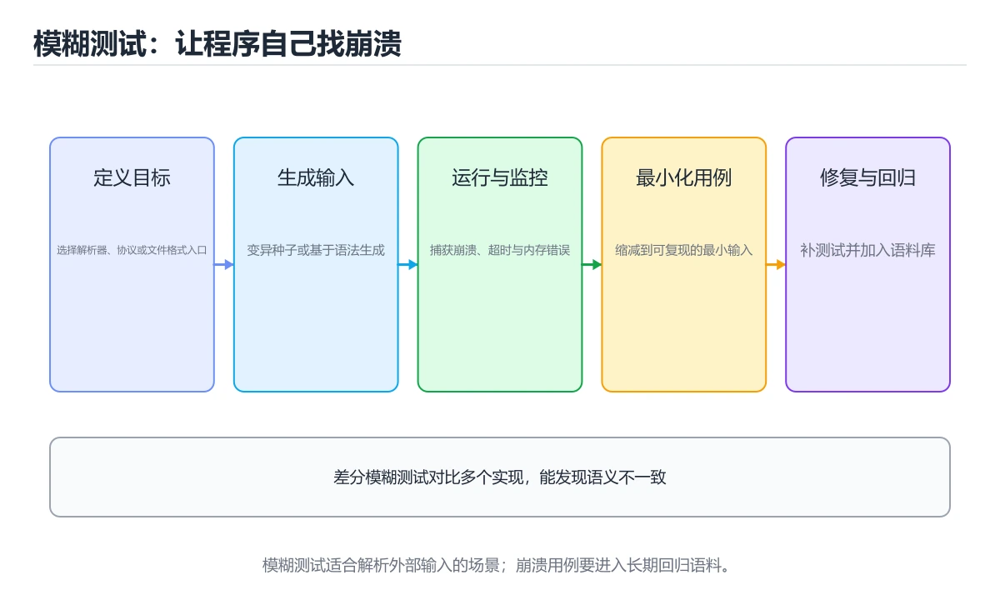
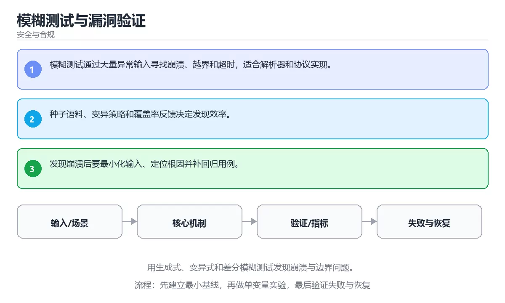

# 模糊测试与漏洞验证

> 内容更新时间：2026-10-06 · 学习阶段：高级 · 预计用时：30 分钟





## 学习目标

- 能用自己的话解释：模糊测试通过大量异常输入寻找崩溃、越界和超时，适合解析器和协议实现。
- 能用自己的话解释：种子语料、变异策略和覆盖率反馈决定发现效率。
- 能用自己的话解释：发现崩溃后要最小化输入、定位根因并补回归用例。
- 能把本课知识放回「安全与合规」，并完成练习与测验。

## 前置知识

- 已完成本分类的基础课程，能独立运行 模糊测试 的最小示例。
- 本课关键词：模糊测试、边界、崩溃、覆盖率。
- 遇到不熟悉的术语先记录问题，完成练习后再回读。

## 核心知识

### 1. 模糊测试通过大量异常输入寻找崩溃、越界和超时，适合解析器和协议实现。

- 关键做法：基线只保留 边界 必需的部分，其余条件一次加一个。
- 验证标准：e884898da28 的输出能被他人复现，边界输入有对应用例。

### 2. 种子语料、变异策略和覆盖率反馈决定发现效率。

把这条结论放回「模糊测试与漏洞验证」的完整流程里展开：

- 正文依据：能用自己的话解释：模糊测试通过大量异常输入寻找崩溃、越界和超时，适合解析器和协议实现。
- 落地检查：把「2. 种子语料、变异策略和覆盖率反馈决定发现效率。」改写成一条可执行的核对项，逐条验证输入、超时与失败路径。

### 3. 发现崩溃后要最小化输入、定位根因并补回归用例。

把这条结论放回「模糊测试与漏洞验证」的完整流程里展开：

- 正文依据：能用自己的话解释：种子语料、变异策略和覆盖率反馈决定发现效率。
- 落地检查：把「3. 发现崩溃后要最小化输入、定位根因并补回归用例。」改写成一条可执行的核对项，逐条验证输入、超时与失败路径。

## 关键流程

```text
输入 → 校验 → 核心处理 → 验证 → 记录指标 → 失败恢复
```

## 实践路径

1. 用一句话复述本课要解决的问题。
2. 跑通正文中的最小示例并记录基线。
3. 只改变一个输入或参数，预测并验证结果。
4. 补一个失败路径，记录错误、恢复和指标。
5. 把结论写成可复现的笔记或测试。

## 常见错误与排查

> 说明：本表由《模糊测试与漏洞验证》的核心知识整理（2026-10-07），人工复核进度见 docs/content_review_batches.md。

| 易错点 | 容易踩的做法 | 正确结论 |
| --- | --- | --- |
| 只做纯随机输入 | 覆盖率低，深层问题挖不出来 | 使用覆盖率引导的模糊测试 |
| 不保存崩溃样本 | 问题无法复现也无法回归 | 保存崩溃输入并纳入回归用例 |
| 没有时间与资源上限 | 测试拖垮环境 | 设置超时与内存上限，隔离运行 |

## 动手练习

1. 合上教程，用 3～5 句话解释模糊测试与漏洞验证。
2. 从正文选一个例子，改变一个条件并预测结果。
3. 设计一个失败场景，写出止损与恢复步骤。

**验收标准**：留下输入、命令、输出、差异和下一步问题。

## 本课小结

- 本课围绕 模糊测试、边界、崩溃、覆盖率 展开，复习时重点核对它们的输入、输出和失败路径。
- 做完本课测验后，把答错且解释不清的 边界 相关题目记成验证任务。


## 安全落地补充：模糊测试与漏洞验证

### 一、资产、边界与信任

先回答：保护哪些数据、谁可以访问、哪些组件是信任边界、攻击者能从哪些入口进入。围绕「模糊测试、边界、崩溃、覆盖率」列出至少 3 个入口和对应的最小权限。

### 二、威胁 → 控制 → 验证

| 威胁 | 预防控制 | 检测方式 | 验证证据 |
| --- | --- | --- | --- |
| 输入被污染 | schema、白名单、编码 | 异常输入日志和告警 | 越权与注入测试 |
| 权限过大 | 最小权限、临时凭证 | 权限审计和异常调用 | 权限边界测试 |
| 密钥泄露 | 密钥管理、轮换 | 仓库和日志扫描 | 轮换与影响范围记录 |
| 操作不可追溯 | 结构化审计日志 | 关键动作告警 | 审计查询和复盘 |
| 恢复失败 | 备份、回滚、演练 | 恢复指标监控 | 演练时间与数据校验 |

### 三、上线前安全清单

- [ ] 所有外部输入经过校验和输出编码。
- [ ] 认证、授权和会话失效逻辑有测试。
- [ ] 密钥不进入源码、镜像和日志。
- [ ] 依赖漏洞、许可证和来源已审查。
- [ ] 高风险操作有确认、审计和回滚。
- [ ] 安全事件有联系人和升级路径。

### 四、事件响应演练

围绕「模糊测试与漏洞验证」构造一次 模糊测试 相关的越权或泄露场景，按发现、隔离、轮换、取证、恢复、复盘六步执行，记录时间线与剩余风险。

## 可运行练习

### 任务 1：先跑通，再解释

```python
import hashlib

digest = hashlib.sha256(b"password").hexdigest()
print(digest[:12])
```

### 任务 2：只改一个条件

把「模糊测试与漏洞验证」的最小示例复制一份，只改一个条件再跑一次：

- 改动点：只调整 e884898da28 的一个参数，其余条件一律不动。
- 预测：先写下「模糊测试与漏洞验证」在改动后的输出或错误信息，再运行。
- 记录：对照改动前后的结果，指出差异出在哪一步。
- 验收：换回原条件能复现原结果，改动只影响模糊测试。

### 任务 3：迁移到自己的数据

用同一套思路处理一组你自己的 模糊测试 数据，保持输出格式与任务 1 一致。

## 故障现场

### 现场 1：只做纯随机输入

**症状**：在《模糊测试与漏洞验证》的复现场景中，覆盖率低，深层问题挖不出来。

**根因**：“覆盖率低，深层问题挖不出来”只是表层结果。向上追溯会落到“只做纯随机输入”这一步，因为它省略了《模糊测试与漏洞验证》的约束，使实现行为和预期模型发生了偏离。

**修复**：针对《模糊测试与漏洞验证》的问题，使用覆盖率引导的模糊测试。

**验证**：保留《模糊测试与漏洞验证》里触发“覆盖率低，深层问题挖不出来”的输入、版本和日志，按“使用覆盖率引导的模糊测试”完成修改后原样重放；只有失败现象消失且相邻场景仍可解释，才保留改动。

### 现场 2：不保存崩溃样本

**症状**：在《模糊测试与漏洞验证》的复现场景中，问题无法复现也无法回归。

**根因**：当出现“不保存崩溃样本”时，执行路径已经绕过了《模糊测试与漏洞验证》的关键约束，最终以“问题无法复现也无法回归”暴露出来；修复前必须先确认约束在哪里失效。

**修复**：针对《模糊测试与漏洞验证》的问题，保存崩溃输入并纳入回归用例。

**验证**：在《模糊测试与漏洞验证》中按“保存崩溃输入并纳入回归用例”调整后，从“不保存崩溃样本”的触发条件重放同一条路径，确认“问题无法复现也无法回归”不再出现，并补一个相邻边界用例检查没有引入新问题。

### 现场 3：没有时间与资源上限

**症状**：在《模糊测试与漏洞验证》的复现场景中，测试拖垮环境。

**根因**：“测试拖垮环境”只是表层结果。向上追溯会落到“没有时间与资源上限”这一步，因为它省略了《模糊测试与漏洞验证》的约束，使实现行为和预期模型发生了偏离。

**修复**：针对《模糊测试与漏洞验证》的问题，设置超时与内存上限，隔离运行。

**验证**：在《模糊测试与漏洞验证》中按“设置超时与内存上限，隔离运行”调整后，从“没有时间与资源上限”的触发条件重放同一条路径，确认“测试拖垮环境”不再出现，并补一个相邻边界用例检查没有引入新问题。

## 本课复习清单


离开本课前，逐项确认：

- [ ] 不看解析，能说出「阅读「模糊测试与漏洞验证」正文里的这段 Python 代码，下面哪一项判断是正确的？」的判断依据。
- [ ] 不看解析，能说出「关于「种子语料、变异策略和覆盖率反馈决定发现效率。」，下列说法正确的是？」的判断依据。
- [ ] 不看解析，能说出「关于「发现崩溃后要最小化输入、定位根因并补回归用例。」，下列说法正确的是？」的判断依据。
- [ ] 至少运行一次《模糊测试与漏洞验证》的示例，记录输入、输出和一个边界情况。
- [ ] 把本课最容易混淆的两个概念写成一句话对照。

| 复盘项 | 记录 |
| --- | --- |
| 已经能独立解释的考点 |  |
| 仍然说不清的概念 |  |
| 下一步验证动作 |  |

## 复习与自测

下面按正文顺序回顾「模糊测试与漏洞验证」的每一节；说不清的地方回到 核心知识 补课。

### 核心知识

自检：这一节与相邻主题的边界在哪里？

### 动手练习

自检：如果去掉这一节里的一个前提，结论会怎样变化？

### 安全落地补充：模糊测试与漏洞验证

自检：用自己的话复述这一节，并举一个反例。

### 验证步骤

制造一次错误输入，记录错误信息与修复方式。

## 术语速查

| 术语 | 一句话说明 |
| --- | --- |
| `模糊测试` | 模糊测试通过大量异常输入寻找崩溃、越界和超时，适合解析器和协议实现。 |
| `边界` | 输入取值、容量或时序上的临界条件，通常是最容易出现错误的分界。 |
| `崩溃` | 按“模糊测试与漏洞验证”中 模糊测试、边界、崩溃 的实践顺序，把四个步骤排成从准备到复盘的合理顺序。 |
| `覆盖率` | 测试执行到的代码、分支或需求占总量的比例。 |

## 深度拓展与实战

这一节把 模糊测试 的定义、e884898da28 的代码与常见失败串成一条复习路线。

### 机制拆解

- **1. 模糊测试通过大量异常输入寻找崩溃、越界和超时，适合解析器和协议实现。**：在「模糊测试与漏洞验证」里，「1. 模糊测试通过大量异常输入寻找崩溃、越界和超时，适合解析器和协议实现。」这一步要先写清输入与预期，再记录实际结果和差异；结果不符时回到对应小节核对前提。
- **2. 种子语料、变异策略和覆盖率反馈决定发现效率。**：在「模糊测试与漏洞验证」里，「2. 种子语料、变异策略和覆盖率反馈决定发现效率。」这一步要先写清输入与预期，再记录实际结果和差异；结果不符时回到对应小节核对前提。
- **3. 发现崩溃后要最小化输入、定位根因并补回归用例。**：在「模糊测试与漏洞验证」里，「3. 发现崩溃后要最小化输入、定位根因并补回归用例。」这一步要先写清输入与预期，再记录实际结果和差异；结果不符时回到对应小节核对前提。
- 一、资产、边界与信任：列出 e884898da28 涉及的资产、信任边界与入口。
- **二、威胁 → 控制 → 验证**：在「模糊测试与漏洞验证」里，「二、威胁 → 控制 → 验证」这一步要先写清输入与预期，再记录实际结果和差异；结果不符时回到对应小节核对前提。

### 边界条件与常见反例

「模糊测试与漏洞验证」的边界不只包括最大最小值，还要覆盖空、重复和失败：

| 条件 | 常见反例 | 处理方式 |
| --- | --- | --- |
| 空输入 | 模糊测试 没有任何取值 | 先判空，给出明确错误而不是继续执行 |
| 边界值 | 边界 取最小或最大 | 用最小值、最大值和越界值各跑一次 |
| 重复执行 | 同一输入被执行两次 | 保证结果可重复，必要时加锁或去重 |
| 失败路径 | 模糊测试 相关步骤报错 | 保留原始错误，确认回滚或重试行为 |

### 工程检查表

- [ ] 能否用自己的话说明模糊测试与漏洞验证解决什么问题，以及它不负责什么？
- [ ] 能否用「模糊测试与漏洞验证」的最小示例复现一次失败并解释原因？
- [ ] 能否解释本课关键词在真实项目中的边界与取舍？
- [ ] 换一个输入后，e884898da28 的判断依据是否仍然成立？

### 迁移练习

1. 保持正文示例不变，写出它的输入、处理步骤和预期输出。
2. 只改变 模糊测试 的一个条件，预测结果并说明依据；再运行或手算验证。
3. 结合模糊测试、边界、崩溃、覆盖率，写出一个真实项目中的使用场景。
4. 写下一个反例，说明它在什么条件下会使朴素做法失效。

<!-- p0-depth-v2:start -->

## 零基础精讲：把模糊测试与漏洞验证真正讲透

### 先建立一个直觉

把「模糊测试与漏洞验证」看成一条防线：先识别资产与威胁，再围绕 模糊测试 限制权限、验证输入、记录审计，并为失败准备隔离与恢复方案。

本课的摘要可以当作一张地图：用生成式、变异式和差分模糊测试发现崩溃与边界问题。

### 逐步拆解

1. 澄清输入与目标。先写清「模糊测试与漏洞验证」要解决的问题、合法输入范围和成功标准，再进入后续步骤。
2. 描述处理过程。把「模糊测试、边界、崩溃、覆盖率」映射到具体步骤，每步都要求能单独验证。
3. 定义输出。明确 模糊测试 与 边界 各自的产物，以及失败时留下什么证据。
4. 制造一次边界的失败输入，确认错误出现在「核心知识」的哪一步，并写下恢复后如何验证状态已回到一致。
5. 把 e884898da28 的规模缩小到一眼能算清的程度，手动推导结果后再用程序验证，差异处就是理解漏洞。

### 把正文串成一条执行链

- 三、上线前安全清单：- [ ] e884898da28 的输入校验与输出编码都已落实

### 从测验反推易错点

**检查点 1：关于「模糊测试通过大量异常输入寻找崩溃、越界和超时，适合解析器和协议实现。」，下列说法正确的是？**

- 参考判断：模糊测试通过大量异常输入寻找崩溃、越界和超时，适合解析器和协议实现。
- 自问：如果去掉题干里的一个限定词，结论还成立吗？

**检查点 2：关于「种子语料、变异策略和覆盖率反馈决定发现效率。」，下列说法正确的是？**

- 参考判断：种子语料、变异策略和覆盖率反馈决定发现效率。

**检查点 3：关于「发现崩溃后要最小化输入、定位根因并补回归用例。」，下列说法正确的是？**

- 参考判断：发现崩溃后要最小化输入、定位根因并补回归用例。

**检查点 4：本课的核心学习目标是什么？**

- 参考判断：用生成式、变异式和差分模糊测试发现崩溃与边界问题。

**检查点 5：以下哪些术语与模糊测试与漏洞验证直接相关？（多选）**

- 参考判断：模糊测试、边界

### 工程排错顺序

| 先查什么 | 要得到的证据 | 判断标准 |
| --- | --- | --- |
| 资产、威胁和行为主体是否明确？ | 日志、输入样例、测试或指标 | 能复现并解释，才算定位 |
| 权限是否默认拒绝并最小化？ | 日志、输入样例、测试或指标 | 能复现并解释，才算定位 |
| 输入、输出与审计是否都有控制？ | 日志、输入样例、测试或指标 | 能复现并解释，才算定位 |
| 发现绕过时能否快速隔离和恢复？ | 日志、输入样例、测试或指标 | 能复现并解释，才算定位 |

### 变式训练

1. 把 模糊测试 的实现压缩到一个进程内，去掉所有外部依赖后再谈扩展。
2. 把 e884898da28 的数据量提高一个数量级，观察延迟与内存的变化拐点。
3. 让 e884898da28 的外部依赖超时，确认系统能回滚或补偿，而不是留下脏数据。
5. 把 模糊测试 的一个前提改成不成立，说明本课哪条结论先失效。
6. 把 模糊测试 的方案切换到低资源设备，重新评估默认参数、超时和降级策略。

### 本课自测

- [ ] 能用一句话解释「模糊测试」在本课中的角色与边界。
- [ ] 能举出一个正常例子和一个失败例子。
- [ ] 能说出最小验证步骤，以及需要记录的证据。
- [ ] 能用一句话解释「边界」在本课中的角色与边界。
- [ ] 能用一句话解释「崩溃」在本课中的角色与边界。
- [ ] 能用一句话解释「覆盖率」在本课中的角色与边界。

### 迁移案例库

下面用不同约束重复同一套方法，每轮只改变 模糊测试 的一个取值并记录结论。

#### 迁移案例 1：围绕「模糊测试」做一次小实验

**目标**：在不改变课程主体的前提下，验证模糊测试与漏洞验证中的一个关键判断。

**步骤**：
1. 复述当前方案对「模糊测试」的假设，写成一句可证伪的话。
2. 设计一个正常输入和一个边界输入，分别预测输出。
3. 运行或逐步演算，记录实际输出、耗时和失败信息。
4. 只调整一个参数，比较前后差异并解释原因。
5. 补充一条测试或复习卡，确保下次能更快复现。

**验收**：结论要能追溯到正文的具体小节与代码位置，并记录边界相关的指标变化。

#### 迁移案例 2：围绕「边界」做一次小实验

**步骤**：
1. 复述当前方案对「边界」的假设，写成一句可证伪的话。

#### 迁移案例 3：围绕「崩溃」做一次小实验

**步骤**：
1. 复述当前方案对「崩溃」的假设，写成一句可证伪的话。

#### 迁移案例 4：围绕「覆盖率」做一次小实验

**步骤**：
1. 复述当前方案对「覆盖率」的假设，写成一句可证伪的话。

#### 迁移案例 5：围绕「模糊测试」做一次小实验

**步骤**：

#### 迁移案例 6：围绕「边界」做一次小实验

**步骤**：

#### 迁移案例 7：围绕「崩溃」做一次小实验

**步骤**：

#### 迁移案例 8：围绕「覆盖率」做一次小实验

**步骤**：

#### 迁移案例 9：围绕「模糊测试」做一次小实验

**步骤**：

#### 迁移案例 10：围绕「边界」做一次小实验

**步骤**：

#### 迁移案例 11：围绕「崩溃」做一次小实验

**步骤**：

#### 迁移案例 12：围绕「覆盖率」做一次小实验

**步骤**：

#### 迁移案例 13：围绕「模糊测试」做一次小实验

**步骤**：

#### 迁移案例 14：围绕「边界」做一次小实验

**步骤**：

#### 迁移案例 15：围绕「崩溃」做一次小实验

**步骤**：

#### 迁移案例 16：围绕「覆盖率」做一次小实验

**步骤**：

<!-- p0-depth-v2:end -->

## 考点精讲

### 考点 1：代码补全·模糊测试

- **题目**：阅读「模糊测试与漏洞验证」正文里的这段 Python 代码，下面哪一项判断是正确的？
- **判断依据**：在「模糊测试与漏洞验证」里，题干的正确项是这段代码会产生可观察的输出，运行后能看到结果，在「模糊测试与漏洞验证」里要结合模糊测试核对输出是否符合预期。把输入或边界换成空值、极值或失败情况后，结论要以「模糊测试与漏洞验证」的实际运行结果为准。把“这段代码会产生可观察的输出”代回「模糊测试与漏洞验证」里“阅读模糊测试与漏洞验证正文里的这段 Python 代码”的例子核对，条件一旦改变，结论就要用模糊测试、边界、崩溃重新推导。

### 考点 2：概念判断·模糊测试

- **题目**：关于「种子语料、变异策略和覆盖率反馈决定发现效率。」，下列说法正确的是？
- **判断依据**：在「模糊测试与漏洞验证」里，种子语料、变异策略和覆盖率反馈决定发现效率。这道题的关键在「模糊测试与漏洞验证」的模糊测试、边界、崩溃：先确认题干“关于种子语料、变异策略和覆盖率反馈决”问的是哪一步，再排除偷换前提的选项。把“种子语料、变异策略和覆盖率反馈决定发现效”代回「模糊测试与漏洞验证」里“种子语料、变异策略和覆盖率反馈决定发现效率”的例子核对，条件一旦改变，结论就要用模糊测试、边界、崩溃重新推导。

### 考点 3：概念判断·模糊测试

- **题目**：关于「发现崩溃后要最小化输入、定位根因并补回归用例。」，下列说法正确的是？
- **判断依据**：在「模糊测试与漏洞验证」里，发现崩溃后要最小化输入、定位根因并补回归用例。这道题的关键在「模糊测试与漏洞验证」的模糊测试、边界、崩溃：先确认题干“关于发现崩溃后要最小化输入、定位根因”问的是哪一步，再排除偷换前提的选项。把“发现崩溃后要最小化输入”代回「模糊测试与漏洞验证」里“发现崩溃后要最小化输入、定位根因并补回归用例”的例子核对，条件一旦改变，结论就要用模糊测试、边界、崩溃重新推导。

### 考点 4：顺序排列·模糊测试

- **题目**：按“模糊测试与漏洞验证”中 模糊测试、边界、崩溃 的实践顺序，把四个步骤排成从准备到复盘的合理顺序。
- **判断依据**：在「模糊测试与漏洞验证」里，在本课的练习里，顺序应当是：先明确 模糊测试 的输入、输出与约束 → 写出最小示例并核对 边界 的基线结果 → 只改一个变量，记录边界与失败路径的变化 → 固定版本与证据，把本课的结论写成可复现记录。这个顺序把 模糊测试 的输入、输出和约束放在最前面，在模糊测试与漏洞验证里避免概念没对齐就开始调参。第二步用 边界 建立可核对的基线，在模糊测试与漏洞验证里第三步才允许改变一个变量并观察失败路径。

### 考点 5：多选辨析·模糊测试

- **题目**：以下哪些术语与「模糊测试与漏洞验证」直接相关？（多选）
- **判断依据**：在「模糊测试与漏洞验证」里，边界。回到「模糊测试与漏洞验证」的正文示例，用“以下哪些术语与模糊测试与漏洞验证直接”走一遍模糊测试、边界、崩溃的完整流程，能复现的结论才可以保留。回到正文示例，用“以下哪些术语与直接相关（多选）”走一遍模糊测试、边界、崩溃的完整流程，能复现的结论才可以保留。

## English Overview

**Title:** Fuzzing and Vulnerability Validation

**Summary:** Find crashes and boundary bugs with generative, mutation and differential fuzzing.

**Category:** Security & Compliance
**Level:** 高级
**Key terms:** 模糊测试, 边界, 崩溃, 覆盖率

## 内容元数据

- 内容版本：v2.0
- 最后更新：2026-10-06
- 学习阶段：高级
- 适用环境：OWASP、云原生与合规安全实践；本课聚焦 模糊测试。
- 内容来源：内置结构化课程与工程实践整理
- 相关主题：模糊测试、边界、崩溃、覆盖率
- 质量版本：P0 测验标准 + P1 覆盖扩展 + P2 体验补全

## 最小可运行示例

先用下面的示例确认 模糊测试 的基线，再只改一个与 边界 相关的值：

```python
import hashlib

digest = hashlib.sha256(b"password").hexdigest()
print(digest[:12])
```

## 预期输出

```text
5e884898da28
```

## 验证步骤

1. 记录运行环境、命令和真实输出。
2. 修改一个输入，先写预测再运行。
4. 把结论写回本课笔记或测试用例。

## 参考资料与复核

- 最后复核：2026-10-04
- 下次复核：2026-11-17
- 复核范围：版本兼容、API 行为、安全建议与工程实践
- 来源性质：官方文档、标准或权威教材；正文为离线教学重组

| 参考资料 | 本课用途 |
| --- | --- |
| [CWE 弱点列表](https://cwe.mitre.org/) | 软件弱点分类 |
| [PortSwigger Web Security Academy](https://portswigger.net/web-security) | 漏洞原理与实验 |
| [NIST 密码标准](https://csrc.nist.gov/projects/cryptographic-standards-and-guidelines) | 密码算法与协议 |

> 「模糊测试与漏洞验证」的链接用于离线阅读后的延伸核对；App 不会自动联网。

## 复习与迁移

复习目标：把「模糊测试与漏洞验证」的判断标准放回可复现的例子里。先自己作答，再对照依据；如果结论正确但理由不完整，回到正文补足前提。

### 概念复述

- 用一句话说明「模糊测试与漏洞验证」解决什么问题：用生成式、变异式和差分模糊测试发现崩溃与边界问题。
- 写出模糊测试、边界、崩溃之间的关系，并各举一个例子。
- 说出本课最容易混淆的两个概念，以及区分它们的判据。

### 正文逐节复核

- **安全落地补充：模糊测试与漏洞验证**：先回答：保护哪些数据、谁可以访问、哪些组件是信任边界、攻击者能从哪些入口进入。
- **零基础精讲：把模糊测试与漏洞验证真正讲透**：本课的摘要可以当作一张地图：用生成式、变异式和差分模糊测试发现崩溃与边界问题。

### 测验回顾

1. 阅读「模糊测试与漏洞验证」正文里的这段 Python 代码，下面哪一项判断是正确的？
   - 依据：在「模糊测试与漏洞验证」里，题干的正确项是这段代码会产生可观察的输出，运行后能看到结果，在「模糊测试与漏洞验证」里要结合模糊测试核对输出是否符合预期。把输入或边界换成空值、极值或失败情况后，结论要以「模糊测试与漏洞验证」的实际运行结果为准。把“这段代码会产生可观察的输出”代回「模糊测试与漏洞验证」里“阅读模糊测试与漏洞验证正文里的这段 Python 代码”的例子核对，条件一旦改变，结论就要用模糊测试、边界、崩溃重新推导。
2. 关于「种子语料、变异策略和覆盖率反馈决定发现效率。」，下列说法正确的是？
   - 依据：在「模糊测试与漏洞验证」里，种子语料、变异策略和覆盖率反馈决定发现效率。这道题的关键在「模糊测试与漏洞验证」的模糊测试、边界、崩溃：先确认题干“关于种子语料、变异策略和覆盖率反馈决”问的是哪一步，再排除偷换前提的选项。把“种子语料、变异策略和覆盖率反馈决定发现效”代回「模糊测试与漏洞验证」里“种子语料、变异策略和覆盖率反馈决定发现效率”的例子核对，条件一旦改变，结论就要用模糊测试、边界、崩溃重新推导。
3. 关于「发现崩溃后要最小化输入、定位根因并补回归用例。」，下列说法正确的是？
   - 依据：在「模糊测试与漏洞验证」里，发现崩溃后要最小化输入、定位根因并补回归用例。这道题的关键在「模糊测试与漏洞验证」的模糊测试、边界、崩溃：先确认题干“关于发现崩溃后要最小化输入、定位根因”问的是哪一步，再排除偷换前提的选项。把“发现崩溃后要最小化输入”代回「模糊测试与漏洞验证」里“发现崩溃后要最小化输入、定位根因并补回归用例”的例子核对，条件一旦改变，结论就要用模糊测试、边界、崩溃重新推导。
4. 按“模糊测试与漏洞验证”中 模糊测试、边界、崩溃 的实践顺序，把四个步骤排成从准备到复盘的合理顺序。
   - 依据：在「模糊测试与漏洞验证」里，在本课的练习里，顺序应当是：先明确 模糊测试 的输入、输出与约束 → 写出最小示例并核对 边界 的基线结果 → 只改一个变量，记录边界与失败路径的变化 → 固定版本与证据，把本课的结论写成可复现记录。这个顺序把 模糊测试 的输入、输出和约束放在最前面，在模糊测试与漏洞验证里避免概念没对齐就开始调参。第二步用 边界 建立可核对的基线，在模糊测试与漏洞验证里第三步才允许改变一个变量并观察失败路径。
5. 以下哪些术语与「模糊测试与漏洞验证」直接相关？（多选）
   - 依据：在「模糊测试与漏洞验证」里，边界。回到「模糊测试与漏洞验证」的正文示例，用“以下哪些术语与模糊测试与漏洞验证直接”走一遍模糊测试、边界、崩溃的完整流程，能复现的结论才可以保留。回到正文示例，用“以下哪些术语与直接相关（多选）”走一遍模糊测试、边界、崩溃的完整流程，能复现的结论才可以保留。

### 迁移练习

把「模糊测试与漏洞验证」的结论迁移到相邻主题，每次迁移都写清预测与证据：

1. 换输入：用模糊测试处理一组你自己的数据，对比教材示例的结果差异。
2. 换失败条件：制造一个边界相关的错误，说明如何从错误信息定位根因。
3. 换规模：把数据量或并发度提高一个数量级，说明「模糊测试与漏洞验证」的结论是否仍成立。
