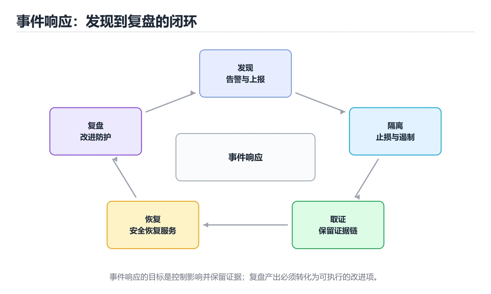
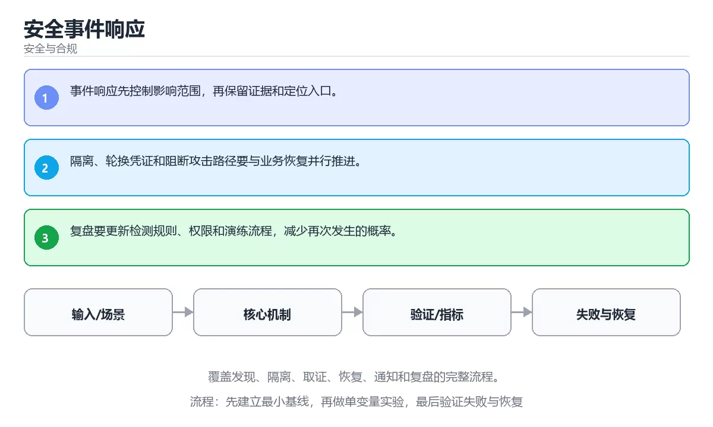

# 安全事件响应

> 内容更新时间：2026-10-06 · 学习阶段：高级 · 预计用时：40 分钟





## 本节知识框架

**课程定位**：所属分类 `security`（安全与合规），课程主题 `安全事件响应`，学习阶段 高级，建议用时 40 分钟。

本课主线：覆盖发现、隔离、取证、恢复、通知和复盘的完整流程。

**学完本课应当能够**
- 说清 `事件响应` 与 `隔离` 的含义与区别，并各举一个正例和一个反例。
- 用本课示例验证 `取证` 的行为，记录输入、输出与失败条件。
- 遇到「先清理现场再分析」这类问题时，能说出触发条件与修复顺序。

### 从概念到验证的学习链条

1. `事件响应`：先掌握 安全事件发生后进行确认、遏制、清除、恢复和复盘，再用它解释 `隔离` 为什么会出现。
2. `隔离`：先掌握 让不同任务、租户或故障域互不影响，限制资源共享和错误传播，再用它解释 `取证` 为什么会出现。
3. `取证`：先掌握 构造一次凭证泄露或越权访问，按发现、隔离、轮换、取证、恢复、复盘六步执行，记录时间线和剩余风险，再用它解释 `时间线` 为什么会出现。
4. `时间线`：先掌握 把告警、日志与处置动作按时间排列，用来确认影响范围与根因，也是复盘的基础，再用它解释 本课示例的观察结果 为什么会出现。

**先修与衔接**：本课是「安全与合规」分类的第 15 课。先修内容：《模糊测试与漏洞验证》。《模糊测试与漏洞验证》里的 `模糊测试`、`边界` 是本课的前提。相关或后续课程：《安全开发生命周期实战》。

### 完成判据

- **定义关**：不看正文也能说明 `事件响应` 是 安全事件发生后进行确认、遏制、清除、恢复和复盘，并指出一个反例。
- **机制关**：能按“输入 → 转换 → 输出 → 验证”复述 `安全事件响应`，而不是只背结论。
- **示例关**：能运行或推演 `安全事件响应` 的 `text` 示例，并说明一个真实出现的标识符或字面量。
- **证据关**：能指出 `安全事件响应` 示例里的 调用了 `sha256()`，并说明它支持或反驳了本课的哪一条结论。
- **排错关**：能复现 先清理现场再分析，记录现象并按 先隔离与取证，再恢复业务 修复。
- **迁移关**：能把 `事件响应`、`隔离`、`取证`、`恢复` 放进一个与 `安全事件响应` 不同的项目场景，并保持输入与验证条件可追踪。
- **复盘关**：学完 `安全事件响应` 后，用一句话写下仍然不确定的结论，并列出下一次验证需要的输入、环境和成功判据。

### 复习清单

- [ ] 能不看正文复述本课核心术语，并指出一个边界或反例。
- [ ] 能运行或推演本课示例，记录输入、输出与失败现象。
- [ ] 能完成一次自测，并把错题对照错误表定位原因。

## 核心概念定义

| 术语 | 操作性定义 | 常见边界与风险 |
| --- | --- | --- |
| 事件响应 | 安全事件发生后进行确认、遏制、清除、恢复和复盘。 | 权限与密钥策略变化会让结论失效，按最小权限并用真实凭据流程复验。 |
| 隔离 | 让不同任务、租户或故障域互不影响，限制资源共享和错误传播。 | 易错：关键证据被破坏；正确做法是先隔离与取证，再恢复业务。 |
| 取证 | 构造一次凭证泄露或越权访问，按发现、隔离、轮换、取证、恢复、复盘六步执行，记录时间线和剩余风险。 | 易错：关键证据被破坏；正确做法是先隔离与取证，再恢复业务。 |
| 时间线 | 把告警、日志与处置动作按时间排列，用来确认影响范围与根因，也是复盘的基础。 | 只在「把告警、日志与处置动作按时间排列，用来确认影响范围与根因，也是复盘的基础」这一前提下成立，换输入或换环境要重新验证。 |

## 原理与运行机制

### 机制总览

**教材衔接：核心知识**

### 1. 事件响应先控制影响范围，再保留证据和定位入口。

- 关键做法：先用 e884898da28 建立 事件响应 的基线，再逐步加入边界与失败条件。
- 验证标准：事件响应 的结果可复现、错误可解释、失败能恢复。

### 2. 隔离、轮换凭证和阻断攻击路径要与业务恢复并行推进。

把这条结论放回「安全事件响应」的完整流程里展开：

- 正文依据：能用自己的话解释：事件响应先控制影响范围，再保留证据和定位入口。
- 落地检查：把「2. 隔离、轮换凭证和阻断攻击路径要与业务恢复并行推进。」改写成一条可执行的核对项，逐条验证输入、超时与失败路径。

### 3. 复盘要更新检测规则、权限和演练流程，减少再次发生的概率。

把这条结论放回「安全事件响应」的完整流程里展开：

- 正文依据：能用自己的话解释：隔离、轮换凭证和阻断攻击路径要与业务恢复并行推进。
- 落地检查：把「3. 复盘要更新检测规则、权限和演练流程，减少再次发生的概率。」改写成一条可执行的核对项，逐条验证输入、超时与失败路径。

**教材衔接：关键流程**

```text
输入 → 校验 → 核心处理 → 验证 → 记录指标 → 失败恢复
```

**教材衔接：实践路径**

1. 用一句话复述本课要解决的问题。
2. 跑通正文中的最小示例并记录基线。
3. 只改变一个输入或参数，预测并验证结果。
4. 补一个失败路径，记录错误、恢复和指标。
5. 把结论写成可复现的笔记或测试。

**教材衔接：安全落地补充：安全事件响应**

### 一、资产、边界与信任

先回答：保护哪些数据、谁可以访问、哪些组件是信任边界、攻击者能从哪些入口进入。围绕「事件响应、隔离、取证、恢复」列出至少 3 个入口和对应的最小权限。


### 三、上线前安全清单

- [ ] 所有外部输入经过校验和输出编码。
- [ ] 认证、授权和会话失效逻辑有测试。
- [ ] 密钥不进入源码、镜像和日志。
- [ ] 依赖漏洞、许可证和来源已审查。
- [ ] 高风险操作有确认、审计和回滚。
- [ ] 安全事件有联系人和升级路径。

### 四、事件响应演练

围绕「安全事件响应」构造一次 事件响应 相关的越权或泄露场景，按发现、隔离、轮换、取证、恢复、复盘六步执行，记录时间线与剩余风险。

**教材衔接：零基础精讲：把安全事件响应真正讲透**

### 先建立一个直觉

把「安全事件响应」看成一条防线：先识别资产与威胁，再围绕 事件响应 限制权限、验证输入、记录审计，并为失败准备隔离与恢复方案。

本课的摘要可以当作一张地图：覆盖发现、隔离、取证、恢复、通知和复盘的完整流程。

### 逐步拆解

1. 澄清输入与目标。先写清「安全事件响应」要解决的问题、合法输入范围和成功标准，再进入后续步骤。
2. 描述处理过程。把「事件响应、隔离、取证、恢复」映射到具体步骤，每步都要求能单独验证。
3. 定义输出。事件响应 的输出不仅包括正常结果，还包括错误码、日志和资源释放状态。
4. 让「安全事件响应」的失败路径尽早暴露：把事件响应推到边界值，记录错误信息、重试或降级动作，以及人工兜底条件。
5. 选一个只有两三步的事件响应例子，先写出预期输出，再运行确认；不一致时先怀疑前提而不是代码。

### 把正文串成一条执行链

- 三、上线前安全清单：- [ ] e884898da28 的输入校验与输出编码都已落实

### 从测验反推易错点

- 参考判断：事件响应先控制影响范围，再保留证据和定位入口。
- 自问：如果去掉题干里的一个限定词，结论还成立吗？

- 参考判断：隔离、轮换凭证和阻断攻击路径要与业务恢复并行推进。

- 参考判断：复盘要更新检测规则、权限和演练流程，减少再次发生的概率。

**检查点 4：本课的核心学习目标是什么？**

- 参考判断：覆盖发现、隔离、取证、恢复、通知和复盘的完整流程。

**检查点 5：以下哪些术语与安全事件响应直接相关？（多选）**

- 参考判断：事件响应、隔离

### 工程排错顺序

| 先查什么 | 要得到的证据 | 判断标准 |
| --- | --- | --- |
| 资产、威胁和行为主体是否明确？ | 日志、输入样例、测试或指标 | 能复现并解释，才算定位 |
| 权限是否默认拒绝并最小化？ | 日志、输入样例、测试或指标 | 能复现并解释，才算定位 |
| 输入、输出与审计是否都有控制？ | 日志、输入样例、测试或指标 | 能复现并解释，才算定位 |
| 发现绕过时能否快速隔离和恢复？ | 日志、输入样例、测试或指标 | 能复现并解释，才算定位 |

### 变式训练

1. 把 事件响应 放进一个只有单机、没有额外依赖的小项目，先保证正确再扩展。
2. 把 事件响应 的输入规模扩大十倍，记录时间、内存和失败路径，找出第一个瓶颈。
3. 制造一次 事件响应 相关的依赖超时或错误输入，要求错误可解释且不留半完成状态。
5. 减少一个输入字段后重跑 e884898da28，记录失败信息出现在哪一层，据此判断这个字段是必填还是可推导。
6. 限制 CPU 与内存上限后重跑 e884898da28，观察哪一项参数需要重新设定。


### 迁移案例库

换一个 隔离 约束重做一次，确认结论在新条件下是否仍然成立。

#### 迁移案例 1：围绕「事件响应」做一次小实验

**目标**：在不改变课程主体的前提下，验证安全事件响应中的一个关键判断。

**验收**：事件响应 的正常、边界、失败三条路径都要有结论；失败路径要写清恢复动作与「安全事件响应」里仍然存在的剩余风险。

#### 迁移案例 2：围绕「隔离」做一次小实验

**步骤**：
1. 复述当前方案对「隔离」的假设，写成一句可证伪的话。

#### 迁移案例 3：围绕「取证」做一次小实验

**步骤**：
1. 复述当前方案对「取证」的假设，写成一句可证伪的话。

#### 迁移案例 4：围绕「恢复」做一次小实验

**步骤**：
1. 复述当前方案对「恢复」的假设，写成一句可证伪的话。

#### 迁移案例 5：围绕「事件响应」做一次小实验

**步骤**：

#### 迁移案例 6：围绕「隔离」做一次小实验

**步骤**：

#### 迁移案例 7：围绕「取证」做一次小实验

**步骤**：

#### 迁移案例 8：围绕「恢复」做一次小实验

**步骤**：

#### 迁移案例 9：围绕「事件响应」做一次小实验

**步骤**：

#### 迁移案例 10：围绕「隔离」做一次小实验

**步骤**：

#### 迁移案例 11：围绕「取证」做一次小实验

**步骤**：

#### 迁移案例 12：围绕「恢复」做一次小实验

**步骤**：

#### 迁移案例 13：围绕「事件响应」做一次小实验

**步骤**：

#### 迁移案例 14：围绕「隔离」做一次小实验

**步骤**：

#### 迁移案例 15：围绕「取证」做一次小实验

**步骤**：

#### 迁移案例 16：围绕「恢复」做一次小实验

**步骤**：

<!-- p0-depth-v2:end -->

**教材衔接：验证步骤**

### 机制拆解：每一步的输入、动作与输出

#### 1. `事件响应`
- 输入：`事件响应`；本步把 安全事件发生后进行确认、遏制、清除、恢复和复盘 当作判断规则。
- 动作：围绕 `事件响应` 保留中间状态，并记录它与 `隔离` 的对应关系。
- 输出：`隔离`，它可以被下一段代码、测试或记录继续使用。
- `事件响应` 的失败条件：权限与密钥策略变化会让结论失效，按最小权限并用真实凭据流程复验。

#### 2. `隔离`
- 输入：`事件响应`；本步把 让不同任务、租户或故障域互不影响，限制资源共享和错误传播 当作判断规则。
- 动作：围绕 `隔离` 保留中间状态，并记录它与 `取证` 的对应关系。
- 输出：`取证`，它可以被下一段代码、测试或记录继续使用。
- `隔离` 的失败条件：当先清理现场再分析时，会出现关键证据被破坏。

#### 3. `取证`
- 输入：`隔离`；本步把 构造一次凭证泄露或越权访问，按发现、隔离、轮换、取证、恢复、复盘六步执行，记录时间线和剩余风险 当作判断规则。
- 动作：围绕 `取证` 保留中间状态，并记录它与 `时间线` 的对应关系。
- 输出：`时间线`，它可以被下一段代码、测试或记录继续使用。
- `取证` 的失败条件：当先清理现场再分析时，会出现关键证据被破坏。

#### 4. `时间线`
- 输入：`取证`；本步把 把告警、日志与处置动作按时间排列，用来确认影响范围与根因，也是复盘的基础 当作判断规则。
- 动作：围绕 `时间线` 保留中间状态，并记录它与 `sha256` 的对应关系。
- 输出：`sha256`，它可以被下一段代码、测试或记录继续使用。
- `时间线` 的失败条件：只在「把告警、日志与处置动作按时间排列，用来确认影响范围与根因，也是复盘的基础」这一前提下成立，换输入或换环境要重新验证。

### 示例中的可观察事实

1. 调用了 `sha256()`；它对应的课程主题是 `安全事件响应`。
2. 调用了 `hexdigest()`；它对应的课程主题是 `安全事件响应`。
3. 调用了 `print()`；它对应的课程主题是 `安全事件响应`。
4. 出现字面量 `password`；它对应的课程主题是 `安全事件响应`。

### 复现实验记录

- 环境：`安全事件响应` 使用 `text` 示例，固定 `事件响应`、`隔离`、`取证`、`恢复` 作为第一组条件。
- 首轮输入：先确认 调用了 `sha256()`，预测 `事件响应` 会怎样变化。
- 基线观察：记录命令、输入、输出和错误原文，不用截图代替可复制的文本。
- 单变量修改：只改变 `事件响应`，观察 `时间线` 是否仍满足定义。
- 失败注入：复现 先清理现场再分析，确认现象是 关键证据被破坏。
- 记录结论：把“修改前、修改后、预期变化、实际变化”写成四列表，这样复盘 `安全事件响应` 时才能区分概念错误与实现错误。

## 典型应用场景

**教材衔接：深度拓展与实战**

这一节把「安全事件响应」正文里的定义、代码和失败模式串成一条可操作的复习路线。

### 机制拆解

- **1. 事件响应先控制影响范围，再保留证据和定位入口。**：在「安全事件响应」里，「1. 事件响应先控制影响范围，再保留证据和定位入口。」这一步要先写清输入与预期，再记录实际结果和差异；结果不符时回到对应小节核对前提。
- **2. 隔离、轮换凭证和阻断攻击路径要与业务恢复并行推进。**：在「安全事件响应」里，「2. 隔离、轮换凭证和阻断攻击路径要与业务恢复并行推进。」这一步要先写清输入与预期，再记录实际结果和差异；结果不符时回到对应小节核对前提。
- **3. 复盘要更新检测规则、权限和演练流程，减少再次发生的概率。**：在「安全事件响应」里，「3. 复盘要更新检测规则、权限和演练流程，减少再次发生的概率。」这一步要先写清输入与预期，再记录实际结果和差异；结果不符时回到对应小节核对前提。
- 一、资产、边界与信任：先回答 事件响应 保护哪些数据、谁能访问、攻击者从哪里进入。
- **二、威胁 → 控制 → 验证**：在「安全事件响应」里，「二、威胁 → 控制 → 验证」这一步要先写清输入与预期，再记录实际结果和差异；结果不符时回到对应小节核对前提。

### 边界条件与常见反例

「安全事件响应」的边界不只包括最大最小值，还要覆盖空、重复和失败：

### 工程检查表

- [ ] 能否用自己的话说明安全事件响应解决什么问题，以及它不负责什么？
- [ ] 能否用「安全事件响应」的最小示例复现一次失败并解释原因？
- [ ] 能否解释本课关键词在真实项目中的边界与取舍？
- [ ] 能否把 事件响应 的方法迁移到相近问题，并说明需要改哪一步？

### 迁移练习

1. 保持正文示例不变，写出它的输入、处理步骤和预期输出。
2. 固定其他输入，只调整 e884898da28 的一个参数，先写预测再验证。
3. 结合事件响应、隔离、取证、恢复，写出一个真实项目中的使用场景。
4. 写下一个反例，说明它在什么条件下会使朴素做法失效。

<!-- p0-depth-v2:start -->

- **先清理现场再分析**：典型现象是关键证据被破坏；正确做法是先隔离与取证，再恢复业务。
- **没有分级与通知路径**：典型现象是响应过程混乱；正确做法是事先定义分级标准、责任人与通知流程。
- **复盘只写过程不写改进**：典型现象是同类事件反复发生；正确做法是复盘产出可跟踪的改进项与负责人。

### 最小验证场景

- 准备：保留 `text` 示例的原始输入，先记录 `安全事件响应` 的基线输出和完整运行命令。
- 观察：先核对 调用了 `sha256()`，再改变一个与 `事件响应` 相关的条件。
- 判定：新结果与 `安全事件响应` 的基线不同不等于错误；只有当差异破坏了 `事件响应` 的定义或错误表中的约束，才判定为失败。

### 选择与边界

- 使用 `事件响应` 时，先满足它的定义：安全事件发生后进行确认、遏制、清除、恢复和复盘；权限与密钥策略变化会让结论失效，按最小权限并用真实凭据流程复验。
- 使用 `隔离` 时，先满足它的定义：让不同任务、租户或故障域互不影响，限制资源共享和错误传播；易错：关键证据被破坏；正确做法是先隔离与取证，再恢复业务。
- 使用 `取证` 时，先满足它的定义：构造一次凭证泄露或越权访问，按发现、隔离、轮换、取证、恢复、复盘六步执行，记录时间线和剩余风险；易错：关键证据被破坏；正确做法是先隔离与取证，再恢复业务。
- 使用 `时间线` 时，先满足它的定义：把告警、日志与处置动作按时间排列，用来确认影响范围与根因，也是复盘的基础；只在「把告警、日志与处置动作按时间排列，用来确认影响范围与根因，也是复盘的基础」这一前提下成立，换输入或换环境要重新验证。

## 代码/协议/SQL 示例

### 最小可验证示例

```text
输入 → 校验 → 核心处理 → 验证 → 记录指标 → 失败恢复
```

**教材衔接：最小可运行示例**

下面的示例覆盖「安全事件响应」中 事件响应 的核心路径。先原样运行，再按注释改一处：

```python
import hashlib

digest = hashlib.sha256(b"password").hexdigest()
print(digest[:12])
```

**教材衔接：预期输出**

```text
5e884898da28
```

### 示例精读：先找证据，再改一个条件

1. 调用了 `sha256()`；它出现在 `安全事件响应` 的示例中，阅读时先确认它前后各发生了什么。
2. 调用了 `hexdigest()`；它出现在 `安全事件响应` 的示例中，阅读时先确认它前后各发生了什么。
3. 调用了 `print()`；它出现在 `安全事件响应` 的示例中，阅读时先确认它前后各发生了什么。
4. 出现字面量 `password`；它出现在 `安全事件响应` 的示例中，阅读时先确认它前后各发生了什么。
- 在 `安全事件响应` 中与 `事件响应` 对照：示例必须能支持 安全事件发生后进行确认、遏制、清除、恢复和复盘，否则说明这一段还缺少实现或验证步骤。
- 在 `安全事件响应` 中与 `隔离` 对照：示例必须能支持 让不同任务、租户或故障域互不影响，限制资源共享和错误传播，否则说明这一段还缺少实现或验证步骤。
- 在 `安全事件响应` 中与 `取证` 对照：示例必须能支持 构造一次凭证泄露或越权访问，按发现、隔离、轮换、取证、恢复、复盘六步执行，记录时间线和剩余风险，否则说明这一段还缺少实现或验证步骤。
- 在 `安全事件响应` 中与 `时间线` 对照：示例必须能支持 把告警、日志与处置动作按时间排列，用来确认影响范围与根因，也是复盘的基础，否则说明这一段还缺少实现或验证步骤。

## 时间/空间复杂度或性能分析

**性能关注点（安全事件响应）**：加解密与校验开销随数据量增长：记录处理耗时、密钥长度与内存占用。

**测量方法**：以 `安全事件响应` 的 `事件响应` 场景为对象，固定输入跑一遍记录基线，再把规模或并发度提高一个数量级复测；两次结果的差值与波动范围才是结论依据。

### 需要控制的变量与记录项

- `安全事件响应` 的 `事件响应`：固定它的版本、输入范围和资源上限，分别记录速度、内存与失败率的变化。
- `安全事件响应` 的 `隔离`：固定它的版本、输入范围和资源上限，分别记录速度、内存与失败率的变化。
- `安全事件响应` 的 `取证`：固定它的版本、输入范围和资源上限，分别记录速度、内存与失败率的变化。
- `安全事件响应` 的 `恢复`：固定它的版本、输入范围和资源上限，分别记录速度、内存与失败率的变化。
- `安全事件响应` 中 `事件响应` 的边界：权限与密钥策略变化会让结论失效，按最小权限并用真实凭据流程复验。达到边界时不要外推，必须重新测量。
- `安全事件响应` 中 `隔离` 的边界：易错：关键证据被破坏；正确做法是先隔离与取证，再恢复业务。达到边界时不要外推，必须重新测量。
- `安全事件响应` 中 `取证` 的边界：易错：关键证据被破坏；正确做法是先隔离与取证，再恢复业务。达到边界时不要外推，必须重新测量。
- `安全事件响应` 中 `时间线` 的边界：只在「把告警、日志与处置动作按时间排列，用来确认影响范围与根因，也是复盘的基础」这一前提下成立，换输入或换环境要重新验证。达到边界时不要外推，必须重新测量。
- `安全事件响应` 的代码证据：先验证 调用了 `sha256()`，再记录该路径的输入规模与耗时；只看代码行数不能推出复杂度。

## 常见误区与易错点

| 容易写错的做法 | 实际现象 | 原因与正确做法 |
| --- | --- | --- |
| 先清理现场再分析 | 关键证据被破坏。 | 先隔离与取证，再恢复业务。 |
| 没有分级与通知路径 | 响应过程混乱。 | 事先定义分级标准、责任人与通知流程。 |
| 复盘只写过程不写改进 | 同类事件反复发生。 | 复盘产出可跟踪的改进项与负责人。 |

### 现场 1：先清理现场再分析

**症状**：关键证据被破坏。

**根因与修复**：先隔离与取证，再恢复业务。

**自检**：在本课示例里复现「先清理现场再分析」，改成先隔离与取证，再恢复业务后重跑；如果症状消失且失败路径按预期变化，说明定位正确。

### 现场 2：没有分级与通知路径

**症状**：响应过程混乱。

**根因与修复**：事先定义分级标准、责任人与通知流程。

**自检**：在本课示例里复现「没有分级与通知路径」，改成事先定义分级标准、责任人与通知流程后重跑；如果症状消失且失败路径按预期变化，说明定位正确。

### 现场 3：复盘只写过程不写改进

**症状**：同类事件反复发生。

**根因与修复**：复盘产出可跟踪的改进项与负责人。

**自检**：在本课示例里复现「复盘只写过程不写改进」，改成复盘产出可跟踪的改进项与负责人后重跑；如果症状消失且失败路径按预期变化，说明定位正确。

## 与其他知识点的关系

| 关系 | 课程 | 为什么 |
| --- | --- | --- |
| 先修 | 《模糊测试与漏洞验证》 | 本课会直接使用它的概念或操作前提。 |
| 关联 | 《安全开发生命周期实战》 | 用于横向比较或把本课结论迁移到相邻主题。 |
| 前置顺序 | 《模糊测试与漏洞验证》 | 同分类中安排在本课之前，建议先完成其自测。 |

**教材衔接：复习与迁移**

### 概念复述

- 用一句话说明「安全事件响应」解决什么问题：覆盖发现、隔离、取证、恢复、通知和复盘的完整流程。
- 写出事件响应、隔离、取证之间的关系，并各举一个例子。
- 说出本课最容易混淆的两个概念，以及区分它们的判据。

### 正文逐节复核

- **安全落地补充：安全事件响应**：构造一次凭证泄露或越权访问，按发现、隔离、轮换、取证、恢复、复盘六步执行，记录时间线和剩余风险。
- **零基础精讲：把安全事件响应真正讲透**：把安全看成一条防线：先识别资产与威胁，再限制权限、验证输入、记录审计，并为失败准备隔离和恢复方案。


### 迁移练习

把「安全事件响应」的结论迁移到相邻主题，每次迁移都写清预测与证据：

- **先修**：`模糊测试与漏洞验证`。本课默认这些内容已经掌握。
- **相关或后续**：`安全开发生命周期实战`。本课术语会在这些课程里继续使用。
- **术语归属**：`事件响应`、`隔离`、`取证` 的定义以本课「核心概念定义」为准，换到其他课程时先确认定义是否被改写。

### 先修与后续术语接口

- `安全开发生命周期实战`：两者通过本分类的学习顺序衔接，阅读时重点比较各自的输入与失败条件。
- `模糊测试与漏洞验证`：两者通过本分类的学习顺序衔接，阅读时重点比较各自的输入与失败条件。

### 容易混淆的相邻概念

- `事件响应` 与 `隔离`：前者强调 安全事件发生后进行确认、遏制、清除、恢复和复盘；后者强调 让不同任务、租户或故障域互不影响，限制资源共享和错误传播。判断时分别检查两条定义的适用范围，不要只看名称相似就互换。
- `隔离` 与 `取证`：前者强调 让不同任务、租户或故障域互不影响，限制资源共享和错误传播；后者强调 构造一次凭证泄露或越权访问，按发现、隔离、轮换、取证、恢复、复盘六步执行，记录时间线和剩余风险。判断时分别检查两条定义的适用范围，不要只看名称相似就互换。
- `取证` 与 `时间线`：前者强调 构造一次凭证泄露或越权访问，按发现、隔离、轮换、取证、恢复、复盘六步执行，记录时间线和剩余风险；后者强调 把告警、日志与处置动作按时间排列，用来确认影响范围与根因，也是复盘的基础。判断时分别检查两条定义的适用范围，不要只看名称相似就互换。

## 自测题与参考答案

> 先独立作答，再对照参考答案；答案都能在本课正文、术语表或错误表里找到依据。

### 自测 1（概念复述）

不看正文，写出 `事件响应` 的操作性定义，并说明它与 `隔离` 的区别。

**参考答案**：安全事件发生后进行确认、遏制、清除、恢复和复盘。

`隔离` 的定位是：让不同任务、租户或故障域互不影响，限制资源共享和错误传播；两者的差别要从适用对象与失败模式上说明。

### 自测 2（排错）

本课错误表记录了「先清理现场再分析」这类做法。请写出它会出现的现象、根因，以及修复顺序。

**参考答案**：现象是关键证据被破坏；正确做法是先隔离与取证，再恢复业务。修复时先复现现象并保留证据，再改动一处假设重跑，确认现象消失。

### 自测 3（动手验证）

运行本课的 `text` 示例，改动其中一个输入后重新运行，记录输出与错误信息。

**参考答案**：正常输入下 `text` 示例应当复现正文给出的结果；改动输入后，如果结果改变或报错，先核对它是否满足 `安全事件响应` 中`事件响应` 的适用范围，再检查错误表里是否有同类现象。

### 自测 4（代码阅读）

阅读本课开头的 `text` 示例，说明它体现了`事件响应` 的哪一条性质，并指出改动哪个输入会让这条性质不再成立。

**参考答案**：`事件响应` 的定义是 安全事件发生后进行确认、遏制、清除、恢复和复盘，示例正是在实现这条定义。改动与 `事件响应` 有关的一个输入后，如果结果不再符合 `安全事件响应` 的正文描述，就说明该性质只在当前前提成立。

### 自测 5（迁移）

把 `安全事件响应` 的方法迁移到自己的项目：围绕 `事件响应` 写出一个与错误表同类的风险点，并说明触发条件和检验方式。

**参考答案**：例如「复盘只写过程不写改进」，它会导致同类事件反复发生；检验方式是按复盘产出可跟踪的改进项与负责人改一处再复现，确认现象消失且没有引入新的失败分支。

### 自测 6（对比）

用一个表格对比 `事件响应` 与 `隔离`：各写一行适用场景、一行失败表现。

**参考答案**：`事件响应` 的定义是安全事件发生后进行确认、遏制、清除、恢复和复盘；`隔离` 的定义是让不同任务、租户或故障域互不影响，限制资源共享和错误传播。两者的失败表现分别对应本课错误表里与本术语相关的行。

### 自测 7（排错顺序）

面对「先清理现场再分析」引发的问题，请把“复现 关键证据被破坏 → 保留证据 → 先隔离与取证，再恢复业务 → 回归验证”四步写成可执行的检查清单。

**参考答案**：第一步按关键证据被破坏复现；第二步记录输入、版本与完整报错；第三步按先隔离与取证，再恢复业务只改一处；第四步重跑并确认失败路径也按预期变化。

### 自测 8（边界判断）

针对 `时间线`，分别写出“可以使用”的条件和“结论不再成立”的条件。

**参考答案**：只在「把告警、日志与处置动作按时间排列，用来确认影响范围与根因，也是复盘的基础」这一前提下成立，换输入或换环境要重新验证。 同时要把 `时间线` 的定义 把告警、日志与处置动作按时间排列，用来确认影响范围与根因，也是复盘的基础 与实际输入逐项对照。

### 自测 9（机制重建）

不看正文，按输入、转换、输出、验证四段重建 `事件响应` → `隔离` → `取证` → `时间线` 的作用链。

**参考答案**：起点是 `事件响应` 的定义 安全事件发生后进行确认、遏制、清除、恢复和复盘；中间每一步都保留可观察状态；终点由 `时间线` 检查，失败时回到错误表定位第一个偏离定义的步骤。

### 自测 10（综合排错）

在 `安全事件响应` 中，现象是 同类事件反复发生。请围绕 复盘只写过程不写改进 写出最小复现、关键证据、修复动作和回归验证，并说明为什么不能只凭一次运行下结论。

**参考答案**：先复现 复盘只写过程不写改进，记录输入与完整错误；再按 复盘产出可跟踪的改进项与负责人 只改一处。回归时同时跑正常路径和边界路径，只有两次结果都可解释，才把修复视为完成。

### 自测 11（一分钟复述）

用每分钟约 200 字的速度复述 `安全事件响应`：先给主问题，再按顺序说出 `事件响应`、`隔离`、`取证`、`时间线`，最后给一个失败案例。

**自评标准**：主问题必须对应 覆盖发现、隔离、取证、恢复、通知和复盘的完整流程；每个术语都要能接上一句定义或边界；失败案例必须写成可观察现象，不能用“可能有风险”代替证据。

## 术语速查

| 术语 | 一句话说明 |
| --- | --- |
| `事件响应` | 安全事件发生后进行确认、遏制、清除、恢复和复盘。 |
| `隔离` | 让不同任务、租户或故障域互不影响，限制资源共享和错误传播。 |
| `取证` | 构造一次凭证泄露或越权访问，按发现、隔离、轮换、取证、恢复、复盘六步执行，记录时间线和剩余风险。 |
| `时间线` | 把告警、日志与处置动作按时间排列，用来确认影响范围与根因，也是复盘的基础。 |

**术语关系**：`事件响应`（安全事件发生后进行确认、遏制、清除、恢复和复盘） → `隔离`（让不同任务、租户或故障域互不影响） → `取证`（构造一次凭证泄露或越权访问） → `时间线`（把告警、日志与处置动作按时间排列）。

## 考点精讲

`安全事件响应` 的题库有 5 道题，下面逐题给出题干、正确项与判断依据：先自己作答，再核对正确项，最后回到正文对应小节复核。

### 考点 1：第 1 题

- **题目**：按“安全事件响应”中 事件响应、隔离、取证 的实践顺序，把四个步骤排成从准备到复盘的合理顺序。
- **正确项**：先明确 事件响应 的输入、输出与约束 → 写出最小示例并核对 隔离 的基线结果 → 只改一个变量，记录边界与失败路径的变化 → 固定版本与证据，把“安全事件响应”的结论写成可复现记录
- **判断依据**：这道题落在术语 `事件响应` 上：安全事件发生后进行确认、遏制、清除、恢复和复盘。复习时把 `事件响应` 的定义、适用边界和一个反例一起说清楚，再回到「核心概念定义」核对原文。

### 考点 2：第 2 题

- **题目**：在 `安全事件响应` 里，与 `事件响应` 有关的说法中，哪一项最符合覆盖发现、隔离、取证、恢复、通知和复盘的完整流程。？
- **正确项**：隔离、轮换凭证和阻断攻击路径要与业务恢复并行推进。
- **判断依据**：这道题落在术语 `事件响应` 上：安全事件发生后进行确认、遏制、清除、恢复和复盘。复习时把 `事件响应` 的定义、适用边界和一个反例一起说清楚，再回到「核心概念定义」核对原文。

### 考点 3：第 3 题

- **题目**：在 `安全事件响应` 里，与 `事件响应` 有关的说法中，哪一项最符合覆盖发现、隔离、取证、恢复、通知和复盘的完整流程。？（安全事件响应·安全与合规 第 3 题）
- **正确项**：复盘要更新检测规则、权限和演练流程，减少再次发生的概率。
- **判断依据**：这道题落在术语 `事件响应` 上：安全事件发生后进行确认、遏制、清除、恢复和复盘。复习时把 `事件响应` 的定义、适用边界和一个反例一起说清楚，再回到「核心概念定义」核对原文。

### 考点 4：第 4 题

- **题目**：这段 `python` 代码对应 `安全事件响应` 的 `事件响应`。课程要解决的是覆盖发现、隔离、取证、恢复、通知和复盘的完整流程。关于代码内容，哪一项说法准确？
- **正确项**：出现字面量 `password`
- **判断依据**：这道题落在术语 `事件响应` 上：安全事件发生后进行确认、遏制、清除、恢复和复盘。复习时把 `事件响应` 的定义、适用边界和一个反例一起说清楚，再回到「核心概念定义」核对原文。

### 考点 5：第 5 题

- **题目**：课程 `覆盖发现、隔离、取证、恢复、通知和复盘的完整流程。`。在 `安全事件响应` 里，`事件响应`、`隔离` 与下面哪些选项属于同一层概念？（多选）
- **正确项**：事件响应；隔离
- **判断依据**：这道题落在术语 `事件响应` 上：安全事件发生后进行确认、遏制、清除、恢复和复盘。复习时把 `事件响应` 的定义、适用边界和一个反例一起说清楚，再回到「核心概念定义」核对原文。

### 考点 6：`事件响应`

- **要点**：安全事件发生后进行确认、遏制、清除、恢复和复盘。
- **事件响应 的边界**：权限与密钥策略变化会让结论失效，按最小权限并用真实凭据流程复验。

### 考点 7：`隔离`

- **要点**：让不同任务、租户或故障域互不影响，限制资源共享和错误传播。
- **隔离 的边界**：易错：关键证据被破坏；正确做法是先隔离与取证，再恢复业务。

### 考点 8：`取证`

- **要点**：构造一次凭证泄露或越权访问，按发现、隔离、轮换、取证、恢复、复盘六步执行，记录时间线和剩余风险。
- **取证 的边界**：易错：关键证据被破坏；正确做法是先隔离与取证，再恢复业务。

### 考点 9：`时间线`

- **要点**：把告警、日志与处置动作按时间排列，用来确认影响范围与根因，也是复盘的基础。
- **时间线 的边界**：只在「把告警、日志与处置动作按时间排列，用来确认影响范围与根因，也是复盘的基础」这一前提下成立，换输入或换环境要重新验证。

### 考点 10：排错——先清理现场再分析

- **现象**：关键证据被破坏。
- **处理**：先隔离与取证，再恢复业务。

### 考点 11：排错——没有分级与通知路径

- **现象**：响应过程混乱。
- **处理**：事先定义分级标准、责任人与通知流程。

### 考点 12：综合辨析——`事件响应` 与 `时间线`

- **辨析点**：`事件响应` 的定义是 安全事件发生后进行确认、遏制、清除、恢复和复盘；`时间线` 的定义是 把告警、日志与处置动作按时间排列，用来确认影响范围与根因，也是复盘的基础。
- **答题要求**：面对 `安全事件响应` 的题目，先判断描述的是 `事件响应` 还是 `时间线`，再归到对应定义，最后写出一个会让该定义失效的边界输入。

### 考点 13：排错评分点

- **现象分**：能写出 关键证据被破坏，而不是只写“程序有错”。
- **证据分**：保留触发 先清理现场再分析 的输入、版本和错误原文。
- **修复分**：按 先隔离与取证，再恢复业务 只改一处，并同时回归正常路径与边界路径。

## 内容元数据

- 内容版本：v2.0
- 最后更新：2026-10-06
- 学习阶段：高级
- 适用环境：OWASP、云原生与合规安全实践；本课聚焦 事件响应。
- 内容来源：内置结构化课程与工程实践整理
- 相关主题：事件响应、隔离、取证、恢复
- 质量版本：P0 测验标准 + P1 覆盖扩展 + P2 体验补全

## 参考资料与复核

- 最后复核：2026-10-04
- 下次复核：2026-11-24
- 复核范围：版本兼容、API 行为、安全建议与工程实践
- 来源性质：官方文档、标准或权威教材；本课核对关键词：事件响应、隔离、取证、恢复。

| 参考资料 | 本课用途 |
| --- | --- |
| [MITRE ATT&CK](https://attack.mitre.org/) | 攻击技术与防御映射 |
| [OWASP Top 10](https://owasp.org/www-project-top-ten/) | 常见 Web 安全风险 |
| [PortSwigger Web Security Academy](https://portswigger.net/web-security) | 漏洞原理与实验 |

| [本课术语索引：安全事件响应](#核心概念定义) | 按本课输入、术语边界和错误表现逐项核对 |
> 「安全事件响应」的链接用于离线阅读后的延伸核对；App 不会自动联网。