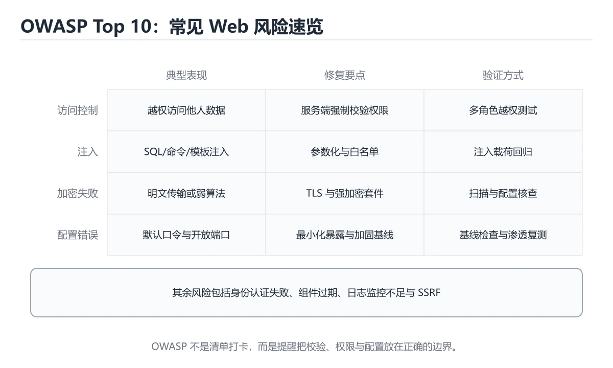
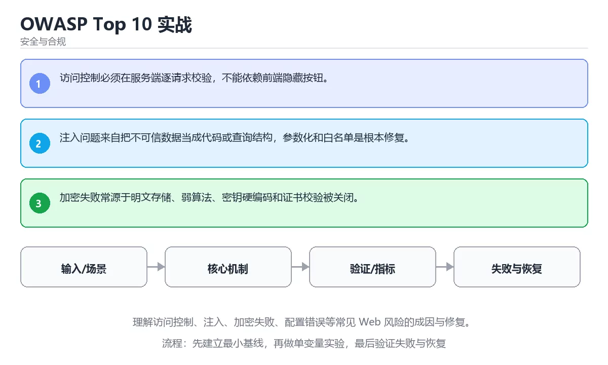

# OWASP Top 10 实战





> 内容更新时间：2026-10-06 · 学习阶段：基础 · 预计用时：60 分钟

## 本节知识框架

**课程定位**：所属分类 `security`（安全与合规），课程主题 `OWASP Top 10 实战`，学习阶段 基础，建议用时 65 分钟。

本课主线：理解访问控制、注入、加密失败、配置错误等常见 Web 风险的成因与修复。

**学完本课应当能够**
- 说清 `OWASP` 与 `注入` 的含义与区别，并各举一个正例和一个反例。
- 用本课示例验证 `访问控制` 的行为，记录输入、输出与失败条件。
- 遇到「只修报告里的那一处」这类问题时，能说出触发条件与修复顺序。

### 从概念到验证的学习链条

1. `OWASP`：先掌握 Explain what OWASP Top 10 in Practice solves and when it should be used.，再用它解释 `注入` 为什么会出现。
2. `注入`：先掌握 把用户输入当成代码或命令执行（SQL、命令、模板注入）；用参数化查询与白名单校验防御，再用它解释 `访问控制` 为什么会出现。
3. `访问控制`：先掌握 判断主体是否有权对资源执行某个操作，并在入口处强制执行，再用它解释 `越权` 为什么会出现。
4. `越权`：先掌握 已登录用户访问了不属于自己的资源，属于访问控制缺陷，必须在服务端按归属校验，再用它解释 本课示例的观察结果 为什么会出现。

**先修与衔接**：本课是「安全与合规」分类的第 4 课。先修内容：《威胁建模与 STRIDE》。《威胁建模与 STRIDE》里的 `威胁建模`、`STRIDE` 是本课的前提。相关或后续课程：《安全编码与输入校验》。

### 完成判据

- **定义关**：不看正文也能说明 `OWASP` 是 Explain what OWASP Top 10 in Practice solves and when it should be used.，并指出一个反例。
- **机制关**：能按“输入 → 转换 → 输出 → 验证”复述 `OWASP Top 10 实战`，而不是只背结论。
- **示例关**：能运行或推演 `OWASP Top 10 实战` 的 `text` 示例，并说明一个真实出现的标识符或字面量。
- **证据关**：能从 `OWASP Top 10 实战` 的示例写出一个输入、处理、输出三元组，并说明它支持或反驳了本课的哪一条结论。
- **排错关**：能复现 只修报告里的那一处，记录现象并按 按根因做全量排查与统一修复 修复。
- **迁移关**：能把 `OWASP`、`注入`、`访问控制`、`配置安全` 放进一个与 `OWASP Top 10 实战` 不同的项目场景，并保持输入与验证条件可追踪。
- **复盘关**：学完 `OWASP Top 10 实战` 后，用一句话写下仍然不确定的结论，并列出下一次验证需要的输入、环境和成功判据。

### 复习清单

- [ ] 能不看正文复述本课核心术语，并指出一个边界或反例。
- [ ] 能运行或推演本课示例，记录输入、输出与失败现象。
- [ ] 能完成一次自测，并把错题对照错误表定位原因。

## 核心概念定义

| 术语 | 操作性定义 | 常见边界与风险 |
| --- | --- | --- |
| OWASP | Explain what OWASP Top 10 in Practice solves and when it should be used.。 | 只在「Explain what OWASP Top 10 in Practice solves and when it should be used.」这一前提下成立，换输入或换环境要重新验证。 |
| 注入 | 把用户输入当成代码或命令执行（SQL、命令、模板注入）；用参数化查询与白名单校验防御。 | 索引命中与数据分布决定实际开销，判断前先看执行计划而不是只看结果是否正确。 |
| 访问控制 | 判断主体是否有权对资源执行某个操作，并在入口处强制执行。 | 只在「判断主体是否有权对资源执行某个操作，并在入口处强制执行」这一前提下成立，换输入或换环境要重新验证。 |
| 越权 | 已登录用户访问了不属于自己的资源，属于访问控制缺陷，必须在服务端按归属校验。 | 易错：绕过前端即可越权；正确做法是所有校验在服务端执行。 |

## 原理与运行机制

### 机制总览

**教材衔接：核心知识**

### 1. 访问控制必须在服务端逐请求校验，不能依赖前端隐藏按钮。

- 关键做法：先让 OWASP 的最小示例可复现，再加入并发或规模条件。
- 验证标准：注入 的异常路径有明确错误信息与恢复动作。

### 2. 注入问题来自把不可信数据当成代码或查询结构，参数化和白名单是根本修复。

把这条结论放回「OWASP Top 10 实战」的完整流程里展开：

- 正文依据：能用自己的话解释：访问控制必须在服务端逐请求校验，不能依赖前端隐藏按钮。
- 落地检查：把「2. 注入问题来自把不可信数据当成代码或查询结构，参数化和白名单是根本修复。」改写成一条可执行的核对项，逐条验证输入、超时与失败路径。

### 3. 加密失败常源于明文存储、弱算法、密钥硬编码和证书校验被关闭。

把这条结论放回「OWASP Top 10 实战」的完整流程里展开：

- 正文依据：能用自己的话解释：注入问题来自把不可信数据当成代码或查询结构，参数化和白名单是根本修复。
- 落地检查：把「3. 加密失败常源于明文存储、弱算法、密钥硬编码和证书校验被关闭。」改写成一条可执行的核对项，逐条验证输入、超时与失败路径。

**教材衔接：关键流程**

**教材衔接：实践路径**

**教材衔接：验证步骤**

**教材衔接：交付评审：评分表、决策记录与证据链**


### 二、需要写下来的决策（ADR）

| 决策点 | 本课给出的做法 | 备选方案 | 代价与回滚 |
| --- | --- | --- | --- |
| 一、资产、边界与信任 | 先回答：保护哪些数据、谁可以访问、哪些组件是信任边界、攻击者能从哪些入口进入。 | 不做「一、资产、边界与信任」，沿用最朴素的实现（需要额外补一次对照实验） | 若「一、资产、边界与信任」出问题，回到上一版本并按本课验收场景重跑 |
| 架构与数据流 | 用户/输入 → 接口或命令 → 领域逻辑 → 存储/外部依赖 → 输出与监控 | 不做「架构与数据流」，沿用最朴素的实现（需要额外补一次对照实验） | 若「架构与数据流」出问题，回到上一版本并按本课验收场景重跑 |

### 三、「OWASP Top 10 实战」的交付证据链

本课未给出可执行命令，用下面的最小证据集代替：


### 五、评审记录模板

| 记录项 | 填写要求 |
| --- | --- |
| 项目标识 | `security_owasp_top10` |
| 本次范围 | 说明这一轮交付了「OWASP Top 10 实战」的哪些部分 |
| 未完成项 | 列出与 OWASP 相关但本轮未做的内容 |
| 证据位置 | 指向 evidence/ 目录下的具体文件 |
| 风险与回滚 | 写清剩余风险、回滚步骤和验证方式 |
| 结论 | 通过 / 有条件通过 / 不通过，三者选一 |

### 机制拆解：每一步的输入、动作与输出

#### 1. `OWASP`
- 输入：`OWASP`；本步把 Explain what OWASP Top 10 in Practice solves and when it should be used. 当作判断规则。
- 动作：围绕 `OWASP` 保留中间状态，并记录它与 `注入` 的对应关系。
- 输出：`注入`，它可以被下一段代码、测试或记录继续使用。
- `OWASP` 的失败条件：只在「Explain what OWASP Top 10 in Practice solves and when it should be used.」这一前提下成立，换输入或换环境要重新验证。

#### 2. `注入`
- 输入：`OWASP`；本步把 把用户输入当成代码或命令执行（SQL、命令、模板注入）；用参数化查询与白名单校验防御 当作判断规则。
- 动作：围绕 `注入` 保留中间状态，并记录它与 `访问控制` 的对应关系。
- 输出：`访问控制`，它可以被下一段代码、测试或记录继续使用。
- `注入` 的失败条件：索引命中与数据分布决定实际开销，判断前先看执行计划而不是只看结果是否正确。

#### 3. `访问控制`
- 输入：`注入`；本步把 判断主体是否有权对资源执行某个操作，并在入口处强制执行 当作判断规则。
- 动作：围绕 `访问控制` 保留中间状态，并记录它与 `越权` 的对应关系。
- 输出：`越权`，它可以被下一段代码、测试或记录继续使用。
- `访问控制` 的失败条件：只在「判断主体是否有权对资源执行某个操作，并在入口处强制执行」这一前提下成立，换输入或换环境要重新验证。

#### 4. `越权`
- 输入：`访问控制`；本步把 已登录用户访问了不属于自己的资源，属于访问控制缺陷，必须在服务端按归属校验 当作判断规则。
- 动作：围绕 `越权` 保留中间状态，并记录它与 `本课示例的最终结果` 的对应关系。
- 输出：`本课示例的最终结果`，它可以被下一段代码、测试或记录继续使用。
- `越权` 的失败条件：当只在前端做校验时，会出现绕过前端即可越权。

### 复现实验记录

- 环境：`OWASP Top 10 实战` 使用 `text` 示例，固定 `OWASP`、`注入`、`访问控制`、`配置安全` 作为第一组条件。
- 首轮输入：从示例中的第一个输入开始，预测 `OWASP` 会怎样变化。
- 基线观察：记录命令、输入、输出和错误原文，不用截图代替可复制的文本。
- 单变量修改：只改变 `OWASP`，观察 `越权` 是否仍满足定义。
- 失败注入：复现 只修报告里的那一处，确认现象是 同类问题在别处继续存在。
- 记录结论：把“修改前、修改后、预期变化、实际变化”写成四列表，这样复盘 `OWASP Top 10 实战` 时才能区分概念错误与实现错误。

## 典型应用场景

**教材衔接：安全落地补充：OWASP Top 10 实战**

### 一、资产、边界与信任

先回答：保护哪些数据、谁可以访问、哪些组件是信任边界、攻击者能从哪些入口进入。围绕「OWASP、注入、访问控制、配置安全」列出至少 3 个入口和对应的最小权限。


### 三、上线前安全清单

- [ ] 所有外部输入经过校验和输出编码。
- [ ] 认证、授权和会话失效逻辑有测试。
- [ ] 密钥不进入源码、镜像和日志。
- [ ] 依赖漏洞、许可证和来源已审查。
- [ ] 高风险操作有确认、审计和回滚。
- [ ] 安全事件有联系人和升级路径。

### 四、事件响应演练

围绕「OWASP Top 10 实战」构造一次 OWASP 相关的越权或泄露场景，按发现、隔离、轮换、取证、恢复、复盘六步执行，记录时间线与剩余风险。

**教材衔接：项目专属规格：OWASP Top 10 实战**

### 核心场景

理解访问控制、注入、加密失败、配置错误等常见 Web 风险的成因与修复。 项目目标是把「OWASP、注入、访问控制、配置安全」落实为可运行、可测试、可回滚的交付物。


### 验收场景

1. 正常路径：最小输入得到预期输出，并留下日志与指标。
2. 边界路径：把 security_owasp_top10 的输入推到上下限，确认返回结果可解释。
3. 失败路径：依赖超时或不可用时能快速失败、重试或降级。
4. 幂等路径：同一请求执行两次不会产生重复副作用。
5. 回滚路径：OWASP 回滚后数据一致，且能说明恢复时间和影响范围。

**教材衔接：项目交付物**

### 建议仓库结构

```text
src/
tests/
docs/
README.md
```


### 验收数据

```json
{
  "project": "security_owasp_top10",
  "scenario": "OWASP的正常路径",
  "input": {"case": "normal", "value": "security_owasp_top10"},
  "expected": {"ok": true, "checks": ["OWASP可复现", "注入有记录"]},
  "failure_case": {"case": "注入越界或缺失", "error": "validation_error"},
  "idempotency_key": "security_owasp_top10-001"
}
```

### 复盘模板

- **只修报告里的那一处**：典型现象是同类问题在别处继续存在；正确做法是按根因做全量排查与统一修复。
- **依赖扫描只在发布前跑**：典型现象是新披露漏洞无法及时发现；正确做法是把依赖扫描纳入流水线并持续监控。
- **只在前端做校验**：典型现象是绕过前端即可越权；正确做法是所有校验在服务端执行。

### 最小验证场景

- 准备：保留 `text` 示例的原始输入，先记录 `OWASP Top 10 实战` 的基线输出和完整运行命令。
- 判定：新结果与 `OWASP Top 10 实战` 的基线不同不等于错误；只有当差异破坏了 `OWASP` 的定义或错误表中的约束，才判定为失败。

### 选择与边界

- 使用 `OWASP` 时，先满足它的定义：Explain what OWASP Top 10 in Practice solves and when it should be used.；只在「Explain what OWASP Top 10 in Practice solves and when it should be used.」这一前提下成立，换输入或换环境要重新验证。
- 使用 `注入` 时，先满足它的定义：把用户输入当成代码或命令执行（SQL、命令、模板注入）；用参数化查询与白名单校验防御；索引命中与数据分布决定实际开销，判断前先看执行计划而不是只看结果是否正确。
- 使用 `访问控制` 时，先满足它的定义：判断主体是否有权对资源执行某个操作，并在入口处强制执行；只在「判断主体是否有权对资源执行某个操作，并在入口处强制执行」这一前提下成立，换输入或换环境要重新验证。
- 使用 `越权` 时，先满足它的定义：已登录用户访问了不属于自己的资源，属于访问控制缺陷，必须在服务端按归属校验；易错：绕过前端即可越权；正确做法是所有校验在服务端执行。

## 代码/协议/SQL 示例

### 最小可验证示例

**教材衔接：验证命令与预期输出**

先让 security_owasp_top10 的结果可复现，再谈扩展。下表给出最低验证集：

### 验收证据

- [ ] 保存依赖安装和启动命令的完整输出。
- [ ] 为 security_owasp_top10 补三条测试：正常、边界、失败各一条。
- [ ] 重复执行 OWASP 的操作两次，确认没有重复写入或副作用。
- [ ] 记录一次失败状态码、错误日志和恢复步骤。
- [ ] 记录 security_owasp_top10 的运行环境与复现命令，并补一段回滚说明。

### 回归与回滚

1. 先在可丢弃的目录或临时库里跑 OWASP，避免污染真实数据。
2. 修改一处逻辑后重跑全部验证命令，确认没有回归。
3. 若失败，回滚到上一个可运行版本并保留失败日志。
4. 定位原因后补一条自动化测试，再重新执行发布流程。
5. 把教训写入项目复盘或本课笔记，形成下一次的检查项。

**教材衔接：最小可运行示例**

先用下面的示例确认 OWASP 的基线，再只改一个与 注入 相关的值：

```python
import hashlib

digest = hashlib.sha256(b"password").hexdigest()
print(digest[:12])
```

**教材衔接：预期输出**

```text
5e884898da28
```

### 示例精读：先找证据，再改一个条件

- 在 `OWASP Top 10 实战` 中与 `OWASP` 对照：示例必须能支持 Explain what OWASP Top 10 in Practice solves and when it should be used.，否则说明这一段还缺少实现或验证步骤。
- 在 `OWASP Top 10 实战` 中与 `注入` 对照：示例必须能支持 把用户输入当成代码或命令执行（SQL、命令、模板注入）；用参数化查询与白名单校验防御，否则说明这一段还缺少实现或验证步骤。
- 在 `OWASP Top 10 实战` 中与 `访问控制` 对照：示例必须能支持 判断主体是否有权对资源执行某个操作，并在入口处强制执行，否则说明这一段还缺少实现或验证步骤。
- 在 `OWASP Top 10 实战` 中与 `越权` 对照：示例必须能支持 已登录用户访问了不属于自己的资源，属于访问控制缺陷，必须在服务端按归属校验，否则说明这一段还缺少实现或验证步骤。
- `OWASP Top 10 实战` 的示例没有抽取到函数调用或字面量；按行记录输入、控制流和输出，避免只背代码外形。

## 时间/空间复杂度或性能分析

**性能关注点（OWASP Top 10 实战）**：加解密与校验开销随数据量增长：记录处理耗时、密钥长度与内存占用。

**测量方法**：以 `OWASP Top 10 实战` 的 `OWASP` 场景为对象，固定输入跑一遍记录基线，再把规模或并发度提高一个数量级复测；两次结果的差值与波动范围才是结论依据。

### 需要控制的变量与记录项

- `OWASP Top 10 实战` 的 `OWASP`：固定它的版本、输入范围和资源上限，分别记录速度、内存与失败率的变化。
- `OWASP Top 10 实战` 的 `注入`：固定它的版本、输入范围和资源上限，分别记录速度、内存与失败率的变化。
- `OWASP Top 10 实战` 的 `访问控制`：固定它的版本、输入范围和资源上限，分别记录速度、内存与失败率的变化。
- `OWASP Top 10 实战` 的 `配置安全`：固定它的版本、输入范围和资源上限，分别记录速度、内存与失败率的变化。
- `OWASP Top 10 实战` 中 `OWASP` 的边界：只在「Explain what OWASP Top 10 in Practice solves and when it should be used.」这一前提下成立，换输入或换环境要重新验证。达到边界时不要外推，必须重新测量。
- `OWASP Top 10 实战` 中 `注入` 的边界：索引命中与数据分布决定实际开销，判断前先看执行计划而不是只看结果是否正确。达到边界时不要外推，必须重新测量。
- `OWASP Top 10 实战` 中 `访问控制` 的边界：只在「判断主体是否有权对资源执行某个操作，并在入口处强制执行」这一前提下成立，换输入或换环境要重新验证。达到边界时不要外推，必须重新测量。
- `OWASP Top 10 实战` 中 `越权` 的边界：易错：绕过前端即可越权；正确做法是所有校验在服务端执行。达到边界时不要外推，必须重新测量。

## 常见误区与易错点

| 容易写错的做法 | 实际现象 | 原因与正确做法 |
| --- | --- | --- |
| 只修报告里的那一处 | 同类问题在别处继续存在。 | 按根因做全量排查与统一修复。 |
| 依赖扫描只在发布前跑 | 新披露漏洞无法及时发现。 | 把依赖扫描纳入流水线并持续监控。 |
| 只在前端做校验 | 绕过前端即可越权。 | 所有校验在服务端执行。 |

### 现场 1：只修报告里的那一处

**症状**：同类问题在别处继续存在。

**根因与修复**：按根因做全量排查与统一修复。

**自检**：在本课示例里复现「只修报告里的那一处」，改成按根因做全量排查与统一修复后重跑；如果症状消失且失败路径按预期变化，说明定位正确。

### 现场 2：依赖扫描只在发布前跑

**症状**：新披露漏洞无法及时发现。

**根因与修复**：把依赖扫描纳入流水线并持续监控。

**自检**：在本课示例里复现「依赖扫描只在发布前跑」，改成把依赖扫描纳入流水线并持续监控后重跑；如果症状消失且失败路径按预期变化，说明定位正确。

### 现场 3：只在前端做校验

**症状**：绕过前端即可越权。

**根因与修复**：所有校验在服务端执行。

**自检**：在本课示例里复现「只在前端做校验」，改成所有校验在服务端执行后重跑；如果症状消失且失败路径按预期变化，说明定位正确。

## 与其他知识点的关系

**教材衔接：复习与迁移**

### 概念复述

- 用一句话说明「OWASP Top 10 实战」解决什么问题：理解访问控制、注入、加密失败、配置错误等常见 Web 风险的成因与修复。
- 写出OWASP、注入、访问控制之间的关系，并各举一个例子。
- 说出本课最容易混淆的两个概念，以及区分它们的判据。

### 正文逐节复核

- **项目专属规格：OWASP Top 10 实战**：理解访问控制、注入、加密失败、配置错误等常见 Web 风险的成因与修复。


### 迁移练习

- **先修**：`威胁建模与 STRIDE`。本课默认这些内容已经掌握。
- **相关或后续**：`安全编码与输入校验`。本课术语会在这些课程里继续使用。
- **术语归属**：`OWASP`、`注入`、`访问控制` 的定义以本课「核心概念定义」为准，换到其他课程时先确认定义是否被改写。
- 同一分类的《实战：安全审计与漏洞修复》也涉及 `OWASP`；两课衔接时先确认这个术语的定义是否一致。

### 先修与后续术语接口

- `威胁建模与 STRIDE`：两者通过本分类的学习顺序衔接，阅读时重点比较各自的输入与失败条件。
- `安全编码与输入校验`：两者通过本分类的学习顺序衔接，阅读时重点比较各自的输入与失败条件。

### 容易混淆的相邻概念

- `OWASP` 与 `注入`：前者强调 Explain what OWASP Top 10 in Practice solves and when it should be used.；后者强调 把用户输入当成代码或命令执行（SQL、命令、模板注入）；用参数化查询与白名单校验防御。判断时分别检查两条定义的适用范围，不要只看名称相似就互换。
- `注入` 与 `访问控制`：前者强调 把用户输入当成代码或命令执行（SQL、命令、模板注入）；用参数化查询与白名单校验防御；后者强调 判断主体是否有权对资源执行某个操作，并在入口处强制执行。判断时分别检查两条定义的适用范围，不要只看名称相似就互换。
- `访问控制` 与 `越权`：前者强调 判断主体是否有权对资源执行某个操作，并在入口处强制执行；后者强调 已登录用户访问了不属于自己的资源，属于访问控制缺陷，必须在服务端按归属校验。判断时分别检查两条定义的适用范围，不要只看名称相似就互换。

## 自测题与参考答案

> 先独立作答，再对照参考答案；答案都能在本课正文、术语表或错误表里找到依据。

### 自测 1（概念复述）

不看正文，写出 `OWASP` 的操作性定义，并说明它与 `注入` 的区别。

**参考答案**：Explain what OWASP Top 10 in Practice solves and when it should be used.。

`注入` 的定位是：把用户输入当成代码或命令执行（SQL、命令、模板注入）；用参数化查询与白名单校验防御；两者的差别要从适用对象与失败模式上说明。

### 自测 2（排错）

本课错误表记录了「只修报告里的那一处」这类做法。请写出它会出现的现象、根因，以及修复顺序。

**参考答案**：现象是同类问题在别处继续存在；正确做法是按根因做全量排查与统一修复。修复时先复现现象并保留证据，再改动一处假设重跑，确认现象消失。

### 自测 3（动手验证）

运行本课的 `text` 示例，改动其中一个输入后重新运行，记录输出与错误信息。

**参考答案**：正常输入下 `text` 示例应当复现正文给出的结果；改动输入后，如果结果改变或报错，先核对它是否满足 `OWASP Top 10 实战` 中`OWASP` 的适用范围，再检查错误表里是否有同类现象。

### 自测 4（代码阅读）

阅读本课开头的 `text` 示例，说明它体现了`OWASP` 的哪一条性质，并指出改动哪个输入会让这条性质不再成立。

**参考答案**：`OWASP` 的定义是 Explain what OWASP Top 10 in Practice solves and when it should be used.，示例正是在实现这条定义。改动与 `OWASP` 有关的一个输入后，如果结果不再符合 `OWASP Top 10 实战` 的正文描述，就说明该性质只在当前前提成立。

### 自测 5（迁移）

把 `OWASP Top 10 实战` 的方法迁移到自己的项目：围绕 `OWASP` 写出一个与错误表同类的风险点，并说明触发条件和检验方式。

**参考答案**：例如「只在前端做校验」，它会导致绕过前端即可越权；检验方式是按所有校验在服务端执行改一处再复现，确认现象消失且没有引入新的失败分支。

### 自测 6（对比）

用一个表格对比 `OWASP` 与 `注入`：各写一行适用场景、一行失败表现。

**参考答案**：`OWASP` 的定义是Explain what OWASP Top 10 in Practice solves and when it should be used.；`注入` 的定义是把用户输入当成代码或命令执行（SQL、命令、模板注入）；用参数化查询与白名单校验防御。两者的失败表现分别对应本课错误表里与本术语相关的行。

### 自测 7（排错顺序）

面对「只修报告里的那一处」引发的问题，请把“复现 同类问题在别处继续存在 → 保留证据 → 按根因做全量排查与统一修复 → 回归验证”四步写成可执行的检查清单。

**参考答案**：第一步按同类问题在别处继续存在复现；第二步记录输入、版本与完整报错；第三步按按根因做全量排查与统一修复只改一处；第四步重跑并确认失败路径也按预期变化。

### 自测 8（边界判断）

针对 `越权`，分别写出“可以使用”的条件和“结论不再成立”的条件。

**参考答案**：易错：绕过前端即可越权；正确做法是所有校验在服务端执行。 同时要把 `越权` 的定义 已登录用户访问了不属于自己的资源，属于访问控制缺陷，必须在服务端按归属校验 与实际输入逐项对照。

### 自测 9（机制重建）

不看正文，按输入、转换、输出、验证四段重建 `OWASP` → `注入` → `访问控制` → `越权` 的作用链。

**参考答案**：起点是 `OWASP` 的定义 Explain what OWASP Top 10 in Practice solves and when it should be used.；中间每一步都保留可观察状态；终点由 `越权` 检查，失败时回到错误表定位第一个偏离定义的步骤。

### 自测 10（综合排错）

在 `OWASP Top 10 实战` 中，现象是 绕过前端即可越权。请围绕 只在前端做校验 写出最小复现、关键证据、修复动作和回归验证，并说明为什么不能只凭一次运行下结论。

**参考答案**：先复现 只在前端做校验，记录输入与完整错误；再按 所有校验在服务端执行 只改一处。回归时同时跑正常路径和边界路径，只有两次结果都可解释，才把修复视为完成。

### 自测 11（一分钟复述）

用每分钟约 200 字的速度复述 `OWASP Top 10 实战`：先给主问题，再按顺序说出 `OWASP`、`注入`、`访问控制`、`越权`，最后给一个失败案例。

**自评标准**：主问题必须对应 理解访问控制、注入、加密失败、配置错误等常见 Web 风险的成因与修复；每个术语都要能接上一句定义或边界；失败案例必须写成可观察现象，不能用“可能有风险”代替证据。

## 术语速查

| 术语 | 一句话说明 |
| --- | --- |
| `OWASP` | Explain what OWASP Top 10 in Practice solves and when it should be used.。 |
| `注入` | 把用户输入当成代码或命令执行（SQL、命令、模板注入）；用参数化查询与白名单校验防御。 |
| `访问控制` | 判断主体是否有权对资源执行某个操作，并在入口处强制执行。 |
| `越权` | 已登录用户访问了不属于自己的资源，属于访问控制缺陷，必须在服务端按归属校验。 |

**术语关系**：`OWASP`（Explain what OWASP Top 10 in Practice solves and when it should be used.） → `注入`（把用户输入当成代码或命令执行（SQL、命令、模板注入）） → `访问控制`（判断主体是否有权对资源执行某个操作） → `越权`（已登录用户访问了不属于自己的资源）。

## 考点精讲

`OWASP Top 10 实战` 的题库有 6 道题，下面逐题给出题干、正确项与判断依据：先自己作答，再核对正确项，最后回到正文对应小节复核。

### 考点 1：第 1 题

- **题目**：下面这段 `python` 代码来自 `OWASP Top 10 实战`。课程主线是理解访问控制、注入、加密失败、配置错误等常见 Web 风险的成因与修复。代码与 `OWASP` 有关。哪一项是代码里真实出现的内容？
- **正确项**：这段示例用于说明本课术语 `访问控制` 的行为
- **判断依据**：这道题落在术语 `OWASP` 上：Explain what OWASP Top 10 in Practice solves and when it should be used.。复习时把 `OWASP` 的定义、适用边界和一个反例一起说清楚，再回到「核心概念定义」核对原文。

### 考点 2：第 2 题

- **题目**：围绕“OWASP Top 10 实战”中的 OWASP、注入、访问控制，下列哪两项是本课强调的实践判断？
- **正确项**：验证 注入 时要固定版本并覆盖边界输入，结论才可复现；学习 OWASP 时要同时说明输入、输出和失败路径，不能只看正常流程
- **判断依据**：这道题落在术语 `OWASP` 上：Explain what OWASP Top 10 in Practice solves and when it should be used.。复习时把 `OWASP` 的定义、适用边界和一个反例一起说清楚，再回到「核心概念定义」核对原文。

### 考点 3：第 3 题

- **题目**：在 `OWASP Top 10 实战` 里，与 `OWASP` 有关的说法中，哪一项最符合理解访问控制、注入、加密失败、配置错误等常见 Web 风险的成因与修复。？
- **正确项**：加密失败常源于明文存储、弱算法、密钥硬编码和证书校验被关闭。
- **判断依据**：这道题落在术语 `OWASP` 上：Explain what OWASP Top 10 in Practice solves and when it should be used.。复习时把 `OWASP` 的定义、适用边界和一个反例一起说清楚，再回到「核心概念定义」核对原文。

### 考点 4：第 4 题

- **题目**：`OWASP Top 10 实战` 的主线是：理解访问控制、注入、加密失败、配置错误等常见 Web 风险的成因与修复。下面哪一项与这条主线一致？
- **正确项**：理解访问控制、注入、加密失败、配置错误等常见 Web 风险的成因与修复。
- **判断依据**：这道题落在术语 `OWASP` 上：Explain what OWASP Top 10 in Practice solves and when it should be used.。复习时把 `OWASP` 的定义、适用边界和一个反例一起说清楚，再回到「核心概念定义」核对原文。

### 考点 5：第 5 题

- **题目**：填空：补齐下面这段术语说明中的空缺。课程 `理解访问控制、注入、加密失败、配置错误等常见 Web 风险的成因与修复。`，这段说明是：`____`：判断主体是否有权对资源执行某个操作，并在入口处强制执行。空缺处应填哪个术语？
- **正确项**：访问控制
- **判断依据**：这道题落在术语 `注入` 上：把用户输入当成代码或命令执行（SQL、命令、模板注入），用参数化查询与白名单校验防御。复习时把 `注入` 的定义、适用边界和一个反例一起说清楚，再回到「核心概念定义」核对原文。

### 考点 6：第 6 题

- **题目**：下面几项都与 `OWASP` 有关，请按 `OWASP Top 10 实战` 的正文顺序排列；该课主线是理解访问控制、注入、加密失败、配置错误等常见 Web 风险的成因与修复。
- **正确项**：核心知识 → 关键流程 → 实践路径 → 常见误区
- **判断依据**：这道题落在术语 `OWASP` 上：Explain what OWASP Top 10 in Practice solves and when it should be used.。复习时把 `OWASP` 的定义、适用边界和一个反例一起说清楚，再回到「核心概念定义」核对原文。

### 考点 7：`OWASP`

- **要点**：Explain what OWASP Top 10 in Practice solves and when it should be used.。
- **OWASP 的边界**：只在「Explain what OWASP Top 10 in Practice solves and when it should be used.」这一前提下成立，换输入或换环境要重新验证。

### 考点 8：`注入`

- **要点**：把用户输入当成代码或命令执行（SQL、命令、模板注入）；用参数化查询与白名单校验防御。
- **注入 的边界**：索引命中与数据分布决定实际开销，判断前先看执行计划而不是只看结果是否正确。

### 考点 9：`访问控制`

- **要点**：判断主体是否有权对资源执行某个操作，并在入口处强制执行。
- **访问控制 的边界**：只在「判断主体是否有权对资源执行某个操作，并在入口处强制执行」这一前提下成立，换输入或换环境要重新验证。

### 考点 10：`越权`

- **要点**：已登录用户访问了不属于自己的资源，属于访问控制缺陷，必须在服务端按归属校验。
- **越权 的边界**：易错：绕过前端即可越权；正确做法是所有校验在服务端执行。

### 考点 11：排错——只修报告里的那一处

- **现象**：同类问题在别处继续存在。
- **处理**：按根因做全量排查与统一修复。

### 考点 12：排错——依赖扫描只在发布前跑

- **现象**：新披露漏洞无法及时发现。
- **处理**：把依赖扫描纳入流水线并持续监控。

### 考点 13：综合辨析——`OWASP` 与 `越权`

- **辨析点**：`OWASP` 的定义是 Explain what OWASP Top 10 in Practice solves and when it should be used.；`越权` 的定义是 已登录用户访问了不属于自己的资源，属于访问控制缺陷，必须在服务端按归属校验。
- **答题要求**：面对 `OWASP Top 10 实战` 的题目，先判断描述的是 `OWASP` 还是 `越权`，再归到对应定义，最后写出一个会让该定义失效的边界输入。

### 考点 14：排错评分点

- **现象分**：能写出 同类问题在别处继续存在，而不是只写“程序有错”。
- **证据分**：保留触发 只修报告里的那一处 的输入、版本和错误原文。
- **修复分**：按 按根因做全量排查与统一修复 只改一处，并同时回归正常路径与边界路径。

## 内容元数据

- 内容版本：v2.0
- 最后更新：2026-10-06
- 学习阶段：基础
- 适用环境：OWASP、云原生与合规安全实践；本课聚焦 OWASP。
- 内容来源：内置结构化课程与工程实践整理
- 相关主题：OWASP、注入、访问控制、配置安全
- 质量版本：P0 测验标准 + P1 覆盖扩展 + P2 体验补全

## 参考资料与复核

- 最后复核：2026-10-04
- 下次复核：2026-11-24
- 复核范围：版本兼容、API 行为、安全建议与工程实践
- 来源性质：官方文档、标准或权威教材；本课核对关键词：OWASP、注入、访问控制、配置安全。

| 参考资料 | 本课用途 |
| --- | --- |
| [OWASP Top 10](https://owasp.org/www-project-top-ten/) | 常见 Web 安全风险 |
| [NIST 密码标准](https://csrc.nist.gov/projects/cryptographic-standards-and-guidelines) | 密码算法与协议 |
| [NIST 网络安全框架](https://www.nist.gov/cyberframework) | 风险管理与治理 |

| [本课术语索引：OWASP Top 10 实战](#核心概念定义) | 按本课输入、术语边界和错误表现逐项核对 |
> 「OWASP Top 10 实战」的链接用于离线阅读后的延伸核对；App 不会自动联网。