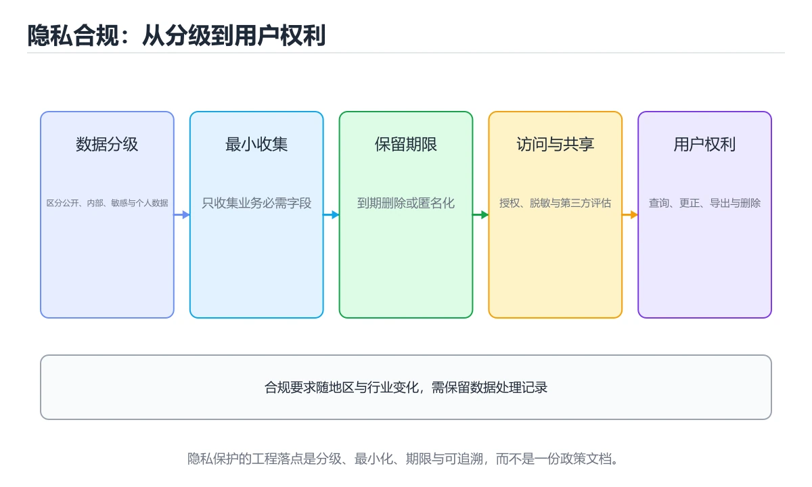
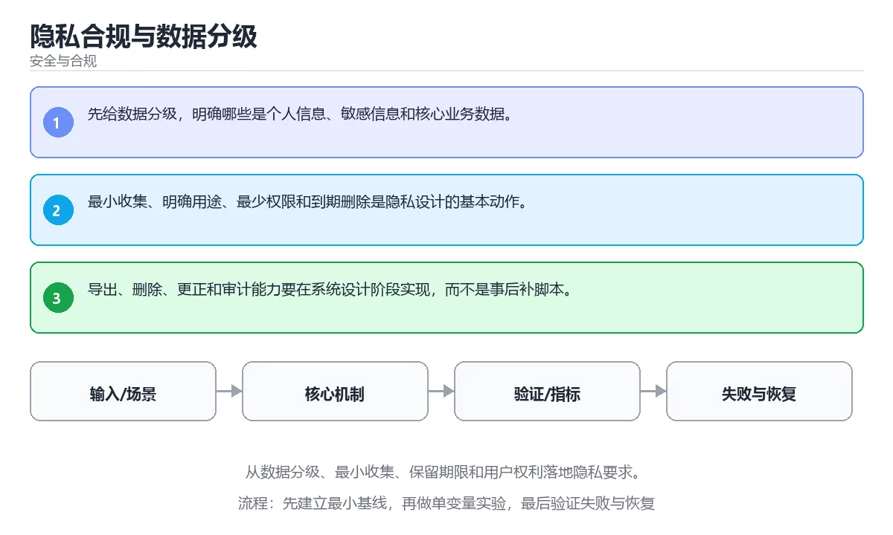

# 隐私合规与数据分级





> 内容更新时间：2026-10-06 · 学习阶段：进阶 · 预计用时：30 分钟

## 学习目标

- 能用自己的话解释：先给数据分级，明确哪些是个人信息、敏感信息和核心业务数据。
- 能用自己的话解释：最小收集、明确用途、最少权限和到期删除是隐私设计的基本动作。
- 能用自己的话解释：导出、删除、更正和审计能力要在系统设计阶段实现，而不是事后补脚本。
- 能把本课知识放回「安全与合规」，并完成练习与测验。

## 前置知识

- 具备本分类的前置知识，能跑通「隐私合规与数据分级」的示例并解释输出。
- 本课关键词：隐私、合规、数据分级、保留期限。
- 遇到不熟悉的术语先记录问题，完成练习后再回读。

## 核心知识

### 1. 先给数据分级，明确哪些是个人信息、敏感信息和核心业务数据。

- 关键做法：先用 e884898da28 建立 隐私 的基线，再逐步加入边界与失败条件。
- 验证标准：合规 的异常路径有明确错误信息与恢复动作。

### 2. 最小收集、明确用途、最少权限和到期删除是隐私设计的基本动作。

把这条结论放回「隐私合规与数据分级」的完整流程里展开：

- 正文依据：能用自己的话解释：先给数据分级，明确哪些是个人信息、敏感信息和核心业务数据。
- 落地检查：把「2. 最小收集、明确用途、最少权限和到期删除是隐私设计的基本动作。」改写成一条可执行的核对项，逐条验证输入、超时与失败路径。

### 3. 导出、删除、更正和审计能力要在系统设计阶段实现，而不是事后补脚本。

把这条结论放回「隐私合规与数据分级」的完整流程里展开：

- 正文依据：能用自己的话解释：最小收集、明确用途、最少权限和到期删除是隐私设计的基本动作。
- 落地检查：把「3. 导出、删除、更正和审计能力要在系统设计阶段实现，而不是事后补脚本。」改写成一条可执行的核对项，逐条验证输入、超时与失败路径。

## 关键流程

```text
输入 → 校验 → 核心处理 → 验证 → 记录指标 → 失败恢复
```

## 实践路径

1. 用一句话复述本课要解决的问题。
2. 跑通正文中的最小示例并记录基线。
3. 只改变一个输入或参数，预测并验证结果。
4. 补一个失败路径，记录错误、恢复和指标。
5. 把结论写成可复现的笔记或测试。

## 常见错误与排查

> 说明：本表由《隐私合规与数据分级》的核心知识整理（2026-10-07），人工复核进度见 docs/content_review_batches.md。

| 易错点 | 容易踩的做法 | 正确结论 |
| --- | --- | --- |
| 数据不做分级 | 敏感数据到处流转 | 先分级，再按级别约束存储、访问与导出 |
| 收集超出必要范围 | 合规风险与泄露面同时扩大 | 按最小必要原则收集并定期清理 |
| 日志里记录个人信息 | 日志本身成为泄露源 | 日志脱敏并限制访问权限 |

## 动手练习

1. 合上教程，用 3～5 句话解释隐私合规与数据分级。
2. 从正文选一个例子，改变一个条件并预测结果。
3. 设计一个失败场景，写出止损与恢复步骤。

**验收标准**：留下输入、命令、输出、差异和下一步问题。

## 本课小结

- 本课围绕 隐私、合规、数据分级、保留期限 展开，复习时重点核对它们的输入、输出和失败路径。
- 把还不确定的 e884898da28 行为写成一条可执行验证，再进入下一课。


## 安全落地补充：隐私合规与数据分级

### 一、资产、边界与信任

先回答：保护哪些数据、谁可以访问、哪些组件是信任边界、攻击者能从哪些入口进入。围绕「隐私、合规、数据分级、保留期限」列出至少 3 个入口和对应的最小权限。

### 二、威胁 → 控制 → 验证

| 威胁 | 预防控制 | 检测方式 | 验证证据 |
| --- | --- | --- | --- |
| 输入被污染 | schema、白名单、编码 | 异常输入日志和告警 | 越权与注入测试 |
| 权限过大 | 最小权限、临时凭证 | 权限审计和异常调用 | 权限边界测试 |
| 密钥泄露 | 密钥管理、轮换 | 仓库和日志扫描 | 轮换与影响范围记录 |
| 操作不可追溯 | 结构化审计日志 | 关键动作告警 | 审计查询和复盘 |
| 恢复失败 | 备份、回滚、演练 | 恢复指标监控 | 演练时间与数据校验 |

### 三、上线前安全清单

- [ ] 所有外部输入经过校验和输出编码。
- [ ] 认证、授权和会话失效逻辑有测试。
- [ ] 密钥不进入源码、镜像和日志。
- [ ] 依赖漏洞、许可证和来源已审查。
- [ ] 高风险操作有确认、审计和回滚。
- [ ] 安全事件有联系人和升级路径。

### 四、事件响应演练

围绕「隐私合规与数据分级」构造一次 隐私 相关的越权或泄露场景，按发现、隔离、轮换、取证、恢复、复盘六步执行，记录时间线与剩余风险。

## 可运行练习

### 任务 1：先跑通，再解释

```python
import hashlib

digest = hashlib.sha256(b"password").hexdigest()
print(digest[:12])
```

### 任务 2：只改一个条件

把「隐私合规与数据分级」的最小示例复制一份，只改一个条件再跑一次：

- 改动点：把 合规 换成边界值，其他输入保持原样。
- 预测：先写下「隐私合规与数据分级」在改动后的输出或错误信息，再运行。
- 记录：对照改动前后的结果，指出差异出在哪一步。
- 验收：换回原条件能复现原结果，改动只影响隐私。

### 任务 3：迁移到自己的数据

把 e884898da28 换成你自己的输入，先保持步骤不变，再比较输出差异。

## 故障现场

### 现场 1：数据不做分级

**症状**：在《隐私合规与数据分级》的复现场景中，敏感数据到处流转。

**根因**：触发点是把“数据不做分级”当成安全做法。它没有满足《隐私合规与数据分级》要求的前提，因此先表现为“敏感数据到处流转”；排查时先完整复现这一段，再核对输入、配置与依赖。

**修复**：针对《隐私合规与数据分级》的问题，先分级，再按级别约束存储、访问与导出。

**验证**：先在《隐私合规与数据分级》中记录“数据不做分级”留下的失败证据，再执行“先分级，再按级别约束存储、访问与导出”并重放；确认错误路径变为明确结果，且修复没有掩盖同类故障。

### 现场 2：收集超出必要范围

**症状**：在《隐私合规与数据分级》的复现场景中，合规风险与泄露面同时扩大。

**根因**：触发点是把“收集超出必要范围”当成安全做法。它没有满足《隐私合规与数据分级》要求的前提，因此先表现为“合规风险与泄露面同时扩大”；排查时先完整复现这一段，再核对输入、配置与依赖。

**修复**：针对《隐私合规与数据分级》的问题，按最小必要原则收集并定期清理。

**验证**：保留《隐私合规与数据分级》里触发“合规风险与泄露面同时扩大”的输入、版本和日志，按“按最小必要原则收集并定期清理”完成修改后原样重放；只有失败现象消失且相邻场景仍可解释，才保留改动。

### 现场 3：日志里记录个人信息

**症状**：在《隐私合规与数据分级》的复现场景中，日志本身成为泄露源。

**根因**：触发点是把“日志里记录个人信息”当成安全做法。它没有满足《隐私合规与数据分级》要求的前提，因此先表现为“日志本身成为泄露源”；排查时先完整复现这一段，再核对输入、配置与依赖。

**修复**：针对《隐私合规与数据分级》的问题，日志脱敏并限制访问权限。

**验证**：先在《隐私合规与数据分级》中记录“日志里记录个人信息”留下的失败证据，再执行“日志脱敏并限制访问权限”并重放；确认错误路径变为明确结果，且修复没有掩盖同类故障。

## 本课复习清单


离开本课前，逐项确认：

- [ ] 不看解析，能说出「关于「先给数据分级，明确哪些是个人信息、敏感信息和核心业务数据。」，下列说法正确的是？」的判断依据。
- [ ] 不看解析，能说出「关于「最小收集、明确用途、最少权限和到期删除是隐私设计的基本动作。」，下列说法正确的是？」的判断依据。
- [ ] 不看解析，能说出「下面这段 Python 代码摘自「隐私合规与数据分级」的正文示例。关于这段代码，下面哪一项说法与实际内容相符？」的判断依据。
- [ ] 至少运行一次《隐私合规与数据分级》的示例，记录输入、输出和一个边界情况。
- [ ] 把本课最容易混淆的两个概念写成一句话对照。

| 复盘项 | 记录 |
| --- | --- |
| 已经能独立解释的考点 |  |
| 仍然说不清的概念 |  |
| 下一步验证动作 |  |

## 复习与自测

逐节自检：能说清 隐私 的输入、输出与失败路径才算通过，否则回到原文。

### 核心知识

自检：这一节与相邻主题的边界在哪里？

### 动手练习

自检：如果去掉这一节里的一个前提，结论会怎样变化？

### 安全落地补充：隐私合规与数据分级

「隐私合规与数据分级」的「安全落地补充：隐私合规与数据分级」一节补全如下：

- 定位：这一节说明安全落地补充：隐私合规与数据分级在「隐私合规与数据分级」知识体系里的位置。
- 要点：已完成「安全与合规」的基础课程，能运行正文中的最小示例。
- 自检：能否用一个最小例子解释安全落地补充：隐私合规与数据分级？

### 验证步骤

制造一次错误输入，记录错误信息与修复方式。
### 追问 1：关于「先给数据分级，明确哪些是个人信息、敏感信息和核心业务数据。」，下列说法正确的是？

- 先写下判断，再对照：先给数据分级，明确哪些是个人信息、敏感信息和核心业务数据。
- 检查点：合规 的结论依赖哪一个隐含前提？

### 追问 2：关于「最小收集、明确用途、最少权限和到期删除是隐私设计的基本动作。」，下列说法正确的是？

- 先写下判断，再对照：最小收集、明确用途、最少权限和到期删除是隐私设计的基本动作。

### 追问 3：关于「导出、删除、更正和审计能力要在系统设计阶段实现，而不是事后补脚本。」，下列说法正确的是？

- 先写下判断，再对照：导出、删除、更正和审计能力要在系统设计阶段实现，而不是事后补脚本。

## 术语速查

| 术语 | 一句话说明 |
| --- | --- |
| `隐私` | 个人信息和控制数据的收集、使用、保留与删除边界，需要授权和最小化处理。 |
| `合规` | 满足法律、行业规范和内部政策对数据与系统的要求。 |
| `数据分级` | 检查点 3：按隐私合规与数据分级中 隐私、合规、数据分级 的实践顺序，把四个步骤排成从准备到复盘的合理顺序。 |
| `保留期限` | 数据在业务、审计和合规要求下允许保存的最长时间，到期后应删除或匿名化。 |

## 零基础精讲：把隐私合规与数据分级真正讲透

### 先建立一个直觉

把「隐私合规与数据分级」看成一条防线：先识别资产与威胁，再围绕 隐私 限制权限、验证输入、记录审计，并为失败准备隔离与恢复方案。

本课的摘要可以当作一张地图：从数据分级、最小收集、保留期限和用户权利落地隐私要求。

### 逐步拆解

1. 澄清输入与目标。先写清「隐私合规与数据分级」要解决的问题、合法输入范围和成功标准，再进入后续步骤。
2. 描述处理过程。把「隐私、合规、数据分级、保留期限」映射到具体步骤，每步都要求能单独验证。
3. 定义输出。隐私 的输出不仅包括正常结果，还包括错误码、日志和资源释放状态。
4. 把 e884898da28 的输入换成空值、极值或类型不符的形式，记录第一条错误信息、发生位置和修复动作。
5. 选一个只有两三步的隐私例子，先写出预期输出，再运行确认；不一致时先怀疑前提而不是代码。

### 把正文串成一条执行链

- **1. 先给数据分级，明确哪些是个人信息、敏感信息和核心业务数据。**：在「隐私合规与数据分级」里，「1. 先给数据分级，明确哪些是个人信息、敏感信息和核心业务数据。」这一步要先写清输入与预期，再记录实际结果和差异；结果不符时回到对应小节核对前提。
- **2. 最小收集、明确用途、最少权限和到期删除是隐私设计的基本动作。**：在「隐私合规与数据分级」里，「2. 最小收集、明确用途、最少权限和到期删除是隐私设计的基本动作。」这一步要先写清输入与预期，再记录实际结果和差异；结果不符时回到对应小节核对前提。
- **3. 导出、删除、更正和审计能力要在系统设计阶段实现，而不是事后补脚本。**：在「隐私合规与数据分级」里，「3. 导出、删除、更正和审计能力要在系统设计阶段实现，而不是事后补脚本。」这一步要先写清输入与预期，再记录实际结果和差异；结果不符时回到对应小节核对前提。
- 一、资产、边界与信任：明确 合规 的权限范围与越权后果。
- **二、威胁 → 控制 → 验证**：在「隐私合规与数据分级」里，「二、威胁 → 控制 → 验证」这一步要先写清输入与预期，再记录实际结果和差异；结果不符时回到对应小节核对前提。
- 三、上线前安全清单：- [ ] 合规 的越权与注入路径已覆盖测试

### 从测验反推易错点

**检查点 1：关于「先给数据分级，明确哪些是个人信息、敏感信息和核心业务数据。」，下列说法正确的是？**

- 参考判断：先给数据分级，明确哪些是个人信息、敏感信息和核心业务数据。
- 自问：如果去掉题干里的一个限定词，结论还成立吗？

**检查点 2：关于「最小收集、明确用途、最少权限和到期删除是隐私设计的基本动作。」，下列说法正确的是？**

- 参考判断：最小收集、明确用途、最少权限和到期删除是隐私设计的基本动作。

**检查点 3：按隐私合规与数据分级中 隐私、合规、数据分级 的实践顺序，把四个步骤排成从准备到复盘的合理顺序。**

- 参考判断：只改一个变量，记录边界与失败路径的变化
- 解析：在本课的练习里，顺序应当是：先明确 隐私 的输入、输出与约束 → 写出最小示例并核对 合规 的基线结果 → 只改一个变量，记录边界与失败路径的变化 → 固定版本与证据，把本课的结论写成可复现记录。这个顺序把 隐私 的输入、输出和约束放在最前面，在隐私合规与数据分级里避免概念没对齐就开始调参。第二步用 合规 建立可核对的基线，在隐私合规与数据分级里第三步才允许改变一个变量并观察失败路径。最后一步把本课的版本、证据与结论固定下来，别人才能复现同样的结果。

- 参考判断：遍历列表时直接删除元素，后续元素被跳过；应遍历副本或构造新列表。

**检查点 5：以下哪些术语与隐私合规与数据分级直接相关？（多选）**

- 参考判断：隐私、合规

### 工程排错顺序

| 先查什么 | 要得到的证据 | 判断标准 |
| --- | --- | --- |
| 资产、威胁和行为主体是否明确？ | 日志、输入样例、测试或指标 | 能复现并解释，才算定位 |
| 权限是否默认拒绝并最小化？ | 日志、输入样例、测试或指标 | 能复现并解释，才算定位 |
| 输入、输出与审计是否都有控制？ | 日志、输入样例、测试或指标 | 能复现并解释，才算定位 |
| 发现绕过时能否快速隔离和恢复？ | 日志、输入样例、测试或指标 | 能复现并解释，才算定位 |

### 变式训练

1. 把 隐私 放进一个只有单机、没有额外依赖的小项目，先保证正确再扩展。
2. 扩大 合规 的规模，记录本课结论在哪一个量级开始不成立。
3. 把 合规 换成失败输入，记录错误信息与恢复动作。
5. 把 e884898da28 的执行顺序调换一次，记录哪个中间结果先错；顺序敏感的地方就是本课的关键约束。
6. 限制 CPU 与内存上限后重跑 e884898da28，观察哪一项参数需要重新设定。

### 本课自测

- [ ] 能用一句话解释「隐私」在本课中的角色与边界。
- [ ] 能举出一个正常例子和一个失败例子。
- [ ] 能说出最小验证步骤，以及需要记录的证据。
- [ ] 能用一句话解释「合规」在本课中的角色与边界。
- [ ] 能用一句话解释「数据分级」在本课中的角色与边界。
- [ ] 能用一句话解释「保留期限」在本课中的角色与边界。

### 迁移案例库

围绕 e884898da28 重复同一套方法，每完成一轮就把差异写进笔记。

#### 迁移案例 1：围绕「隐私」做一次小实验

**目标**：在不改变课程主体的前提下，验证隐私合规与数据分级中的一个关键判断。

**步骤**：
1. 复述当前方案对「隐私」的假设，写成一句可证伪的话。
2. 设计一个正常输入和一个边界输入，分别预测输出。
3. 运行或逐步演算，记录实际输出、耗时和失败信息。
4. 只调整一个参数，比较前后差异并解释原因。
5. 补充一条测试或复习卡，确保下次能更快复现。

**验收**：隐私的结论要有证据、差异可解释、失败可恢复；做不到时回到「核心知识」缩小问题范围。

#### 迁移案例 2：围绕「合规」做一次小实验

**步骤**：
1. 复述当前方案对「合规」的假设，写成一句可证伪的话。

#### 迁移案例 3：围绕「数据分级」做一次小实验

**步骤**：
1. 复述当前方案对「数据分级」的假设，写成一句可证伪的话。

#### 迁移案例 4：围绕「保留期限」做一次小实验

**步骤**：
1. 复述当前方案对「保留期限」的假设，写成一句可证伪的话。

#### 迁移案例 5：围绕「隐私」做一次小实验

**步骤**：

#### 迁移案例 6：围绕「合规」做一次小实验

**步骤**：

#### 迁移案例 7：围绕「数据分级」做一次小实验

**步骤**：

#### 迁移案例 8：围绕「保留期限」做一次小实验

**步骤**：

#### 迁移案例 9：围绕「隐私」做一次小实验

**步骤**：

#### 迁移案例 10：围绕「合规」做一次小实验

**步骤**：

#### 迁移案例 11：围绕「数据分级」做一次小实验

**步骤**：

#### 迁移案例 12：围绕「保留期限」做一次小实验

**步骤**：

#### 迁移案例 13：围绕「隐私」做一次小实验

**步骤**：

#### 迁移案例 14：围绕「合规」做一次小实验

**步骤**：

#### 迁移案例 15：围绕「数据分级」做一次小实验

**步骤**：

#### 迁移案例 16：围绕「保留期限」做一次小实验

**步骤**：

<!-- p0-depth-v2:end -->

## 考点精讲

### 考点 1：概念判断·隐私

- **题目**：关于「先给数据分级，明确哪些是个人信息、敏感信息和核心业务数据。」，下列说法正确的是？
- **判断依据**：在「隐私合规与数据分级」里，先给数据分级，明确哪些是个人信息、敏感信息和核心业务数据。这道题的关键在「隐私合规与数据分级」的隐私、合规、数据分级：先确认题干“关于先给数据分级”问的是哪一步，再排除偷换前提的选项。把“先给数据分级，明确哪些是个人信息”代回「隐私合规与数据分级」里“先给数据分级”的例子核对，条件一旦改变，结论就要用隐私、合规、数据分级重新推导。

### 考点 2：概念判断·隐私

- **题目**：关于「最小收集、明确用途、最少权限和到期删除是隐私设计的基本动作。」，下列说法正确的是？
- **判断依据**：在「隐私合规与数据分级」里，最小收集、明确用途、最少权限和到期删除是隐私设计的基本动作。这道题的关键在「隐私合规与数据分级」的隐私、合规、数据分级：先确认题干“关于最小收集、明确用途、最少权限和到”问的是哪一步，再排除偷换前提的选项。把“最小收集、明确用途”代回「隐私合规与数据分级」里“最小收集、明确用途、最少权限和到期删除是隐私设计的基本动作”的例子核对，条件一旦改变，结论就要用隐私、合规、数据分级重新推导。

### 考点 3：顺序排列·隐私

- **题目**：按“隐私合规与数据分级”中 隐私、合规、数据分级 的实践顺序，把四个步骤排成从准备到复盘的合理顺序。
- **判断依据**：在「隐私合规与数据分级」里，在本课的练习里，顺序应当是：先明确 隐私 的输入、输出与约束 → 写出最小示例并核对 合规 的基线结果 → 只改一个变量，记录边界与失败路径的变化 → 固定版本与证据，把本课的结论写成可复现记录。这个顺序把 隐私 的输入、输出和约束放在最前面，在隐私合规与数据分级里避免概念没对齐就开始调参。第二步用 合规 建立可核对的基线，在隐私合规与数据分级里第三步才允许改变一个变量并观察失败路径。

### 考点 4：代码补全·隐私

- **题目**：下面这段 Python 代码摘自「隐私合规与数据分级」的正文示例。关于这段代码，下面哪一项说法与实际内容相符？
- **判断依据**：题干的正确项是这段代码会产生可观察的输出，运行后能看到结果，在「隐私合规与数据分级」里要结合隐私核对输出是否符合预期。这段代码出自「隐私合规与数据分级」的正文示例，围绕隐私、合规、数据分级展开；把输入或边界换成空值、极值或失败情况后，结论要以「隐私合规与数据分级」的实际运行结果为准。“下面这段”与「隐私合规与数据分级」的术语表相呼应，只有符合隐私、合规、数据分级约束的“这段代码会产生可观察的输出”才是正文支持的结论。

### 考点 5：多选辨析·隐私

- **题目**：以下哪些术语与「隐私合规与数据分级」直接相关？（多选）
- **判断依据**：回到「隐私合规与数据分级」的正文示例，用“以下哪些术语与隐私合规与数据分级直接”走一遍隐私、合规、数据分级的完整流程，能复现的结论才可以保留。「隐私合规与数据分级」要求先交代隐私、合规、数据分级的前提再下结论，所以“隐私”只在题干“以下哪些术语与直接相关（多选）”给定的条件下成立。

## English Overview

**Title:** Privacy, Compliance and Data Classification

**Summary:** Implement privacy through classification, minimization, retention and user rights.

**Category:** Security & Compliance
**Level:** 进阶
**Key terms:** 隐私, 合规, 数据分级, 保留期限

## 内容元数据

- 内容版本：v2.0
- 最后更新：2026-10-06
- 学习阶段：进阶
- 适用环境：OWASP、云原生与合规安全实践；本课聚焦 隐私。
- 内容来源：内置结构化课程与工程实践整理
- 相关主题：隐私、合规、数据分级、保留期限
- 质量版本：P0 测验标准 + P1 覆盖扩展 + P2 体验补全

## 最小可运行示例

下面示例用于验证 隐私 的最小输入、处理和输出。先原样运行，再只修改一个值：

```python
import hashlib

digest = hashlib.sha256(b"password").hexdigest()
print(digest[:12])
```

## 预期输出

```text
5e884898da28
```

## 验证步骤

1. 记录运行环境、命令和真实输出。
2. 修改一个输入，先写预测再运行。
4. 把结论写回本课笔记或测试用例。

## 参考资料与复核

- 最后复核：2026-10-04
- 下次复核：2026-11-24
- 复核范围：版本兼容、API 行为、安全建议与工程实践
- 来源性质：官方文档、标准或权威教材；正文为离线教学重组

| 参考资料 | 本课用途 |
| --- | --- |
| [MITRE ATT&CK](https://attack.mitre.org/) | 攻击技术与防御映射 |
| [OWASP ASVS](https://owasp.org/www-project-application-security-verification-standard/) | 应用安全验证要求 |
| [OWASP Top 10](https://owasp.org/www-project-top-ten/) | 常见 Web 安全风险 |

> 「隐私合规与数据分级」的链接用于离线阅读后的延伸核对；App 不会自动联网。

## 复习与迁移

复习目标：把「隐私合规与数据分级」的判断标准放回可复现的例子里。先自己作答，再对照依据；如果结论正确但理由不完整，回到正文补足前提。

### 概念复述

- 用一句话说明「隐私合规与数据分级」解决什么问题：从数据分级、最小收集、保留期限和用户权利落地隐私要求。
- 写出隐私、合规、数据分级之间的关系，并各举一个例子。
- 说出本课最容易混淆的两个概念，以及区分它们的判据。

### 正文逐节复核

- **零基础精讲：把隐私合规与数据分级真正讲透**：本课的摘要可以当作一张地图：从数据分级、最小收集、保留期限和用户权利落地隐私要求。

### 测验回顾

1. 关于「先给数据分级，明确哪些是个人信息、敏感信息和核心业务数据。」，下列说法正确的是？
   - 依据：在「隐私合规与数据分级」里，先给数据分级，明确哪些是个人信息、敏感信息和核心业务数据。这道题的关键在「隐私合规与数据分级」的隐私、合规、数据分级：先确认题干“关于先给数据分级”问的是哪一步，再排除偷换前提的选项。把“先给数据分级，明确哪些是个人信息”代回「隐私合规与数据分级」里“先给数据分级”的例子核对，条件一旦改变，结论就要用隐私、合规、数据分级重新推导。
2. 关于「最小收集、明确用途、最少权限和到期删除是隐私设计的基本动作。」，下列说法正确的是？
   - 依据：在「隐私合规与数据分级」里，最小收集、明确用途、最少权限和到期删除是隐私设计的基本动作。这道题的关键在「隐私合规与数据分级」的隐私、合规、数据分级：先确认题干“关于最小收集、明确用途、最少权限和到”问的是哪一步，再排除偷换前提的选项。把“最小收集、明确用途”代回「隐私合规与数据分级」里“最小收集、明确用途、最少权限和到期删除是隐私设计的基本动作”的例子核对，条件一旦改变，结论就要用隐私、合规、数据分级重新推导。
3. 按“隐私合规与数据分级”中 隐私、合规、数据分级 的实践顺序，把四个步骤排成从准备到复盘的合理顺序。
   - 依据：在「隐私合规与数据分级」里，在本课的练习里，顺序应当是：先明确 隐私 的输入、输出与约束 → 写出最小示例并核对 合规 的基线结果 → 只改一个变量，记录边界与失败路径的变化 → 固定版本与证据，把本课的结论写成可复现记录。这个顺序把 隐私 的输入、输出和约束放在最前面，在隐私合规与数据分级里避免概念没对齐就开始调参。第二步用 合规 建立可核对的基线，在隐私合规与数据分级里第三步才允许改变一个变量并观察失败路径。
4. 下面这段 Python 代码摘自「隐私合规与数据分级」的正文示例。关于这段代码，下面哪一项说法与实际内容相符？
   - 依据：题干的正确项是这段代码会产生可观察的输出，运行后能看到结果，在「隐私合规与数据分级」里要结合隐私核对输出是否符合预期。这段代码出自「隐私合规与数据分级」的正文示例，围绕隐私、合规、数据分级展开；把输入或边界换成空值、极值或失败情况后，结论要以「隐私合规与数据分级」的实际运行结果为准。“下面这段”与「隐私合规与数据分级」的术语表相呼应，只有符合隐私、合规、数据分级约束的“这段代码会产生可观察的输出”才是正文支持的结论。
5. 以下哪些术语与「隐私合规与数据分级」直接相关？（多选）
   - 依据：回到「隐私合规与数据分级」的正文示例，用“以下哪些术语与隐私合规与数据分级直接”走一遍隐私、合规、数据分级的完整流程，能复现的结论才可以保留。「隐私合规与数据分级」要求先交代隐私、合规、数据分级的前提再下结论，所以“隐私”只在题干“以下哪些术语与直接相关（多选）”给定的条件下成立。

### 迁移练习

把「隐私合规与数据分级」的结论迁移到相邻主题，每次迁移都写清预测与证据：

1. 换输入：用隐私处理一组你自己的数据，对比教材示例的结果差异。
2. 换失败条件：制造一个合规相关的错误，说明如何从错误信息定位根因。
3. 换规模：把数据量或并发度提高一个数量级，说明「隐私合规与数据分级」的结论是否仍成立。
