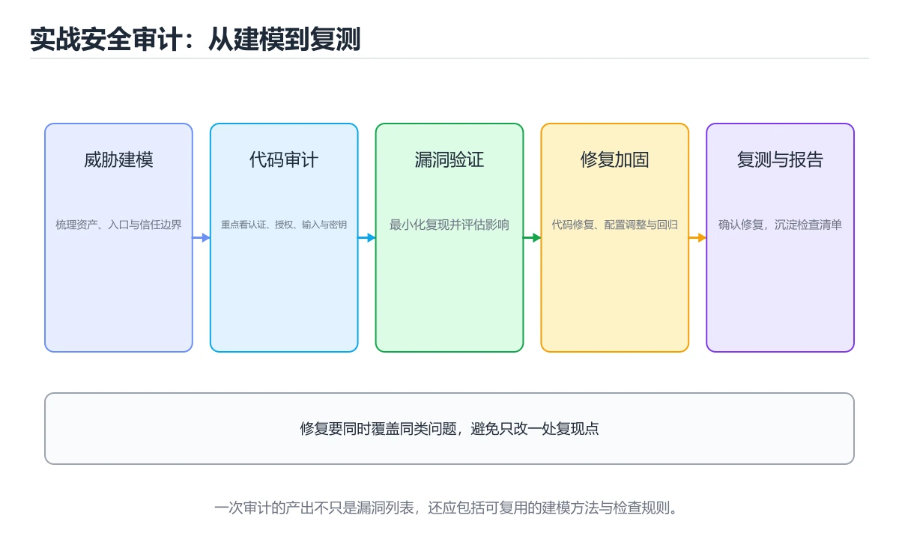

# 实战：安全审计与漏洞修复




> 内容更新时间：2026-10-03 · 学习阶段：高级 · 预计用时：120 分钟

## 学习目标

- 能用自己的话解释：先画数据流和信任边界，再按资产、入口和权限列出威胁与验证计划。
- 能用自己的话解释：审计代码、依赖、配置和日志，使用最小证据证明漏洞影响而不破坏数据。
- 能用自己的话解释：修复后复测原漏洞、同类入口和回归路径，并记录剩余风险与责任人。
- 能把本课知识放回「安全与合规」，并完成练习与测验。

## 前置知识

- 已完成「安全与合规」的基础课程，能运行正文中的最小示例。
- 本课关键词：安全审计、漏洞修复、OWASP、复测、审计日志。
- 遇到不熟悉的术语先记录问题，完成练习后再回读。

## 核心知识

### 1. 先画数据流和信任边界，再按资产、入口和权限列出威胁与验证计划。

- 它解决的问题：把「先画数据流和信任边界，再按资产、入口和权限列出威胁与验证计划。」放回真实场景，说明不做它会带来什么后果。
- 关键做法：先用最小示例建立基线，再逐步加入边界、失败和性能条件。
- 验证标准：结果可复现、错误可解释、边界有测试、失败能恢复。

### 2. 审计代码、依赖、配置和日志，使用最小证据证明漏洞影响而不破坏数据。

- 它解决的问题：把「审计代码、依赖、配置和日志，使用最小证据证明漏洞影响而不破坏数据。」放回真实场景，说明不做它会带来什么后果。
- 关键做法：先用最小示例建立基线，再逐步加入边界、失败和性能条件。
- 验证标准：结果可复现、错误可解释、边界有测试、失败能恢复。

### 3. 修复后复测原漏洞、同类入口和回归路径，并记录剩余风险与责任人。

- 它解决的问题：把「修复后复测原漏洞、同类入口和回归路径，并记录剩余风险与责任人。」放回真实场景，说明不做它会带来什么后果。
- 关键做法：先用最小示例建立基线，再逐步加入边界、失败和性能条件。
- 验证标准：结果可复现、错误可解释、边界有测试、失败能恢复。

## 关键流程

```text
输入 → 校验 → 核心处理 → 验证 → 记录指标 → 失败恢复
```

## 代码示例

```python
def validate_role(user, required):
    if user is None:
        raise PermissionError('anonymous')
    if required not in user.roles:
        raise PermissionError('forbidden')
    return True
```

## 实践路径

1. 用一句话复述本课要解决的问题。
2. 跑通正文中的最小示例并记录基线。
3. 只改变一个输入或参数，预测并验证结果。
4. 补一个失败路径，记录错误、恢复和指标。
5. 把结论写成可复现的笔记或测试。

## 常见误区

| 误区 | 后果 | 修正 |
| --- | --- | --- |
| 只记术语不做实验 | 遇到真实问题无法判断 | 用最小输入跑通并记录结果 |
| 只测正常路径 | 边界和故障上线才暴露 | 补空值、极值和依赖失败 |
| 没有基线就优化 | 无法证明改进有效 | 先测量再修改 |
| 忽略成本与安全 | 性能和风险失控 | 同时记录资源、权限与失败代价 |

## 动手练习

1. 合上教程，用 3～5 句话解释「实战：安全审计与漏洞修复」。
2. 从正文选一个例子，改变一个条件并预测结果。
3. 设计一个失败场景，写出止损与恢复步骤。

**验收标准**：留下输入、命令、输出、差异和下一步问题。

## 本课小结

- 本课属于「安全与合规」，核心关键词是 安全审计、漏洞修复、OWASP、复测、审计日志。
- 先保证正确与可复现，再讨论性能和扩展。
- 完成练习和测验后，把仍然不确定的问题写成下一轮验证清单。

> 本课由 P1 内容扩展生成，重点补充原有课程缺失的主题与工程边界。


## 考点精讲：把测验题还原成判断过程

本课有 5 个判断点。先自己作答，再看「判断依据」；如果结论正确但理由不完整，回到正文对应章节补足概念。

### 考点 1：关于「先画数据流和信任边界 再按资产、入口…」，下列说法正确的是？

- **正确判断**：先画数据流和信任边界，再按资产、入口和权限列出威胁与验证计划。
- **判断依据**：正确答案是「先画数据流和信任边界，再按资产、入口和权限列出威胁与验证计划。」，本课在「本课小结」中说明：本课属于「安全与合规」，核心关键词是 安全审计、漏洞修复、OWASP、复测、审计日志。，本课在「核心知识」中说明：它解决的问题：把先画数据流和信任边界，再按资产、入口和权限列出威胁与验证计划。，本课在「项目专属规格：实战：安全审计与漏洞修复」中说明：对一个 Web 服务完成威胁建模、代码审计、漏洞验证、修复和复测。
- **迁移检查**：如果给某个错误选项去掉一个限定词，它会不会变成正确？说明理由。

### 考点 2：关于「审计代码、依赖、配置和日志 使用最小…」，下列说法正确的是？

- **正确判断**：审计代码、依赖、配置和日志，使用最小证据证明漏洞影响而不破坏数据。
- **判断依据**：正确答案是「审计代码、依赖、配置和日志，使用最小证据证明漏洞影响而不破坏数据。」，本课在「本课小结」中说明：本课属于「安全与合规」，核心关键词是 安全审计、漏洞修复、OWASP、复测、审计日志。，本课在「核心知识」中说明：它解决的问题：把审计代码、依赖、配置和日志，使用最小证据证明漏洞影响而不破坏数据。，本课在「项目专属规格：实战：安全审计与漏洞修复」中说明：对一个 Web 服务完成威胁建模、代码审计、漏洞验证、修复和复测。
- **迁移检查**：把题干里的一个条件换成边界值，原来的结论还成立吗？写出判断过程。

### 考点 3：关于「修复后复测原漏洞、同类入口和回归路径…」，下列说法正确的是？

- **正确判断**：修复后复测原漏洞、同类入口和回归路径，并记录剩余风险与责任人。
- **判断依据**：正确答案是「修复后复测原漏洞、同类入口和回归路径，并记录剩余风险与责任人。」，本课在「项目专属规格：实战：安全审计与漏洞修复」中说明：对一个 Web 服务完成威胁建模、代码审计、漏洞验证、修复和复测。，本课在核心知识中说明：它解决的问题：把修复后复测原漏洞、同类入口和回归路径，并记录剩余风险与责任人。本课还在核心知识中说明：它解决的问题：把先画数据流和信任边界，再按资产、入口和权限列出威胁与验证计划。
- **迁移检查**：把题干里的一个条件换成边界值，原来的结论还成立吗？写出判断过程。

### 考点 4：「实战：安全审计与漏洞修复」的核心学习目标是什么？

- **正确判断**：对一个 Web 服务完成威胁建模、代码审计、漏洞验证、修复和复测。
- **判断依据**：正确答案是「对一个 Web 服务完成威胁建模、代码审计、漏洞验证、修复和复测。」，本课在「项目专属规格：实战：安全审计与漏洞修复」中说明：对一个 Web 服务完成威胁建模、代码审计、漏洞验证、修复和复测。，本课在核心知识中说明：它解决的问题：把修复后复测原漏洞、同类入口和回归路径，并记录剩余风险与责任人。本课还在核心知识中说明：它解决的问题：把审计代码、依赖、配置和日志，使用最小证据证明漏洞影响而不破坏数据。本课还在「核心知识」中说明：它解决的问题：把先画数据流和信任边界，再按资产、入口和权限列出威胁与验证计划。
- **迁移检查**：把题干里的一个条件换成边界值，原来的结论还成立吗？写出判断过程。

### 考点 5：补全代码：「实战：安全审计与漏洞修复」示例中，下面这行代码缺少哪个关键字或函数名？请填入 ____。 `"project": "____",`

- **正确判断**：security_project
- **判断依据**：正确答案是「security_project」，本课在「核心知识」中说明：它解决的问题：把修复后复测原漏洞、同类入口和回归路径，并记录剩余风险与责任人。本课还在核心知识中说明：它解决的问题：把审计代码、依赖、配置和日志，使用最小证据证明漏洞影响而不破坏数据。
- **迁移检查**：如果填成相近的另一个函数或关键字，程序会在哪一步出错？

## 本课复习清单

离开本课前，逐项确认：

- [ ] 不看解析，能说出「关于「先画数据流和信任边界 再按资产、入口…」，下列说法正确的是？」的判断依据。
- [ ] 不看解析，能说出「关于「审计代码、依赖、配置和日志 使用最小…」，下列说法正确的是？」的判断依据。
- [ ] 不看解析，能说出「关于「修复后复测原漏洞、同类入口和回归路径…」，下列说法正确的是？」的判断依据。
- [ ] 不看解析，能说出「「实战：安全审计与漏洞修复」的核心学习目标是什么？」的判断依据。
- [ ] 不看解析，能说出「补全代码：「实战：安全审计与漏洞修复」示例中，下面这行代码缺少哪个关键字或函数名…」的判断依据。
- [ ] 至少运行一次本课示例，记录输入、输出和一个边界情况。
- [ ] 把本课最容易混淆的两个概念写成一句话对照。

| 复盘项 | 记录 |
| --- | --- |
| 已经能独立解释的考点 |  |
| 仍然说不清的概念 |  |
| 下一步验证动作 |  |

## 术语速查

把本课反复出现的术语集中放在一起。复习时先遮住右列，尝试用自己的话解释，再回到正文核对。

| 术语 | 本课语境 |
| --- | --- |
| `python -m compileall .` | \| 语法检查 \| `python -m compileall .` \| 所有模块编译通过 \| |
| `python -m pytest -q` | \| 运行测试 \| `python -m pytest -q` \| 测试全部通过，失败用例数为 0 \| |
| `python main.py` | \| 启动示例 \| `python main.py` \| 服务启动并输出监听地址 \| |
| `安全审计` | 本课围绕该主题展开，结合正文与代码示例理解它的适用边界。 |
| `漏洞修复` | 本课围绕该主题展开，结合正文与代码示例理解它的适用边界。 |
| `OWASP` | 本课围绕该主题展开，结合正文与代码示例理解它的适用边界。 |
| `复测` | 本课围绕该主题展开，结合正文与代码示例理解它的适用边界。 |
| `审计日志` | 本课围绕该主题展开，结合正文与代码示例理解它的适用边界。 |

## 面试问答与自测

下面把本课考点换成面试追问。先口述自己的答案，
再对照参考回答检查是否遗漏了前提、边界或失败路径。

### 追问 1：关于「先画数据流和信任边界 再按资产、入口…」，下列说法正确的是？

**参考回答**：正确答案是「先画数据流和信任边界，再按资产、入口和权限列出威胁与验证计划。」，本课在「核心知识」中说明：它解决的问题：把先画数据流和信任边界，再按资产、入口和权限列出威胁与验证计划。，本课在「项目专属规格·实战·安全审计与漏洞修复」中说明：对一个 Web 服务完成威胁建模、代码审计、漏洞验证、修复和复测。，本课在「本课小结」中说明：本课属于「安全与合规」，核心关键词是 安全审计、漏洞修复、OWASP、复测、审计日志。

### 追问 2：关于「审计代码、依赖、配置和日志 使用最小…」，下列说法正确的是？

**参考回答**：正确答案是「审计代码、依赖、配置和日志，使用最小证据证明漏洞影响而不破坏数据。」，本课在「核心知识」中说明：它解决的问题：把审计代码、依赖、配置和日志，使用最小证据证明漏洞影响而不破坏数据。，本课在「项目专属规格·实战·安全审计与漏洞修复」中说明：对一个 Web 服务完成威胁建模、代码审计、漏洞验证、修复和复测。，本课在「本课小结」中说明：本课属于「安全与合规」，核心关键词是 安全审计、漏洞修复、OWASP、复测、审计日志。

### 追问 3：关于「修复后复测原漏洞、同类入口和回归路径…」，下列说法正确的是？

**参考回答**：正确答案是「修复后复测原漏洞、同类入口和回归路径，并记录剩余风险与责任人。」，本课在「本课小结」中说明：本课属于「安全与合规」，核心关键词是 安全审计、漏洞修复、OWASP、复测、审计日志。，本课在「项目专属规格：实战：安全审计与漏洞修复」中说明：对一个 Web 服务完成威胁建模、代码审计、漏洞验证、修复和复测。，本课在核心知识中说明：它解决的问题：把修复后复测原漏洞、同类入口和回归路径，并记录剩余风险与责任人。

### 追问 4：「实战：安全审计与漏洞修复」的核心学习目标是什么？

**参考回答**：正确答案是「对一个 Web 服务完成威胁建模、代码审计、漏洞验证、修复和复测。」，本课在「本课小结」中说明：本课属于「安全与合规」，核心关键词是 安全审计、漏洞修复、OWASP、复测、审计日志。，本课在「项目专属规格：实战：安全审计与漏洞修复」中说明：对一个 Web 服务完成威胁建模、代码审计、漏洞验证、修复和复测。，本课在核心知识中说明：它解决的问题：把修复后复测原漏洞、同类入口和回归路径，并记录剩余风险与责任人。本课还在「核心知识」中说明：它解决的问题：把审计代码、依赖、配置和日志，使用最小证据证明漏洞影响而不破坏数据。

### 追问 5：补全代码：「实战：安全审计与漏洞修复」示例中，下面这行代码缺少哪个关键字或函数名？请填入 ____。 `"project": "____",`

**参考回答**：正确答案是「security_project」，本课在「项目专属规格·实战·安全审计与漏洞修复」中说明：对一个 Web 服务完成威胁建模、代码审计、漏洞验证、修复和复测。本课还在核心知识中说明：它解决的问题：把审计代码、依赖、配置和日志，使用最小证据证明漏洞影响而不破坏数据。本课还在「核心知识」中说明：它解决的问题：把修复后复测原漏洞、同类入口和回归路径，并记录剩余风险与责任人。

<!-- p0-depth-v2:start -->
## 零基础精讲：把「实战：安全审计与漏洞修复」真正讲透

### 先建立一个直觉

把安全看成一条防线：先识别资产与威胁，再限制权限、验证输入、记录审计，并为失败准备隔离和恢复方案。

本课的摘要可以当作一张地图：对一个 Web 服务完成威胁建模、代码审计、漏洞验证、修复和复测。

阅读时不要只记结论，先问三个问题：它解决什么问题？依赖哪些前提？在什么条件下会失效？

### 逐步拆解

1. 识别输入。先写清数据类型、取值范围、空值策略，以及输入来自用户、文件还是另一个服务。
2. 描述处理过程。把「安全审计、漏洞修复、OWASP、复测、审计日志」映射到具体步骤，每步都要求能单独验证。
3. 定义输出。输出不仅包括正常结果，还包括错误码、日志、指标和资源释放状态。
4. 找出一条失败路径。让错误尽早暴露，并说明重试、降级、回滚或人工处理的边界。
5. 用一个小例子贯穿全过程。先手算或预测结果，再运行代码或实验，最后解释差异。

### 把正文串成一条执行链

- **1. 先画数据流和信任边界，再按资产、入口和权限列出威胁与验证计划。**：1. 先画数据流和信任边界，再按资产、入口和权限列出威胁与验证计划
- **2. 审计代码、依赖、配置和日志，使用最小证据证明漏洞影响而不破坏数据。**：2. 审计代码、依赖、配置和日志，使用最小证据证明漏洞影响而不破坏数据
- **3. 修复后复测原漏洞、同类入口和回归路径，并记录剩余风险与责任人。**：3. 修复后复测原漏洞、同类入口和回归路径，并记录剩余风险与责任人
- **考点 1：关于「先画数据流和信任边界 再按资产、入口…」，下列说法正确的是？**：考点 1：关于「先画数据流和信任边界 再按资产、入口…」，下列说法正确的是
- **考点 2：关于「审计代码、依赖、配置和日志 使用最小…」，下列说法正确的是？**：考点 2：关于「审计代码、依赖、配置和日志 使用最小…」，下列说法正确的是
- **考点 3：关于「修复后复测原漏洞、同类入口和回归路径…」，下列说法正确的是？**：考点 3：关于「修复后复测原漏洞、同类入口和回归路径…」，下列说法正确的是

### 从测验反推易错点

**检查点 1：关于「先画数据流和信任边界 再按资产、入口…」，下列说法正确的是？**

- 参考判断：先画数据流和信任边界，再按资产、入口和权限列出威胁与验证计划。
- 解析：正确答案是「先画数据流和信任边界，再按资产、入口和权限列出威胁与验证计划。」，本课在「核心知识」中说明：它解决的问题：把先画数据流和信任边界，再按资产、入口和权限列出威胁与验证计划。，本课在「项目专属规格·实战·安全审计与漏洞修复」中说明：对一个 Web 服务完成威胁建模、代码审计、漏洞验证、修复和复测。，本课在「本课小结」中说明：本课属于「安全与合规」，核心关键词是 安全审计、漏洞修复、OWASP、复测、审计日志。
- 自问：如果去掉题干里的一个限定词，结论还成立吗？

**检查点 2：关于「审计代码、依赖、配置和日志 使用最小…」，下列说法正确的是？**

- 参考判断：审计代码、依赖、配置和日志，使用最小证据证明漏洞影响而不破坏数据。
- 解析：正确答案是「审计代码、依赖、配置和日志，使用最小证据证明漏洞影响而不破坏数据。」，本课在「核心知识」中说明：它解决的问题：把审计代码、依赖、配置和日志，使用最小证据证明漏洞影响而不破坏数据。，本课在「项目专属规格·实战·安全审计与漏洞修复」中说明：对一个 Web 服务完成威胁建模、代码审计、漏洞验证、修复和复测。，本课在「本课小结」中说明：本课属于「安全与合规」，核心关键词是 安全审计、漏洞修复、OWASP、复测、审计日志。
- 自问：如果去掉题干里的一个限定词，结论还成立吗？

**检查点 3：关于「修复后复测原漏洞、同类入口和回归路径…」，下列说法正确的是？**

- 参考判断：修复后复测原漏洞、同类入口和回归路径，并记录剩余风险与责任人。
- 解析：正确答案是「修复后复测原漏洞、同类入口和回归路径，并记录剩余风险与责任人。」，本课在「本课小结」中说明：本课属于「安全与合规」，核心关键词是 安全审计、漏洞修复、OWASP、复测、审计日志。，本课在「项目专属规格：实战：安全审计与漏洞修复」中说明：对一个 Web 服务完成威胁建模、代码审计、漏洞验证、修复和复测。，本课在核心知识中说明：它解决的问题：把修复后复测原漏洞、同类入口和回归路径，并记录剩余风险与责任人。
- 自问：如果去掉题干里的一个限定词，结论还成立吗？

**检查点 4：「实战：安全审计与漏洞修复」的核心学习目标是什么？**

- 参考判断：对一个 Web 服务完成威胁建模、代码审计、漏洞验证、修复和复测。
- 解析：正确答案是「对一个 Web 服务完成威胁建模、代码审计、漏洞验证、修复和复测。」，本课在「本课小结」中说明：本课属于「安全与合规」，核心关键词是 安全审计、漏洞修复、OWASP、复测、审计日志。，本课在「项目专属规格：实战：安全审计与漏洞修复」中说明：对一个 Web 服务完成威胁建模、代码审计、漏洞验证、修复和复测。，本课在核心知识中说明：它解决的问题：把修复后复测原漏洞、同类入口和回归路径，并记录剩余风险与责任人。本课还在「核心知识」中说明：它解决的问题：把审计代码、依赖、配置和日志，使用最小证据证明漏洞影响而不破坏数据。
- 自问：如果去掉题干里的一个限定词，结论还成立吗？

**检查点 5：补全代码：「实战：安全审计与漏洞修复」示例中，下面这行代码缺少哪个关键字或函数名？请填入 ____。 `"p…**

- 参考判断：security_project
- 解析：正确答案是「security_project」，本课在「项目专属规格·实战·安全审计与漏洞修复」中说明：对一个 Web 服务完成威胁建模、代码审计、漏洞验证、修复和复测。本课还在核心知识中说明：它解决的问题：把审计代码、依赖、配置和日志，使用最小证据证明漏洞影响而不破坏数据。本课还在「核心知识」中说明：它解决的问题：把修复后复测原漏洞、同类入口和回归路径，并记录剩余风险与责任人。
- 自问：如果去掉题干里的一个限定词，结论还成立吗？

### 工程排错顺序

| 先查什么 | 要得到的证据 | 判断标准 |
| --- | --- | --- |
| 资产、威胁和行为主体是否明确？ | 日志、输入样例、测试或指标 | 能复现并解释，才算定位 |
| 权限是否默认拒绝并最小化？ | 日志、输入样例、测试或指标 | 能复现并解释，才算定位 |
| 输入、输出与审计是否都有控制？ | 日志、输入样例、测试或指标 | 能复现并解释，才算定位 |
| 发现绕过时能否快速隔离和恢复？ | 日志、输入样例、测试或指标 | 能复现并解释，才算定位 |

排查顺序应遵循「先复现、再缩小范围、再验证假设、最后修改」。不要同时改多个变量，否则即使问题消失，也无法知道真正原因。

### 变式训练

1. 把它放进一个只有单机、没有额外依赖的小项目，先保证正确，再考虑扩展。
2. 把输入规模扩大十倍，记录时间、内存和失败路径，找出第一个真正瓶颈。
3. 制造一次依赖超时或错误输入，要求系统给出可解释错误并且不留下半完成状态。
4. 让另一个同学只读接口说明和测试用例，复现你的结论；无法复现的部分继续补文档或测试。
5. 删掉一个看似必要的步骤，观察哪个测试或指标先失败，用证据说明它为什么必要。
6. 把方案切换到低资源设备，重新评估默认参数、超时和降级策略。

每道变式都写下：预测、实际结果、差异、下一步。没有留下证据的练习，很难迁移到真实项目。

### 本课自测

- [ ] 能用一句话解释「安全审计」在本课中的角色与边界。
- [ ] 能举出一个正常例子和一个失败例子。
- [ ] 能说出最小验证步骤，以及需要记录的证据。
- [ ] 能用一句话解释「漏洞修复」在本课中的角色与边界。
- [ ] 能举出一个正常例子和一个失败例子。
- [ ] 能说出最小验证步骤，以及需要记录的证据。
- [ ] 能用一句话解释「OWASP」在本课中的角色与边界。
- [ ] 能举出一个正常例子和一个失败例子。
- [ ] 能说出最小验证步骤，以及需要记录的证据。
- [ ] 能用一句话解释「复测」在本课中的角色与边界。
- [ ] 能举出一个正常例子和一个失败例子。
- [ ] 能说出最小验证步骤，以及需要记录的证据。
- [ ] 能用一句话解释「审计日志」在本课中的角色与边界。
- [ ] 能举出一个正常例子和一个失败例子。
- [ ] 能说出最小验证步骤，以及需要记录的证据。

### 迁移案例库

下面用不同约束重复同一套方法。每完成一轮，都把结论写进笔记，并只改变一个变量。

#### 迁移案例 1：围绕「安全审计」做一次小实验

**目标**：在不改变课程主体的前提下，验证「实战：安全审计与漏洞修复」中的一个关键判断。

**步骤**：
1. 复述当前方案对「安全审计」的假设，写成一句可证伪的话。
2. 设计一个正常输入和一个边界输入，分别预测输出。
3. 运行或逐步演算，记录实际输出、耗时和失败信息。
4. 只调整一个参数，比较前后差异并解释原因。
5. 补充一条测试或复习卡，确保下次能更快复现。

**验收**：结论有证据、差异可解释、失败可恢复；如果做不到，说明还需要缩小问题范围。

#### 迁移案例 2：围绕「漏洞修复」做一次小实验

**目标**：在不改变课程主体的前提下，验证「实战：安全审计与漏洞修复」中的一个关键判断。

**步骤**：
1. 复述当前方案对「漏洞修复」的假设，写成一句可证伪的话。
2. 设计一个正常输入和一个边界输入，分别预测输出。
3. 运行或逐步演算，记录实际输出、耗时和失败信息。
4. 只调整一个参数，比较前后差异并解释原因。
5. 补充一条测试或复习卡，确保下次能更快复现。

**验收**：结论有证据、差异可解释、失败可恢复；如果做不到，说明还需要缩小问题范围。

#### 迁移案例 3：围绕「OWASP」做一次小实验

**目标**：在不改变课程主体的前提下，验证「实战：安全审计与漏洞修复」中的一个关键判断。

**步骤**：
1. 复述当前方案对「OWASP」的假设，写成一句可证伪的话。
2. 设计一个正常输入和一个边界输入，分别预测输出。
3. 运行或逐步演算，记录实际输出、耗时和失败信息。
4. 只调整一个参数，比较前后差异并解释原因。
5. 补充一条测试或复习卡，确保下次能更快复现。

**验收**：结论有证据、差异可解释、失败可恢复；如果做不到，说明还需要缩小问题范围。

#### 迁移案例 4：围绕「复测」做一次小实验

**目标**：在不改变课程主体的前提下，验证「实战：安全审计与漏洞修复」中的一个关键判断。

**步骤**：
1. 复述当前方案对「复测」的假设，写成一句可证伪的话。
2. 设计一个正常输入和一个边界输入，分别预测输出。
3. 运行或逐步演算，记录实际输出、耗时和失败信息。
4. 只调整一个参数，比较前后差异并解释原因。
5. 补充一条测试或复习卡，确保下次能更快复现。

**验收**：结论有证据、差异可解释、失败可恢复；如果做不到，说明还需要缩小问题范围。

#### 迁移案例 5：围绕「审计日志」做一次小实验

**目标**：在不改变课程主体的前提下，验证「实战：安全审计与漏洞修复」中的一个关键判断。

**步骤**：
1. 复述当前方案对「审计日志」的假设，写成一句可证伪的话。
2. 设计一个正常输入和一个边界输入，分别预测输出。
3. 运行或逐步演算，记录实际输出、耗时和失败信息。
4. 只调整一个参数，比较前后差异并解释原因。
5. 补充一条测试或复习卡，确保下次能更快复现。

**验收**：结论有证据、差异可解释、失败可恢复；如果做不到，说明还需要缩小问题范围。

#### 迁移案例 6：围绕「安全审计」做一次小实验

**目标**：在不改变课程主体的前提下，验证「实战：安全审计与漏洞修复」中的一个关键判断。

**步骤**：
1. 复述当前方案对「安全审计」的假设，写成一句可证伪的话。
2. 设计一个正常输入和一个边界输入，分别预测输出。
3. 运行或逐步演算，记录实际输出、耗时和失败信息。
4. 只调整一个参数，比较前后差异并解释原因。
5. 补充一条测试或复习卡，确保下次能更快复现。

**验收**：结论有证据、差异可解释、失败可恢复；如果做不到，说明还需要缩小问题范围。

#### 迁移案例 7：围绕「漏洞修复」做一次小实验

**目标**：在不改变课程主体的前提下，验证「实战：安全审计与漏洞修复」中的一个关键判断。

**步骤**：
1. 复述当前方案对「漏洞修复」的假设，写成一句可证伪的话。
2. 设计一个正常输入和一个边界输入，分别预测输出。
3. 运行或逐步演算，记录实际输出、耗时和失败信息。
4. 只调整一个参数，比较前后差异并解释原因。
5. 补充一条测试或复习卡，确保下次能更快复现。

**验收**：结论有证据、差异可解释、失败可恢复；如果做不到，说明还需要缩小问题范围。

#### 迁移案例 8：围绕「OWASP」做一次小实验

**目标**：在不改变课程主体的前提下，验证「实战：安全审计与漏洞修复」中的一个关键判断。

**步骤**：
1. 复述当前方案对「OWASP」的假设，写成一句可证伪的话。
2. 设计一个正常输入和一个边界输入，分别预测输出。
3. 运行或逐步演算，记录实际输出、耗时和失败信息。
4. 只调整一个参数，比较前后差异并解释原因。
5. 补充一条测试或复习卡，确保下次能更快复现。

**验收**：结论有证据、差异可解释、失败可恢复；如果做不到，说明还需要缩小问题范围。

#### 迁移案例 9：围绕「复测」做一次小实验

**目标**：在不改变课程主体的前提下，验证「实战：安全审计与漏洞修复」中的一个关键判断。

**步骤**：
1. 复述当前方案对「复测」的假设，写成一句可证伪的话。
2. 设计一个正常输入和一个边界输入，分别预测输出。
3. 运行或逐步演算，记录实际输出、耗时和失败信息。
4. 只调整一个参数，比较前后差异并解释原因。
5. 补充一条测试或复习卡，确保下次能更快复现。

**验收**：结论有证据、差异可解释、失败可恢复；如果做不到，说明还需要缩小问题范围。

#### 迁移案例 10：围绕「审计日志」做一次小实验

**目标**：在不改变课程主体的前提下，验证「实战：安全审计与漏洞修复」中的一个关键判断。

**步骤**：
1. 复述当前方案对「审计日志」的假设，写成一句可证伪的话。
2. 设计一个正常输入和一个边界输入，分别预测输出。
3. 运行或逐步演算，记录实际输出、耗时和失败信息。
4. 只调整一个参数，比较前后差异并解释原因。
5. 补充一条测试或复习卡，确保下次能更快复现。

**验收**：结论有证据、差异可解释、失败可恢复；如果做不到，说明还需要缩小问题范围。

#### 迁移案例 11：围绕「安全审计」做一次小实验

**目标**：在不改变课程主体的前提下，验证「实战：安全审计与漏洞修复」中的一个关键判断。

**步骤**：
1. 复述当前方案对「安全审计」的假设，写成一句可证伪的话。
2. 设计一个正常输入和一个边界输入，分别预测输出。
3. 运行或逐步演算，记录实际输出、耗时和失败信息。
4. 只调整一个参数，比较前后差异并解释原因。
5. 补充一条测试或复习卡，确保下次能更快复现。

**验收**：结论有证据、差异可解释、失败可恢复；如果做不到，说明还需要缩小问题范围。

#### 迁移案例 12：围绕「漏洞修复」做一次小实验

**目标**：在不改变课程主体的前提下，验证「实战：安全审计与漏洞修复」中的一个关键判断。

**步骤**：
1. 复述当前方案对「漏洞修复」的假设，写成一句可证伪的话。
2. 设计一个正常输入和一个边界输入，分别预测输出。
3. 运行或逐步演算，记录实际输出、耗时和失败信息。
4. 只调整一个参数，比较前后差异并解释原因。
5. 补充一条测试或复习卡，确保下次能更快复现。

**验收**：结论有证据、差异可解释、失败可恢复；如果做不到，说明还需要缩小问题范围。

#### 迁移案例 13：围绕「OWASP」做一次小实验

**目标**：在不改变课程主体的前提下，验证「实战：安全审计与漏洞修复」中的一个关键判断。

**步骤**：
1. 复述当前方案对「OWASP」的假设，写成一句可证伪的话。
2. 设计一个正常输入和一个边界输入，分别预测输出。
3. 运行或逐步演算，记录实际输出、耗时和失败信息。
4. 只调整一个参数，比较前后差异并解释原因。
5. 补充一条测试或复习卡，确保下次能更快复现。

**验收**：结论有证据、差异可解释、失败可恢复；如果做不到，说明还需要缩小问题范围。

#### 迁移案例 14：围绕「复测」做一次小实验

**目标**：在不改变课程主体的前提下，验证「实战：安全审计与漏洞修复」中的一个关键判断。

**步骤**：
1. 复述当前方案对「复测」的假设，写成一句可证伪的话。
2. 设计一个正常输入和一个边界输入，分别预测输出。
3. 运行或逐步演算，记录实际输出、耗时和失败信息。
4. 只调整一个参数，比较前后差异并解释原因。
5. 补充一条测试或复习卡，确保下次能更快复现。

**验收**：结论有证据、差异可解释、失败可恢复；如果做不到，说明还需要缩小问题范围。

#### 迁移案例 15：围绕「审计日志」做一次小实验

**目标**：在不改变课程主体的前提下，验证「实战：安全审计与漏洞修复」中的一个关键判断。

**步骤**：
1. 复述当前方案对「审计日志」的假设，写成一句可证伪的话。
2. 设计一个正常输入和一个边界输入，分别预测输出。
3. 运行或逐步演算，记录实际输出、耗时和失败信息。
4. 只调整一个参数，比较前后差异并解释原因。
5. 补充一条测试或复习卡，确保下次能更快复现。

**验收**：结论有证据、差异可解释、失败可恢复；如果做不到，说明还需要缩小问题范围。

#### 迁移案例 16：围绕「安全审计」做一次小实验

**目标**：在不改变课程主体的前提下，验证「实战：安全审计与漏洞修复」中的一个关键判断。

**步骤**：
1. 复述当前方案对「安全审计」的假设，写成一句可证伪的话。
2. 设计一个正常输入和一个边界输入，分别预测输出。
3. 运行或逐步演算，记录实际输出、耗时和失败信息。
4. 只调整一个参数，比较前后差异并解释原因。
5. 补充一条测试或复习卡，确保下次能更快复现。

**验收**：结论有证据、差异可解释、失败可恢复；如果做不到，说明还需要缩小问题范围。

<!-- p0-depth-v2:end -->

## English Overview

**Title:** Project: Security Audit and Remediation

**Summary:** Perform threat modeling, audit, exploitation validation, remediation and retest.

**Category:** Security & Compliance  
**Level:** 高级  
**Key terms:** 安全审计, 漏洞修复, OWASP, 复测, 审计日志

> The full tutorial is written in Chinese. This bilingual overview helps English readers identify the topic, scope and key terms before studying the detailed examples.

## 内容元数据

- 内容版本：v2.0
- 最后更新：2026-10-03
- 学习阶段：高级
- 适用环境：OWASP、云原生与合规安全实践
- 内容来源：内置结构化课程与工程实践整理
- 相关主题：安全审计、漏洞修复、OWASP、复测、审计日志
- 质量版本：P0 测验标准 + P1 覆盖扩展 + P2 体验补全

## 项目专属规格：实战：安全审计与漏洞修复

### 核心场景

对一个 Web 服务完成威胁建模、代码审计、漏洞验证、修复和复测。 项目目标是把「安全审计、漏洞修复、OWASP、复测、审计日志」落实为可运行、可测试、可回滚的交付物。

### 架构与数据流

```text
用户/输入 → 接口或命令 → 领域逻辑 → 存储/外部依赖 → 输出与监控
                         ↘ 失败分类 → 重试/补偿 → 回滚
```

### 最小数据模型

| 对象 | 关键字段 | 约束 |
| --- | --- | --- |
| 输入实体 | 安全审计、时间、来源 | 必填校验、长度限制、幂等键 |
| 任务实体 | 状态、优先级、创建时间 | 状态迁移合法、不可重复执行 |
| 结果实体 | 输出、错误码、耗时 | 可序列化、错误可解释 |
| 审计记录 | 操作者、动作、结果、时间 | 不可篡改、可查询、脱敏 |

### 验收场景

1. 正常路径：最小输入得到预期输出，并留下日志与指标。
2. 边界路径：空值、最大值、重复数据和超长内容得到明确处理。
3. 失败路径：依赖超时或不可用时能快速失败、重试或降级。
4. 幂等路径：同一请求执行两次不会产生重复副作用。
5. 回滚路径：回滚后数据一致，且能说明恢复时间和影响范围。


## 验证命令与预期输出

项目代码不能只看“能编译”，还要能按固定命令复现结果。下表给出最低验证集：

| 阶段 | 命令 | 预期输出 |
| --- | --- | --- |
| 安装依赖 | `python -m pip install -r requirements.txt` | 依赖安装完成，没有版本冲突 |
| 语法检查 | `python -m compileall .` | 所有模块编译通过 |
| 运行测试 | `python -m pytest -q` | 测试全部通过，失败用例数为 0 |
| 启动示例 | `python main.py` | 服务启动并输出监听地址 |

### 验收证据

- [ ] 保存依赖安装和启动命令的完整输出。
- [ ] 至少运行 3 条测试，其中包含一条非法输入或失败路径。
- [ ] 重复执行同一操作两次，确认没有重复写入或副作用。
- [ ] 记录一次失败状态码、错误日志和恢复步骤。
- [ ] 在 README 中写明环境版本、启动方式和回滚方式。

### 回归与回滚

1. 先在一个可丢弃的目录或临时数据库执行，避免污染真实数据。
2. 修改一处逻辑后重跑全部验证命令，确认没有回归。
3. 若失败，回滚到上一个可运行版本并保留失败日志。
4. 定位原因后补一条自动化测试，再重新执行发布流程。
5. 把教训写入项目复盘或本课笔记，形成下一次的检查项。


## 安全落地补充：实战：安全审计与漏洞修复

### 一、资产、边界与信任

先回答：保护哪些数据、谁可以访问、哪些组件是信任边界、攻击者能从哪些入口进入。围绕「安全审计、漏洞修复、OWASP、复测」列出至少 3 个入口和对应的最小权限。

### 二、威胁 → 控制 → 验证

| 威胁 | 预防控制 | 检测方式 | 验证证据 |
| --- | --- | --- | --- |
| 输入被污染 | schema、白名单、编码 | 异常输入日志和告警 | 越权与注入测试 |
| 权限过大 | 最小权限、临时凭证 | 权限审计和异常调用 | 权限边界测试 |
| 密钥泄露 | 密钥管理、轮换 | 仓库和日志扫描 | 轮换与影响范围记录 |
| 操作不可追溯 | 结构化审计日志 | 关键动作告警 | 审计查询和复盘 |
| 恢复失败 | 备份、回滚、演练 | 恢复指标监控 | 演练时间与数据校验 |

### 三、上线前安全清单

- [ ] 所有外部输入经过校验和输出编码。
- [ ] 认证、授权和会话失效逻辑有测试。
- [ ] 密钥不进入源码、镜像和日志。
- [ ] 依赖漏洞、许可证和来源已审查。
- [ ] 高风险操作有确认、审计和回滚。
- [ ] 安全事件有联系人和升级路径。

### 四、事件响应演练

构造一次凭证泄露或越权访问，按发现、隔离、轮换、取证、恢复、复盘六步执行，记录时间线和剩余风险。


## 项目交付物

### 建议仓库结构

```text
src/
tests/
docs/
README.md
```

### 测试矩阵

| 层级 | 覆盖内容 | 最低数量 | 通过标准 |
| --- | --- | ---: | --- |
| 单元测试 | 领域规则、边界和错误分类 | 8 | 正常、边界、失败路径全部通过 |
| 集成测试 | 数据库、网络、文件或平台边界 | 3 | 使用真实边界且可重复运行 |
| 端到端测试 | 核心用户路径 | 1 | 从输入到输出完整跑通 |
| 手动验收 | 文档中列出的 5 个场景 | 5 | 有命令、输出和结论记录 |

### 验收数据

```json
{
  "project": "security_project",
  "input": {"case": "normal", "value": 5},
  "expected": {"ok": true, "result": 5},
  "failure_case": {"value": -1, "error": "validation_error"},
  "idempotency_key": "demo-001"
}
```

### 复盘模板

| 问题 | 记录 |
| --- | --- |
| 原目标是什么？ | 用一句话描述可验收目标 |
| 实际发生了什么？ | 时间线、指标和关键日志 |
| 哪个假设被推翻？ | 根因与促成因素 |
| 如何回滚？ | 步骤、耗时和数据校验 |
| 下一步做什么？ | 负责人、期限和验证方式 |

> 项目验收围绕「安全审计、漏洞修复、OWASP」：至少完成一次正常路径、一次边界输入、一次失败恢复和一次幂等检查。


## 参考资料与复核

- 最后复核：2026-10-04
- 下次复核：2027-04-04
- 复核范围：版本兼容、API 行为、安全建议与工程实践
- 来源性质：官方文档与标准；本课正文为离线教学重组，不复制原文

| 参考资料 | 本课用途 |
| --- | --- |
| [OWASP Cheat Sheets](https://cheatsheetseries.owasp.org/) | 应用安全实践 |
| [NIST Cybersecurity](https://www.nist.gov/cyberframework) | 风险治理框架 |

> 本课主题：对一个 Web 服务完成威胁建模、代码审计、漏洞验证、修复和复测。

> App 完全离线展示文字链接，不会自动联网；需要延伸阅读时可复制链接到浏览器。
