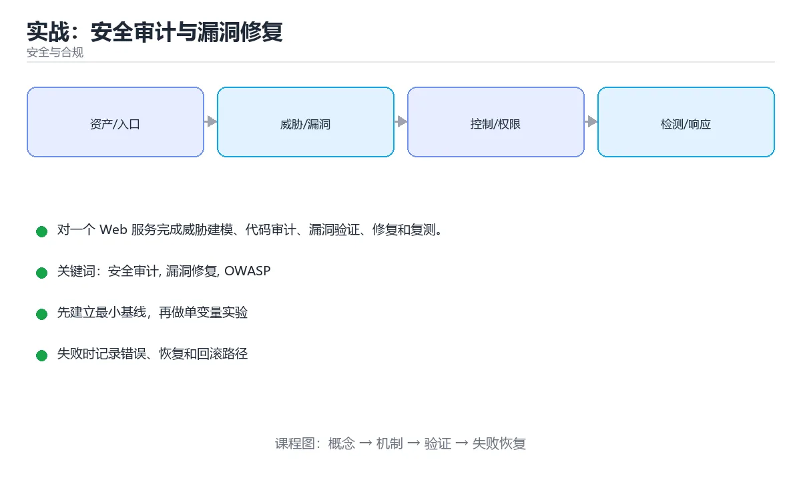

# 实战：安全审计与漏洞修复



> 内容更新时间：2026-10-03 · 学习阶段：高级 · 预计用时：120 分钟

## 学习目标

- 能用自己的话解释：先画数据流和信任边界，再按资产、入口和权限列出威胁与验证计划。
- 能用自己的话解释：审计代码、依赖、配置和日志，使用最小证据证明漏洞影响而不破坏数据。
- 能用自己的话解释：修复后复测原漏洞、同类入口和回归路径，并记录剩余风险与责任人。
- 能把本课知识放回「安全与合规」，并完成练习与测验。

## 前置知识

- 已完成「安全与合规」的基础课程，能运行正文中的最小示例。
- 本课关键词：安全审计、漏洞修复、OWASP、复测、审计日志。
- 遇到不熟悉的术语先记录问题，完成练习后再回读。

## 核心知识

### 1. 先画数据流和信任边界，再按资产、入口和权限列出威胁与验证计划。

- 它解决的问题：把「先画数据流和信任边界，再按资产、入口和权限列出威胁与验证计划。」放回真实场景，说明不做它会带来什么后果。
- 关键做法：先用最小示例建立基线，再逐步加入边界、失败和性能条件。
- 验证标准：结果可复现、错误可解释、边界有测试、失败能恢复。

### 2. 审计代码、依赖、配置和日志，使用最小证据证明漏洞影响而不破坏数据。

- 它解决的问题：把「审计代码、依赖、配置和日志，使用最小证据证明漏洞影响而不破坏数据。」放回真实场景，说明不做它会带来什么后果。
- 关键做法：先用最小示例建立基线，再逐步加入边界、失败和性能条件。
- 验证标准：结果可复现、错误可解释、边界有测试、失败能恢复。

### 3. 修复后复测原漏洞、同类入口和回归路径，并记录剩余风险与责任人。

- 它解决的问题：把「修复后复测原漏洞、同类入口和回归路径，并记录剩余风险与责任人。」放回真实场景，说明不做它会带来什么后果。
- 关键做法：先用最小示例建立基线，再逐步加入边界、失败和性能条件。
- 验证标准：结果可复现、错误可解释、边界有测试、失败能恢复。

## 关键流程

```text
输入 → 校验 → 核心处理 → 验证 → 记录指标 → 失败恢复
```

## 代码示例

```python
def validate_role(user, required):
    if user is None:
        raise PermissionError('anonymous')
    if required not in user.roles:
        raise PermissionError('forbidden')
    return True
```

## 实践路径

1. 用一句话复述本课要解决的问题。
2. 跑通正文中的最小示例并记录基线。
3. 只改变一个输入或参数，预测并验证结果。
4. 补一个失败路径，记录错误、恢复和指标。
5. 把结论写成可复现的笔记或测试。

## 常见误区

| 误区 | 后果 | 修正 |
| --- | --- | --- |
| 只记术语不做实验 | 遇到真实问题无法判断 | 用最小输入跑通并记录结果 |
| 只测正常路径 | 边界和故障上线才暴露 | 补空值、极值和依赖失败 |
| 没有基线就优化 | 无法证明改进有效 | 先测量再修改 |
| 忽略成本与安全 | 性能和风险失控 | 同时记录资源、权限与失败代价 |

## 动手练习

1. 合上教程，用 3～5 句话解释「实战：安全审计与漏洞修复」。
2. 从正文选一个例子，改变一个条件并预测结果。
3. 设计一个失败场景，写出止损与恢复步骤。

**验收标准**：留下输入、命令、输出、差异和下一步问题。

## 本课小结

- 本课属于「安全与合规」，核心关键词是 安全审计、漏洞修复、OWASP、复测、审计日志。
- 先保证正确与可复现，再讨论性能和扩展。
- 完成练习和测验后，把仍然不确定的问题写成下一轮验证清单。

> 本课由 P1 内容扩展生成，重点补充原有课程缺失的主题与工程边界。

<!-- p2-enrichment:v1 -->

## English Overview

**Title:** Project: Security Audit and Remediation

**Summary:** Perform threat modeling, audit, exploitation validation, remediation and retest.

**Category:** Security & Compliance  
**Level:** 高级  
**Key terms:** 安全审计, 漏洞修复, OWASP, 复测, 审计日志

> The full tutorial is written in Chinese. This bilingual overview helps English readers identify the topic, scope and key terms before studying the detailed examples.

## 内容元数据

- 内容版本：v2.0
- 最后更新：2026-10-03
- 学习阶段：高级
- 适用环境：OWASP、云原生与合规安全实践
- 内容来源：内置结构化课程与工程实践整理
- 相关主题：安全审计、漏洞修复、OWASP、复测、审计日志
- 质量版本：P0 测验标准 + P1 覆盖扩展 + P2 体验补全

## 项目专属规格：实战：安全审计与漏洞修复

### 核心场景

对一个 Web 服务完成威胁建模、代码审计、漏洞验证、修复和复测。 项目目标是把「安全审计、漏洞修复、OWASP、复测、审计日志」落实为可运行、可测试、可回滚的交付物。

### 架构与数据流

```text
用户/输入 → 接口或命令 → 领域逻辑 → 存储/外部依赖 → 输出与监控
                         ↘ 失败分类 → 重试/补偿 → 回滚
```

### 最小数据模型

| 对象 | 关键字段 | 约束 |
| --- | --- | --- |
| 输入实体 | 安全审计、时间、来源 | 必填校验、长度限制、幂等键 |
| 任务实体 | 状态、优先级、创建时间 | 状态迁移合法、不可重复执行 |
| 结果实体 | 输出、错误码、耗时 | 可序列化、错误可解释 |
| 审计记录 | 操作者、动作、结果、时间 | 不可篡改、可查询、脱敏 |

### 验收场景

1. 正常路径：最小输入得到预期输出，并留下日志与指标。
2. 边界路径：空值、最大值、重复数据和超长内容得到明确处理。
3. 失败路径：依赖超时或不可用时能快速失败、重试或降级。
4. 幂等路径：同一请求执行两次不会产生重复副作用。
5. 回滚路径：回滚后数据一致，且能说明恢复时间和影响范围。

<!-- project-verification:v1 -->

## 验证命令与预期输出

项目代码不能只看“能编译”，还要能按固定命令复现结果。下表给出最低验证集：

| 阶段 | 命令 | 预期输出 |
| --- | --- | --- |
| 安装依赖 | `python -m pip install -r requirements.txt` | 依赖安装完成，没有版本冲突 |
| 语法检查 | `python -m compileall .` | 所有模块编译通过 |
| 运行测试 | `python -m pytest -q` | 测试全部通过，失败用例数为 0 |
| 启动示例 | `python main.py` | 服务启动并输出监听地址 |

### 验收证据

- [ ] 保存依赖安装和启动命令的完整输出。
- [ ] 至少运行 3 条测试，其中包含一条非法输入或失败路径。
- [ ] 重复执行同一操作两次，确认没有重复写入或副作用。
- [ ] 记录一次失败状态码、错误日志和恢复步骤。
- [ ] 在 README 中写明环境版本、启动方式和回滚方式。

### 回归与回滚

1. 先在一个可丢弃的目录或临时数据库执行，避免污染真实数据。
2. 修改一处逻辑后重跑全部验证命令，确认没有回归。
3. 若失败，回滚到上一个可运行版本并保留失败日志。
4. 定位原因后补一条自动化测试，再重新执行发布流程。
5. 把教训写入项目复盘或本课笔记，形成下一次的检查项。

<!-- domain-supplement:v1 -->

## 安全落地补充：实战：安全审计与漏洞修复

### 一、资产、边界与信任

先回答：保护哪些数据、谁可以访问、哪些组件是信任边界、攻击者能从哪些入口进入。围绕「安全审计、漏洞修复、OWASP、复测」列出至少 3 个入口和对应的最小权限。

### 二、威胁 → 控制 → 验证

| 威胁 | 预防控制 | 检测方式 | 验证证据 |
| --- | --- | --- | --- |
| 输入被污染 | schema、白名单、编码 | 异常输入日志和告警 | 越权与注入测试 |
| 权限过大 | 最小权限、临时凭证 | 权限审计和异常调用 | 权限边界测试 |
| 密钥泄露 | 密钥管理、轮换 | 仓库和日志扫描 | 轮换与影响范围记录 |
| 操作不可追溯 | 结构化审计日志 | 关键动作告警 | 审计查询和复盘 |
| 恢复失败 | 备份、回滚、演练 | 恢复指标监控 | 演练时间与数据校验 |

### 三、上线前安全清单

- [ ] 所有外部输入经过校验和输出编码。
- [ ] 认证、授权和会话失效逻辑有测试。
- [ ] 密钥不进入源码、镜像和日志。
- [ ] 依赖漏洞、许可证和来源已审查。
- [ ] 高风险操作有确认、审计和回滚。
- [ ] 安全事件有联系人和升级路径。

### 四、事件响应演练

构造一次凭证泄露或越权访问，按发现、隔离、轮换、取证、恢复、复盘六步执行，记录时间线和剩余风险。

<!-- project-delivery:v1 -->

## 项目交付物

### 建议仓库结构

```text
src/
tests/
docs/
README.md
```

### 测试矩阵

| 层级 | 覆盖内容 | 最低数量 | 通过标准 |
| --- | --- | ---: | --- |
| 单元测试 | 领域规则、边界和错误分类 | 8 | 正常、边界、失败路径全部通过 |
| 集成测试 | 数据库、网络、文件或平台边界 | 3 | 使用真实边界且可重复运行 |
| 端到端测试 | 核心用户路径 | 1 | 从输入到输出完整跑通 |
| 手动验收 | 文档中列出的 5 个场景 | 5 | 有命令、输出和结论记录 |

### 验收数据

```json
{
  "project": "security_project",
  "input": {"case": "normal", "value": 5},
  "expected": {"ok": true, "result": 5},
  "failure_case": {"value": -1, "error": "validation_error"},
  "idempotency_key": "demo-001"
}
```

### 复盘模板

| 问题 | 记录 |
| --- | --- |
| 原目标是什么？ | 用一句话描述可验收目标 |
| 实际发生了什么？ | 时间线、指标和关键日志 |
| 哪个假设被推翻？ | 根因与促成因素 |
| 如何回滚？ | 步骤、耗时和数据校验 |
| 下一步做什么？ | 负责人、期限和验证方式 |

> 项目验收围绕「安全审计、漏洞修复、OWASP」：至少完成一次正常路径、一次边界输入、一次失败恢复和一次幂等检查。

<!-- top50-rewrite:v1 -->

## 课程专属精读：实战：安全审计与漏洞修复

### 一、知识地图

| 主题 | 核心要点 | 验证方式 |
| --- | --- | --- |
| 核心知识 | ### 1. 先画数据流和信任边界，再按资产、入口和权限列出威胁与验证计划。 | 复述要点 + 举一个反例 |
| 关键流程 | 输入 → 校验 → 核心处理 → 验证 → 记录指标 → 失败恢复 | 运行示例 + 换一个边界输入 |
| 代码示例 | def validaterole(user, required): if user is None: raise PermissionError('anonymous') if… | 运行示例 + 换一个边界输入 |
| 实践路径 | 用一句话复述本课要解决的问题。 | 复述要点 + 举一个反例 |

### 二、机制与验证

1. **核心知识**：### 1. 先画数据流和信任边界，再按资产、入口和权限列出威胁与验证计划。 验证方式：先复述要点，再举一个反例说明边界。
2. **关键流程**：输入 → 校验 → 核心处理 → 验证 → 记录指标 → 失败恢复 验证方式：先原样运行示例，再把输入换成边界值，对照输出差异。
3. **代码示例**：def validaterole(user, required): if user is None: raise PermissionError('anonymous') if… 验证方式：先原样运行示例，再把输入换成边界值，对照输出差异。
4. **实践路径**：用一句话复述本课要解决的问题。 验证方式：先复述要点，再举一个反例说明边界。

### 三、专属检查问题

1. 「核心知识」要解决什么问题？请用一句话说明，并给出一个具体例子。
2. 「关键流程」的输入和输出分别是什么？
3. 「代码示例」最常见的失败方式是什么？如何定位？
4. 「实践路径」的适用边界在哪里？什么情况下不该使用？

### 四、故障排查

1. 固定输入和环境，确认问题能稳定复现。
2. 找到第一个异常状态，不从最终错误倒推。
3. 每次只改一个变量，记录预测和真实结果。
4. 修复后补边界、失败与重复执行三类测试。

## 专属复习题库

**问：核心知识的核心要点是什么？**

答：### 1. 先画数据流和信任边界，再按资产、入口和权限列出威胁与验证计划。

**问：关键流程的核心要点是什么？**

答：输入 → 校验 → 核心处理 → 验证 → 记录指标 → 失败恢复

**问：代码示例的核心要点是什么？**

答：def validaterole(user, required): if user is None: raise PermissionError('anonymous') if…

**问：实践路径的核心要点是什么？**

答：用一句话复述本课要解决的问题。

## 逐步练习：实战：安全审计与漏洞修复

### 练习 1：核心知识

1. 不看原文，用自己的话复述：### 1. 先画数据流和信任边界，再按资产、入口和权限列出威胁与验证计划。
2. 举一个正例和一个反例，说明边界在哪里。
3. 把结论写成两行笔记：一行结论，一行验证方式。

### 练习 2：关键流程

1. 不看原文，用自己的话复述：输入 → 校验 → 核心处理 → 验证 → 记录指标 → 失败恢复
2. 跑通本课示例，再把其中一个输入换成边界值，记录输出差异。
3. 把结论写成两行笔记：一行结论，一行验证方式。

### 练习 3：代码示例

1. 不看原文，用自己的话复述：def validaterole(user, required): if user is None: raise PermissionError('anonymous') if…
2. 跑通本课示例，再把其中一个输入换成边界值，记录输出差异。
3. 把结论写成两行笔记：一行结论，一行验证方式。

### 练习 4：实践路径

1. 不看原文，用自己的话复述：用一句话复述本课要解决的问题。
2. 举一个正例和一个反例，说明边界在哪里。
3. 把结论写成两行笔记：一行结论，一行验证方式。

## 故障排查手册：实战：安全审计与漏洞修复

| 现象 | 优先检查 | 修复动作 |
| --- | --- | --- |
| 「核心知识」的结果与预期不符 | 输入、环境、依赖版本、日志里的第一条错误 | 固定最小复现，只改一个变量并回归 |
| 「关键流程」的结果与预期不符 | 输入、环境、依赖版本、日志里的第一条错误 | 固定最小复现，只改一个变量并回归 |
| 「代码示例」的结果与预期不符 | 输入、环境、依赖版本、日志里的第一条错误 | 固定最小复现，只改一个变量并回归 |
| 「实践路径」的结果与预期不符 | 输入、环境、依赖版本、日志里的第一条错误 | 固定最小复现，只改一个变量并回归 |

## 自测与面试：实战：安全审计与漏洞修复

1. 「核心知识」的输入和输出分别是什么？
2. 「关键流程」最常见的失败方式是什么？如何定位？
3. 「代码示例」的适用边界在哪里？什么情况下不该使用？
4. 「实践路径」和相邻主题相比，最关键的差别是什么？

## 专属进阶任务 5：实战：安全审计与漏洞修复

把本课 4 个主题串成一个小练习：选其中一个主题做出可运行的例子，再为另外两个主题各写一条边界用例，最后用一句话说明你的验证结论。

### 验收标准

- 例子可以独立运行，输出与预期一致。
- 两条边界用例都说清了输入、预期与实际结果。
- 验证结论用一句话写清，不依赖“感觉正确”。

<!-- p2-references:v1 -->
## 参考资料与复核

- 最后复核：2026-10-04
- 下次复核：2027-04-04
- 复核范围：版本兼容、API 行为、安全建议与工程实践
- 来源性质：官方文档与标准；本课正文为离线教学重组，不复制原文

| 参考资料 | 本课用途 |
| --- | --- |
| [OWASP Cheat Sheets](https://cheatsheetseries.owasp.org/) | 应用安全实践 |
| [NIST Cybersecurity](https://www.nist.gov/cyberframework) | 风险治理框架 |

> 本课主题：对一个 Web 服务完成威胁建模、代码审计、漏洞验证、修复和复测。

> App 完全离线展示文字链接，不会自动联网；需要延伸阅读时可复制链接到浏览器。

