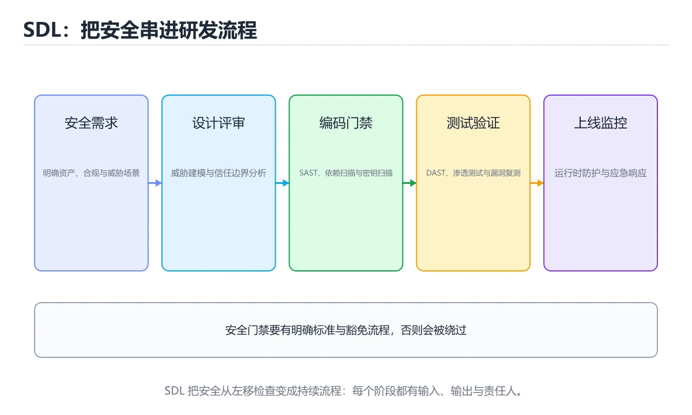
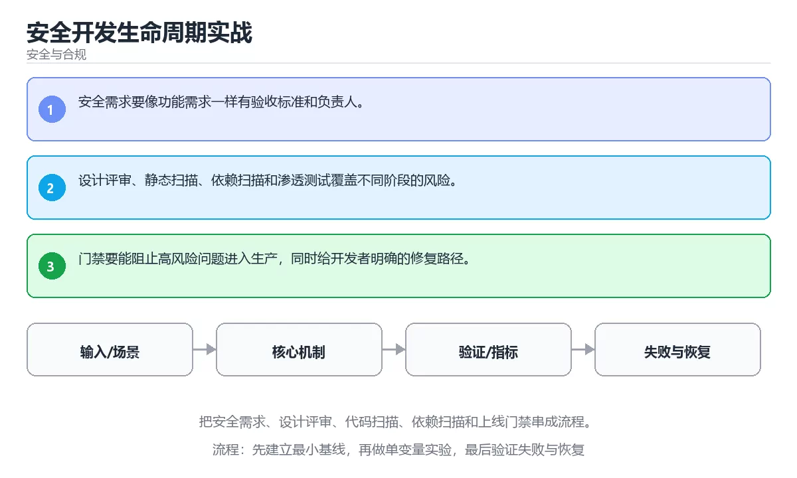

# 安全开发生命周期实战

> 内容更新时间：2026-10-06 · 学习阶段：进阶 · 预计用时：60 分钟





## 学习目标

- 能用自己的话解释：安全需求要像功能需求一样有验收标准和负责人。
- 能用自己的话解释：设计评审、静态扫描、依赖扫描和渗透测试覆盖不同阶段的风险。
- 能用自己的话解释：门禁要能阻止高风险问题进入生产，同时给开发者明确的修复路径。
- 能把本课知识放回「安全与合规」，并完成练习与测验。

## 前置知识

- 具备本分类的前置知识，能跑通「安全开发生命周期实战」的示例并解释输出。
- 本课关键词：SDL、安全需求、代码扫描、上线门禁。
- 遇到不熟悉的术语先记录问题，完成练习后再回读。

## 核心知识

### 1. 安全需求要像功能需求一样有验收标准和负责人。

- 关键做法：先让 SDL 的最小示例可复现，再加入并发或规模条件。
- 验证标准：安全需求 的异常路径有明确错误信息与恢复动作。

### 2. 设计评审、静态扫描、依赖扫描和渗透测试覆盖不同阶段的风险。

把这条结论放回「安全开发生命周期实战」的完整流程里展开：

- 正文依据：能用自己的话解释：安全需求要像功能需求一样有验收标准和负责人。
- 落地检查：把「2. 设计评审、静态扫描、依赖扫描和渗透测试覆盖不同阶段的风险。」改写成一条可执行的核对项，逐条验证输入、超时与失败路径。

### 3. 门禁要能阻止高风险问题进入生产，同时给开发者明确的修复路径。

把这条结论放回「安全开发生命周期实战」的完整流程里展开：

- 正文依据：本课关键词：SDL、安全需求、代码扫描、上线门禁。
- 落地检查：把「3. 门禁要能阻止高风险问题进入生产，同时给开发者明确的修复路径。」改写成一条可执行的核对项，逐条验证输入、超时与失败路径。

## 关键流程

```text
输入 → 校验 → 核心处理 → 验证 → 记录指标 → 失败恢复
```

## 实践路径

1. 用一句话复述本课要解决的问题。
2. 跑通正文中的最小示例并记录基线。
3. 只改变一个输入或参数，预测并验证结果。
4. 补一个失败路径，记录错误、恢复和指标。
5. 把结论写成可复现的笔记或测试。

## 常见错误与排查

> 说明：本表由《安全开发生命周期实战》的核心知识整理（2026-10-07），人工复核进度见 docs/content_review_batches.md。

| 易错点 | 容易踩的做法 | 正确结论 |
| --- | --- | --- |
| 安全只在测试阶段介入 | 发现问题时返工成本很高 | 在需求与设计阶段就做威胁建模 |
| 安全检查没有准入标准 | 漏洞带病上线 | 定义可度量的上线门槛并强制执行 |
| 流程与培训脱节 | 规范落不了地 | 把安全要求嵌入日常工具与评审模板 |

## 动手练习

1. 合上教程，用 3～5 句话解释安全开发生命周期实战。
2. 从正文选一个例子，改变一个条件并预测结果。
3. 设计一个失败场景，写出止损与恢复步骤。

**验收标准**：留下输入、命令、输出、差异和下一步问题。

## 本课小结

- 本课围绕 SDL、安全需求、代码扫描、上线门禁 展开，复习时重点核对它们的输入、输出和失败路径。
- 把还不确定的 validation_error 行为写成一条可执行验证，再进入下一课。


## 验证命令与预期输出

先让 validation_error 的结果可复现，再谈扩展。下表给出最低验证集：

| 阶段 | 命令 | 预期输出 |
| --- | --- | --- |
| 安装依赖 | `python -m pip install -r requirements.txt` | 依赖安装完成，没有版本冲突 |
| 语法检查 | `python -m compileall .` | 所有模块编译通过 |
| 运行测试 | `python -m pytest -q` | 测试全部通过，失败用例数为 0 |
| 启动示例 | `python main.py` | 服务启动并输出监听地址 |

### 验收证据

- [ ] 保存依赖安装和启动命令的完整输出。
- [ ] 至少运行 3 条 SDL 相关测试，其中一条是非法输入或失败路径。
- [ ] 连续两次触发 安全需求，检查数据与计数是否被重复累加。
- [ ] 记录一次失败状态码、错误日志和恢复步骤。
- [ ] 在 README 中写明 SDL 所需的环境版本、启动方式和回滚方式。

### 回归与回滚

1. 先在副本上执行 安全需求，并记录前后差异。
2. 修改一处逻辑后重跑全部验证命令，确认没有回归。
3. 若失败，回滚到上一个可运行版本并保留失败日志。
4. 定位原因后补一条自动化测试，再重新执行发布流程。
5. 把教训写入项目复盘或本课笔记，形成下一次的检查项。

## 安全落地补充：安全开发生命周期实战

### 一、资产、边界与信任

先回答：保护哪些数据、谁可以访问、哪些组件是信任边界、攻击者能从哪些入口进入。围绕「SDL、安全需求、代码扫描、上线门禁」列出至少 3 个入口和对应的最小权限。

### 二、威胁 → 控制 → 验证

| 威胁 | 预防控制 | 检测方式 | 验证证据 |
| --- | --- | --- | --- |
| 输入被污染 | schema、白名单、编码 | 异常输入日志和告警 | 越权与注入测试 |
| 权限过大 | 最小权限、临时凭证 | 权限审计和异常调用 | 权限边界测试 |
| 密钥泄露 | 密钥管理、轮换 | 仓库和日志扫描 | 轮换与影响范围记录 |
| 操作不可追溯 | 结构化审计日志 | 关键动作告警 | 审计查询和复盘 |
| 恢复失败 | 备份、回滚、演练 | 恢复指标监控 | 演练时间与数据校验 |

### 三、上线前安全清单

- [ ] 所有外部输入经过校验和输出编码。
- [ ] 认证、授权和会话失效逻辑有测试。
- [ ] 密钥不进入源码、镜像和日志。
- [ ] 依赖漏洞、许可证和来源已审查。
- [ ] 高风险操作有确认、审计和回滚。
- [ ] 安全事件有联系人和升级路径。

### 四、事件响应演练

围绕「安全开发生命周期实战」构造一次 SDL 相关的越权或泄露场景，按发现、隔离、轮换、取证、恢复、复盘六步执行，记录时间线与剩余风险。

## 可运行练习

### 任务 1：先跑通，再解释

```python
import hashlib

digest = hashlib.sha256(b"password").hexdigest()
print(digest[:12])
```

### 任务 2：只改一个条件

把「安全开发生命周期实战」的最小示例复制一份，只改一个条件再跑一次：

- 改动点：把 安全需求 换成边界值，其他输入保持原样。
- 预测：先写下「安全开发生命周期实战」在改动后的输出或错误信息，再运行。
- 记录：对照改动前后的结果，指出差异出在哪一步。
- 验收：换回原条件能复现原结果，改动只影响SDL。

### 任务 3：迁移到自己的数据

把 validation_error 换成你自己的输入，先保持步骤不变，再比较输出差异。

## 故障现场

### 现场 1：安全只在测试阶段介入

**症状**：在《安全开发生命周期实战》的复现场景中，发现问题时返工成本很高。

**根因**：“发现问题时返工成本很高”只是表层结果。向上追溯会落到“安全只在测试阶段介入”这一步，因为它省略了《安全开发生命周期实战》的约束，使实现行为和预期模型发生了偏离。

**修复**：针对《安全开发生命周期实战》的问题，在需求与设计阶段就做威胁建模。

**验证**：在《安全开发生命周期实战》中按“在需求与设计阶段就做威胁建模”调整后，从“安全只在测试阶段介入”的触发条件重放同一条路径，确认“发现问题时返工成本很高”不再出现，并补一个相邻边界用例检查没有引入新问题。

### 现场 2：安全检查没有准入标准

**症状**：在《安全开发生命周期实战》的复现场景中，漏洞带病上线。

**根因**：触发点是把“安全检查没有准入标准”当成安全做法。它没有满足《安全开发生命周期实战》要求的前提，因此先表现为“漏洞带病上线”；排查时先完整复现这一段，再核对输入、配置与依赖。

**修复**：针对《安全开发生命周期实战》的问题，定义可度量的上线门槛并强制执行。

**验证**：保留《安全开发生命周期实战》里触发“漏洞带病上线”的输入、版本和日志，按“定义可度量的上线门槛并强制执行”完成修改后原样重放；只有失败现象消失且相邻场景仍可解释，才保留改动。

### 现场 3：流程与培训脱节

**症状**：在《安全开发生命周期实战》的复现场景中，规范落不了地。

**根因**：“规范落不了地”只是表层结果。向上追溯会落到“流程与培训脱节”这一步，因为它省略了《安全开发生命周期实战》的约束，使实现行为和预期模型发生了偏离。

**修复**：针对《安全开发生命周期实战》的问题，把安全要求嵌入日常工具与评审模板。

**验证**：保留《安全开发生命周期实战》里触发“规范落不了地”的输入、版本和日志，按“把安全要求嵌入日常工具与评审模板”完成修改后原样重放；只有失败现象消失且相邻场景仍可解释，才保留改动。

## 本课复习清单


离开本课前，逐项确认：

- [ ] 不看解析，能说出「关于「安全需求要像功能需求一样有验收标准和负责人。」，下列说法正确的是？」的判断依据。
- [ ] 不看解析，能说出「围绕“安全开发生命周期实战”中的 SDL、安全需求、代码扫描，下列哪两项是本课强调的实践判断？」的判断依据。
- [ ] 不看解析，能说出「下面这段 Python 代码摘自「安全开发生命周期实战」的正文示例。关于这段代码，下面哪一项说法与实际内容相符？」的判断依据。
- [ ] 至少运行一次《安全开发生命周期实战》的示例，记录输入、输出和一个边界情况。
- [ ] 把本课最容易混淆的两个概念写成一句话对照。

| 复盘项 | 记录 |
| --- | --- |
| 已经能独立解释的考点 |  |
| 仍然说不清的概念 |  |
| 下一步验证动作 |  |

## 术语速查

| 术语 | 一句话说明 |
| --- | --- |
| `SDL` | 安全开发生命周期：把安全活动嵌入需求、设计、编码、测试与发布各阶段。 |
| `安全需求` | 在写代码前明确要防住什么威胁，以及可接受的残余风险。 |
| `威胁建模` | 按资产、攻击面与攻击路径梳理风险，并给出对应缓解措施。 |
| `代码扫描` | 用 SAST/依赖扫描在提交或构建阶段自动发现已知缺陷。 |
| `上线门禁` | 把扫描与测试结果设为发布前置条件，高危问题未修复不放行。 |

## 零基础精讲：把安全开发生命周期实战真正讲透

### 先建立一个直觉

把「安全开发生命周期实战」看成一条防线：先识别资产与威胁，再围绕 SDL 限制权限、验证输入、记录审计，并为失败准备隔离与恢复方案。

本课的摘要可以当作一张地图：把安全需求、设计评审、代码扫描、依赖扫描和上线门禁串成流程。

### 逐步拆解

1. 澄清输入与目标。先写清「安全开发生命周期实战」要解决的问题、合法输入范围和成功标准，再进入后续步骤。
2. 描述处理过程。把「SDL、安全需求、代码扫描、上线门禁」映射到具体步骤，每步都要求能单独验证。
3. 定义输出。SDL 的输出不仅包括正常结果，还包括错误码、日志和资源释放状态。
4. 制造一次安全需求的失败输入，确认错误出现在「核心知识」的哪一步，并写下恢复后如何验证状态已回到一致。
5. 把「核心知识」里的最小示例抄成 validation_error 一行的输入，先手算结果再执行，确认两者一致。

### 把正文串成一条执行链

- **1. 安全需求要像功能需求一样有验收标准和负责人。**：在「安全开发生命周期实战」里，「1. 安全需求要像功能需求一样有验收标准和负责人。」这一步要先写清输入与预期，再记录实际结果和差异；结果不符时回到对应小节核对前提。
- **2. 设计评审、静态扫描、依赖扫描和渗透测试覆盖不同阶段的风险。**：在「安全开发生命周期实战」里，「2. 设计评审、静态扫描、依赖扫描和渗透测试覆盖不同阶段的风险。」这一步要先写清输入与预期，再记录实际结果和差异；结果不符时回到对应小节核对前提。
- **3. 门禁要能阻止高风险问题进入生产，同时给开发者明确的修复路径。**：在「安全开发生命周期实战」里，「3. 门禁要能阻止高风险问题进入生产，同时给开发者明确的修复路径。」这一步要先写清输入与预期，再记录实际结果和差异；结果不符时回到对应小节核对前提。
- **验收证据**：- [ ] 保存依赖安装和启动命令的完整输出
- **回归与回滚**：1. 先在一个可丢弃的目录或临时数据库执行，避免污染真实数据
- 一、资产、边界与信任：先回答 SDL 保护哪些数据、谁能访问、攻击者从哪里进入。

### 从测验反推易错点

**检查点 1：关于「安全需求要像功能需求一样有验收标准和负责人。」，下列说法正确的是？**

- 参考判断：安全需求要像功能需求一样有验收标准和负责人。
- 自问：如果去掉题干里的一个限定词，结论还成立吗？

**检查点 2：关于「设计评审、静态扫描、依赖扫描和渗透测试覆盖不同阶段的风险。」，下列说法正确的是？**

- 参考判断：设计评审、静态扫描、依赖扫描和渗透测试覆盖不同阶段的风险。

**检查点 3：关于「门禁要能阻止高风险问题进入生产，同时给开发者明确的修复路径。」，下列说法正确的是？**

- 参考判断：门禁要能阻止高风险问题进入生产，同时给开发者明确的修复路径。

**检查点 4：本课的核心学习目标是什么？**

- 参考判断：把安全需求、设计评审、代码扫描、依赖扫描和上线门禁串成流程。

- 参考判断：security_sdl

### 工程排错顺序

| 先查什么 | 要得到的证据 | 判断标准 |
| --- | --- | --- |
| 资产、威胁和行为主体是否明确？ | 日志、输入样例、测试或指标 | 能复现并解释，才算定位 |
| 权限是否默认拒绝并最小化？ | 日志、输入样例、测试或指标 | 能复现并解释，才算定位 |
| 输入、输出与审计是否都有控制？ | 日志、输入样例、测试或指标 | 能复现并解释，才算定位 |
| 发现绕过时能否快速隔离和恢复？ | 日志、输入样例、测试或指标 | 能复现并解释，才算定位 |

### 变式训练

1. 先用一个单文件示例验证 validation_error，确认正确性后再引入框架或分布式组件。
2. 把 SDL 的输入规模扩大十倍，记录时间、内存和失败路径，找出第一个瓶颈。
3. 让 validation_error 的外部依赖超时，确认系统能回滚或补偿，而不是留下脏数据。
5. 把「安全开发生命周期实战」里最容易被省略的一步去掉，用测试或指标证明它不可省略，而不是凭感觉判断。
6. 限制 CPU 与内存上限后重跑 validation_error，观察哪一项参数需要重新设定。

### 本课自测

- [ ] 能用一句话解释「SDL」在本课中的角色与边界。
- [ ] 能举出一个正常例子和一个失败例子。
- [ ] 能说出最小验证步骤，以及需要记录的证据。
- [ ] 能用一句话解释「安全需求」在本课中的角色与边界。
- [ ] 能用一句话解释「代码扫描」在本课中的角色与边界。
- [ ] 能用一句话解释「上线门禁」在本课中的角色与边界。

### 迁移案例库

换一个 安全需求 约束重做一次，确认结论在新条件下是否仍然成立。

#### 迁移案例 1：围绕「SDL」做一次小实验

**目标**：在不改变课程主体的前提下，验证安全开发生命周期实战中的一个关键判断。

**步骤**：
1. 复述当前方案对「SDL」的假设，写成一句可证伪的话。
2. 设计一个正常输入和一个边界输入，分别预测输出。
3. 运行或逐步演算，记录实际输出、耗时和失败信息。
4. 只调整一个参数，比较前后差异并解释原因。
5. 补充一条测试或复习卡，确保下次能更快复现。

**验收**：结论要能追溯到正文的具体小节与代码位置，并记录安全需求相关的指标变化。

#### 迁移案例 2：围绕「安全需求」做一次小实验

**步骤**：
1. 复述当前方案对「安全需求」的假设，写成一句可证伪的话。

#### 迁移案例 3：围绕「代码扫描」做一次小实验

**步骤**：
1. 复述当前方案对「代码扫描」的假设，写成一句可证伪的话。

#### 迁移案例 4：围绕「上线门禁」做一次小实验

**步骤**：
1. 复述当前方案对「上线门禁」的假设，写成一句可证伪的话。

#### 迁移案例 5：围绕「SDL」做一次小实验

**步骤**：

#### 迁移案例 6：围绕「安全需求」做一次小实验

**步骤**：

#### 迁移案例 7：围绕「代码扫描」做一次小实验

**步骤**：

#### 迁移案例 8：围绕「上线门禁」做一次小实验

**步骤**：

#### 迁移案例 9：围绕「SDL」做一次小实验

**步骤**：

#### 迁移案例 10：围绕「安全需求」做一次小实验

**步骤**：

#### 迁移案例 11：围绕「代码扫描」做一次小实验

**步骤**：

#### 迁移案例 12：围绕「上线门禁」做一次小实验

**步骤**：

#### 迁移案例 13：围绕「SDL」做一次小实验

**步骤**：

#### 迁移案例 14：围绕「安全需求」做一次小实验

**步骤**：

#### 迁移案例 15：围绕「代码扫描」做一次小实验

**步骤**：

#### 迁移案例 16：围绕「上线门禁」做一次小实验

**步骤**：

<!-- p0-depth-v2:end -->

## 考点精讲

### 考点 1：概念判断·SDL

- **题目**：关于「安全需求要像功能需求一样有验收标准和负责人。」，下列说法正确的是？
- **判断依据**：在「安全开发生命周期实战」里，安全需求要像功能需求一样有验收标准和负责人。回到「安全开发生命周期实战」的正文示例，用“关于安全需求要像功能需求一样有验收标”走一遍SDL、安全需求、代码扫描的完整流程，能复现的结论才可以保留。在「安全开发生命周期实战」里，回到SDL、安全需求、代码扫描本身再看一遍：只有“安全需求要像功能需求一样有验收标准和负责”与题干“安全需求要像功能需求一样有验收标准和负责人”的前提一致，结论才成立。

### 考点 2：多选辨析·SDL

- **题目**：围绕“安全开发生命周期实战”中的 SDL、安全需求、代码扫描，下列哪两项是本课强调的实践判断？
- **判断依据**：本课把安全开发生命周期实战拆成概念、示例与故障现场三部分，因此判断 SDL 时必须同时交代输入、输出和失败路径，这使“学习 SDL 时要同时说明输入、输出和失败路径，不能只看正常流程”成立。在安全开发生命周期实战里，判断 安全需求 时要固定版本与边界输入，所以“验证 安全需求 时要固定版本并覆盖边界输入，结论才可复现”才可复现。

### 考点 3：代码补全·SDL

- **题目**：下面这段 Python 代码摘自「安全开发生命周期实战」的正文示例。关于这段代码，下面哪一项说法与实际内容相符？
- **判断依据**：题干的正确项是这段代码会产生可观察的输出，运行后能看到结果，在「安全开发生命周期实战」里要结合SDL核对输出是否符合预期。这段代码出自「安全开发生命周期实战」的正文示例，围绕SDL、安全需求、代码扫描展开；把输入或边界换成空值、极值或失败情况后，结论要以「安全开发生命周期实战」的实际运行结果为准。回到「安全开发生命周期实战」的正文示例，用“下面这段 Python 代码摘自安全”走一遍SDL、安全需求、代码扫描的完整流程，能复现的结论才可以保留。

### 考点 4：概念判断·SDL

- **题目**：「安全开发生命周期实战」的核心学习目标是什么？
- **判断依据**：在「安全开发生命周期实战」里，结论应落在「把安全需求、设计评审、代码扫描、依赖扫描和上线门禁串成流程」。在「安全开发生命周期实战」里，结论应落在把安全需求、设计评审、代码扫描、依赖扫描和上线门禁串成流程。在「安全开发生命周期实战」里，这道题要求区分概念与边界，把安全需求、设计评审、代码扫描、依赖扫描和上线门禁串成流程。

### 考点 5：填空·"project": "____",

- **题目**：补全代码：「安全开发生命周期实战」示例中，下面这行代码缺少哪个关键字或函数名？请填入 ____。 `"project": "____",`
- **判断依据**：在「安全开发生命周期实战」里，security_sdl。这道题的关键在「安全开发生命周期实战」的SDL、安全需求、代码扫描：先确认题干“补全代码”问的是哪一步，再排除偷换前提的选项。回到SDL、安全需求、代码扫描本身再看一遍：只有“securitysdl”与题干“securitysdl”的前提一致，结论才成立。

## 复习与自测

- [ ] 能不看正文写出「核心知识」的关键步骤。
- [ ] 能用一句话说明「1. 安全需求要像功能需求一样有验收标准和负责人。」解决什么问题。
- [ ] 能把「2. 设计评审、静态扫描、依赖扫描和渗透测试覆盖不同阶段的风险。」的判断标准套到一个新例子上。
- [ ] 能说清「3. 门禁要能阻止高风险问题进入生产，同时给开发者明确的修复路径。」的结论，并说出它的适用边界。
- [ ] 能用自己的话复述「关键流程」，并各举一个正例和反例。
- [ ] 能解释「实践路径」里最容易混淆的两个概念。

## English Overview

**Title:** Secure Development Lifecycle in Practice

**Summary:** Connect security requirements, reviews, scanning and release gates.

**Category:** Security & Compliance
**Level:** 高级
**Key terms:** SDL, 安全需求, 代码扫描, 上线门禁

## 内容元数据

- 内容版本：v2.0
- 最后更新：2026-10-06
- 学习阶段：进阶
- 适用环境：OWASP、云原生与合规安全实践；本课聚焦 SDL。
- 内容来源：内置结构化课程与工程实践整理
- 相关主题：SDL、安全需求、代码扫描、上线门禁
- 质量版本：P0 测验标准 + P1 覆盖扩展 + P2 体验补全

## 项目专属规格：安全开发生命周期实战

### 核心场景

把安全需求、设计评审、代码扫描、依赖扫描和上线门禁串成流程。 项目目标是把「SDL、安全需求、代码扫描、上线门禁」落实为可运行、可测试、可回滚的交付物。

### 架构与数据流

```text
用户/输入 → 接口或命令 → 领域逻辑 → 存储/外部依赖 → 输出与监控
                         ↘ 失败分类 → 重试/补偿 → 回滚
```

### 最小数据模型

| 对象 | 关键字段 | 约束 |
| --- | --- | --- |
| 输入实体 | SDL、时间、来源 | 必填校验、长度限制、幂等键 |
| 任务实体 | 状态、优先级、创建时间 | 状态迁移合法、不可重复执行 |
| 结果实体 | 输出、错误码、耗时 | 可序列化、错误可解释 |
| 审计记录 | 操作者、动作、结果、时间 | 不可篡改、可查询、脱敏 |

### 验收场景

1. 正常路径：最小输入得到预期输出，并留下日志与指标。
2. 边界路径：把 validation_error 的输入推到上下限，确认返回结果可解释。
3. 失败路径：依赖超时或不可用时能快速失败、重试或降级。
4. 幂等路径：同一请求执行两次不会产生重复副作用。
5. 回滚路径：安全需求 的失败能按预案恢复，并记录影响范围。

## 最小可运行示例

下面示例用于验证 SDL 的最小输入、处理和输出。先原样运行，再只修改一个值：

```python
import hashlib

digest = hashlib.sha256(b"password").hexdigest()
print(digest[:12])
```

## 预期输出

```text
5e884898da28
```

## 验证步骤

1. 记录运行环境、命令和真实输出。
2. 修改一个输入，先写预测再运行。
3. 制造一次错误输入，记录错误信息与修复方式。
4. 把结论写回本课笔记或测试用例。

## 项目交付物

### 建议仓库结构

```text
src/
tests/
docs/
README.md
```

### 测试矩阵

| 层级 | 覆盖内容 | 最低数量 | 通过标准 |
| --- | --- | ---: | --- |
| 单元测试 | 领域规则、边界和错误分类 | 8 | 正常、边界、失败路径全部通过 |
| 集成测试 | 数据库、网络、文件或平台边界 | 3 | 使用真实边界且可重复运行 |
| 端到端测试 | 核心用户路径 | 1 | 从输入到输出完整跑通 |
| 手动验收 | 文档中列出的 5 个场景 | 5 | 有命令、输出和结论记录 |

### 验收数据

```json
{
  "project": "security_sdl",
  "scenario": "SDL的正常路径",
  "input": {"case": "normal", "value": "validation_error"},
  "expected": {"ok": true, "checks": ["SDL可复现", "安全需求有记录"]},
  "failure_case": {"case": "安全需求越界或缺失", "error": "validation_error"},
  "idempotency_key": "security_sdl-001"
}
```

### 复盘模板

| 问题 | 记录 |
| --- | --- |
| 原目标是什么？ | 用一句话描述可验收目标 |
| 实际发生了什么？ | 时间线、指标和关键日志 |
| 哪个假设被推翻？ | 根因与促成因素 |
| 如何回滚？ | 步骤、耗时和数据校验 |
| 下一步做什么？ | 负责人、期限和验证方式 |

> 项目验收围绕「SDL、安全需求、代码扫描」：至少完成一次正常路径、一次边界输入、一次失败恢复和一次幂等检查。

## 参考资料与复核

- 最后复核：2026-10-04
- 下次复核：2026-11-17
- 复核范围：版本兼容、API 行为、安全建议与工程实践
- 来源性质：官方文档、标准或权威教材；正文为离线教学重组

| 参考资料 | 本课用途 |
| --- | --- |
| [MITRE ATT&CK](https://attack.mitre.org/) | 攻击技术与防御映射 |
| [NIST 网络安全框架](https://www.nist.gov/cyberframework) | 风险管理与治理 |
| [OWASP Cheat Sheets](https://cheatsheetseries.owasp.org/) | 认证、授权与安全编码 |

> 「安全开发生命周期实战」的链接用于离线阅读后的延伸核对；App 不会自动联网。

<!-- p1-project-review:start -->
## 交付评审：评分表、决策记录与证据链

「安全开发生命周期实战」的验收不能只看功能能不能跑通。下面把正文里的交付物、验证命令和关键设计点整理成一张评审表，按表逐项留下证据即可。

### 一、「安全开发生命周期实战」的交付物评分表

| 交付物 | 权重 | 合格线 | 需要的证据 |
| --- | ---: | --- | --- |
| 核心链路 | 34% | 能在干净环境复现，且失败路径有明确处理 | 命令与输出、对应测试、一次失败与恢复记录 |
| 测试与验收记录 | 33% | 能在干净环境复现，且失败路径有明确处理 | 命令与输出、对应测试、一次失败与恢复记录 |
| 运行与回滚说明 | 33% | 能在干净环境复现，且失败路径有明确处理 | 命令与输出、对应测试、一次失败与恢复记录 |

「安全开发生命周期实战」的评分先看证据再打分：任意一项只要拿不出可复现的命令或测试，该项按 0 分计，不允许用「基本完成」代替。

### 二、需要写下来的决策（ADR）

| 决策点 | 本课给出的做法 | 备选方案 | 代价与回滚 |
| --- | --- | --- | --- |
| 2. 设计评审、静态扫描、依赖扫描和渗透测试覆盖不同阶段的风险。 | 把这条结论放回「安全开发生命周期实战」的完整流程里展开： | 不做「2. 设计评审、静态扫描、依赖扫描和渗透测试覆盖不同阶段的风险。」，沿用最朴素的实现（需要额外补一次对照实验） | 若「2. 设计评审、静态扫描、依赖扫描和渗透测试覆盖不同阶段的风险。」出问题，回到上一版本并按本课验收场景重跑 |
| 一、资产、边界与信任 | 先回答：保护哪些数据、谁可以访问、哪些组件是信任边界、攻击者能从哪些入口进入。 | 不做「一、资产、边界与信任」，沿用最朴素的实现（需要额外补一次对照实验） | 若「一、资产、边界与信任」出问题，回到上一版本并按本课验收场景重跑 |
| 架构与数据流 | 用户/输入 → 接口或命令 → 领域逻辑 → 存储/外部依赖 → 输出与监控 | 不做「架构与数据流」，沿用最朴素的实现（需要额外补一次对照实验） | 若「架构与数据流」出问题，回到上一版本并按本课验收场景重跑 |

ADR 不需要长：每个决策三行就够——选了什么、放弃了什么、出问题怎么退。评审时只检查这三行是否和「安全开发生命周期实战」的实际代码一致。

### 三、「安全开发生命周期实战」的交付证据链

本课未给出可执行命令，用下面的最小证据集代替：

1. 一条从零开始的环境准备命令。
2. 一条跑通核心链路的命令及其完整输出。
3. 一条触发失败的命令，以及恢复后的验证结果。

把「安全开发生命周期实战」的上表整理成一个 evidence/ 目录：每条命令一个文件，文件名带日期，内容包含版本、命令与输出。评审时直接按目录核对，不再口头确认。

### 四、「安全开发生命周期实战」的验收指标

| 指标 | 目标值 | 测量方式 | 不达标时的动作 |
| --- | --- | --- | --- |
| 把 SDL 的输入规模扩大十倍，记录时间、内存和失败路径，找出第一个瓶颈。 | 用本课正文给出的阈值，没有就写实测基线 | 固定环境重复三次取中位数 | 回到对应小节定位，先修原因再重测 |

指标必须能用一条命令或一次操作测出来；写不出测量方式的指标，在「安全开发生命周期实战」的评审里一律视为未定义。

### 五、评审记录模板

| 记录项 | 填写要求 |
| --- | --- |
| 项目标识 | `security_sdl` |
| 本次范围 | 说明这一轮交付了「安全开发生命周期实战」的哪些部分 |
| 未完成项 | 列出与 SDL 相关但本轮未做的内容 |
| 证据位置 | 指向 evidence/ 目录下的具体文件 |
| 风险与回滚 | 写清剩余风险、回滚步骤和验证方式 |
| 结论 | 通过 / 有条件通过 / 不通过，三者选一 |

「安全开发生命周期实战」评审结束后把这张表填完并归档；下一轮迭代直接读上一次的「未完成项」与「风险与回滚」，避免重复讨论同一个问题。
<!-- p1-project-review:end -->
