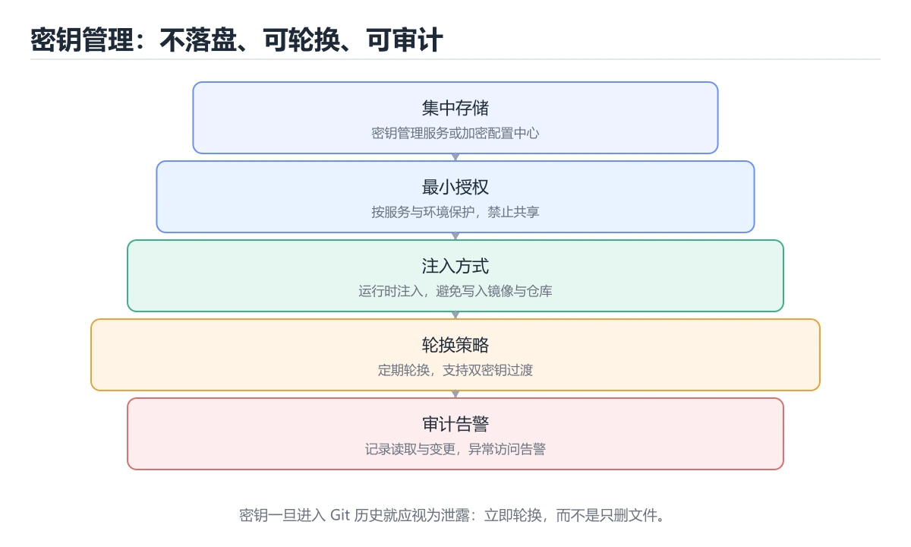
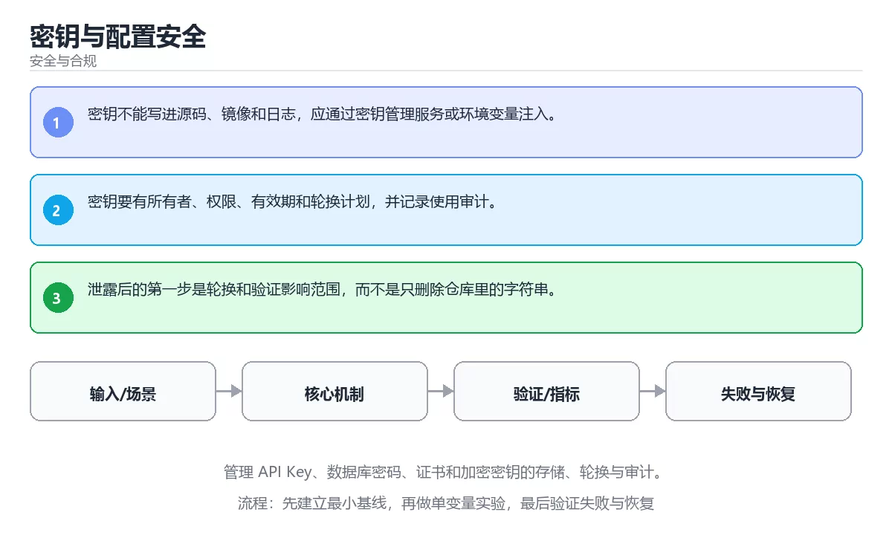

# 密钥与配置安全

> 内容更新时间：2026-10-06 · 学习阶段：进阶 · 预计用时：35 分钟





## 本节知识框架

**课程定位**：所属分类 `security`（安全与合规），课程主题 `密钥与配置安全`，学习阶段 进阶，建议用时 40 分钟。

本课主线：管理 API Key、数据库密码、证书和加密密钥的存储、轮换与审计。

**学完本课应当能够**
- 说清 `密钥管理` 与 `轮换` 的含义与区别，并各举一个正例和一个反例。
- 用本课示例验证 `配置` 的行为，记录输入、输出与失败条件。
- 遇到「密钥写进仓库或镜像」这类问题时，能说出触发条件与修复顺序。

### 从概念到验证的学习链条

1. `密钥管理`：先掌握 安全地生成、存储、轮换、授权和销毁密钥，避免密钥出现在代码或日志中，再用它解释 `轮换` 为什么会出现。
2. `轮换`：先掌握 定期替换密钥、密码或凭证，降低长期泄露风险，再用它解释 `配置` 为什么会出现。
3. `配置`：先掌握 在不改代码的前提下控制程序行为与部署参数的外部数据，再用它解释 `审计` 为什么会出现。
4. `审计`：先掌握 记录谁在何时对什么资源做了什么，并保证日志可追溯、不可随意篡改，再用它解释 本课示例的观察结果 为什么会出现。

**先修与衔接**：本课是「安全与合规」分类的第 7 课。先修内容：《认证、会话与令牌安全》。《认证、会话与令牌安全》里的 `认证`、`会话` 是本课的前提。相关或后续课程：《软件供应链安全》。

### 完成判据

- **定义关**：不看正文也能说明 `密钥管理` 是 安全地生成、存储、轮换、授权和销毁密钥，避免密钥出现在代码或日志中，并指出一个反例。
- **机制关**：能按“输入 → 转换 → 输出 → 验证”复述 `密钥与配置安全`，而不是只背结论。
- **示例关**：能运行或推演 `密钥与配置安全` 的 `text` 示例，并说明一个真实出现的标识符或字面量。
- **证据关**：能指出 `密钥与配置安全` 示例里的 调用了 `sha256()`，并说明它支持或反驳了本课的哪一条结论。
- **排错关**：能复现 密钥写进仓库或镜像，记录现象并按 用密钥管理服务并临时注入 修复。
- **迁移关**：能把 `密钥管理`、`轮换`、`配置`、`审计` 放进一个与 `密钥与配置安全` 不同的项目场景，并保持输入与验证条件可追踪。
- **复盘关**：学完 `密钥与配置安全` 后，用一句话写下仍然不确定的结论，并列出下一次验证需要的输入、环境和成功判据。

### 复习清单

- [ ] 能不看正文复述本课核心术语，并指出一个边界或反例。
- [ ] 能运行或推演本课示例，记录输入、输出与失败现象。
- [ ] 能完成一次自测，并把错题对照错误表定位原因。

## 核心概念定义

| 术语 | 操作性定义 | 常见边界与风险 |
| --- | --- | --- |
| 密钥管理 | 安全地生成、存储、轮换、授权和销毁密钥，避免密钥出现在代码或日志中。 | 易错：泄露后无法彻底清除；正确做法是用密钥管理服务并临时注入。 |
| 轮换 | 定期替换密钥、密码或凭证，降低长期泄露风险。 | 易错：泄露窗口无限延长；正确做法是定义轮换周期并自动化流程。 |
| 配置 | 在不改代码的前提下控制程序行为与部署参数的外部数据。 | 容器与集群环境差异会改变行为，本地通过后仍需在目标编排环境复验。 |
| 审计 | 记录谁在何时对什么资源做了什么，并保证日志可追溯、不可随意篡改。 | 只在「记录谁在何时对什么资源做了什么，并保证日志可追溯、不可随意篡改」这一前提下成立，换输入或换环境要重新验证。 |

## 原理与运行机制

### 机制总览

**教材衔接：核心知识**

### 1. 密钥不能写进源码、镜像和日志，应通过密钥管理服务或环境变量注入。

- 关键做法：基线只保留 轮换 必需的部分，其余条件一次加一个。
- 验证标准：e884898da28 的输出能被他人复现，边界输入有对应用例。

### 2. 密钥要有所有者、权限、有效期和轮换计划，并记录使用审计。

把这条结论放回「密钥与配置安全」的完整流程里展开：

- 正文依据：能用自己的话解释：密钥不能写进源码、镜像和日志，应通过密钥管理服务或环境变量注入。
- 落地检查：把「2. 密钥要有所有者、权限、有效期和轮换计划，并记录使用审计。」改写成一条可执行的核对项，逐条验证输入、超时与失败路径。

### 3. 泄露后的第一步是轮换和验证影响范围，而不是只删除仓库里的字符串。

把这条结论放回「密钥与配置安全」的完整流程里展开：

- 正文依据：能用自己的话解释：密钥要有所有者、权限、有效期和轮换计划，并记录使用审计。
- 落地检查：把「3. 泄露后的第一步是轮换和验证影响范围，而不是只删除仓库里的字符串。」改写成一条可执行的核对项，逐条验证输入、超时与失败路径。

**教材衔接：关键流程**

**教材衔接：实践路径**

**教材衔接：验证步骤**

### 机制拆解：每一步的输入、动作与输出

#### 1. `密钥管理`
- 输入：`密钥管理`；本步把 安全地生成、存储、轮换、授权和销毁密钥，避免密钥出现在代码或日志中 当作判断规则。
- 动作：围绕 `密钥管理` 保留中间状态，并记录它与 `轮换` 的对应关系。
- 输出：`轮换`，它可以被下一段代码、测试或记录继续使用。
- `密钥管理` 的失败条件：当密钥写进仓库或镜像时，会出现泄露后无法彻底清除。

#### 2. `轮换`
- 输入：`密钥管理`；本步把 定期替换密钥、密码或凭证，降低长期泄露风险 当作判断规则。
- 动作：围绕 `轮换` 保留中间状态，并记录它与 `配置` 的对应关系。
- 输出：`配置`，它可以被下一段代码、测试或记录继续使用。
- `轮换` 的失败条件：当密钥长期不轮换时，会出现泄露窗口无限延长。

#### 3. `配置`
- 输入：`轮换`；本步把 在不改代码的前提下控制程序行为与部署参数的外部数据 当作判断规则。
- 动作：围绕 `配置` 保留中间状态，并记录它与 `审计` 的对应关系。
- 输出：`审计`，它可以被下一段代码、测试或记录继续使用。
- `配置` 的失败条件：容器与集群环境差异会改变行为，本地通过后仍需在目标编排环境复验。

#### 4. `审计`
- 输入：`配置`；本步把 记录谁在何时对什么资源做了什么，并保证日志可追溯、不可随意篡改 当作判断规则。
- 动作：围绕 `审计` 保留中间状态，并记录它与 `sha256` 的对应关系。
- 输出：`sha256`，它可以被下一段代码、测试或记录继续使用。
- `审计` 的失败条件：只在「记录谁在何时对什么资源做了什么，并保证日志可追溯、不可随意篡改」这一前提下成立，换输入或换环境要重新验证。

### 示例中的可观察事实

1. 调用了 `sha256()`；它对应的课程主题是 `密钥与配置安全`。
2. 调用了 `hexdigest()`；它对应的课程主题是 `密钥与配置安全`。
3. 调用了 `print()`；它对应的课程主题是 `密钥与配置安全`。
4. 出现字面量 `password`；它对应的课程主题是 `密钥与配置安全`。

### 复现实验记录

- 环境：`密钥与配置安全` 使用 `text` 示例，固定 `密钥管理`、`轮换`、`配置`、`审计` 作为第一组条件。
- 首轮输入：先确认 调用了 `sha256()`，预测 `密钥管理` 会怎样变化。
- 基线观察：记录命令、输入、输出和错误原文，不用截图代替可复制的文本。
- 单变量修改：只改变 `密钥管理`，观察 `审计` 是否仍满足定义。
- 失败注入：复现 密钥写进仓库或镜像，确认现象是 泄露后无法彻底清除。
- 记录结论：把“修改前、修改后、预期变化、实际变化”写成四列表，这样复盘 `密钥与配置安全` 时才能区分概念错误与实现错误。

## 典型应用场景

| 场景 | 典型输入或前提 | 期望产物 |
| --- | --- | --- |
| 学习验证 | 使用本课最小示例和 密钥管理、轮换 | 能复现正文结论，并解释每一步。 |
| 工程落地 | 把「密钥与配置安全」放入真实模块或服务边界 | 输出可观测、失败可定位、参数可配置。 |
| 故障排查 | 只改一个版本、规模、输入或依赖条件 | 能区分概念错误、实现错误和环境差异。 |

**教材衔接：深度拓展与实战**

这一节把 密钥管理 的定义、e884898da28 的代码与常见失败串成一条复习路线。

### 机制拆解

- **1. 密钥不能写进源码、镜像和日志，应通过密钥管理服务或环境变量注入。**：在「密钥与配置安全」里，「1. 密钥不能写进源码、镜像和日志，应通过密钥管理服务或环境变量注入。」这一步要先写清输入与预期，再记录实际结果和差异；结果不符时回到对应小节核对前提。
- **2. 密钥要有所有者、权限、有效期和轮换计划，并记录使用审计。**：在「密钥与配置安全」里，「2. 密钥要有所有者、权限、有效期和轮换计划，并记录使用审计。」这一步要先写清输入与预期，再记录实际结果和差异；结果不符时回到对应小节核对前提。
- **3. 泄露后的第一步是轮换和验证影响范围，而不是只删除仓库里的字符串。**：在「密钥与配置安全」里，「3. 泄露后的第一步是轮换和验证影响范围，而不是只删除仓库里的字符串。」这一步要先写清输入与预期，再记录实际结果和差异；结果不符时回到对应小节核对前提。
- 一、资产、边界与信任：列出 e884898da28 涉及的资产、信任边界与入口。
- **二、威胁 → 控制 → 验证**：在「密钥与配置安全」里，「二、威胁 → 控制 → 验证」这一步要先写清输入与预期，再记录实际结果和差异；结果不符时回到对应小节核对前提。

### 边界条件与常见反例

「密钥与配置安全」的边界不只包括最大最小值，还要覆盖空、重复和失败：

### 工程检查表

- [ ] 能否用自己的话说明密钥与配置安全解决什么问题，以及它不负责什么？
- [ ] 能否用「密钥与配置安全」的最小示例复现一次失败并解释原因？
- [ ] 能否解释本课关键词在真实项目中的边界与取舍？
- [ ] 能否说明 轮换 在新场景下需要补充什么前提？

### 迁移练习

1. 保持正文示例不变，写出它的输入、处理步骤和预期输出。
2. 固定其他输入，只调整 e884898da28 的一个参数，先写预测再验证。
3. 结合密钥管理、轮换、配置、审计，写出一个真实项目中的使用场景。
4. 写下一个反例，说明它在什么条件下会使朴素做法失效。

<!-- p0-depth-v2:start -->

- **密钥写进仓库或镜像**：典型现象是泄露后无法彻底清除；正确做法是用密钥管理服务并临时注入。
- **密钥长期不轮换**：典型现象是泄露窗口无限延长；正确做法是定义轮换周期并自动化流程。
- **日志打印密钥**：典型现象是泄露面进一步扩大；正确做法是输出脱敏并限制日志访问。

### 最小验证场景

- 准备：保留 `text` 示例的原始输入，先记录 `密钥与配置安全` 的基线输出和完整运行命令。
- 观察：先核对 调用了 `sha256()`，再改变一个与 `密钥管理` 相关的条件。
- 判定：新结果与 `密钥与配置安全` 的基线不同不等于错误；只有当差异破坏了 `密钥管理` 的定义或错误表中的约束，才判定为失败。

### 选择与边界

- 使用 `密钥管理` 时，先满足它的定义：安全地生成、存储、轮换、授权和销毁密钥，避免密钥出现在代码或日志中；易错：泄露后无法彻底清除；正确做法是用密钥管理服务并临时注入。
- 使用 `轮换` 时，先满足它的定义：定期替换密钥、密码或凭证，降低长期泄露风险；易错：泄露窗口无限延长；正确做法是定义轮换周期并自动化流程。
- 使用 `配置` 时，先满足它的定义：在不改代码的前提下控制程序行为与部署参数的外部数据；容器与集群环境差异会改变行为，本地通过后仍需在目标编排环境复验。
- 使用 `审计` 时，先满足它的定义：记录谁在何时对什么资源做了什么，并保证日志可追溯、不可随意篡改；只在「记录谁在何时对什么资源做了什么，并保证日志可追溯、不可随意篡改」这一前提下成立，换输入或换环境要重新验证。

## 代码/协议/SQL 示例

### 最小可验证示例

**教材衔接：安全落地补充：密钥与配置安全**

### 一、资产、边界与信任

先回答：保护哪些数据、谁可以访问、哪些组件是信任边界、攻击者能从哪些入口进入。围绕「密钥管理、轮换、配置、审计」列出至少 3 个入口和对应的最小权限。


### 三、上线前安全清单

- [ ] 所有外部输入经过校验和输出编码。
- [ ] 认证、授权和会话失效逻辑有测试。
- [ ] 密钥不进入源码、镜像和日志。
- [ ] 依赖漏洞、许可证和来源已审查。
- [ ] 高风险操作有确认、审计和回滚。
- [ ] 安全事件有联系人和升级路径。

### 四、事件响应演练

围绕「密钥与配置安全」构造一次 密钥管理 相关的越权或泄露场景，按发现、隔离、轮换、取证、恢复、复盘六步执行，记录时间线与剩余风险。

**教材衔接：零基础精讲：把密钥与配置安全真正讲透**

### 先建立一个直觉

把「密钥与配置安全」看成一条防线：先识别资产与威胁，再围绕 密钥管理 限制权限、验证输入、记录审计，并为失败准备隔离与恢复方案。

本课的摘要可以当作一张地图：管理 API Key、数据库密码、证书和加密密钥的存储、轮换与审计。

### 逐步拆解

1. 澄清输入与目标。先写清「密钥与配置安全」要解决的问题、合法输入范围和成功标准，再进入后续步骤。
2. 描述处理过程。把「密钥管理、轮换、配置、审计」映射到具体步骤，每步都要求能单独验证。
3. 定义输出。明确 密钥管理 与 轮换 各自的产物，以及失败时留下什么证据。
4. 制造一次轮换的失败输入，确认错误出现在「核心知识」的哪一步，并写下恢复后如何验证状态已回到一致。
5. 把 e884898da28 的规模缩小到一眼能算清的程度，手动推导结果后再用程序验证，差异处就是理解漏洞。

### 把正文串成一条执行链

- 三、上线前安全清单：- [ ] e884898da28 的输入校验与输出编码都已落实

### 从测验反推易错点

- 参考判断：密钥不能写进源码、镜像和日志，应通过密钥管理服务或环境变量注入。
- 自问：如果去掉题干里的一个限定词，结论还成立吗？

- 参考判断：密钥要有所有者、权限、有效期和轮换计划，并记录使用审计。

- 参考判断：泄露后的第一步是轮换和验证影响范围，而不是只删除仓库里的字符串。

**检查点 4：本课的核心学习目标是什么？**

- 参考判断：管理 API Key、数据库密码、证书和加密密钥的存储、轮换与审计。

- 参考判断：password

### 工程排错顺序

| 先查什么 | 要得到的证据 | 判断标准 |
| --- | --- | --- |
| 资产、威胁和行为主体是否明确？ | 日志、输入样例、测试或指标 | 能复现并解释，才算定位 |
| 权限是否默认拒绝并最小化？ | 日志、输入样例、测试或指标 | 能复现并解释，才算定位 |
| 输入、输出与审计是否都有控制？ | 日志、输入样例、测试或指标 | 能复现并解释，才算定位 |
| 发现绕过时能否快速隔离和恢复？ | 日志、输入样例、测试或指标 | 能复现并解释，才算定位 |

### 变式训练

1. 把 密钥管理 的实现压缩到一个进程内，去掉所有外部依赖后再谈扩展。
2. 把 e884898da28 的数据量提高一个数量级，观察延迟与内存的变化拐点。
3. 让 e884898da28 的外部依赖超时，确认系统能回滚或补偿，而不是留下脏数据。
5. 把 密钥管理 的一个前提改成不成立，说明本课哪条结论先失效。
6. 把 密钥管理 的方案切换到低资源设备，重新评估默认参数、超时和降级策略。


### 迁移案例库

下面用不同约束重复同一套方法，每轮只改变 密钥管理 的一个取值并记录结论。

#### 迁移案例 1：围绕「密钥管理」做一次小实验

**目标**：在不改变课程主体的前提下，验证密钥与配置安全中的一个关键判断。

**验收**：结论要能追溯到正文的具体小节与代码位置，并记录轮换相关的指标变化。

#### 迁移案例 2：围绕「轮换」做一次小实验

**步骤**：
1. 复述当前方案对「轮换」的假设，写成一句可证伪的话。

#### 迁移案例 3：围绕「配置」做一次小实验

**步骤**：
1. 复述当前方案对「配置」的假设，写成一句可证伪的话。

#### 迁移案例 4：围绕「审计」做一次小实验

**步骤**：
1. 复述当前方案对「审计」的假设，写成一句可证伪的话。

#### 迁移案例 5：围绕「密钥管理」做一次小实验

**步骤**：

#### 迁移案例 6：围绕「轮换」做一次小实验

**步骤**：

#### 迁移案例 7：围绕「配置」做一次小实验

**步骤**：

#### 迁移案例 8：围绕「审计」做一次小实验

**步骤**：

#### 迁移案例 9：围绕「密钥管理」做一次小实验

**步骤**：

#### 迁移案例 10：围绕「轮换」做一次小实验

**步骤**：

#### 迁移案例 11：围绕「配置」做一次小实验

**步骤**：

#### 迁移案例 12：围绕「审计」做一次小实验

**步骤**：

#### 迁移案例 13：围绕「密钥管理」做一次小实验

**步骤**：

#### 迁移案例 14：围绕「轮换」做一次小实验

**步骤**：

#### 迁移案例 15：围绕「配置」做一次小实验

**步骤**：

#### 迁移案例 16：围绕「审计」做一次小实验

**步骤**：

<!-- p0-depth-v2:end -->

**教材衔接：最小可运行示例**

先用下面的示例确认 密钥管理 的基线，再只改一个与 轮换 相关的值：

```python
import hashlib

digest = hashlib.sha256(b"password").hexdigest()
print(digest[:12])
```

**教材衔接：预期输出**

```text
5e884898da28
```

### 示例精读：先找证据，再改一个条件

1. 调用了 `sha256()`；它出现在 `密钥与配置安全` 的示例中，阅读时先确认它前后各发生了什么。
2. 调用了 `hexdigest()`；它出现在 `密钥与配置安全` 的示例中，阅读时先确认它前后各发生了什么。
3. 调用了 `print()`；它出现在 `密钥与配置安全` 的示例中，阅读时先确认它前后各发生了什么。
4. 出现字面量 `password`；它出现在 `密钥与配置安全` 的示例中，阅读时先确认它前后各发生了什么。
- 在 `密钥与配置安全` 中与 `密钥管理` 对照：示例必须能支持 安全地生成、存储、轮换、授权和销毁密钥，避免密钥出现在代码或日志中，否则说明这一段还缺少实现或验证步骤。
- 在 `密钥与配置安全` 中与 `轮换` 对照：示例必须能支持 定期替换密钥、密码或凭证，降低长期泄露风险，否则说明这一段还缺少实现或验证步骤。
- 在 `密钥与配置安全` 中与 `配置` 对照：示例必须能支持 在不改代码的前提下控制程序行为与部署参数的外部数据，否则说明这一段还缺少实现或验证步骤。
- 在 `密钥与配置安全` 中与 `审计` 对照：示例必须能支持 记录谁在何时对什么资源做了什么，并保证日志可追溯、不可随意篡改，否则说明这一段还缺少实现或验证步骤。

## 时间/空间复杂度或性能分析

**性能关注点（密钥与配置安全）**：加解密与校验开销随数据量增长：记录处理耗时、密钥长度与内存占用。

**测量方法**：以 `密钥与配置安全` 的 `密钥管理` 场景为对象，固定输入跑一遍记录基线，再把规模或并发度提高一个数量级复测；两次结果的差值与波动范围才是结论依据。

### 需要控制的变量与记录项

- `密钥与配置安全` 的 `密钥管理`：固定它的版本、输入范围和资源上限，分别记录速度、内存与失败率的变化。
- `密钥与配置安全` 的 `轮换`：固定它的版本、输入范围和资源上限，分别记录速度、内存与失败率的变化。
- `密钥与配置安全` 的 `配置`：固定它的版本、输入范围和资源上限，分别记录速度、内存与失败率的变化。
- `密钥与配置安全` 的 `审计`：固定它的版本、输入范围和资源上限，分别记录速度、内存与失败率的变化。
- `密钥与配置安全` 中 `密钥管理` 的边界：易错：泄露后无法彻底清除；正确做法是用密钥管理服务并临时注入。达到边界时不要外推，必须重新测量。
- `密钥与配置安全` 中 `轮换` 的边界：易错：泄露窗口无限延长；正确做法是定义轮换周期并自动化流程。达到边界时不要外推，必须重新测量。
- `密钥与配置安全` 中 `配置` 的边界：容器与集群环境差异会改变行为，本地通过后仍需在目标编排环境复验。达到边界时不要外推，必须重新测量。
- `密钥与配置安全` 中 `审计` 的边界：只在「记录谁在何时对什么资源做了什么，并保证日志可追溯、不可随意篡改」这一前提下成立，换输入或换环境要重新验证。达到边界时不要外推，必须重新测量。
- `密钥与配置安全` 的代码证据：先验证 调用了 `sha256()`，再记录该路径的输入规模与耗时；只看代码行数不能推出复杂度。

## 常见误区与易错点

| 容易写错的做法 | 实际现象 | 原因与正确做法 |
| --- | --- | --- |
| 密钥写进仓库或镜像 | 泄露后无法彻底清除。 | 用密钥管理服务并临时注入。 |
| 密钥长期不轮换 | 泄露窗口无限延长。 | 定义轮换周期并自动化流程。 |
| 日志打印密钥 | 泄露面进一步扩大。 | 输出脱敏并限制日志访问。 |

### 现场 1：密钥写进仓库或镜像

**症状**：泄露后无法彻底清除。

**根因与修复**：用密钥管理服务并临时注入。

**自检**：在本课示例里复现「密钥写进仓库或镜像」，改成用密钥管理服务并临时注入后重跑；如果症状消失且失败路径按预期变化，说明定位正确。

### 现场 2：密钥长期不轮换

**症状**：泄露窗口无限延长。

**根因与修复**：定义轮换周期并自动化流程。

**自检**：在本课示例里复现「密钥长期不轮换」，改成定义轮换周期并自动化流程后重跑；如果症状消失且失败路径按预期变化，说明定位正确。

### 现场 3：日志打印密钥

**症状**：泄露面进一步扩大。

**根因与修复**：输出脱敏并限制日志访问。

**自检**：在本课示例里复现「日志打印密钥」，改成输出脱敏并限制日志访问后重跑；如果症状消失且失败路径按预期变化，说明定位正确。

## 与其他知识点的关系

**教材衔接：复习与迁移**

### 概念复述

- 用一句话说明「密钥与配置安全」解决什么问题：管理 API Key、数据库密码、证书和加密密钥的存储、轮换与审计。
- 写出密钥管理、轮换、配置之间的关系，并各举一个例子。
- 说出本课最容易混淆的两个概念，以及区分它们的判据。

### 正文逐节复核

- **安全落地补充：密钥与配置安全**：构造一次凭证泄露或越权访问，按发现、隔离、轮换、取证、恢复、复盘六步执行，记录时间线和剩余风险。
- **零基础精讲：把密钥与配置安全真正讲透**：把安全看成一条防线：先识别资产与威胁，再限制权限、验证输入、记录审计，并为失败准备隔离和恢复方案。


### 迁移练习

把「密钥与配置安全」的结论迁移到相邻主题，每次迁移都写清预测与证据：

- **先修**：`认证、会话与令牌安全`。本课默认这些内容已经掌握。
- **相关或后续**：`软件供应链安全`。本课术语会在这些课程里继续使用。
- **术语归属**：`密钥管理`、`轮换`、`配置` 的定义以本课「核心概念定义」为准，换到其他课程时先确认定义是否被改写。
- 同一分类的《云安全与 IAM》也涉及 `审计`；两课衔接时先确认这个术语的定义是否一致。

### 先修与后续术语接口

- `认证、会话与令牌安全`：两者通过本分类的学习顺序衔接，阅读时重点比较各自的输入与失败条件。
- `软件供应链安全`：两者通过本分类的学习顺序衔接，阅读时重点比较各自的输入与失败条件。

### 容易混淆的相邻概念

- `密钥管理` 与 `轮换`：前者强调 安全地生成、存储、轮换、授权和销毁密钥，避免密钥出现在代码或日志中；后者强调 定期替换密钥、密码或凭证，降低长期泄露风险。判断时分别检查两条定义的适用范围，不要只看名称相似就互换。
- `轮换` 与 `配置`：前者强调 定期替换密钥、密码或凭证，降低长期泄露风险；后者强调 在不改代码的前提下控制程序行为与部署参数的外部数据。判断时分别检查两条定义的适用范围，不要只看名称相似就互换。
- `配置` 与 `审计`：前者强调 在不改代码的前提下控制程序行为与部署参数的外部数据；后者强调 记录谁在何时对什么资源做了什么，并保证日志可追溯、不可随意篡改。判断时分别检查两条定义的适用范围，不要只看名称相似就互换。

## 自测题与参考答案

> 先独立作答，再对照参考答案；答案都能在本课正文、术语表或错误表里找到依据。

### 自测 1（概念复述）

不看正文，写出 `密钥管理` 的操作性定义，并说明它与 `轮换` 的区别。

**参考答案**：安全地生成、存储、轮换、授权和销毁密钥，避免密钥出现在代码或日志中。

`轮换` 的定位是：定期替换密钥、密码或凭证，降低长期泄露风险；两者的差别要从适用对象与失败模式上说明。

### 自测 2（排错）

本课错误表记录了「密钥写进仓库或镜像」这类做法。请写出它会出现的现象、根因，以及修复顺序。

**参考答案**：现象是泄露后无法彻底清除；正确做法是用密钥管理服务并临时注入。修复时先复现现象并保留证据，再改动一处假设重跑，确认现象消失。

### 自测 3（动手验证）

运行本课的 `text` 示例，改动其中一个输入后重新运行，记录输出与错误信息。

**参考答案**：正常输入下 `text` 示例应当复现正文给出的结果；改动输入后，如果结果改变或报错，先核对它是否满足 `密钥与配置安全` 中`密钥管理` 的适用范围，再检查错误表里是否有同类现象。

### 自测 4（代码阅读）

阅读本课开头的 `text` 示例，说明它体现了`密钥管理` 的哪一条性质，并指出改动哪个输入会让这条性质不再成立。

**参考答案**：`密钥管理` 的定义是 安全地生成、存储、轮换、授权和销毁密钥，避免密钥出现在代码或日志中，示例正是在实现这条定义。改动与 `密钥管理` 有关的一个输入后，如果结果不再符合 `密钥与配置安全` 的正文描述，就说明该性质只在当前前提成立。

### 自测 5（迁移）

把 `密钥与配置安全` 的方法迁移到自己的项目：围绕 `密钥管理` 写出一个与错误表同类的风险点，并说明触发条件和检验方式。

**参考答案**：例如「日志打印密钥」，它会导致泄露面进一步扩大；检验方式是按输出脱敏并限制日志访问改一处再复现，确认现象消失且没有引入新的失败分支。

### 自测 6（对比）

用一个表格对比 `密钥管理` 与 `轮换`：各写一行适用场景、一行失败表现。

**参考答案**：`密钥管理` 的定义是安全地生成、存储、轮换、授权和销毁密钥，避免密钥出现在代码或日志中；`轮换` 的定义是定期替换密钥、密码或凭证，降低长期泄露风险。两者的失败表现分别对应本课错误表里与本术语相关的行。

### 自测 7（排错顺序）

面对「密钥写进仓库或镜像」引发的问题，请把“复现 泄露后无法彻底清除 → 保留证据 → 用密钥管理服务并临时注入 → 回归验证”四步写成可执行的检查清单。

**参考答案**：第一步按泄露后无法彻底清除复现；第二步记录输入、版本与完整报错；第三步按用密钥管理服务并临时注入只改一处；第四步重跑并确认失败路径也按预期变化。

### 自测 8（边界判断）

针对 `审计`，分别写出“可以使用”的条件和“结论不再成立”的条件。

**参考答案**：只在「记录谁在何时对什么资源做了什么，并保证日志可追溯、不可随意篡改」这一前提下成立，换输入或换环境要重新验证。 同时要把 `审计` 的定义 记录谁在何时对什么资源做了什么，并保证日志可追溯、不可随意篡改 与实际输入逐项对照。

### 自测 9（机制重建）

不看正文，按输入、转换、输出、验证四段重建 `密钥管理` → `轮换` → `配置` → `审计` 的作用链。

**参考答案**：起点是 `密钥管理` 的定义 安全地生成、存储、轮换、授权和销毁密钥，避免密钥出现在代码或日志中；中间每一步都保留可观察状态；终点由 `审计` 检查，失败时回到错误表定位第一个偏离定义的步骤。

### 自测 10（综合排错）

在 `密钥与配置安全` 中，现象是 泄露面进一步扩大。请围绕 日志打印密钥 写出最小复现、关键证据、修复动作和回归验证，并说明为什么不能只凭一次运行下结论。

**参考答案**：先复现 日志打印密钥，记录输入与完整错误；再按 输出脱敏并限制日志访问 只改一处。回归时同时跑正常路径和边界路径，只有两次结果都可解释，才把修复视为完成。

### 自测 11（一分钟复述）

用每分钟约 200 字的速度复述 `密钥与配置安全`：先给主问题，再按顺序说出 `密钥管理`、`轮换`、`配置`、`审计`，最后给一个失败案例。

**自评标准**：主问题必须对应 管理 API Key、数据库密码、证书和加密密钥的存储、轮换与审计；每个术语都要能接上一句定义或边界；失败案例必须写成可观察现象，不能用“可能有风险”代替证据。

## 术语速查

| 术语 | 一句话说明 |
| --- | --- |
| `密钥管理` | 安全地生成、存储、轮换、授权和销毁密钥，避免密钥出现在代码或日志中。 |
| `轮换` | 定期替换密钥、密码或凭证，降低长期泄露风险。 |
| `配置` | 在不改代码的前提下控制程序行为与部署参数的外部数据。 |
| `审计` | 记录谁在何时对什么资源做了什么，并保证日志可追溯、不可随意篡改。 |

**术语关系**：`密钥管理`（安全地生成、存储、轮换、授权和销毁密钥） → `轮换`（定期替换密钥、密码或凭证） → `配置`（在不改代码的前提下控制程序行为与部署参数的外部数据） → `审计`（记录谁在何时对什么资源做了什么）。

## 考点精讲

`密钥与配置安全` 的题库有 5 道题，下面逐题给出题干、正确项与判断依据：先自己作答，再核对正确项，最后回到正文对应小节复核。

### 考点 1：第 1 题

- **题目**：在 `密钥与配置安全` 里，与 `密钥管理` 有关的说法中，哪一项最符合管理 API Key、数据库密码、证书和加密密钥的存储、轮换与审计。？
- **正确项**：密钥不能写进源码、镜像和日志，应通过密钥管理服务或环境变量注入。
- **判断依据**：这道题落在术语 `密钥管理` 上：安全地生成、存储、轮换、授权和销毁密钥，避免密钥出现在代码或日志中。复习时把 `密钥管理` 的定义、适用边界和一个反例一起说清楚，再回到「核心概念定义」核对原文。

### 考点 2：第 2 题

- **题目**：代码语言为 `python`，选自 `密钥与配置安全` 的 `密钥管理` 部分。课程问题为管理 API Key、数据库密码、证书和加密密钥的存储、轮换与审计。哪一项描述与代码一致？
- **正确项**：调用了 `print()`
- **判断依据**：这道题落在术语 `密钥管理` 上：安全地生成、存储、轮换、授权和销毁密钥，避免密钥出现在代码或日志中。复习时把 `密钥管理` 的定义、适用边界和一个反例一起说清楚，再回到「核心概念定义」核对原文。

### 考点 3：第 3 题

- **题目**：围绕“密钥与配置安全”中的 密钥管理、轮换、配置，下列哪两项是本课强调的实践判断？
- **正确项**：验证 轮换 时要固定版本并覆盖边界输入，结论才可复现；学习 密钥管理 时要同时说明输入、输出和失败路径，不能只看正常流程
- **判断依据**：这道题落在术语 `密钥管理` 上：安全地生成、存储、轮换、授权和销毁密钥，避免密钥出现在代码或日志中。复习时把 `密钥管理` 的定义、适用边界和一个反例一起说清楚，再回到「核心概念定义」核对原文。

### 考点 4：第 4 题

- **题目**：`密钥与配置安全` 的主线是：管理 API Key、数据库密码、证书和加密密钥的存储、轮换与审计。下面哪一项与这条主线一致？
- **正确项**：管理 API Key、数据库密码、证书和加密密钥的存储、轮换与审计。
- **判断依据**：这道题落在术语 `轮换` 上：定期替换密钥、密码或凭证，降低长期泄露风险。复习时把 `轮换` 的定义、适用边界和一个反例一起说清楚，再回到「核心概念定义」核对原文。

### 考点 5：第 5 题

- **题目**：填空：补齐下面这段术语说明中的空缺。课程 `管理 API Key、数据库密码、证书和加密密钥的存储、轮换与审计。`，这段说明是：`____`：记录谁在何时对什么资源做了什么，并保证日志可追溯、不可随意篡改。空缺处应填哪个术语？
- **正确项**：审计
- **判断依据**：这道题落在术语 `轮换` 上：定期替换密钥、密码或凭证，降低长期泄露风险。复习时把 `轮换` 的定义、适用边界和一个反例一起说清楚，再回到「核心概念定义」核对原文。

### 考点 6：`密钥管理`

- **要点**：安全地生成、存储、轮换、授权和销毁密钥，避免密钥出现在代码或日志中。
- **密钥管理 的边界**：易错：泄露后无法彻底清除；正确做法是用密钥管理服务并临时注入。

### 考点 7：`轮换`

- **要点**：定期替换密钥、密码或凭证，降低长期泄露风险。
- **轮换 的边界**：易错：泄露窗口无限延长；正确做法是定义轮换周期并自动化流程。

### 考点 8：`配置`

- **要点**：在不改代码的前提下控制程序行为与部署参数的外部数据。
- **配置 的边界**：容器与集群环境差异会改变行为，本地通过后仍需在目标编排环境复验。

### 考点 9：`审计`

- **要点**：记录谁在何时对什么资源做了什么，并保证日志可追溯、不可随意篡改。
- **审计 的边界**：只在「记录谁在何时对什么资源做了什么，并保证日志可追溯、不可随意篡改」这一前提下成立，换输入或换环境要重新验证。

### 考点 10：排错——密钥写进仓库或镜像

- **现象**：泄露后无法彻底清除。
- **处理**：用密钥管理服务并临时注入。

### 考点 11：排错——密钥长期不轮换

- **现象**：泄露窗口无限延长。
- **处理**：定义轮换周期并自动化流程。

### 考点 12：综合辨析——`密钥管理` 与 `审计`

- **辨析点**：`密钥管理` 的定义是 安全地生成、存储、轮换、授权和销毁密钥，避免密钥出现在代码或日志中；`审计` 的定义是 记录谁在何时对什么资源做了什么，并保证日志可追溯、不可随意篡改。
- **答题要求**：面对 `密钥与配置安全` 的题目，先判断描述的是 `密钥管理` 还是 `审计`，再归到对应定义，最后写出一个会让该定义失效的边界输入。

### 考点 13：排错评分点

- **现象分**：能写出 泄露后无法彻底清除，而不是只写“程序有错”。
- **证据分**：保留触发 密钥写进仓库或镜像 的输入、版本和错误原文。
- **修复分**：按 用密钥管理服务并临时注入 只改一处，并同时回归正常路径与边界路径。

## 内容元数据

- 内容版本：v2.0
- 最后更新：2026-10-06
- 学习阶段：进阶
- 适用环境：OWASP、云原生与合规安全实践；本课聚焦 密钥管理。
- 内容来源：内置结构化课程与工程实践整理
- 相关主题：密钥管理、轮换、配置、审计
- 质量版本：P0 测验标准 + P1 覆盖扩展 + P2 体验补全

## 参考资料与复核

- 最后复核：2026-10-04
- 下次复核：2026-11-24
- 复核范围：版本兼容、API 行为、安全建议与工程实践
- 来源性质：官方文档、标准或权威教材；本课核对关键词：密钥管理、轮换、配置、审计。

| 参考资料 | 本课用途 |
| --- | --- |
| [NIST 密码标准](https://csrc.nist.gov/projects/cryptographic-standards-and-guidelines) | 密码算法与协议 |
| [OWASP Cheat Sheets](https://cheatsheetseries.owasp.org/) | 认证、授权与安全编码 |
| [CWE 弱点列表](https://cwe.mitre.org/) | 软件弱点分类 |

| [本课术语索引：密钥与配置安全](#核心概念定义) | 按本课输入、术语边界和错误表现逐项核对 |
> 「密钥与配置安全」的链接用于离线阅读后的延伸核对；App 不会自动联网。