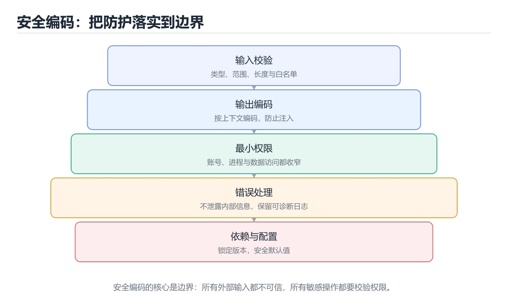
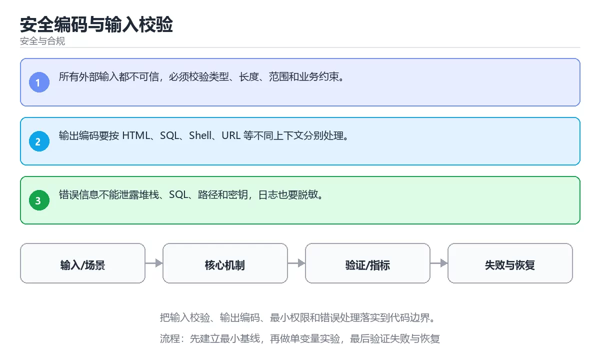

# 安全编码与输入校验





> 内容更新时间：2026-10-06 · 学习阶段：进阶 · 预计用时：40 分钟

## 本节知识框架

**课程定位**：所属分类 `security`（安全与合规），课程主题 `安全编码与输入校验`，学习阶段 进阶，建议用时 45 分钟。

本课主线：把输入校验、输出编码、最小权限和错误处理落实到代码边界。

**学完本课应当能够**
- 说清 `输入校验` 与 `输出编码` 的含义与区别，并各举一个正例和一个反例。
- 用本课示例验证 `最小权限` 的行为，记录输入、输出与失败条件。
- 遇到「信任客户端输入」这类问题时，能说出触发条件与修复顺序。

### 从概念到验证的学习链条

1. `输入校验`：先掌握 在信任边界检查类型、长度、格式和取值范围，拒绝非法数据，再用它解释 `输出编码` 为什么会出现。
2. `输出编码`：先掌握 在输出到 HTML、SQL 或命令前按目标语境转义，防止注入，再用它解释 `最小权限` 为什么会出现。
3. `最小权限`：先掌握 每个账号、进程或服务只获得完成当前任务所需的权限，把泄露影响面降到最低，再用它解释 `错误处理` 为什么会出现。
4. `错误处理`：先掌握 识别、传播并恢复异常或失败路径，避免错误被吞掉或扩大影响，再用它解释 本课示例的观察结果 为什么会出现。

**先修与衔接**：本课是「安全与合规」分类的第 5 课。先修内容：《OWASP Top 10 实战》。《OWASP Top 10 实战》里的 `OWASP`、`注入` 是本课的前提。相关或后续课程：《认证、会话与令牌安全》。

### 完成判据

- **定义关**：不看正文也能说明 `输入校验` 是 在信任边界检查类型、长度、格式和取值范围，拒绝非法数据，并指出一个反例。
- **机制关**：能按“输入 → 转换 → 输出 → 验证”复述 `安全编码与输入校验`，而不是只背结论。
- **示例关**：能运行或推演 `安全编码与输入校验` 的 `text` 示例，并说明一个真实出现的标识符或字面量。
- **证据关**：能指出 `安全编码与输入校验` 示例里的 调用了 `sha256()`，并说明它支持或反驳了本课的哪一条结论。
- **排错关**：能复现 信任客户端输入，记录现象并按 在服务端做校验、转义与参数化 修复。
- **迁移关**：能把 `输入校验`、`输出编码`、`最小权限`、`错误处理` 放进一个与 `安全编码与输入校验` 不同的项目场景，并保持输入与验证条件可追踪。
- **复盘关**：学完 `安全编码与输入校验` 后，用一句话写下仍然不确定的结论，并列出下一次验证需要的输入、环境和成功判据。

### 复习清单

- [ ] 能不看正文复述本课核心术语，并指出一个边界或反例。
- [ ] 能运行或推演本课示例，记录输入、输出与失败现象。
- [ ] 能完成一次自测，并把错题对照错误表定位原因。

## 核心概念定义

| 术语 | 操作性定义 | 常见边界与风险 |
| --- | --- | --- |
| 输入校验 | 在信任边界检查类型、长度、格式和取值范围，拒绝非法数据。 | 静态检查只在编译期成立，运行期输入仍需校验。 |
| 输出编码 | 在输出到 HTML、SQL 或命令前按目标语境转义，防止注入。 | 索引命中与数据分布决定实际开销，判断前先看执行计划而不是只看结果是否正确。 |
| 最小权限 | 每个账号、进程或服务只获得完成当前任务所需的权限，把泄露影响面降到最低。 | 共享状态与调度顺序会改变结论，单线程或串行测试通过不等于并发下成立。 |
| 错误处理 | 识别、传播并恢复异常或失败路径，避免错误被吞掉或扩大影响。 | 只在「识别、传播并恢复异常或失败路径，避免错误被吞掉或扩大影响」这一前提下成立，换输入或换环境要重新验证。 |

## 原理与运行机制

### 机制总览

**教材衔接：核心知识**

### 1. 所有外部输入都不可信，必须校验类型、长度、范围和业务约束。

- 关键做法：先让 输入校验 的最小示例可复现，再加入并发或规模条件。
- 验证标准：输入校验 的结果可复现、错误可解释、失败能恢复。

### 2. 输出编码要按 HTML、SQL、Shell、URL 等不同上下文分别处理。

把这条结论放回「安全编码与输入校验」的完整流程里展开：

- 正文依据：能用自己的话解释：输出编码要按 HTML、SQL、Shell、URL 等不同上下文分别处理。
- 落地检查：把「2. 输出编码要按 HTML、SQL、Shell、URL 等不同上下文分别处理。」改写成一条可执行的核对项，逐条验证输入、超时与失败路径。

### 3. 错误信息不能泄露堆栈、SQL、路径和密钥，日志也要脱敏。

把这条结论放回「安全编码与输入校验」的完整流程里展开：

- 正文依据：本课关键词：输入校验、输出编码、最小权限、错误处理。
- 落地检查：把「3. 错误信息不能泄露堆栈、SQL、路径和密钥，日志也要脱敏。」改写成一条可执行的核对项，逐条验证输入、超时与失败路径。

**教材衔接：关键流程**

**教材衔接：实践路径**

**教材衔接：安全落地补充：安全编码与输入校验**

### 一、资产、边界与信任

先回答：保护哪些数据、谁可以访问、哪些组件是信任边界、攻击者能从哪些入口进入。围绕「输入校验、输出编码、最小权限、错误处理」列出至少 3 个入口和对应的最小权限。


### 三、上线前安全清单

- [ ] 所有外部输入经过校验和输出编码。
- [ ] 认证、授权和会话失效逻辑有测试。
- [ ] 密钥不进入源码、镜像和日志。
- [ ] 依赖漏洞、许可证和来源已审查。
- [ ] 高风险操作有确认、审计和回滚。
- [ ] 安全事件有联系人和升级路径。

### 四、事件响应演练

围绕「安全编码与输入校验」构造一次 输入校验 相关的越权或泄露场景，按发现、隔离、轮换、取证、恢复、复盘六步执行，记录时间线与剩余风险。

**教材衔接：零基础精讲：把安全编码与输入校验真正讲透**

### 先建立一个直觉

把「安全编码与输入校验」看成一条防线：先识别资产与威胁，再围绕 输入校验 限制权限、验证输入、记录审计，并为失败准备隔离与恢复方案。

本课的摘要可以当作一张地图：把输入校验、输出编码、最小权限和错误处理落实到代码边界。

### 逐步拆解

1. 澄清输入与目标。先写清「安全编码与输入校验」要解决的问题、合法输入范围和成功标准，再进入后续步骤。
2. 描述处理过程。把「输入校验、输出编码、最小权限、错误处理」映射到具体步骤，每步都要求能单独验证。
3. 定义输出。把 e884898da28 的返回值、日志和失败信号都写清楚，缺一项都不算完整。
4. 让「安全编码与输入校验」的失败路径尽早暴露：把输入校验推到边界值，记录错误信息、重试或降级动作，以及人工兜底条件。
5. 用 e884898da28 贯穿一次小实验：先预测输出，再运行或逐步推演，最后解释差异来自哪一步。

### 把正文串成一条执行链

- 三、上线前安全清单：- [ ] 输出编码 的越权与注入路径已覆盖测试

### 从测验反推易错点

- 参考判断：所有外部输入都不可信，必须校验类型、长度、范围和业务约束。
- 自问：如果去掉题干里的一个限定词，结论还成立吗？

- 参考判断：输出编码要按 HTML、SQL、Shell、URL 等不同上下文分别处理。

- 参考判断：错误信息不能泄露堆栈、SQL、路径和密钥，日志也要脱敏。

**检查点 4：本课的核心学习目标是什么？**

- 参考判断：把输入校验、输出编码、最小权限和错误处理落实到代码边界。

**检查点 5：以下哪些术语与安全编码与输入校验直接相关？（多选）**

- 参考判断：输入校验、输出编码

### 工程排错顺序

| 先查什么 | 要得到的证据 | 判断标准 |
| --- | --- | --- |
| 资产、威胁和行为主体是否明确？ | 日志、输入样例、测试或指标 | 能复现并解释，才算定位 |
| 权限是否默认拒绝并最小化？ | 日志、输入样例、测试或指标 | 能复现并解释，才算定位 |
| 输入、输出与审计是否都有控制？ | 日志、输入样例、测试或指标 | 能复现并解释，才算定位 |
| 发现绕过时能否快速隔离和恢复？ | 日志、输入样例、测试或指标 | 能复现并解释，才算定位 |

### 变式训练

1. 把 输入校验 放进一个只有单机、没有额外依赖的小项目，先保证正确再扩展。
2. 把 输入校验 的输入规模扩大十倍，记录时间、内存和失败路径，找出第一个瓶颈。
3. 把 输出编码 换成失败输入，记录错误信息与恢复动作。
5. 减少一个输入字段后重跑 e884898da28，记录失败信息出现在哪一层，据此判断这个字段是必填还是可推导。
6. 限制 CPU 与内存上限后重跑 e884898da28，观察哪一项参数需要重新设定。


### 迁移案例库

下面用不同约束重复同一套方法，每轮只改变 输入校验 的一个取值并记录结论。

#### 迁移案例 1：围绕「输入校验」做一次小实验

**验收**：至少给出一个反例，说明输入校验在什么情况下会失效；只写成功案例不算通过。

#### 迁移案例 2：围绕「输出编码」做一次小实验

**步骤**：
1. 复述当前方案对「输出编码」的假设，写成一句可证伪的话。

#### 迁移案例 3：围绕「最小权限」做一次小实验

**步骤**：
1. 复述当前方案对「最小权限」的假设，写成一句可证伪的话。

#### 迁移案例 4：围绕「错误处理」做一次小实验

**步骤**：
1. 复述当前方案对「错误处理」的假设，写成一句可证伪的话。

#### 迁移案例 5：围绕「输入校验」做一次小实验

**步骤**：

#### 迁移案例 6：围绕「输出编码」做一次小实验

**步骤**：

#### 迁移案例 7：围绕「最小权限」做一次小实验

**步骤**：

#### 迁移案例 8：围绕「错误处理」做一次小实验

**步骤**：

#### 迁移案例 9：围绕「输入校验」做一次小实验

**步骤**：

#### 迁移案例 10：围绕「输出编码」做一次小实验

**步骤**：

#### 迁移案例 11：围绕「最小权限」做一次小实验

**步骤**：

#### 迁移案例 12：围绕「错误处理」做一次小实验

**步骤**：

#### 迁移案例 13：围绕「输入校验」做一次小实验

**步骤**：

#### 迁移案例 14：围绕「输出编码」做一次小实验

**步骤**：

#### 迁移案例 15：围绕「最小权限」做一次小实验

**步骤**：

#### 迁移案例 16：围绕「错误处理」做一次小实验

**步骤**：

<!-- p0-depth-v2:end -->

**教材衔接：验证步骤**

### 机制拆解：每一步的输入、动作与输出

#### 1. `输入校验`
- 输入：`输入校验`；本步把 在信任边界检查类型、长度、格式和取值范围，拒绝非法数据 当作判断规则。
- 动作：围绕 `输入校验` 保留中间状态，并记录它与 `输出编码` 的对应关系。
- 输出：`输出编码`，它可以被下一段代码、测试或记录继续使用。
- `输入校验` 的失败条件：静态检查只在编译期成立，运行期输入仍需校验。

#### 2. `输出编码`
- 输入：`输入校验`；本步把 在输出到 HTML、SQL 或命令前按目标语境转义，防止注入 当作判断规则。
- 动作：围绕 `输出编码` 保留中间状态，并记录它与 `最小权限` 的对应关系。
- 输出：`最小权限`，它可以被下一段代码、测试或记录继续使用。
- `输出编码` 的失败条件：索引命中与数据分布决定实际开销，判断前先看执行计划而不是只看结果是否正确。

#### 3. `最小权限`
- 输入：`输出编码`；本步把 每个账号、进程或服务只获得完成当前任务所需的权限，把泄露影响面降到最低 当作判断规则。
- 动作：围绕 `最小权限` 保留中间状态，并记录它与 `错误处理` 的对应关系。
- 输出：`错误处理`，它可以被下一段代码、测试或记录继续使用。
- `最小权限` 的失败条件：共享状态与调度顺序会改变结论，单线程或串行测试通过不等于并发下成立。

#### 4. `错误处理`
- 输入：`最小权限`；本步把 识别、传播并恢复异常或失败路径，避免错误被吞掉或扩大影响 当作判断规则。
- 动作：围绕 `错误处理` 保留中间状态，并记录它与 `sha256` 的对应关系。
- 输出：`sha256`，它可以被下一段代码、测试或记录继续使用。
- `错误处理` 的失败条件：只在「识别、传播并恢复异常或失败路径，避免错误被吞掉或扩大影响」这一前提下成立，换输入或换环境要重新验证。

### 示例中的可观察事实

1. 调用了 `sha256()`；它对应的课程主题是 `安全编码与输入校验`。
2. 调用了 `hexdigest()`；它对应的课程主题是 `安全编码与输入校验`。
3. 调用了 `print()`；它对应的课程主题是 `安全编码与输入校验`。
4. 出现字面量 `password`；它对应的课程主题是 `安全编码与输入校验`。

### 复现实验记录

- 环境：`安全编码与输入校验` 使用 `text` 示例，固定 `输入校验`、`输出编码`、`最小权限`、`错误处理` 作为第一组条件。
- 首轮输入：先确认 调用了 `sha256()`，预测 `输入校验` 会怎样变化。
- 基线观察：记录命令、输入、输出和错误原文，不用截图代替可复制的文本。
- 单变量修改：只改变 `输入校验`，观察 `错误处理` 是否仍满足定义。
- 失败注入：复现 信任客户端输入，确认现象是 注入与越权风险。
- 记录结论：把“修改前、修改后、预期变化、实际变化”写成四列表，这样复盘 `安全编码与输入校验` 时才能区分概念错误与实现错误。

## 典型应用场景

**教材衔接：深度拓展与实战**

这一节把「安全编码与输入校验」的判断依据、示例和反例整理成复习步骤。

### 机制拆解

- **1. 所有外部输入都不可信，必须校验类型、长度、范围和业务约束。**：在「安全编码与输入校验」里，「1. 所有外部输入都不可信，必须校验类型、长度、范围和业务约束。」这一步要先写清输入与预期，再记录实际结果和差异；结果不符时回到对应小节核对前提。
- **2. 输出编码要按 HTML、SQL、Shell、URL 等不同上下文分别处理。**：在「安全编码与输入校验」里，「2. 输出编码要按 HTML、SQL、Shell、URL 等不同上下文分别处理。」这一步要先写清输入与预期，再记录实际结果和差异；结果不符时回到对应小节核对前提。
- **3. 错误信息不能泄露堆栈、SQL、路径和密钥，日志也要脱敏。**：在「安全编码与输入校验」里，「3. 错误信息不能泄露堆栈、SQL、路径和密钥，日志也要脱敏。」这一步要先写清输入与预期，再记录实际结果和差异；结果不符时回到对应小节核对前提。
- 一、资产、边界与信任：明确 输出编码 的权限范围与越权后果。
- **二、威胁 → 控制 → 验证**：在「安全编码与输入校验」里，「二、威胁 → 控制 → 验证」这一步要先写清输入与预期，再记录实际结果和差异；结果不符时回到对应小节核对前提。

### 边界条件与常见反例

「安全编码与输入校验」的边界不只包括最大最小值，还要覆盖空、重复和失败：

### 工程检查表

- [ ] 能否用自己的话说明安全编码与输入校验解决什么问题，以及它不负责什么？
- [ ] 能否说明 输入校验 的正常输出，以及失败时留下的错误信息？
- [ ] 能否解释本课关键词在真实项目中的边界与取舍？
- [ ] 能否把 输入校验 的方法迁移到相近问题，并说明需要改哪一步？

### 迁移练习

1. 保持正文示例不变，写出它的输入、处理步骤和预期输出。
2. 固定其他输入，只调整 e884898da28 的一个参数，先写预测再验证。
3. 结合输入校验、输出编码、最小权限、错误处理，写出一个真实项目中的使用场景。
4. 写下一个反例，说明它在什么条件下会使朴素做法失效。

<!-- p0-depth-v2:start -->

- **信任客户端输入**：典型现象是注入与越权风险；正确做法是在服务端做校验、转义与参数化。
- **拼接命令与查询语句**：典型现象是命令注入与注入风险；正确做法是使用参数化查询，避免拼接外部输入。
- **错误信息暴露内部结构**：典型现象是为攻击者提供线索；正确做法是对外返回统一错误，内部记录细节。

### 最小验证场景

- 准备：保留 `text` 示例的原始输入，先记录 `安全编码与输入校验` 的基线输出和完整运行命令。
- 观察：先核对 调用了 `sha256()`，再改变一个与 `输入校验` 相关的条件。
- 判定：新结果与 `安全编码与输入校验` 的基线不同不等于错误；只有当差异破坏了 `输入校验` 的定义或错误表中的约束，才判定为失败。

### 选择与边界

- 使用 `输入校验` 时，先满足它的定义：在信任边界检查类型、长度、格式和取值范围，拒绝非法数据；静态检查只在编译期成立，运行期输入仍需校验。
- 使用 `输出编码` 时，先满足它的定义：在输出到 HTML、SQL 或命令前按目标语境转义，防止注入；索引命中与数据分布决定实际开销，判断前先看执行计划而不是只看结果是否正确。
- 使用 `最小权限` 时，先满足它的定义：每个账号、进程或服务只获得完成当前任务所需的权限，把泄露影响面降到最低；共享状态与调度顺序会改变结论，单线程或串行测试通过不等于并发下成立。
- 使用 `错误处理` 时，先满足它的定义：识别、传播并恢复异常或失败路径，避免错误被吞掉或扩大影响；只在「识别、传播并恢复异常或失败路径，避免错误被吞掉或扩大影响」这一前提下成立，换输入或换环境要重新验证。

## 代码/协议/SQL 示例

### 最小可验证示例

**教材衔接：最小可运行示例**

下面的示例覆盖「安全编码与输入校验」中 输入校验 的核心路径。先原样运行，再按注释改一处：

```python
import hashlib

digest = hashlib.sha256(b"password").hexdigest()
print(digest[:12])
```

**教材衔接：预期输出**

```text
5e884898da28
```

### 示例精读：先找证据，再改一个条件

1. 调用了 `sha256()`；它出现在 `安全编码与输入校验` 的示例中，阅读时先确认它前后各发生了什么。
2. 调用了 `hexdigest()`；它出现在 `安全编码与输入校验` 的示例中，阅读时先确认它前后各发生了什么。
3. 调用了 `print()`；它出现在 `安全编码与输入校验` 的示例中，阅读时先确认它前后各发生了什么。
4. 出现字面量 `password`；它出现在 `安全编码与输入校验` 的示例中，阅读时先确认它前后各发生了什么。
- 在 `安全编码与输入校验` 中与 `输入校验` 对照：示例必须能支持 在信任边界检查类型、长度、格式和取值范围，拒绝非法数据，否则说明这一段还缺少实现或验证步骤。
- 在 `安全编码与输入校验` 中与 `输出编码` 对照：示例必须能支持 在输出到 HTML、SQL 或命令前按目标语境转义，防止注入，否则说明这一段还缺少实现或验证步骤。
- 在 `安全编码与输入校验` 中与 `最小权限` 对照：示例必须能支持 每个账号、进程或服务只获得完成当前任务所需的权限，把泄露影响面降到最低，否则说明这一段还缺少实现或验证步骤。
- 在 `安全编码与输入校验` 中与 `错误处理` 对照：示例必须能支持 识别、传播并恢复异常或失败路径，避免错误被吞掉或扩大影响，否则说明这一段还缺少实现或验证步骤。

## 时间/空间复杂度或性能分析

**性能关注点（安全编码与输入校验）**：加解密与校验开销随数据量增长：记录处理耗时、密钥长度与内存占用。

**测量方法**：以 `安全编码与输入校验` 的 `输入校验` 场景为对象，固定输入跑一遍记录基线，再把规模或并发度提高一个数量级复测；两次结果的差值与波动范围才是结论依据。

### 需要控制的变量与记录项

- `安全编码与输入校验` 的 `输入校验`：固定它的版本、输入范围和资源上限，分别记录速度、内存与失败率的变化。
- `安全编码与输入校验` 的 `输出编码`：固定它的版本、输入范围和资源上限，分别记录速度、内存与失败率的变化。
- `安全编码与输入校验` 的 `最小权限`：固定它的版本、输入范围和资源上限，分别记录速度、内存与失败率的变化。
- `安全编码与输入校验` 的 `错误处理`：固定它的版本、输入范围和资源上限，分别记录速度、内存与失败率的变化。
- `安全编码与输入校验` 中 `输入校验` 的边界：静态检查只在编译期成立，运行期输入仍需校验。达到边界时不要外推，必须重新测量。
- `安全编码与输入校验` 中 `输出编码` 的边界：索引命中与数据分布决定实际开销，判断前先看执行计划而不是只看结果是否正确。达到边界时不要外推，必须重新测量。
- `安全编码与输入校验` 中 `最小权限` 的边界：共享状态与调度顺序会改变结论，单线程或串行测试通过不等于并发下成立。达到边界时不要外推，必须重新测量。
- `安全编码与输入校验` 中 `错误处理` 的边界：只在「识别、传播并恢复异常或失败路径，避免错误被吞掉或扩大影响」这一前提下成立，换输入或换环境要重新验证。达到边界时不要外推，必须重新测量。
- `安全编码与输入校验` 的代码证据：先验证 调用了 `sha256()`，再记录该路径的输入规模与耗时；只看代码行数不能推出复杂度。

## 常见误区与易错点

| 容易写错的做法 | 实际现象 | 原因与正确做法 |
| --- | --- | --- |
| 信任客户端输入 | 注入与越权风险。 | 在服务端做校验、转义与参数化。 |
| 拼接命令与查询语句 | 命令注入与注入风险。 | 使用参数化查询，避免拼接外部输入。 |
| 错误信息暴露内部结构 | 为攻击者提供线索。 | 对外返回统一错误，内部记录细节。 |

### 现场 1：信任客户端输入

**症状**：注入与越权风险。

**根因与修复**：在服务端做校验、转义与参数化。

**自检**：在本课示例里复现「信任客户端输入」，改成在服务端做校验、转义与参数化后重跑；如果症状消失且失败路径按预期变化，说明定位正确。

### 现场 2：拼接命令与查询语句

**症状**：命令注入与注入风险。

**根因与修复**：使用参数化查询，避免拼接外部输入。

**自检**：在本课示例里复现「拼接命令与查询语句」，改成使用参数化查询，避免拼接外部输入后重跑；如果症状消失且失败路径按预期变化，说明定位正确。

### 现场 3：错误信息暴露内部结构

**症状**：为攻击者提供线索。

**根因与修复**：对外返回统一错误，内部记录细节。

**自检**：在本课示例里复现「错误信息暴露内部结构」，改成对外返回统一错误，内部记录细节后重跑；如果症状消失且失败路径按预期变化，说明定位正确。

## 与其他知识点的关系

**教材衔接：复习与迁移**

### 概念复述

- 用一句话说明「安全编码与输入校验」解决什么问题：把输入校验、输出编码、最小权限和错误处理落实到代码边界。
- 写出输入校验、输出编码、最小权限之间的关系，并各举一个例子。
- 说出本课最容易混淆的两个概念，以及区分它们的判据。

### 正文逐节复核

- **零基础精讲：把安全编码与输入校验真正讲透**：本课的摘要可以当作一张地图：把输入校验、输出编码、最小权限和错误处理落实到代码边界。


### 迁移练习

把「安全编码与输入校验」的结论迁移到相邻主题，每次迁移都写清预测与证据：

- **先修**：`OWASP Top 10 实战`。本课默认这些内容已经掌握。
- **相关或后续**：`认证、会话与令牌安全`。本课术语会在这些课程里继续使用。
- **术语归属**：`输入校验`、`输出编码`、`最小权限` 的定义以本课「核心概念定义」为准，换到其他课程时先确认定义是否被改写。

### 先修与后续术语接口

- `OWASP Top 10 实战`：两者通过本分类的学习顺序衔接，阅读时重点比较各自的输入与失败条件。
- `认证、会话与令牌安全`：两者通过本分类的学习顺序衔接，阅读时重点比较各自的输入与失败条件。

### 容易混淆的相邻概念

- `输入校验` 与 `输出编码`：前者强调 在信任边界检查类型、长度、格式和取值范围，拒绝非法数据；后者强调 在输出到 HTML、SQL 或命令前按目标语境转义，防止注入。判断时分别检查两条定义的适用范围，不要只看名称相似就互换。
- `输出编码` 与 `最小权限`：前者强调 在输出到 HTML、SQL 或命令前按目标语境转义，防止注入；后者强调 每个账号、进程或服务只获得完成当前任务所需的权限，把泄露影响面降到最低。判断时分别检查两条定义的适用范围，不要只看名称相似就互换。
- `最小权限` 与 `错误处理`：前者强调 每个账号、进程或服务只获得完成当前任务所需的权限，把泄露影响面降到最低；后者强调 识别、传播并恢复异常或失败路径，避免错误被吞掉或扩大影响。判断时分别检查两条定义的适用范围，不要只看名称相似就互换。

## 自测题与参考答案

> 先独立作答，再对照参考答案；答案都能在本课正文、术语表或错误表里找到依据。

### 自测 1（概念复述）

不看正文，写出 `输入校验` 的操作性定义，并说明它与 `输出编码` 的区别。

**参考答案**：在信任边界检查类型、长度、格式和取值范围，拒绝非法数据。

`输出编码` 的定位是：在输出到 HTML、SQL 或命令前按目标语境转义，防止注入；两者的差别要从适用对象与失败模式上说明。

### 自测 2（排错）

本课错误表记录了「信任客户端输入」这类做法。请写出它会出现的现象、根因，以及修复顺序。

**参考答案**：现象是注入与越权风险；正确做法是在服务端做校验、转义与参数化。修复时先复现现象并保留证据，再改动一处假设重跑，确认现象消失。

### 自测 3（动手验证）

运行本课的 `text` 示例，改动其中一个输入后重新运行，记录输出与错误信息。

**参考答案**：正常输入下 `text` 示例应当复现正文给出的结果；改动输入后，如果结果改变或报错，先核对它是否满足 `安全编码与输入校验` 中`输入校验` 的适用范围，再检查错误表里是否有同类现象。

### 自测 4（代码阅读）

阅读本课开头的 `text` 示例，说明它体现了`输入校验` 的哪一条性质，并指出改动哪个输入会让这条性质不再成立。

**参考答案**：`输入校验` 的定义是 在信任边界检查类型、长度、格式和取值范围，拒绝非法数据，示例正是在实现这条定义。改动与 `输入校验` 有关的一个输入后，如果结果不再符合 `安全编码与输入校验` 的正文描述，就说明该性质只在当前前提成立。

### 自测 5（迁移）

把 `安全编码与输入校验` 的方法迁移到自己的项目：围绕 `输入校验` 写出一个与错误表同类的风险点，并说明触发条件和检验方式。

**参考答案**：例如「错误信息暴露内部结构」，它会导致为攻击者提供线索；检验方式是按对外返回统一错误，内部记录细节改一处再复现，确认现象消失且没有引入新的失败分支。

### 自测 6（对比）

用一个表格对比 `输入校验` 与 `输出编码`：各写一行适用场景、一行失败表现。

**参考答案**：`输入校验` 的定义是在信任边界检查类型、长度、格式和取值范围，拒绝非法数据；`输出编码` 的定义是在输出到 HTML、SQL 或命令前按目标语境转义，防止注入。两者的失败表现分别对应本课错误表里与本术语相关的行。

### 自测 7（排错顺序）

面对「信任客户端输入」引发的问题，请把“复现 注入与越权风险 → 保留证据 → 在服务端做校验、转义与参数化 → 回归验证”四步写成可执行的检查清单。

**参考答案**：第一步按注入与越权风险复现；第二步记录输入、版本与完整报错；第三步按在服务端做校验、转义与参数化只改一处；第四步重跑并确认失败路径也按预期变化。

### 自测 8（边界判断）

针对 `错误处理`，分别写出“可以使用”的条件和“结论不再成立”的条件。

**参考答案**：只在「识别、传播并恢复异常或失败路径，避免错误被吞掉或扩大影响」这一前提下成立，换输入或换环境要重新验证。 同时要把 `错误处理` 的定义 识别、传播并恢复异常或失败路径，避免错误被吞掉或扩大影响 与实际输入逐项对照。

### 自测 9（机制重建）

不看正文，按输入、转换、输出、验证四段重建 `输入校验` → `输出编码` → `最小权限` → `错误处理` 的作用链。

**参考答案**：起点是 `输入校验` 的定义 在信任边界检查类型、长度、格式和取值范围，拒绝非法数据；中间每一步都保留可观察状态；终点由 `错误处理` 检查，失败时回到错误表定位第一个偏离定义的步骤。

### 自测 10（综合排错）

在 `安全编码与输入校验` 中，现象是 为攻击者提供线索。请围绕 错误信息暴露内部结构 写出最小复现、关键证据、修复动作和回归验证，并说明为什么不能只凭一次运行下结论。

**参考答案**：先复现 错误信息暴露内部结构，记录输入与完整错误；再按 对外返回统一错误，内部记录细节 只改一处。回归时同时跑正常路径和边界路径，只有两次结果都可解释，才把修复视为完成。

### 自测 11（一分钟复述）

用每分钟约 200 字的速度复述 `安全编码与输入校验`：先给主问题，再按顺序说出 `输入校验`、`输出编码`、`最小权限`、`错误处理`，最后给一个失败案例。

**自评标准**：主问题必须对应 把输入校验、输出编码、最小权限和错误处理落实到代码边界；每个术语都要能接上一句定义或边界；失败案例必须写成可观察现象，不能用“可能有风险”代替证据。

## 术语速查

| 术语 | 一句话说明 |
| --- | --- |
| `输入校验` | 在信任边界检查类型、长度、格式和取值范围，拒绝非法数据。 |
| `输出编码` | 在输出到 HTML、SQL 或命令前按目标语境转义，防止注入。 |
| `最小权限` | 每个账号、进程或服务只获得完成当前任务所需的权限，把泄露影响面降到最低。 |
| `错误处理` | 识别、传播并恢复异常或失败路径，避免错误被吞掉或扩大影响。 |

**术语关系**：`输入校验`（在信任边界检查类型、长度、格式和取值范围） → `输出编码`（在输出到 HTML、SQL 或命令前按目标语境转义） → `最小权限`（每个账号、进程或服务只获得完成当前任务所需的权限） → `错误处理`（识别、传播并恢复异常或失败路径）。

## 考点精讲

`安全编码与输入校验` 的题库有 6 道题，下面逐题给出题干、正确项与判断依据：先自己作答，再核对正确项，最后回到正文对应小节复核。

### 考点 1：第 1 题

- **题目**：下面这段 `python` 代码来自 `安全编码与输入校验`。课程主线是把输入校验、输出编码、最小权限和错误处理落实到代码边界。代码与 `输入校验` 有关。哪一项是代码里真实出现的内容？
- **正确项**：调用了 `hexdigest()`
- **判断依据**：这道题落在术语 `输入校验` 上：在信任边界检查类型、长度、格式和取值范围，拒绝非法数据。复习时把 `输入校验` 的定义、适用边界和一个反例一起说清楚，再回到「核心概念定义」核对原文。

### 考点 2：第 2 题

- **题目**：在 `安全编码与输入校验` 里，与 `输入校验` 有关的说法中，哪一项最符合把输入校验、输出编码、最小权限和错误处理落实到代码边界。？
- **正确项**：输出编码要按 HTML、SQL、Shell、URL 等不同上下文分别处理。
- **判断依据**：这道题落在术语 `输入校验` 上：在信任边界检查类型、长度、格式和取值范围，拒绝非法数据。复习时把 `输入校验` 的定义、适用边界和一个反例一起说清楚，再回到「核心概念定义」核对原文。

### 考点 3：第 3 题

- **题目**：在 `安全编码与输入校验` 里，与 `输入校验` 有关的说法中，哪一项最符合把输入校验、输出编码、最小权限和错误处理落实到代码边界。？（安全编码与输入校验·安全与合规 第 3 题）
- **正确项**：错误信息不能泄露堆栈、SQL、路径和密钥，日志也要脱敏。
- **判断依据**：这道题落在术语 `输入校验` 上：在信任边界检查类型、长度、格式和取值范围，拒绝非法数据。复习时把 `输入校验` 的定义、适用边界和一个反例一起说清楚，再回到「核心概念定义」核对原文。

### 考点 4：第 4 题

- **题目**：`安全编码与输入校验` 的主线是：把输入校验、输出编码、最小权限和错误处理落实到代码边界。下面哪一项与这条主线一致？
- **正确项**：把输入校验、输出编码、最小权限和错误处理落实到代码边界。
- **判断依据**：这道题落在术语 `输入校验` 上：在信任边界检查类型、长度、格式和取值范围，拒绝非法数据。复习时把 `输入校验` 的定义、适用边界和一个反例一起说清楚，再回到「核心概念定义」核对原文。

### 考点 5：第 5 题

- **题目**：课程 `把输入校验、输出编码、最小权限和错误处理落实到代码边界。`。在 `安全编码与输入校验` 里，`输入校验`、`输出编码` 与下面哪些选项属于同一层概念？（多选）
- **正确项**：输入校验；输出编码
- **判断依据**：这道题落在术语 `输入校验` 上：在信任边界检查类型、长度、格式和取值范围，拒绝非法数据。复习时把 `输入校验` 的定义、适用边界和一个反例一起说清楚，再回到「核心概念定义」核对原文。

### 考点 6：第 6 题

- **题目**：下面几项都与 `输入校验` 有关，请按 `安全编码与输入校验` 的正文顺序排列；该课主线是把输入校验、输出编码、最小权限和错误处理落实到代码边界。
- **正确项**：核心知识 → 关键流程 → 实践路径 → 常见误区
- **判断依据**：这道题落在术语 `输入校验` 上：在信任边界检查类型、长度、格式和取值范围，拒绝非法数据。复习时把 `输入校验` 的定义、适用边界和一个反例一起说清楚，再回到「核心概念定义」核对原文。

### 考点 7：`输入校验`

- **要点**：在信任边界检查类型、长度、格式和取值范围，拒绝非法数据。
- **输入校验 的边界**：静态检查只在编译期成立，运行期输入仍需校验。

### 考点 8：`输出编码`

- **要点**：在输出到 HTML、SQL 或命令前按目标语境转义，防止注入。
- **输出编码 的边界**：索引命中与数据分布决定实际开销，判断前先看执行计划而不是只看结果是否正确。

### 考点 9：`最小权限`

- **要点**：每个账号、进程或服务只获得完成当前任务所需的权限，把泄露影响面降到最低。
- **最小权限 的边界**：共享状态与调度顺序会改变结论，单线程或串行测试通过不等于并发下成立。

### 考点 10：`错误处理`

- **要点**：识别、传播并恢复异常或失败路径，避免错误被吞掉或扩大影响。
- **错误处理 的边界**：只在「识别、传播并恢复异常或失败路径，避免错误被吞掉或扩大影响」这一前提下成立，换输入或换环境要重新验证。

### 考点 11：排错——信任客户端输入

- **现象**：注入与越权风险。
- **处理**：在服务端做校验、转义与参数化。

### 考点 12：排错——拼接命令与查询语句

- **现象**：命令注入与注入风险。
- **处理**：使用参数化查询，避免拼接外部输入。

### 考点 13：综合辨析——`输入校验` 与 `错误处理`

- **辨析点**：`输入校验` 的定义是 在信任边界检查类型、长度、格式和取值范围，拒绝非法数据；`错误处理` 的定义是 识别、传播并恢复异常或失败路径，避免错误被吞掉或扩大影响。
- **答题要求**：面对 `安全编码与输入校验` 的题目，先判断描述的是 `输入校验` 还是 `错误处理`，再归到对应定义，最后写出一个会让该定义失效的边界输入。

### 考点 14：排错评分点

- **现象分**：能写出 注入与越权风险，而不是只写“程序有错”。
- **证据分**：保留触发 信任客户端输入 的输入、版本和错误原文。
- **修复分**：按 在服务端做校验、转义与参数化 只改一处，并同时回归正常路径与边界路径。

## 内容元数据

- 内容版本：v2.0
- 最后更新：2026-10-06
- 学习阶段：进阶
- 适用环境：OWASP、云原生与合规安全实践；本课聚焦 输入校验。
- 内容来源：内置结构化课程与工程实践整理
- 相关主题：输入校验、输出编码、最小权限、错误处理
- 质量版本：P0 测验标准 + P1 覆盖扩展 + P2 体验补全

## 参考资料与复核

- 最后复核：2026-10-04
- 下次复核：2026-11-24
- 复核范围：版本兼容、API 行为、安全建议与工程实践
- 来源性质：官方文档、标准或权威教材；本课核对关键词：输入校验、输出编码、最小权限、错误处理。

| 参考资料 | 本课用途 |
| --- | --- |
| [MITRE ATT&CK](https://attack.mitre.org/) | 攻击技术与防御映射 |
| [NIST 密码标准](https://csrc.nist.gov/projects/cryptographic-standards-and-guidelines) | 密码算法与协议 |
| [OWASP Cheat Sheets](https://cheatsheetseries.owasp.org/) | 认证、授权与安全编码 |

| [本课术语索引：安全编码与输入校验](#核心概念定义) | 按本课输入、术语边界和错误表现逐项核对 |
> 「安全编码与输入校验」的链接用于离线阅读后的延伸核对；App 不会自动联网。