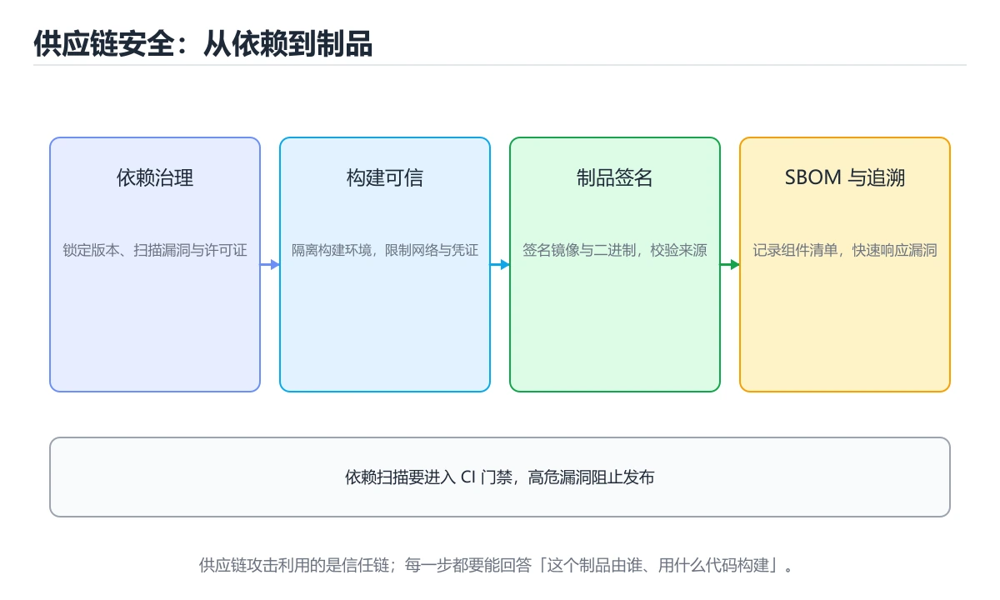
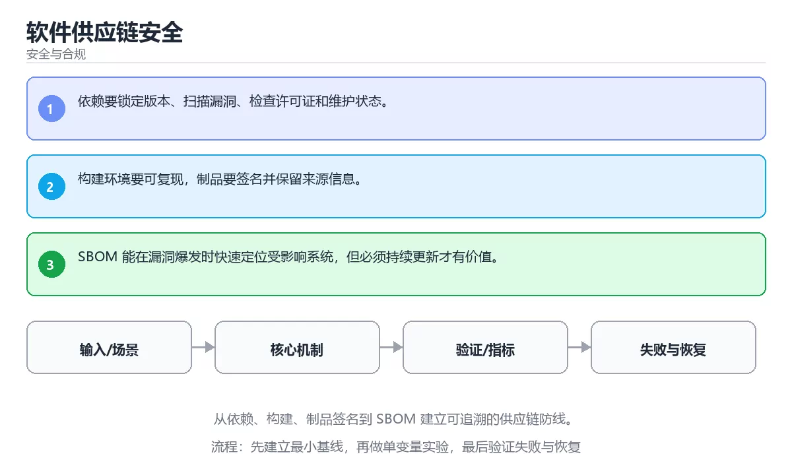

# 软件供应链安全

> 内容更新时间：2026-10-06 · 学习阶段：高级 · 预计用时：35 分钟





## 学习目标

- 能用自己的话解释：依赖要锁定版本、扫描漏洞、检查许可证和维护状态。
- 能用自己的话解释：构建环境要可复现，制品要签名并保留来源信息。
- 能用自己的话解释：SBOM 能在漏洞爆发时快速定位受影响系统，但必须持续更新才有价值。
- 能把本课知识放回「安全与合规」，并完成练习与测验。

## 前置知识

- 已完成「安全与合规」的基础课程，能运行正文中的最小示例。
- 本课关键词：供应链、SBOM、依赖漏洞、制品签名。
- 遇到不熟悉的术语先记录问题，完成练习后再回读。

## 核心知识

### 1. 依赖要锁定版本、扫描漏洞、检查许可证和维护状态。

- 关键做法：先用最小示例建立基线，再逐步加入边界、失败和性能条件。
- 验证标准：结果可复现、错误可解释、边界有测试、失败能恢复。

### 2. 构建环境要可复现，制品要签名并保留来源信息。

把这条结论放回「软件供应链安全」的完整流程里展开：

- 正文依据：能用自己的话解释：SBOM 能在漏洞爆发时快速定位受影响系统，但必须持续更新才有价值。
- 落地检查：把「2. 构建环境要可复现，制品要签名并保留来源信息。」改写成一条可执行的核对项，逐条验证输入、超时与失败路径。

### 3. SBOM 能在漏洞爆发时快速定位受影响系统，但必须持续更新才有价值。

把这条结论放回「软件供应链安全」的完整流程里展开：

- 正文依据：本课关键词：供应链、SBOM、依赖漏洞、制品签名。
- 落地检查：把「3. SBOM 能在漏洞爆发时快速定位受影响系统，但必须持续更新才有价值。」改写成一条可执行的核对项，逐条验证输入、超时与失败路径。

## 关键流程

```text
输入 → 校验 → 核心处理 → 验证 → 记录指标 → 失败恢复
```

## 实践路径

1. 用一句话复述本课要解决的问题。
2. 跑通正文中的最小示例并记录基线。
3. 只改变一个输入或参数，预测并验证结果。
4. 补一个失败路径，记录错误、恢复和指标。
5. 把结论写成可复现的笔记或测试。

## 常见误区

| 误区 | 后果 | 修正 |
| --- | --- | --- |
| 只记术语不做实验 | 遇到真实问题无法判断 | 用最小输入跑通并记录结果 |
| 只测正常路径 | 边界和故障上线才暴露 | 补空值、极值和依赖失败 |
| 没有基线就优化 | 无法证明改进有效 | 先测量再修改 |
| 忽略成本与安全 | 性能和风险失控 | 同时记录资源、权限与失败代价 |

## 动手练习

1. 合上教程，用 3～5 句话解释软件供应链安全。
2. 从正文选一个例子，改变一个条件并预测结果。
3. 设计一个失败场景，写出止损与恢复步骤。

**验收标准**：留下输入、命令、输出、差异和下一步问题。

## 本课小结

- 本课属于「安全与合规」，核心关键词是 供应链、SBOM、依赖漏洞、制品签名。
- 先保证正确与可复现，再讨论性能和扩展。
- 完成练习和测验后，把仍然不确定的问题写成下一轮验证清单。

> 本课由 P1 内容扩展生成，重点补充原有课程缺失的主题与工程边界。

## 安全落地补充：软件供应链安全

### 一、资产、边界与信任

先回答：保护哪些数据、谁可以访问、哪些组件是信任边界、攻击者能从哪些入口进入。围绕「供应链、SBOM、依赖漏洞、制品签名」列出至少 3 个入口和对应的最小权限。

### 二、威胁 → 控制 → 验证

| 威胁 | 预防控制 | 检测方式 | 验证证据 |
| --- | --- | --- | --- |
| 输入被污染 | schema、白名单、编码 | 异常输入日志和告警 | 越权与注入测试 |
| 权限过大 | 最小权限、临时凭证 | 权限审计和异常调用 | 权限边界测试 |
| 密钥泄露 | 密钥管理、轮换 | 仓库和日志扫描 | 轮换与影响范围记录 |
| 操作不可追溯 | 结构化审计日志 | 关键动作告警 | 审计查询和复盘 |
| 恢复失败 | 备份、回滚、演练 | 恢复指标监控 | 演练时间与数据校验 |

### 三、上线前安全清单

- [ ] 所有外部输入经过校验和输出编码。
- [ ] 认证、授权和会话失效逻辑有测试。
- [ ] 密钥不进入源码、镜像和日志。
- [ ] 依赖漏洞、许可证和来源已审查。
- [ ] 高风险操作有确认、审计和回滚。
- [ ] 安全事件有联系人和升级路径。

### 四、事件响应演练

构造一次凭证泄露或越权访问，按发现、隔离、轮换、取证、恢复、复盘六步执行，记录时间线和剩余风险。

## 可运行练习

### 任务 1：先跑通，再解释

```python
import hashlib

digest = hashlib.sha256(b"password").hexdigest()
print(digest[:12])
```

### 任务 2：只改一个条件

把「软件供应链安全」的最小示例复制一份，只改一个条件再跑一次：

- 改动点：只把供应链的输入换成空值、极值或错误输入，其余保持不变。
- 预测：先写下「软件供应链安全」在改动后的输出或错误信息，再运行。
- 记录：对照改动前后的结果，指出差异出在哪一步。
- 验收：换回原条件能复现原结果，改动只影响供应链。

### 任务 3：迁移到自己的数据

用同一套思路处理一组你自己的数据或场景，保持输出格式与任务 1 一致。

## 故障现场

### 现场 1：本课的 供应链 常规用例通过，但边界用例失败

**症状**：在本课的练习或生产场景里出现“本课的 供应链 常规用例通过，但边界用例失败”。

**复现**：准备一组最小输入，只保留触发“本课的 供应链 常规用例通过，但边界用例失败”的必要条件，连续运行两次确认结果稳定。

**定位**：围绕“供应链 的前置条件与取值边界没有写进代码，默认值掩盖了空值和极值”检查调用链、输入数据和环境配置，先验证假设再改代码。

**预防**：把“本课的 供应链 常规用例通过，但边界用例失败”写成一条自动化用例，并在本课的验收清单里保留对应检查项。

### 现场 2：本课的 SBOM 结果在两次运行之间不一致

**症状**：在本课的练习或生产场景里出现“本课的 SBOM 结果在两次运行之间不一致”。

**复现**：准备一组最小输入，只保留触发“本课的 SBOM 结果在两次运行之间不一致”的必要条件，连续运行两次确认结果稳定。

**定位**：围绕“SBOM 依赖了当前版本、执行顺序或共享状态，单次运行无法暴露差异”检查调用链、输入数据和环境配置，先验证假设再改代码。

**预防**：把“本课的 SBOM 结果在两次运行之间不一致”写成一条自动化用例，并在本课的验收清单里保留对应检查项。

### 现场 3：功能测试全部通过，但越权请求仍然拿到了数据

**症状**：在本课的练习或生产场景里出现“功能测试全部通过，但越权请求仍然拿到了数据”。

**复现**：准备一组最小输入，只保留触发“功能测试全部通过，但越权请求仍然拿到了数据”的必要条件，连续运行两次确认结果稳定。

**定位**：围绕“权限校验只做在界面层，供应链 对应的接口缺少服务端鉴权与输入约束”检查调用链、输入数据和环境配置，先验证假设再改代码。

**修复**：为软件供应链安全补一组越权、重放和畸形输入用例，把校验放在服务端入口并记录审计日志

**预防**：把“功能测试全部通过，但越权请求仍然拿到了数据”写成一条自动化用例，并在本课的验收清单里保留对应检查项。

## 本课复习清单

离开本课前，逐项确认：

- [ ] 不看解析，能说出「关于，下列说法正确的是？」的判断依据。
- [ ] 不看解析，能说出「本课的核心学习目标是什么？」的判断依据。
- [ ] 至少运行一次本课示例，记录输入、输出和一个边界情况。
- [ ] 把本课最容易混淆的两个概念写成一句话对照。

| 复盘项 | 记录 |
| --- | --- |
| 已经能独立解释的考点 |  |
| 仍然说不清的概念 |  |
| 下一步验证动作 |  |

## 术语速查

| 术语 | 本课语境 |
| --- | --- |
| `供应链` | 围绕“供应链 的前置条件与取值边界没有写进代码，默认值掩盖了空值和极值”检查调用链、输入数据和环境配置，先验证假设再改代码。 |
| `SBOM` | 围绕“SBOM 依赖了当前版本、执行顺序或共享状态，单次运行无法暴露差异”检查调用链、输入数据和环境配置，先验证假设再改代码。 |
| `依赖漏洞` | 按“软件供应链安全”中 供应链、SBOM、依赖漏洞 的实践顺序，把四个步骤排成从准备到复盘的合理顺序。 |
| `制品签名` | 本课属于「安全与合规」，核心关键词是 供应链、SBOM、依赖漏洞、制品签名。 |

## 考点精讲

### 考点 1：代码补全·供应链

- **题目**：下面这段 Python 代码摘自「软件供应链安全」的正文示例。关于这段代码，下面哪一项说法与实际内容相符？
- **判断依据**：在「软件供应链安全」里，题干的正确项是这段代码会产生可观察的输出，运行后能看到结果，在「软件供应链安全」里要结合供应链核对输出是否符合预期。把输入或边界换成空值、极值或失败情况后，结论要以「软件供应链安全」的实际运行结果为准。把“这段代码会产生可观察的输出”代回「软件供应链安全」里“下面这段 Python 代码摘自软件供应链安全的正文示例关于”的例子核对，条件一旦改变，结论就要用供应链、SBOM、依赖漏洞重新推导。

### 考点 2：概念判断·供应链

- **题目**：关于「构建环境要可复现，制品要签名并保留来源信息。」，下列说法正确的是？
- **判断依据**：在「软件供应链安全」里，构建环境要可复现，制品要签名并保留来源信息。「软件供应链安全」要求先交代供应链、SBOM、依赖漏洞的前提再下结论，所以“构建环境要可复现”只在题干“构建环境要可复现”给定的条件下成立。把“构建环境要可复现”代回「软件供应链安全」里“构建环境要可复现”的例子核对，条件一旦改变，结论就要用供应链、SBOM、依赖漏洞重新推导。

### 考点 3：概念判断·供应链

- **题目**：关于「SBOM 能在漏洞爆发时快速定位受影响系统，但必须持续更新才有价值。」，下列说法正确的是？
- **判断依据**：在「软件供应链安全」里，SBOM 能在漏洞爆发时快速定位受影响系统，但必须持续更新才有价值。「软件供应链安全」要求先交代供应链、SBOM、依赖漏洞的前提再下结论，所以“SBOM 能在漏洞爆发时快速定位受影响系”只在题干“SBOM 能在漏洞爆发时快速定位受影响系统”给定的条件下成立。

### 考点 4：顺序排列·供应链

- **题目**：按“软件供应链安全”中 供应链、SBOM、依赖漏洞 的实践顺序，把四个步骤排成从准备到复盘的合理顺序。
- **判断依据**：题干的正确项是固定版本与证据，把“软件供应链安全”的结论写成可复现记录。在「软件供应链安全」里，在本课的练习里，顺序应当是：先明确 供应链 的输入、输出与约束 → 写出最小示例并核对 SBOM 的基线结果 → 只改一个变量，记录边界与失败路径的变化 → 固定版本与证据，把本课的结论写成可复现记录。这个顺序把 供应链 的输入、输出和约束放在最前面，在软件供应链安全里避免概念没对齐就开始调参。第二步用 SBOM 建立可核对的基线，在软件供应链安全里第三步才允许改变一个变量并观察失败路径。

### 考点 5：多选辨析·供应链

- **题目**：以下哪些术语与「软件供应链安全」直接相关？（多选）
- **判断依据**：在「软件供应链安全」里，SBOM。回到「软件供应链安全」的正文示例，用“以下哪些术语与软件供应链安全直接相关”走一遍供应链、SBOM、依赖漏洞的完整流程，能复现的结论才可以保留。回到正文示例，用“以下哪些术语与直接相关（多选）”走一遍供应链、SBOM、依赖漏洞的完整流程，能复现的结论才可以保留。

## English Overview

**Title:** Software Supply Chain Security

**Summary:** Build traceable supply-chain defenses from dependencies to signed artifacts.

**Category:** Security & Compliance
**Level:** 高级
**Key terms:** 供应链, SBOM, 依赖漏洞, 制品签名

## 内容元数据

- 内容版本：v2.0
- 最后更新：2026-10-06
- 学习阶段：高级
- 适用环境：OWASP、云原生与合规安全实践
- 内容来源：内置结构化课程与工程实践整理
- 相关主题：供应链、SBOM、依赖漏洞、制品签名
- 质量版本：P0 测验标准 + P1 覆盖扩展 + P2 体验补全

## 最小可运行示例

下面示例用于验证本课的最小输入、处理和输出。先原样运行，再只修改一个值：

```python
import hashlib

digest = hashlib.sha256(b"password").hexdigest()
print(digest[:12])
```

## 预期输出

```text
5e884898da28
```

## 验证步骤

1. 记录运行环境、命令和真实输出。
2. 修改一个输入，先写预测再运行。
3. 制造一次错误输入，记录错误信息与修复方式。
4. 把结论写回本课笔记或测试用例。

## Full English Study Guide

### Overview

**Software Supply Chain Security** focuses on Build traceable supply-chain defenses from dependencies to signed artifacts.

### Learning Outcomes

- Explain what **Software Supply Chain Security** solves and when it should be used.

### Glossary

- Topic: **Software Supply Chain Security**
- Related terms: 供应链, SBOM, 依赖漏洞, 制品签名

## Bilingual Section Outline

| 中文小节 | English section |
| --- | --- |
| 学习目标 | Learning objectives |
| 前置知识 | Prerequisites |
| 核心知识 | Core concepts |
| 关键流程 | 关键流程 |
| 实践路径 | 实践路径 |
| 常见误区 | 常见误区 |
| 动手练习 | Hands-on practice |
| 本课小结 | Summary |
| 安全落地补充：软件供应链安全 | Security落地补充：软件供应链Security |
| 最小可运行示例 | 最小可运行示例 |

## 参考资料与复核

- 最后复核：2026-10-04
- 下次复核：2027-04-04
- 复核范围：版本兼容、API 行为、安全建议与工程实践
- 来源性质：官方文档、标准或权威教材；正文为离线教学重组

| 参考资料 | 本课用途 |
| --- | --- |
| [CWE 弱点列表](https://cwe.mitre.org/) | 软件弱点分类 |
| [PortSwigger Web Security Academy](https://portswigger.net/web-security) | 漏洞原理与实验 |
| [CIS Benchmarks](https://www.cisecurity.org/cis-benchmarks) | 系统安全基线 |

> 「软件供应链安全」的链接用于离线阅读后的延伸核对；App 不会自动联网。

## 复习与迁移

复习目标：把「软件供应链安全」的判断标准放回可复现的例子里。先自己作答，再对照依据；如果结论正确但理由不完整，回到正文补足前提。

### 概念复述

- 用一句话说明「软件供应链安全」解决什么问题：从依赖、构建、制品签名到 SBOM 建立可追溯的供应链防线。
- 写出供应链、SBOM、依赖漏洞之间的关系，并各举一个例子。
- 说出本课最容易混淆的两个概念，以及区分它们的判据。

### 测验回顾

1. 下面这段 Python 代码摘自「软件供应链安全」的正文示例。关于这段代码，下面哪一项说法与实际内容相符？
   - 依据：在「软件供应链安全」里，题干的正确项是这段代码会产生可观察的输出，运行后能看到结果，在「软件供应链安全」里要结合供应链核对输出是否符合预期。把输入或边界换成空值、极值或失败情况后，结论要以「软件供应链安全」的实际运行结果为准。把“这段代码会产生可观察的输出”代回「软件供应链安全」里“下面这段 Python 代码摘自软件供应链安全的正文示例关于”的例子核对，条件一旦改变，结论就要用供应链、SBOM、依赖漏洞重新推导。
2. 关于「构建环境要可复现，制品要签名并保留来源信息。」，下列说法正确的是？
   - 依据：在「软件供应链安全」里，构建环境要可复现，制品要签名并保留来源信息。「软件供应链安全」要求先交代供应链、SBOM、依赖漏洞的前提再下结论，所以“构建环境要可复现”只在题干“构建环境要可复现”给定的条件下成立。把“构建环境要可复现”代回「软件供应链安全」里“构建环境要可复现”的例子核对，条件一旦改变，结论就要用供应链、SBOM、依赖漏洞重新推导。
3. 关于「SBOM 能在漏洞爆发时快速定位受影响系统，但必须持续更新才有价值。」，下列说法正确的是？
   - 依据：在「软件供应链安全」里，SBOM 能在漏洞爆发时快速定位受影响系统，但必须持续更新才有价值。「软件供应链安全」要求先交代供应链、SBOM、依赖漏洞的前提再下结论，所以“SBOM 能在漏洞爆发时快速定位受影响系”只在题干“SBOM 能在漏洞爆发时快速定位受影响系统”给定的条件下成立。
4. 按“软件供应链安全”中 供应链、SBOM、依赖漏洞 的实践顺序，把四个步骤排成从准备到复盘的合理顺序。
   - 依据：题干的正确项是固定版本与证据，把“软件供应链安全”的结论写成可复现记录。在「软件供应链安全」里，在本课的练习里，顺序应当是：先明确 供应链 的输入、输出与约束 → 写出最小示例并核对 SBOM 的基线结果 → 只改一个变量，记录边界与失败路径的变化 → 固定版本与证据，把本课的结论写成可复现记录。这个顺序把 供应链 的输入、输出和约束放在最前面，在软件供应链安全里避免概念没对齐就开始调参。第二步用 SBOM 建立可核对的基线，在软件供应链安全里第三步才允许改变一个变量并观察失败路径。
5. 以下哪些术语与「软件供应链安全」直接相关？（多选）
   - 依据：在「软件供应链安全」里，SBOM。回到「软件供应链安全」的正文示例，用“以下哪些术语与软件供应链安全直接相关”走一遍供应链、SBOM、依赖漏洞的完整流程，能复现的结论才可以保留。回到正文示例，用“以下哪些术语与直接相关（多选）”走一遍供应链、SBOM、依赖漏洞的完整流程，能复现的结论才可以保留。

### 迁移练习

把「软件供应链安全」的结论迁移到相邻主题，每次迁移都写清预测与证据：

1. 换输入：用供应链处理一组你自己的数据，对比教材示例的结果差异。
2. 换失败条件：制造一个SBOM相关的错误，说明如何从错误信息定位根因。
3. 换规模：把数据量或并发度提高一个数量级，说明「软件供应链安全」的结论是否仍成立。

## 工程化精练：决策、失败与验证

这一章把「软件供应链安全」从“看懂”推进到“能判断、能验证、能排错”。所有判断都围绕供应链、SBOM与依赖漏洞展开，并与前文的示例、测验和失败现场互相对照。

### 一、供应链 的判断算法

| 步骤 | 要回答的问题 | 判断依据 | 记录什么 |
| --- | --- | --- | --- |
| 1. 定目标 | 「软件供应链安全」这一步要解决什么问题？ | 把供应链的目标写成一句可验证的结论 | 输入、约束、成功标准 |
| 2. 找边界 | SBOM在什么条件下失效？ | 先列空值、极值、重复和失败路径 | 反例与触发条件 |
| 3. 跑基线 | 原始示例的真实输出是什么？ | 命令、版本和环境必须可复现 | 命令、输出、耗时 |
| 4. 只改一处 | 把依赖漏洞换成另一种取值会怎样？ | 预测写在运行之前 | 预测与实际的差异 |
| 5. 回写结论 | 结论能否被他人复现？ | 把判断写成清单或测试 | 结论、证据、遗留问题 |

这张表的用法不是从上到下浏览，而是每次只填一行：先用「软件供应链安全」前文的示例验证第 3 行，再故意破坏一个条件验证第 2 行。当你能在不看解析的情况下说出供应链的判断依据，才算真正掌握本课。

- 先从供应链入手：把它写成“输入是什么、输出是什么、哪一步最容易出错”。如果这三句话中有一句说不清，说明对「软件供应链安全」的理解还停留在术语层面，需要回到正文的最小示例重新观察一次。

- 再把SBOM当成对照实验的变量：固定其他条件，只改变它的取值，记录输出是否变化。结论“变”或“不变”都要写出理由，并说明这个理由能否被他人独立复现。

- 针对依赖漏洞做一次失败演练：故意给出空值、极值或错误类型，观察「软件供应链安全」的报错位置和处理方式。错误信息只是入口，真正要定位的是哪一层假设被破坏。

- 把「软件供应链安全」的结论压缩成一条可执行清单：先检查输入，再检查版本与环境，然后跑最小用例，最后才扩大规模。顺序颠倒会让排错范围成倍增加。

- 如果结论依赖时间或规模，就把数据量提高一个数量级再跑一次。在「软件供应链安全」里，小样本成立不代表大样本成立，复杂度、资源占用和失败率都要重新记录。

- 如果结论依赖并发或共享状态，就固定输入并连续运行多次。结果不一致时，优先怀疑「软件供应链安全」中供应链相关步骤的隐藏状态，而不是先改代码。

- 把「软件供应链安全」的判断写成测试：一个正常用例、一个边界用例、一个失败用例。测试通过只是起点，还要确认失败用例确实以预期方式失败。

- 把本课与相邻主题连起来：供应链解决的是“怎么做”，SBOM回答“什么时候不适用”。两者都答得出来，迁移才算完成。

> 第 2 轮复核「软件供应链安全」：把上面的结论逐条改写为可验证的问题，并记录仍不确定的部分。

- 先从供应链入手：把它写成“输入是什么、输出是什么、哪一步最容易出错”。如果这三句话中有一句说不清，说明对「软件供应链安全」的理解还停留在术语层面，需要回到正文的最小示例重新观察一次。

- 再把SBOM当成对照实验的变量：固定其他条件，只改变它的取值，记录输出是否变化。结论“变”或“不变”都要写出理由，并说明这个理由能否被他人独立复现。

- 针对依赖漏洞做一次失败演练：故意给出空值、极值或错误类型，观察「软件供应链安全」的报错位置和处理方式。错误信息只是入口，真正要定位的是哪一层假设被破坏。

- 把「软件供应链安全」的结论压缩成一条可执行清单：先检查输入，再检查版本与环境，然后跑最小用例，最后才扩大规模。顺序颠倒会让排错范围成倍增加。

- 如果结论依赖时间或规模，就把数据量提高一个数量级再跑一次。在「软件供应链安全」里，小样本成立不代表大样本成立，复杂度、资源占用和失败率都要重新记录。

- 如果结论依赖并发或共享状态，就固定输入并连续运行多次。结果不一致时，优先怀疑「软件供应链安全」中供应链相关步骤的隐藏状态，而不是先改代码。

- 把「软件供应链安全」的判断写成测试：一个正常用例、一个边界用例、一个失败用例。测试通过只是起点，还要确认失败用例确实以预期方式失败。

- 把本课与相邻主题连起来：供应链解决的是“怎么做”，SBOM回答“什么时候不适用”。两者都答得出来，迁移才算完成。

> 第 3 轮复核「软件供应链安全」：把上面的结论逐条改写为可验证的问题，并记录仍不确定的部分。

- 先从供应链入手：把它写成“输入是什么、输出是什么、哪一步最容易出错”。如果这三句话中有一句说不清，说明对「软件供应链安全」的理解还停留在术语层面，需要回到正文的最小示例重新观察一次。

- 再把SBOM当成对照实验的变量：固定其他条件，只改变它的取值，记录输出是否变化。结论“变”或“不变”都要写出理由，并说明这个理由能否被他人独立复现。

- 针对依赖漏洞做一次失败演练：故意给出空值、极值或错误类型，观察「软件供应链安全」的报错位置和处理方式。错误信息只是入口，真正要定位的是哪一层假设被破坏。

- 把「软件供应链安全」的结论压缩成一条可执行清单：先检查输入，再检查版本与环境，然后跑最小用例，最后才扩大规模。顺序颠倒会让排错范围成倍增加。

- 如果结论依赖时间或规模，就把数据量提高一个数量级再跑一次。在「软件供应链安全」里，小样本成立不代表大样本成立，复杂度、资源占用和失败率都要重新记录。

- 如果结论依赖并发或共享状态，就固定输入并连续运行多次。结果不一致时，优先怀疑「软件供应链安全」中供应链相关步骤的隐藏状态，而不是先改代码。

- 把「软件供应链安全」的判断写成测试：一个正常用例、一个边界用例、一个失败用例。测试通过只是起点，还要确认失败用例确实以预期方式失败。

- 把本课与相邻主题连起来：供应链解决的是“怎么做”，SBOM回答“什么时候不适用”。两者都答得出来，迁移才算完成。

> 第 4 轮复核「软件供应链安全」：把上面的结论逐条改写为可验证的问题，并记录仍不确定的部分。

- 先从供应链入手：把它写成“输入是什么、输出是什么、哪一步最容易出错”。如果这三句话中有一句说不清，说明对「软件供应链安全」的理解还停留在术语层面，需要回到正文的最小示例重新观察一次。

- 再把SBOM当成对照实验的变量：固定其他条件，只改变它的取值，记录输出是否变化。结论“变”或“不变”都要写出理由，并说明这个理由能否被他人独立复现。

- 针对依赖漏洞做一次失败演练：故意给出空值、极值或错误类型，观察「软件供应链安全」的报错位置和处理方式。错误信息只是入口，真正要定位的是哪一层假设被破坏。

### 二、软件供应链安全 的机制拆解与自测

把本课考点还原成可回答的问题，再逐题写出依据：

**问题 1**：下面这段 Python 代码摘自「软件供应链安全」的正文示例。关于这段代码，下面哪一项说法与实际内容相符？

- 关联术语：供应链
- 判断依据：回到「软件供应链安全」正文对应小节，先用最小示例验证再下结论。
- 追问：如果把供应链的条件换成边界值，这个结论是否仍然成立？

**问题 2**：关于「构建环境要可复现，制品要签名并保留来源信息。」，下列说法正确的是？

- 关联术语：SBOM
- 判断依据：构建环境要可复现，制品要签名并保留来源信息。
- 追问：如果把SBOM的条件换成边界值，这个结论是否仍然成立？

**问题 3**：关于「SBOM 能在漏洞爆发时快速定位受影响系统，但必须持续更新才有价值。」，下列说法正确的是？

- 关联术语：依赖漏洞
- 判断依据：SBOM 能在漏洞爆发时快速定位受影响系统，但必须持续更新才有价值。
- 追问：如果把依赖漏洞的条件换成边界值，这个结论是否仍然成立？

**问题 4**：按“软件供应链安全”中 供应链、SBOM、依赖漏洞 的实践顺序，把四个步骤排成从准备到复盘的合理顺序。

- 关联术语：制品签名
- 判断依据：固定版本与证据，把“软件供应链安全”的结论写成可复现记录
- 追问：如果把制品签名的条件换成边界值，这个结论是否仍然成立？

**问题 5**：以下哪些术语与「软件供应链安全」直接相关？（多选）

- 关联术语：供应链
- 判断依据：回到「软件供应链安全」正文对应小节，先用最小示例验证再下结论。
- 追问：如果把供应链的条件换成边界值，这个结论是否仍然成立？

### 三、失败模式与修复顺序

| 失败信号 | 常见根因 | 先做什么 | 修复后如何确认 |
| --- | --- | --- | --- |
| 「软件供应链安全」中 供应链 相关步骤报错 | 输入、版本或前置条件与示例不一致 | 保留第一条错误信息，回到最小输入 | 用构建环境要可复现，制品要签名并保留来源信息。复跑，确认输出可复现 |
| 「软件供应链安全」中 SBOM 相关步骤报错 | 输入、版本或前置条件与示例不一致 | 保留第一条错误信息，回到最小输入 | 用SBOM 能在漏洞爆发时快速定位受影响系统，但必须持续更新才有价值。复跑，确认输出可复现 |
| 「软件供应链安全」中 依赖漏洞 相关步骤报错 | 输入、版本或前置条件与示例不一致 | 保留第一条错误信息，回到最小输入 | 用固定版本与证据，把“软件供应链安全”的结论写成可复现记录复跑，确认输出可复现 |
| 结果在两次运行之间不一致 | 隐藏状态、并发或环境差异 | 固定版本与输入，记录随机因素 | 连续运行三次得到同一结论 |
| 单次结果正确但规模一大就失效 | 只测了正常路径，没有覆盖边界 | 把数据量或并发度提高一个数量级 | 记录边界值、耗时与失败率 |

排错顺序固定为：先复现，再缩小输入，然后只改一个条件，最后把结论写成回归用例。对「软件供应链安全」来说，任何不能复现的“修好了”都不算完成。

### 四、离开本课前的验证清单

| 检查项 | 通过标准 | 证据 |
| --- | --- | --- |
| 能复述 | 用三句话说明「软件供应链安全」解决什么问题、边界在哪 | 不看解析写出的结论 |
| 能运行 | 最小示例在本机跑通 | 命令、输出与版本 |
| 能改条件 | 只改一个输入并解释差异 | 预测与实际的对照 |
| 能排错 | 至少制造并修复一个失败 | 错误信息与修复步骤 |
| 能迁移 | 把供应链、SBOM、依赖漏洞、制品签名用到新场景 | 一个自选练习的结论 |

完成标准：能不看解析说清「软件供应链安全」全部自测题的依据，并且至少有一条供应链相关的结论经过真实运行验证。如果某一步只停留在“感觉懂了”，就把它写成下一轮针对「软件供应链安全」的最小验证任务。

### 五、把结论写成可检查的证据

学习「软件供应链安全」时，最容易出现的情况是“听过、看懂了，但换一个输入就说不清”。下面把供应链与SBOM放进一条可检查的证据链：每一句结论都要能回答“从哪里来、在什么条件下成立、失败时怎么发现”。

| 证据类型 | 本课要求 | 不合格的表现 |
| --- | --- | --- |
| 概念证据 | 用一句话说明供应链的定义与适用场景 | 只背术语，说不出它解决什么问题 |
| 运行证据 | 能复现「软件供应链安全」的最小示例 | 输出与记录对不上，或换机器就不一致 |
| 对照证据 | 只改一个条件，说明差异来自哪里 | 一次改多个变量，无法归因 |
| 失败证据 | 故意制造错误并记录恢复步骤 | 只测正常路径，失败时靠猜 |
| 迁移证据 | 把SBOM用到自选场景 | 换一个例子就完全套不上 |

举例：构建环境要可复现，制品要签名并保留来源信息。。把这个结论代回「软件供应链安全」的正文，找出它对应的输入、处理步骤与输出；再换掉其中一个条件，观察结论是否仍然成立。能完成这一步，才说明这条知识已经从“记忆”变成“可用的判断”。

最后留一个自检问题：如果只能保留三条笔记，你会写下哪三句？把答案限定为「软件供应链安全」中的可验证结论，并给每条结论配一个反例。这三句加上对应反例，就是本课最值得带入后续课程的复习材料。
