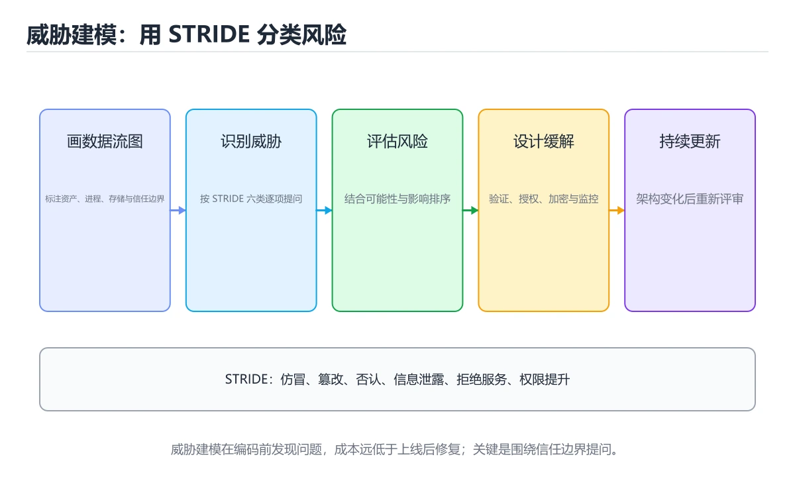
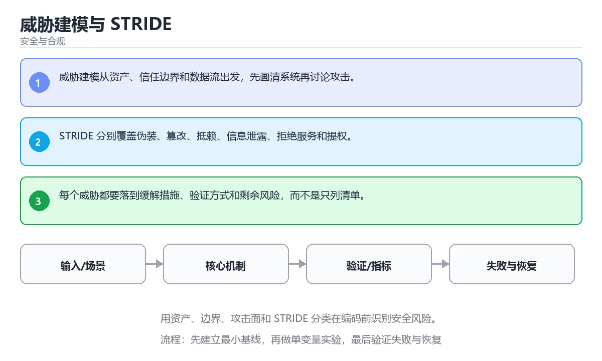

# 威胁建模与 STRIDE





> 内容更新时间：2026-10-06 · 学习阶段：基础 · 预计用时：30 分钟

## 本节知识框架

**课程定位**：所属分类 `security`（安全与合规），课程主题 `威胁建模与 STRIDE`，学习阶段 基础，建议用时 45 分钟。

本课主线：用资产、边界、攻击面和 STRIDE 分类在编码前识别安全风险。

**学完本课应当能够**
- 说清 `威胁建模` 与 `STRIDE` 的含义与区别，并各举一个正例和一个反例。
- 用本课示例验证 `攻击面` 的行为，记录输入、输出与失败条件。
- 遇到「只列威胁不排优先级」这类问题时，能说出触发条件与修复顺序。

### 从概念到验证的学习链条

1. `威胁建模`：先掌握 系统化识别资产、攻击者、入口、信任边界和缓解措施，先于漏洞出现前设计控制，再用它解释 `STRIDE` 为什么会出现。
2. `STRIDE`：先掌握 按欺骗、篡改、否认、信息泄露、拒绝服务和提权分类威胁的模型，再用它解释 `攻击面` 为什么会出现。
3. `攻击面`：先掌握 系统所有可能被外部输入、身份、依赖或配置触达的入口和路径总和，再用它解释 `数据流图` 为什么会出现。
4. `数据流图`：先掌握 用数据在外部实体、进程和存储之间的流向描述系统，并标出信任边界，再用它解释 本课示例的观察结果 为什么会出现。

**先修与衔接**：本课是「安全与合规」分类的第 3 课。相关或后续课程：《OWASP Top 10 实战》、《安全开发生命周期（SDL）》。

### 完成判据

- **定义关**：不看正文也能说明 `威胁建模` 是 系统化识别资产、攻击者、入口、信任边界和缓解措施，先于漏洞出现前设计控制，并指出一个反例。
- **机制关**：能按“输入 → 转换 → 输出 → 验证”复述 `威胁建模与 STRIDE`，而不是只背结论。
- **示例关**：能运行或推演 `威胁建模与 STRIDE` 的 `text` 示例，并说明一个真实出现的标识符或字面量。
- **证据关**：能指出 `威胁建模与 STRIDE` 示例里的 调用了 `sha256()`，并说明它支持或反驳了本课的哪一条结论。
- **排错关**：能复现 只列威胁不排优先级，记录现象并按 结合影响与可能性排序 修复。
- **迁移关**：能把 `威胁建模`、`STRIDE`、`攻击面`、`数据流图` 放进一个与 `威胁建模与 STRIDE` 不同的项目场景，并保持输入与验证条件可追踪。
- **复盘关**：学完 `威胁建模与 STRIDE` 后，用一句话写下仍然不确定的结论，并列出下一次验证需要的输入、环境和成功判据。

### 复习清单

- [ ] 能不看正文复述本课核心术语，并指出一个边界或反例。
- [ ] 能运行或推演本课示例，记录输入、输出与失败现象。
- [ ] 能完成一次自测，并把错题对照错误表定位原因。

## 核心概念定义

| 术语 | 操作性定义 | 常见边界与风险 |
| --- | --- | --- |
| 威胁建模 | 系统化识别资产、攻击者、入口、信任边界和缓解措施，先于漏洞出现前设计控制。 | 易错：架构变化后模型失效；正确做法是把威胁建模纳入架构变更流程。 |
| STRIDE | 按欺骗、篡改、否认、信息泄露、拒绝服务和提权分类威胁的模型。 | 结果依赖数据分布、模型版本与算力预算，换数据集或换硬件都要重新评估。 |
| 攻击面 | 系统所有可能被外部输入、身份、依赖或配置触达的入口和路径总和。 | 不同版本与依赖组合的行为可能不同，升级或换环境前要按官方变更说明重新验证。 |
| 数据流图 | 用数据在外部实体、进程和存储之间的流向描述系统，并标出信任边界。 | 易错：遗漏信任边界；正确做法是先画数据流与信任边界，再逐条列威胁。 |

## 原理与运行机制

### 机制总览

**教材衔接：核心知识**

### 1. 威胁建模从资产、信任边界和数据流出发，先画清系统再讨论攻击。

- 关键做法：先用 e884898da28 建立 威胁建模 的基线，再逐步加入边界与失败条件。
- 验证标准：威胁建模 的结果可复现、错误可解释、失败能恢复。

### 2. STRIDE 分别覆盖伪装、篡改、抵赖、信息泄露、拒绝服务和提权。

把这条结论放回「威胁建模与 STRIDE」的完整流程里展开：

- 正文依据：能用自己的话解释：威胁建模从资产、信任边界和数据流出发，先画清系统再讨论攻击。
- 落地检查：把「2. STRIDE 分别覆盖伪装、篡改、抵赖、信息泄露、拒绝服务和提权。」改写成一条可执行的核对项，逐条验证输入、超时与失败路径。

### 3. 每个威胁都要落到缓解措施、验证方式和剩余风险，而不是只列清单。

把这条结论放回「威胁建模与 STRIDE」的完整流程里展开：

- 正文依据：能用自己的话解释：STRIDE 分别覆盖伪装、篡改、抵赖、信息泄露、拒绝服务和提权。
- 落地检查：把「3. 每个威胁都要落到缓解措施、验证方式和剩余风险，而不是只列清单。」改写成一条可执行的核对项，逐条验证输入、超时与失败路径。

**教材衔接：关键流程**

**教材衔接：实践路径**

**教材衔接：安全落地补充：威胁建模与 STRIDE**

### 一、资产、边界与信任

先回答：保护哪些数据、谁可以访问、哪些组件是信任边界、攻击者能从哪些入口进入。围绕「威胁建模、STRIDE、攻击面、数据流图」列出至少 3 个入口和对应的最小权限。


### 三、上线前安全清单

- [ ] 所有外部输入经过校验和输出编码。
- [ ] 认证、授权和会话失效逻辑有测试。
- [ ] 密钥不进入源码、镜像和日志。
- [ ] 依赖漏洞、许可证和来源已审查。
- [ ] 高风险操作有确认、审计和回滚。
- [ ] 安全事件有联系人和升级路径。

### 四、事件响应演练

围绕「威胁建模与 STRIDE」构造一次 威胁建模 相关的越权或泄露场景，按发现、隔离、轮换、取证、恢复、复盘六步执行，记录时间线与剩余风险。

**教材衔接：验证步骤**

### 机制拆解：每一步的输入、动作与输出

#### 1. `威胁建模`
- 输入：`威胁建模`；本步把 系统化识别资产、攻击者、入口、信任边界和缓解措施，先于漏洞出现前设计控制 当作判断规则。
- 动作：围绕 `威胁建模` 保留中间状态，并记录它与 `STRIDE` 的对应关系。
- 输出：`STRIDE`，它可以被下一段代码、测试或记录继续使用。
- `威胁建模` 的失败条件：当建模一次就束之高阁时，会出现架构变化后模型失效。

#### 2. `STRIDE`
- 输入：`威胁建模`；本步把 按欺骗、篡改、否认、信息泄露、拒绝服务和提权分类威胁的模型 当作判断规则。
- 动作：围绕 `STRIDE` 保留中间状态，并记录它与 `攻击面` 的对应关系。
- 输出：`攻击面`，它可以被下一段代码、测试或记录继续使用。
- `STRIDE` 的失败条件：结果依赖数据分布、模型版本与算力预算，换数据集或换硬件都要重新评估。

#### 3. `攻击面`
- 输入：`STRIDE`；本步把 系统所有可能被外部输入、身份、依赖或配置触达的入口和路径总和 当作判断规则。
- 动作：围绕 `攻击面` 保留中间状态，并记录它与 `数据流图` 的对应关系。
- 输出：`数据流图`，它可以被下一段代码、测试或记录继续使用。
- `攻击面` 的失败条件：不同版本与依赖组合的行为可能不同，升级或换环境前要按官方变更说明重新验证。

#### 4. `数据流图`
- 输入：`攻击面`；本步把 用数据在外部实体、进程和存储之间的流向描述系统，并标出信任边界 当作判断规则。
- 动作：围绕 `数据流图` 保留中间状态，并记录它与 `sha256` 的对应关系。
- 输出：`sha256`，它可以被下一段代码、测试或记录继续使用。
- `数据流图` 的失败条件：当不画数据流图时，会出现遗漏信任边界。

### 示例中的可观察事实

1. 调用了 `sha256()`；它对应的课程主题是 `威胁建模与 STRIDE`。
2. 调用了 `hexdigest()`；它对应的课程主题是 `威胁建模与 STRIDE`。
3. 调用了 `print()`；它对应的课程主题是 `威胁建模与 STRIDE`。
4. 出现字面量 `password`；它对应的课程主题是 `威胁建模与 STRIDE`。

### 复现实验记录

- 环境：`威胁建模与 STRIDE` 使用 `text` 示例，固定 `威胁建模`、`STRIDE`、`攻击面`、`数据流图` 作为第一组条件。
- 首轮输入：先确认 调用了 `sha256()`，预测 `威胁建模` 会怎样变化。
- 基线观察：记录命令、输入、输出和错误原文，不用截图代替可复制的文本。
- 单变量修改：只改变 `威胁建模`，观察 `数据流图` 是否仍满足定义。
- 失败注入：复现 只列威胁不排优先级，确认现象是 修复顺序凭感觉。
- 记录结论：把“修改前、修改后、预期变化、实际变化”写成四列表，这样复盘 `威胁建模与 STRIDE` 时才能区分概念错误与实现错误。

## 典型应用场景

- **只列威胁不排优先级**：典型现象是修复顺序凭感觉；正确做法是结合影响与可能性排序。
- **不画数据流图**：典型现象是遗漏信任边界；正确做法是先画数据流与信任边界，再逐条列威胁。
- **建模一次就束之高阁**：典型现象是架构变化后模型失效；正确做法是把威胁建模纳入架构变更流程。

### 最小验证场景

- 准备：保留 `text` 示例的原始输入，先记录 `威胁建模与 STRIDE` 的基线输出和完整运行命令。
- 观察：先核对 调用了 `sha256()`，再改变一个与 `威胁建模` 相关的条件。
- 判定：新结果与 `威胁建模与 STRIDE` 的基线不同不等于错误；只有当差异破坏了 `威胁建模` 的定义或错误表中的约束，才判定为失败。

### 选择与边界

- 使用 `威胁建模` 时，先满足它的定义：系统化识别资产、攻击者、入口、信任边界和缓解措施，先于漏洞出现前设计控制；易错：架构变化后模型失效；正确做法是把威胁建模纳入架构变更流程。
- 使用 `STRIDE` 时，先满足它的定义：按欺骗、篡改、否认、信息泄露、拒绝服务和提权分类威胁的模型；结果依赖数据分布、模型版本与算力预算，换数据集或换硬件都要重新评估。
- 使用 `攻击面` 时，先满足它的定义：系统所有可能被外部输入、身份、依赖或配置触达的入口和路径总和；不同版本与依赖组合的行为可能不同，升级或换环境前要按官方变更说明重新验证。
- 使用 `数据流图` 时，先满足它的定义：用数据在外部实体、进程和存储之间的流向描述系统，并标出信任边界；易错：遗漏信任边界；正确做法是先画数据流与信任边界，再逐条列威胁。

## 代码/协议/SQL 示例

### 最小可验证示例

**教材衔接：最小可运行示例**

先用 e884898da28 跑通最小示例，然后只改一个与 威胁建模 相关的取值：

```python
import hashlib

digest = hashlib.sha256(b"password").hexdigest()
print(digest[:12])
```

**教材衔接：预期输出**

```text
5e884898da28
```

### 示例精读：先找证据，再改一个条件

1. 调用了 `sha256()`；它出现在 `威胁建模与 STRIDE` 的示例中，阅读时先确认它前后各发生了什么。
2. 调用了 `hexdigest()`；它出现在 `威胁建模与 STRIDE` 的示例中，阅读时先确认它前后各发生了什么。
3. 调用了 `print()`；它出现在 `威胁建模与 STRIDE` 的示例中，阅读时先确认它前后各发生了什么。
4. 出现字面量 `password`；它出现在 `威胁建模与 STRIDE` 的示例中，阅读时先确认它前后各发生了什么。
- 在 `威胁建模与 STRIDE` 中与 `威胁建模` 对照：示例必须能支持 系统化识别资产、攻击者、入口、信任边界和缓解措施，先于漏洞出现前设计控制，否则说明这一段还缺少实现或验证步骤。
- 在 `威胁建模与 STRIDE` 中与 `STRIDE` 对照：示例必须能支持 按欺骗、篡改、否认、信息泄露、拒绝服务和提权分类威胁的模型，否则说明这一段还缺少实现或验证步骤。
- 在 `威胁建模与 STRIDE` 中与 `攻击面` 对照：示例必须能支持 系统所有可能被外部输入、身份、依赖或配置触达的入口和路径总和，否则说明这一段还缺少实现或验证步骤。
- 在 `威胁建模与 STRIDE` 中与 `数据流图` 对照：示例必须能支持 用数据在外部实体、进程和存储之间的流向描述系统，并标出信任边界，否则说明这一段还缺少实现或验证步骤。

## 时间/空间复杂度或性能分析

**性能关注点（威胁建模与 STRIDE）**：加解密与校验开销随数据量增长：记录处理耗时、密钥长度与内存占用。

**测量方法**：以 `威胁建模与 STRIDE` 的 `威胁建模` 场景为对象，固定输入跑一遍记录基线，再把规模或并发度提高一个数量级复测；两次结果的差值与波动范围才是结论依据。

### 需要控制的变量与记录项

- `威胁建模与 STRIDE` 的 `威胁建模`：固定它的版本、输入范围和资源上限，分别记录速度、内存与失败率的变化。
- `威胁建模与 STRIDE` 的 `STRIDE`：固定它的版本、输入范围和资源上限，分别记录速度、内存与失败率的变化。
- `威胁建模与 STRIDE` 的 `攻击面`：固定它的版本、输入范围和资源上限，分别记录速度、内存与失败率的变化。
- `威胁建模与 STRIDE` 的 `数据流图`：固定它的版本、输入范围和资源上限，分别记录速度、内存与失败率的变化。
- `威胁建模与 STRIDE` 中 `威胁建模` 的边界：易错：架构变化后模型失效；正确做法是把威胁建模纳入架构变更流程。达到边界时不要外推，必须重新测量。
- `威胁建模与 STRIDE` 中 `STRIDE` 的边界：结果依赖数据分布、模型版本与算力预算，换数据集或换硬件都要重新评估。达到边界时不要外推，必须重新测量。
- `威胁建模与 STRIDE` 中 `攻击面` 的边界：不同版本与依赖组合的行为可能不同，升级或换环境前要按官方变更说明重新验证。达到边界时不要外推，必须重新测量。
- `威胁建模与 STRIDE` 中 `数据流图` 的边界：易错：遗漏信任边界；正确做法是先画数据流与信任边界，再逐条列威胁。达到边界时不要外推，必须重新测量。
- `威胁建模与 STRIDE` 的代码证据：先验证 调用了 `sha256()`，再记录该路径的输入规模与耗时；只看代码行数不能推出复杂度。

## 常见误区与易错点

| 容易写错的做法 | 实际现象 | 原因与正确做法 |
| --- | --- | --- |
| 只列威胁不排优先级 | 修复顺序凭感觉。 | 结合影响与可能性排序。 |
| 不画数据流图 | 遗漏信任边界。 | 先画数据流与信任边界，再逐条列威胁。 |
| 建模一次就束之高阁 | 架构变化后模型失效。 | 把威胁建模纳入架构变更流程。 |

### 现场 1：只列威胁不排优先级

**症状**：修复顺序凭感觉。

**根因与修复**：结合影响与可能性排序。

**自检**：在本课示例里复现「只列威胁不排优先级」，改成结合影响与可能性排序后重跑；如果症状消失且失败路径按预期变化，说明定位正确。

### 现场 2：不画数据流图

**症状**：遗漏信任边界。

**根因与修复**：先画数据流与信任边界，再逐条列威胁。

**自检**：在本课示例里复现「不画数据流图」，改成先画数据流与信任边界，再逐条列威胁后重跑；如果症状消失且失败路径按预期变化，说明定位正确。

### 现场 3：建模一次就束之高阁

**症状**：架构变化后模型失效。

**根因与修复**：把威胁建模纳入架构变更流程。

**自检**：在本课示例里复现「建模一次就束之高阁」，改成把威胁建模纳入架构变更流程后重跑；如果症状消失且失败路径按预期变化，说明定位正确。

## 与其他知识点的关系

| 关系 | 课程 | 为什么 |
| --- | --- | --- |
| 关联 | 《OWASP Top 10 实战》 | 用于横向比较或把本课结论迁移到相邻主题。 |
| 关联 | 《安全开发生命周期（SDL）》 | 用于横向比较或把本课结论迁移到相邻主题。 |
| 前置顺序 | 《密码与哈希入门》 | 同分类中安排在本课之前，建议先完成其自测。 |
| 后续顺序 | 《OWASP Top 10 实战》 | 同分类中安排在本课之后，会继续使用本课术语。 |

**教材衔接：复习与迁移**

### 概念复述

- 用一句话说明「威胁建模与 STRIDE」解决什么问题：用资产、边界、攻击面和 STRIDE 分类在编码前识别安全风险。
- 写出威胁建模、STRIDE、攻击面之间的关系，并各举一个例子。
- 说出本课最容易混淆的两个概念，以及区分它们的判据。


### 迁移练习

把「威胁建模与 STRIDE」的结论迁移到相邻主题，每次迁移都写清预测与证据：

- **相关或后续**：`OWASP Top 10 实战`、`安全开发生命周期（SDL）`。本课术语会在这些课程里继续使用。
- **术语归属**：`威胁建模`、`STRIDE`、`攻击面` 的定义以本课「核心概念定义」为准，换到其他课程时先确认定义是否被改写。

### 先修与后续术语接口

- `OWASP Top 10 实战`：两者通过本分类的学习顺序衔接，阅读时重点比较各自的输入与失败条件。
- `安全开发生命周期（SDL）`：共享术语 `威胁建模`、`STRIDE`，共同关键词 `威胁建模`、`STRIDE`。

### 容易混淆的相邻概念

- `威胁建模` 与 `STRIDE`：前者强调 系统化识别资产、攻击者、入口、信任边界和缓解措施，先于漏洞出现前设计控制；后者强调 按欺骗、篡改、否认、信息泄露、拒绝服务和提权分类威胁的模型。判断时分别检查两条定义的适用范围，不要只看名称相似就互换。
- `STRIDE` 与 `攻击面`：前者强调 按欺骗、篡改、否认、信息泄露、拒绝服务和提权分类威胁的模型；后者强调 系统所有可能被外部输入、身份、依赖或配置触达的入口和路径总和。判断时分别检查两条定义的适用范围，不要只看名称相似就互换。
- `攻击面` 与 `数据流图`：前者强调 系统所有可能被外部输入、身份、依赖或配置触达的入口和路径总和；后者强调 用数据在外部实体、进程和存储之间的流向描述系统，并标出信任边界。判断时分别检查两条定义的适用范围，不要只看名称相似就互换。

## 自测题与参考答案

> 先独立作答，再对照参考答案；答案都能在本课正文、术语表或错误表里找到依据。

### 自测 1（概念复述）

不看正文，写出 `威胁建模` 的操作性定义，并说明它与 `STRIDE` 的区别。

**参考答案**：系统化识别资产、攻击者、入口、信任边界和缓解措施，先于漏洞出现前设计控制。

`STRIDE` 的定位是：按欺骗、篡改、否认、信息泄露、拒绝服务和提权分类威胁的模型；两者的差别要从适用对象与失败模式上说明。

### 自测 2（排错）

本课错误表记录了「只列威胁不排优先级」这类做法。请写出它会出现的现象、根因，以及修复顺序。

**参考答案**：现象是修复顺序凭感觉；正确做法是结合影响与可能性排序。修复时先复现现象并保留证据，再改动一处假设重跑，确认现象消失。

### 自测 3（动手验证）

运行本课的 `text` 示例，改动其中一个输入后重新运行，记录输出与错误信息。

**参考答案**：正常输入下 `text` 示例应当复现正文给出的结果；改动输入后，如果结果改变或报错，先核对它是否满足 `威胁建模与 STRIDE` 中`威胁建模` 的适用范围，再检查错误表里是否有同类现象。

### 自测 4（代码阅读）

阅读本课开头的 `text` 示例，说明它体现了`威胁建模` 的哪一条性质，并指出改动哪个输入会让这条性质不再成立。

**参考答案**：`威胁建模` 的定义是 系统化识别资产、攻击者、入口、信任边界和缓解措施，先于漏洞出现前设计控制，示例正是在实现这条定义。改动与 `威胁建模` 有关的一个输入后，如果结果不再符合 `威胁建模与 STRIDE` 的正文描述，就说明该性质只在当前前提成立。

### 自测 5（迁移）

把 `威胁建模与 STRIDE` 的方法迁移到自己的项目：围绕 `威胁建模` 写出一个与错误表同类的风险点，并说明触发条件和检验方式。

**参考答案**：例如「建模一次就束之高阁」，它会导致架构变化后模型失效；检验方式是按把威胁建模纳入架构变更流程改一处再复现，确认现象消失且没有引入新的失败分支。

### 自测 6（对比）

用一个表格对比 `威胁建模` 与 `STRIDE`：各写一行适用场景、一行失败表现。

**参考答案**：`威胁建模` 的定义是系统化识别资产、攻击者、入口、信任边界和缓解措施，先于漏洞出现前设计控制；`STRIDE` 的定义是按欺骗、篡改、否认、信息泄露、拒绝服务和提权分类威胁的模型。两者的失败表现分别对应本课错误表里与本术语相关的行。

### 自测 7（排错顺序）

面对「只列威胁不排优先级」引发的问题，请把“复现 修复顺序凭感觉 → 保留证据 → 结合影响与可能性排序 → 回归验证”四步写成可执行的检查清单。

**参考答案**：第一步按修复顺序凭感觉复现；第二步记录输入、版本与完整报错；第三步按结合影响与可能性排序只改一处；第四步重跑并确认失败路径也按预期变化。

### 自测 8（边界判断）

针对 `数据流图`，分别写出“可以使用”的条件和“结论不再成立”的条件。

**参考答案**：易错：遗漏信任边界；正确做法是先画数据流与信任边界，再逐条列威胁。 同时要把 `数据流图` 的定义 用数据在外部实体、进程和存储之间的流向描述系统，并标出信任边界 与实际输入逐项对照。

### 自测 9（机制重建）

不看正文，按输入、转换、输出、验证四段重建 `威胁建模` → `STRIDE` → `攻击面` → `数据流图` 的作用链。

**参考答案**：起点是 `威胁建模` 的定义 系统化识别资产、攻击者、入口、信任边界和缓解措施，先于漏洞出现前设计控制；中间每一步都保留可观察状态；终点由 `数据流图` 检查，失败时回到错误表定位第一个偏离定义的步骤。

### 自测 10（综合排错）

在 `威胁建模与 STRIDE` 中，现象是 架构变化后模型失效。请围绕 建模一次就束之高阁 写出最小复现、关键证据、修复动作和回归验证，并说明为什么不能只凭一次运行下结论。

**参考答案**：先复现 建模一次就束之高阁，记录输入与完整错误；再按 把威胁建模纳入架构变更流程 只改一处。回归时同时跑正常路径和边界路径，只有两次结果都可解释，才把修复视为完成。

### 自测 11（一分钟复述）

用每分钟约 200 字的速度复述 `威胁建模与 STRIDE`：先给主问题，再按顺序说出 `威胁建模`、`STRIDE`、`攻击面`、`数据流图`，最后给一个失败案例。

**自评标准**：主问题必须对应 用资产、边界、攻击面和 STRIDE 分类在编码前识别安全风险；每个术语都要能接上一句定义或边界；失败案例必须写成可观察现象，不能用“可能有风险”代替证据。

## 术语速查

| 术语 | 一句话说明 |
| --- | --- |
| `威胁建模` | 系统化识别资产、攻击者、入口、信任边界和缓解措施，先于漏洞出现前设计控制。 |
| `STRIDE` | 按欺骗、篡改、否认、信息泄露、拒绝服务和提权分类威胁的模型。 |
| `攻击面` | 系统所有可能被外部输入、身份、依赖或配置触达的入口和路径总和。 |
| `数据流图` | 用数据在外部实体、进程和存储之间的流向描述系统，并标出信任边界。 |

**术语关系**：`威胁建模`（系统化识别资产、攻击者、入口、信任边界和缓解措施） → `STRIDE`（按欺骗、篡改、否认、信息泄露、拒绝服务和提权分类威胁的模型） → `攻击面`（系统所有可能被外部输入、身份、依赖或配置触达的入口和路径总和） → `数据流图`（用数据在外部实体、进程和存储之间的流向描述系统）。

## 考点精讲

`威胁建模与 STRIDE` 的题库有 6 道题，下面逐题给出题干、正确项与判断依据：先自己作答，再核对正确项，最后回到正文对应小节复核。

### 考点 1：第 1 题

- **题目**：在 `威胁建模与 STRIDE` 里，与 `威胁建模` 有关的说法中，哪一项最符合用资产、边界、攻击面和 STRIDE 分类在编码前识别安全风险。？
- **正确项**：威胁建模从资产、信任边界和数据流出发，先画清系统再讨论攻击。
- **判断依据**：这道题落在术语 `威胁建模` 上：系统化识别资产、攻击者、入口、信任边界和缓解措施，先于漏洞出现前设计控制。复习时把 `威胁建模` 的定义、适用边界和一个反例一起说清楚，再回到「核心概念定义」核对原文。

### 考点 2：第 2 题

- **题目**：代码语言为 `python`，选自 `威胁建模与 STRIDE` 的 `威胁建模` 部分。课程问题为用资产、边界、攻击面和 STRIDE 分类在编码前识别安全风险。哪一项描述与代码一致？
- **正确项**：出现字面量 `password`
- **判断依据**：这道题落在术语 `威胁建模` 上：系统化识别资产、攻击者、入口、信任边界和缓解措施，先于漏洞出现前设计控制。复习时把 `威胁建模` 的定义、适用边界和一个反例一起说清楚，再回到「核心概念定义」核对原文。

### 考点 3：第 3 题

- **题目**：在 `威胁建模与 STRIDE` 里，与 `威胁建模` 有关的说法中，哪一项最符合用资产、边界、攻击面和 STRIDE 分类在编码前识别安全风险。？（威胁建模与 STRIDE·安全与合规 第 3 题）
- **正确项**：每个威胁都要落到缓解措施、验证方式和剩余风险，而不是只列清单。
- **判断依据**：这道题落在术语 `威胁建模` 上：系统化识别资产、攻击者、入口、信任边界和缓解措施，先于漏洞出现前设计控制。复习时把 `威胁建模` 的定义、适用边界和一个反例一起说清楚，再回到「核心概念定义」核对原文。

### 考点 4：第 4 题

- **题目**：`威胁建模与 STRIDE` 的主线是：用资产、边界、攻击面和 STRIDE 分类在编码前识别安全风险。下面哪一项与这条主线一致？
- **正确项**：用资产、边界、攻击面和 STRIDE 分类在编码前识别安全风险。
- **判断依据**：这道题落在术语 `威胁建模` 上：系统化识别资产、攻击者、入口、信任边界和缓解措施，先于漏洞出现前设计控制。复习时把 `威胁建模` 的定义、适用边界和一个反例一起说清楚，再回到「核心概念定义」核对原文。

### 考点 5：第 5 题

- **题目**：课程 `用资产、边界、攻击面和 STRIDE 分类在编码前识别安全风险。`。在 `威胁建模与 STRIDE` 里，`威胁建模`、`STRIDE` 与下面哪些选项属于同一层概念？（多选）
- **正确项**：威胁建模；STRIDE
- **判断依据**：这道题落在术语 `威胁建模` 上：系统化识别资产、攻击者、入口、信任边界和缓解措施，先于漏洞出现前设计控制。复习时把 `威胁建模` 的定义、适用边界和一个反例一起说清楚，再回到「核心概念定义」核对原文。

### 考点 6：第 6 题

- **题目**：下面几项都与 `威胁建模` 有关，请按 `威胁建模与 STRIDE` 的正文顺序排列；该课主线是用资产、边界、攻击面和 STRIDE 分类在编码前识别安全风险。
- **正确项**：核心知识 → 关键流程 → 实践路径 → 常见误区
- **判断依据**：这道题落在术语 `威胁建模` 上：系统化识别资产、攻击者、入口、信任边界和缓解措施，先于漏洞出现前设计控制。复习时把 `威胁建模` 的定义、适用边界和一个反例一起说清楚，再回到「核心概念定义」核对原文。

### 考点 7：`威胁建模`

- **要点**：系统化识别资产、攻击者、入口、信任边界和缓解措施，先于漏洞出现前设计控制。
- **威胁建模 的边界**：易错：架构变化后模型失效；正确做法是把威胁建模纳入架构变更流程。

### 考点 8：`STRIDE`

- **要点**：按欺骗、篡改、否认、信息泄露、拒绝服务和提权分类威胁的模型。
- **STRIDE 的边界**：结果依赖数据分布、模型版本与算力预算，换数据集或换硬件都要重新评估。

### 考点 9：`攻击面`

- **要点**：系统所有可能被外部输入、身份、依赖或配置触达的入口和路径总和。
- **攻击面 的边界**：不同版本与依赖组合的行为可能不同，升级或换环境前要按官方变更说明重新验证。

### 考点 10：`数据流图`

- **要点**：用数据在外部实体、进程和存储之间的流向描述系统，并标出信任边界。
- **数据流图 的边界**：易错：遗漏信任边界；正确做法是先画数据流与信任边界，再逐条列威胁。

### 考点 11：排错——只列威胁不排优先级

- **现象**：修复顺序凭感觉。
- **处理**：结合影响与可能性排序。

### 考点 12：排错——不画数据流图

- **现象**：遗漏信任边界。
- **处理**：先画数据流与信任边界，再逐条列威胁。

### 考点 13：综合辨析——`威胁建模` 与 `数据流图`

- **辨析点**：`威胁建模` 的定义是 系统化识别资产、攻击者、入口、信任边界和缓解措施，先于漏洞出现前设计控制；`数据流图` 的定义是 用数据在外部实体、进程和存储之间的流向描述系统，并标出信任边界。
- **答题要求**：面对 `威胁建模与 STRIDE` 的题目，先判断描述的是 `威胁建模` 还是 `数据流图`，再归到对应定义，最后写出一个会让该定义失效的边界输入。

### 考点 14：排错评分点

- **现象分**：能写出 修复顺序凭感觉，而不是只写“程序有错”。
- **证据分**：保留触发 只列威胁不排优先级 的输入、版本和错误原文。
- **修复分**：按 结合影响与可能性排序 只改一处，并同时回归正常路径与边界路径。

## 内容元数据

- 内容版本：v2.0
- 最后更新：2026-10-06
- 学习阶段：基础
- 适用环境：OWASP、云原生与合规安全实践；本课聚焦 威胁建模。
- 内容来源：内置结构化课程与工程实践整理
- 相关主题：威胁建模、STRIDE、攻击面、数据流图
- 质量版本：P0 测验标准 + P1 覆盖扩展 + P2 体验补全

## 参考资料与复核

- 最后复核：2026-10-04
- 下次复核：2026-11-24
- 复核范围：版本兼容、API 行为、安全建议与工程实践
- 来源性质：官方文档、标准或权威教材；本课核对关键词：威胁建模、STRIDE、攻击面、数据流图。

| 参考资料 | 本课用途 |
| --- | --- |
| [MITRE ATT&CK](https://attack.mitre.org/) | 攻击技术与防御映射 |
| [NIST 网络安全框架](https://www.nist.gov/cyberframework) | 风险管理与治理 |
| [OWASP Top 10](https://owasp.org/www-project-top-ten/) | 常见 Web 安全风险 |

| [本课术语索引：威胁建模与 STRIDE](#核心概念定义) | 按本课输入、术语边界和错误表现逐项核对 |
> 「威胁建模与 STRIDE」的链接用于离线阅读后的延伸核对；App 不会自动联网。