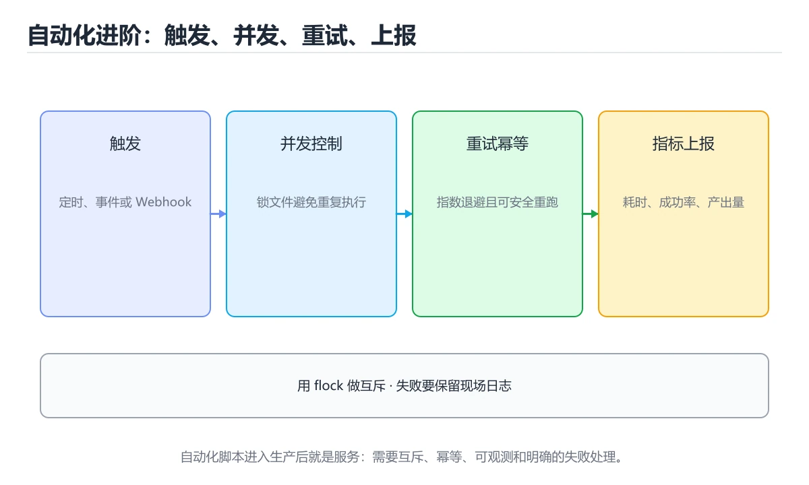
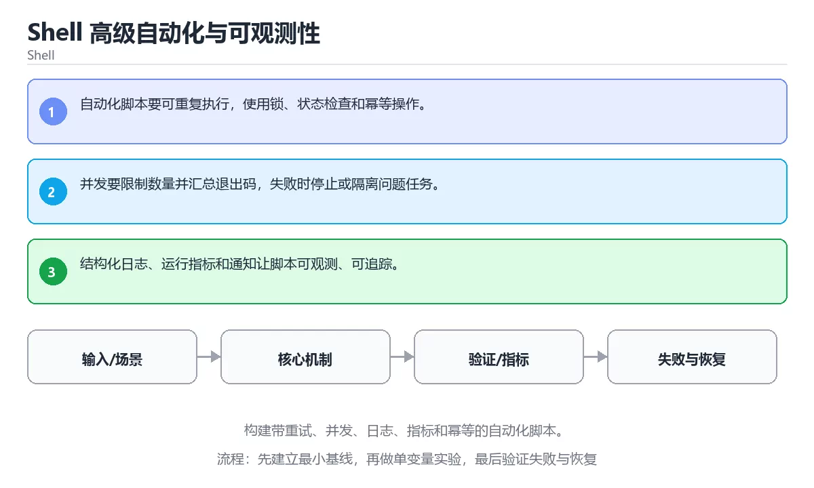

# 本课主题

> 内容更新时间：2026-10-03





## 学习目标

- 能用自己的话解释：自动化脚本要可重复执行，使用锁、状态检查和幂等操作。
- 能用自己的话解释：并发要限制数量并汇总退出码，失败时停止或隔离问题任务。
- 能用自己的话解释：结构化日志、运行指标和通知让脚本可观测、可追踪。
- 能把本课知识放回「Shell」，并完成练习与测验。

## 前置知识

- 已完成「Shell」的基础课程，能运行正文中的最小示例。
- 本课关键词：自动化、幂等、并发、日志。
- 遇到不熟悉的术语先记录问题，完成练习后再回读。

## 核心知识

### 1. 自动化脚本要可重复执行，使用锁、状态检查和幂等操作。

- 关键做法：先用最小示例建立基线，再逐步加入边界、失败和性能条件。
- 验证标准：结果可复现、错误可解释、边界有测试、失败能恢复。

### 2. 并发要限制数量并汇总退出码，失败时停止或隔离问题任务。

### 3. 结构化日志、运行指标和通知让脚本可观测、可追踪。

## 关键流程

```text
输入 → 校验 → 核心处理 → 验证 → 记录指标 → 失败恢复
```

## 实践路径

1. 用一句话复述本课要解决的问题。
2. 跑通正文中的最小示例并记录基线。
3. 只改变一个输入或参数，预测并验证结果。
4. 补一个失败路径，记录错误、恢复和指标。
5. 把结论写成可复现的笔记或测试。

## 常见误区

| 误区 | 后果 | 修正 |
| --- | --- | --- |
| 只记术语不做实验 | 遇到真实问题无法判断 | 用最小输入跑通并记录结果 |
| 只测正常路径 | 边界和故障上线才暴露 | 补空值、极值和依赖失败 |
| 没有基线就优化 | 无法证明改进有效 | 先测量再修改 |
| 忽略成本与安全 | 性能和风险失控 | 同时记录资源、权限与失败代价 |

## 动手练习

1. 合上教程，用 3～5 句话解释本课主题。
2. 从正文选一个例子，改变一个条件并预测结果。
3. 设计一个失败场景，写出止损与恢复步骤。

**验收标准**：留下输入、命令、输出、差异和下一步问题。

## 本课小结

- 本课属于「Shell」，核心关键词是 自动化、幂等、并发、日志。
- 先保证正确与可复现，再讨论性能和扩展。
- 完成练习和测验后，把仍然不确定的问题写成下一轮验证清单。

> 本课由 P1 内容扩展生成，重点补充原有课程缺失的主题与工程边界。

## 可运行练习

### 任务 1：先跑通，再解释

```bash
#!/usr/bin/env bash
set -euo pipefail

log() { printf '[%s] %s\n' "$1" "$2"; }

retry() {
  local attempts=0
  until "$@"; do
    attempts=$((attempts + 1))
    if (( attempts >= 3 )); then
      return 1
    fi
    sleep 1
  done
}
```

### 任务 2：只改一个条件

### 任务 3：迁移到自己的数据

用同一套思路处理一组你自己的数据或场景，保持输出格式与任务 1 一致。

## 故障现场

### 现场 1：本课的 自动化 常规用例通过，但边界用例失败

**症状**：在本课的练习或生产场景里出现“本课的 自动化 常规用例通过，但边界用例失败”。

**复现**：准备一组最小输入，只保留触发“本课的 自动化 常规用例通过，但边界用例失败”的必要条件，连续运行两次确认结果稳定。

**定位**：围绕“自动化 的前置条件与取值边界没有写进代码，默认值掩盖了空值和极值”检查调用链、输入数据和环境配置，先验证假设再改代码。

**预防**：把“本课的 自动化 常规用例通过，但边界用例失败”写成一条自动化用例，并在本课的验收清单里保留对应检查项。

### 现场 2：本课的 幂等 结果在两次运行之间不一致

**症状**：在本课的练习或生产场景里出现“本课的 幂等 结果在两次运行之间不一致”。

**复现**：准备一组最小输入，只保留触发“本课的 幂等 结果在两次运行之间不一致”的必要条件，连续运行两次确认结果稳定。

**定位**：围绕“幂等 依赖了当前版本、执行顺序或共享状态，单次运行无法暴露差异”检查调用链、输入数据和环境配置，先验证假设再改代码。

**预防**：把“本课的 幂等 结果在两次运行之间不一致”写成一条自动化用例，并在本课的验收清单里保留对应检查项。

### 现场 3：本课的验证只在开发机通过

**症状**：在本课的练习或生产场景里出现“本课的验证只在开发机通过”。

**定位**：围绕“环境版本、配置和输入规模与目标环境不同，自动化 缺少可重复的验证记录”检查调用链、输入数据和环境配置，先验证假设再改代码。

## 版本与时效

- Bash 5.x 与 POSIX sh 的行为差异仍然是最常见的可移植性来源
- 升级前确认目标环境的 Bash 版本、内置命令与数组能力

### 升级检查清单

- 先固定当前版本，跑通全部示例与测验，再升级工具链。
- 只改一个版本变量，记录编译、测试、性能与产物体积的变化。
- 重点回归默认值、弃用警告、序列化格式、并发语义和错误信息。
- 升级完成后更新本课的“最后复核 / 下次复核”日期与版本说明。

## 本课复习清单

离开本课前，逐项确认：

- [ ] 不看解析，能说出「关于「自动化脚本要可重复执行 使用锁、状态…」，下列说法正确的是？」的判断依据。
- [ ] 不看解析，能说出「关于「并发要限制数量并汇总退出码 失败时停…」，下列说法正确的是？」的判断依据。
- [ ] 不看解析，能说出「关于「结构化日志、运行指标和通知让脚本可观…」，下列说法正确的是？」的判断依据。
- [ ] 不看解析，能说出「本课的核心学习目标是什么？」的判断依据。
- [ ] 至少运行一次本课示例，记录输入、输出和一个边界情况。
- [ ] 把本课最容易混淆的两个概念写成一句话对照。

| 复盘项 | 记录 |
| --- | --- |
| 已经能独立解释的考点 |  |
| 仍然说不清的概念 |  |
| 下一步验证动作 |  |

## 逐节复习与自检

下面按正文顺序回顾每一节，并给出一个自检问题；说不清的地方回到原章节补课。

### 核心知识

自检：这一节与相邻主题的边界在哪里？

### 动手练习

自检：如果去掉这一节里的一个前提，结论会怎样变化？

### 最小可运行示例

```bash
#!/usr/bin/env bash
set -euo pipefail

log() { printf '[%s] %s\n' "$1" "$2"; }

retry() {
  local attempts=0
  until "$@"; do
    attempts=$((attempts + 1))
    if (( attempts >= 3 )); then
      return 1
    fi
    sleep 1
  done
}
```

自检：把这一节讲给没学过的人，最需要强调哪一点？

### 预期输出

```text
[INFO] job done
```

### 验证步骤

制造一次错误输入，记录错误信息与修复方式。

## 易错点回顾

- **关于「自动化脚本要可重复执行 使用锁、状态…」，下列说法正确的是？**：正确答案是「自动化脚本要可重复执行，使用锁、状态检查和幂等操作。
- **关于「并发要限制数量并汇总退出码 失败时停…」，下列说法正确的是？**：正确答案是「并发要限制数量并汇总退出码，失败时停止或隔离问题任务。
- **关于「结构化日志、运行指标和通知让脚本可观…」，下列说法正确的是？**：正确答案是「结构化日志、运行指标和通知让脚本可观测、可追踪。
- **本课的核心学习目标是什么？**：正确答案是「构建带重试、并发、日志、指标和幂等的自动化脚本。

## 术语速查

| 术语 | 本课语境 |
| --- | --- |
| `自动化` | 本课围绕该主题展开，结合正文与代码示例理解它的适用边界。 |
| `幂等` | 本课围绕该主题展开，结合正文与代码示例理解它的适用边界。 |
| `并发` | 本课围绕该主题展开，结合正文与代码示例理解它的适用边界。 |
| `日志` | 本课围绕该主题展开，结合正文与代码示例理解它的适用边界。 |

## 深度拓展与实战

这一节把正文里的定义、代码和失败模式串成一条可操作的复习路线。

### 机制拆解

- **1. 自动化脚本要可重复执行，使用锁、状态检查和幂等操作。**：1. 自动化脚本要可重复执行，使用锁、状态检查和幂等操作
- **2. 并发要限制数量并汇总退出码，失败时停止或隔离问题任务。**：2. 并发要限制数量并汇总退出码，失败时停止或隔离问题任务
- **3. 结构化日志、运行指标和通知让脚本可观测、可追踪。**：3. 结构化日志、运行指标和通知让脚本可观测、可追踪
- **考点 1：关于「自动化脚本要可重复执行 使用锁、状态…」，下列说法正确的是？**：考点 1：关于「自动化脚本要可重复执行 使用锁、状态…」，下列说法正确的是
- **考点 2：关于「并发要限制数量并汇总退出码 失败时停…」，下列说法正确的是？**：考点 2：关于「并发要限制数量并汇总退出码 失败时停…」，下列说法正确的是

### 边界条件与常见反例

### 工程检查表

- [ ] 能否用自己的话说明本课主题解决什么问题，以及它不负责什么？
- [ ] 能否指出最小可运行示例的输入、输出和一条失败路径？
- [ ] 能否解释本课关键词在真实项目中的边界与取舍？
- [ ] 能否把本课方法迁移到另一个相近问题，并说明需要改什么？

### 迁移练习

1. 保持正文示例不变，写出它的输入、处理步骤和预期输出。
2. 只改变一个条件，预测结果并说明依据；再运行或手算验证。
3. 结合自动化、幂等、并发、日志，写出一个真实项目中的使用场景。
4. 写下一个反例，说明它在什么条件下会使朴素做法失效。

<!-- p0-depth-v2:start -->
## 零基础精讲：把本课主题真正讲透

### 先建立一个直觉

本课的摘要可以当作一张地图：构建带重试、并发、日志、指标和幂等的自动化脚本。

### 逐步拆解

2. 描述处理过程。把「自动化、幂等、并发、日志」映射到具体步骤，每步都要求能单独验证。
3. 定义输出。输出不仅包括正常结果，还包括错误码、日志、指标和资源释放状态。
4. 找出一条失败路径。让错误尽早暴露，并说明重试、降级、回滚或人工处理的边界。
5. 用一个小例子贯穿全过程。先手算或预测结果，再运行代码或实验，最后解释差异。

### 把正文串成一条执行链

- **考点 3：关于「结构化日志、运行指标和通知让脚本可观…」，下列说法正确的是？**：考点 3：关于「结构化日志、运行指标和通知让脚本可观…」，下列说法正确的是

### 从测验反推易错点

**检查点 1：关于「自动化脚本要可重复执行 使用锁、状态…」，下列说法正确的是？**

- 参考判断：自动化脚本要可重复执行，使用锁、状态检查和幂等操作。
- 自问：如果去掉题干里的一个限定词，结论还成立吗？

**检查点 2：关于「并发要限制数量并汇总退出码 失败时停…」，下列说法正确的是？**

- 参考判断：并发要限制数量并汇总退出码，失败时停止或隔离问题任务。

**检查点 3：关于「结构化日志、运行指标和通知让脚本可观…」，下列说法正确的是？**

- 参考判断：结构化日志、运行指标和通知让脚本可观测、可追踪。

**检查点 4：本课的核心学习目标是什么？**

- 参考判断：构建带重试、并发、日志、指标和幂等的自动化脚本。

**检查点 5：以下哪些术语与本课主题直接相关？（多选）**

- 参考判断：自动化、幂等

### 工程排错顺序

| 先查什么 | 要得到的证据 | 判断标准 |
| --- | --- | --- |
| 输入与前提是否满足 | 日志、输入样例、测试或指标 | 能复现并解释，才算定位 |
| 核心步骤是否产生了预期中间结果 | 日志、输入样例、测试或指标 | 能复现并解释，才算定位 |
| 失败路径是否可观测、可恢复 | 日志、输入样例、测试或指标 | 能复现并解释，才算定位 |
| 资源、权限与成本是否在预算内 | 日志、输入样例、测试或指标 | 能复现并解释，才算定位 |

### 变式训练

1. 把它放进一个只有单机、没有额外依赖的小项目，先保证正确，再考虑扩展。
2. 把输入规模扩大十倍，记录时间、内存和失败路径，找出第一个真正瓶颈。
3. 制造一次依赖超时或错误输入，要求系统给出可解释错误并且不留下半完成状态。
5. 删掉一个看似必要的步骤，观察哪个测试或指标先失败，用证据说明它为什么必要。
6. 把方案切换到低资源设备，重新评估默认参数、超时和降级策略。

### 本课自测

- [ ] 能用一句话解释「自动化」在本课中的角色与边界。
- [ ] 能举出一个正常例子和一个失败例子。
- [ ] 能说出最小验证步骤，以及需要记录的证据。
- [ ] 能用一句话解释「幂等」在本课中的角色与边界。
- [ ] 能用一句话解释「并发」在本课中的角色与边界。
- [ ] 能用一句话解释「日志」在本课中的角色与边界。

### 迁移案例库

下面用不同约束重复同一套方法。每完成一轮，都把结论写进笔记，并只改变一个变量。

#### 迁移案例 1：围绕「自动化」做一次小实验

**目标**：在不改变课程主体的前提下，验证本课主题中的一个关键判断。

**步骤**：
1. 复述当前方案对「自动化」的假设，写成一句可证伪的话。
2. 设计一个正常输入和一个边界输入，分别预测输出。
3. 运行或逐步演算，记录实际输出、耗时和失败信息。
4. 只调整一个参数，比较前后差异并解释原因。
5. 补充一条测试或复习卡，确保下次能更快复现。

**验收**：结论有证据、差异可解释、失败可恢复；如果做不到，说明还需要缩小问题范围。

#### 迁移案例 2：围绕「幂等」做一次小实验

**步骤**：
1. 复述当前方案对「幂等」的假设，写成一句可证伪的话。

#### 迁移案例 3：围绕「并发」做一次小实验

**步骤**：
1. 复述当前方案对「并发」的假设，写成一句可证伪的话。

#### 迁移案例 4：围绕「日志」做一次小实验

**步骤**：
1. 复述当前方案对「日志」的假设，写成一句可证伪的话。

#### 迁移案例 5：围绕「自动化」做一次小实验

**步骤**：

#### 迁移案例 6：围绕「幂等」做一次小实验

**步骤**：

#### 迁移案例 7：围绕「并发」做一次小实验

**步骤**：

#### 迁移案例 8：围绕「日志」做一次小实验

**步骤**：

#### 迁移案例 9：围绕「自动化」做一次小实验

**步骤**：

#### 迁移案例 10：围绕「幂等」做一次小实验

**步骤**：

#### 迁移案例 11：围绕「并发」做一次小实验

**步骤**：

#### 迁移案例 12：围绕「日志」做一次小实验

**步骤**：

#### 迁移案例 13：围绕「自动化」做一次小实验

**步骤**：

#### 迁移案例 14：围绕「幂等」做一次小实验

**步骤**：

#### 迁移案例 15：围绕「并发」做一次小实验

**步骤**：

#### 迁移案例 16：围绕「日志」做一次小实验

**步骤**：

<!-- p0-depth-v2:end -->

## 考点精讲

### 考点 1：按“Shell 高级自动化与可观测性”中 自动化、幂等、并发 的实践顺序，把四个步骤排成从准备到复盘的合理顺序。

- **判断依据**：正确的执行顺序是「先明确 自动化 的输入、输出与约束」 → 「写出最小示例并核对 幂等 的基线结果」 → 「只改一个变量，记录边界与失败路径的变化」 → 「固定版本与证据，把本课的结论写成可复现记录」。在本课的练习里，顺序应当是：先明确 自动化 的输入、输出与约束 → 写出最小示例并核对 幂等 的基线结果 → 只改一个变量，记录边界与失败路径的变化 → 固定版本与证据，把本课的结论写成可复现记录。这个顺序把 自动化 的输入、输出和约束放在最前面，在本课主题里避免概念没对齐就开始调参。第二步用 幂等 建立可核对的基线，在本课主题里第三步才允许改变一个变量并观察失败路径。

### 考点 2：关于「并发要限制数量并汇总退出码 失败时停…」，下列说法正确的是？

- **判断依据**：本题应选「并发要限制数量并汇总退出码，失败时停止或隔离问题任务」。本题应选并发要限制数量并汇总退出码，失败时停止或隔离问题任务。正确答案是并发要限制数量并汇总退出码，失败时停止或隔离问题任务。解题的关键不是记住孤立术语，而是确认并发要限制数量并汇总退出码，失败时停止或隔离问题任务。

### 考点 3：关于「结构化日志、运行指标和通知让脚本可观…」，下列说法正确的是？

- **判断依据**：符合题干条件的是「结构化日志、运行指标和通知让脚本可观测、可追踪」。符合题干条件的是结构化日志、运行指标和通知让脚本可观测、可追踪。正确答案是结构化日志、运行指标和通知让脚本可观测、可追踪。如果只凭关键词作答，很容易把只要小数据能跑通，大规模和异常情况也一定正确。

### 考点 4：「Shell 高级自动化与可观测性」的核心学习目标是什么？

- **判断依据**：结论应落在「构建带重试、并发、日志、指标和幂等的自动化脚本」。结论应落在构建带重试、并发、日志、指标和幂等的自动化脚本。正确答案是构建带重试、并发、日志、指标和幂等的自动化脚本。这道题要求区分概念与边界，构建带重试、并发、日志、指标和幂等的自动化脚本。

### 考点 5：以下哪些术语与「Shell 高级自动化与可观测性」直接相关？（多选）

- **判断依据**：正确答案包括「自动化」、「幂等」。幂等放回题干限定的对象、输入和边界，自动化、vcpkg 等说法虽然包含相关术语，但范围或前提与本题不一致。围绕 以下哪些术语与本课主题直接相关（shellautomationadvanced 第 5 题）。（多选） 作答时，先用自动化建立输入与输出的基线，再把自动化。

### 考点 6：阅读「Shell 高级自动化与可观测性」的代码片段，下面哪项判断是正确的？

- **判断依据**：本题应选「自动化脚本要可重复执行，使用锁、状态检查和幂等操作」。本题应选自动化脚本要可重复执行，使用锁、状态检查和幂等操作。正确答案是自动化脚本要可重复执行，使用锁、状态检查和幂等操作。本课在本课小结中说明：本课属于…在本课中，如果只改一个条件，输出通常会随之改变，因此不能脱离代码前提作答。

## English Overview

**Title:** Advanced Shell Automation and Observability

**Summary:** Build idempotent automation with retries, concurrency, logs and metrics.

**Category:** Shell
**Level:** 高级
**Key terms:** 自动化, 幂等, 并发, 日志

## 内容元数据

- 内容版本：v2.0
- 最后更新：2026-10-03
- 学习阶段：高级
- 适用环境：Bash 5 / POSIX Shell
- 内容来源：内置结构化课程与工程实践整理
- 相关主题：自动化、幂等、并发、日志
- 质量版本：P0 测验标准 + P1 覆盖扩展 + P2 体验补全

## 最小可运行示例

下面示例用于验证本课的最小输入、处理和输出。先原样运行，再只修改一个值：

```bash
#!/usr/bin/env bash
set -euo pipefail

log() { printf '[%s] %s\n' "$1" "$2"; }

retry() {
  local attempts=0
  until "$@"; do
    attempts=$((attempts + 1))
    if (( attempts >= 3 )); then
      return 1
    fi
  done
}

retry true
log INFO "job done"
```

## 预期输出

```text
[INFO] job done
```

## 验证步骤

1. 记录运行环境、命令和真实输出。
2. 修改一个输入，先写预测再运行。
4. 把结论写回本课笔记或测试用例。


## 参考资料与复核

- 最后复核：2026-10-04
- 下次复核：2027-04-04
- 复核范围：版本兼容、API 行为、安全建议与工程实践
- 来源性质：官方文档、标准或权威教材；正文为离线教学重组

| 参考资料 | 本课用途 |
| --- | --- |
| [GNU Bash 手册](https://www.gnu.org/software/bash/manual/) | Bash 语法、展开与作业控制 |
| [GNU Coreutils](https://www.gnu.org/software/coreutils/manual/) | 文件、文本与进程工具 |
| [GNU sed](https://www.gnu.org/software/sed/manual/sed.html) | 流式文本替换 |

> 「Shell 高级自动化与可观测性」的链接用于离线阅读后的延伸核对；App 不会自动联网。

## 复习与迁移

- 围绕「按本课主题中 自动化、幂等、并发 的实践顺序，把四个步骤排成从准备到复盘的合理顺序。」做迁移时，先记录输入、边界和预期，再观察自动化对结果的影响，并用「先明确 自动化 的输入、输出与约束 → 写出最小示例并核对 幂等 的基线结果 → 只…」解释正常与失败路径。
- 把幂等放进最小实验：固定版本和输入，只改变一个条件，记录输出差异，并说明「并发要限制数量并汇总退出码，失败时停止或隔离问题任务。」在什么前提下成立。

<!-- p0p1-review:start -->
## 复习与迁移

- 围绕「按本课主题中 自动化、幂等、并发 的实践顺序，把四个步骤排成从准备到复盘的合理顺序。」做迁移时，先记录输入、边界和预期，再观察自动化对结果的影响，并用「先明确 自动化 的输入、输出与约束 → 写出最小示例并核对 幂等 的基线结果 → 只…」解释正常与失败路径。
- 把幂等放进最小实验：固定版本和输入，只改变一个条件，记录输出差异，并说明「并发要限制数量并汇总退出码，失败时停止或隔离问题任务。」在什么前提下成立。
- 复习「关于「结构化日志、运行指标和通知让脚本可观…」，下列说法正确的是？」时，不要只背结论；用并发的边界值复现一次，再把现象、原因和修复写成三步记录。
- 如果把日志换成空值、极值或并发输入，「构建带重试、并发、日志、指标和幂等的自动化脚本。」是否仍然成立？写出验证命令和观察到的结果。
- 围绕「以下哪些术语与本课主题直接相关？（多选）」做迁移时，先记录输入、边界和预期，再观察自动化对结果的影响，并用「自动化；幂等」解释正常与失败路径。
- 把幂等放进最小实验：固定版本和输入，只改变一个条件，记录输出差异，并说明「自动化脚本要可重复执行，使用锁、状态检查和幂等操作。」在什么前提下成立。
<!-- p0p1-review:end -->
