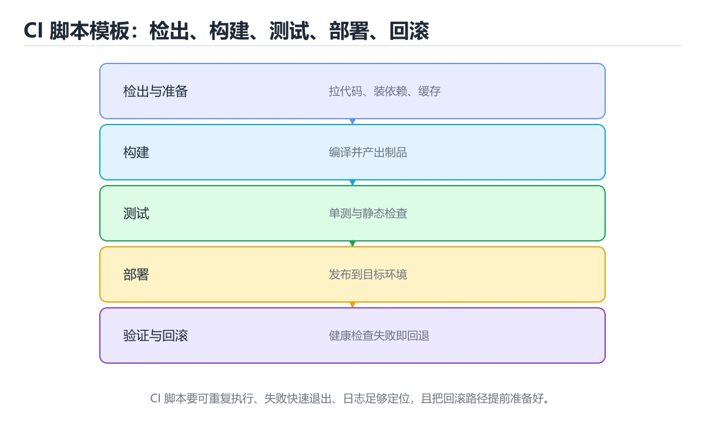
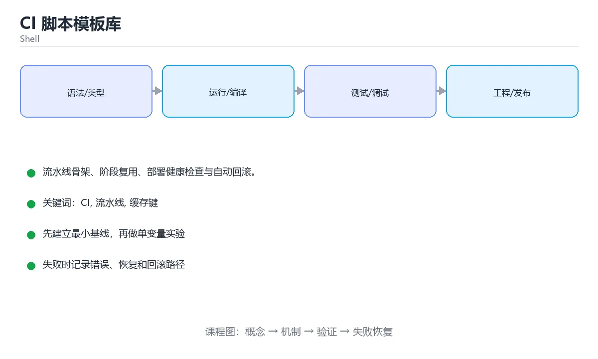

# CI 脚本模板库

> 内容更新时间：2026-10-06 · 学习阶段：进阶 · 预计用时：50 分钟





## 本节知识框架

**课程定位**：所属分类 `shell`（Shell），课程主题 `CI 脚本模板库`，学习阶段 进阶，建议用时 45 分钟。

本课主线：流水线骨架、阶段复用、部署健康检查与自动回滚。

**学完本课应当能够**
- 说清 `部署` 与 `健康检查` 的含义与区别，并各举一个正例和一个反例。
- 用本课示例验证 `幂等发布` 的行为，记录输入、输出与失败条件。
- 遇到「每个环境都重新构建」这类问题时，能说出触发条件与修复顺序。

### 从概念到验证的学习链条

1. `部署`：先掌握 把构建产物、配置和依赖发布到目标环境并使其可对外服务，再用它解释 `健康检查` 为什么会出现。
2. `健康检查`：先掌握 周期性探测进程或依赖是否可服务，并据此摘除或重启实例，再用它解释 `幂等发布` 为什么会出现。
3. `幂等发布`：先掌握 同一个版本重复执行不产生额外副作用，这是流水线可以安全重跑的前提，再用它解释 `失败回滚` 为什么会出现。
4. `失败回滚`：先掌握 发布失败时把副本与配置切回上一个可用版本，并且要有明确的判定条件，再用它解释 `缓存键` 为什么会出现。
5. `缓存键`：先掌握 决定缓存能否命中的字符串，通常包含依赖锁文件的哈希，写错就会复用到过期的依赖，再用它解释 `Shell` 为什么会出现。
6. `Shell`：先掌握 接收命令并调用操作系统程序的命令行解释器与脚本环境，再用它解释 本课示例的观察结果 为什么会出现。

**先修与衔接**：本课是「Shell」分类的第 15 课。先修内容：《系统运维脚本实战》。《系统运维脚本实战》里的 `备份`、`幂等` 是本课的前提。相关或后续课程：《Shell 脚本安全加固》、《CI 流水线配置：九种生态横向对照》。

### 完成判据

- **定义关**：不看正文也能说明 `部署` 是 把构建产物、配置和依赖发布到目标环境并使其可对外服务，并指出一个反例。
- **机制关**：能按“输入 → 转换 → 输出 → 验证”复述 `CI 脚本模板库`，而不是只背结论。
- **示例关**：能运行或推演 `CI 脚本模板库` 的 `bash` 示例，并说明一个真实出现的标识符或字面量。
- **证据关**：能指出 `CI 脚本模板库` 示例里的 调用了 `log()`，并说明它支持或反驳了本课的哪一条结论。
- **排错关**：能复现 每个环境都重新构建，记录现象并按 构建一次，复用制品 修复。
- **迁移关**：能把 `CI`、`流水线`、`缓存键`、`部署` 放进一个与 `CI 脚本模板库` 不同的项目场景，并保持输入与验证条件可追踪。
- **复盘关**：学完 `CI 脚本模板库` 后，用一句话写下仍然不确定的结论，并列出下一次验证需要的输入、环境和成功判据。

### 复习清单

- [ ] 能不看正文复述本课核心术语，并指出一个边界或反例。
- [ ] 能运行或推演本课示例，记录输入、输出与失败现象。
- [ ] 能完成一次自测，并把错题对照错误表定位原因。

## 核心概念定义

| 术语 | 操作性定义 | 常见边界与风险 |
| --- | --- | --- |
| 部署 | 把构建产物、配置和依赖发布到目标环境并使其可对外服务。 | 易错：带病上线；正确做法是部署后轮询就绪端点。 |
| 健康检查 | 周期性探测进程或依赖是否可服务，并据此摘除或重启实例。 | 易错：带病上线；正确做法是部署后轮询就绪端点。 |
| 幂等发布 | 同一个版本重复执行不产生额外副作用，这是流水线可以安全重跑的前提。 | 不同版本与依赖组合的行为可能不同，升级或换环境前要按官方变更说明重新验证。 |
| 失败回滚 | 发布失败时把副本与配置切回上一个可用版本，并且要有明确的判定条件。 | 不同版本与依赖组合的行为可能不同，升级或换环境前要按官方变更说明重新验证。 |
| 缓存键 | 决定缓存能否命中的字符串，通常包含依赖锁文件的哈希，写错就会复用到过期的依赖 | 易错：用到过期依赖；正确做法是用 lockfile 哈希做键。 |
| Shell | 接收命令并调用操作系统程序的命令行解释器与脚本环境 | 只在「接收命令并调用操作系统程序的命令行解释器与脚本环境」这一前提下成立，换输入或换环境要重新验证。 |

## 原理与运行机制

### 机制总览

**教材衔接：流水线阶段速查**

| 阶段 | 目标 | 失败处理 |
| --- | --- | --- |
| 准备 | 校验环境与依赖 | 立即失败并打印缺失项 |
| 静态检查 | 快速反馈 | 阻断 |
| 测试 | 验证行为 | 阻断 |
| 构建 | 产出不可变制品 | 阻断 |
| 安全扫描 | 依赖与密钥 | 高危阻断 |
| 部署预发 | 环境验证 | 阻断并保留环境 |
| 灰度发布 | 观察真实流量 | 指标异常自动回滚 |
| 全量发布 | 正式上线 | 支持一键回滚 |

**教材衔接：版本与时效**

- 版本提示：CI 的行为在最近几个大版本里有过调整，升级「CI 脚本模板库」前先用 BASH_SOURCE 复现当前输出，再对照官方发布说明逐条核对。
- 升级「CI 脚本模板库」涉及的依赖前，先用 BASH_SOURCE 复现当前行为，再逐项核对版本说明与破坏性变更。

### 升级检查清单

- 先固定当前版本，跑通全部示例与测验，再升级工具链。
- 一次只改一个版本条件，把 CI 相关的差异单独记成一条结论。
- 升级后重点回归 CI 的默认值、警告信息与错误格式。
- 升级后把 BASH_SOURCE 的实测版本写进「内容元数据」，再更新复核日期。

### 机制拆解：每一步的输入、动作与输出

#### 1. `部署`
- 输入：`CI`；本步把 把构建产物、配置和依赖发布到目标环境并使其可对外服务 当作判断规则。
- 动作：围绕 `部署` 保留中间状态，并记录它与 `健康检查` 的对应关系。
- 输出：`健康检查`，它可以被下一段代码、测试或记录继续使用。
- `部署` 的失败条件：当部署无健康检查时，会出现带病上线。

#### 2. `健康检查`
- 输入：`部署`；本步把 周期性探测进程或依赖是否可服务，并据此摘除或重启实例 当作判断规则。
- 动作：围绕 `健康检查` 保留中间状态，并记录它与 `幂等发布` 的对应关系。
- 输出：`幂等发布`，它可以被下一段代码、测试或记录继续使用。
- `健康检查` 的失败条件：当部署无健康检查时，会出现带病上线。

#### 3. `幂等发布`
- 输入：`健康检查`；本步把 同一个版本重复执行不产生额外副作用，这是流水线可以安全重跑的前提 当作判断规则。
- 动作：围绕 `幂等发布` 保留中间状态，并记录它与 `失败回滚` 的对应关系。
- 输出：`失败回滚`，它可以被下一段代码、测试或记录继续使用。
- `幂等发布` 的失败条件：不同版本与依赖组合的行为可能不同，升级或换环境前要按官方变更说明重新验证。

#### 4. `失败回滚`
- 输入：`幂等发布`；本步把 发布失败时把副本与配置切回上一个可用版本，并且要有明确的判定条件 当作判断规则。
- 动作：围绕 `失败回滚` 保留中间状态，并记录它与 `缓存键` 的对应关系。
- 输出：`缓存键`，它可以被下一段代码、测试或记录继续使用。
- `失败回滚` 的失败条件：不同版本与依赖组合的行为可能不同，升级或换环境前要按官方变更说明重新验证。

#### 5. `缓存键`
- 输入：`失败回滚`；本步把 决定缓存能否命中的字符串，通常包含依赖锁文件的哈希，写错就会复用到过期的依赖 当作判断规则。
- 动作：围绕 `缓存键` 保留中间状态，并记录它与 `Shell` 的对应关系。
- 输出：`Shell`，它可以被下一段代码、测试或记录继续使用。
- `缓存键` 的失败条件：当缓存键不含 lockfile时，会出现用到过期依赖。

#### 6. `Shell`
- 输入：`缓存键`；本步把 接收命令并调用操作系统程序的命令行解释器与脚本环境 当作判断规则。
- 动作：围绕 `Shell` 保留中间状态，并记录它与 `log` 的对应关系。
- 输出：`log`，它可以被下一段代码、测试或记录继续使用。
- `Shell` 的失败条件：只在「接收命令并调用操作系统程序的命令行解释器与脚本环境」这一前提下成立，换输入或换环境要重新验证。

### 示例中的可观察事实

1. 调用了 `log()`；它对应的课程主题是 `CI 脚本模板库`。
2. 调用了 `die()`；它对应的课程主题是 `CI 脚本模板库`。
3. 调用了 `require_tools()`；它对应的课程主题是 `CI 脚本模板库`。
4. 调用了 `done()`；它对应的课程主题是 `CI 脚本模板库`。
5. 调用了 `stage()`；它对应的课程主题是 `CI 脚本模板库`。
6. 调用了 `run_lint()`；它对应的课程主题是 `CI 脚本模板库`。
7. 调用了 `run_test()`；它对应的课程主题是 `CI 脚本模板库`。
8. 调用了 `run_build()`；它对应的课程主题是 `CI 脚本模板库`。

### 复现实验记录

- 环境：`CI 脚本模板库` 使用 `bash` 示例，固定 `CI`、`流水线`、`缓存键`、`部署` 作为第一组条件。
- 首轮输入：先确认 调用了 `log()`，预测 `部署` 会怎样变化。
- 基线观察：记录命令、输入、输出和错误原文，不用截图代替可复制的文本。
- 单变量修改：只改变 `CI`，观察 `Shell` 是否仍满足定义。
- 失败注入：复现 每个环境都重新构建，确认现象是 测试过的不是发布的。
- 记录结论：把“修改前、修改后、预期变化、实际变化”写成四列表，这样复盘 `CI 脚本模板库` 时才能区分概念错误与实现错误。

## 典型应用场景

- **每个环境都重新构建**：典型现象是测试过的不是发布的；正确做法是构建一次，复用制品。
- **用 `npm install`**：典型现象是版本可能与 lockfile 不一致；正确做法是CI 用 `npm ci`。
- **密钥写进 YAML**：典型现象是泄露；正确做法是用 Secrets。
- **没设 `timeout-minutes`**：典型现象是卡住的任务占用额度；正确做法是每个 job 设超时。

### 最小验证场景

- 准备：保留 `bash` 示例的原始输入，先记录 `CI 脚本模板库` 的基线输出和完整运行命令。
- 观察：先核对 调用了 `log()`，再改变一个与 `部署` 相关的条件。
- 判定：新结果与 `CI 脚本模板库` 的基线不同不等于错误；只有当差异破坏了 `部署` 的定义或错误表中的约束，才判定为失败。

### 选择与边界

- 使用 `部署` 时，先满足它的定义：把构建产物、配置和依赖发布到目标环境并使其可对外服务；易错：带病上线；正确做法是部署后轮询就绪端点。
- 使用 `健康检查` 时，先满足它的定义：周期性探测进程或依赖是否可服务，并据此摘除或重启实例；易错：带病上线；正确做法是部署后轮询就绪端点。
- 使用 `幂等发布` 时，先满足它的定义：同一个版本重复执行不产生额外副作用，这是流水线可以安全重跑的前提；不同版本与依赖组合的行为可能不同，升级或换环境前要按官方变更说明重新验证。
- 使用 `失败回滚` 时，先满足它的定义：发布失败时把副本与配置切回上一个可用版本，并且要有明确的判定条件；不同版本与依赖组合的行为可能不同，升级或换环境前要按官方变更说明重新验证。
- 使用 `缓存键` 时，先满足它的定义：决定缓存能否命中的字符串，通常包含依赖锁文件的哈希，写错就会复用到过期的依赖；易错：用到过期依赖；正确做法是用 lockfile 哈希做键。

## 代码/协议/SQL 示例

### 最小可验证示例

```bash
#!/usr/bin/env bash
# ci.sh：可在本地与流水线复用，靠环境变量区分行为
set -Eeuo pipefail

readonly SCRIPT_DIR="$(cd -- "$(dirname -- "${BASH_SOURCE[0]}")" && pwd)"
readonly BUILD_DIR="${BUILD_DIR:-${SCRIPT_DIR}/build}"

log() { printf '%s [%s] %s\n' "$(date '+%F %T')" "$1" "$2" >&2; }
die() { log ERROR "$1"; exit 1; }

require_tools() {
  local missing=()
  for tool in "$@"; do
    command -v "$tool" >/dev/null 2>&1 || missing+=("$tool")
  done
  ((${#missing[@]} == 0)) || die "缺少依赖：${missing[*]}"
}

stage() {
  local name="$1"; shift
  local start=$SECONDS
  log INFO "开始：$name"
  "$@" || { log ERROR "失败：$name"; return 1; }
  log INFO "完成：$name（$((SECONDS - start))s）"
}

run_lint()   { flutter analyze; }
run_test()   { flutter test; }
run_build()  {
  mkdir -p -- "$BUILD_DIR"
  flutter build apk --release
  cp -- build/app/outputs/flutter-apk/app-release.apk "$BUILD_DIR/"
  sha256sum "$BUILD_DIR/app-release.apk" > "$BUILD_DIR/app-release.apk.sha256"
}

main() {
  require_tools flutter git
  stage lint  run_lint
  stage test  run_test
  stage build run_build
  log INFO "流水线全部通过"
}

main "$@"
```

**教材衔接：通用脚本骨架**

**教材衔接：部署与回滚要点**

| 要点 | 做法 |
| --- | --- |
| 制品不可变 | 用提交 SHA 或版本号命名，禁止覆盖 |
| 幂等部署 | 重复执行结果一致，不产生重复资源 |
| 健康检查 | 部署后轮询就绪端点，超时即失败 |
| 灰度放量 | 按比例逐步放量并观察指标 |
| 自动回滚 | 错误率或延迟超阈值立即切回上一版本 |
| 回滚演练 | 定期验证回滚路径可用 |
| 变更记录 | 记录版本、操作人、时间与结果 |

```bash
# 部署脚本片段：带健康检查与自动回滚
deploy() {
  local image="$1"
  local previous
  previous=$(current_version)

  log INFO "部署 $image（上一版本 $previous）"
  set_version "$image" || die "部署失败"

  if ! wait_healthy 60; then
    log ERROR "健康检查失败，回滚到 $previous"
    set_version "$previous" || die "回滚失败，需要人工介入"
    wait_healthy 60 || die "回滚后仍不健康"
    return 1
  fi
  log INFO "部署成功"
}

# 缓存键必须包含锁文件哈希，否则会用到过期依赖
cache_key() {
  local lockfile="$1"
  printf '%s-%s' "$(uname -s)" "$(sha256sum "$lockfile" | cut -c1-16)"
}
```

**教材衔接：零基础详解：CI 流水线模板**

### 一句话说清它是什么

CI 流水线就是「每次提交后自动跑的那串检查」。
好的流水线有三个特征：**快、稳定、失败信息清楚**。

### 用生活比喻理解

| 阶段 | 比喻 | 说明 |
| --- | --- | --- |
| 检出与缓存 | 备料 | 装依赖，尽量复用缓存 |
| 静态检查 | 质检 | lint、类型检查、shellcheck |
| 测试 | 验收 | 单元与集成测试 |
| 构建 | 打包 | 产出制品，只构建一次 |
| 发布 | 发货 | 部署到环境，可回滚 |

### 模板一：通用多语言项目

```yaml
name: ci
on:
  push: { branches: [main] }
  pull_request:

concurrency:
  group: ci-${{ github.ref }}
  cancel-in-progress: true          # 新提交自动取消旧流水线

jobs:
  check:
    runs-on: ubuntu-latest
    timeout-minutes: 15
    steps:
      - uses: actions/checkout@v4
      - uses: actions/setup-node@v4
        with: { node-version: 22, cache: npm }
      - run: npm ci
      - run: npx tsc --noEmit
      - run: npm run lint
      - run: npm test -- --run

  build:
    needs: check
    runs-on: ubuntu-latest
    steps:
        with: { node-version: 22, cache: npm }
      - run: npm ci
      - run: npm run build
      - uses: actions/upload-artifact@v4
        with:
          name: dist-${{ github.sha }}     # 用 commit SHA 命名
          path: dist/
          retention-days: 7
```

### 模板二：Shell 脚本仓库

```yaml
name: shell-ci
on: [push, pull_request]

jobs:
  lint-and-test:
    runs-on: ubuntu-latest
    steps:
      - name: 安装工具
        run: |
          sudo apt-get update
          sudo apt-get install -y shellcheck bats
      - name: 静态检查
        run: shellcheck -S warning scripts/*.sh
      - name: 单元测试
        run: bats test/
      - name: 语法检查
        run: |
          for f in scripts/*.sh; do
            bash -n "$f"
          done
```

### 模板三：Docker 镜像构建与扫描

```yaml
name: image
on:
  push: { tags: ["v*"] }

jobs:
  build:
    runs-on: ubuntu-latest
    permissions:
      contents: read
      packages: write
    steps:
      - uses: docker/setup-buildx-action@v3
      - name: 登录镜像仓库
        uses: docker/login-action@v3
        with:
          registry: ghcr.io
          username: ${{ github.actor }}
          password: ${{ secrets.GITHUB_TOKEN }}
      - name: 构建并推送
        uses: docker/build-push-action@v6
        with:
          push: true
          tags: ghcr.io/${{ github.repository }}:${{ github.ref_name }}
          cache-from: type=gha
          cache-to: type=gha,mode=max
      - name: 漏洞扫描
        uses: aquasecurity/trivy-action@0.28.0
        with:
          image-ref: ghcr.io/${{ github.repository }}:${{ github.ref_name }}
          severity: HIGH,CRITICAL
          exit-code: "1"          # 有高危漏洞就失败
```

### 让流水线变快的五招

| 手段 | 效果 |
| --- | --- |
| 依赖缓存（`cache: npm`） | 省掉每次下载时间 |
| `concurrency` 取消旧任务 | 不浪费并行额度 |
| 拆分并行 job | 用时间换机器数 |
| 只跑受影响的包（monorepo） | 大幅缩短时间 |
| 容器镜像层缓存 | 加速镜像构建 |

### 让流水线可信的四条纪律

```text
1. 只构建一次：制品用 commit SHA 命名，各环境复用同一份
2. 密钥进 Secrets：绝不写在 YAML 里
3. 失败要能定位：日志分级、保留测试报告与制品
4. 关键检查不许跳过：类型检查、测试、漏洞扫描都是门禁
```

### 新手最容易踩的八个坑

| 坑 | 现象 | 正确做法 |
| --- | --- | --- |
| 每个环境都重新构建 | 测试过的不是发布的 | 构建一次，复用制品 |
| 用 `npm install` | 版本可能与 lockfile 不一致 | CI 用 `npm ci` |
| 密钥写进 YAML | 泄露 | 用 Secrets |
| 没设 `timeout-minutes` | 卡住的任务占用额度 | 每个 job 设超时 |
| 缓存键不含 lockfile | 用到过期依赖 | 用 lockfile 哈希做键 |
| 所有检查串在一个 job | 出错慢、定位难 | 拆分并行 job |
| 只跑测试不跑构建 | 上线才发现打不出包 | 构建纳入流水线 |
| 制品没保留期限 | 存储无限增长 | 设置 `retention-days` |

### 学完自测

- [ ] 能说出 CI 的五个典型阶段。
- [ ] 知道为什么 CI 要用 `npm ci` 而不是 `npm install`。
- [ ] 能说出让流水线变快的至少三招。
- [ ] 知道「只构建一次」为什么重要。
- [ ] 能为 Shell 仓库写出 shellcheck 加 bats 的流水线。

**运行方式**：运行 `CI 脚本模板库` 的示例时，用 `bash 文件名.sh` 运行；先 `bash -n` 做语法检查更稳妥。

### 示例精读：先找证据，再改一个条件

1. 调用了 `log()`；它出现在 `CI 脚本模板库` 的示例中，阅读时先确认它前后各发生了什么。
2. 调用了 `die()`；它出现在 `CI 脚本模板库` 的示例中，阅读时先确认它前后各发生了什么。
3. 调用了 `require_tools()`；它出现在 `CI 脚本模板库` 的示例中，阅读时先确认它前后各发生了什么。
4. 调用了 `done()`；它出现在 `CI 脚本模板库` 的示例中，阅读时先确认它前后各发生了什么。
5. 调用了 `stage()`；它出现在 `CI 脚本模板库` 的示例中，阅读时先确认它前后各发生了什么。
6. 调用了 `run_lint()`；它出现在 `CI 脚本模板库` 的示例中，阅读时先确认它前后各发生了什么。
7. 调用了 `run_test()`；它出现在 `CI 脚本模板库` 的示例中，阅读时先确认它前后各发生了什么。
8. 调用了 `run_build()`；它出现在 `CI 脚本模板库` 的示例中，阅读时先确认它前后各发生了什么。
- 在 `CI 脚本模板库` 中与 `部署` 对照：示例必须能支持 把构建产物、配置和依赖发布到目标环境并使其可对外服务，否则说明这一段还缺少实现或验证步骤。
- 在 `CI 脚本模板库` 中与 `健康检查` 对照：示例必须能支持 周期性探测进程或依赖是否可服务，并据此摘除或重启实例，否则说明这一段还缺少实现或验证步骤。
- 在 `CI 脚本模板库` 中与 `幂等发布` 对照：示例必须能支持 同一个版本重复执行不产生额外副作用，这是流水线可以安全重跑的前提，否则说明这一段还缺少实现或验证步骤。
- 在 `CI 脚本模板库` 中与 `失败回滚` 对照：示例必须能支持 发布失败时把副本与配置切回上一个可用版本，并且要有明确的判定条件，否则说明这一段还缺少实现或验证步骤。

## 时间/空间复杂度或性能分析

**性能关注点（CI 脚本模板库）**：进程启动与管道是主要成本：记录总耗时与子进程数量，避免在循环里反复启动外部命令。

**本课特有开销（CI 脚本模板库 · CI）**：缓存命中率比缓存实现本身更关键，先记录命中率与失效策略再谈优化。

**测量方法**：以 `CI 脚本模板库` 的 `CI` 场景为对象，固定输入跑一遍记录基线，再把规模或并发度提高一个数量级复测；两次结果的差值与波动范围才是结论依据。

### 需要控制的变量与记录项

- `CI 脚本模板库` 的 `CI`：固定它的版本、输入范围和资源上限，分别记录速度、内存与失败率的变化。
- `CI 脚本模板库` 的 `流水线`：固定它的版本、输入范围和资源上限，分别记录速度、内存与失败率的变化。
- `CI 脚本模板库` 的 `缓存键`：固定它的版本、输入范围和资源上限，分别记录速度、内存与失败率的变化。
- `CI 脚本模板库` 的 `部署`：固定它的版本、输入范围和资源上限，分别记录速度、内存与失败率的变化。
- `CI 脚本模板库` 的 `健康检查`：固定它的版本、输入范围和资源上限，分别记录速度、内存与失败率的变化。
- `CI 脚本模板库` 中 `部署` 的边界：易错：带病上线；正确做法是部署后轮询就绪端点。达到边界时不要外推，必须重新测量。
- `CI 脚本模板库` 中 `健康检查` 的边界：易错：带病上线；正确做法是部署后轮询就绪端点。达到边界时不要外推，必须重新测量。
- `CI 脚本模板库` 中 `幂等发布` 的边界：不同版本与依赖组合的行为可能不同，升级或换环境前要按官方变更说明重新验证。达到边界时不要外推，必须重新测量。
- `CI 脚本模板库` 中 `失败回滚` 的边界：不同版本与依赖组合的行为可能不同，升级或换环境前要按官方变更说明重新验证。达到边界时不要外推，必须重新测量。
- `CI 脚本模板库` 中 `缓存键` 的边界：易错：用到过期依赖；正确做法是用 lockfile 哈希做键。达到边界时不要外推，必须重新测量。
- `CI 脚本模板库` 的代码证据：先验证 调用了 `log()`，再记录该路径的输入规模与耗时；只看代码行数不能推出复杂度。

## 常见误区与易错点

| 容易写错的做法 | 实际现象 | 原因与正确做法 |
| --- | --- | --- |
| 每个环境都重新构建 | 测试过的不是发布的 | 构建一次，复用制品 |
| 用 `npm install` | 版本可能与 lockfile 不一致 | CI 用 `npm ci` |
| 密钥写进 YAML | 泄露 | 用 Secrets |
| 没设 `timeout-minutes` | 卡住的任务占用额度 | 每个 job 设超时 |
| 缓存键不含 lockfile | 用到过期依赖 | 用 lockfile 哈希做键 |
| 所有检查串在一个 job | 出错慢、定位难 | 拆分并行 job |
| 只跑测试不跑构建 | 上线才发现打不出包 | 构建纳入流水线 |
| 制品没保留期限 | 存储无限增长 | 设置 `retention-days` |
| CI 用 `install` 而非锁定安装 | 依赖版本漂移 | 用 `--frozen-lockfile` / `npm ci` |
| 缓存键不含锁文件 | 用到过期依赖 | 键里加 lock 哈希 |
| 每个阶段重复构建 | 流水线很慢 | 构建一次，产物在阶段间传递 |
| 密钥打印到日志 | 泄漏 | 用环境变量并遮蔽输出 |
| 部署无健康检查 | 带病上线 | 部署后轮询就绪端点 |
| 无自动回滚 | 故障持续 | 指标超阈值立即回滚 |
| 跳过测试加速 | 缺陷进生产 | 只允许在明确授权时跳过 |
| 脚本不可本地复现 | 本地无法调试 | 同一脚本，靠环境变量区分 |
| CI 用 install 而非锁定安装 | 依赖版本漂移。 | 用 --frozen-lockfile / npm ci。 |

### 现场 1：每个环境都重新构建

**症状**：测试过的不是发布的。

**根因与修复**：构建一次，复用制品。

**自检**：在本课示例里复现「每个环境都重新构建」，改成构建一次，复用制品后重跑；如果症状消失且失败路径按预期变化，说明定位正确。

### 现场 2：用 `npm install`

**症状**：版本可能与 lockfile 不一致。

**根因与修复**：CI 用 `npm ci`。

**自检**：在本课示例里复现「用 `npm install`」，改成CI 用 `npm ci`后重跑；如果症状消失且失败路径按预期变化，说明定位正确。

### 现场 3：密钥写进 YAML

**症状**：泄露。

**根因与修复**：用 Secrets。

**自检**：在本课示例里复现「密钥写进 YAML」，改成用 Secrets后重跑；如果症状消失且失败路径按预期变化，说明定位正确。

### 现场 4：没设 `timeout-minutes`

**症状**：卡住的任务占用额度。

**根因与修复**：每个 job 设超时。

**自检**：在本课示例里复现「没设 `timeout-minutes`」，改成每个 job 设超时后重跑；如果症状消失且失败路径按预期变化，说明定位正确。

### 现场 5：缓存键不含 lockfile

**症状**：用到过期依赖。

**根因与修复**：用 lockfile 哈希做键。

**自检**：在本课示例里复现「缓存键不含 lockfile」，改成用 lockfile 哈希做键后重跑；如果症状消失且失败路径按预期变化，说明定位正确。

### 现场 6：所有检查串在一个 job

**症状**：出错慢、定位难。

**根因与修复**：拆分并行 job。

**自检**：在本课示例里复现「所有检查串在一个 job」，改成拆分并行 job后重跑；如果症状消失且失败路径按预期变化，说明定位正确。

### 现场 7：只跑测试不跑构建

**症状**：上线才发现打不出包。

**根因与修复**：构建纳入流水线。

**自检**：在本课示例里复现「只跑测试不跑构建」，改成构建纳入流水线后重跑；如果症状消失且失败路径按预期变化，说明定位正确。

### 现场 8：制品没保留期限

**症状**：存储无限增长。

**根因与修复**：设置 `retention-days`。

**自检**：在本课示例里复现「制品没保留期限」，改成设置 `retention-days`后重跑；如果症状消失且失败路径按预期变化，说明定位正确。

### 现场 9：CI 用 `install` 而非锁定安装

**症状**：依赖版本漂移。

**根因与修复**：用 `--frozen-lockfile` / `npm ci`。

**自检**：在本课示例里复现「CI 用 `install` 而非锁定安装」，改成用 `--frozen-lockfile` / `npm ci`后重跑；如果症状消失且失败路径按预期变化，说明定位正确。

## 与其他知识点的关系

- **先修**：`系统运维脚本实战`。本课默认这些内容已经掌握。
- **相关或后续**：`Shell 脚本安全加固`、`CI 流水线配置：九种生态横向对照`。本课术语会在这些课程里继续使用。
- **术语归属**：`部署`、`健康检查`、`幂等发布` 的定义以本课「核心概念定义」为准，换到其他课程时先确认定义是否被改写。
- 同一分类的《Shell 脚本工程化》也涉及 `CI`；两课衔接时先确认这个术语的定义是否一致。
- 同一分类的《Shell 与 Docker/K8s 交互》也涉及 `健康检查`；两课衔接时先确认这个术语的定义是否一致。

### 先修与后续术语接口

- `系统运维脚本实战`：两者通过本分类的学习顺序衔接，阅读时重点比较各自的输入与失败条件。
- `Shell 脚本安全加固`：共享术语 `Shell`。
- `CI 流水线配置：九种生态横向对照`：共享术语 `缓存键`，共同关键词 `CI`、`流水线`。

### 容易混淆的相邻概念

- `部署` 与 `健康检查`：前者强调 把构建产物、配置和依赖发布到目标环境并使其可对外服务；后者强调 周期性探测进程或依赖是否可服务，并据此摘除或重启实例。判断时分别检查两条定义的适用范围，不要只看名称相似就互换。
- `健康检查` 与 `幂等发布`：前者强调 周期性探测进程或依赖是否可服务，并据此摘除或重启实例；后者强调 同一个版本重复执行不产生额外副作用，这是流水线可以安全重跑的前提。判断时分别检查两条定义的适用范围，不要只看名称相似就互换。
- `幂等发布` 与 `失败回滚`：前者强调 同一个版本重复执行不产生额外副作用，这是流水线可以安全重跑的前提；后者强调 发布失败时把副本与配置切回上一个可用版本，并且要有明确的判定条件。判断时分别检查两条定义的适用范围，不要只看名称相似就互换。
- `失败回滚` 与 `缓存键`：前者强调 发布失败时把副本与配置切回上一个可用版本，并且要有明确的判定条件；后者强调 决定缓存能否命中的字符串，通常包含依赖锁文件的哈希，写错就会复用到过期的依赖。判断时分别检查两条定义的适用范围，不要只看名称相似就互换。
- `缓存键` 与 `Shell`：前者强调 决定缓存能否命中的字符串，通常包含依赖锁文件的哈希，写错就会复用到过期的依赖；后者强调 接收命令并调用操作系统程序的命令行解释器与脚本环境。判断时分别检查两条定义的适用范围，不要只看名称相似就互换。

## 自测题与参考答案

> 先独立作答，再对照参考答案；答案都能在本课正文、术语表或错误表里找到依据。

### 自测 1（概念复述）

不看正文，写出 `部署` 的操作性定义，并说明它与 `健康检查` 的区别。

**参考答案**：把构建产物、配置和依赖发布到目标环境并使其可对外服务。

`健康检查` 的定位是：周期性探测进程或依赖是否可服务，并据此摘除或重启实例；两者的差别要从适用对象与失败模式上说明。

### 自测 2（排错）

本课错误表记录了「每个环境都重新构建」这类做法。请写出它会出现的现象、根因，以及修复顺序。

**参考答案**：现象是测试过的不是发布的；正确做法是构建一次，复用制品。修复时先复现现象并保留证据，再改动一处假设重跑，确认现象消失。

### 自测 3（动手验证）

运行本课的 `bash` 示例，把其中的 `"$(cd -- "` 换成一个边界值后重新运行，记录输出与错误信息。

**参考答案**：正常输入下 `bash` 示例应当复现正文给出的结果；把 `"$(cd -- "` 换成边界值后，如果结果改变或报错，先核对它是否满足 `CI 脚本模板库` 中`部署` 的适用范围，再检查错误表里是否有同类现象。

### 自测 4（代码阅读）

阅读本课开头的 `bash` 示例，说明它体现了`部署` 的哪一条性质，并指出改动哪个输入会让这条性质不再成立。

**参考答案**：`部署` 的定义是 把构建产物、配置和依赖发布到目标环境并使其可对外服务，示例正是在实现这条定义。改动与 `部署` 有关的一个输入后，如果结果不再符合 `CI 脚本模板库` 的正文描述，就说明该性质只在当前前提成立。

### 自测 5（迁移）

把 `CI 脚本模板库` 的方法迁移到自己的项目：围绕 `部署` 写出一个与错误表同类的风险点，并说明触发条件和检验方式。

**参考答案**：例如「CI 用 install 而非锁定安装」，它会导致依赖版本漂移；检验方式是按用 --frozen-lockfile / npm ci改一处再复现，确认现象消失且没有引入新的失败分支。

### 自测 6（对比）

用一个表格对比 `部署` 与 `健康检查`：各写一行适用场景、一行失败表现。

**参考答案**：`部署` 的定义是把构建产物、配置和依赖发布到目标环境并使其可对外服务；`健康检查` 的定义是周期性探测进程或依赖是否可服务，并据此摘除或重启实例。两者的失败表现分别对应本课错误表里与本术语相关的行。

### 自测 7（排错顺序）

面对「每个环境都重新构建」引发的问题，请把“复现 测试过的不是发布的 → 保留证据 → 构建一次，复用制品 → 回归验证”四步写成可执行的检查清单。

**参考答案**：第一步按测试过的不是发布的复现；第二步记录输入、版本与完整报错；第三步按构建一次，复用制品只改一处；第四步重跑并确认失败路径也按预期变化。

### 自测 8（边界判断）

针对 `Shell`，分别写出“可以使用”的条件和“结论不再成立”的条件。

**参考答案**：只在「接收命令并调用操作系统程序的命令行解释器与脚本环境」这一前提下成立，换输入或换环境要重新验证。 同时要把 `Shell` 的定义 接收命令并调用操作系统程序的命令行解释器与脚本环境 与实际输入逐项对照。

### 自测 9（机制重建）

不看正文，按输入、转换、输出、验证四段重建 `部署` → `健康检查` → `幂等发布` → `失败回滚` 的作用链。

**参考答案**：起点是 `部署` 的定义 把构建产物、配置和依赖发布到目标环境并使其可对外服务；中间每一步都保留可观察状态；终点由 `Shell` 检查，失败时回到错误表定位第一个偏离定义的步骤。

### 自测 10（综合排错）

在 `CI 脚本模板库` 中，现象是 依赖版本漂移。请围绕 CI 用 install 而非锁定安装 写出最小复现、关键证据、修复动作和回归验证，并说明为什么不能只凭一次运行下结论。

**参考答案**：先复现 CI 用 install 而非锁定安装，记录输入与完整错误；再按 用 --frozen-lockfile / npm ci 只改一处。回归时同时跑正常路径和边界路径，只有两次结果都可解释，才把修复视为完成。

### 自测 11（一分钟复述）

用每分钟约 200 字的速度复述 `CI 脚本模板库`：先给主问题，再按顺序说出 `部署`、`健康检查`、`幂等发布`、`失败回滚`，最后给一个失败案例。

**自评标准**：主问题必须对应 流水线骨架、阶段复用、部署健康检查与自动回滚；每个术语都要能接上一句定义或边界；失败案例必须写成可观察现象，不能用“可能有风险”代替证据。

## 术语速查

| 术语 | 一句话说明 |
| --- | --- |
| `部署` | 把构建产物、配置和依赖发布到目标环境并使其可对外服务。 |
| `健康检查` | 周期性探测进程或依赖是否可服务，并据此摘除或重启实例。 |
| `幂等发布` | 同一个版本重复执行不产生额外副作用，这是流水线可以安全重跑的前提。 |
| `失败回滚` | 发布失败时把副本与配置切回上一个可用版本，并且要有明确的判定条件。 |
| `缓存键` | 决定缓存能否命中的字符串，通常包含依赖锁文件的哈希，写错就会复用到过期的依赖。 |
| `Shell` | 接收命令并调用操作系统程序的命令行解释器与脚本环境。 |

**术语关系**：`部署`（把构建产物、配置和依赖发布到目标环境并使其可对外服务） → `健康检查`（周期性探测进程或依赖是否可服务） → `幂等发布`（同一个版本重复执行不产生额外副作用） → `失败回滚`（发布失败时把副本与配置切回上一个可用版本）。

## 考点精讲

`CI 脚本模板库` 的题库有 6 道题，下面逐题给出题干、正确项与判断依据：先自己作答，再核对正确项，最后回到正文对应小节复核。

### 考点 1：第 1 题

- **题目**：CI 中依赖缓存的 key 应该包含什么？
- **正确项**：锁文件的哈希
- **判断依据**：这道题检验本课主问题：流水线骨架、阶段复用、部署健康检查与自动回滚。复习时先复述本课主问题，再举一个会让结论失效的输入。

### 考点 2：第 2 题

- **题目**：部署后必须做健康检查的原因是？
- **正确项**：确认新版本真正可用
- **判断依据**：这道题落在术语 `部署` 上：把构建产物、配置和依赖发布到目标环境并使其可对外服务。复习时把 `部署` 的定义、适用边界和一个反例一起说清楚，再回到「核心概念定义」核对原文。

### 考点 3：第 3 题

- **题目**：围绕“CI 脚本模板库”中的 CI、流水线、缓存键，下列哪两项是本课强调的实践判断？
- **正确项**：验证 流水线 时要固定版本并覆盖边界输入，结论才可复现；学习 CI 时要同时说明输入、输出和失败路径，不能只看正常流程
- **判断依据**：这道题落在术语 `缓存键` 上：决定缓存能否命中的字符串，通常包含依赖锁文件的哈希，写错就会复用到过期的依赖。复习时把 `缓存键` 的定义、适用边界和一个反例一起说清楚，再回到「核心概念定义」核对原文。

### 考点 4：第 4 题

- **题目**：阅读 `CI 脚本模板库` 中围绕 `部署` 的代码；课程主线是流水线骨架、阶段复用、部署健康检查与自动回滚。下面哪项判断最准确？
- **正确项**：流水线骨架、阶段复用、部署健康检查与自动回滚。
- **判断依据**：这道题落在术语 `部署` 上：把构建产物、配置和依赖发布到目标环境并使其可对外服务。复习时把 `部署` 的定义、适用边界和一个反例一起说清楚，再回到「核心概念定义」核对原文。

### 考点 5：第 5 题

- **题目**：自动回滚触发条件通常是什么？
- **正确项**：错误率或延迟等关键指标超过阈值
- **判断依据**：这道题检验本课主问题：流水线骨架、阶段复用、部署健康检查与自动回滚。复习时先复述本课主问题，再举一个会让结论失效的输入。

### 考点 6：第 6 题

- **题目**：填空：补齐下面这段术语说明中的空缺。课程 `流水线骨架、阶段复用、部署健康检查与自动回滚。`，这段说明是：`____`：决定缓存能否命中的字符串，通常包含依赖锁文件的哈希，写错就会复用到过期的依赖。空缺处应填哪个术语？
- **正确项**：缓存键
- **判断依据**：这道题落在术语 `部署` 上：把构建产物、配置和依赖发布到目标环境并使其可对外服务。复习时把 `部署` 的定义、适用边界和一个反例一起说清楚，再回到「核心概念定义」核对原文。

### 考点 7：`部署`

- **要点**：把构建产物、配置和依赖发布到目标环境并使其可对外服务。
- **部署 的边界**：易错：带病上线；正确做法是部署后轮询就绪端点。

### 考点 8：`健康检查`

- **要点**：周期性探测进程或依赖是否可服务，并据此摘除或重启实例。
- **健康检查 的边界**：易错：带病上线；正确做法是部署后轮询就绪端点。

### 考点 9：`幂等发布`

- **要点**：同一个版本重复执行不产生额外副作用，这是流水线可以安全重跑的前提。
- **幂等发布 的边界**：不同版本与依赖组合的行为可能不同，升级或换环境前要按官方变更说明重新验证。

### 考点 10：`失败回滚`

- **要点**：发布失败时把副本与配置切回上一个可用版本，并且要有明确的判定条件。
- **失败回滚 的边界**：不同版本与依赖组合的行为可能不同，升级或换环境前要按官方变更说明重新验证。

### 考点 11：`缓存键`

- **要点**：决定缓存能否命中的字符串，通常包含依赖锁文件的哈希，写错就会复用到过期的依赖
- **缓存键 的边界**：易错：用到过期依赖；正确做法是用 lockfile 哈希做键。

### 考点 12：`Shell`

- **要点**：接收命令并调用操作系统程序的命令行解释器与脚本环境
- **Shell 的边界**：只在「接收命令并调用操作系统程序的命令行解释器与脚本环境」这一前提下成立，换输入或换环境要重新验证。

### 考点 13：排错——每个环境都重新构建

- **现象**：测试过的不是发布的。
- **处理**：构建一次，复用制品。

### 考点 14：排错——用 `npm install`

- **现象**：版本可能与 lockfile 不一致。
- **处理**：CI 用 `npm ci`。

### 考点 15：综合辨析——`部署` 与 `Shell`

- **辨析点**：`部署` 的定义是 把构建产物、配置和依赖发布到目标环境并使其可对外服务；`Shell` 的定义是 接收命令并调用操作系统程序的命令行解释器与脚本环境。
- **答题要求**：面对 `CI 脚本模板库` 的题目，先判断描述的是 `部署` 还是 `Shell`，再归到对应定义，最后写出一个会让该定义失效的边界输入。

### 考点 16：排错评分点

- **现象分**：能写出 测试过的不是发布的，而不是只写“程序有错”。
- **证据分**：保留触发 每个环境都重新构建 的输入、版本和错误原文。
- **修复分**：按 构建一次，复用制品 只改一处，并同时回归正常路径与边界路径。

## 内容元数据

- 内容版本：v2.0
- 最后更新：2026-10-06
- 学习阶段：进阶
- 适用环境：Bash 5 / POSIX Shell
；本课聚焦 CI。
- 内容来源：内置结构化课程与工程实践整理
- 相关主题：CI、流水线、缓存键、部署、健康检查、自动回滚
- 质量版本：P0 测验标准 + P1 覆盖扩展 + P2 体验补全

## 参考资料与复核

- 最后复核：2026-10-04
- 下次复核：2027-02-10
- 复核范围：版本兼容、API 行为、安全建议与工程实践
- 来源性质：官方文档、标准或权威教材；本课核对关键词：CI、流水线、缓存键、部署、健康检查、自动回滚。

| 参考资料 | 本课用途 |
| --- | --- |
| [GNU Bash 手册](https://www.gnu.org/software/bash/manual/) | Bash 语法、展开与作业控制 |
| [GNU Coreutils](https://www.gnu.org/software/coreutils/manual/) | 文件、文本与进程工具 |
| [GNU grep](https://www.gnu.org/software/grep/manual/) | 模式匹配与过滤 |

| [本课术语索引：CI 脚本模板库](#核心概念定义) | 按本课输入、术语边界和错误表现逐项核对 |
> 「CI 脚本模板库」的链接用于离线阅读后的延伸核对；App 不会自动联网。