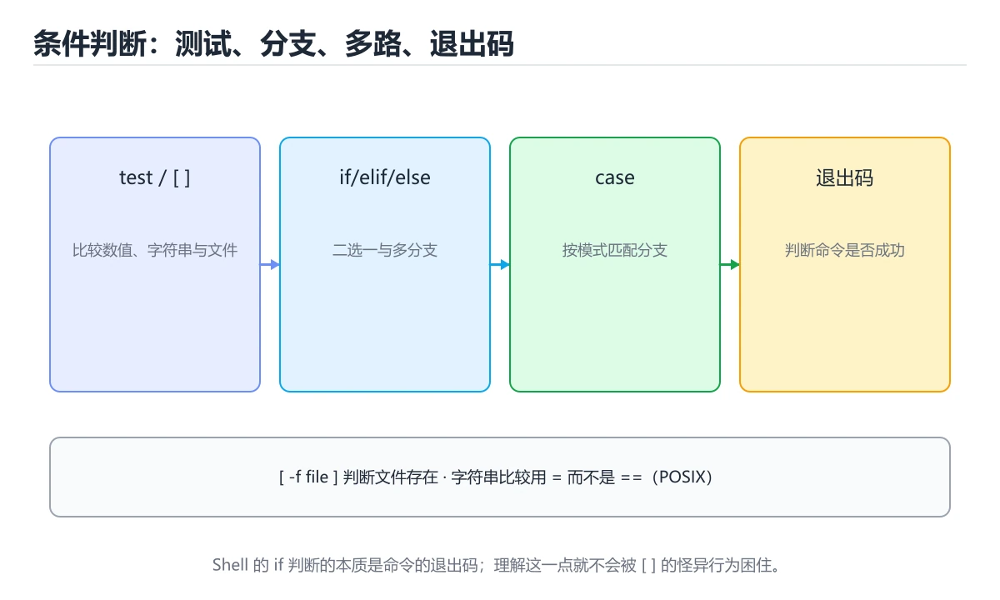
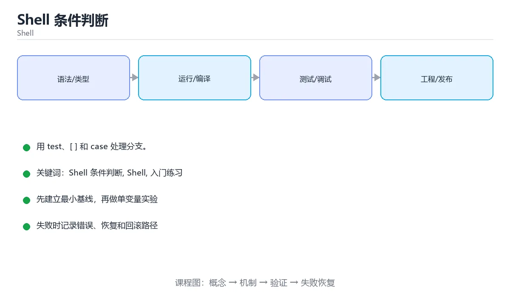

# Shell 条件判断

> 内容更新时间：2026-10-06 · 学习阶段：入门 · 预计用时：30 分钟





## 学习目标

- 先认识Shell 条件判断需要的工具、输入和输出。
- 按步骤运行最小示例，并记录结果与错误。
- 用一个边界输入验证自己是否真正掌握。

## 前置知识

- 会进行基本的文件或命令行操作。
- 不需要预先掌握「Shell」的高级知识。

## 一句话入门

用 test、[ ] 和 case 处理分支。

## 最小示例

```bash
#!/usr/bin/env bash
set -euo pipefail

count=3
if (( count > 2 )); then
  echo "count is large"
fi
```

## 预期输出

```text
count is large
```

## 常见错误与排查

> 说明：本表由《Shell 条件判断》的核心知识整理（2026-10-07），人工复核进度见 docs/content_review_batches.md。

| 易错点 | 容易踩的做法 | 正确结论 |
| --- | --- | --- |
| 条件测试语法混用 | 兼容性与语义差异导致判断错误 | 明确目标解释器并统一测试语法 |
| 变量引用不加引号 | 含空格的值被拆成多个参数 | 变量引用加引号，避免词分割 |
| 字符串与数字比较方式混用 | 判断结果与预期不符 | 按类型选择对应的比较运算符 |

## 动手练习

1. 原样运行最小示例，保存命令和输出。
2. 把数字 2 改成 10，预测并验证新结果。
3. 制造一个错误输入，写出错误信息和修复方法。

## 本课小结

- 入门阶段先保证能运行、能观察、能解释，再追求复杂功能。
- 每次只改一个变量，记录预测与实际结果。
- 遇到错误先看第一条错误信息，再回到最小示例。

## 代码实验：把示例跑成证据

### 实验一：建立基线

```bash
#!/usr/bin/env bash
set -euo pipefail

count=3
if (( count > 2 )); then
  echo "count is large"
fi
```

### 实验二：只改一个输入

沿用「Shell 条件判断」的最小示例做一次单变量实验：

| 实验 | 改动 | 预测 | 实际 | 结论 |
| --- | --- | --- | --- | --- |
| 基线 | 保持「Shell 条件判断」示例原样 |  |  |  |
| 边界 | 把Shell 条件判断换成空值或极值 |  |  |  |
| 失败 | 给Shell传入非法输入 |  |  |  |

做完后用一句话写出「Shell 条件判断」的结论：输入怎么变，结果才怎么变。

### 实验三：制造一个可控错误

把 pipefail 的失败注入到管道中间，检查脚本是否按预期中断。

| 实验 | 改动 | 预测 | 实际 | 结论 |
| --- | --- | --- | --- | --- |
| 基线 | 保持原样 |  |  |  |
| 边界 |  |  |  |  |
| 失败 |  |  |  |  |

### 实验四：用三句话复述

1. Shell 条件判断 的输入是什么，哪些取值合法，哪些属于边界或非法范围？
2. Shell 条件判断 按什么顺序处理输入，在哪一步产生了状态变化或副作用？
3. 输出如何验证，失败时第一条可观察证据是什么？

## Shell 脚本基础机制速览

### Shebang、执行权限与环境

脚本第一行的 shebang 指定解释器，例如 `#!/usr/bin/env bash`。文件需要执行权限才能直接运行，也可以用 `bash script.sh` 显式调用。环境变量通过 `export` 传给子进程，普通变量只在当前 shell 可见。脚本应以明确的 `set -euo pipefail` 开始，再根据兼容性决定是否使用 Bash 扩展语法；如果目标环境只有 POSIX sh，应避免数组、`[[ ]]` 和进程替换。

### 变量、引号与参数

变量赋值等号两边不能有空格，引用时通常要写 `"$var"`，防止空值和空格被拆分。单引号原样保留，双引号允许变量展开，反引号或 `$()` 执行命令替换。脚本参数用 `$1`、`$2` 访问，`$#` 是数量，`$@` 保留参数边界，`$*` 会把它们合并。处理选项时可以使用 `getopts`，并始终为缺失参数提供用法提示和非零退出码。

### 条件、退出码与控制流

每个命令都返回退出码，0 表示成功，非 0 表示失败。`if` 判断的是命令退出状态，`test` 或 `[ ]` 是常用判断工具。`&&` 和 `||` 根据前一个命令的结果决定是否执行下一个，`case` 适合多分支字符串匹配。`set -e` 在命令失败时退出，但在条件表达式、管道和 `!` 取反中行为有例外，不能把它当作完整的错误处理。

### 函数、循环与管道

函数通过 `name() { ...; }` 定义，参数用 `$1` 等访问，返回值仍是退出码，数据结果通常写到标准输出。`for` 遍历列表，`while read` 逐行处理输入，`until` 在条件为假时循环。管道把 stdout 接到下一个命令的 stdin，默认不传递 stderr，也不会自动传递数组或结构化对象；需要保留变量时避免在管道子 shell 中赋值。

### 可移植性与安全

写文件前先创建临时文件，成功后原子重命名；删除前先打印目标，使用 `--` 防止文件名被当作选项。路径和变量要加引号，命令替换要注意分词和通配符展开。脚本要处理信号和清理，使用 `trap` 在退出时删除临时文件。跨平台脚本避免依赖 GNU 专有参数，必要时用 `command -v` 检测工具，并提供清晰的降级路径。

## 复习与自测

本课测验检验 pipefail 的判断依据。请把每个错误选项改写成一句反例，
说明它在哪个输入、边界或前提变化下会失败。

### 完成标准

- [ ] 能解释 Shell 的状态在每一步为什么改变。
- [ ] 能预测 pipefail 在边界输入下的输出，并用运行结果验证。
- [ ] 能触发 pipefail 的失败路径，并根据错误信息定位原因。
- [ ] 能不看书说出 Shell 条件判断 的两个易错点和对应验证方法。

### 复盘记录

| 项目 | 记录 |
| --- | --- |
| 学到的核心机制 |  |
| 仍然不确定的问题 |  |
| 下一步验证动作 |  |
对照 代码实验：把示例跑成证据 复述本课结论，答不上来的部分回到 pipefail 的示例重跑一次。

### 一句话入门

自检：这一节的关键输入与输出分别是什么？

### 最小示例

```bash
#!/usr/bin/env bash
set -euo pipefail

count=3
if (( count > 2 )); then
  echo "count is large"
fi
```

自检：这一节与相邻主题的边界在哪里？

### 预期输出

```text
count is large
```

### 常见错误

自检：把这一节讲给没学过的人，最需要强调哪一点？

### 动手练习

自检：如果去掉这一节里的一个前提，结论会怎样变化？

## 可运行练习

### 任务 1：先跑通，再解释

```bash
#!/usr/bin/env bash
set -euo pipefail

count=3
if (( count > 2 )); then
  echo "count is large"
fi
```

**预期输出**：count is large

### 任务 2：只改一个条件

把「Shell 条件判断」的最小示例复制一份，只改一个条件再跑一次：

- 改动点：把 Shell 换成边界值，其他输入保持原样。
- 预测：先写下「Shell 条件判断」在改动后的输出或错误信息，再运行。
- 记录：对照改动前后的结果，指出差异出在哪一步。
- 验收：换回原条件能复现原结果，改动只影响Shell 条件判断。

### 任务 3：迁移到自己的数据

换一个 Shell 场景重做一次，确认结论不是只对示例数据成立。

## 故障现场

### 现场 1：条件测试语法混用

**症状**：在《Shell 条件判断》的复现场景中，兼容性与语义差异导致判断错误。

**根因**：触发点是把“条件测试语法混用”当成安全做法。它没有满足《Shell 条件判断》要求的前提，因此先表现为“兼容性与语义差异导致判断错误”；排查时先完整复现这一段，再核对输入、配置与依赖。

**修复**：针对《Shell 条件判断》的问题，明确目标解释器并统一测试语法。

**验证**：在《Shell 条件判断》中按“明确目标解释器并统一测试语法”调整后，从“条件测试语法混用”的触发条件重放同一条路径，确认“兼容性与语义差异导致判断错误”不再出现，并补一个相邻边界用例检查没有引入新问题。

### 现场 2：变量引用不加引号

**症状**：在《Shell 条件判断》的复现场景中，含空格的值被拆成多个参数。

**根因**：触发点是把“变量引用不加引号”当成安全做法。它没有满足《Shell 条件判断》要求的前提，因此先表现为“含空格的值被拆成多个参数”；排查时先完整复现这一段，再核对输入、配置与依赖。

**修复**：针对《Shell 条件判断》的问题，变量引用加引号，避免词分割。

**验证**：先在《Shell 条件判断》中记录“变量引用不加引号”留下的失败证据，再执行“变量引用加引号，避免词分割”并重放；确认错误路径变为明确结果，且修复没有掩盖同类故障。

### 现场 3：字符串与数字比较方式混用

**症状**：在《Shell 条件判断》的复现场景中，判断结果与预期不符。

**根因**：触发点是把“字符串与数字比较方式混用”当成安全做法。它没有满足《Shell 条件判断》要求的前提，因此先表现为“判断结果与预期不符”；排查时先完整复现这一段，再核对输入、配置与依赖。

**修复**：针对《Shell 条件判断》的问题，按类型选择对应的比较运算符。

**验证**：先在《Shell 条件判断》中记录“字符串与数字比较方式混用”留下的失败证据，再执行“按类型选择对应的比较运算符”并重放；确认错误路径变为明确结果，且修复没有掩盖同类故障。

## 版本与时效

- 版本提示：Shell 条件判断 的行为在最近几个大版本里有过调整，升级「Shell 条件判断」前先用 pipefail 复现当前输出，再对照官方发布说明逐条核对。
- 升级「Shell 条件判断」涉及的依赖前，先用 pipefail 复现当前行为，再逐项核对版本说明与破坏性变更。

### 升级检查清单

- 先固定当前版本，跑通全部示例与测验，再升级工具链。
- 只改 Shell 条件判断 的版本变量，记录编译、测试与产物体积的变化。
- 先回归 Shell 条件判断 与 Shell 的默认行为和错误信息，再扩大测试范围。
- 升级完成后更新本课「最后复核 / 下次复核」日期，并记录 Shell 条件判断 的版本变化。

## 本课复习清单

离开本课前，逐项确认：

- [ ] 不看解析，能说出「if (( count > 2 )); then 这种写法的特点是？」的判断依据。
- [ ] 不看解析，能说出「数值比较和字符串比较分别应使用哪组运算符？」的判断依据。
- [ ] 不看解析，能说出「case 语句适合处理什么场景？」的判断依据。
- [ ] 不看解析，能说出「脚本中条件表达式返回码 0 代表什么？」的判断依据。
- [ ] 不看解析，能说出「填空：Shell 条件判断术语速查中，表示的判断依据。
- [ ] 跑通「Shell 条件判断」的最小示例，并记录一次失败输入的处理方式。
- [ ] 把本课最容易混淆的两个概念写成一句话对照。

| 复盘项 | 记录 |
| --- | --- |
| 已经能独立解释的考点 |  |
| 仍然说不清的概念 |  |
| 下一步验证动作 |  |

## 术语速查

把「Shell 条件判断」里反复出现的术语集中放在一起。复习时先遮住右列，尝试用自己的话解释，再回到正文核对。

| 术语 | 一句话说明 |
| --- | --- |
| `if 与退出码` | if 判断的是命令退出码，0 为真、非 0 为假。 |
| `文件测试` | -f 判断普通文件，-d 判断目录，-x 判断可执行权限。 |
| `elif 与 else` | 多分支按顺序判断，命中一个就跳过其余分支。 |
| `Shell` | 接收命令并调用操作系统程序的命令行解释器与脚本环境。 |
| `管道` | 管道把 stdout 接到下一个命令的 stdin，默认不传递 stderr，也不会自动传递数组或结构化对象 |

## 考点精讲

### 考点 1：多选辨析·Shell 条件判断

- **题目**：围绕“Shell 条件判断”中的 Shell 条件判断、Shell、入门练习，下列哪两项是本课强调的实践判断？
- **判断依据**：题干的正确项是验证 Shell 时要固定版本并覆盖边界输入，结论才可复现。学习 Shell 条件判断 时要同时说明输入、输出和失败路径，不能只看正常流程。把“验证 Shell 时要固定版本并覆盖边界”代回「Shell 条件判断」里“围绕Shell 条件判断中的 Shell 条件判断、Shel”的例子核对，条件一旦改变，结论就要用Shell 条件判断、Shell、入门练习重新推导。

### 考点 2：概念判断·Shell 条件判断

- **题目**：数值比较和字符串比较分别应使用哪组运算符？
- **判断依据**：在「Shell 条件判断」里，数值用 -eq、-gt 等，字符串用 = 与 !=。test 的 -eq、-ne、-gt 等运算符按整数比较，= 与。把“数值用 -eq、-gt 等”代回「Shell 条件判断」里“数值比较和字符串比较分别应使用哪组运算符”的例子核对，条件一旦改变，结论就要用Shell 条件判断、Shell、入门练习重新推导。

### 考点 3：代码补全·Shell 条件判断

- **题目**：阅读「Shell 条件判断」中的这段 Shell 代码，下面哪项判断最准确？
- **判断依据**：在「Shell 条件判断」里，题干的正确项是用 test、[ ] 和 case 处理分支。「Shell 条件判断」要求先交代Shell 条件判断、Shell、入门练习的前提再下结论，所以“用 test”只在题干“阅读Shell 条件判断中的这段 Shell 代码”给定的条件下成立。

### 考点 4：概念判断·Shell 条件判断

- **题目**：脚本中条件表达式返回码 0 代表什么？
- **判断依据**：在「Shell 条件判断」里，结论应落在「表示条件为真，判断成功」。Shell 用退出码表示命令结果，0 表示成功、非 0 表示失败。脚本中条件表达式返回码 0 代表什么。在「Shell 条件判断」里，这道题要求区分概念与边界，「表示条件为真，判断成功」只有在题干给出的前提下才成立，而「表示条件为假，判断失败」、「表示发生了未捕获的错误」缺少同一组条件。

### 考点 5：填空·____

- **题目**：填空：在「Shell 条件判断」的术语速查里，「脚本第一行的 shebang 指定解释器，例如 `____`。文件需要执行权限才能直接运行，也可以用 `bash script.sh` 显式调用。环境变量通过 `export` 传给子进程，普通变量只在当前 s」描述的是哪个术语？
- **判断依据**：空格应填写「#!/usr/bin/env bash」。/usr/bin/env bash代入边界条件核对，结论才能复现。这道题的关键在「Shell 条件判断」的Shell 条件判断、Shell、入门练习：先确认题干“填空”问的是哪一步，再排除偷换前提的选项。

## English Overview

**Title:** Shell Conditionals

**Summary:** Use test, brackets and case.

**Category:** Shell
**Level:** 入门
**Key terms:** Shell 条件判断, Shell, 入门练习

## 内容元数据

- 内容版本：v2.0
- 最后更新：2026-10-06
- 学习阶段：入门
- 适用环境：Bash 5 / POSIX Shell
；本课聚焦 Shell 条件判断。
- 内容来源：内置结构化课程与工程实践整理
- 相关主题：Shell 条件判断、Shell、入门练习
- 质量版本：P0 测验标准 + P1 覆盖扩展 + P2 体验补全

## 参考资料与复核

- 最后复核：2026-10-04
- 下次复核：2027-02-10
- 复核范围：版本兼容、API 行为、安全建议与工程实践
- 来源性质：官方文档、标准或权威教材；正文为离线教学重组

| 参考资料 | 本课用途 |
| --- | --- |
| [GNU Coreutils](https://www.gnu.org/software/coreutils/manual/) | 文件、文本与进程工具 |
| [GNU awk](https://www.gnu.org/software/gawk/manual/) | 字段处理与报表 |
| [cron 手册](https://man7.org/linux/man-pages/man5/crontab.5.html) | 定时任务与调度 |

> 「Shell 条件判断」的链接用于离线阅读后的延伸核对；App 不会自动联网。

## 复习与迁移

复习目标：把「Shell 条件判断」的判断标准放回可复现的例子里。先自己作答，再对照依据；如果结论正确但理由不完整，回到正文补足前提。

### 概念复述

- 用一句话说明「Shell 条件判断」解决什么问题：用 test、[ ] 和 case 处理分支。
- 写出Shell 条件判断、Shell、入门练习之间的关系，并各举一个例子。
- 说出本课最容易混淆的两个概念，以及区分它们的判据。

### 测验回顾

1. 围绕“Shell 条件判断”中的 Shell 条件判断、Shell、入门练习，下列哪两项是本课强调的实践判断？
   - 依据：题干的正确项是验证 Shell 时要固定版本并覆盖边界输入，结论才可复现。学习 Shell 条件判断 时要同时说明输入、输出和失败路径，不能只看正常流程。把“验证 Shell 时要固定版本并覆盖边界”代回「Shell 条件判断」里“围绕Shell 条件判断中的 Shell 条件判断、Shel”的例子核对，条件一旦改变，结论就要用Shell 条件判断、Shell、入门练习重新推导。
2. 数值比较和字符串比较分别应使用哪组运算符？
   - 依据：在「Shell 条件判断」里，数值用 -eq、-gt 等，字符串用 = 与 !=。test 的 -eq、-ne、-gt 等运算符按整数比较，= 与。把“数值用 -eq、-gt 等”代回「Shell 条件判断」里“数值比较和字符串比较分别应使用哪组运算符”的例子核对，条件一旦改变，结论就要用Shell 条件判断、Shell、入门练习重新推导。
3. 阅读「Shell 条件判断」中的这段 Shell 代码，下面哪项判断最准确？
   - 依据：在「Shell 条件判断」里，题干的正确项是用 test、[ ] 和 case 处理分支。「Shell 条件判断」要求先交代Shell 条件判断、Shell、入门练习的前提再下结论，所以“用 test”只在题干“阅读Shell 条件判断中的这段 Shell 代码”给定的条件下成立。
4. 脚本中条件表达式返回码 0 代表什么？
   - 依据：在「Shell 条件判断」里，结论应落在「表示条件为真，判断成功」。Shell 用退出码表示命令结果，0 表示成功、非 0 表示失败。脚本中条件表达式返回码 0 代表什么。在「Shell 条件判断」里，这道题要求区分概念与边界，「表示条件为真，判断成功」只有在题干给出的前提下才成立，而「表示条件为假，判断失败」、「表示发生了未捕获的错误」缺少同一组条件。
5. 填空：在「Shell 条件判断」的术语速查里，「脚本第一行的 shebang 指定解释器，例如 `____`。文件需要执行权限才能直接运行，也可以用 `bash script.sh` 显式调用。环境变量通过 `export` 传给子进程，普通变量只在当前 s」描述的是哪个术语？
   - 依据：空格应填写「#!/usr/bin/env bash」。/usr/bin/env bash代入边界条件核对，结论才能复现。这道题的关键在「Shell 条件判断」的Shell 条件判断、Shell、入门练习：先确认题干“填空”问的是哪一步，再排除偷换前提的选项。

### 迁移练习

把「Shell 条件判断」的结论迁移到相邻主题，每次迁移都写清预测与证据：

1. 换输入：用Shell 条件判断处理一组你自己的数据，对比教材示例的结果差异。
2. 换失败条件：制造一个Shell相关的错误，说明如何从错误信息定位根因。
3. 换规模：把数据量或并发度提高一个数量级，说明「Shell 条件判断」的结论是否仍成立。

<!-- language-intro-deep-dive:start -->

## 零基础通俗讲：Shell 条件判断

### 一句话说清它是什么

Shell 用 if 加 test 命令判断条件，方括号就是 test 的另一种写法；比较字符串和比较数字用的运算符不一样。

### 用生活比喻理解

方括号像门口的门禁读卡器：你把条件塞进去，它只回你「过」或「不过」。方括号两边必须有空格，否则读卡器根本读不到你的卡。

### 完整可运行代码

```bash
#!/usr/bin/env bash
set -euo pipefail

score="${1:-0}"

if [ "$score" -ge 90 ]; then
  echo "优秀"
elif [ "$score" -ge 60 ]; then
  echo "及格"
else
  echo "需要补考"
fi
```

### 逐行拆开看

- `score="${1:-0}"` 取第一个参数，没有传参时用 0 作为默认值。
- `if [ "$score" -ge 90 ]; then` 中 `-ge` 表示大于等于，专门用于数字比较。
- 方括号和里面的内容之间必须有空格，方括号实际上是一个命令。
- `elif` 只在前面的条件不成立时才检查。
- `else` 兜住所有剩余情况，`fi` 表示 if 结构结束。
- 字符串比较要用等号和不等号，判断空值用 `-z`，判断文件用 `-f`、`-d`。


### 把程序跑一遍

- 执行 `./score.sh 95`：95 大于等于 90，输出「优秀」。
- 执行 `./score.sh 72`：第一个条件不成立，第二个成立，输出「及格」。
- 执行 `./score.sh 40`：两个条件都不成立，输出「需要补考」。
- 不带参数时 score 取默认值 0，同样走 else 分支。


### 新手最容易踩的坑

- 方括号内不加空格：如果方括号紧贴变量，整段会被当成一个命令名，报 command not found。
- 数字比较用字符串运算符：在方括号里用大于号是重定向，会导致意外建文件。
- 变量不加引号：为空时方括号收到的参数个数不对，报 unary operator expected。
- 在方括号里用逻辑与运算符：POSIX 的 test 不支持，应该写成两个方括号或改用双方括号。
- 忘记 fi：if 结构没有结束标记，解释器会一直读到文件末尾并报错。


### 动手练一练

- 分别用 95、72、40 和不传参数运行脚本，核对四种结果。
- 把 `-ge` 换成 `-gt`，用 90 测试边界差异。
- 故意去掉方括号里的空格，记录报错信息。


### 本课速查卡

把下面八行抄进自己的笔记，复习时只看这一页就能回忆整课：

| 复习项 | 本课要点 |
| --- | --- |
| 核心结论 | Shell 用 if 加 test 命令判断条件，方括号就是 test 的另一种写法；比较字符串和比较数字用的运算符不一样。 |
| 最少要写的代码 | `set -euo pipefail` |
| 正确做法 | 执行 `./score.sh 95`：95 大于等于 90，输出「优秀」。 |
| 最常见的错误 | 方括号内不加空格：如果方括号紧贴变量，整段会被当成一个命令名，报 command not found。 |
| 出错先查什么 | 先读第一条报错信息，再回到最小示例只改一个地方 |
| 怎么确认学会了 | 分别用 95、72、40 和不传参数运行脚本，核对四种结果。 |
| 和别的知识点的关系 | 本课打下的语法与思维方式会被后面每一课反复用到 |
| 接下来做什么 | 合上教程，凭记忆把上面的最小代码重写一遍再运行 |
