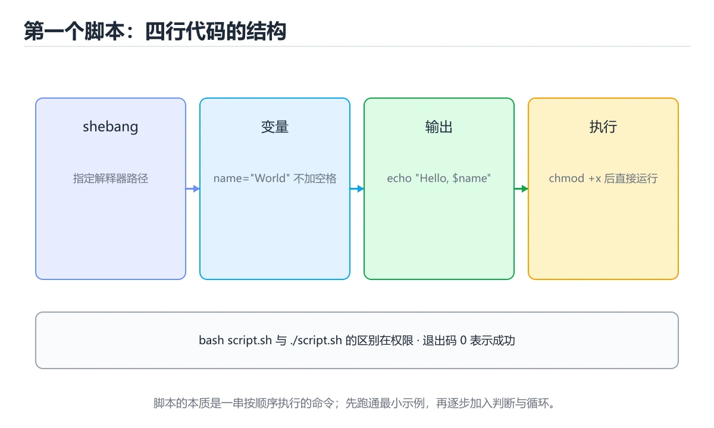
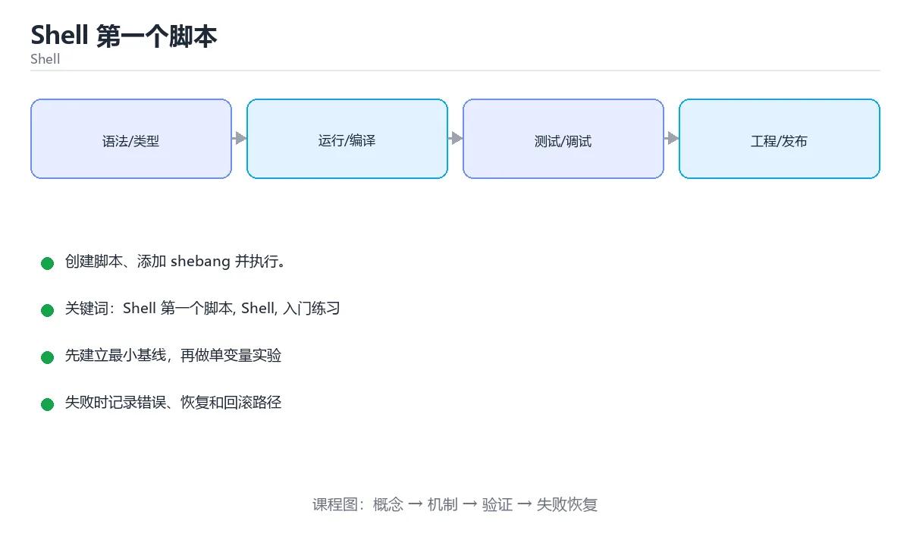

# Shell 第一个脚本





> 内容更新时间：2026-10-03 · 学习阶段：入门 · 预计用时：15 分钟

## 学习目标

- 先认识「Shell 第一个脚本」需要的工具、输入和输出。
- 按步骤运行最小示例，并记录结果与错误。
- 用一个边界输入验证自己是否真正掌握。

## 前置知识

- 会进行基本的文件或命令行操作。
- 不需要预先掌握「Shell」的高级知识。

## 一句话入门

创建脚本、添加 shebang 并执行。

## 最小示例

```bash
#!/usr/bin/env bash
set -euo pipefail

echo "hello from bash"
```

## 预期输出

```text
hello from bash
```

## 常见错误

- 变量没有加引号，路径包含空格时命令参数被拆分。
- 复制命令时遗漏空格、引号或必要参数。

## 动手练习

1. 原样运行最小示例，保存命令和输出。
2. 把数字 2 改成 10，预测并验证新结果。
3. 制造一个错误输入，写出错误信息和修复方法。

## 本课小结

- 入门阶段先保证能运行、能观察、能解释，再追求复杂功能。
- 每次只改一个变量，记录预测与实际结果。
- 遇到错误先看第一条错误信息，再回到最小示例。


## 代码实验：把示例跑成证据

这一节不引入新语法，而是把「Shell 第一个脚本」的最小示例变成可以复现、可以对照的实验。每次只改变一个条件，先写预测，再运行，最后解释差异。

### 实验一：建立基线

```bash
#!/usr/bin/env bash
set -euo pipefail

echo "hello from bash"
```

先原样运行上面的代码，记录命令、完整输出和退出状态。然后把输出与正文的预期输出逐字对照，不要用“看起来差不多”代替核对；空格、大小写、换行和错误流向都可能暴露环境差异。

### 实验二：只改一个输入

从代码中选一个会影响结果的字面量、参数或输入，把它替换成边界值：数值可尝试 0、1、最大值和最小值，字符串可尝试空串和超长文本，集合可尝试空集合、单元素和重复元素。先写出预测，再运行并记录实际结果。

### 实验三：制造一个可控错误

去掉变量展开外的引号，或者让管道中的前一段命令失败。记录退出码、标准错误和最终输出，确认错误是否被掩盖。

| 实验 | 改动 | 预测 | 实际 | 结论 |
| --- | --- | --- | --- | --- |
| 基线 | 保持原样 |  |  |  |
| 边界 |  |  |  |  |
| 失败 |  |  |  |  |

### 实验四：用三句话复述

1. 输入是什么，哪些输入属于合法范围，哪些属于边界或非法范围？
2. 程序按什么顺序处理输入，在哪一步产生了状态变化或副作用？
3. 输出如何验证，失败时第一条可观察证据是什么？

## Shell 脚本基础机制速览

### Shebang、执行权限与环境

脚本第一行的 shebang 指定解释器，例如 `#!/usr/bin/env bash`。文件需要执行权限才能直接运行，也可以用 `bash script.sh` 显式调用。环境变量通过 `export` 传给子进程，普通变量只在当前 shell 可见。脚本应以明确的 `set -euo pipefail` 开始，再根据兼容性决定是否使用 Bash 扩展语法；如果目标环境只有 POSIX sh，应避免数组、`[[ ]]` 和进程替换。

### 变量、引号与参数

变量赋值等号两边不能有空格，引用时通常要写 `"$var"`，防止空值和空格被拆分。单引号原样保留，双引号允许变量展开，反引号或 `$()` 执行命令替换。脚本参数用 `$1`、`$2` 访问，`$#` 是数量，`$@` 保留参数边界，`$*` 会把它们合并。处理选项时可以使用 `getopts`，并始终为缺失参数提供用法提示和非零退出码。

### 条件、退出码与控制流

每个命令都返回退出码，0 表示成功，非 0 表示失败。`if` 判断的是命令退出状态，`test` 或 `[ ]` 是常用判断工具。`&&` 和 `||` 根据前一个命令的结果决定是否执行下一个，`case` 适合多分支字符串匹配。`set -e` 在命令失败时退出，但在条件表达式、管道和 `!` 取反中行为有例外，不能把它当作完整的错误处理。

### 函数、循环与管道

函数通过 `name() { ...; }` 定义，参数用 `$1` 等访问，返回值仍是退出码，数据结果通常写到标准输出。`for` 遍历列表，`while read` 逐行处理输入，`until` 在条件为假时循环。管道把 stdout 接到下一个命令的 stdin，默认不传递 stderr，也不会自动传递数组或结构化对象；需要保留变量时避免在管道子 shell 中赋值。

### 可移植性与安全

写文件前先创建临时文件，成功后原子重命名；删除前先打印目标，使用 `--` 防止文件名被当作选项。路径和变量要加引号，命令替换要注意分词和通配符展开。脚本要处理信号和清理，使用 `trap` 在退出时删除临时文件。跨平台脚本避免依赖 GNU 专有参数，必要时用 `command -v` 检测工具，并提供清晰的降级路径。

## 本课自测清单与错误对照

下面把「Shell 第一个脚本」最容易混淆的选项集中起来。不要只记正确答案，要能说明错误选项在什么条件下看似合理、又为什么不能满足题干。

本课测验以直接定义和步骤判断为主。请把每个错误选项改写成一句反例，
说明它在哪个输入、边界或前提变化下会失败。

### 完成标准

- [ ] 能用具体输入复现最小示例，并逐行解释输入、处理与输出。
- [ ] 能只改一个值完成边界实验，并让预测与实际结果一致。
- [ ] 能制造一个可控错误，读出第一条错误信息并完成修复。
- [ ] 能不看书说出本课至少两个易错点和对应的验证方法。

### 复盘记录

| 项目 | 记录 |
| --- | --- |
| 学到的核心机制 |  |
| 仍然不确定的问题 |  |
| 下一步验证动作 |  |


## 考点精讲：把测验题还原成判断过程

本课有 5 个判断点。先自己作答，再看「判断依据」；如果结论正确但理由不完整，回到正文对应章节补足概念。

### 考点 1：脚本第一行的 #!/usr/bin/env bash 称为 shebang，它的作用是？

- **正确判断**：指定用哪个解释器执行脚本，便于直接运行
- **判断依据**：正确答案是「指定用哪个解释器执行脚本，便于直接运行」，这道题在问脚本第一行的#!/usr/bin/envbash称为shebang，它的作用是，判断时要把题干限定的输入、边界与目标逐项对齐。shebang 以 #! 开头，内核在执行脚本时会读取它并调用指定的解释器。
- **迁移检查**：如果给某个错误选项去掉一个限定词，它会不会变成正确？说明理由。

### 考点 2：set -euo pipefail 这四个选项的组合效果是？

- **正确判断**：命令失败即退出，未定义变量报错，管道失败也能捕获
- **判断依据**：正确答案是「命令失败即退出，未定义变量报错，管道失败也能捕获」，这道题在问set-euopipefail这四个选项的组合效果是，判断时要把题干限定的输入、边界与目标逐项对齐。e 让命令返回非零时立即退出，u 让引用未定义变量时报错，o pipefail 让管道中任一环节失败都反映为整体失败，这些设置能避免错误被忽略后继续执行造成更大破坏。
- **迁移检查**：如果给某个错误选项去掉一个限定词，它会不会变成正确？说明理由。

### 考点 3：写好脚本后要让 ./deploy.sh 直接运行，通常需要？

- **正确判断**：用 chmod +x 添加可执行权限，再按路径执行
- **判断依据**：正确答案是「用 chmod +x 添加可执行权限，再按路径执行」，这道题在问写好脚本后要让./deploy.sh直接运行，通常需要，判断时要把题干限定的输入、边界与目标逐项对齐。直接按路径执行要求文件具有可执行权限，chmod +x 完成这一步后 shebang 才会被使用。
- **迁移检查**：把题干里的一个条件换成边界值，原来的结论还成立吗？写出判断过程。

### 考点 4：echo "hello from bash" 会输出什么？

- **正确判断**：一行文本 hello from bash，并在末尾换行
- **判断依据**：正确答案是「一行文本 hello from bash，并在末尾换行」，这道题在问echo"hellofrombash"会输出什么，判断时要把题干限定的输入、边界与目标逐项对齐。echo 把参数写到标准输出并追加换行，是脚本中最常用的输出与调试手段。
- **迁移检查**：把题干里的一个条件换成边界值，原来的结论还成立吗？写出判断过程。

### 考点 5：填空：「Shell 第一个脚本」术语速查中，表示「脚本第一行的 shebang 指定解释器，例如 `____`。文件需要执行权限才能直接运行，也可以用 `bash script.sh` 显式调用。环境变量通过 `export` 传给子进程，普通变量只在当前 s…」的术语是什么？

- **正确判断**：#!/usr/bin/env bash
- **判断依据**：正确答案是「#!/usr/bin/env bash」，这道题在问填空：Shell第一个脚本术语速查中，表示脚本第一行…子进程，普通变量只在当前s…的术语是什么，判断时要把题干限定的输入、边界与目标逐项对齐。本课示例中还能看到 `#!/usr/bin/env bash` 这样的用法，说明该关键字在本课代码中承担实际功能。
- **迁移检查**：把答案换成另一种等价写法，是否仍然正确？说明依据。

### 补充考点 1：阅读「Shell 第一个脚本」的代码片段，下面哪项判断是正确的？

- **正确判断**：指定用哪个解释器执行脚本，便于直接运行
- **判断依据**：正确答案是「指定用哪个解释器执行脚本，便于直接运行」。这段代码来自「Shell 第一个脚本」的示例，判断时先看输入与输出，再检查条件、循环和边界。正确答案是「指定用哪个解释器执行脚本，便于直接运行」，这道题在问脚本第一行的#!/usr/bin/envbash称为shebang，它的作用是，判断时要把题干限定的输入、边界与目标逐项对齐。sheba…在「Shell 第一个脚本」中，如果只改一个条件，输出通常会随之改变，因此不能脱离代码前提作答。

## 本课复习清单

离开本课前，逐项确认：

- [ ] 不看解析，能说出「脚本第一行的 #!/usr/bin/env bash 称为 shebang，它的…」的判断依据。
- [ ] 不看解析，能说出「set -euo pipefail 这四个选项的组合效果是？」的判断依据。
- [ ] 不看解析，能说出「写好脚本后要让 ./deploy.sh 直接运行，通常需要？」的判断依据。
- [ ] 不看解析，能说出「echo "hello from bash" 会输出什么？」的判断依据。
- [ ] 不看解析，能说出「填空：「Shell 第一个脚本」术语速查中，表示「脚本第一行的 shebang …」的判断依据。
- [ ] 至少运行一次本课示例，记录输入、输出和一个边界情况。
- [ ] 把本课最容易混淆的两个概念写成一句话对照。

| 复盘项 | 记录 |
| --- | --- |
| 已经能独立解释的考点 |  |
| 仍然说不清的概念 |  |
| 下一步验证动作 |  |

## 逐节复习与自检

下面按正文顺序回顾每一节，并给出一个自检问题；说不清的地方回到原章节补课。

### 最小示例

```bash
#!/usr/bin/env bash
set -euo pipefail

echo "hello from bash"
```

自检：这一节与相邻主题的边界在哪里？

### 预期输出

```text
hello from bash
```

自检：这一节与相邻主题的边界在哪里？

### 常见错误

变量没有加引号，路径包含空格时命令参数被拆分。

自检：把这一节讲给没学过的人，最需要强调哪一点？

### 动手练习

把数字 2 改成 10，预测并验证新结果。制造一个错误输入，写出错误信息和修复方法。

自检：如果去掉这一节里的一个前提，结论会怎样变化？

## 术语速查

把本课反复出现的术语集中放在一起。复习时先遮住右列，尝试用自己的话解释，再回到正文核对。

| 术语 | 本课语境 |
| --- | --- |
| `#!/usr/bin/env bash` | 脚本第一行的 shebang 指定解释器，例如 `#!/usr/bin/env bash`。文件需要执行权限才能直接运行，也可以用 `bash script.sh` 显式调用。环境变量通过 `export` 传给子进程，… |
| `bash script.sh` | 脚本第一行的 shebang 指定解释器，例如 `#!/usr/bin/env bash`。文件需要执行权限才能直接运行，也可以用 `bash script.sh` 显式调用。环境变量通过 `export` 传给子进程，… |
| `export` | 脚本第一行的 shebang 指定解释器，例如 `#!/usr/bin/env bash`。文件需要执行权限才能直接运行，也可以用 `bash script.sh` 显式调用。环境变量通过 `export` 传给子进程，… |
| `set -euo pipefail` | 脚本第一行的 shebang 指定解释器，例如 `#!/usr/bin/env bash`。文件需要执行权限才能直接运行，也可以用 `bash script.sh` 显式调用。环境变量通过 `export` 传给子进程，… |
| `[[ ]]` | 脚本第一行的 shebang 指定解释器，例如 `#!/usr/bin/env bash`。文件需要执行权限才能直接运行，也可以用 `bash script.sh` 显式调用。环境变量通过 `export` 传给子进程，… |
| `"$var"` | 变量赋值等号两边不能有空格，引用时通常要写 `"$var"`，防止空值和空格被拆分。单引号原样保留，双引号允许变量展开，反引号或 `$()` 执行命令替换。脚本参数用 `$1`、`$2` 访问，`$#` 是数量，`$@`… |
| `$()` | 变量赋值等号两边不能有空格，引用时通常要写 `"$var"`，防止空值和空格被拆分。单引号原样保留，双引号允许变量展开，反引号或 `$()` 执行命令替换。脚本参数用 `$1`、`$2` 访问，`$#` 是数量，`$@`… |
| `$1` | 变量赋值等号两边不能有空格，引用时通常要写 `"$var"`，防止空值和空格被拆分。单引号原样保留，双引号允许变量展开，反引号或 `$()` 执行命令替换。脚本参数用 `$1`、`$2` 访问，`$#` 是数量，`$@`… |
| `$2` | 变量赋值等号两边不能有空格，引用时通常要写 `"$var"`，防止空值和空格被拆分。单引号原样保留，双引号允许变量展开，反引号或 `$()` 执行命令替换。脚本参数用 `$1`、`$2` 访问，`$#` 是数量，`$@`… |
| `$#` | 变量赋值等号两边不能有空格，引用时通常要写 `"$var"`，防止空值和空格被拆分。单引号原样保留，双引号允许变量展开，反引号或 `$()` 执行命令替换。脚本参数用 `$1`、`$2` 访问，`$#` 是数量，`$@`… |
| `$@` | 变量赋值等号两边不能有空格，引用时通常要写 `"$var"`，防止空值和空格被拆分。单引号原样保留，双引号允许变量展开，反引号或 `$()` 执行命令替换。脚本参数用 `$1`、`$2` 访问，`$#` 是数量，`$@`… |
| `$*` | 变量赋值等号两边不能有空格，引用时通常要写 `"$var"`，防止空值和空格被拆分。单引号原样保留，双引号允许变量展开，反引号或 `$()` 执行命令替换。脚本参数用 `$1`、`$2` 访问，`$#` 是数量，`$@`… |

## 面试问答与自测

下面把本课考点换成面试追问。先口述自己的答案，
再对照参考回答检查是否遗漏了前提、边界或失败路径。

### 追问 1：脚本第一行的 #!/usr/bin/env bash 称为 shebang，它的作用是？

**参考回答**：正确答案是「指定用哪个解释器执行脚本，便于直接运行」，这道题在问脚本第一行的#!/usr/bin/envbash称为shebang，它的作用是，判断时要把题干限定的输入、边界与目标逐项对齐。shebang 以 #! 开头，内核在执行脚本时会读取它并调用指定的解释器。

### 追问 2：set -euo pipefail 这四个选项的组合效果是？

**参考回答**：正确答案是「命令失败即退出，未定义变量报错，管道失败也能捕获」，这道题在问set-euopipefail这四个选项的组合效果是，判断时要把题干限定的输入、边界与目标逐项对齐。e 让命令返回非零时立即退出，u 让引用未定义变量时报错，o pipefail 让管道中任一环节失败都反映为整体失败，这些设置能避免错误被忽略后继续执行造成更大破坏。

### 追问 3：写好脚本后要让 ./deploy.sh 直接运行，通常需要？

**参考回答**：正确答案是「用 chmod +x 添加可执行权限，再按路径执行」，这道题在问写好脚本后要让./deploy.sh直接运行，通常需要，判断时要把题干限定的输入、边界与目标逐项对齐。直接按路径执行要求文件具有可执行权限，chmod +x 完成这一步后 shebang 才会被使用。

### 追问 4：echo "hello from bash" 会输出什么？

**参考回答**：正确答案是「一行文本 hello from bash，并在末尾换行」，这道题在问echo"hellofrombash"会输出什么，判断时要把题干限定的输入、边界与目标逐项对齐。echo 把参数写到标准输出并追加换行，是脚本中最常用的输出与调试手段。

### 追问 5：填空：「Shell 第一个脚本」术语速查中，表示「脚本第一行的 shebang 指定解释器，例如 `____`。文件需要执行权限才能直接运行，也可以用 `bash script.sh` 显式调用。环境变量通过 `export` 传给子进程，普通变量只在当前 s…」的术语是什么？

**参考回答**：正确答案是「#!/usr/bin/env bash」，这道题在问填空：Shell第一个脚本术语速查中，表示脚本第一行…子进程，普通变量只在当前s…的术语是什么，判断时要把题干限定的输入、边界与目标逐项对齐。本课示例中还能看到 `#!/usr/bin/env bash` 这样的用法，说明该关键字在本课代码中承担实际功能。

## English Overview

**Title:** First Shell Script

**Summary:** Create, run and debug a shell script.

**Category:** Shell  
**Level:** 入门  
**Key terms:** Shell 第一个脚本, Shell, 入门练习

> The full tutorial is written in Chinese. This bilingual overview helps English readers identify the topic, scope and key terms before studying the detailed examples.

## 内容元数据

- 内容版本：v2.0
- 最后更新：2026-10-03
- 学习阶段：入门
- 适用环境：Bash 5 / POSIX Shell
- 内容来源：内置结构化课程与工程实践整理
- 相关主题：Shell 第一个脚本、Shell、入门练习
- 质量版本：P0 测验标准 + P1 覆盖扩展 + P2 体验补全


## 参考资料与复核

- 最后复核：2026-10-04
- 下次复核：2027-04-04
- 复核范围：版本兼容、API 行为、安全建议与工程实践
- 来源性质：官方文档与标准；本课正文为离线教学重组，不复制原文

| 参考资料 | 本课用途 |
| --- | --- |
| [GNU Bash Manual](https://www.gnu.org/software/bash/manual/) | Bash 语法与行为 |
| [POSIX Shell](https://pubs.opengroup.org/onlinepubs/9799919799/) | 可移植 Shell 标准 |

> 本课主题：创建脚本、添加 shebang 并执行。

> App 完全离线展示文字链接，不会自动联网；需要延伸阅读时可复制链接到浏览器。

<!-- code-practice:v1:start -->

## 代码练习（6 题）

下面题目与课程测验同源：覆盖代码输出、排错与场景判断。建议先自己写出答案，再到「测验」里核对成绩。

### 练习 1 · 代码输出

在 Shell 课程“Shell 第一个脚本”的变量实验里，这段代码运行后输出什么？

```bash
x=7
echo "$x"
```

- A. 7
- B. 8
- C. 14
- D. 6

**参考答案**：A. 7
**参考输出**：`7`

**解析**

在 Shell 课程“Shell 第一个脚本”的变量代码实验里，程序先完成赋值、循环或函数调用，再把结果写到标准输出，因此正确结果是 7。
判断 Shell 课程“Shell 第一个脚本”的代码输出时，要把“源码写了什么”和“运行时实际打印什么”分开；变量值和循环边界都会直接改变最终结果。
把 7 当作基线后，可以只改一个输入或一个边界，再观察 Shell 课程“Shell 第一个脚本”的输出如何变化，这就是验证掌握程度的方法。

### 练习 2 · 代码输出

在 Shell 课程“Shell 第一个脚本”的循环实验里，这段代码运行后输出什么？

```bash
total=0
for i in $(seq 1 4); do
  total=$((total + i))
done
echo "$total"
```

- A. 11
- B. 10
- C. 9
- D. 20

**参考答案**：B. 10
**参考输出**：`10`

**解析**

在 Shell 课程“Shell 第一个脚本”的循环代码实验里，程序先完成赋值、循环或函数调用，再把结果写到标准输出，因此正确结果是 10。
判断 Shell 课程“Shell 第一个脚本”的代码输出时，要把“源码写了什么”和“运行时实际打印什么”分开；变量值和循环边界都会直接改变最终结果。
把 10 当作基线后，可以只改一个输入或一个边界，再观察 Shell 课程“Shell 第一个脚本”的输出如何变化，这就是验证掌握程度的方法。

### 练习 3 · 代码输出

在 Shell 课程“Shell 第一个脚本”的函数实验里，这段代码运行后输出什么？

```bash
double() {
  echo $(($1 * 2))
}

double 4
```

- A. 7
- B. 9
- C. 16
- D. 8

**参考答案**：D. 8
**参考输出**：`8`

**解析**

在 Shell 课程“Shell 第一个脚本”的函数代码实验里，程序先完成赋值、循环或函数调用，再把结果写到标准输出，因此正确结果是 8。
判断 Shell 课程“Shell 第一个脚本”的代码输出时，要把“源码写了什么”和“运行时实际打印什么”分开；变量值和循环边界都会直接改变最终结果。
把 8 当作基线后，可以只改一个输入或一个边界，再观察 Shell 课程“Shell 第一个脚本”的输出如何变化，这就是验证掌握程度的方法。

### 练习 4 · 代码排错

Shell 课程“Shell 第一个脚本”的下面这段代码无法运行，最可能的修复是什么？

```bash
if [ 7 -gt 0 ]; then
  echo "positive"
```

- A. 把变量名改成另一个单词即可
- B. 重新安装运行时并清空所有缓存
- C. 把输出语句整段删除，代码就会自动修复
- D. 在 if 块末尾补上 fi

**参考答案**：D. 在 if 块末尾补上 fi

**解析**

Shell 课程“Shell 第一个脚本”里的这段代码无法通过编译或解析，关键原因是缺少了必要语法结构，正确修复是在 if 块末尾补上 fi。
在 Shell 课程“Shell 第一个脚本”中，错误信息通常会指出出错行和期望符号；先读第一条错误，再检查这一行的括号、冒号、分号或花括号。
修复后还要重新运行 Shell 课程“Shell 第一个脚本”的最小示例，确认输出恢复，并记录这次问题属于语法错误而不是逻辑错误。

### 练习 5 · 代码排错

Shell 课程“Shell 第一个脚本”的这段代码结果偏小，应该怎样修改？

```bash
total=0
for i in $(seq 1 $((4 - 1))); do
  total=$((total + i))
done
echo "$total"
```

- A. 把累加操作改成减法操作
- B. 把输出语句移到循环体内部
- C. 把 seq 的上界改成 1..4
- D. 把循环变量从 1 改成 0，其余保持不变

**参考答案**：C. 把 seq 的上界改成 1..4
**修复后输出**：`10`

**解析**

Shell 课程“Shell 第一个脚本”里的循环边界少算了最后一项，当前输出是 6，而完整求和应为 10。
正确修复是把 seq 的上界改成 1..4；这类错误属于边界问题，代码能运行但结果偏离，所以比语法错误更隐蔽。
验证 Shell 课程“Shell 第一个脚本”时至少选择首项、中间值和末尾值三个输入，比较手算结果与程序输出，才能发现类似偏差。

### 练习 6 · 概念判断

在 Shell 课程“Shell 第一个脚本”的学习或项目场景中，哪种做法最有助于得到可验证、可迁移的结果？

- A. 跳过错误信息，直接复制另一段代码直到能运行
- B. 一次改完所有变量和依赖，再统一观察是否报错
- C. 先围绕「Shell 第一个脚本」写最小可运行示例，再用边界输入验证“Shell 第一个脚本”的结果
- D. 只背下「Shell 第一个脚本」的结论，遇到新输入时凭感觉修改代码

**参考答案**：C. 先围绕「Shell 第一个脚本」写最小可运行示例，再用边界输入验证“Shell 第一个脚本”的结果

**解析**

在 Shell 课程“Shell 第一个脚本”里，Shell 第一个脚本不是孤立的名词，而是一组可以用输入、过程、输出和边界验证的行为。
对 Shell 课程“Shell 第一个脚本”来说，先写最小可运行示例，再逐步增加边界输入，能把“感觉会了”转化成可以重复的证据。
如果只背结论或一次改很多变量，出错时就无法判断是哪一步破坏了 Shell 课程“Shell 第一个脚本”的预期；先把变化隔离出来才容易定位。

<!-- code-practice:v1:end -->
