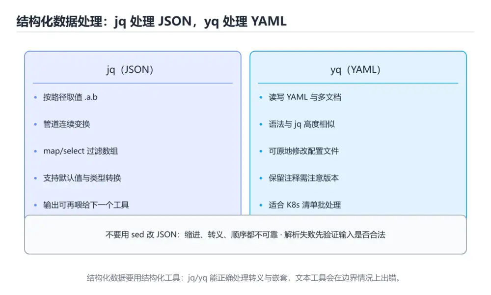

# 结构化数据处理：jq 与 yq

> 内容更新时间：2026-10-06 · 学习阶段：进阶 · 预计用时：55 分钟




## 本节知识框架

**课程定位**：所属分类 `shell`（Shell），课程主题 `结构化数据处理：jq 与 yq`，学习阶段 进阶，建议用时 50 分钟。

本课主线：用 jq 提取过滤聚合、用 yq 读写 YAML 与格式互转。

**学完本课应当能够**
- 说清 `sed` 与 `JSON` 的含义与区别，并各举一个正例和一个反例。
- 用本课示例验证 `jq` 的行为，记录输入、输出与失败条件。
- 遇到「用 `sed` 改 JSON」这类问题时，能说出触发条件与修复顺序。

### 从概念到验证的学习链条

1. `sed`：先掌握 JSON 里可以有转义、嵌套与多行字符串，`sed`、`awk` 一旦遇到嵌套结构就会误伤。**解析结构化数据必须用结构化工具**：jq 处理 JSON，yq 处理 YAML（yq 也能读写 JSON），再用它解释 `JSON` 为什么会出现。
2. `JSON`：先掌握 用对象、数组、字符串和数字等表示结构化数据的文本格式，再用它解释 `jq` 为什么会出现。
3. `jq`：先掌握 在命令行里过滤、提取和重组 JSON 的工具，配合管道处理接口响应最方便，再用它解释 `YAML 缩进` 为什么会出现。
4. `YAML 缩进`：先掌握 YAML 用缩进表达层级，空格数量不一致或混用制表符是最常见的解析失败原因，再用它解释 `Shell` 为什么会出现。
5. `Shell`：先掌握 接收命令并调用操作系统程序的命令行解释器与脚本环境，再用它解释 本课示例的观察结果 为什么会出现。

**先修与衔接**：本课是「Shell」分类的第 16 课。相关或后续课程：《实战：Shell 零停机部署脚本》、《序列化格式：JSON、YAML、Protobuf 横向对照》。

### 完成判据

- **定义关**：不看正文也能说明 `sed` 是 JSON 里可以有转义、嵌套与多行字符串，`sed`、`awk` 一旦遇到嵌套结构就会误伤，**解析结构化数据必须用结构化工具**：jq 处理 JSON，yq 处理 YAML（yq 也能读写 JSON），并指出一个反例。
- **机制关**：能按“输入 → 转换 → 输出 → 验证”复述 `结构化数据处理：jq 与 yq`，而不是只背结论。
- **示例关**：能运行或推演 `结构化数据处理：jq 与 yq` 的 `bash` 示例，并说明一个真实出现的标识符或字面量。
- **证据关**：能指出 `结构化数据处理：jq 与 yq` 示例里的 调用了 `select()`，并说明它支持或反驳了本课的哪一条结论。
- **排错关**：能复现 用 `sed` 改 JSON，记录现象并按 用 `jq` 修复。
- **迁移关**：能把 `jq`、`yq`、`JSON`、`YAML` 放进一个与 `结构化数据处理：jq 与 yq` 不同的项目场景，并保持输入与验证条件可追踪。
- **复盘关**：学完 `结构化数据处理：jq 与 yq` 后，用一句话写下仍然不确定的结论，并列出下一次验证需要的输入、环境和成功判据。

### 复习清单

- [ ] 能不看正文复述本课核心术语，并指出一个边界或反例。
- [ ] 能运行或推演本课示例，记录输入、输出与失败现象。
- [ ] 能完成一次自测，并把错题对照错误表定位原因。

## 核心概念定义

| 术语 | 操作性定义 | 常见边界与风险 |
| --- | --- | --- |
| sed | JSON 里可以有转义、嵌套与多行字符串，sed、awk 一旦遇到嵌套结构就会误伤。**解析结构化数据必须用结构化工具**：jq 处理 JSON，yq 处理 YAML（yq 也能读写 JSON）。 | 易错：结构被破坏；正确做法是用 `jq`。 |
| JSON | 用对象、数组、字符串和数字等表示结构化数据的文本格式。 | 易错：结构被破坏；正确做法是用 `jq`。 |
| jq | 在命令行里过滤、提取和重组 JSON 的工具，配合管道处理接口响应最方便。 | 易错：结构被破坏；正确做法是用 `jq`。 |
| YAML 缩进 | YAML 用缩进表达层级，空格数量不一致或混用制表符是最常见的解析失败原因。 | 易错：缩进与多行处理不了；正确做法是用 `yq`。 |
| Shell | 接收命令并调用操作系统程序的命令行解释器与脚本环境 | 易错：注入或语法错误；正确做法是用 `--arg` / `--argjson` 传参。 |

## 原理与运行机制

### 机制总览

**教材衔接：为什么不要用文本工具处理 JSON**

JSON 里可以有转义、嵌套与多行字符串，`sed`、`awk` 一旦遇到嵌套结构就会误伤。**解析结构化数据必须用结构化工具**：jq 处理 JSON，yq 处理 YAML（yq 也能读写 JSON）。

| 需求 | 工具 |
| --- | --- |
| 提取字段、过滤、改造 | jq |
| 聚合与统计 | jq 的 group_by 与 map |
| YAML 读写 | yq |
| JSON 与 YAML 互转 | `yq -p=json -o=yaml` / `-p=yaml -o=json` |
| 简单键值读取 | `jq -r '.key'` |

**教材衔接：零基础详解：用 jq 与 yq 处理结构化数据**

### 一句话说清它是什么

Shell 处理 JSON 和 YAML 的正确方式是**用结构化工具**：`jq` 管 JSON，`yq` 管 YAML。
用 `sed`、`awk` 去改 JSON 是事故高发区——嵌套、转义、多行字符串都会出错。

### 用生活比喻理解

| 工具 | 比喻 | 说明 |
| --- | --- | --- |
| `jq` | JSON 查询语言 | 取值、过滤、重组、统计 |
| `yq` | YAML 版 jq | 读写 YAML，也能转格式 |
| 管道 | 流水线 | 把查询结果继续加工 |
| `-r` | 去掉引号 | 输出纯文本便于 shell 使用 |

### jq 的六种基本操作

```bash
# 0. 先格式化，看清结构
jq . config.json

# 1. 取字段
jq '.name' config.json              # 带引号
jq -r '.name' config.json           # 去引号，适合赋值给变量

# 2. 取嵌套与数组
jq -r '.database.host' config.json
jq -r '.servers[0].ip' config.json
jq -r '.servers[].ip' config.json   # 遍历数组

# 3. 过滤
jq '.items[] | select(.price > 100)' orders.json
jq '[.items[] | select(.stock == 0)] | length' inventory.json

# 4. 构造新对象
jq '{name: .user.name, total: (.items | length)}' order.json

# 5. 统计
jq '[.items[].price] | add' orders.json
jq '.items | group_by(.category) | map({key: .[0].category, count: length})' orders.json

# 6. 修改（写回用临时文件，别直接覆盖）
jq '.version = "2.0"' config.json > config.new && mv config.new config.json
```

### 实用组合：把 JSON 变成 shell 变量

```bash
#!/usr/bin/env bash
set -euo pipefail

readonly CONFIG="config.json"

host=$(jq -r '.database.host' "$CONFIG")
port=$(jq -r '.database.port' "$CONFIG")
[[ "$host" != "null" ]] || { echo "缺少 database.host" >&2; exit 1; }

echo "连接 $host:$port"

# 逐行读取数组
while IFS= read -r ip; do
  echo "检查 $ip"
done < <(jq -r '.servers[].ip' "$CONFIG")
```

**要点**：取值用 `-r`；`null` 必须显式判断，否则会得到字符串 `"null"`。

### yq 常用操作

```bash
# 读取
yq '.services.web.image' docker-compose.yml
yq '.services | keys' docker-compose.yml

# 修改（-i 原地写入）
yq -i '.services.web.image = "myapp:v2"' docker-compose.yml

# 追加元素
yq -i '.services.web.ports += ["8080:80"]' docker-compose.yml

# 格式转换：JSON 与 YAML 互转
yq -p json -o yaml < config.json > config.yaml
yq -p yaml -o json < config.yaml > config.json
```

### 安全写回的三步法

```bash
tmp=$(mktemp)
trap 'rm -f "$tmp"' EXIT

jq '.version = "2.0"' config.json > "$tmp"
jq empty "$tmp"                 # 校验结果是合法 JSON
mv -- "$tmp" config.json        # 原子替换
```

直接 `jq ... config.json > config.json` 会把文件清空，因为重定向先发生。

### 两个容易忽略的细节

| 问题 | 说明 |
| --- | --- |
| 转义与多行 | JSON 字符串里的换行需要正确转义，`sed` 处理不了 |
| 大数字精度 | jq 默认用双精度浮点，超大整数要注意精度损失 |

```bash
# 处理超大整数时可考虑保留为字符串
jq -r '.bigId | tostring' data.json
```

### 新手最容易踩的八个坑

| 坑 | 现象 | 正确做法 |
| --- | --- | --- |
| 用 `sed` 改 JSON | 结构被破坏 | 用 `jq` |
| 忘了 `-r` | 变量里多出引号 | 取值加 `-r` |
| 不判断 `null` | 把 "null" 当有效值 | 显式判断 |
| 直接重定向覆盖源文件 | 文件被清空 | 写临时文件再 `mv` |
| `jq` 表达式引号用错 | shell 先展开变量 | 表达式用单引号 |
| 用 `awk` 解析 YAML | 缩进与多行处理不了 | 用 `yq` |
| 未校验写回结果 | 写坏了才发现 | `jq empty` 校验 |
| 忽略工具是否存在 | 报 command not found | 开头检查 `command -v jq` |

### 手把手练习：批量读取并汇总配置

```bash
#!/usr/bin/env bash
set -euo pipefail

for tool in jq yq; do
  command -v "$tool" >/dev/null || { echo "缺少 $tool" >&2; exit 1; }
done

readonly DIR="${1:?用法：$0 <配置目录>}"
readonly REPORT="report.json"

total=0
{
  echo "["
  first=1
  for file in "$DIR"/*.yaml; do
    [[ -f "$file" ]] || continue
    name=$(yq -r '.name // "未命名"' "$file")
    replicas=$(yq -r '.replicas // 1' "$file")
    total=$((total + replicas))

    ((first)) || echo ","
    first=0
    jq -n --arg n "$name" --arg f "$file" --argjson r "$replicas" \
      '{name: $n, file: $f, replicas: $r}'
  done
  echo "]"
} > "$REPORT"

jq empty "$REPORT"                       # 校验结果合法
echo "共 $(( $(jq 'length' "$REPORT") )) 个配置，副本总数 $total"
```

### 学完自测

- [ ] 能说出为什么不该用 sed 改 JSON。
- [ ] 知道取值时为什么要加 `-r`。
- [ ] 能写出「按条件过滤并统计数量」的 jq 表达式。
- [ ] 知道安全写回的三步是什么。
- [ ] 能用 yq 完成 JSON 与 YAML 互转。

**教材衔接：版本与时效**

- 版本提示：jq 的行为在最近几个大版本里有过调整，升级「结构化数据处理：jq 与 yq」前先用 validate_payload 复现当前输出，再对照官方发布说明逐条核对。
- 升级「结构化数据处理：jq 与 yq」涉及的依赖前，先用 validate_payload 复现当前行为，再逐项核对版本说明与破坏性变更。

### 升级检查清单

- 先固定当前版本，跑通全部示例与测验，再升级工具链。
- 只改 jq 的版本变量，记录编译、测试与产物体积的变化。
- 回归范围锁定 validate_payload 的默认行为，并确认弃用警告是否出现在构建输出里。
- 升级后把 validate_payload 的实测版本写进「内容元数据」，再更新复核日期。

### 机制拆解：每一步的输入、动作与输出

#### 1. `sed`
- 输入：`jq`；本步把 JSON 里可以有转义、嵌套与多行字符串，`sed`、`awk` 一旦遇到嵌套结构就会误伤。**解析结构化数据必须用结构化工具**：jq 处理 JSON，yq 处理 YAML（yq 也能读写 JSON） 当作判断规则。
- 动作：围绕 `sed` 保留中间状态，并记录它与 `JSON` 的对应关系。
- 输出：`JSON`，它可以被下一段代码、测试或记录继续使用。
- `sed` 的失败条件：当用 `sed` 改 JSON时，会出现结构被破坏。

#### 2. `JSON`
- 输入：`sed`；本步把 用对象、数组、字符串和数字等表示结构化数据的文本格式 当作判断规则。
- 动作：围绕 `JSON` 保留中间状态，并记录它与 `jq` 的对应关系。
- 输出：`jq`，它可以被下一段代码、测试或记录继续使用。
- `JSON` 的失败条件：当用 `sed` 改 JSON时，会出现结构被破坏。

#### 3. `jq`
- 输入：`JSON`；本步把 在命令行里过滤、提取和重组 JSON 的工具，配合管道处理接口响应最方便 当作判断规则。
- 动作：围绕 `jq` 保留中间状态，并记录它与 `YAML 缩进` 的对应关系。
- 输出：`YAML 缩进`，它可以被下一段代码、测试或记录继续使用。
- `jq` 的失败条件：当用 `sed` 改 JSON时，会出现结构被破坏。

#### 4. `YAML 缩进`
- 输入：`jq`；本步把 YAML 用缩进表达层级，空格数量不一致或混用制表符是最常见的解析失败原因 当作判断规则。
- 动作：围绕 `YAML 缩进` 保留中间状态，并记录它与 `Shell` 的对应关系。
- 输出：`Shell`，它可以被下一段代码、测试或记录继续使用。
- `YAML 缩进` 的失败条件：当用 `awk` 解析 YAML时，会出现缩进与多行处理不了。

#### 5. `Shell`
- 输入：`YAML 缩进`；本步把 接收命令并调用操作系统程序的命令行解释器与脚本环境 当作判断规则。
- 动作：围绕 `Shell` 保留中间状态，并记录它与 `select` 的对应关系。
- 输出：`select`，它可以被下一段代码、测试或记录继续使用。
- `Shell` 的失败条件：当`jq` 表达式里拼 Shell 变量时，会出现注入或语法错误。

### 示例中的可观察事实

1. 调用了 `select()`；它对应的课程主题是 `结构化数据处理：jq 与 yq`。
2. 调用了 `group_by()`；它对应的课程主题是 `结构化数据处理：jq 与 yq`。
3. 调用了 `map()`；它对应的课程主题是 `结构化数据处理：jq 与 yq`。
4. 出现字面量 `.name`；它对应的课程主题是 `结构化数据处理：jq 与 yq`。
5. 出现字面量 `.database.host`；它对应的课程主题是 `结构化数据处理：jq 与 yq`。
6. 出现字面量 `.servers[0].ip`；它对应的课程主题是 `结构化数据处理：jq 与 yq`。
7. 出现字面量 `.servers[].ip`；它对应的课程主题是 `结构化数据处理：jq 与 yq`。
8. 出现字面量 `[.items[].price] | add`；它对应的课程主题是 `结构化数据处理：jq 与 yq`。

### 复现实验记录

- 环境：`结构化数据处理：jq 与 yq` 使用 `bash` 示例，固定 `jq`、`yq`、`JSON`、`YAML` 作为第一组条件。
- 首轮输入：先确认 调用了 `select()`，预测 `sed` 会怎样变化。
- 基线观察：记录命令、输入、输出和错误原文，不用截图代替可复制的文本。
- 单变量修改：只改变 `jq`，观察 `Shell` 是否仍满足定义。
- 失败注入：复现 用 `sed` 改 JSON，确认现象是 结构被破坏。
- 记录结论：把“修改前、修改后、预期变化、实际变化”写成四列表，这样复盘 `结构化数据处理：jq 与 yq` 时才能区分概念错误与实现错误。

## 典型应用场景

- **用 `sed` 改 JSON**：典型现象是结构被破坏；正确做法是用 `jq`。
- **忘了 `-r`**：典型现象是变量里多出引号；正确做法是取值加 `-r`。
- **不判断 `null`**：典型现象是把 "null" 当有效值；正确做法是显式判断。
- **直接重定向覆盖源文件**：典型现象是文件被清空；正确做法是写临时文件再 `mv`。

### 最小验证场景

- 准备：保留 `bash` 示例的原始输入，先记录 `结构化数据处理：jq 与 yq` 的基线输出和完整运行命令。
- 观察：先核对 调用了 `select()`，再改变一个与 `sed` 相关的条件。
- 判定：新结果与 `结构化数据处理：jq 与 yq` 的基线不同不等于错误；只有当差异破坏了 `sed` 的定义或错误表中的约束，才判定为失败。

### 选择与边界

- 使用 `sed` 时，先满足它的定义：JSON 里可以有转义、嵌套与多行字符串，`sed`、`awk` 一旦遇到嵌套结构就会误伤。**解析结构化数据必须用结构化工具**：jq 处理 JSON，yq 处理 YAML（yq 也能读写 JSON）；易错：结构被破坏；正确做法是用 `jq`。
- 使用 `JSON` 时，先满足它的定义：用对象、数组、字符串和数字等表示结构化数据的文本格式；易错：结构被破坏；正确做法是用 `jq`。
- 使用 `jq` 时，先满足它的定义：在命令行里过滤、提取和重组 JSON 的工具，配合管道处理接口响应最方便；易错：结构被破坏；正确做法是用 `jq`。
- 使用 `YAML 缩进` 时，先满足它的定义：YAML 用缩进表达层级，空格数量不一致或混用制表符是最常见的解析失败原因；易错：缩进与多行处理不了；正确做法是用 `yq`。
- 使用 `Shell` 时，先满足它的定义：接收命令并调用操作系统程序的命令行解释器与脚本环境；易错：注入或语法错误；正确做法是用 `--arg` / `--argjson` 传参。

## 代码/协议/SQL 示例

### 最小可验证示例

```bash
# 从接口响应里取前 5 个高价值条目，并转成 TSV 便于后续处理
curl -fsSL https://api.example.com/items \
  | jq -r '.items | sort_by(-.price) | .[:5] | .[] | [.id, .name, .price] | @tsv'

# 按类目统计金额与数量
jq -r '
  [.items[]]
  | group_by(.category)
  | map({category: .[0].category, count: length, total: (map(.price) | add)})
  | sort_by(-.total)
  | .[]
  | "\(.category)\t\(.count)\t\(.total)"
' orders.json

# 批量改名与写回：先写临时文件，成功后再替换，避免中途失败损坏原文件
update_config() {
  local file="$1" version="$2" tmp
  tmp=$(mktemp)
  jq --arg v "$version" '.version = $v | .updatedAt = (now | todate)' "$file" > "$tmp" \
    && mv -- "$tmp" "$file"
}

# 用 jq 做参数校验：字段缺失即失败
validate_payload() {
  local file="$1"
  jq -e 'has("userId") and (.items | length > 0)' "$file" >/dev/null \
    || { printf 'payload 不合法\n' >&2; return 1; }
}
```

**教材衔接：jq 速查**

| 需求 | 写法 |
| --- | --- |
| 取字段（去引号） | `jq -r '.name'` |
| 取数组元素 | `jq '.items[0]'`、`jq '.items[-1]'` |
| 遍历数组 | `jq '.items[]'` |
| 过滤 | `jq '.items[] \| select(.price > 100)'` |
| 映射 | `jq '[.items[].name]'` |
| 排序 | `jq '.items \| sort_by(.price)'` |
| 分组统计 | `jq '[.items[]] \| group_by(.category) \| map({key: .[0].category, count: length})'` |
| 求和 | `jq '[.items[].price] \| add'` |
| 合并对象 | `jq '.a * .b'` |
| 构造新对象 | `jq '{id: .id, total: (.price * .qty)}'` |
| 默认值 | `jq '.name // "未知"'` |
| 原始输出与换行 | `jq -r -c`（紧凑输出，便于逐行处理） |

**教材衔接：yq 速查**

| 需求 | 写法 |
| --- | --- |
| 读取字段 | `yq '.spec.replicas' deploy.yaml` |
| 修改字段 | `yq -i '.spec.replicas = 5' deploy.yaml` |
| 追加数组元素 | `yq -i '.spec.containers += [{"name":"sidecar","image":"busybox"}]'` |
| 删除字段 | `yq -i 'del(.metadata.annotations)'` |
| 多文档处理 | `yq 'select(.kind == "Deployment")'` 或按 `---` 分隔处理 |
| JSON 转 YAML | `yq -p=json -o=yaml '.' config.json` |
| YAML 转 JSON | `yq -p=yaml -o=json '.' deploy.yaml` |

```bash
# 批量给所有 Deployment 加上资源限制（先 dry-run 看 diff）
for file in k8s/*.yaml; do
  yq '.spec.template.spec.containers[] |= (.resources.limits.memory = "512Mi")' "$file" \
    | diff -u "$file" - || true
done

# 确认无误后再原地写入
for file in k8s/*.yaml; do
  yq -i '.spec.template.spec.containers[] |= (.resources.limits.memory = "512Mi")' "$file"
done
```

**运行方式**：运行 `结构化数据处理：jq 与 yq` 的示例时，用 `bash 文件名.sh` 运行；先 `bash -n` 做语法检查更稳妥。

### 示例精读：先找证据，再改一个条件

1. 调用了 `select()`；它出现在 `结构化数据处理：jq 与 yq` 的示例中，阅读时先确认它前后各发生了什么。
2. 调用了 `group_by()`；它出现在 `结构化数据处理：jq 与 yq` 的示例中，阅读时先确认它前后各发生了什么。
3. 调用了 `map()`；它出现在 `结构化数据处理：jq 与 yq` 的示例中，阅读时先确认它前后各发生了什么。
4. 出现字面量 `.name`；它出现在 `结构化数据处理：jq 与 yq` 的示例中，阅读时先确认它前后各发生了什么。
5. 出现字面量 `.database.host`；它出现在 `结构化数据处理：jq 与 yq` 的示例中，阅读时先确认它前后各发生了什么。
6. 出现字面量 `.servers[0].ip`；它出现在 `结构化数据处理：jq 与 yq` 的示例中，阅读时先确认它前后各发生了什么。
7. 出现字面量 `.servers[].ip`；它出现在 `结构化数据处理：jq 与 yq` 的示例中，阅读时先确认它前后各发生了什么。
8. 出现字面量 `[.items[].price] | add`；它出现在 `结构化数据处理：jq 与 yq` 的示例中，阅读时先确认它前后各发生了什么。
- 在 `结构化数据处理：jq 与 yq` 中与 `sed` 对照：示例必须能支持 JSON 里可以有转义、嵌套与多行字符串，`sed`、`awk` 一旦遇到嵌套结构就会误伤。**解析结构化数据必须用结构化工具**：jq 处理 JSON，yq 处理 YAML（yq 也能读写 JSON），否则说明这一段还缺少实现或验证步骤。
- 在 `结构化数据处理：jq 与 yq` 中与 `JSON` 对照：示例必须能支持 用对象、数组、字符串和数字等表示结构化数据的文本格式，否则说明这一段还缺少实现或验证步骤。
- 在 `结构化数据处理：jq 与 yq` 中与 `jq` 对照：示例必须能支持 在命令行里过滤、提取和重组 JSON 的工具，配合管道处理接口响应最方便，否则说明这一段还缺少实现或验证步骤。
- 在 `结构化数据处理：jq 与 yq` 中与 `YAML 缩进` 对照：示例必须能支持 YAML 用缩进表达层级，空格数量不一致或混用制表符是最常见的解析失败原因，否则说明这一段还缺少实现或验证步骤。

## 时间/空间复杂度或性能分析

**性能关注点（结构化数据处理：jq 与 yq）**：进程启动与管道是主要成本：记录总耗时与子进程数量，避免在循环里反复启动外部命令。

**测量方法**：以 `结构化数据处理：jq 与 yq` 的 `jq` 场景为对象，固定输入跑一遍记录基线，再把规模或并发度提高一个数量级复测；两次结果的差值与波动范围才是结论依据。

### 需要控制的变量与记录项

- `结构化数据处理：jq 与 yq` 的 `jq`：固定它的版本、输入范围和资源上限，分别记录速度、内存与失败率的变化。
- `结构化数据处理：jq 与 yq` 的 `yq`：固定它的版本、输入范围和资源上限，分别记录速度、内存与失败率的变化。
- `结构化数据处理：jq 与 yq` 的 `JSON`：固定它的版本、输入范围和资源上限，分别记录速度、内存与失败率的变化。
- `结构化数据处理：jq 与 yq` 的 `YAML`：固定它的版本、输入范围和资源上限，分别记录速度、内存与失败率的变化。
- `结构化数据处理：jq 与 yq` 的 `结构化数据`：固定它的版本、输入范围和资源上限，分别记录速度、内存与失败率的变化。
- `结构化数据处理：jq 与 yq` 中 `sed` 的边界：易错：结构被破坏；正确做法是用 `jq`。达到边界时不要外推，必须重新测量。
- `结构化数据处理：jq 与 yq` 中 `JSON` 的边界：易错：结构被破坏；正确做法是用 `jq`。达到边界时不要外推，必须重新测量。
- `结构化数据处理：jq 与 yq` 中 `jq` 的边界：易错：结构被破坏；正确做法是用 `jq`。达到边界时不要外推，必须重新测量。
- `结构化数据处理：jq 与 yq` 中 `YAML 缩进` 的边界：易错：缩进与多行处理不了；正确做法是用 `yq`。达到边界时不要外推，必须重新测量。
- `结构化数据处理：jq 与 yq` 中 `Shell` 的边界：易错：注入或语法错误；正确做法是用 `--arg` / `--argjson` 传参。达到边界时不要外推，必须重新测量。
- `结构化数据处理：jq 与 yq` 的代码证据：先验证 调用了 `select()`，再记录该路径的输入规模与耗时；只看代码行数不能推出复杂度。

## 常见误区与易错点

| 容易写错的做法 | 实际现象 | 原因与正确做法 |
| --- | --- | --- |
| 用 `sed` 改 JSON | 结构被破坏 | 用 `jq` |
| 忘了 `-r` | 变量里多出引号 | 取值加 `-r` |
| 不判断 `null` | 把 "null" 当有效值 | 显式判断 |
| 直接重定向覆盖源文件 | 文件被清空 | 写临时文件再 `mv` |
| `jq` 表达式引号用错 | shell 先展开变量 | 表达式用单引号 |
| 用 `awk` 解析 YAML | 缩进与多行处理不了 | 用 `yq` |
| 未校验写回结果 | 写坏了才发现 | `jq empty` 校验 |
| 忽略工具是否存在 | 报 command not found | 开头检查 `command -v jq` |
| 用 grep/sed 提取 JSON 字段 | 嵌套或转义时出错 | 用 jq |
| 忘记 `-r` | 输出带引号，后续处理出错 | 需要纯文本时加 `-r` |
| 直接重定向覆盖原文件 | 写失败后原文件损坏 | 写临时文件再 `mv` |
| `jq` 表达式里拼 Shell 变量 | 注入或语法错误 | 用 `--arg` / `--argjson` 传参 |
| 用 `yq -i` 不先看 diff | 误改生产配置 | 先 dry-run 输出 diff |
| 用 `.*` 通配传文件 | 顺序与数量不可控 | 显式列出或用循环 |
| 认为 yq 就是 jq 的别名 | 语法差异导致失败 | 注意 yq 版本（v4 与旧版语法不同） |
| 忽略大文件内存占用 | 处理超大数据卡死 | 用流式模式（如 jq 的 `--stream`） |
| jq 表达式里拼 Shell 变量 | 注入或语法错误。 | 用 --arg / --argjson 传参。 |
| 用 yq -i 不先看 diff | 误改生产配置。 | 先 dry-run 输出 diff。 |

### 现场 1：用 `sed` 改 JSON

**症状**：结构被破坏。

**根因与修复**：用 `jq`。

**自检**：在本课示例里复现「用 `sed` 改 JSON」，改成用 `jq`后重跑；如果症状消失且失败路径按预期变化，说明定位正确。

### 现场 2：忘了 `-r`

**症状**：变量里多出引号。

**根因与修复**：取值加 `-r`。

**自检**：在本课示例里复现「忘了 `-r`」，改成取值加 `-r`后重跑；如果症状消失且失败路径按预期变化，说明定位正确。

### 现场 3：不判断 `null`

**症状**：把 "null" 当有效值。

**根因与修复**：显式判断。

**自检**：在本课示例里复现「不判断 `null`」，改成显式判断后重跑；如果症状消失且失败路径按预期变化，说明定位正确。

### 现场 4：直接重定向覆盖源文件

**症状**：文件被清空。

**根因与修复**：写临时文件再 `mv`。

**自检**：在本课示例里复现「直接重定向覆盖源文件」，改成写临时文件再 `mv`后重跑；如果症状消失且失败路径按预期变化，说明定位正确。

### 现场 5：`jq` 表达式引号用错

**症状**：shell 先展开变量。

**根因与修复**：表达式用单引号。

**自检**：在本课示例里复现「`jq` 表达式引号用错」，改成表达式用单引号后重跑；如果症状消失且失败路径按预期变化，说明定位正确。

### 现场 6：用 `awk` 解析 YAML

**症状**：缩进与多行处理不了。

**根因与修复**：用 `yq`。

**自检**：在本课示例里复现「用 `awk` 解析 YAML」，改成用 `yq`后重跑；如果症状消失且失败路径按预期变化，说明定位正确。

### 现场 7：未校验写回结果

**症状**：写坏了才发现。

**根因与修复**：`jq empty` 校验。

**自检**：在本课示例里复现「未校验写回结果」，改成`jq empty` 校验后重跑；如果症状消失且失败路径按预期变化，说明定位正确。

### 现场 8：忽略工具是否存在

**症状**：报 command not found。

**根因与修复**：开头检查 `command -v jq`。

**自检**：在本课示例里复现「忽略工具是否存在」，改成开头检查 `command -v jq`后重跑；如果症状消失且失败路径按预期变化，说明定位正确。

### 现场 9：用 grep/sed 提取 JSON 字段

**症状**：嵌套或转义时出错。

**根因与修复**：用 jq。

**自检**：在本课示例里复现「用 grep/sed 提取 JSON 字段」，改成用 jq后重跑；如果症状消失且失败路径按预期变化，说明定位正确。

## 与其他知识点的关系

| 关系 | 课程 | 为什么 |
| --- | --- | --- |
| 关联 | 《实战：Shell 零停机部署脚本》 | 用于横向比较或把本课结论迁移到相邻主题。 |
| 关联 | 《序列化格式：JSON、YAML、Protobuf 横向对照》 | 用于横向比较或把本课结论迁移到相邻主题。 |
| 前置顺序 | 《CI 脚本模板库》 | 同分类中安排在本课之前，建议先完成其自测。 |
| 后续顺序 | 《Shell 脚本安全加固》 | 同分类中安排在本课之后，会继续使用本课术语。 |

- **相关或后续**：`实战：Shell 零停机部署脚本`、`序列化格式：JSON、YAML、Protobuf 横向对照`。本课术语会在这些课程里继续使用。
- **术语归属**：`sed`、`JSON`、`jq` 的定义以本课「核心概念定义」为准，换到其他课程时先确认定义是否被改写。
- 同一分类的《实战：Shell 日志分析与告警》也涉及 `jq`；两课衔接时先确认这个术语的定义是否一致。

### 先修与后续术语接口

- `实战：Shell 零停机部署脚本`：共享术语 `Shell`。
- `序列化格式：JSON、YAML、Protobuf 横向对照`：共享术语 `JSON`，共同关键词 `JSON`、`YAML`。

### 容易混淆的相邻概念

- `sed` 与 `JSON`：前者强调 JSON 里可以有转义、嵌套与多行字符串，`sed`、`awk` 一旦遇到嵌套结构就会误伤。**解析结构化数据必须用结构化工具**：jq 处理 JSON，yq 处理 YAML（yq 也能读写 JSON）；后者强调 用对象、数组、字符串和数字等表示结构化数据的文本格式。判断时分别检查两条定义的适用范围，不要只看名称相似就互换。
- `JSON` 与 `jq`：前者强调 用对象、数组、字符串和数字等表示结构化数据的文本格式；后者强调 在命令行里过滤、提取和重组 JSON 的工具，配合管道处理接口响应最方便。判断时分别检查两条定义的适用范围，不要只看名称相似就互换。
- `jq` 与 `YAML 缩进`：前者强调 在命令行里过滤、提取和重组 JSON 的工具，配合管道处理接口响应最方便；后者强调 YAML 用缩进表达层级，空格数量不一致或混用制表符是最常见的解析失败原因。判断时分别检查两条定义的适用范围，不要只看名称相似就互换。
- `YAML 缩进` 与 `Shell`：前者强调 YAML 用缩进表达层级，空格数量不一致或混用制表符是最常见的解析失败原因；后者强调 接收命令并调用操作系统程序的命令行解释器与脚本环境。判断时分别检查两条定义的适用范围，不要只看名称相似就互换。

## 自测题与参考答案

> 先独立作答，再对照参考答案；答案都能在本课正文、术语表或错误表里找到依据。

### 自测 1（概念复述）

不看正文，写出 `sed` 的操作性定义，并说明它与 `JSON` 的区别。

**参考答案**：JSON 里可以有转义、嵌套与多行字符串，`sed`、`awk` 一旦遇到嵌套结构就会误伤。**解析结构化数据必须用结构化工具**：jq 处理 JSON，yq 处理 YAML（yq 也能读写 JSON）。

`JSON` 的定位是：用对象、数组、字符串和数字等表示结构化数据的文本格式；两者的差别要从适用对象与失败模式上说明。

### 自测 2（排错）

本课错误表记录了「用 `sed` 改 JSON」这类做法。请写出它会出现的现象、根因，以及修复顺序。

**参考答案**：现象是结构被破坏；正确做法是用 `jq`。修复时先复现现象并保留证据，再改动一处假设重跑，确认现象消失。

### 自测 3（动手验证）

运行本课的 `bash` 示例，把其中的 `'.name'` 换成一个边界值后重新运行，记录输出与错误信息。

**参考答案**：正常输入下 `bash` 示例应当复现正文给出的结果；把 `'.name'` 换成边界值后，如果结果改变或报错，先核对它是否满足 `结构化数据处理：jq 与 yq` 中`sed` 的适用范围，再检查错误表里是否有同类现象。

### 自测 4（代码阅读）

阅读本课开头的 `bash` 示例，说明它体现了`sed` 的哪一条性质，并指出改动哪个输入会让这条性质不再成立。

**参考答案**：`sed` 的定义是 JSON 里可以有转义、嵌套与多行字符串，`sed`、`awk` 一旦遇到嵌套结构就会误伤，**解析结构化数据必须用结构化工具**：jq 处理 JSON，yq 处理 YAML（yq 也能读写 JSON），示例正是在实现这条定义。改动与 `sed` 有关的一个输入后，如果结果不再符合 `结构化数据处理：jq 与 yq` 的正文描述，就说明该性质只在当前前提成立。

### 自测 5（迁移）

把 `结构化数据处理：jq 与 yq` 的方法迁移到自己的项目：围绕 `sed` 写出一个与错误表同类的风险点，并说明触发条件和检验方式。

**参考答案**：例如「用 yq -i 不先看 diff」，它会导致误改生产配置；检验方式是按先 dry-run 输出 diff改一处再复现，确认现象消失且没有引入新的失败分支。

### 自测 6（对比）

用一个表格对比 `sed` 与 `JSON`：各写一行适用场景、一行失败表现。

**参考答案**：`sed` 的定义是JSON 里可以有转义、嵌套与多行字符串，`sed`、`awk` 一旦遇到嵌套结构就会误伤。**解析结构化数据必须用结构化工具**：jq 处理 JSON，yq 处理 YAML（yq 也能读写 JSON）；`JSON` 的定义是用对象、数组、字符串和数字等表示结构化数据的文本格式。两者的失败表现分别对应本课错误表里与本术语相关的行。

### 自测 7（排错顺序）

面对「用 `sed` 改 JSON」引发的问题，请把“复现 结构被破坏 → 保留证据 → 用 `jq` → 回归验证”四步写成可执行的检查清单。

**参考答案**：第一步按结构被破坏复现；第二步记录输入、版本与完整报错；第三步按用 `jq`只改一处；第四步重跑并确认失败路径也按预期变化。

### 自测 8（边界判断）

针对 `Shell`，分别写出“可以使用”的条件和“结论不再成立”的条件。

**参考答案**：易错：注入或语法错误；正确做法是用 `--arg` / `--argjson` 传参。 同时要把 `Shell` 的定义 接收命令并调用操作系统程序的命令行解释器与脚本环境 与实际输入逐项对照。

### 自测 9（机制重建）

不看正文，按输入、转换、输出、验证四段重建 `sed` → `JSON` → `jq` → `YAML 缩进` 的作用链。

**参考答案**：起点是 `sed` 的定义 JSON 里可以有转义、嵌套与多行字符串，`sed`、`awk` 一旦遇到嵌套结构就会误伤。**解析结构化数据必须用结构化工具**：jq 处理 JSON，yq 处理 YAML（yq 也能读写 JSON）；中间每一步都保留可观察状态；终点由 `Shell` 检查，失败时回到错误表定位第一个偏离定义的步骤。

### 自测 10（综合排错）

在 `结构化数据处理：jq 与 yq` 中，现象是 误改生产配置。请围绕 用 yq -i 不先看 diff 写出最小复现、关键证据、修复动作和回归验证，并说明为什么不能只凭一次运行下结论。

**参考答案**：先复现 用 yq -i 不先看 diff，记录输入与完整错误；再按 先 dry-run 输出 diff 只改一处。回归时同时跑正常路径和边界路径，只有两次结果都可解释，才把修复视为完成。

### 自测 11（一分钟复述）

用每分钟约 200 字的速度复述 `结构化数据处理：jq 与 yq`：先给主问题，再按顺序说出 `sed`、`JSON`、`jq`、`YAML 缩进`，最后给一个失败案例。

**自评标准**：主问题必须对应 用 jq 提取过滤聚合、用 yq 读写 YAML 与格式互转；每个术语都要能接上一句定义或边界；失败案例必须写成可观察现象，不能用“可能有风险”代替证据。

## 术语速查

| 术语 | 一句话说明 |
| --- | --- |
| `sed` | JSON 里可以有转义、嵌套与多行字符串，`sed`、`awk` 一旦遇到嵌套结构就会误伤。**解析结构化数据必须用结构化工具**：jq 处理 JSON，yq 处理 YAML（yq 也能读写 JSON）。 |
| `JSON` | 用对象、数组、字符串和数字等表示结构化数据的文本格式。 |
| `jq` | 在命令行里过滤、提取和重组 JSON 的工具，配合管道处理接口响应最方便。 |
| `YAML 缩进` | YAML 用缩进表达层级，空格数量不一致或混用制表符是最常见的解析失败原因。 |
| `Shell` | 接收命令并调用操作系统程序的命令行解释器与脚本环境。 |

**术语关系**：`sed`（JSON 里可以有转义、嵌套与多行字符串） → `JSON`（用对象、数组、字符串和数字等表示结构化数据的文本格式） → `jq`（在命令行里过滤、提取和重组 JSON 的工具） → `YAML 缩进`（YAML 用缩进表达层级）。

## 考点精讲

`结构化数据处理：jq 与 yq` 的题库有 6 道题，下面逐题给出题干、正确项与判断依据：先自己作答，再核对正确项，最后回到正文对应小节复核。

### 考点 1：第 1 题

- **题目**：处理 JSON 时为什么不要用 grep 或 sed？
- **正确项**：它们不理解嵌套结构与转义，容易误匹配
- **判断依据**：这道题落在术语 `sed` 上：JSON 里可以有转义、嵌套与多行字符串，`sed`、`awk` 一旦遇到嵌套结构就会误伤，**解析结构化数据必须用结构化工具**：jq 处理 JSON，yq 处理 YAML（yq 也能读写 JSON）。复习时把 `sed` 的定义、适用边界和一个反例一起说清楚，再回到「核心概念定义」核对原文。

### 考点 2：第 2 题

- **题目**：围绕“结构化数据处理：jq 与 yq”中的 jq、yq、JSON，下列哪两项是本课强调的实践判断？
- **正确项**：验证 yq 时要固定版本并覆盖边界输入，结论才可复现；学习 jq 时要同时说明输入、输出和失败路径，不能只看正常流程
- **判断依据**：这道题落在术语 `JSON` 上：用对象、数组、字符串和数字等表示结构化数据的文本格式。复习时把 `JSON` 的定义、适用边界和一个反例一起说清楚，再回到「核心概念定义」核对原文。

### 考点 3：第 3 题

- **题目**：阅读 `结构化数据处理：jq 与 yq` 中围绕 `sed` 的代码；课程主线是用 jq 提取过滤聚合、用 yq 读写 YAML 与格式互转。下面哪项判断最准确？
- **正确项**：用 jq 提取过滤聚合、用 yq 读写 YAML 与格式互转。
- **判断依据**：这道题落在术语 `sed` 上：JSON 里可以有转义、嵌套与多行字符串，`sed`、`awk` 一旦遇到嵌套结构就会误伤，**解析结构化数据必须用结构化工具**：jq 处理 JSON，yq 处理 YAML（yq 也能读写 JSON）。复习时把 `sed` 的定义、适用边界和一个反例一起说清楚，再回到「核心概念定义」核对原文。

### 考点 4：第 4 题

- **题目**：用 yq/jq 原地修改配置文件前，推荐先做什么？
- **正确项**：先输出到临时文件比对 diff
- **判断依据**：这道题落在术语 `jq` 上：在命令行里过滤、提取和重组 JSON 的工具，配合管道处理接口响应最方便。复习时把 `jq` 的定义、适用边界和一个反例一起说清楚，再回到「核心概念定义」核对原文。

### 考点 5：第 5 题

- **题目**：要把 JSON 转成 YAML，正确的思路是？
- **正确项**：用 yq 指定输入输出格式（-p=json -o=yaml）
- **判断依据**：这道题落在术语 `JSON` 上：用对象、数组、字符串和数字等表示结构化数据的文本格式。复习时把 `JSON` 的定义、适用边界和一个反例一起说清楚，再回到「核心概念定义」核对原文。

### 考点 6：第 6 题

- **题目**：填空：补齐下面这段术语说明中的空缺。课程 `用 jq 提取过滤聚合、用 yq 读写 YAML 与格式互转。`，这段说明是：`____`：YAML 用缩进表达层级，空格数量不一致或混用制表符是最常见的解析失败原因。空缺处应填哪个术语？
- **正确项**：YAML 缩进
- **判断依据**：这道题落在术语 `jq` 上：在命令行里过滤、提取和重组 JSON 的工具，配合管道处理接口响应最方便。复习时把 `jq` 的定义、适用边界和一个反例一起说清楚，再回到「核心概念定义」核对原文。

### 考点 7：`sed`

- **要点**：JSON 里可以有转义、嵌套与多行字符串，`sed`、`awk` 一旦遇到嵌套结构就会误伤。**解析结构化数据必须用结构化工具**：jq 处理 JSON，yq 处理 YAML（yq 也能读写 JSON）。
- **sed 的边界**：易错：结构被破坏；正确做法是用 `jq`。

### 考点 8：`JSON`

- **要点**：用对象、数组、字符串和数字等表示结构化数据的文本格式。
- **JSON 的边界**：易错：结构被破坏；正确做法是用 `jq`。

### 考点 9：`jq`

- **要点**：在命令行里过滤、提取和重组 JSON 的工具，配合管道处理接口响应最方便。
- **jq 的边界**：易错：结构被破坏；正确做法是用 `jq`。

### 考点 10：`YAML 缩进`

- **要点**：YAML 用缩进表达层级，空格数量不一致或混用制表符是最常见的解析失败原因。
- **YAML 缩进 的边界**：易错：缩进与多行处理不了；正确做法是用 `yq`。

### 考点 11：`Shell`

- **要点**：接收命令并调用操作系统程序的命令行解释器与脚本环境
- **Shell 的边界**：易错：注入或语法错误；正确做法是用 `--arg` / `--argjson` 传参。

### 考点 12：排错——用 `sed` 改 JSON

- **现象**：结构被破坏。
- **处理**：用 `jq`。

### 考点 13：排错——忘了 `-r`

- **现象**：变量里多出引号。
- **处理**：取值加 `-r`。

### 考点 14：综合辨析——`sed` 与 `Shell`

- **辨析点**：`sed` 的定义是 JSON 里可以有转义、嵌套与多行字符串，`sed`、`awk` 一旦遇到嵌套结构就会误伤。**解析结构化数据必须用结构化工具**：jq 处理 JSON，yq 处理 YAML（yq 也能读写 JSON）；`Shell` 的定义是 接收命令并调用操作系统程序的命令行解释器与脚本环境。
- **答题要求**：面对 `结构化数据处理：jq 与 yq` 的题目，先判断描述的是 `sed` 还是 `Shell`，再归到对应定义，最后写出一个会让该定义失效的边界输入。

### 考点 15：排错评分点

- **现象分**：能写出 结构被破坏，而不是只写“程序有错”。
- **证据分**：保留触发 用 `sed` 改 JSON 的输入、版本和错误原文。
- **修复分**：按 用 `jq` 只改一处，并同时回归正常路径与边界路径。

## 内容元数据

- 内容版本：v2.0
- 最后更新：2026-10-06
- 学习阶段：进阶
- 适用环境：Bash 5 / POSIX Shell
；本课聚焦 jq。
- 内容来源：内置结构化课程与工程实践整理
- 相关主题：jq、yq、JSON、YAML、结构化数据、配置修改
- 质量版本：P0 测验标准 + P1 覆盖扩展 + P2 体验补全

## 参考资料与复核

- 最后复核：2026-10-04
- 下次复核：2027-02-10
- 复核范围：版本兼容、API 行为、安全建议与工程实践
- 来源性质：官方文档、标准或权威教材；本课核对关键词：jq、yq、JSON、YAML、结构化数据、配置修改。

| 参考资料 | 本课用途 |
| --- | --- |
| [jq 手册](https://jqlang.org/manual/) | JSON 查询与转换 |
| [GNU Bash 手册](https://www.gnu.org/software/bash/manual/) | Bash 语法、展开与作业控制 |
| [GNU Coreutils](https://www.gnu.org/software/coreutils/manual/) | 文件、文本与进程工具 |

| [本课术语索引：结构化数据处理：jq 与 yq](#核心概念定义) | 按本课输入、术语边界和错误表现逐项核对 |
> 「结构化数据处理：jq 与 yq」的链接用于离线阅读后的延伸核对；App 不会自动联网。