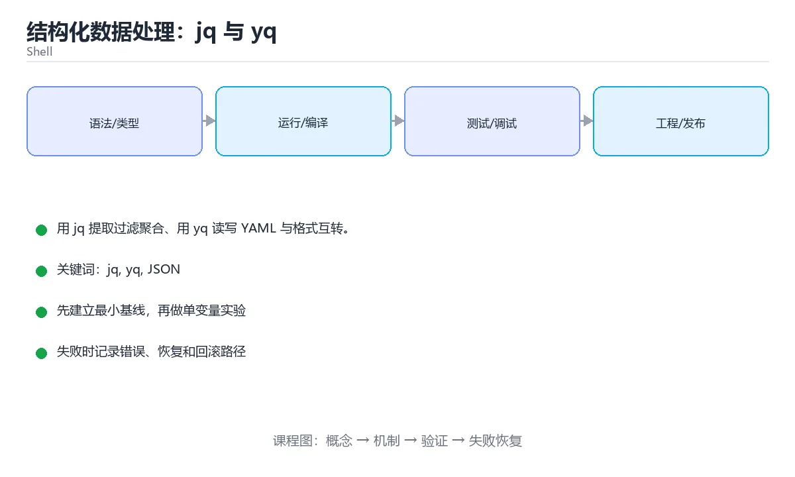

# 结构化数据处理：jq 与 yq



> 内容更新时间：2026-10-03 · 学习阶段：进阶 · 预计用时：16 分钟

## 学习目标

- 能用自己的话解释「结构化数据处理：jq 与 yq」解决了什么问题，而不是只背术语。
- 能说清 「jq」、「yq」、「JSON」、「YAML」 之间的关系，并分别举出一个例子。
- 能把本课知识放回「Shell」的知识体系，说明它和相邻主题的边界。
- 能完成本课练习，并用验收标准检查自己的结果。

> 一句话摘要：用 jq 提取过滤聚合、用 yq 读写 YAML 与格式互转。

## 前置知识

- 先完成上一课《Shell 脚本安全加固》；如果已经掌握，可以直接用本课练习自测。
- 本课阶段：进阶。建议先掌握同一分类的基础课程，并能独立运行正文中的最小示例。
- 开始前先复习：jq、yq、JSON。
- 如果某一步看不懂，先记录具体卡点，完成练习后再回头读一遍。


## 为什么不要用文本工具处理 JSON

JSON 里可以有转义、嵌套与多行字符串，`sed`、`awk` 一旦遇到嵌套结构就会误伤。**解析结构化数据必须用结构化工具**：jq 处理 JSON，yq 处理 YAML（yq 也能读写 JSON）。

| 需求 | 工具 |
| --- | --- |
| 提取字段、过滤、改造 | jq |
| 聚合与统计 | jq 的 group_by 与 map |
| YAML 读写 | yq |
| JSON 与 YAML 互转 | `yq -p=json -o=yaml` / `-p=yaml -o=json` |
| 简单键值读取 | `jq -r '.key'` |

## jq 速查

| 需求 | 写法 |
| --- | --- |
| 取字段（去引号） | `jq -r '.name'` |
| 取数组元素 | `jq '.items[0]'`、`jq '.items[-1]'` |
| 遍历数组 | `jq '.items[]'` |
| 过滤 | `jq '.items[] \| select(.price > 100)'` |
| 映射 | `jq '[.items[].name]'` |
| 排序 | `jq '.items \| sort_by(.price)'` |
| 分组统计 | `jq '[.items[]] \| group_by(.category) \| map({key: .[0].category, count: length})'` |
| 求和 | `jq '[.items[].price] \| add'` |
| 合并对象 | `jq '.a * .b'` |
| 构造新对象 | `jq '{id: .id, total: (.price * .qty)}'` |
| 默认值 | `jq '.name // "未知"'` |
| 原始输出与换行 | `jq -r -c`（紧凑输出，便于逐行处理） |

```bash
# 从接口响应里取前 5 个高价值条目，并转成 TSV 便于后续处理
curl -fsSL https://api.example.com/items \
  | jq -r '.items | sort_by(-.price) | .[:5] | .[] | [.id, .name, .price] | @tsv'

# 按类目统计金额与数量
jq -r '
  [.items[]] 
  | group_by(.category)
  | map({category: .[0].category, count: length, total: (map(.price) | add)})
  | sort_by(-.total)
  | .[]
  | "\(.category)\t\(.count)\t\(.total)"
' orders.json

# 批量改名与写回：先写临时文件，成功后再替换，避免中途失败损坏原文件
update_config() {
  local file="$1" version="$2" tmp
  tmp=$(mktemp)
  jq --arg v "$version" '.version = $v | .updatedAt = (now | todate)' "$file" > "$tmp" \
    && mv -- "$tmp" "$file"
}

# 用 jq 做参数校验：字段缺失即失败
validate_payload() {
  local file="$1"
  jq -e 'has("userId") and (.items | length > 0)' "$file" >/dev/null \
    || { printf 'payload 不合法\n' >&2; return 1; }
}
```

## yq 速查

| 需求 | 写法 |
| --- | --- |
| 读取字段 | `yq '.spec.replicas' deploy.yaml` |
| 修改字段 | `yq -i '.spec.replicas = 5' deploy.yaml` |
| 追加数组元素 | `yq -i '.spec.containers += [{"name":"sidecar","image":"busybox"}]'` |
| 删除字段 | `yq -i 'del(.metadata.annotations)'` |
| 多文档处理 | `yq 'select(.kind == "Deployment")'` 或按 `---` 分隔处理 |
| JSON 转 YAML | `yq -p=json -o=yaml '.' config.json` |
| YAML 转 JSON | `yq -p=yaml -o=json '.' deploy.yaml` |

```bash
# 批量给所有 Deployment 加上资源限制（先 dry-run 看 diff）
for file in k8s/*.yaml; do
  yq '.spec.template.spec.containers[] |= (.resources.limits.memory = "512Mi")' "$file" \
    | diff -u "$file" - || true
done

# 确认无误后再原地写入
for file in k8s/*.yaml; do
  yq -i '.spec.template.spec.containers[] |= (.resources.limits.memory = "512Mi")' "$file"
done
```

## 常见错误对照表

| 容易踩的做法 | 实际现象 | 原因与正确做法 |
| --- | --- | --- |
| 用 grep/sed 提取 JSON 字段 | 嵌套或转义时出错 | 用 jq |
| 忘记 `-r` | 输出带引号，后续处理出错 | 需要纯文本时加 `-r` |
| 直接重定向覆盖原文件 | 写失败后原文件损坏 | 写临时文件再 `mv` |
| `jq` 表达式里拼 Shell 变量 | 注入或语法错误 | 用 `--arg` / `--argjson` 传参 |
| 用 `yq -i` 不先看 diff | 误改生产配置 | 先 dry-run 输出 diff |
| 用 `.*` 通配传文件 | 顺序与数量不可控 | 显式列出或用循环 |
| 认为 yq 就是 jq 的别名 | 语法差异导致失败 | 注意 yq 版本（v4 与旧版语法不同） |
| 忽略大文件内存占用 | 处理超大数据卡死 | 用流式模式（如 jq 的 `--stream`） |

## 自测清单

- [ ] 提取与过滤 JSON 一律使用 jq，不用文本工具。
- [ ] 会用 `--arg` 传参，避免拼接表达式。
- [ ] 修改配置文件先 dry-run 看 diff，再原地写入。
- [ ] 知道 jq 与 yq 的基本语法的差异与版本影响。
- [ ] 需要纯文本输出时使用 `-r`。


## 零基础详解：用 jq 与 yq 处理结构化数据

### 一句话说清它是什么

Shell 处理 JSON 和 YAML 的正确方式是**用结构化工具**：`jq` 管 JSON，`yq` 管 YAML。
用 `sed`、`awk` 去改 JSON 是事故高发区——嵌套、转义、多行字符串都会出错。

### 用生活比喻理解

| 工具 | 比喻 | 说明 |
| --- | --- | --- |
| `jq` | JSON 查询语言 | 取值、过滤、重组、统计 |
| `yq` | YAML 版 jq | 读写 YAML，也能转格式 |
| 管道 | 流水线 | 把查询结果继续加工 |
| `-r` | 去掉引号 | 输出纯文本便于 shell 使用 |

### jq 的六种基本操作

```bash
# 0. 先格式化，看清结构
jq . config.json

# 1. 取字段
jq '.name' config.json              # 带引号
jq -r '.name' config.json           # 去引号，适合赋值给变量

# 2. 取嵌套与数组
jq -r '.database.host' config.json
jq -r '.servers[0].ip' config.json
jq -r '.servers[].ip' config.json   # 遍历数组

# 3. 过滤
jq '.items[] | select(.price > 100)' orders.json
jq '[.items[] | select(.stock == 0)] | length' inventory.json

# 4. 构造新对象
jq '{name: .user.name, total: (.items | length)}' order.json

# 5. 统计
jq '[.items[].price] | add' orders.json
jq '.items | group_by(.category) | map({key: .[0].category, count: length})' orders.json

# 6. 修改（写回用临时文件，别直接覆盖）
jq '.version = "2.0"' config.json > config.new && mv config.new config.json
```

### 实用组合：把 JSON 变成 shell 变量

```bash
#!/usr/bin/env bash
set -euo pipefail

readonly CONFIG="config.json"

host=$(jq -r '.database.host' "$CONFIG")
port=$(jq -r '.database.port' "$CONFIG")
[[ "$host" != "null" ]] || { echo "缺少 database.host" >&2; exit 1; }

echo "连接 $host:$port"

# 逐行读取数组
while IFS= read -r ip; do
  echo "检查 $ip"
done < <(jq -r '.servers[].ip' "$CONFIG")
```

**要点**：取值用 `-r`；`null` 必须显式判断，否则会得到字符串 `"null"`。

### yq 常用操作

```bash
# 读取
yq '.services.web.image' docker-compose.yml
yq '.services | keys' docker-compose.yml

# 修改（-i 原地写入）
yq -i '.services.web.image = "myapp:v2"' docker-compose.yml

# 追加元素
yq -i '.services.web.ports += ["8080:80"]' docker-compose.yml

# 格式转换：JSON 与 YAML 互转
yq -p json -o yaml < config.json > config.yaml
yq -p yaml -o json < config.yaml > config.json
```

### 安全写回的三步法

```bash
tmp=$(mktemp)
trap 'rm -f "$tmp"' EXIT

jq '.version = "2.0"' config.json > "$tmp"
jq empty "$tmp"                 # 校验结果是合法 JSON
mv -- "$tmp" config.json        # 原子替换
```

直接 `jq ... config.json > config.json` 会把文件清空，因为重定向先发生。

### 两个容易忽略的细节

| 问题 | 说明 |
| --- | --- |
| 转义与多行 | JSON 字符串里的换行需要正确转义，`sed` 处理不了 |
| 大数字精度 | jq 默认用双精度浮点，超大整数要注意精度损失 |

```bash
# 处理超大整数时可考虑保留为字符串
jq -r '.bigId | tostring' data.json
```

### 新手最容易踩的八个坑

| 坑 | 现象 | 正确做法 |
| --- | --- | --- |
| 用 `sed` 改 JSON | 结构被破坏 | 用 `jq` |
| 忘了 `-r` | 变量里多出引号 | 取值加 `-r` |
| 不判断 `null` | 把 "null" 当有效值 | 显式判断 |
| 直接重定向覆盖源文件 | 文件被清空 | 写临时文件再 `mv` |
| `jq` 表达式引号用错 | shell 先展开变量 | 表达式用单引号 |
| 用 `awk` 解析 YAML | 缩进与多行处理不了 | 用 `yq` |
| 未校验写回结果 | 写坏了才发现 | `jq empty` 校验 |
| 忽略工具是否存在 | 报 command not found | 开头检查 `command -v jq` |

### 手把手练习：批量读取并汇总配置

```bash
#!/usr/bin/env bash
set -euo pipefail

for tool in jq yq; do
  command -v "$tool" >/dev/null || { echo "缺少 $tool" >&2; exit 1; }
done

readonly DIR="${1:?用法：$0 <配置目录>}"
readonly REPORT="report.json"

total=0
{
  echo "["
  first=1
  for file in "$DIR"/*.yaml; do
    [[ -f "$file" ]] || continue
    name=$(yq -r '.name // "未命名"' "$file")
    replicas=$(yq -r '.replicas // 1' "$file")
    total=$((total + replicas))

    ((first)) || echo ","
    first=0
    jq -n --arg n "$name" --arg f "$file" --argjson r "$replicas" \
      '{name: $n, file: $f, replicas: $r}'
  done
  echo "]"
} > "$REPORT"

jq empty "$REPORT"                       # 校验结果合法
echo "共 $(( $(jq 'length' "$REPORT") )) 个配置，副本总数 $total"
```

### 学完自测

- [ ] 能说出为什么不该用 sed 改 JSON。
- [ ] 知道取值时为什么要加 `-r`。
- [ ] 能写出「按条件过滤并统计数量」的 jq 表达式。
- [ ] 知道安全写回的三步是什么。
- [ ] 能用 yq 完成 JSON 与 YAML 互转。

## 动手练习


> 本课练习重点：围绕「jq、yq、JSON」完成复述、实验和交付，每个结果都要能被别人检查。

先加严格模式，再在临时目录验证成功与失败路径，最后补回滚。

### 练习 1：建立心智模型（10 分钟）

合上教程，用 3～5 句话回答：

1. 「结构化数据处理：jq 与 yq」解决了什么问题？
2. 如果没有它，会出现什么具体后果？
3. 它和「yq」是什么关系？

**验收标准**：至少出现一个本课关键词，并写出一个反例、边界条件或失效场景。

### 练习 2：做一次可控实验（20 分钟）

从正文中选一个最小示例，完成以下操作：

1. 先预测修改一个参数、输入或步骤后的结果。
2. 再实际执行或逐步推演，记录真实结果。
3. 如果结果与预测不同，写出差异原因。

**验收标准**：留下「原例 → 改动 → 预测 → 结果 → 原因」五步记录。

### 练习 3：交付一个小结果（30 分钟）

写一个带 `set -euo pipefail` 的脚本，并用临时目录验证成功与失败路径。

任务要求：

- 结果必须能被别人检查，不能只写“我已经理解了”。
- 至少覆盖「jq」和「yq」两个关键词。
- 写出 1 个仍然不确定的问题，以及下一步如何验证。

> 提示：时间有限时优先做练习 1 和练习 2；练习 3 可以拆成两次完成。

## 本课小结

- 核心问题：「结构化数据处理：jq 与 yq」不是孤立术语，而是在「Shell」中解决一类具体问题。
- 关键关系：先分清「jq」与「yq」的职责，再理解「JSON」的适用边界。
- 判断标准：能解释正常场景、边界条件和失败场景，才算真正掌握。
- 下一步：完成练习后，用自己的话写下 3 条要点，再去做本课测验。


## 考点精讲：把测验题还原成判断过程

本课有 6 个判断点。先自己作答，再看「判断依据」；如果结论正确但理由不完整，回到正文对应章节补足概念。

### 考点 1：处理 JSON 时为什么不要用 grep 或 sed？

- **正确判断**：它们不理解嵌套结构与转义，容易误匹配
- **判断依据**：正确答案是「它们不理解嵌套结构与转义，容易误匹配」，本课在「为什么不要用文本工具处理 JSON」中说明：解析结构化数据必须用结构化工具：jq 处理 JSON，yq 处理 YAML（yq 也能读写 JSON）。JSON 是树形结构且有转义规则，只有结构化解析器才能正确处理。本课还在「为什么不要用文本工具处理 JSON」中说明：JSON 里可以有转义、嵌套与多行字符串，sed、awk 一旦遇到嵌套结构就会误伤。
- **迁移检查**：如果给某个错误选项去掉一个限定词，它会不会变成正确？说明理由。

### 考点 2：jq 输出带引号的字符串，想去掉引号应该加？

- **正确判断**：-r
- **判断依据**：-r 输出原始字符串，适合直接交给后续命令处理。「-e」是紧凑输出，仍带引号。针对「jq 输出带引号的字符串，想去掉引号应该加，」，本课在「为什么不要用文本工具处理 JSON」中说明：解析结构化数据必须用结构化工具：jq 处理 JSON，yq 处理 YAML（yq 也能读写 JSON）。本课还在「零基础详解：用 jq 与 yq 处理结构化数据」中说明：Shell 处理 JSON 和 YAML 的正确方式是用结构化工具：jq 管 JSON，yq 管 YAML。
- **迁移检查**：遮住选项，只根据定义复述一次答案，再回来看哪个选项与复述一致。

### 考点 3：在 jq 表达式里使用 Shell 变量，推荐做法是？

- **正确判断**：用 --arg 或 --argjson 传参
- **判断依据**：正确答案是「用 --arg 或 --argjson 传参」，本课在「零基础详解：用 jq 与 yq 处理结构化数据」中说明：直接 jq ... config.json > config.json 会把文件清空，因为重定向先发生。--arg 把变量作为字符串传入，避免引号与元字符破坏表达式，也更安全。本课还在「零基础详解：用 jq 与 yq 处理结构化数据」中说明：Shell 处理 JSON 和 YAML 的正确方式是用结构化工具：jq 管 JSON，yq 管 YAML。
- **迁移检查**：遮住选项，只根据定义复述一次答案，再回来看哪个选项与复述一致。

### 考点 4：用 yq/jq 原地修改配置文件前，推荐先做什么？

- **正确判断**：先输出到临时文件比对 diff
- **判断依据**：正确答案是「先输出到临时文件比对 diff」，本课在「零基础详解：用 jq 与 yq 处理结构化数据」中说明：直接 jq ... config.json > config.json 会把文件清空，因为重定向先发生。先看 diff 能避免误改生产配置，写临时文件再替换可防止中途失败损坏原文件。本课还在「零基础详解：用 jq 与 yq 处理结构化数据」中说明：能写出「按条件过滤并统计数量」的 jq 表达式。
- **迁移检查**：如果给某个错误选项去掉一个限定词，它会不会变成正确？说明理由。

### 考点 5：要把 JSON 转成 YAML，正确的思路是？

- **正确判断**：用 yq 指定输入输出格式（-p=json -o=yaml）
- **判断依据**：正确答案是「用 yq 指定输入输出格式（-p=json -o=yaml）」，本课在「为什么不要用文本工具处理 JSON」中说明：JSON 里可以有转义、嵌套与多行字符串，sed、awk 一旦遇到嵌套结构就会误伤。格式转换必须由结构化工具完成，才能正确处理嵌套、多行字符串与转义。本课还在「零基础详解：用 jq 与 yq 处理结构化数据」中说明：用 sed、awk 去改 JSON 是事故高发区——嵌套、转义、多行字符串都会出错。
- **迁移检查**：把题干里的一个条件换成边界值，原来的结论还成立吗？写出判断过程。

### 考点 6：补全代码：「结构化数据处理：jq 与 yq」示例中，下面这行代码缺少哪个关键字或函数名？请填入 ____。 `yq '.spec.template.spec.____[] |= (.resources.limits.memory = "512Mi")' "$file" \`

- **正确判断**：containers
- **判断依据**：正确答案是「containers」，本课在「零基础详解：用 jq 与 yq 处理结构化数据」中说明：能用 yq 完成 JSON 与 YAML 互转。本课示例中还能看到 `yq '.spec.template.spec.containers[] |= (.resources.limits.memory = "512Mi")' "$file" \` 这样的用法，说明该关键字在本课代码中承担实际功能。
- **迁移检查**：如果填成相近的另一个函数或关键字，程序会在哪一步出错？

## 本课复习清单

离开本课前，逐项确认：

- [ ] 不看解析，能说出「处理 JSON 时为什么不要用 grep 或 sed？」的判断依据。
- [ ] 不看解析，能说出「jq 输出带引号的字符串，想去掉引号应该加？」的判断依据。
- [ ] 不看解析，能说出「在 jq 表达式里使用 Shell 变量，推荐做法是？」的判断依据。
- [ ] 不看解析，能说出「用 yq/jq 原地修改配置文件前，推荐先做什么？」的判断依据。
- [ ] 不看解析，能说出「要把 JSON 转成 YAML，正确的思路是？」的判断依据。
- [ ] 不看解析，能说出「补全代码：「结构化数据处理：jq 与 yq」示例中，下面这行代码缺少哪个关键字或…」的判断依据。
- [ ] 至少运行一次本课示例，记录输入、输出和一个边界情况。
- [ ] 把本课最容易混淆的两个概念写成一句话对照。

| 复盘项 | 记录 |
| --- | --- |
| 已经能独立解释的考点 |  |
| 仍然说不清的概念 |  |
| 下一步验证动作 |  |

## English Overview

**Title:** jq & yq

**Summary:** Extract, filter and aggregate with jq; read and write YAML with yq.

**Category:** Shell  
**Level:** 进阶  
**Key terms:** jq, yq, JSON, YAML, 结构化数据, 配置修改

> The full tutorial is written in Chinese. This bilingual overview helps English readers identify the topic, scope and key terms before studying the detailed examples.

## 内容元数据

- 内容版本：v2.0
- 最后更新：2026-10-03
- 学习阶段：进阶
- 适用环境：Bash 5 / POSIX Shell
- 内容来源：内置结构化课程与工程实践整理
- 相关主题：jq、yq、JSON、YAML、结构化数据、配置修改
- 质量版本：P0 测验标准 + P1 覆盖扩展 + P2 体验补全


## 参考资料与复核

- 最后复核：2026-10-04
- 下次复核：2027-04-04
- 复核范围：版本兼容、API 行为、安全建议与工程实践
- 来源性质：官方文档与标准；本课正文为离线教学重组，不复制原文

| 参考资料 | 本课用途 |
| --- | --- |
| [GNU Bash Manual](https://www.gnu.org/software/bash/manual/) | Bash 语法与行为 |
| [POSIX Shell](https://pubs.opengroup.org/onlinepubs/9799919799/) | 可移植 Shell 标准 |

> 本课主题：用 jq 提取过滤聚合、用 yq 读写 YAML 与格式互转。

> App 完全离线展示文字链接，不会自动联网；需要延伸阅读时可复制链接到浏览器。

