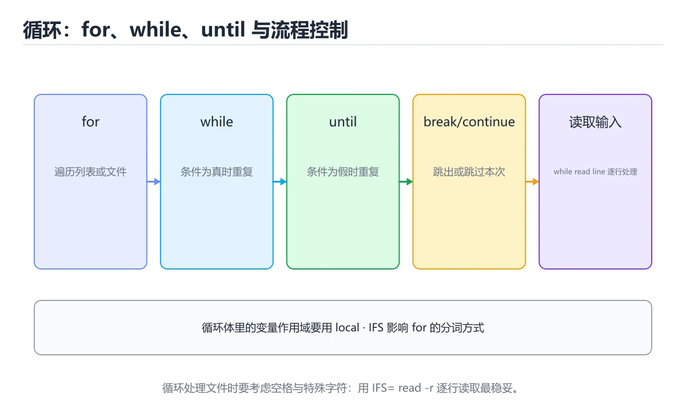
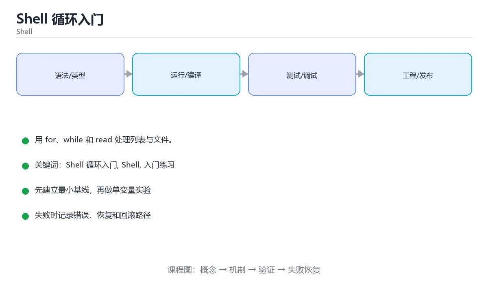

# Shell 循环入门

> 内容更新时间：2026-10-03





## 学习目标

- 先认识Shell 循环入门需要的工具、输入和输出。
- 按步骤运行最小示例，并记录结果与错误。
- 用一个边界输入验证自己是否真正掌握。

## 前置知识

- 会进行基本的文件或命令行操作。
- 不需要预先掌握「Shell」的高级知识。

## 一句话入门

用 for、while 和 read 处理列表与文件。

## 最小示例

```bash
#!/usr/bin/env bash
set -euo pipefail

total=0
for i in 1 2 3 4 5; do
  total=$((total + i))
done
echo "total=${total}"
```

## 预期输出

```text
total=15
```

## 常见错误

- 变量没有加引号，路径包含空格时命令参数被拆分。
- 复制命令时遗漏空格、引号或必要参数。

## 动手练习

1. 原样运行最小示例，保存命令和输出。
2. 把数字 2 改成 10，预测并验证新结果。
3. 制造一个错误输入，写出错误信息和修复方法。

## 本课小结

- 入门阶段先保证能运行、能观察、能解释，再追求复杂功能。
- 每次只改一个变量，记录预测与实际结果。
- 遇到错误先看第一条错误信息，再回到最小示例。

## for、while 与 until 的选择

Shell 的 `for` 适合遍历固定列表或通配符展开的文件集合，`while` 适合条件为真时持续执行，`until` 在条件为假时执行、条件为真时停止。遍历文件时不要用 `for file in $(ls)`，因为文件名中的空格和换行会被拆分；应使用 `for file in ./*` 或 `find ... -print0 | while IFS= read -r -d '' file`。遍历命令输出时，`while read` 能逐行处理，避免一次性把全部内容读入内存。

循环变量、数组和引号是三个高频边界。扩展变量时通常要写 `"$var"`，否则空值和含空格的值会被拆成多个参数。数组遍历使用 `"${array[@]}"`，而不是 `${array[*]}`。算术循环可以使用 C 风格 `for ((i = 0; i < n; i++))`，但要注意变量是字符串环境下的整数运算，非法值会导致错误。

循环中的 `break` 退出整个循环，`continue` 跳过本次迭代。嵌套循环中 `break` 只影响最内层，必要时使用标志变量或把逻辑提取成函数。循环体中的命令失败默认不会自动退出脚本，需要检查退出码或设置 `set -e`，但要理解在条件表达式和 `&&`/`||` 中 `set -e` 的例外。

## IFS、子 shell 与循环安全

管道中的 `while` 通常运行在子 shell，循环里修改的变量在管道结束后会丢失。需要保留变量时，可以使用进程替换 `while ...; do ...; done < <(command)`，或把结果写入临时文件。修改 `IFS` 会影响字段拆分和 `read` 行为，修改后应恢复原值，或者只在单条命令前临时设置。`read -r` 禁止反斜杠转义，处理原始文本时通常更安全。

删除和批量修改要格外小心。循环前先确认工作目录和通配符展开范围，使用 `set -f` 关闭意外通配，或显式列出目标。对每个路径使用 `--` 防止文件名被当作选项。写入文件时用临时文件加原子重命名，避免中途失败留下半个结果。

验证循环时覆盖空列表、单元素、大量元素、含空格文件名、含换行文件名和命令失败。记录每轮迭代的输入、输出和退出码，确认循环次数与预期一致。Shell 没有类型系统，测试和防御性检查就是你的编译期。

## 代码实验：把示例跑成证据

### 实验一：建立基线

```bash
#!/usr/bin/env bash
set -euo pipefail

total=0
for i in 1 2 3 4 5; do
  total=$((total + i))
done
echo "total=${total}"
```

### 实验二：只改一个输入

### 实验三：制造一个可控错误

去掉变量展开外的引号，或者让管道中的前一段命令失败。记录退出码、标准错误和最终输出，确认错误是否被掩盖。

| 实验 | 改动 | 预测 | 实际 | 结论 |
| --- | --- | --- | --- | --- |
| 基线 | 保持原样 |  |  |  |
| 边界 |  |  |  |  |
| 失败 |  |  |  |  |

### 实验四：用三句话复述

1. 输入是什么，哪些输入属于合法范围，哪些属于边界或非法范围？
2. 程序按什么顺序处理输入，在哪一步产生了状态变化或副作用？
3. 输出如何验证，失败时第一条可观察证据是什么？

## 可运行练习

### 任务 1：先跑通，再解释

```bash
#!/usr/bin/env bash
set -euo pipefail

total=0
for i in 1 2 3 4 5; do
  total=$((total + i))
done
echo "total=${total}"
```

**预期输出**：total=${total}

### 任务 2：只改一个条件

### 任务 3：迁移到自己的数据

用同一套思路处理一组你自己的数据或场景，保持输出格式与任务 1 一致。

## 故障现场

### 现场 1：本课的 Shell 循环入门 常规用例通过，但边界用例失败

### 现场 2：本课的 Shell 结果在两次运行之间不一致

**症状**：在本课的练习或生产场景里出现“本课的 Shell 结果在两次运行之间不一致”。

**复现**：准备一组最小输入，只保留触发“本课的 Shell 结果在两次运行之间不一致”的必要条件，连续运行两次确认结果稳定。

**定位**：围绕“Shell 依赖了当前版本、执行顺序或共享状态，单次运行无法暴露差异”检查调用链、输入数据和环境配置，先验证假设再改代码。

**预防**：把“本课的 Shell 结果在两次运行之间不一致”写成一条自动化用例，并在本课的验收清单里保留对应检查项。

### 现场 3：本课的验证只在开发机通过

**症状**：在本课的练习或生产场景里出现“本课的验证只在开发机通过”。

## 版本与时效

- Bash 5.x 与 POSIX sh 的行为差异仍然是最常见的可移植性来源
- 升级前确认目标环境的 Bash 版本、内置命令与数组能力

### 升级检查清单

- 先固定当前版本，跑通全部示例与测验，再升级工具链。
- 只改一个版本变量，记录编译、测试、性能与产物体积的变化。
- 重点回归默认值、弃用警告、序列化格式、并发语义和错误信息。
- 升级完成后更新本课的“最后复核 / 下次复核”日期与版本说明。

## 本课复习清单

离开本课前，逐项确认：

- [ ] 不看解析，能说出「for i in 1 2 3 4 5; do ... done 会遍历什么？」的判断依据。
- [ ] 不看解析，能说出「逐行读取文件内容时，常见写法是？」的判断依据。
- [ ] 不看解析，能说出「Shell 中执行整数运算 total=$((total + i)) 的特点是？」的判断依据。
- [ ] 不看解析，能说出「在循环中 break 与 continue 的作用是？」的判断依据。
- [ ] 不看解析，能说出「填空：Shell 循环入门术语速查中，表示的判断依据。
- [ ] 至少运行一次本课示例，记录输入、输出和一个边界情况。
- [ ] 把本课最容易混淆的两个概念写成一句话对照。

| 复盘项 | 记录 |
| --- | --- |
| 已经能独立解释的考点 |  |
| 仍然说不清的概念 |  |
| 下一步验证动作 |  |

## 逐节复习与自检

下面按正文顺序回顾每一节，并给出一个自检问题；说不清的地方回到原章节补课。

### 一句话入门

自检：这一节的关键输入与输出分别是什么？

### 最小示例

```bash
#!/usr/bin/env bash
set -euo pipefail

total=0
for i in 1 2 3 4 5; do
  total=$((total + i))
done
echo "total=${total}"
```

自检：这一节与相邻主题的边界在哪里？

### 预期输出

```text
total=15
```

### 常见错误

自检：把这一节讲给没学过的人，最需要强调哪一点？

### 动手练习

自检：如果去掉这一节里的一个前提，结论会怎样变化？

### for、while 与 until 的选择

Shell 的 `for` 适合遍历固定列表或通配符展开的文件集合，`while` 适合条件为真时持续执行，`until` 在条件为假时执行、条件为真时停止。遍历文件时不要用 `for file in $(ls)`，因为文件名中的空格和换行会被拆分；应使用 `for file in ./*` 或 `find ... -print0 | while IFS= read -r -d '' file`。

### IFS、子 shell 与循环安全

管道中的 `while` 通常运行在子 shell，循环里修改的变量在管道结束后会丢失。需要保留变量时，可以使用进程替换 `while ...; do ...; done < <(command)`，或把结果写入临时文件。

自检：用自己的话复述这一节，并举一个反例。

## 术语速查

把「Shell 循环入门」里反复出现的术语集中放在一起。复习时先遮住右列，尝试用自己的话解释，再回到正文核对。

| 术语 | 本课语境 |
| --- | --- |
| `[Shell 循环入门, Shell, 入门练习][index]` | 在「Shell 循环入门」里理解它的定义、输入和输出。 |
| `[Shell 循环入门, Shell, 入门练习][index]` | 本课用它说明边界条件与失败路径。 |
| `[Shell 循环入门, Shell, 入门练习][index]` | 结合「Shell 循环入门」的正文示例确认它的适用条件。 |

## 考点精讲

### 考点 1：阅读「Shell 循环入门」中的这段 Shell 代码，下面哪项判断最准确？

- **判断依据**：这段 Shell 代码来自本课的本地示例，主要用来核对 Shell 循环入门、Shell、入门练习 之间的输入、处理和输出关系，用 for、while 和 read 处理列表与文件。“阅读Shell”与「Shell 循环入门」的术语表相呼应，只有符合Shell 循环入门、Shell、入门练习约束的“用 for、while 和 read 处”才是正文支持的结论。

### 考点 2：逐行读取文件内容时，常见写法是？

- **判断依据**：在「Shell 循环入门」里，while IFS= read -r line; do ... done < file。在「Shell 循环入门」里判断这道题，要把Shell 循环入门、Shell、入门练习的条件、过程与失败路径逐项对齐，换成“逐行读取文件内容时”这个场景，只有满足前提的结论才成立。

### 考点 3：Shell 中执行整数运算 total=$((total + i)) 的特点是？

- **判断依据**：在「Shell 循环入门」里，按整数做算术展开，结果替换回赋值语句。i++))，但要注意变量是字符串环境下的整数运算，非法值会导致错误。$ 是算术展开，内部按整数运算并把结果作为文本替换到命令行，因此可以直接赋值给变量。把“按整数做算术展开，结果替换回赋值语句”代回「Shell 循环入门」里“Shell 中执行整数运算 total=$((total +”的例子核对，条件一旦改变，结论就要用Shell 循环入门、Shell、入门练习重新推导。

### 考点 4：围绕“Shell 循环入门”中的 Shell 循环入门、Shell、入门练习，下列哪两项是本课强调的实践判断？

- **判断依据**：在「Shell 循环入门」里，学习 Shell 循环入门 时要同时说明输入、输出和失败路径，不能只看正常流程。结论应落在验证 Shell 时要固定版本并覆盖边界输入。在「Shell 循环入门」里，这道题要求区分概念与边界，验证 Shell 时要固定版本并覆盖边界输入，结论才可复现。

### 考点 5：填空：在「Shell 循环入门」的术语速查里，「Shell 的 `____` 适合遍历固定列表或通配符展开的文件集合，`while` 适合条件为真时持续执行，`until` 在条件为假时执行、条件为真时停止。遍历文件时不要用 `____ file in $(ls)`，因为文件名中的空格和换行」描述的是哪个术语？

- **判断依据**：在「Shell 循环入门」里，for。在「Shell 循环入门」里判断这道题，要把Shell 循环入门、Shell、入门练习的条件、过程与失败路径逐项对齐，换成“填空”这个场景，只有满足前提的结论才成立。回到「Shell 循环入门」的正文示例，用“填空”走一遍Shell 循环入门、Shell、入门练习的完整流程，能复现的结论才可以保留。

## English Overview

**Title:** Shell Loops

**Summary:** Process lists and files with loops.

**Category:** Shell
**Level:** 入门
**Key terms:** Shell 循环入门, Shell, 入门练习

## 内容元数据

- 内容版本：v2.0
- 最后更新：2026-10-03
- 学习阶段：入门
- 适用环境：Bash 5 / POSIX Shell
- 内容来源：内置结构化课程与工程实践整理
- 相关主题：Shell 循环入门、Shell、入门练习
- 质量版本：P0 测验标准 + P1 覆盖扩展 + P2 体验补全

## 参考资料与复核

- 最后复核：2026-10-04
- 下次复核：2027-04-04
- 复核范围：版本兼容、API 行为、安全建议与工程实践
- 来源性质：官方文档、标准或权威教材；正文为离线教学重组

| 参考资料 | 本课用途 |
| --- | --- |
| [GNU Bash 手册](https://www.gnu.org/software/bash/manual/) | Bash 语法、展开与作业控制 |
| [GNU awk](https://www.gnu.org/software/gawk/manual/) | 字段处理与报表 |
| [cron 手册](https://man7.org/linux/man-pages/man5/crontab.5.html) | 定时任务与调度 |

> 「Shell 循环入门」的链接用于离线阅读后的延伸核对；App 不会自动联网。

## 复习与迁移

复习目标：把「Shell 循环入门」的判断标准放回可复现的例子里。先自己作答，再对照依据；如果结论正确但理由不完整，回到正文补足前提。

### 概念复述

- 用一句话说明「Shell 循环入门」解决什么问题：用 for、while 和 read 处理列表与文件。
- 写出Shell 循环入门、Shell、入门练习之间的关系，并各举一个例子。
- 说出本课最容易混淆的两个概念，以及区分它们的判据。

### 正文逐节复核

- **for、while 与 until 的选择**：Shell 的 `for` 适合遍历固定列表或通配符展开的文件集合，`while` 适合条件为真时持续执行，`until` 在条件为假时执行、条件为真时停止。
- **逐节复习与自检**：Shell 的 `for` 适合遍历固定列表或通配符展开的文件集合，`while` 适合条件为真时持续执行，`until` 在条件为假时执行、条件为真时停止。

### 测验回顾

1. 阅读「Shell 循环入门」中的这段 Shell 代码，下面哪项判断最准确？
   - 依据：这段 Shell 代码来自本课的本地示例，主要用来核对 Shell 循环入门、Shell、入门练习 之间的输入、处理和输出关系，用 for、while 和 read 处理列表与文件。“阅读Shell”与「Shell 循环入门」的术语表相呼应，只有符合Shell 循环入门、Shell、入门练习约束的“用 for、while 和 read 处”才是正文支持的结论。
2. 逐行读取文件内容时，常见写法是？
   - 依据：在「Shell 循环入门」里，while IFS= read -r line; do ... done < file。在「Shell 循环入门」里判断这道题，要把Shell 循环入门、Shell、入门练习的条件、过程与失败路径逐项对齐，换成“逐行读取文件内容时”这个场景，只有满足前提的结论才成立。
3. Shell 中执行整数运算 total=$((total + i)) 的特点是？
   - 依据：在「Shell 循环入门」里，按整数做算术展开，结果替换回赋值语句。i++))，但要注意变量是字符串环境下的整数运算，非法值会导致错误。$ 是算术展开，内部按整数运算并把结果作为文本替换到命令行，因此可以直接赋值给变量。把“按整数做算术展开，结果替换回赋值语句”代回「Shell 循环入门」里“Shell 中执行整数运算 total=$((total +”的例子核对，条件一旦改变，结论就要用Shell 循环入门、Shell、入门练习重新推导。
4. 围绕“Shell 循环入门”中的 Shell 循环入门、Shell、入门练习，下列哪两项是本课强调的实践判断？
   - 依据：在「Shell 循环入门」里，学习 Shell 循环入门 时要同时说明输入、输出和失败路径，不能只看正常流程。结论应落在验证 Shell 时要固定版本并覆盖边界输入。在「Shell 循环入门」里，这道题要求区分概念与边界，验证 Shell 时要固定版本并覆盖边界输入，结论才可复现。
5. 填空：在「Shell 循环入门」的术语速查里，「Shell 的 `____` 适合遍历固定列表或通配符展开的文件集合，`while` 适合条件为真时持续执行，`until` 在条件为假时执行、条件为真时停止。遍历文件时不要用 `____ file in $(ls)`，因为文件名中的空格和换行」描述的是哪个术语？
   - 依据：在「Shell 循环入门」里，for。在「Shell 循环入门」里判断这道题，要把Shell 循环入门、Shell、入门练习的条件、过程与失败路径逐项对齐，换成“填空”这个场景，只有满足前提的结论才成立。回到「Shell 循环入门」的正文示例，用“填空”走一遍Shell 循环入门、Shell、入门练习的完整流程，能复现的结论才可以保留。

### 迁移练习

- 第 1 次迁移：围绕「阅读「Shell 循环入门」中的这段 Shell 代码，下面哪项判断最准确？」先写下预测，再运行本课示例，最后记录预测与实际的差异。参考答案是「用 for、while 和 read 处理列表与文件。」。
- 第 2 次迁移：围绕「逐行读取文件内容时，常见写法是？」先写下预测，再运行本课示例，最后记录预测与实际的差异。参考答案是「while IFS= read -r line; do ... done < file」。
- 第 3 次迁移：围绕「Shell 中执行整数运算 total=$((total + i)) 的特点是？」先写下预测，再运行本课示例，最后记录预测与实际的差异。参考答案是「按整数做算术展开，结果替换回赋值语句」。
- 第 4 次迁移：围绕「围绕“Shell 循环入门”中的 Shell 循环入门、Shell、入门练习，下列哪两项是本课强调的实践判断？」先写下预测，再运行本课示例，最后记录预测与实际的差异。参考答案是「验证 Shell 时要固定版本并覆盖边界输入，结论才可复现」。
- 第 5 次迁移：围绕「填空：在「Shell 循环入门」的术语速查里，「Shell 的 `____` 适合遍历固定列表或通配符展开的文件集合，`while` 适合条件为真时持续执行，`until` 在条件为假时执行、条件为真时停止。遍历文件时不要用 `____ file in $(ls)`，因为文件名中的空格和换行」描述的是哪个术语？」先写下预测，再运行本课示例，最后记录预测与实际的差异。参考答案是「学习 Shell 循环入门 时要同时说明输入、输出和失败路径，不能只看正常流程」。
- 第 6 次迁移：围绕「阅读「Shell 循环入门」中的这段 Shell 代码，下面哪项判断最准确？」把结论写成一条可复现的验证步骤，让别人照着步骤就能核对。参考答案是「for」。
- 第 7 次迁移：围绕「逐行读取文件内容时，常见写法是？」把结论写成一条可复现的验证步骤，让别人照着步骤就能核对。参考答案是「用 for、while 和 read 处理列表与文件。」。
- 第 8 次迁移：围绕「Shell 中执行整数运算 total=$((total + i)) 的特点是？」把结论写成一条可复现的验证步骤，让别人照着步骤就能核对。参考答案是「while IFS= read -r line; do ... done < file」。
- 第 9 次迁移：围绕「围绕“Shell 循环入门”中的 Shell 循环入门、Shell、入门练习，下列哪两项是本课强调的实践判断？」把结论写成一条可复现的验证步骤，让别人照着步骤就能核对。参考答案是「按整数做算术展开，结果替换回赋值语句」。
- 第 10 次迁移：围绕「填空：在「Shell 循环入门」的术语速查里，「Shell 的 `____` 适合遍历固定列表或通配符展开的文件集合，`while` 适合条件为真时持续执行，`until` 在条件为假时执行、条件为真时停止。遍历文件时不要用 `____ file in $(ls)`，因为文件名中的空格和换行」描述的是哪个术语？」把结论写成一条可复现的验证步骤，让别人照着步骤就能核对。参考答案是「验证 Shell 时要固定版本并覆盖边界输入，结论才可复现」。
- 第 11 次迁移：围绕「阅读「Shell 循环入门」中的这段 Shell 代码，下面哪项判断最准确？」换一个边界输入（空值、极值或失败情况）重跑一次，说明结论是否仍然成立。参考答案是「学习 Shell 循环入门 时要同时说明输入、输出和失败路径，不能只看正常流程」。
- 第 12 次迁移：围绕「逐行读取文件内容时，常见写法是？」换一个边界输入（空值、极值或失败情况）重跑一次，说明结论是否仍然成立。参考答案是「for」。
- 第 13 次迁移：围绕「Shell 中执行整数运算 total=$((total + i)) 的特点是？」换一个边界输入（空值、极值或失败情况）重跑一次，说明结论是否仍然成立。参考答案是「用 for、while 和 read 处理列表与文件。」。
- 第 14 次迁移：围绕「围绕“Shell 循环入门”中的 Shell 循环入门、Shell、入门练习，下列哪两项是本课强调的实践判断？」换一个边界输入（空值、极值或失败情况）重跑一次，说明结论是否仍然成立。参考答案是「while IFS= read -r line; do ... done < file」。
- 第 15 次迁移：围绕「填空：在「Shell 循环入门」的术语速查里，「Shell 的 `____` 适合遍历固定列表或通配符展开的文件集合，`while` 适合条件为真时持续执行，`until` 在条件为假时执行、条件为真时停止。遍历文件时不要用 `____ file in $(ls)`，因为文件名中的空格和换行」描述的是哪个术语？」换一个边界输入（空值、极值或失败情况）重跑一次，说明结论是否仍然成立。参考答案是「按整数做算术展开，结果替换回赋值语句」。
- 第 16 次迁移：围绕「阅读「Shell 循环入门」中的这段 Shell 代码，下面哪项判断最准确？」用一句话说明干扰项错在哪里，再回到正文找到对应依据。参考答案是「验证 Shell 时要固定版本并覆盖边界输入，结论才可复现」。
- 第 17 次迁移：围绕「逐行读取文件内容时，常见写法是？」用一句话说明干扰项错在哪里，再回到正文找到对应依据。参考答案是「学习 Shell 循环入门 时要同时说明输入、输出和失败路径，不能只看正常流程」。
- 第 18 次迁移：围绕「Shell 中执行整数运算 total=$((total + i)) 的特点是？」用一句话说明干扰项错在哪里，再回到正文找到对应依据。参考答案是「for」。
- 第 19 次迁移：围绕「围绕“Shell 循环入门”中的 Shell 循环入门、Shell、入门练习，下列哪两项是本课强调的实践判断？」用一句话说明干扰项错在哪里，再回到正文找到对应依据。参考答案是「用 for、while 和 read 处理列表与文件。」。
- 第 20 次迁移：围绕「填空：在「Shell 循环入门」的术语速查里，「Shell 的 `____` 适合遍历固定列表或通配符展开的文件集合，`while` 适合条件为真时持续执行，`until` 在条件为假时执行、条件为真时停止。遍历文件时不要用 `____ file in $(ls)`，因为文件名中的空格和换行」描述的是哪个术语？」用一句话说明干扰项错在哪里，再回到正文找到对应依据。参考答案是「while IFS= read -r line; do ... done < file」。
- 第 21 次迁移：围绕「阅读「Shell 循环入门」中的这段 Shell 代码，下面哪项判断最准确？」把这个结论迁移到自己的数据或项目场景，并记录输入、输出与失败路径。参考答案是「按整数做算术展开，结果替换回赋值语句」。
- 第 22 次迁移：围绕「逐行读取文件内容时，常见写法是？」把这个结论迁移到自己的数据或项目场景，并记录输入、输出与失败路径。参考答案是「验证 Shell 时要固定版本并覆盖边界输入，结论才可复现」。
- 第 23 次迁移：围绕「Shell 中执行整数运算 total=$((total + i)) 的特点是？」把这个结论迁移到自己的数据或项目场景，并记录输入、输出与失败路径。参考答案是「学习 Shell 循环入门 时要同时说明输入、输出和失败路径，不能只看正常流程」。
- 第 24 次迁移：围绕「围绕“Shell 循环入门”中的 Shell 循环入门、Shell、入门练习，下列哪两项是本课强调的实践判断？」把这个结论迁移到自己的数据或项目场景，并记录输入、输出与失败路径。参考答案是「for」。
- 第 25 次迁移：围绕「填空：在「Shell 循环入门」的术语速查里，「Shell 的 `____` 适合遍历固定列表或通配符展开的文件集合，`while` 适合条件为真时持续执行，`until` 在条件为假时执行、条件为真时停止。遍历文件时不要用 `____ file in $(ls)`，因为文件名中的空格和换行」描述的是哪个术语？」把这个结论迁移到自己的数据或项目场景，并记录输入、输出与失败路径。参考答案是「用 for、while 和 read 处理列表与文件。」。
- 第 26 次迁移：围绕「阅读「Shell 循环入门」中的这段 Shell 代码，下面哪项判断最准确？」画出这一步的输入—处理—输出流程，标出最容易失败的位置。参考答案是「while IFS= read -r line; do ... done < file」。
- 第 27 次迁移：围绕「逐行读取文件内容时，常见写法是？」画出这一步的输入—处理—输出流程，标出最容易失败的位置。参考答案是「按整数做算术展开，结果替换回赋值语句」。
- 第 28 次迁移：围绕「Shell 中执行整数运算 total=$((total + i)) 的特点是？」画出这一步的输入—处理—输出流程，标出最容易失败的位置。参考答案是「验证 Shell 时要固定版本并覆盖边界输入，结论才可复现」。
