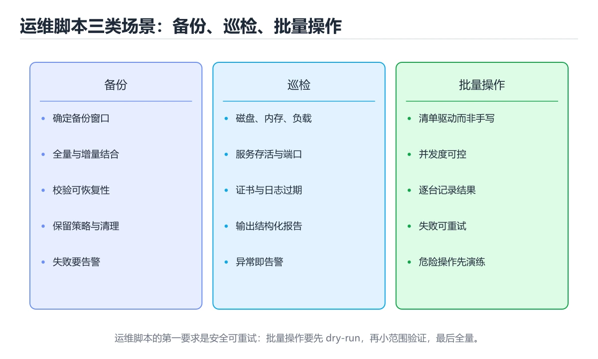
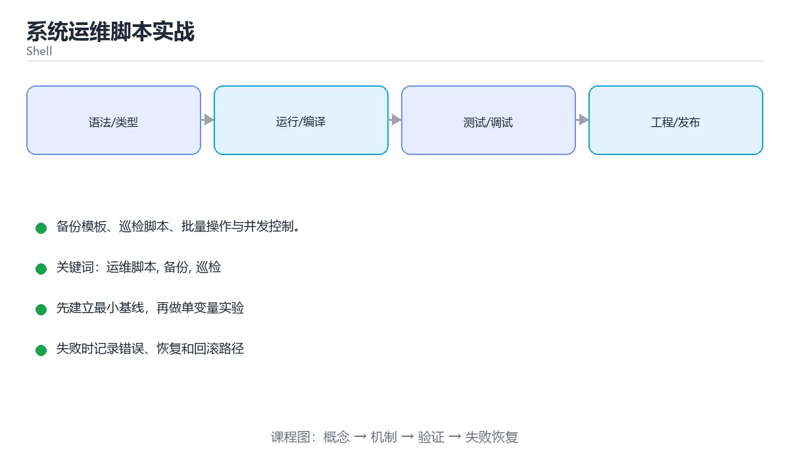

# 系统运维脚本实战

> 内容更新时间：2026-10-06 · 学习阶段：进阶 · 预计用时：80 分钟





## 学习目标

- 能用自己的话解释系统运维脚本实战解决了什么问题，而不是只背术语。
- 能说清 「运维脚本」、「备份」、「巡检」、「批量操作」 之间的关系，并分别举出一个例子。
- 能把本课知识放回「Shell」的知识体系，说明它和相邻主题的边界。
- 能完成本课练习，并用验收标准检查自己的结果。

> 一句话摘要：备份模板、巡检脚本、批量操作与并发控制。

## 前置知识

- 先完成上一课《文本处理进阶：awk、sed 与正则》；如果已经掌握，可以直接用本课练习自测。
- 本课阶段：进阶。建议先掌握同一分类的基础课程，并能独立运行正文中的最小示例。
- 开始前先复习：运维脚本、备份、巡检。
- 如果某一步看不懂，先记录具体卡点，完成练习后再回头读一遍。

## 常见脚本类型速查

| 类型 | 目标 | 关键点 |
| --- | --- | --- |
| 备份脚本 | 数据可恢复 | 一致性、校验、保留策略、异地副本 |
| 巡检脚本 | 提前发现问题 | 阈值、采集指标、结构化输出 |
| 批量操作 | 多机多资源一致执行 | 并发控制、失败隔离、可回滚 |
| 日志清理 | 控制磁盘占用 | 保留期限、先删最旧、避免误删 |
| 发布脚本 | 变更可控 | 幂等、参数校验、失败即停 |

通用要求：**幂等、可重入、失败即停、输出结构化、可被监控采集。**

## 备份脚本模板

```bash
#!/usr/bin/env bash
set -Eeuo pipefail

readonly BACKUP_ROOT="/backup"
readonly SOURCE_DIR="${1:?用法: backup.sh <源目录>}"
readonly KEEP_DAYS="${KEEP_DAYS:-14}"
readonly STAMP="$(date +%Y%m%d-%H%M%S)"
readonly ARCHIVE="${BACKUP_ROOT}/$(basename "$SOURCE_DIR")-${STAMP}.tar.gz"

log() { printf '%s [%s] %s\n' "$(date '+%F %T')" "$1" "$2" >&2; }

main() {
  [[ -d "$SOURCE_DIR" ]] || { log ERROR "源目录不存在：$SOURCE_DIR"; exit 2; }
  mkdir -p -- "$BACKUP_ROOT"

  # 1. 打包并压缩，使用 --one-file-system 避免跨挂载点
  log INFO "开始打包 $SOURCE_DIR"
  tar --create --gzip --file "$ARCHIVE" --one-file-system -C "$(dirname "$SOURCE_DIR")" "$(basename "$SOURCE_DIR")"

  # 2. 生成校验值，恢复前必须验证
  sha256sum "$ARCHIVE" > "${ARCHIVE}.sha256"

  # 3. 清理过期备份（保留最近 N 天）
  find "$BACKUP_ROOT" -name '*.tar.gz' -type f -mtime "+${KEEP_DAYS}" -print -delete

  log INFO "备份完成：$ARCHIVE（$(du -h "$ARCHIVE" | cut -f1)）"
}

main "$@"
```

## 巡检脚本模板

```bash
#!/usr/bin/env bash
set -Eeuo pipefail

readonly DISK_THRESHOLD=85
readonly MEM_THRESHOLD=90
readonly LOAD_PER_CORE=2.0

check_disk() {
  local usage
  usage=$(df -P / | awk 'NR==2 {gsub(/%/,"",$5); print $5}')
  if (( usage >= DISK_THRESHOLD )); then
    printf 'CRITICAL disk_root_usage=%s%%\n' "$usage"
  else
    printf 'OK disk_root_usage=%s%%\n' "$usage"
  fi
}

check_memory() {
  local total available used_pct
  read -r total available < <(free -m | awk 'NR==2 {print $2, $7}')
  used_pct=$(( (total - available) * 100 / total ))
  if (( used_pct >= MEM_THRESHOLD )); then
    printf 'CRITICAL memory_used=%s%%\n' "$used_pct"
  else
    printf 'OK memory_used=%s%%\n' "$used_pct"
  fi
}

check_load() {
  local cores load
  cores=$(nproc)
  load=$(awk '{print $1}' /proc/loadavg)
  awk -v l="$load" -v c="$cores" -v t="$LOAD_PER_CORE" \
    'BEGIN { printf (l/c >= t ? "CRITICAL" : "OK") " load=%s cores=%s\n", l, c }'
}

check_disk
check_memory
check_load
```

## 批量操作与并发速查

| 需求 | 做法 |
| --- | --- |
| 限制并发数 | `xargs -P4` 或自建信号量 |
| 逐台主机执行 | `for host in $(<hosts.txt); do ssh "$host" ...; done` |
| 失败隔离 | 记录失败主机，不中断其他主机 |
| 超时控制 | `timeout 30s` 或 `ssh -o ConnectTimeout=5` |
| 结果汇总 | 输出 `host status detail` 三列，便于解析 |
| 幂等 | 操作前检查状态，已达标则跳过 |

## 常见错误与排查

| 容易踩的做法 | 实际现象 | 原因与正确做法 |
| --- | --- | --- |
| 备份不与校验值一起存 | 恢复时才发现文件损坏 | 生成并保存 sha256 |
| 删除用 `*` 通配 | 误删无关文件 | 明确路径前缀并用 `find -type f` |
| 清理时不排序 | 删掉最新备份 | 按时间删除最旧，保留策略显式化 |
| 巡检脚本无阈值参数 | 环境不同要改代码 | 阈值走环境变量或参数 |
| 输出非结构化 | 监控无法采集 | 输出 `状态 指标=值` 便于解析 |
| 批量操作不设超时 | 个别主机卡住全局 | 每步加 `timeout` |
| 一次操作所有主机 | 失败影响面大 | 分批灰度，先小范围验证 |
| 脚本无日志 | 出问题无法追溯 | 关键步骤写日志并带时间戳 |

## 复习与自测

- [ ] 备份脚本包含打包、校验与保留策略三部分。
- [ ] 巡检输出结构化，阈值可配置。
- [ ] 批量操作限制并发、设置超时并汇总结果。
- [ ] 所有破坏性操作前有存在性与路径校验。
- [ ] 脚本幂等，重复执行结果一致。

## 零基础详解：运维脚本的六个常见场景

### 一句话说清它是什么

运维脚本的共同要求只有三条：**幂等（能重复跑）**、**可观测（有日志）**、**安全（不误删）**。
下面六个场景覆盖了日常 90% 的需求。

### 场景一：磁盘清理（幂等）

```bash
#!/usr/bin/env bash
set -euo pipefail

readonly TARGET_DIR="${1:?用法：$0 <目录>}"
readonly KEEP_DAYS="${KEEP_DAYS:-7}"

[[ -d "$TARGET_DIR" ]] || { echo "目录不存在：$TARGET_DIR" >&2; exit 1; }

echo "清理 $TARGET_DIR 中 $KEEP_DAYS 天前的文件"
before=$(du -sm "$TARGET_DIR" | cut -f1)

find "$TARGET_DIR" -type f -mtime "+$KEEP_DAYS" -print -delete

after=$(du -sm "$TARGET_DIR" | cut -f1)
echo "释放 $((before - after)) MB"
```

**关键点**：先 `-print` 再 `-delete`，日志里能看到删了什么。

### 场景二：日志轮转

```bash
#!/usr/bin/env bash
set -euo pipefail

readonly LOG_DIR="${1:?用法：$0 <日志目录>}"
readonly KEEP="${KEEP:-5}"
readonly STAMP="$(date +%Y%m%d)"

for log in "$LOG_DIR"/*.log; do
  [[ -f "$log" ]] || continue
  cp "$log" "$log.$STAMP"
  : > "$log"                       # 清空当前日志但保持 inode 不变
done

# 只保留最近 N 份
ls -1t "$LOG_DIR"/*.log.* 2>/dev/null | tail -n "+$((KEEP + 1))" | xargs -r rm -f
```

用 `: > file` 清空而不是 `rm`，能避免正在写日志的进程继续写入已删除文件。

### 场景三：健康检查与告警

```bash
#!/usr/bin/env bash
set -euo pipefail

readonly URL="${1:?用法：$0 <健康检查地址>}"
readonly TIMEOUT="${TIMEOUT:-5}"
readonly RETRIES="${RETRIES:-3}"

fail() {
  echo "健康检查失败：$1" >&2
  # 可以接钉钉、企业微信或邮件告警
  exit 1
}

for i in $(seq 1 "$RETRIES"); do
  code=$(curl -s -o /dev/null -w '%{http_code}' \
    --max-time "$TIMEOUT" "$URL" || echo 000)
  if [[ "$code" == "200" ]]; then
    echo "健康检查通过（第 $i 次）"
    exit 0
  fi
  echo "第 $i 次返回 $code，重试中…" >&2
  sleep 2
done

fail "连续 $RETRIES 次未通过"
```

### 场景四：批量部署（带失败汇总）

```bash
#!/usr/bin/env bash
set -uo pipefail                  # 这里故意不开 -e，需要收集所有失败

readonly HOSTS_FILE="${1:?用法：$0 <主机列表文件>}"
readonly PACKAGE="${2:?用法：$0 <主机列表文件> <包路径>}"

failed=()
succeeded=0

while IFS= read -r host; do
  [[ -z "$host" || "$host" == \#* ]] && continue

  if scp -q "$PACKAGE" "$host:/tmp/" && ssh -o BatchMode=yes "$host" \
      "sudo systemctl stop myapp && sudo dpkg -i /tmp/$(basename "$PACKAGE") && sudo systemctl start myapp"; then
    echo "成功：$host"
    ((succeeded++))
  else
    echo "失败：$host" >&2
    failed+=("$host")
  fi
done < "$HOSTS_FILE"

echo "成功 $succeeded 台，失败 ${#failed[@]} 台"
if ((${#failed[@]} > 0)); then
  printf '失败主机：%s\n' "${failed[*]}" >&2
  exit 1
fi
```

### 场景五：备份校验（不只看退出码）

```bash
#!/usr/bin/env bash
set -euo pipefail

readonly SRC="${1:?用法：$0 <源目录> <备份目录>}"
readonly DEST="${2:?用法：$0 <源目录> <备份目录>}"
readonly STAMP="$(date +%Y%m%d-%H%M%S)"
readonly ARCHIVE="$DEST/data-$STAMP.tar.gz"

mkdir -p "$DEST"
tar -czf "$ARCHIVE" -C "$(dirname "$SRC")" "$(basename "$SRC")"

# 校验：能列出内容且非空，才算真的成功
if ! tar -tzf "$ARCHIVE" >/dev/null; then
  echo "备份损坏：$ARCHIVE" >&2
  exit 1
fi

size=$(du -h "$ARCHIVE" | cut -f1)
sha=$(sha256sum "$ARCHIVE" | cut -d' ' -f1)
echo "备份完成：$ARCHIVE（$size，sha256=${sha:0:12}…）"
```

### 场景六：进程守护（轻量版）

```bash
#!/usr/bin/env bash
set -euo pipefail

readonly APP_CMD="${1:?用法：$0 <启动命令>}"
readonly LOCK=/tmp/guard.lock

exec 9>"$LOCK"
flock -n 9 || { echo "已有守护进程在运行" >&2; exit 1; }

while true; do
  echo "$(date -Is) 启动应用"
  if $APP_CMD; then
    echo "$(date -Is) 应用正常退出，停止守护"
    break
  fi
  echo "$(date -Is) 应用异常退出，5 秒后重启" >&2
  sleep 5
done
```

生产环境更推荐交给 systemd 或容器编排，这个脚本适合临时场景。

### 六个场景的共同要点

| 要点 | 具体做法 |
| --- | --- |
| 幂等 | 存在就跳过、先判断再操作 |
| 可观测 | 统一 `log()`、记录数量与耗时 |
| 安全 | 变量非空校验、`--`、先打印再删 |
| 可重入 | `flock` 加锁避免并发执行 |
| 可恢复 | 先备份再改，校验后再切换 |
| 可退出 | 明确退出码，失败要 `exit 1` |

### 新手最容易踩的八个坑

| 坑 | 现象 | 正确做法 |
| --- | --- | --- |
| 用 `rm` 清日志 | 正在写的进程继续占用空间 | 用 `: > file` |
| 只删不记录 | 出事无法追溯 | 先 `-print` 再删 |
| 批量任务开了 `set -e` | 第一台失败就中断 | 用 `set -uo pipefail` 并收集失败 |
| 备份不看内容 | 备份损坏却报成功 | `tar -tzf` 校验 |
| 无锁并发执行 | 同一目录被两个进程操作 | `flock` |
| 健康检查只试一次 | 网络抖动误报 | 加重试与超时 |
| 硬编码主机名 | 换环境就失效 | 从文件或配置读 |
| 无告警出口 | 失败无人知晓 | 接通知渠道或写监控 |

### 学完自测

- [ ] 能说出运维脚本的三条共同要求。
- [ ] 知道清空日志为什么用 `: > file` 而不是 `rm`。
- [ ] 能写出带重试与超时的健康检查。
- [ ] 知道批量任务为什么要关掉 `set -e`。
- [ ] 能用 `flock` 防止脚本并发执行。

## 动手练习

> 本课练习重点：围绕「运维脚本、备份、巡检」完成复述、实验和交付，每个结果都要能被别人检查。

先加严格模式，再在临时目录验证成功与失败路径，最后补回滚。

### 练习 1：建立心智模型（10 分钟）

合上教程，用 3～5 句话回答：

1. 系统运维脚本实战解决了什么问题？
2. 如果没有它，会出现什么具体后果？
3. 它和「备份」是什么关系？

**验收标准**：至少出现一个本课关键词，并写出一个反例、边界条件或失效场景。

### 练习 2：做一次可控实验（20 分钟）

从正文中选一个最小示例，完成以下操作：

1. 先预测修改一个参数、输入或步骤后的结果。
2. 再实际执行或逐步推演，记录真实结果。
3. 如果结果与预测不同，写出差异原因。

**验收标准**：留下「原例 → 改动 → 预测 → 结果 → 原因」五步记录。

### 练习 3：交付一个小结果（30 分钟）

写一个带 `set -euo pipefail` 的脚本，并用临时目录验证成功与失败路径。

任务要求：

- 结果必须能被别人检查，不能只写“我已经理解了”。
- 至少覆盖「运维脚本」和「备份」两个关键词。
- 写出 1 个仍然不确定的问题，以及下一步如何验证。

> 提示：时间有限时优先做练习 1 和练习 2；练习 3 可以拆成两次完成。

## 本课小结

- 核心问题：系统运维脚本实战不是孤立术语，而是在「Shell」中解决一类具体问题。
- 关键关系：先分清「运维脚本」与「备份」的职责，再理解「巡检」的适用边界。
- 判断标准：能解释正常场景、边界条件和失败场景，才算真正掌握。
- 下一步：完成练习后，用自己的话写下 3 条要点，再去做本课测验。

## 验证命令与预期输出

项目代码不能只看“能编译”，还要能按固定命令复现结果。下表给出最低验证集：

| 阶段 | 命令 | 预期输出 |
| --- | --- | --- |
| 语法检查 | `bash -n script.sh` | 脚本语法通过 |
| 静态检查 | `shellcheck script.sh` | 没有高危提示 |
| 干跑验证 | `DRY_RUN=1 ./script.sh` | 输出计划且不修改生产资源 |

### 验收证据

- [ ] 保存依赖安装和启动命令的完整输出。
- [ ] 至少运行 3 条测试，其中包含一条非法输入或失败路径。
- [ ] 重复执行同一操作两次，确认没有重复写入或副作用。
- [ ] 记录一次失败状态码、错误日志和恢复步骤。
- [ ] 在 README 中写明环境版本、启动方式和回滚方式。

### 回归与回滚

1. 先在一个可丢弃的目录或临时数据库执行，避免污染真实数据。
2. 修改一处逻辑后重跑全部验证命令，确认没有回归。
3. 若失败，回滚到上一个可运行版本并保留失败日志。
4. 定位原因后补一条自动化测试，再重新执行发布流程。
5. 把教训写入项目复盘或本课笔记，形成下一次的检查项。

## 可运行练习

### 任务 1：先跑通，再解释

```bash
#!/usr/bin/env bash
set -euo pipefail

readonly TARGET_DIR="${1:?用法：$0 <目录>}"
readonly KEEP_DAYS="${KEEP_DAYS:-7}"

[[ -d "$TARGET_DIR" ]] || { echo "目录不存在：$TARGET_DIR" >&2; exit 1; }

echo "清理 $TARGET_DIR 中 $KEEP_DAYS 天前的文件"
before=$(du -sm "$TARGET_DIR" | cut -f1)

find "$TARGET_DIR" -type f -mtime "+$KEEP_DAYS" -print -delete

after=$(du -sm "$TARGET_DIR" | cut -f1)
echo "释放 $((before - after)) MB"
```

**预期输出**：释放 $((before - after)) MB

### 任务 2：只改一个条件

把「系统运维脚本实战」的最小示例复制一份，只改一个条件再跑一次：

- 改动点：只把运维脚本的输入换成空值、极值或错误输入，其余保持不变。
- 预测：先写下「系统运维脚本实战」在改动后的输出或错误信息，再运行。
- 记录：对照改动前后的结果，指出差异出在哪一步。
- 验收：换回原条件能复现原结果，改动只影响运维脚本。

### 任务 3：迁移到自己的数据

用同一套思路处理一组你自己的数据或场景，保持输出格式与任务 1 一致。

## 故障现场

### 现场 1：本课的 运维脚本 常规用例通过，但边界用例失败

**症状**：在本课的练习或生产场景里出现“本课的 运维脚本 常规用例通过，但边界用例失败”。

**复现**：准备一组最小输入，只保留触发“本课的 运维脚本 常规用例通过，但边界用例失败”的必要条件，连续运行两次确认结果稳定。

**定位**：围绕“运维脚本 的前置条件与取值边界没有写进代码，默认值掩盖了空值和极值”检查调用链、输入数据和环境配置，先验证假设再改代码。

**预防**：把“本课的 运维脚本 常规用例通过，但边界用例失败”写成一条自动化用例，并在本课的验收清单里保留对应检查项。

### 现场 2：本课的 备份 结果在两次运行之间不一致

**症状**：在本课的练习或生产场景里出现“本课的 备份 结果在两次运行之间不一致”。

**复现**：准备一组最小输入，只保留触发“本课的 备份 结果在两次运行之间不一致”的必要条件，连续运行两次确认结果稳定。

**定位**：围绕“备份 依赖了当前版本、执行顺序或共享状态，单次运行无法暴露差异”检查调用链、输入数据和环境配置，先验证假设再改代码。

**预防**：把“本课的 备份 结果在两次运行之间不一致”写成一条自动化用例，并在本课的验收清单里保留对应检查项。

### 现场 3：本课的验证只在开发机通过

**症状**：在本课的练习或生产场景里出现“本课的验证只在开发机通过”。

**定位**：围绕“环境版本、配置和输入规模与目标环境不同，运维脚本 缺少可重复的验证记录”检查调用链、输入数据和环境配置，先验证假设再改代码。

## 版本与时效

- Bash 5.x 与 POSIX sh 的行为差异仍然是最常见的可移植性来源
- 升级前确认目标环境的 Bash 版本、内置命令与数组能力

### 升级检查清单

- 先固定当前版本，跑通全部示例与测验，再升级工具链。
- 只改一个版本变量，记录编译、测试、性能与产物体积的变化。
- 重点回归默认值、弃用警告、序列化格式、并发语义和错误信息。
- 升级完成后更新本课的“最后复核 / 下次复核”日期与版本说明。

## 本课复习清单

离开本课前，逐项确认：

- [ ] 不看解析，能说出「备份脚本中生成 sha256 校验值的意义是？」的判断依据。
- [ ] 不看解析，能说出「清理过期备份时，正确做法是？」的判断依据。
- [ ] 不看解析，能说出「巡检脚本的输出为什么建议结构化（状态 指标=值）？」的判断依据。
- [ ] 不看解析，能说出「批量在多台主机执行命令时，防止个别主机卡住全局应？」的判断依据。
- [ ] 不看解析，能说出「运维脚本「幂等」的含义是？」的判断依据。
- [ ] 至少运行一次本课示例，记录输入、输出和一个边界情况。
- [ ] 把本课最容易混淆的两个概念写成一句话对照。

| 复盘项 | 记录 |
| --- | --- |
| 已经能独立解释的考点 |  |
| 仍然说不清的概念 |  |
| 下一步验证动作 |  |

## 术语速查

| 术语 | 一句话说明 |
| --- | --- |
| `xargs -P4` | \| 限制并发数 \| `xargs -P4` 或自建信号量 \| |
| `timeout 30s` | \| 超时控制 \| `timeout 30s` 或 `ssh -o ConnectTimeout=5` \| |
| `ssh -o ConnectTimeout=5` | \| 超时控制 \| `timeout 30s` 或 `ssh -o ConnectTimeout=5` \| |
| `host status detail` | \| 结果汇总 \| 输出 `host status detail` 三列，便于解析 \| |
| `通配 | 误删无关文件 | 明确路径前缀并用` | \| 删除用 `*` 通配 \| 误删无关文件 \| 明确路径前缀并用 `find -type f` \| |
| `状态 指标=值` | \| 输出非结构化 \| 监控无法采集 \| 输出 `状态 指标=值` 便于解析 \| |

## 考点精讲

### 考点 1：概念判断·运维脚本

- **题目**：备份脚本中生成 sha256 校验值的意义是？
- **判断依据**：在「系统运维脚本实战」里，恢复前能验证文件完整未被损坏。备份的价值依赖可恢复性，校验值能在恢复前发现传输或存储损坏。回到「系统运维脚本实战」的正文示例，用“备份脚本中生成 sha256 校验值”走一遍运维脚本、备份、巡检的完整流程，能复现的结论才可以保留。

### 考点 2：多选辨析·运维脚本

- **题目**：围绕“系统运维脚本实战”中的 运维脚本、备份、巡检，下列哪两项是本课强调的实践判断？
- **判断依据**：本课把系统运维脚本实战拆成概念、示例与故障现场三部分，因此判断 运维脚本 时必须同时交代输入、输出和失败路径，这使“学习 运维脚本 时要同时说明输入、输出和失败路径，不能只看正常流程”成立。在系统运维脚本实战里，判断 备份 时要固定版本与边界输入，所以“验证 备份 时要固定版本并覆盖边界输入，结论才可复现”才可复现。

### 考点 3：概念判断·运维脚本

- **题目**：巡检脚本的输出为什么建议结构化（状态 指标=值）？
- **判断依据**：在「系统运维脚本实战」里，便于监控系统采集、解析与告警。结构化输出能被监控直接消费，形成趋势与告警，而不是只靠人肉看日志。在「系统运维脚本实战」里判断这道题，要把运维脚本、备份、巡检的条件、过程与失败路径逐项对齐，换成“巡检脚本的输出为什么建议结构化（状态”这个场景，只有满足前提的结论才成立。

### 考点 4：代码补全·运维脚本

- **题目**：阅读「系统运维脚本实战」中的这段 Shell 代码，下面哪项判断最准确？
- **判断依据**：在「系统运维脚本实战」里，结论应落在备份模板、巡检脚本、批量操作与并发控制。在「系统运维脚本实战」里，这段 Shell 代码来自本课的本地示例，主要用来核对 运维脚本、备份、巡检、批量操作 之间的输入、处理和输出关系，备份模板、巡检脚本、批量操作与并发控制。在「系统运维脚本实战」里，这道题要求区分概念与边界，备份模板、巡检脚本、批量操作与并发控制。

### 考点 5：概念判断·幂等

- **题目**：运维脚本「幂等」的含义是？
- **判断依据**：在「系统运维脚本实战」里，重复执行结果一致。幂等让脚本可安全重跑，这对失败重试与自动化至关重要。这道题的关键在「系统运维脚本实战」的运维脚本、备份、巡检：先确认题干“运维脚本幂等的含义是”问的是哪一步，再排除偷换前提的选项。把“重复执行结果一致”代回「系统运维脚本实战」里“运维脚本幂等的含义是”的例子核对，条件一旦改变，结论就要用运维脚本、备份、巡检重新推导。

### 考点 6：填空·"project": "____",

- **题目**：补全代码：「系统运维脚本实战」示例中，下面这行代码缺少哪个关键字或函数名？请填入 ____。 `"project": "____",`
- **判断依据**：空格应填写「shell_ops_scripts」。这道题的关键在「系统运维脚本实战」的运维脚本、备份、巡检：先确认题干“补全代码”问的是哪一步，再排除偷换前提的选项。把“shellopsscripts”代回「系统运维脚本实战」里“系统运维脚本实战示例中”的例子核对，条件一旦改变，结论就要用运维脚本、备份、巡检重新推导。

## English Overview

**Title:** Operations Scripts

**Summary:** Backup, health check, batch operations and concurrency.

**Category:** Shell
**Level:** 进阶
**Key terms:** 运维脚本, 备份, 巡检, 批量操作, 并发控制, 幂等

## 内容元数据

- 内容版本：v2.0
- 最后更新：2026-10-06
- 学习阶段：进阶
- 适用环境：Bash 5 / POSIX Shell
- 内容来源：内置结构化课程与工程实践整理
- 相关主题：运维脚本、备份、巡检、批量操作、并发控制、幂等
- 质量版本：P0 测验标准 + P1 覆盖扩展 + P2 体验补全

## 项目专属规格：系统运维脚本实战

### 核心场景

备份模板、巡检脚本、批量操作与并发控制。 项目目标是把「运维脚本、备份、巡检、批量操作、并发控制、幂等」落实为可运行、可测试、可回滚的交付物。

### 架构与数据流

```text
用户/输入 → 接口或命令 → 领域逻辑 → 存储/外部依赖 → 输出与监控
                         ↘ 失败分类 → 重试/补偿 → 回滚
```

### 最小数据模型

| 对象 | 关键字段 | 约束 |
| --- | --- | --- |
| 输入实体 | 运维脚本、时间、来源 | 必填校验、长度限制、幂等键 |
| 任务实体 | 状态、优先级、创建时间 | 状态迁移合法、不可重复执行 |
| 结果实体 | 输出、错误码、耗时 | 可序列化、错误可解释 |
| 审计记录 | 操作者、动作、结果、时间 | 不可篡改、可查询、脱敏 |

### 验收场景

1. 正常路径：最小输入得到预期输出，并留下日志与指标。
2. 边界路径：空值、最大值、重复数据和超长内容得到明确处理。
3. 失败路径：依赖超时或不可用时能快速失败、重试或降级。
4. 幂等路径：同一请求执行两次不会产生重复副作用。
5. 回滚路径：回滚后数据一致，且能说明恢复时间和影响范围。

## 项目交付物

### 建议仓库结构

```text
bin/
scripts/
tests/
Makefile
README.md
```

### 测试矩阵

| 层级 | 覆盖内容 | 最低数量 | 通过标准 |
| --- | --- | ---: | --- |
| 单元测试 | 领域规则、边界和错误分类 | 8 | 正常、边界、失败路径全部通过 |
| 集成测试 | 数据库、网络、文件或平台边界 | 3 | 使用真实边界且可重复运行 |
| 端到端测试 | 核心用户路径 | 1 | 从输入到输出完整跑通 |
| 手动验收 | 文档中列出的 5 个场景 | 5 | 有命令、输出和结论记录 |

### 验收数据

```json
{
  "project": "shell_ops_scripts",
  "input": {"case": "normal", "value": 5},
  "expected": {"ok": true, "result": 5},
  "failure_case": {"value": -1, "error": "validation_error"},
  "idempotency_key": "demo-001"
}
```

### 复盘模板

| 问题 | 记录 |
| --- | --- |
| 原目标是什么？ | 用一句话描述可验收目标 |
| 实际发生了什么？ | 时间线、指标和关键日志 |
| 哪个假设被推翻？ | 根因与促成因素 |
| 如何回滚？ | 步骤、耗时和数据校验 |
| 下一步做什么？ | 负责人、期限和验证方式 |

> 项目验收围绕「运维脚本、备份、巡检」：至少完成一次正常路径、一次边界输入、一次失败恢复和一次幂等检查。

## 参考资料与复核

- 最后复核：2026-10-04
- 下次复核：2027-04-04
- 复核范围：版本兼容、API 行为、安全建议与工程实践
- 来源性质：官方文档、标准或权威教材；正文为离线教学重组

| 参考资料 | 本课用途 |
| --- | --- |
| [GNU Bash 手册](https://www.gnu.org/software/bash/manual/) | Bash 语法、展开与作业控制 |
| [GNU Coreutils](https://www.gnu.org/software/coreutils/manual/) | 文件、文本与进程工具 |
| [GNU awk](https://www.gnu.org/software/gawk/manual/) | 字段处理与报表 |

> 「系统运维脚本实战」的链接用于离线阅读后的延伸核对；App 不会自动联网。
