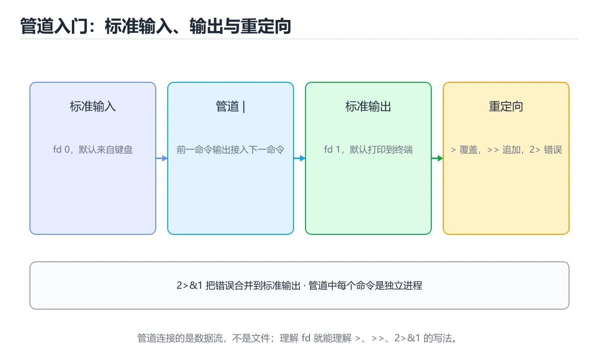
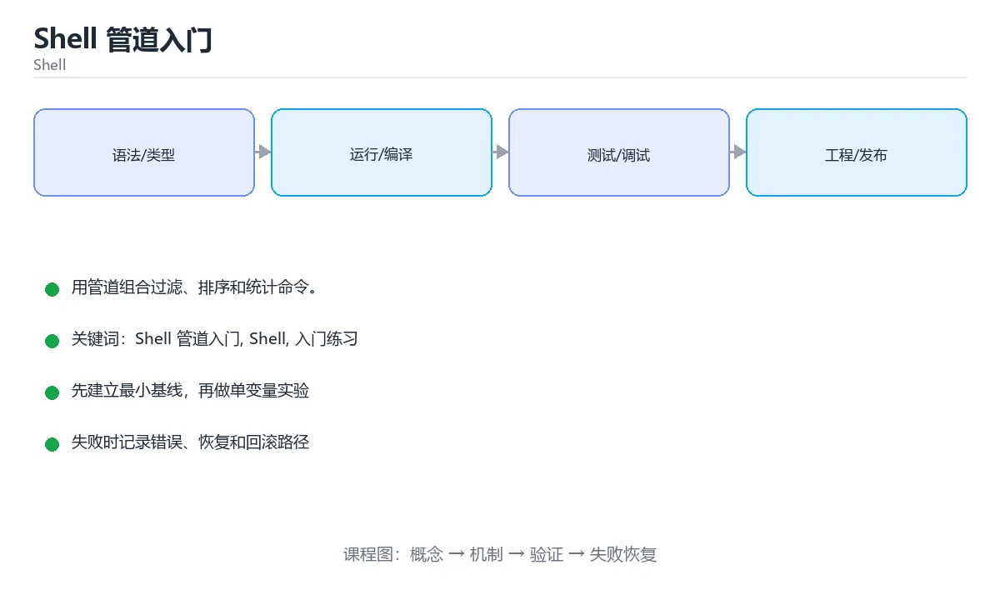

# Shell 管道入门

> 内容更新时间：2026-10-06 · 学习阶段：基础 · 预计用时：40 分钟





## 学习目标

- 先认识Shell 管道入门需要的工具、输入和输出。
- 按步骤运行最小示例，并记录结果与错误。
- 用一个边界输入验证自己是否真正掌握。

## 前置知识

- 会进行基本的文件或命令行操作。
- 不需要预先掌握「Shell」的高级知识。

## 一句话入门

用管道组合过滤、排序和统计命令。

## 最小示例

```bash
#!/usr/bin/env bash
set -euo pipefail

printf 'b\na\nc\n' | sort | paste -sd, -
```

## 预期输出

```text
a,b,c
```

## 常见错误与排查

> 说明：本表由《Shell 管道入门》的核心知识整理（2026-10-07），人工复核进度见 docs/content_review_batches.md。

| 易错点 | 容易踩的做法 | 正确结论 |
| --- | --- | --- |
| 管道中间失败被忽略 | 前半段失败但流程仍算成功 | 开启管道失败检测，任何一段失败都算失败 |
| 错误输出没有进入管道 | 错误信息丢失在终端 | 按需合并错误输出并单独记录 |
| 管道里塞复杂逻辑 | 难调试也难复用 | 复杂步骤拆开或用脚本处理 |

## 动手练习

1. 原样运行最小示例，保存命令和输出。
2. 把数字 2 改成 10，预测并验证新结果。
3. 制造一个错误输入，写出错误信息和修复方法。

## 本课小结

- 入门阶段先保证能运行、能观察、能解释，再追求复杂功能。
- 每次只改一个变量，记录预测与实际结果。
- 遇到错误先看第一条错误信息，再回到最小示例。

## 管道传递的是字节流

管道把前一个命令的标准输出连接到后一个命令的标准输入，数据是连续的字节流，不会自动带上行、列或类型信息。`ls | grep log` 之所以能工作，是因为两者都按行处理文本；如果上游输出二进制数据，或者没有换行符，下游命令可能一直等待或产生乱码。管道中的命令通常并行运行，上游写得太快会阻塞，下游读得太慢也会形成背压。

标准错误默认不进入管道，因此错误信息仍会显示在终端。要合并错误输出可以使用 `command 2>&1 | next`，但合并后错误和正常数据会混在一起，下游无法区分。需要分别处理时，应把正常结果和错误结果重定向到不同文件，再根据退出码判断整体是否成功。`tee` 可以在继续传递数据的同时把内容写入文件，适合记录中间结果。

管道中的每个命令都是独立进程，`cd`、变量赋值和函数定义不会自动影响父 shell。需要共享状态时，可以使用命令分组、进程替换或把逻辑放进同一个 shell 脚本。`xargs` 把标准输入转换成命令行参数，但默认按空白拆分，遇到含空格或换行的文件名会出错；应使用 `-0` 配合 `find -print0` 或 `grep -Z`。

## 退出码、pipefail 与安全管道

退出码 0 表示成功，非 0 表示失败。默认情况下，管道的退出码是最后一个命令的退出码，因此 `grep` 找到内容后 `sort` 成功，整条管道就返回成功，即使上游某一步失败也可能被掩盖。`set -o pipefail` 让管道在任意一段失败时返回失败，`set -e` 让脚本在未处理失败时退出，`set -u` 让引用未定义变量时报错。三者组合很强，但要理解命令替换、条件判断和 `grep` 无匹配返回 1 等例外。

处理大量文件时，优先使用 `find`、`grep`、`sort` 等流式工具，避免把所有内容读进内存。对可能为空的变量加引号，使用 `--` 结束选项解析，临时文件用 `mktemp` 并设置 `trap` 清理。删除操作先用 `printf '%s\n'` 打印将影响的路径，确认后再执行，绝不要把未经校验的变量直接拼进 `rm` 命令。

验证管道时，分段运行并保存每一步的输出和退出码。用空输入、单行输入、包含空格的文件名、上游失败和下游提前退出等边界场景测试。只有确认每一段的输入输出契约，整条管道才是可维护的。

## 代码实验：把示例跑成证据

### 实验一：建立基线

```bash
#!/usr/bin/env bash
set -euo pipefail

printf 'b\na\nc\n' | sort | paste -sd, -
```

### 实验二：只改一个输入

沿用「Shell 管道入门」的最小示例做一次单变量实验：

| 实验 | 改动 | 预测 | 实际 | 结论 |
| --- | --- | --- | --- | --- |
| 基线 | 保持「Shell 管道入门」示例原样 |  |  |  |
| 边界 | 把Shell 管道入门换成空值或极值 |  |  |  |
| 失败 | 给Shell传入非法输入 |  |  |  |

做完后用一句话写出「Shell 管道入门」的结论：输入怎么变，结果才怎么变。

### 实验三：制造一个可控错误

在 Shell 管道入门 相关命令里去掉引号或让管道前段失败，记录退出码与标准错误，确认错误是否被掩盖。

| 实验 | 改动 | 预测 | 实际 | 结论 |
| --- | --- | --- | --- | --- |
| 基线 | 保持原样 |  |  |  |
| 边界 |  |  |  |  |
| 失败 |  |  |  |  |

### 实验四：用三句话复述

1. 在「Shell 管道入门」里，pipefail 接受哪些输入，非法输入应该在哪里被挡住？
2. 在 管道传递的是字节流 里，Shell 的状态是在什么条件下被改变的？
3. 输出如何验证，失败时第一条可观察证据是什么？

## 可运行练习

### 任务 1：先跑通，再解释

```bash
#!/usr/bin/env bash
set -euo pipefail

printf 'b\na\nc\n' | sort | paste -sd, -
```

### 任务 2：只改一个条件

把「Shell 管道入门」的最小示例复制一份，只改一个条件再跑一次：

- 改动点：只调整 pipefail 的一个参数，其余条件一律不动。
- 预测：先写下「Shell 管道入门」在改动后的输出或错误信息，再运行。
- 记录：对照改动前后的结果，指出差异出在哪一步。
- 验收：换回原条件能复现原结果，改动只影响Shell 管道入门。

### 任务 3：迁移到自己的数据

把 pipefail 换成你自己的输入，先保持步骤不变，再比较输出差异。

## 故障现场

### 现场 1：管道中间失败被忽略

**症状**：在《Shell 管道入门》的复现场景中，前半段失败但流程仍算成功。

**根因**：“前半段失败但流程仍算成功”只是表层结果。向上追溯会落到“管道中间失败被忽略”这一步，因为它省略了《Shell 管道入门》的约束，使实现行为和预期模型发生了偏离。

**修复**：针对《Shell 管道入门》的问题，开启管道失败检测，任何一段失败都算失败。

**验证**：在《Shell 管道入门》中按“开启管道失败检测，任何一段失败都算失败”调整后，从“管道中间失败被忽略”的触发条件重放同一条路径，确认“前半段失败但流程仍算成功”不再出现，并补一个相邻边界用例检查没有引入新问题。

### 现场 2：错误输出没有进入管道

**症状**：在《Shell 管道入门》的复现场景中，错误信息丢失在终端。

**根因**：触发点是把“错误输出没有进入管道”当成安全做法。它没有满足《Shell 管道入门》要求的前提，因此先表现为“错误信息丢失在终端”；排查时先完整复现这一段，再核对输入、配置与依赖。

**修复**：针对《Shell 管道入门》的问题，按需合并错误输出并单独记录。

**验证**：在《Shell 管道入门》中按“按需合并错误输出并单独记录”调整后，从“错误输出没有进入管道”的触发条件重放同一条路径，确认“错误信息丢失在终端”不再出现，并补一个相邻边界用例检查没有引入新问题。

### 现场 3：管道里塞复杂逻辑

**症状**：在《Shell 管道入门》的复现场景中，难调试也难复用。

**根因**：触发点是把“管道里塞复杂逻辑”当成安全做法。它没有满足《Shell 管道入门》要求的前提，因此先表现为“难调试也难复用”；排查时先完整复现这一段，再核对输入、配置与依赖。

**修复**：针对《Shell 管道入门》的问题，复杂步骤拆开或用脚本处理。

**验证**：在《Shell 管道入门》中按“复杂步骤拆开或用脚本处理”调整后，从“管道里塞复杂逻辑”的触发条件重放同一条路径，确认“难调试也难复用”不再出现，并补一个相邻边界用例检查没有引入新问题。

## 版本与时效

- 版本提示：Shell 管道入门 的行为在最近几个大版本里有过调整，升级「Shell 管道入门」前先用 pipefail 复现当前输出，再对照官方发布说明逐条核对。
- 升级前先用 pipefail 建立基线：记录版本、命令和输出，升级后只比较这些可观察量。

### 升级检查清单

- 先固定当前版本，跑通全部示例与测验，再升级工具链。
- 一次只改一个版本条件，把 Shell 管道入门 相关的差异单独记成一条结论。
- 升级后重点回归 Shell 管道入门 的默认值、警告信息与错误格式。
- 升级后把 pipefail 的实测版本写进「内容元数据」，再更新复核日期。

## 本课复习清单

离开本课前，逐项确认：

- [ ] 不看解析，能说出「管道符号 | 连接两个命令时，数据是如何传递的？」的判断依据。
- [ ] 不看解析，能说出「为什么在脚本中需要 set -o pipefail？」的判断依据。
- [ ] 不看解析，能说出「管道与重定向的区别是什么？」的判断依据。
- [ ] 不看解析，能说出「填空：Shell 管道入门术语速查中，表示的判断依据。
- [ ] 至少运行一次 pipefail 的示例，记录输入、输出和 Shell 管道入门 的边界情况。
- [ ] 把本课最容易混淆的两个概念写成一句话对照。

| 复盘项 | 记录 |
| --- | --- |
| 已经能独立解释的考点 |  |
| 仍然说不清的概念 |  |
| 下一步验证动作 |  |

## 复习与自测

逐节自检：能说清 Shell 管道入门 的输入、输出与失败路径才算通过，否则回到原文。

### 最小示例

```bash
#!/usr/bin/env bash
set -euo pipefail

printf 'b\na\nc\n' | sort | paste -sd, -
```

自检：这一节与相邻主题的边界在哪里？

### 预期输出

```text
a,b,c
```

### 常见错误

自检：把这一节讲给没学过的人，最需要强调哪一点？

### 动手练习

自检：如果去掉这一节里的一个前提，结论会怎样变化？

### 管道传递的是字节流

管道把前一个命令的标准输出连接到后一个命令的标准输入，数据是连续的字节流，不会自动带上行、列或类型信息。`ls | grep log` 之所以能工作，是因为两者都按行处理文本；如果上游输出二进制数据，或者没有换行符，下游命令可能一直等待或产生乱码。

自检：这一节的关键输入与输出分别是什么？

### 退出码、pipefail 与安全管道

默认情况下，管道的退出码是最后一个命令的退出码，因此 `grep` 找到内容后 `sort` 成功，整条管道就返回成功，即使上游某一步失败也可能被掩盖。`set -o pipefail` 让管道在任意一段失败时返回失败，`set -e` 让脚本在未处理失败时退出，`set -u` 让引用未定义变量时报错。

## 术语速查

把「Shell 管道入门」里反复出现的术语集中放在一起。复习时先遮住右列，尝试用自己的话解释，再回到正文核对。

| 术语 | 一句话说明 |
| --- | --- |
| `grep、sort、uniq` | 过滤、排序与去重，是管道里最常用的三个过滤器。 |
| `xargs` | 把上一条命令的输出转换成下一条命令的参数列表。 |
| `Shell` | 接收命令并调用操作系统程序的命令行解释器与脚本环境。 |
| `入门练习` | 用最小输入和明确验收标准完成第一次动手验证。 |

## 零基础精讲：把Shell 管道入门真正讲透

### 先建立一个直觉

本课的摘要可以当作一张地图：用管道组合过滤、排序和统计命令。

### 逐步拆解

1. 澄清输入与目标。先写清「Shell 管道入门」要解决的问题、合法输入范围和成功标准，再进入后续步骤。
2. 描述处理过程。把「Shell 管道入门、Shell、入门练习」映射到具体步骤，每步都要求能单独验证。
3. 定义输出。明确 Shell 管道入门 与 Shell 各自的产物，以及失败时留下什么证据。
4. 制造一次Shell的失败输入，确认错误出现在「管道传递的是字节流」的哪一步，并写下恢复后如何验证状态已回到一致。
5. 把 pipefail 的规模缩小到一眼能算清的程度，手动推导结果后再用程序验证，差异处就是理解漏洞。

### 把正文串成一条执行链

- **实验一：建立基线**：先原样运行 pipefail 所在的示例，记录版本、命令、完整输出与退出状态。
- **实验三：制造一个可控错误**：在「Shell 管道入门」里，「实验三：制造一个可控错误」这一步要先写清输入与预期，再记录实际结果和差异；结果不符时回到对应小节核对前提。
- **任务 1：先跑通，再解释**：在「Shell 管道入门」里，「任务 1：先跑通，再解释」这一步要先写清输入与预期，再记录实际结果和差异；结果不符时回到对应小节核对前提。

### 从测验反推易错点

- 参考判断：默认参数 bucket=[] 只在定义时创建一次，两次调用共享同一个列表。
- 自问：如果去掉题干里的一个限定词，结论还成立吗？

**检查点 2：示例中 printf "b\na\nc\n" | sort | paste -sd, - 的输出是什么？**

- 参考判断：a,b,c，排序后以逗号连接成一行

**检查点 3：为什么在脚本中需要 set -o pipefail？**

- 参考判断：让管道中任一命令失败都能被检测到，而不是只看最后一个

- 参考判断：学习 Shell 管道入门 时要同时说明输入、输出和失败路径，不能只看正常流程、验证 Shell 时要固定版本并覆盖边界输入，结论才可复现
- 解析：本课把Shell 管道入门拆成概念、示例与故障现场三部分，因此判断 Shell 管道入门 时必须同时交代输入、输出和失败路径，这使“学习 Shell 管道入门 时要同时说明输入、输出和失败路径，不能只看正常流程”成立；在Shell 管道入门里，判断 Shell 时要固定版本与边界输入，所以“验证 Shell 时要固定版本并覆盖边界输入，结论才可复现”才可复现。相反，“只要 Shell 管道入门 的常规示例通过，就可以跳过边界与异常路径”把一次正常示例当成全部情况，会漏掉本课的边界缺陷；“把 Shell 的单次运行结果当成所有版本和规模都成立”把单次结果外推成普遍结论，在Shell 管道入门里忽略了版本和规模变化。对照本课的故障现场与自测清单，就能用证据区分这两种判断。

- 参考判断：ls | grep log

### 工程排错顺序

| 先查什么 | 要得到的证据 | 判断标准 |
| --- | --- | --- |
| 输入与前提是否满足 | 日志、输入样例、测试或指标 | 能复现并解释，才算定位 |
| 核心步骤是否产生了预期中间结果 | 日志、输入样例、测试或指标 | 能复现并解释，才算定位 |
| 失败路径是否可观测、可恢复 | 日志、输入样例、测试或指标 | 能复现并解释，才算定位 |
| 资源、权限与成本是否在预算内 | 日志、输入样例、测试或指标 | 能复现并解释，才算定位 |

### 变式训练

1. 把 Shell 管道入门 放进一个只有单机、没有额外依赖的小项目，先保证正确再扩展。
2. 把 Shell 管道入门 的输入规模扩大十倍，记录时间、内存和失败路径，找出第一个瓶颈。
3. 让 pipefail 的外部依赖超时，确认系统能回滚或补偿，而不是留下脏数据。
5. 故意跳过 Shell 的检查再运行，比较与正常流程的差异，并说明这个检查挡住的到底是哪一类失败。
6. 在低带宽或低算力条件下重跑 Shell，记录降级路径是否仍然可用。

### 本课自测

- [ ] 能用一句话解释Shell 管道入门在本课中的角色与边界。
- [ ] 能举出一个正常例子和一个失败例子。
- [ ] 能说出最小验证步骤，以及需要记录的证据。
- [ ] 能用一句话解释「Shell」在本课中的角色与边界。
- [ ] 能说出 Shell 与相邻概念的边界。

### 迁移案例库

下面用不同约束重复同一套方法，每轮只改变 Shell 管道入门 的一个取值并记录结论。

#### 迁移案例 1：围绕Shell 管道入门做一次小实验

**目标**：在不改变课程主体的前提下，验证Shell 管道入门中的一个关键判断。

**步骤**：
1. 复述当前方案对本课的假设，写成一句可证伪的话。
2. 设计一个正常输入和一个边界输入，分别预测输出。
3. 运行或逐步演算，记录实际输出、耗时和失败信息。
4. 只调整一个参数，比较前后差异并解释原因。
5. 补充一条测试或复习卡，确保下次能更快复现。

**验收**：迁移过程要留下 pipefail 的可运行记录，并说明Shell在新场景下是否仍然成立。

#### 迁移案例 2：围绕「Shell」做一次小实验

**步骤**：
1. 复述当前方案对「Shell」的假设，写成一句可证伪的话。

#### 迁移案例 3：围绕「入门练习」做一次小实验

**步骤**：
1. 复述当前方案对 Shell 管道入门 的假设，写成一句可证伪的话。

#### 迁移案例 4：围绕Shell 管道入门做一次小实验

**步骤**：

#### 迁移案例 5：围绕「Shell」做一次小实验

**步骤**：

#### 迁移案例 6：围绕「入门练习」做一次小实验

**步骤**：

#### 迁移案例 7：围绕Shell 管道入门做一次小实验

**步骤**：

#### 迁移案例 8：围绕「Shell」做一次小实验

**步骤**：

#### 迁移案例 9：围绕「入门练习」做一次小实验

**步骤**：

#### 迁移案例 10：围绕Shell 管道入门做一次小实验

**步骤**：

#### 迁移案例 11：围绕「Shell」做一次小实验

**步骤**：

#### 迁移案例 12：围绕「入门练习」做一次小实验

**步骤**：

#### 迁移案例 13：围绕Shell 管道入门做一次小实验

**步骤**：

#### 迁移案例 14：围绕「Shell」做一次小实验

**步骤**：

#### 迁移案例 15：围绕「入门练习」做一次小实验

**步骤**：

#### 迁移案例 16：围绕Shell 管道入门做一次小实验

**步骤**：

<!-- p0-depth-v2:end -->

## 考点精讲

### 考点 1：代码补全·Shell 管道入门

- **题目**：阅读「Shell 管道入门」中的这段 Shell 代码，下面哪项判断最准确？
- **判断依据**：这段 Shell 代码来自本课的本地示例，主要用来核对 Shell 管道入门、Shell、入门练习 之间的输入、处理和输出关系，用管道组合过滤、排序和统计命令。「Shell 管道入门」要求先交代Shell 管道入门、Shell、入门练习的前提再下结论，所以“用管道组合过滤、排序和统计命令，”只在题干“阅读Shell”给定的条件下成立。

### 考点 2：概念判断·Shell 管道入门

- **题目**：示例中 printf "b\na\nc\n" | sort | paste -sd, - 的输出是什么？
- **判断依据**：在「Shell 管道入门」里，a,b,c，排序后以逗号连接成一行。printf 产生三行输入，sort 按字典序排成 a、b、c，paste -sd, - 用逗号把它们串成一行，最终得到 a,b,c。回到「Shell 管道入门」的正文示例，用“示例中 printf "b\na\n”走一遍Shell 管道入门、Shell、入门练习的完整流程，能复现的结论才可以保留。

### 考点 3：概念判断·Shell 管道入门

- **题目**：为什么在脚本中需要 set -o pipefail？
- **判断依据**：在「Shell 管道入门」里，让管道中任一命令失败都能被检测到，而不是只看最后一个。默认情况下管道的退出码取自最后一个命令，前面的命令失败可能被忽略。「Shell 管道入门」要求先交代Shell 管道入门、Shell、入门练习的前提再下结论，所以“让管道中任一命令失败都能被检测到”只在题干“为什么在脚本中需要 set -o pipefail”给定的条件下成立。

### 考点 4：多选辨析·Shell 管道入门

- **题目**：围绕“Shell 管道入门”中的 Shell 管道入门、Shell、入门练习，下列哪两项是本课强调的实践判断？
- **判断依据**：题干的正确项是学习 Shell 管道入门 时要同时说明输入、输出和失败路径，不能只看正常流程；验证 Shell 时要固定版本并覆盖边界输入，结论才可复现。「Shell 管道入门」要求先交代Shell 管道入门、Shell、入门练习的前提再下结论，所以“学习 Shell 管道入门 时要同时说明”只在题干“围绕Shell 管道入门中的 Shell 管道入门、Shel”给定的条件下成立。

### 考点 5：填空·____

- **题目**：填空：在「Shell 管道入门」的术语速查里，「管道把前一个命令的标准输出连接到后一个命令的标准输入，数据是连续的字节流，不会自动带上行、列或类型信息。`____` 之所以能工作，是因为两者都按行处理文本；如果上游输出二进制数据，或者没有换行符，下游命令可能一直等待或产」描述的是哪个术语？
- **判断依据**：题干的正确项是ls | grep log。回到「Shell 管道入门」的正文示例，用“填空”走一遍Shell 管道入门、Shell、入门练习的完整流程，能复现的结论才可以保留。在「Shell 管道入门」里判断这道题，要把Shell 管道入门、Shell、入门练习的条件、过程与失败路径逐项对齐，换成“在Shell”这个场景，只有满足前提的结论才成立。

## English Overview

**Title:** Shell Pipelines

**Summary:** Combine filters, sorting and counting.

**Category:** Shell
**Level:** 入门
**Key terms:** Shell 管道入门, Shell, 入门练习

## 内容元数据

- 内容版本：v2.0
- 最后更新：2026-10-06
- 学习阶段：基础
- 适用环境：Bash 5 / POSIX Shell；本课聚焦 Shell 管道入门。
- 内容来源：内置结构化课程与工程实践整理
- 相关主题：Shell 管道入门、Shell、入门练习
- 质量版本：P0 测验标准 + P1 覆盖扩展 + P2 体验补全

## 参考资料与复核

- 最后复核：2026-10-04
- 下次复核：2027-02-17
- 复核范围：版本兼容、API 行为、安全建议与工程实践
- 来源性质：官方文档、标准或权威教材；正文为离线教学重组

| 参考资料 | 本课用途 |
| --- | --- |
| [jq 手册](https://jqlang.org/manual/) | JSON 查询与转换 |
| [GNU Coreutils](https://www.gnu.org/software/coreutils/manual/) | 文件、文本与进程工具 |
| [GNU sed](https://www.gnu.org/software/sed/manual/sed.html) | 流式文本替换 |

> 「Shell 管道入门」的链接用于离线阅读后的延伸核对；App 不会自动联网。

## 复习与迁移

复习目标：把「Shell 管道入门」的判断标准放回可复现的例子里。先自己作答，再对照依据；如果结论正确但理由不完整，回到正文补足前提。

### 概念复述

- 用一句话说明「Shell 管道入门」解决什么问题：用管道组合过滤、排序和统计命令。
- 写出Shell 管道入门、Shell、入门练习之间的关系，并各举一个例子。
- 说出本课最容易混淆的两个概念，以及区分它们的判据。

### 测验回顾

1. 阅读「Shell 管道入门」中的这段 Shell 代码，下面哪项判断最准确？
   - 依据：这段 Shell 代码来自本课的本地示例，主要用来核对 Shell 管道入门、Shell、入门练习 之间的输入、处理和输出关系，用管道组合过滤、排序和统计命令。「Shell 管道入门」要求先交代Shell 管道入门、Shell、入门练习的前提再下结论，所以“用管道组合过滤、排序和统计命令，”只在题干“阅读Shell”给定的条件下成立。
2. 示例中 printf "b\na\nc\n" | sort | paste -sd, - 的输出是什么？
   - 依据：在「Shell 管道入门」里，a,b,c，排序后以逗号连接成一行。printf 产生三行输入，sort 按字典序排成 a、b、c，paste -sd, - 用逗号把它们串成一行，最终得到 a,b,c。回到「Shell 管道入门」的正文示例，用“示例中 printf "b\na\n”走一遍Shell 管道入门、Shell、入门练习的完整流程，能复现的结论才可以保留。
3. 为什么在脚本中需要 set -o pipefail？
   - 依据：在「Shell 管道入门」里，让管道中任一命令失败都能被检测到，而不是只看最后一个。默认情况下管道的退出码取自最后一个命令，前面的命令失败可能被忽略。「Shell 管道入门」要求先交代Shell 管道入门、Shell、入门练习的前提再下结论，所以“让管道中任一命令失败都能被检测到”只在题干“为什么在脚本中需要 set -o pipefail”给定的条件下成立。
4. 围绕“Shell 管道入门”中的 Shell 管道入门、Shell、入门练习，下列哪两项是本课强调的实践判断？
   - 依据：题干的正确项是学习 Shell 管道入门 时要同时说明输入、输出和失败路径，不能只看正常流程；验证 Shell 时要固定版本并覆盖边界输入，结论才可复现。「Shell 管道入门」要求先交代Shell 管道入门、Shell、入门练习的前提再下结论，所以“学习 Shell 管道入门 时要同时说明”只在题干“围绕Shell 管道入门中的 Shell 管道入门、Shel”给定的条件下成立。
5. 填空：在「Shell 管道入门」的术语速查里，「管道把前一个命令的标准输出连接到后一个命令的标准输入，数据是连续的字节流，不会自动带上行、列或类型信息。`____` 之所以能工作，是因为两者都按行处理文本；如果上游输出二进制数据，或者没有换行符，下游命令可能一直等待或产」描述的是哪个术语？
   - 依据：题干的正确项是ls | grep log。回到「Shell 管道入门」的正文示例，用“填空”走一遍Shell 管道入门、Shell、入门练习的完整流程，能复现的结论才可以保留。在「Shell 管道入门」里判断这道题，要把Shell 管道入门、Shell、入门练习的条件、过程与失败路径逐项对齐，换成“在Shell”这个场景，只有满足前提的结论才成立。

### 迁移练习

把「Shell 管道入门」的结论迁移到相邻主题，每次迁移都写清预测与证据：

1. 换输入：用Shell 管道入门处理一组你自己的数据，对比教材示例的结果差异。
2. 换失败条件：制造一个Shell相关的错误，说明如何从错误信息定位根因。
3. 换规模：把数据量或并发度提高一个数量级，说明「Shell 管道入门」的结论是否仍成立。

## 工程化精练：决策、失败与验证

这一章把「Shell 管道入门」从“看懂”推进到“能判断、能验证、能排错”。所有判断都围绕Shell 管道入门、Shell与入门练习展开，并与前文的示例、测验和失败现场互相对照。

### 一、Shell 管道入门 的判断算法

| 步骤 | 要回答的问题 | 判断依据 | 记录什么 |
| --- | --- | --- | --- |
| 1. 定目标 | 「Shell 管道入门」这一步要解决什么问题？ | 把Shell 管道入门的目标写成一句可验证的结论 | 输入、约束、成功标准 |
| 2. 找边界 | Shell在什么条件下失效？ | 先列空值、极值、重复和失败路径 | 反例与触发条件 |
| 3. 跑基线 | 原始示例的真实输出是什么？ | 命令、版本和环境必须可复现 | 命令、输出、耗时 |
| 4. 只改一处 | 把入门练习换成另一种取值会怎样？ | 预测写在运行之前 | 预测与实际的差异 |
| 5. 回写结论 | 结论能否被他人复现？ | 把判断写成清单或测试 | 结论、证据、遗留问题 |

这张表的用法不是从上到下浏览，而是每次只填一行：先用「Shell 管道入门」前文的示例验证第 3 行，再故意破坏一个条件验证第 2 行。当你能在不看解析的情况下说出Shell 管道入门的判断依据，才算真正掌握本课。

- 先从Shell 管道入门入手：把它写成“输入是什么、输出是什么、哪一步最容易出错”。如果这三句话中有一句说不清，说明对「Shell 管道入门」的理解还停留在术语层面，需要回到正文的最小示例重新观察一次。

- 再把Shell当成对照实验的变量：固定其他条件，只改变它的取值，记录输出是否变化。结论“变”或“不变”都要写出理由，并说明这个理由能否被他人独立复现。

- 针对入门练习做一次失败演练：故意给出空值、极值或错误类型，观察「Shell 管道入门」的报错位置和处理方式。错误信息只是入口，真正要定位的是哪一层假设被破坏。

- 把「Shell 管道入门」的结论压缩成一条可执行清单：先检查输入，再检查版本与环境，然后跑最小用例，最后才扩大规模。顺序颠倒会让排错范围成倍增加。

- 如果结论依赖时间或规模，就把数据量提高一个数量级再跑一次。在「Shell 管道入门」里，小样本成立不代表大样本成立，复杂度、资源占用和失败率都要重新记录。

- 如果结论依赖并发或共享状态，就固定输入并连续运行多次。结果不一致时，优先怀疑「Shell 管道入门」中Shell 管道入门相关步骤的隐藏状态，而不是先改代码。

- 把「Shell 管道入门」的判断写成测试：一个正常用例、一个边界用例、一个失败用例。测试通过只是起点，还要确认失败用例确实以预期方式失败。

- 把本课与相邻主题连起来：Shell 管道入门解决的是“怎么做”，Shell回答“什么时候不适用”。两者都答得出来，迁移才算完成。

> 第 2 轮复核「Shell 管道入门」：把上面的结论逐条改写为可验证的问题，并记录仍不确定的部分。

- 先从Shell 管道入门入手：把它写成“输入是什么、输出是什么、哪一步最容易出错”。如果这三句话中有一句说不清，说明对「Shell 管道入门」的理解还停留在术语层面，需要回到正文的最小示例重新观察一次。

- 再把Shell当成对照实验的变量：固定其他条件，只改变它的取值，记录输出是否变化。结论“变”或“不变”都要写出理由，并说明这个理由能否被他人独立复现。

- 针对入门练习做一次失败演练：故意给出空值、极值或错误类型，观察「Shell 管道入门」的报错位置和处理方式。错误信息只是入口，真正要定位的是哪一层假设被破坏。

- 把「Shell 管道入门」的结论压缩成一条可执行清单：先检查输入，再检查版本与环境，然后跑最小用例，最后才扩大规模。顺序颠倒会让排错范围成倍增加。

- 如果结论依赖时间或规模，就把数据量提高一个数量级再跑一次。在「Shell 管道入门」里，小样本成立不代表大样本成立，复杂度、资源占用和失败率都要重新记录。

- 如果结论依赖并发或共享状态，就固定输入并连续运行多次。结果不一致时，优先怀疑「Shell 管道入门」中Shell 管道入门相关步骤的隐藏状态，而不是先改代码。

- 把「Shell 管道入门」的判断写成测试：一个正常用例、一个边界用例、一个失败用例。测试通过只是起点，还要确认失败用例确实以预期方式失败。

### 二、Shell 管道入门 的机制拆解与自测

把本课考点还原成可回答的问题，再逐题写出依据：

**问题 1**：阅读「Shell 管道入门」中的这段 Shell 代码，下面哪项判断最准确？

- 关联术语：Shell 管道入门
- 判断依据：回到「Shell 管道入门」正文对应小节，先用最小示例验证再下结论。
- 追问：如果把Shell 管道入门的条件换成边界值，这个结论是否仍然成立？

**问题 2**：示例中 printf "b\na\nc\n" | sort | paste -sd, - 的输出是什么？

- 关联术语：Shell
- 判断依据：a,b,c，排序后以逗号连接成一行
- 追问：如果把Shell的条件换成边界值，这个结论是否仍然成立？

**问题 3**：为什么在脚本中需要 set -o pipefail？

- 关联术语：入门练习
- 判断依据：让管道中任一命令失败都能被检测到，而不是只看最后一个
- 追问：当 pipefail 的输入越过合法范围时，本课结论还成立吗？

**问题 4**：围绕“Shell 管道入门”中的 Shell 管道入门、Shell、入门练习，下列哪两项是本课强调的实践判断？

- 关联术语：Shell 管道入门
- 判断依据：学习 Shell 管道入门 时要同时说明输入、输出和失败路径，不能只看正常流程
- 追问：如果把Shell 管道入门的条件换成边界值，这个结论是否仍然成立？

**问题 5**：填空：在「Shell 管道入门」的术语速查里，「管道把前一个命令的标准输出连接到后一个命令的标准输入，数据是连续的字节流，不会自动带上行、列或类型信息。`____` 之所以能工作，是因为两者都按行处理文本；如果上游输出二进制数据，或者没有换行符，下游命令可能一直等待或产」描述的是哪个术语？

- 关联术语：Shell
- 判断依据：回到「Shell 管道入门」正文对应小节，先用最小示例验证再下结论。
- 追问：如果把Shell的条件换成边界值，这个结论是否仍然成立？

### 三、失败模式与修复顺序

| 失败信号 | 常见根因 | 先做什么 | 修复后如何确认 |
| --- | --- | --- | --- |
| 「Shell 管道入门」中 Shell 管道入门 相关步骤报错 | 输入、版本或前置条件与示例不一致 | 保留第一条错误信息，回到最小输入 | 用a,b,c，排序后以逗号连接成一行复跑，确认输出可复现 |
| 「Shell 管道入门」中 Shell 相关步骤报错 | 输入、版本或前置条件与示例不一致 | 保留第一条错误信息，回到最小输入 | 用让管道中任一命令失败都能被检测到，而不是只看最后一个复跑，确认输出可复现 |
| 「Shell 管道入门」中 入门练习 相关步骤报错 | 输入、版本或前置条件与示例不一致 | 保留第一条错误信息，回到最小输入 | 用学习 Shell 管道入门 时要同时说明输入、输出和失败路径，不能只看正常流程复跑，确认输出可复现 |
- 检查点：固定版本与输入重跑《Shell 管道入门》，记录两次差异并定位不稳定条件。
| 单次结果正确但规模一大就失效 | 只测了正常路径，没有覆盖边界 | 把数据量或并发度提高一个数量级 | 记录边界值、耗时与失败率 |

排错顺序固定为：先复现，再缩小输入，然后只改一个条件，最后把结论写成回归用例。对「Shell 管道入门」来说，任何不能复现的“修好了”都不算完成。

### 四、离开本课前的验证清单

| 检查项 | 通过标准 | 证据 |
| --- | --- | --- |
| 能复述 | 用三句话说明「Shell 管道入门」解决什么问题、边界在哪 | 不看解析写出的结论 |
| 能运行 | 最小示例在本机跑通 | 命令、输出与版本 |
| 能改条件 | 只改一个输入并解释差异 | 预测与实际的对照 |
| 能排错 | 至少制造并修复一个失败 | 错误信息与修复步骤 |
| 能迁移 | 把Shell 管道入门、Shell、入门练习用到新场景 | 一个自选练习的结论 |

完成标准：能不看解析说清「Shell 管道入门」全部自测题的依据，并且至少有一条Shell 管道入门相关的结论经过真实运行验证。如果某一步只停留在“感觉懂了”，就把它写成下一轮针对「Shell 管道入门」的最小验证任务。

### 五、把结论写成可检查的证据

学习「Shell 管道入门」时，最容易出现的情况是“听过、看懂了，但换一个输入就说不清”。下面把Shell 管道入门与Shell放进一条可检查的证据链：每一句结论都要能回答“从哪里来、在什么条件下成立、失败时怎么发现”。

| 证据类型 | 本课要求 | 不合格的表现 |
| --- | --- | --- |
| 概念证据 | 用一句话说明Shell 管道入门的定义与适用场景 | 只背术语，说不出它解决什么问题 |
| 运行证据 | 能复现「Shell 管道入门」的最小示例 | 输出与记录对不上，或换机器就不一致 |
| 对照证据 | 只改一个条件，说明差异来自哪里 | 一次改多个变量，无法归因 |
| 失败证据 | 故意制造错误并记录恢复步骤 | 只测正常路径，失败时靠猜 |
| 迁移证据 | 把Shell用到自选场景 | 换一个例子就完全套不上 |

举例：a,b,c，排序后以逗号连接成一行。把这个结论代回「Shell 管道入门」的正文，找出它对应的输入、处理步骤与输出；再换掉其中一个条件，观察结论是否仍然成立。能完成这一步，才说明这条知识已经从“记忆”变成“可用的判断”。

最后留一个自检问题：如果只能保留三条笔记，你会写下哪三句？把答案限定为「Shell 管道入门」中的可验证结论，并给每条结论配一个反例。这三句加上对应反例，就是本课最值得带入后续课程的复习材料。
