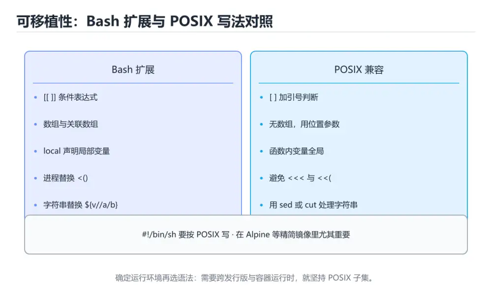
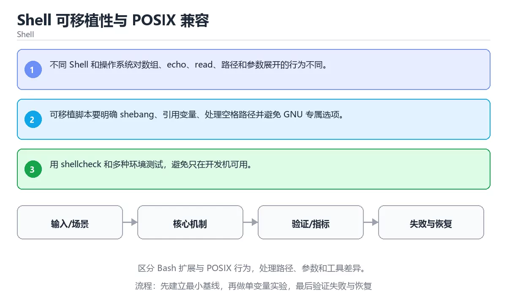

# Shell 可移植性与 POSIX 兼容





> 内容更新时间：2026-10-06 · 学习阶段：高级 · 预计用时：45 分钟

## 本节知识框架

**课程定位**：所属分类为「Shell」，课程主题为「Shell 可移植性与 POSIX 兼容」，学习阶段为「高级」，建议用时 45 分钟。

**本课要解决的主问题**：区分 Bash 扩展与 POSIX 行为，处理路径、参数和工具差异。

| 学习层次 | 要回答的问题 | 完成判据 |
| --- | --- | --- |
| 概念层 | 「Shell 可移植性与 POSIX 兼容」有哪些必须区分的对象与术语？ | 能用自己的话定义核心术语，并各举一个正例和一个反例。 |
| 机制层 | 这些对象按什么顺序发生作用，输入如何变成输出？ | 能画出或写出机制步骤，并说明每一步的失败条件。 |
| 应用层 | 什么场景适合使用「Shell 可移植性与 POSIX 兼容」，什么场景不适合？ | 能给出一个真实场景、一个最小示例和一个边界案例。 |
| 性能层 | 时间、空间、吞吐或延迟受哪些量影响？ | 能说出复杂度或性能瓶颈的证据来源；没有证据时明确写“材料未提供”。 |
| 复习层 | 怎样确认自己不是只记住了结论？ | 能独立完成本课自测，并把错误定位到概念、机制、示例或边界。 |

### 阅读路线

1. 先读「核心概念定义」，建立「POSIX」等对象的精确定义。
2. 再读「原理与运行机制」，把定义串成可重复的过程。
3. 用「代码/协议/SQL 示例」验证过程，并只改一个条件观察结果变化。
4. 最后检查性能、易错点、知识关系与自测题，形成可复习的证据链。

**前置知识**：《实战：Shell 日志分析与告警》

**学习位置**：本课位于《实战：Shell 日志分析与告警》之后；如果前一课的自测不能通过，应先回补再继续。

**后续衔接**：下一课《Shell 脚本安全加固（进阶）》会继续使用本课术语，学完后建议立即完成一次自测。

**教材衔接：学习目标**

- 能用自己的话解释：不同 Shell 和操作系统对数组、echo、read、路径和参数展开的行为不同。
- 能用自己的话解释：可移植脚本要明确 shebang、引用变量、处理空格路径并避免 GNU 专属选项。
- 能用自己的话解释：用 shellcheck 和多种环境测试，避免只在开发机可用。
- 能把本课知识放回「Shell」，并完成练习与测验。

**教材衔接：前置知识**

- 具备本分类的前置知识，能跑通「Shell 可移植性与 POSIX 兼容」的示例并解释输出。
- 本课关键词：POSIX、可移植性、路径、参数。
- 遇到不熟悉的术语先记录问题，完成练习后再回读。

**教材衔接：本课小结**

- 本课围绕 POSIX、可移植性、路径、参数 展开，复习时重点核对它们的输入、输出和失败路径。
- 把还不确定的 missing 行为写成一条可执行验证，再进入下一课。

## 核心概念定义

> 阅读约定：本课先给「Shell 可移植性与 POSIX 兼容」相关术语的操作性定义与适用边界；正文里的口语化说法与定义冲突时，以定义和可复现示例为准。

| 术语 | 操作性定义 | 本课中的边界 |
| --- | --- | --- |
| POSIX | 可移植操作系统接口标准：按它写 shell 与系统调用，才能在 bash、dash 等不同实现上通用。 | 仅在「Shell 可移植性与 POSIX 兼容」明确给出的输入、版本与资源条件下成立。 |
| 可移植性 | 代码在不同系统、Shell 或硬件环境中保持可运行，关键是避免依赖未约定的行为。 | 仅在「Shell 可移植性与 POSIX 兼容」明确给出的输入、版本与资源条件下成立。 |
| 路径 | 文件、URL 或依赖中从起点到目标的定位序列。 | 仅在「Shell 可移植性与 POSIX 兼容」明确给出的输入、版本与资源条件下成立。 |
| 参数 | 传给函数、命令或模板的输入值，决定其行为和输出。 | 仅在「Shell 可移植性与 POSIX 兼容」明确给出的输入、版本与资源条件下成立。 |
| Shell | 接收命令并调用操作系统程序的命令行解释器与脚本环境 | 仅在「Shell 可移植性与 POSIX 兼容」明确给出的输入、版本与资源条件下成立。 |

### 定义如何使用

在「Shell 可移植性与 POSIX 兼容」中判断一个说法是否成立，先确认它使用的是哪个对象的定义，再检查输入规模、运行环境与失败路径。定义不是口号，而是后续推导、代码示例和自测题共享的约束。

## 原理与运行机制

### 机制总览

1. **建立输入**：把「POSIX」按本课定义整理成可观察、可重复的输入条件。
2. **执行转换**：围绕「可移植性」执行本课的核心步骤；每一步都记录中间状态，避免只看最终输出。
3. **产生输出**：得到「路径」后，用正文示例或协议/SQL 结果核对输出是否符合预期。
4. **改变一个条件**：只替换一个边界条件或环境参数，观察「Shell 可移植性与 POSIX 兼容」的结论是否仍然成立。

| 阶段 | 关注对象 | 失败时应检查 |
| --- | --- | --- |
| 输入 | POSIX | 类型、范围、编码、版本或前置状态是否满足定义。 |
| 处理 | 可移植性 | 顺序、可见性、锁、路由、事务或调度规则是否被破坏。 |
| 输出 | 路径 | 结果是否可复现，错误是否被正确传播而不是被吞掉。 |

本课的机制结论要用「Shell 可移植性与 POSIX 兼容」自己的示例验证。「Shell 可移植性与 POSIX 兼容」没有给出某个数量级、吞吐或内存数据时，本课把该判断标为“材料未提供”，不从相邻主题外推。

**教材衔接：核心知识**

### 1. 不同 Shell 和操作系统对数组、echo、read、路径和参数展开的行为不同。

- 关键做法：先让 POSIX 的最小示例可复现，再加入并发或规模条件。
- 验证标准：missing 的输出能被他人复现，边界输入有对应用例。

### 2. 可移植脚本要明确 shebang、引用变量、处理空格路径并避免 GNU 专属选项。

把这条结论放回「Shell 可移植性与 POSIX 兼容」的完整流程里展开：

- 正文依据：能用自己的话解释：不同 Shell 和操作系统对数组、echo、read、路径和参数展开的行为不同。
- 落地检查：把「2. 可移植脚本要明确 shebang、引用变量、处理空格路径并避免 GNU 专属选项。」改写成一条可执行的核对项，逐条验证输入、超时与失败路径。

### 3. 用 shellcheck 和多种环境测试，避免只在开发机可用。

把这条结论放回「Shell 可移植性与 POSIX 兼容」的完整流程里展开：

- 正文依据：能用自己的话解释：可移植脚本要明确 shebang、引用变量、处理空格路径并避免 GNU 专属选项。
- 落地检查：把「3. 用 shellcheck 和多种环境测试，避免只在开发机可用。」改写成一条可执行的核对项，逐条验证输入、超时与失败路径。

**教材衔接：关键流程**

```text
输入 → 校验 → 核心处理 → 验证 → 记录指标 → 失败恢复
```

**教材衔接：实践路径**

1. 用一句话复述本课要解决的问题。
2. 跑通正文中的最小示例并记录基线。
3. 只改变一个输入或参数，预测并验证结果。
4. 补一个失败路径，记录错误、恢复和指标。
5. 把结论写成可复现的笔记或测试。

**教材衔接：版本与时效**

- 版本提示：POSIX 的行为在最近几个大版本里有过调整，升级「Shell 可移植性与 POSIX 兼容」前先用 missing 复现当前输出，再对照官方发布说明逐条核对。
- 升级前确认 POSIX 的兼容范围，把不可回退的改动单独拆成一次提交。

### 升级检查清单

- 先固定当前版本，跑通全部示例与测验，再升级工具链。
- 一次只改一个版本条件，把 POSIX 相关的差异单独记成一条结论。
- 先回归 POSIX 与 可移植性 的默认行为和错误信息，再扩大测试范围。
- 升级后把 missing 的实测版本写进「内容元数据」，再更新复核日期。

**教材衔接：零基础精讲：把Shell 可移植性与 POSIX 兼容真正讲透**

### 先建立一个直觉

本课的摘要可以当作一张地图：区分 Bash 扩展与 POSIX 行为，处理路径、参数和工具差异。

### 逐步拆解

1. 澄清输入与目标。先写清「Shell 可移植性与 POSIX 兼容」要解决的问题、合法输入范围和成功标准，再进入后续步骤。
2. 描述处理过程。把「POSIX、可移植性、路径、参数」映射到具体步骤，每步都要求能单独验证。
3. 定义输出。把 missing 的返回值、日志和失败信号都写清楚，缺一项都不算完整。
4. 制造一次可移植性的失败输入，确认错误出现在「核心知识」的哪一步，并写下恢复后如何验证状态已回到一致。
5. 用 missing 构造一个最小反例，证明「Shell 可移植性与 POSIX 兼容」的结论有边界。

### 把正文串成一条执行链

- **1. 不同 Shell 和操作系统对数组、echo、read、路径和参数展开的行为不同。**：在「Shell 可移植性与 POSIX 兼容」里，「1. 不同 Shell 和操作系统对数组、echo、read、路径和参数展开的行为不同。」这一步要先写清输入与预期，再记录实际结果和差异；结果不符时回到对应小节核对前提。
- **2. 可移植脚本要明确 shebang、引用变量、处理空格路径并避免 GNU 专属选项。**：在「Shell 可移植性与 POSIX 兼容」里，「2. 可移植脚本要明确 shebang、引用变量、处理空格路径并避免 GNU 专属选项。」这一步要先写清输入与预期，再记录实际结果和差异；结果不符时回到对应小节核对前提。
- **3. 用 shellcheck 和多种环境测试，避免只在开发机可用。**：在「Shell 可移植性与 POSIX 兼容」里，「3. 用 shellcheck 和多种环境测试，避免只在开发机可用。」这一步要先写清输入与预期，再记录实际结果和差异；结果不符时回到对应小节核对前提。
- **考点 1：核心知识 的代码阅读题**：先独立作答，再回到本课正文核对 missing 的执行路径；答错时记录是哪一个前提被忽略。
- **考点 2：关于「可移植脚本要明确 shebang、引用变量、处理空格路径并避免 GNU 专属选项。」，下列说法正确的是？**：先独立作答，再回到本课对应小节核对判断依据；答错时记录是哪一个前提被忽略。
- **考点 3：关于「用 shellcheck 和多种环境测试，避免只在开发机可用。」，下列说法正确的是？**：先独立作答，再回到本课对应小节核对判断依据；答错时记录是哪一个前提被忽略。

### 从测验反推易错点

**检查点 1：关于「不同 Shell 和操作系统对数组、echo、read、路径和参数展开的行为不同。」，下列说法正确的是？**

- 参考判断：不同 Shell 和操作系统对数组、echo、read、路径和参数展开的行为不同。
- 自问：如果去掉题干里的一个限定词，结论还成立吗？

**检查点 2：关于「可移植脚本要明确 shebang、引用变量、处理空格路径并避免 GNU 专属选项。」，下列说法正确的是？**

- 参考判断：可移植脚本要明确 shebang、引用变量、处理空格路径并避免 GNU 专属选项。

**检查点 3：关于「用 shellcheck 和多种环境测试，避免只在开发机可用。」，下列说法正确的是？**

- 参考判断：用 shellcheck 和多种环境测试，避免只在开发机可用。

**检查点 4：本课的核心学习目标是什么？**

- 参考判断：区分 Bash 扩展与 POSIX 行为，处理路径

**检查点 5：以下哪些术语与Shell 可移植性与 POSIX 兼容直接相关？（多选）**

- 参考判断：POSIX、可移植性

### 工程排错顺序

| 先查什么 | 要得到的证据 | 判断标准 |
| --- | --- | --- |
| 输入与前提是否满足 | 日志、输入样例、测试或指标 | 能复现并解释，才算定位 |
| 核心步骤是否产生了预期中间结果 | 日志、输入样例、测试或指标 | 能复现并解释，才算定位 |
| 失败路径是否可观测、可恢复 | 日志、输入样例、测试或指标 | 能复现并解释，才算定位 |
| 资源、权限与成本是否在预算内 | 日志、输入样例、测试或指标 | 能复现并解释，才算定位 |

### 变式训练

1. 先用一个单文件示例验证 missing，确认正确性后再引入框架或分布式组件。
2. 把 missing 的数据量提高一个数量级，观察延迟与内存的变化拐点。
3. 让 missing 的外部依赖超时，确认系统能回滚或补偿，而不是留下脏数据。
5. 把「Shell 可移植性与 POSIX 兼容」里最容易被省略的一步去掉，用测试或指标证明它不可省略，而不是凭感觉判断。
6. 在低带宽或低算力条件下重跑 可移植性，记录降级路径是否仍然可用。

### 本课自测

- [ ] 能用一句话解释「POSIX」在本课中的角色与边界。
- [ ] 能举出一个正常例子和一个失败例子。
- [ ] 能说出最小验证步骤，以及需要记录的证据。
- [ ] 能用一句话解释「可移植性」在本课中的角色与边界。
- [ ] 能用一句话解释「路径」在本课中的角色与边界。
- [ ] 能用一句话解释「参数」在本课中的角色与边界。

### 迁移案例库

换一个 可移植性 约束重做一次，确认结论在新条件下是否仍然成立。

#### 迁移案例 1：围绕「POSIX」做一次小实验

**目标**：在不改变课程主体的前提下，验证Shell 可移植性与 POSIX 兼容中的一个关键判断。

**步骤**：
1. 复述当前方案对「POSIX」的假设，写成一句可证伪的话。
2. 设计一个正常输入和一个边界输入，分别预测输出。
3. 运行或逐步演算，记录实际输出、耗时和失败信息。
4. 只调整一个参数，比较前后差异并解释原因。
5. 补充一条测试或复习卡，确保下次能更快复现。

**验收**：把「Shell 可移植性与 POSIX 兼容」的判断依据写成可复现步骤，换一台机器或换一个输入仍能得到同一结论。

#### 迁移案例 2：围绕「可移植性」做一次小实验

**步骤**：
1. 复述当前方案对「可移植性」的假设，写成一句可证伪的话。

#### 迁移案例 3：围绕「路径」做一次小实验

**步骤**：
1. 复述当前方案对「路径」的假设，写成一句可证伪的话。

#### 迁移案例 4：围绕「参数」做一次小实验

**步骤**：
1. 复述当前方案对「参数」的假设，写成一句可证伪的话。

#### 迁移案例 5：围绕「POSIX」做一次小实验

**步骤**：

#### 迁移案例 6：围绕「可移植性」做一次小实验

**步骤**：

#### 迁移案例 7：围绕「路径」做一次小实验

**步骤**：

#### 迁移案例 8：围绕「参数」做一次小实验

**步骤**：

#### 迁移案例 9：围绕「POSIX」做一次小实验

**步骤**：

#### 迁移案例 10：围绕「可移植性」做一次小实验

**步骤**：

#### 迁移案例 11：围绕「路径」做一次小实验

**步骤**：

#### 迁移案例 12：围绕「参数」做一次小实验

**步骤**：

#### 迁移案例 13：围绕「POSIX」做一次小实验

**步骤**：

#### 迁移案例 14：围绕「可移植性」做一次小实验

**步骤**：

#### 迁移案例 15：围绕「路径」做一次小实验

**步骤**：

#### 迁移案例 16：围绕「参数」做一次小实验

**步骤**：

<!-- p0-depth-v2:end -->

**教材衔接：验证步骤**

1. 记录运行环境、命令和真实输出。
2. 修改一个输入，先写预测再运行。
4. 把结论写回本课笔记或测试用例。

## 典型应用场景

| 场景 | 典型输入或前提 | 期望产物 |
| --- | --- | --- |
| 学习验证 | 使用本课最小示例和 POSIX、可移植性 | 能复现正文结论，并解释每一步。 |
| 工程落地 | 把「Shell 可移植性与 POSIX 兼容」放入真实模块或服务边界 | 输出可观测、失败可定位、参数可配置。 |
| 故障排查 | 只改一个版本、规模、输入或依赖条件 | 能区分概念错误、实现错误和环境差异。 |

判断「Shell 可移植性与 POSIX 兼容」的场景是否成立，标准是能否写出输入、处理、输出和失败路径；材料中没有出现的数据在本课标注为“材料未提供”，不用推测替代证据。

**课程内置实验入口**：`sandbox:bash`，用于动手验证《Shell 可移植性与 POSIX 兼容》的机制；实验结论不替代概念定义与复杂度分析。

## 代码/协议/SQL 示例

### 最小可验证示例

下面保留《Shell 可移植性与 POSIX 兼容》原文中的最小示例。先预测《Shell 可移植性与 POSIX 兼容》示例的输出，再按正文步骤运行或推演；示例依赖外部环境时，同时记录版本与输入。

```text
输入 → 校验 → 核心处理 → 验证 → 记录指标 → 失败恢复
```

**教材衔接：最小可运行示例**

下面示例用于验证 POSIX 的最小输入、处理和输出。先原样运行，再只修改一个值：

```bash
#!/bin/sh
set -eu

path="${1:-/tmp}"
if [ -d "$path" ]; then
  printf 'dir: %s\n' "$path"
else
  printf 'missing: %s\n' "$path"
fi
```

**教材衔接：预期输出**

```text
dir: /tmp
```

## 时间/空间复杂度或性能分析

**复杂度证据**：「Shell 可移植性与 POSIX 兼容」的现有材料没有给出渐近时间或空间复杂度的明确结论，本课只做定性检查，不补写未经验证的 $O$ 记号。

| 维度 | 本课关注点 | 判断依据 |
| --- | --- | --- |
| 时间/延迟 | 「Shell 可移植性与 POSIX 兼容」的主要步骤是否会随输入规模、并发度或网络往返增长。 | 以正文复杂度、基准数据或可重复测量为准。 |
| 空间/内存 | 中间状态、缓存、副本、连接或索引是否随规模增长。 | 记录峰值内存与数据副本，不只看最终结果。 |
| 吞吐/资源 | 版本、调度、锁、IO、序列化或协议开销是否成为瓶颈。 | 固定环境做对照实验，改变一个变量。 |

评估「Shell 可移植性与 POSIX 兼容」时要区分“正确性成立”和“性能达标”两件事；材料没有给出基准时，本课只保留量级来源与测量方法，不写不可验证的绝对数字。

## 常见误区与易错点

> 复核《Shell 可移植性与 POSIX 兼容》的易错点时，优先保留原文的错误表、故障现场与排错路径；每条修正都要能用本课示例复验。

| 易错点 | 常见表现 | 正确做法 |
| --- | --- | --- |
| 只背结论 | 能复述「Shell 可移植性与 POSIX 兼容」的定义，却说不清输入、输出与边界。 | 回到机制步骤，用最小示例逐一验证。 |
| 混淆相邻概念 | 把本课对象与相邻主题的对象当成同一类。 | 先比较定义、资源归属、生命周期和失败模式。 |
| 忽略版本与环境 | 在开发机通过后直接外推到生产环境。 | 固定版本、输入和资源条件，再记录可复现结果。 |

**教材衔接：常见错误与排查**

> 说明：本表由《Shell 可移植性与 POSIX 兼容》的核心知识整理（2026-10-07），人工复核进度见 docs/content_review_batches.md。

| 易错点 | 容易踩的做法 | 正确结论 |
| --- | --- | --- |
| 依赖特定解释器扩展 | 换环境脚本直接报错 | 明确目标解释器，必要时只用基础语法 |
| 假设命令选项一致 | 换平台行为不同 | 查手册确认选项，必要时使用可移植写法 |
| 依赖特定路径与工具 | 环境缺失时失败难懂 | 运行前检查依赖并给出清晰提示 |

**教材衔接：故障现场**

### 现场 1：依赖特定解释器扩展

**症状**：在《Shell 可移植性与 POSIX 兼容》的复现场景中，换环境脚本直接报错。

**根因**：“换环境脚本直接报错”只是表层结果。向上追溯会落到“依赖特定解释器扩展”这一步，因为它省略了《Shell 可移植性与 POSIX 兼容》的约束，使实现行为和预期模型发生了偏离。

**修复**：针对《Shell 可移植性与 POSIX 兼容》的问题，明确目标解释器，必要时只用基础语法。

**验证**：保留《Shell 可移植性与 POSIX 兼容》里触发“换环境脚本直接报错”的输入、版本和日志，按“明确目标解释器，必要时只用基础语法”完成修改后原样重放；只有失败现象消失且相邻场景仍可解释，才保留改动。

### 现场 2：假设命令选项一致

**症状**：在《Shell 可移植性与 POSIX 兼容》的复现场景中，换平台行为不同。

**根因**：触发点是把“假设命令选项一致”当成安全做法。它没有满足《Shell 可移植性与 POSIX 兼容》要求的前提，因此先表现为“换平台行为不同”；排查时先完整复现这一段，再核对输入、配置与依赖。

**修复**：针对《Shell 可移植性与 POSIX 兼容》的问题，查手册确认选项，必要时使用可移植写法。

**验证**：在《Shell 可移植性与 POSIX 兼容》中按“查手册确认选项，必要时使用可移植写法”调整后，从“假设命令选项一致”的触发条件重放同一条路径，确认“换平台行为不同”不再出现，并补一个相邻边界用例检查没有引入新问题。

### 现场 3：依赖特定路径与工具

**症状**：在《Shell 可移植性与 POSIX 兼容》的复现场景中，环境缺失时失败难懂。

**根因**：“环境缺失时失败难懂”只是表层结果。向上追溯会落到“依赖特定路径与工具”这一步，因为它省略了《Shell 可移植性与 POSIX 兼容》的约束，使实现行为和预期模型发生了偏离。

**修复**：针对《Shell 可移植性与 POSIX 兼容》的问题，运行前检查依赖并给出清晰提示。

**验证**：保留《Shell 可移植性与 POSIX 兼容》里触发“环境缺失时失败难懂”的输入、版本和日志，按“运行前检查依赖并给出清晰提示”完成修改后原样重放；只有失败现象消失且相邻场景仍可解释，才保留改动。

## 与其他知识点的关系

| 关系 | 课程 | 为什么 |
| --- | --- | --- |
| 先修 | 《实战：Shell 日志分析与告警》 | 本课会直接使用它的概念或操作前提。 |
| 关联 | 《Shell 脚本安全加固（进阶）》 | 用于横向比较或把本课结论迁移到相邻主题。 |
| 前置顺序 | 《实战：Shell 日志分析与告警》 | 同分类中安排在本课之前，建议先完成其自测。 |
| 后续顺序 | 《Shell 脚本安全加固（进阶）》 | 同分类中安排在本课之后，会继续使用本课术语。 |

把「Shell 可移植性与 POSIX 兼容」放回知识体系时，不只要记住“前面学过什么”，还要说明两个主题在输入、机制、资源边界和失败模式上的差异。这样才能把单课知识迁移到项目、排障和后续课程。

**教材衔接：复习与迁移**

复习目标：把「Shell 可移植性与 POSIX 兼容」的判断标准放回可复现的例子里。先自己作答，再对照依据；如果结论正确但理由不完整，回到正文补足前提。

### 概念复述

- 用一句话说明「Shell 可移植性与 POSIX 兼容」解决什么问题：区分 Bash 扩展与 POSIX 行为，处理路径、参数和工具差异。
- 写出POSIX、可移植性、路径之间的关系，并各举一个例子。
- 说出本课最容易混淆的两个概念，以及区分它们的判据。

### 正文逐节复核

- **零基础精讲：把Shell 可移植性与 POSIX 兼容真正讲透**：本课的摘要可以当作一张地图：区分 Bash 扩展与 POSIX 行为，处理路径、参数和工具差异。

### 测验回顾

1. 阅读「Shell 可移植性与 POSIX 兼容」中的这段 Shell 代码，下面哪项判断最准确？
   - 依据：在「Shell 可移植性与 POSIX 兼容」里，这段 Shell 代码来自本课的本地示例，主要用来核对 POSIX、可移植性、路径、参数 之间的输入、处理和输出关系，区分 Bash 扩展与 POSIX 行为，处理路径、参数和工具差异。把“区分 Bash 扩展与 POSIX 行为”代回「Shell 可移植性与 POSIX 兼容」里“阅读Shell 可移植性与 POSIX 兼容中的这段 She”的例子核对，条件一旦改变，结论就要用POSIX、可移植性、路径重新推导。
2. 关于「可移植脚本要明确 shebang、引用变量、处理空格路径并避免 GNU 专属选项。」，下列说法正确的是？
   - 依据：在「Shell 可移植性与 POSIX 兼容」里，可移植脚本要明确 shebang、引用变量、处理空格路径并避免 GNU 专属选项。“可移植脚本要明确”与「Shell 可移植性与 POSIX 兼容」的术语表相呼应，只有符合POSIX、可移植性、路径约束的“可移植脚本要明确 shebang”才是正文支持的结论。
3. 关于「用 shellcheck 和多种环境测试，避免只在开发机可用。」，下列说法正确的是？
   - 依据：在「Shell 可移植性与 POSIX 兼容」里，用 shellcheck 和多种环境测试，避免只在开发机可用。在「Shell 可移植性与 POSIX 兼容」里，如果只凭关键词作答，很容易把只要小数据能跑通，大规模和异常情况也一定正确。「Shell 可移植性与 POSIX 兼容」要求先交代POSIX、可移植性、路径的前提再下结论，所以“用 shellcheck 和多种环境测试”只在题干“用 shellcheck 和多种环境测试”给定的条件下成立。
4. 「Shell 可移植性与 POSIX 兼容」的核心学习目标是什么？
   - 依据：结论应落在区分 Bash 扩展与 POSIX 行为。在「Shell 可移植性与 POSIX 兼容」里，这道题要求区分概念与边界，区分 Bash 扩展与 POSIX 行为，处理路径只有在题干给出的前提下才成立，而覆盖命令注入、权限、临时文件、密钥和危险命令保护。在「Shell 可移植性与 POSIX 兼容」里，构建带重试、并发、日志、指标和幂等的自动化脚本。
5. 以下哪些术语与「Shell 可移植性与 POSIX 兼容」直接相关？（多选）
   - 依据：在「Shell 可移植性与 POSIX 兼容」里判断这道题，要把POSIX、可移植性、路径的条件、过程与失败路径逐项对齐，换成“以下哪些术语与Shell 可移植性与”这个场景，只有满足前提的结论才成立。回到「Shell 可移植性与 POSIX 兼容」的正文示例，用“以下哪些术语与Shell 可移植性与”走一遍POSIX、可移植性、路径的完整流程，能复现的结论才可以保留。
6. 按照「Shell 可移植性与 POSIX 兼容」从概念到实践的讲解顺序排列下列主题。
   - 依据：结合POSIX、可移植性来看，正确的执行顺序是「核心知识 → 关键流程 → 实践路径 → 常见误区」。本课围绕区分 Bash 扩展与 POSIX 行为，处理路径、参数和工具差异。这道题的关键在「Shell 可移植性与 POSIX 兼容」的POSIX、可移植性、路径：先确认题干“按照Shell 可移植性与 POSI”问的是哪一步，再排除偷换前提的选项。

### 迁移练习

把「Shell 可移植性与 POSIX 兼容」的结论迁移到相邻主题，每次迁移都写清预测与证据：

1. 换输入：用POSIX处理一组你自己的数据，对比教材示例的结果差异。
2. 换失败条件：制造一个可移植性相关的错误，说明如何从错误信息定位根因。
3. 换规模：把数据量或并发度提高一个数量级，说明「Shell 可移植性与 POSIX 兼容」的结论是否仍成立。

## 自测题与参考答案

> 先独立作答《Shell 可移植性与 POSIX 兼容》的自测题，再对照答案与解析；每处判断都要能在本课正文或示例中找到依据。

### 自测 1

阅读「Shell 可移植性与 POSIX 兼容」中的这段 Shell 代码，下面哪项判断最准确？

```shell
#!/bin/sh
set -eu

path="${1:-/tmp}"
if [ -d "$path" ]; then
  printf 'dir: %s\n' "$path"
else
  printf 'missing: %s\n' "$path"
fi
```

A. 这段 Shell 代码只展示语法，不会读取任何输入或产生可验证输出。
B. POSIX、可移植性、路径 的结论只取决于关键字数量，与代码的控制流和边界条件无关。
C. 区分 Bash 扩展与 POSIX 行为，处理路径、参数和工具差异。
D. 它说明 POSIX、可移植性、路径 只需要记忆结论，不需要记录版本、输入与运行结果。

**参考答案**：区分 Bash 扩展与 POSIX 行为，处理路径、参数和工具差异。

**解析**：在「Shell 可移植性与 POSIX 兼容」里，这段 Shell 代码来自本课的本地示例，主要用来核对 POSIX、可移植性、路径、参数 之间的输入、处理和输出关系，区分 Bash 扩展与 POSIX 行为，处理路径、参数和工具差异。把“区分 Bash 扩展与 POSIX 行为”代回「Shell 可移植性与 POSIX 兼容」里“阅读Shell 可移植性与 POSIX 兼容中的这段 She”的例子核对，条件一旦改变，结论就要用POSIX、可移植性、路径重新推导。

### 自测 2

关于「可移植脚本要明确 shebang、引用变量、处理空格路径并避免 GNU 专属选项。」，下列说法正确的是？

A. 只要小数据能跑通，大规模和异常情况也一定正确。
B. 可移植脚本要明确 shebang，引用变量
C. 临时文件用 mktemp 并设置权限，结束时清理，避免符号链接攻击。
D. 并发要限制数量并汇总退出码，失败时停止或隔离问题任务。

**参考答案**：可移植脚本要明确 shebang，引用变量

**解析**：在「Shell 可移植性与 POSIX 兼容」里，可移植脚本要明确 shebang，引用变量“可移植脚本要明确”与「Shell 可移植性与 POSIX 兼容」的术语表相呼应，只有符合POSIX、可移植性、路径约束的“可移植脚本要明确 shebang”才是正文支持的结论。

### 自测 3

以下哪些术语与「Shell 可移植性与 POSIX 兼容」直接相关？（多选）

A. POSIX
B. 表驱动
C. 可移植性
D. 装箱

**参考答案**：POSIX；可移植性

**解析**：在「Shell 可移植性与 POSIX 兼容」里判断这道题，要把POSIX、可移植性、路径的条件、过程与失败路径逐项对齐，换成“以下哪些术语与Shell 可移植性与”这个场景，只有满足前提的结论才成立。回到「Shell 可移植性与 POSIX 兼容」的正文示例，用“以下哪些术语与Shell 可移植性与”走一遍POSIX、可移植性、路径的完整流程，能复现的结论才可以保留。

**教材衔接：动手练习**

1. 合上教程，用 3～5 句话解释Shell 可移植性与 POSIX 兼容。
2. 从正文选一个例子，改变一个条件并预测结果。
3. 设计一个失败场景，写出止损与恢复步骤。

**验收标准**：留下输入、命令、输出、差异和下一步问题。

**教材衔接：可运行练习**

### 任务 1：先跑通，再解释

```bash
#!/bin/sh
set -eu

path="${1:-/tmp}"
if [ -d "$path" ]; then
  printf 'dir: %s\n' "$path"
else
  printf 'missing: %s\n' "$path"
fi
```

### 任务 2：只改一个条件

把「Shell 可移植性与 POSIX 兼容」的最小示例复制一份，只改一个条件再跑一次：

- 改动点：只调整 missing 的一个参数，其余条件一律不动。
- 预测：先写下「Shell 可移植性与 POSIX 兼容」在改动后的输出或错误信息，再运行。
- 记录：对照改动前后的结果，指出差异出在哪一步。
- 验收：换回原条件能复现原结果，改动只影响POSIX。

### 任务 3：迁移到自己的数据

换一个 可移植性 场景重做一次，确认结论不是只对示例数据成立。

**教材衔接：本课复习清单**

离开本课前，逐项确认：

- [ ] 不看解析，能说出「阅读「Shell 可移植性与 POSIX 兼容」中的这段 Shell 代码，下面哪项判断最准确？」的判断依据。
- [ ] 不看解析，能说出「关于「可移植脚本要明确 shebang、引用变量、处理空格路径并避免 GNU 专属选项。」，下列说法正确的是？」的判断依据。
- [ ] 不看解析，能说出「关于「用 shellcheck 和多种环境测试，避免只在开发机可用。」，下列说法正确的是？」的判断依据。
- [ ] 至少运行一次《Shell 可移植性与 POSIX 兼容》的示例，记录输入、输出和一个边界情况。
- [ ] 把本课最容易混淆的两个概念写成一句话对照。

| 复盘项 | 记录 |
| --- | --- |
| 已经能独立解释的考点 |  |
| 仍然说不清的概念 |  |
| 下一步验证动作 |  |

**教材衔接：复习与自测**

下面按正文顺序回顾「Shell 可移植性与 POSIX 兼容」的每一节；说不清的地方回到 核心知识 补课。

### 核心知识

自检：这一节与相邻主题的边界在哪里？

### 动手练习

自检：如果去掉这一节里的一个前提，结论会怎样变化？

### 最小可运行示例

```bash
#!/bin/sh
set -eu

path="${1:-/tmp}"
if [ -d "$path" ]; then
  printf 'dir: %s\n' "$path"
else
  printf 'missing: %s\n' "$path"
fi
```

自检：把这一节讲给没学过的人，最需要强调哪一点？

### 预期输出

```text
dir: /tmp
```

### 验证步骤

制造一次错误输入，记录错误信息与修复方式。

---

## 术语速查

| 术语 | 一句话说明 |
| --- | --- |
| `POSIX` | 可移植操作系统接口标准：按它写 shell 与系统调用，才能在 bash、dash 等不同实现上通用。 |
| `可移植性` | 代码在不同系统、Shell 或硬件环境中保持可运行，关键是避免依赖未约定的行为。 |
| `路径` | 文件、URL 或依赖中从起点到目标的定位序列。 |
| `参数` | 传给函数、命令或模板的输入值，决定其行为和输出。 |
| `Shell` | 接收命令并调用操作系统程序的命令行解释器与脚本环境 |

## 考点精讲

### 考点 1：代码补全·POSIX

- **题目**：阅读「Shell 可移植性与 POSIX 兼容」中的这段 Shell 代码，下面哪项判断最准确？
- **判断依据**：在「Shell 可移植性与 POSIX 兼容」里，这段 Shell 代码来自本课的本地示例，主要用来核对 POSIX、可移植性、路径、参数 之间的输入、处理和输出关系，区分 Bash 扩展与 POSIX 行为，处理路径、参数和工具差异。把“区分 Bash 扩展与 POSIX 行为”代回「Shell 可移植性与 POSIX 兼容」里“阅读Shell 可移植性与 POSIX 兼容中的这段 She”的例子核对，条件一旦改变，结论就要用POSIX、可移植性、路径重新推导。

### 考点 2：概念判断·POSIX

- **题目**：关于「可移植脚本要明确 shebang、引用变量、处理空格路径并避免 GNU 专属选项。」，下列说法正确的是？
- **判断依据**：在「Shell 可移植性与 POSIX 兼容」里，可移植脚本要明确 shebang，引用变量“可移植脚本要明确”与「Shell 可移植性与 POSIX 兼容」的术语表相呼应，只有符合POSIX、可移植性、路径约束的“可移植脚本要明确 shebang”才是正文支持的结论。

### 考点 3：概念判断·POSIX

- **题目**：关于「用 shellcheck 和多种环境测试，避免只在开发机可用。」，下列说法正确的是？
- **判断依据**：在「Shell 可移植性与 POSIX 兼容」里，用 shellcheck 和多种环境测试，避免只在开发机可用。在「Shell 可移植性与 POSIX 兼容」里，如果只凭关键词作答，很容易把只要小数据能跑通，大规模和异常情况也一定正确。「Shell 可移植性与 POSIX 兼容」要求先交代POSIX、可移植性、路径的前提再下结论，所以“用 shellcheck 和多种环境测试”只在题干“用 shellcheck 和多种环境测试”给定的条件下成立。

### 考点 4：概念判断·POSIX

- **题目**：「Shell 可移植性与 POSIX 兼容」的核心学习目标是什么？
- **判断依据**：结论应落在区分 Bash 扩展与 POSIX 行为。在「Shell 可移植性与 POSIX 兼容」里，这道题要求区分概念与边界，区分 Bash 扩展与 POSIX 行为，处理路径只有在题干给出的前提下才成立，而覆盖命令注入、权限、临时文件、密钥和危险命令保护。在「Shell 可移植性与 POSIX 兼容」里，构建带重试、并发、日志、指标和幂等的自动化脚本。

### 考点 5：多选辨析·POSIX

- **题目**：以下哪些术语与「Shell 可移植性与 POSIX 兼容」直接相关？（多选）
- **判断依据**：在「Shell 可移植性与 POSIX 兼容」里判断这道题，要把POSIX、可移植性、路径的条件、过程与失败路径逐项对齐，换成“以下哪些术语与Shell 可移植性与”这个场景，只有满足前提的结论才成立。回到「Shell 可移植性与 POSIX 兼容」的正文示例，用“以下哪些术语与Shell 可移植性与”走一遍POSIX、可移植性、路径的完整流程，能复现的结论才可以保留。

### 考点 6：顺序排列·POSIX

- **题目**：按照「Shell 可移植性与 POSIX 兼容」从概念到实践的讲解顺序排列下列主题。
- **判断依据**：结合POSIX、可移植性来看，正确的执行顺序是「核心知识 → 关键流程 → 实践路径 → 常见误区」。本课围绕区分 Bash 扩展与 POSIX 行为，处理路径、参数和工具差异。这道题的关键在「Shell 可移植性与 POSIX 兼容」的POSIX、可移植性、路径：先确认题干“按照Shell 可移植性与 POSI”问的是哪一步，再排除偷换前提的选项。

## English Overview

**Title:** Shell Portability and POSIX Compatibility

**Summary:** Separate Bash extensions from POSIX behavior and handle tool differences.

**Category:** Shell
**Level:** 高级
**Key terms:** POSIX, 可移植性, 路径, 参数

## 内容元数据

- 内容版本：v2.0
- 最后更新：2026-10-06
- 学习阶段：高级
- 适用环境：Bash 5 / POSIX Shell；本课聚焦 POSIX。
- 内容来源：内置结构化课程与工程实践整理
- 相关主题：POSIX、可移植性、路径、参数
- 质量版本：P0 测验标准 + P1 覆盖扩展 + P2 体验补全

## 参考资料与复核

- 最后复核：2026-10-04
- 下次复核：2027-02-10
- 复核范围：版本兼容、API 行为、安全建议与工程实践
- 来源性质：官方文档、标准或权威教材；正文为离线教学重组

| 参考资料 | 本课用途 |
| --- | --- |
| [POSIX Shell 标准](https://pubs.opengroup.org/onlinepubs/9799919799/utilities/V3_chap02.html) | 可移植 Shell 语法 |
| [GNU Coreutils](https://www.gnu.org/software/coreutils/manual/) | 文件、文本与进程工具 |
| [GNU sed](https://www.gnu.org/software/sed/manual/sed.html) | 流式文本替换 |

> 「Shell 可移植性与 POSIX 兼容」的链接用于离线阅读后的延伸核对；App 不会自动联网。
