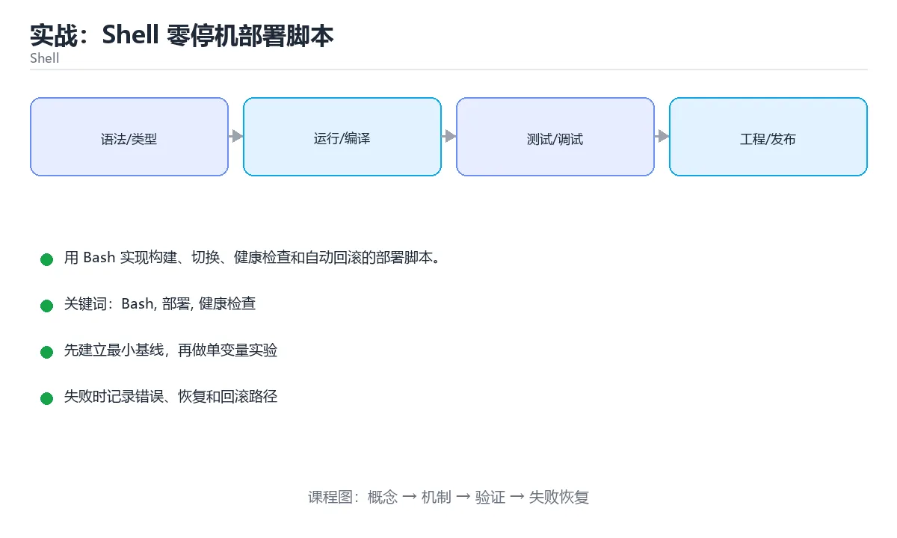

# 实战：Shell 零停机部署脚本



> 内容更新时间：2026-10-03 · 学习阶段：高级 · 预计用时：100 分钟

## 学习目标

- 能使用 set -euo pipefail 编写健壮脚本。
- 能设计带健康检查和回滚的发布流程。
- 能处理并发部署和失败中断。

## 前置知识

- 已完成本分类的基础与进阶课程，能独立运行正文中的最小示例。
- 熟悉命令行、依赖管理、测试和 Git 基本操作。
- 本课涉及：Bash、部署、健康检查、回滚、幂等。

## 项目背景

一个小型服务需要手动部署，但每次操作容易漏步骤。脚本要完成构建、上传、切换软链接、健康检查和失败回滚，并保证重复执行安全。

一句话摘要：用 Bash 实现构建、切换、健康检查和自动回滚的部署脚本。

## 技术栈

- Bash 5
- rsync/ssh
- systemd
- curl
- shellcheck

## 架构与数据流

```text
输入 → 参数校验 → 业务处理 → 持久化/外部调用 → 结果输出 → 指标与日志
                 ↘ 失败分类 → 重试/回滚 → 错误响应
```

- 读路径要明确查询条件、分页方式和返回字段，避免一次加载全部数据。
- 写路径要明确事务边界、幂等键和失败补偿，不能留下半完成状态。
- 外部调用要设置超时、重试上限和降级策略。
- 每个关键阶段都要留下日志、指标或测试证据。

## 功能范围

- [ ] 构建指定版本
- [ ] 上传到版本目录
- [ ] 原子切换 current 软链接
- [ ] 健康检查失败自动回滚

## 示例数据与边界

| 场景 | 输入 | 期望结果 | 检查点 |
| --- | --- | --- | --- |
| 正常路径 | 合法的最小数据集 | 成功返回并写入正确数据 | 状态码、数据库记录、日志 |
| 边界值 | 最大值、最小值或空集合 | 明确成功或给出可理解错误 | 不崩溃、不越界、不写半条数据 |
| 非法输入 | 类型错误、缺字段、超长内容 | 返回校验错误并指出字段 | 错误结构统一且不泄露内部信息 |
| 依赖失败 | 数据库不可用、超时、网络抖动 | 重试、降级或快速失败 | 可恢复、可观测、无重复副作用 |

## 实施步骤

### 步骤 1：定义目录、版本和锁文件

- 输入与产出：先写清本步依赖的配置、数据和最终产物，再开始编码。
- 验证方法：用最小请求、最小数据集或单元测试证明本步结果正确。
- 失败处理：记录错误类型、回滚动作和重试条件，避免把问题带到下一步。
- 证据留存：保留命令、输出、日志或截图，方便评审与复盘。

### 步骤 2：构建并校验制品

- 输入与产出：先写清本步依赖的配置、数据和最终产物，再开始编码。
- 验证方法：用最小请求、最小数据集或单元测试证明本步结果正确。
- 失败处理：记录错误类型、回滚动作和重试条件，避免把问题带到下一步。
- 证据留存：保留命令、输出、日志或截图，方便评审与复盘。

### 步骤 3：上传到新版本目录

- 输入与产出：先写清本步依赖的配置、数据和最终产物，再开始编码。
- 验证方法：用最小请求、最小数据集或单元测试证明本步结果正确。
- 失败处理：记录错误类型、回滚动作和重试条件，避免把问题带到下一步。
- 证据留存：保留命令、输出、日志或截图，方便评审与复盘。

### 步骤 4：切换软链接并重启服务

- 输入与产出：先写清本步依赖的配置、数据和最终产物，再开始编码。
- 验证方法：用最小请求、最小数据集或单元测试证明本步结果正确。
- 失败处理：记录错误类型、回滚动作和重试条件，避免把问题带到下一步。
- 证据留存：保留命令、输出、日志或截图，方便评审与复盘。

### 步骤 5：轮询健康检查

- 输入与产出：先写清本步依赖的配置、数据和最终产物，再开始编码。
- 验证方法：用最小请求、最小数据集或单元测试证明本步结果正确。
- 失败处理：记录错误类型、回滚动作和重试条件，避免把问题带到下一步。
- 证据留存：保留命令、输出、日志或截图，方便评审与复盘。

### 步骤 6：失败时切回上一版本并输出报告

- 输入与产出：先写清本步依赖的配置、数据和最终产物，再开始编码。
- 验证方法：用最小请求、最小数据集或单元测试证明本步结果正确。
- 失败处理：记录错误类型、回滚动作和重试条件，避免把问题带到下一步。
- 证据留存：保留命令、输出、日志或截图，方便评审与复盘。

## 关键代码

```bash
#!/usr/bin/env bash
set -euo pipefail

APP_DIR=/srv/app
VERSION=$(git rev-parse --short HEAD)
NEW_DIR="$APP_DIR/releases/$VERSION"

mkdir -p "$NEW_DIR"
rsync -a --delete ./dist/ "$NEW_DIR/"
ln -sfn "$NEW_DIR" "$APP_DIR/current"
systemctl restart myapp
curl --fail --retry 10 --retry-delay 1 http://127.0.0.1:8080/health
```

## 验证命令与预期输出

先在干净环境执行启动和测试命令，再把真实输出记录到项目 README 或实施记录中。

```text
1. 安装依赖并启动项目
2. 执行至少 3 条自动化测试，其中包含 1 条失败路径
3. 用正常请求验证成功响应
4. 用非法输入验证错误响应
5. 重复执行一次，确认没有重复写入或副作用
```

预期输出必须包含：启动成功标志、测试通过数量、成功请求结果、错误状态码和重复执行的幂等结论。只写“运行正常”不算验收证据。

## 建议目录结构

```text
src/
  entry/        启动与配置
  domain/       业务模型与规则
  service/      用例编排
  infra/        数据库、HTTP、消息等适配器
tests/          单元、集成与接口测试
```

目录可以按语言习惯调整，但输入边界、业务规则和外部适配必须分层，不能全部堆在入口文件。

## 质量门禁

- [ ] 格式化和静态检查通过，不遗留明显警告。
- [ ] 单元测试覆盖核心规则，集成测试覆盖数据库或外部边界。
- [ ] 错误响应不泄露堆栈、SQL 和密钥。
- [ ] 配置来自环境变量或配置文件，不硬编码敏感信息。
- [ ] README 写清启动、测试、配置和回滚步骤。

## 安全、成本与可观测性

- 权限遵循最小授权，数据库账号、云资源和接口令牌都不能使用管理员默认权限。
- 所有外部输入都要校验、限长并转义，错误信息不能泄露内部路径和 SQL。
- 密钥通过环境变量或密钥管理服务注入，并记录轮换方式。
- 为数据库连接、线程/协程、队列、文件和网络请求设置上限，避免资源耗尽。
- 至少记录请求量、错误率、P95/P99 延迟、资源使用和成本趋势。
- 出现异常时能从日志和指标还原时间线，而不是只看到一句“服务不可用”。

## 测试与验收

- 健康检查失败时自动回滚到上一版本
- 重复部署同一版本不会报错
- 脚本在任意命令失败时立即退出

### 验收记录表

| 检查项 | 证据 | 结果 | 备注 |
| --- | --- | --- | --- |
| 最小路径可运行 | 启动命令与输出 |  |  |
| 失败路径可恢复 | 错误日志与重试 |  |  |
| 自动化测试通过 | 测试报告 |  |  |
| 配置和密钥安全 | 配置检查 |  |  |

## 常见问题

| 问题 | 原因 | 解决 |
| --- | --- | --- |
| 不使用 set -euo pipefail | 错误被忽略 | 在脚本开头启用严格模式 |
| 直接覆盖线上目录 | 发布中服务不可用 | 使用版本目录和原子软链接切换 |
| 没有锁 | 两个部署同时执行 | 使用 flock 或锁目录 |
| 回滚没有验证 | 回滚后仍然不可用 | 回滚后也执行健康检查 |

## 扩展任务

- 加入蓝绿或金丝雀发布
- 把部署记录写入日志和通知
- 用 Docker Compose 替换 systemd

## 性能、容量与故障演练

| 维度 | 基线 | 压测方法 | 失败信号 |
| --- | --- | --- | --- |
| 延迟 | 记录 P50/P95/P99 | 用固定数据集逐步增加并发 | P99 持续上升或超时率增加 |
| 吞吐 | 记录每秒处理量 | 逐步加压直到资源打满 | 队列积压、CPU/内存饱和 |
| 存储 | 记录数据增长与索引大小 | 导入 10 倍数据并观察查询 | 磁盘、连接或锁等待成为瓶颈 |
| 恢复 | 记录故障恢复时间 | 停止数据库、注入延迟或重复请求 | 数据不一致、重复副作用、无法回滚 |

至少完成一次故障演练：先写下预期行为，再注入故障，最后对比真实行为并修正监控或代码。没有演练的容错设计只能算假设。

## 实施记录与复盘

每完成一步，记录以下内容：

1. 本步的输入、命令和输出是什么？
2. 遇到的最小失败是什么，如何定位和修复？
3. 哪个假设被验证或推翻？
4. 下一步的风险是什么，如何回滚？
5. 如果数据量或并发扩大 10 倍，最先出现的瓶颈在哪里？

## 动手练习

### 练习 1：最小可运行版本（30 分钟）

只实现最核心的一条路径，确保能启动、能返回结果、能运行测试。

**验收标准**：留下启动命令、请求示例和成功输出。

### 练习 2：失败路径（30 分钟）

制造一次输入错误、依赖失败或超时，记录系统如何报错、如何恢复。

**验收标准**：错误信息清晰，且不会破坏已有数据。

### 练习 3：扩展一个功能（60 分钟）

从扩展任务中选一项实现，并补一条自动化测试。

**验收标准**：新功能通过测试，且原有测试不回归。

## 本课小结

- 项目课的核心不是堆功能，而是把输入、状态、错误和验收标准连接起来。
- 先跑通最小路径，再补失败处理、测试和文档，最后才做性能优化。
- 每个阶段都要留下可复现证据：命令、输出、测试和变更记录。
- 完成后用扩展任务检验迁移能力，而不是只复制示例代码。

## 完成标准

- [ ] 能从干净环境按 README 启动项目。
- [ ] 至少 3 条自动化测试通过，且包含一条失败路径。
- [ ] 能演示一次错误、一次恢复和一次回滚。
- [ ] 有一份资源或性能基线，能说明瓶颈在哪里。
- [ ] 能说清一个尚未解决的问题和下一步验证方法。


## 考点精讲：把测验题还原成判断过程

本课有 5 个判断点。先自己作答，再看「判断依据」；如果结论正确但理由不完整，回到正文对应章节补足概念。

### 考点 1：为什么用软链接切换版本？

- **正确判断**：原子切换且保留旧版本
- **判断依据**：软链接切换是原子操作，旧版本保留便于回滚。「减少磁盘」混淆了相近概念，不能回答题干要求。正确项「原子切换且保留旧版本」既符合定义也满足题干限定的场景，因此应当选择。错误项「替代健康检查」忽略了题目中的限制条件，因此不成立。错误项「加密文件」属于相邻主题的说法，范围与本题要求不一致。把题干「为什么用软链接切换版本？」放回《实战：Shell 零停机部署脚本》的「用 Bash 实现构建、切换、健康检查和自动回滚的部署脚本」语境，逐项对照定义与边界条件，就能排除其余说法。
- **迁移检查**：遮住选项，只根据定义复述一次答案，再回来看哪个选项与复述一致。

### 考点 2：部署脚本为什么需要锁？

- **正确判断**：防止并发部署互相覆盖
- **判断依据**：锁能保证同一时刻只有一个部署流程操作线上目录。「加速网络」忽略了题目中的限制条件，因此不成立。正确项「防止并发部署互相覆盖」抓住了题干的核心条件，是经得起边界检验的表述。错误项「替代测试」与课程给出的定义相冲突，不能回答题目所问。错误项「减少日志」在边界或失败路径上会得出错误结果。把题干「部署脚本为什么需要锁？」放回《实战：Shell 零停机部署脚本》的「用 Bash 实现构建、切换、健康检查和自动回滚的部署脚本」语境，逐项对照定义与边界条件，就能排除其余说法。
- **迁移检查**：如果给某个错误选项去掉一个限定词，它会不会变成正确？说明理由。

### 考点 3：健康检查失败后应该怎么做？

- **正确判断**：自动回滚并再次检查
- **判断依据**：回滚后仍需验证服务恢复，避免二次故障。正确项「自动回滚并再次检查」与题干要求一致，是本课知识点的准确定义。错误项「继续发布」属于相邻主题的说法，范围与本题要求不一致。错误项「删除日志」把不同概念混在一起，缺少题干限定的前提。错误项「重启机器」与课程给出的定义相冲突，不能回答题目所问。把题干「健康检查失败后应该怎么做？」放回《实战：Shell 零停机部署脚本》的「用 Bash 实现构建、切换、健康检查和自动回滚的部署脚本」语境，逐项对照定义与边界条件，就能排除其余说法。
- **迁移检查**：把题干里的一个条件换成边界值，原来的结论还成立吗？写出判断过程。

### 考点 4：shellcheck 的价值是什么？

- **正确判断**：静态发现常见 Shell 错误
- **判断依据**：shellcheck 能发现引号、变量和命令组合等常见陷阱。「管理数据库」只看到了表面现象，没有解释题干真正考查的机制。正确项「静态发现常见 Shell 错误」与题干要求一致，是本课知识点的准确定义。错误项「自动写业务逻辑（仅部分场景成立）」把不同概念混在一起，缺少题干限定的前提。错误项「压缩图片」与课程给出的定义相冲突，不能回答题目所问。把题干「shellcheck 的价值是什么？」放回《实战：Shell 零停机部署脚本》的「用 Bash 实现构建、切换、健康检查和自动回滚的部署脚本」语境，逐项对照定义与边界条件，就能排除其余说法。
- **迁移检查**：如果给某个错误选项去掉一个限定词，它会不会变成正确？说明理由。

### 考点 5：脚本中 set -euo pipefail 会让哪种情况立即失败？

- **正确判断**：任意命令返回非零、使用未定义变量或管道中任一命令失败
- **判断依据**：严格模式让脚本在命令失败、变量未定义和管道任一环节失败时立即退出，避免带着错误继续发布。它不能替代显式的错误处理和健康检查，磁盘写满等异常仍需业务逻辑捕获并回滚。正确项「任意命令返回非零、使用未定义变量或管道中任一命令失败」完整覆盖了题目要求的关键点，没有遗漏前提。错误项「只在交互终端中」在边界或失败路径上会得出错误结果。错误项「只有语法错误」把因果关系颠倒了，不能作为正确结论。错误项「磁盘写满时」忽略了题目中的限制条件，因此不成立。把题干「脚本中 set -euo pipefail 会让哪种情况立即失败？」放回《实战：Shell 零停机部署脚本》的「用 Bash 实现构建、切换、健康检查和自动回滚的部署脚本」语境，逐项对照定义与边界条件，就能排除其余说法。
- **迁移检查**：把输出与正文预期逐字对照，找出最容易忽略的字符差异。

## 本课复习清单

离开本课前，逐项确认：

- [ ] 不看解析，能说出「为什么用软链接切换版本？」的判断依据。
- [ ] 不看解析，能说出「部署脚本为什么需要锁？」的判断依据。
- [ ] 不看解析，能说出「健康检查失败后应该怎么做？」的判断依据。
- [ ] 不看解析，能说出「shellcheck 的价值是什么？」的判断依据。
- [ ] 不看解析，能说出「脚本中 set -euo pipefail 会让哪种情况立即失败？」的判断依据。
- [ ] 至少运行一次本课示例，记录输入、输出和一个边界情况。
- [ ] 把本课最容易混淆的两个概念写成一句话对照。

| 复盘项 | 记录 |
| --- | --- |
| 已经能独立解释的考点 |  |
| 仍然说不清的概念 |  |
| 下一步验证动作 |  |

## English Overview

**Title:** Project: Zero-Downtime Shell Deployment

**Summary:** Build a deployment script with health checks and rollback.

**Category:** Shell  
**Level:** 高级  
**Key terms:** Bash, 部署, 健康检查, 回滚, 幂等

> The full tutorial is written in Chinese. This bilingual overview helps English readers identify the topic, scope and key terms before studying the detailed examples.

## 内容元数据

- 内容版本：v2.0
- 最后更新：2026-10-03
- 学习阶段：高级
- 适用环境：Bash 5 / POSIX Shell
- 内容来源：内置结构化课程与工程实践整理
- 相关主题：Bash、部署、健康检查、回滚、幂等
- 质量版本：P0 测验标准 + P1 覆盖扩展 + P2 体验补全

## 项目专属规格：实战：Shell 零停机部署脚本

### 核心场景

用 Bash 实现构建、切换、健康检查和自动回滚的部署脚本。 项目目标是把「Bash、部署、健康检查、回滚、幂等」落实为可运行、可测试、可回滚的交付物。

### 架构与数据流

```text
用户/输入 → 接口或命令 → 领域逻辑 → 存储/外部依赖 → 输出与监控
                         ↘ 失败分类 → 重试/补偿 → 回滚
```

### 最小数据模型

| 对象 | 关键字段 | 约束 |
| --- | --- | --- |
| 输入实体 | Bash、时间、来源 | 必填校验、长度限制、幂等键 |
| 任务实体 | 状态、优先级、创建时间 | 状态迁移合法、不可重复执行 |
| 结果实体 | 输出、错误码、耗时 | 可序列化、错误可解释 |
| 审计记录 | 操作者、动作、结果、时间 | 不可篡改、可查询、脱敏 |

### 验收场景

1. 正常路径：最小输入得到预期输出，并留下日志与指标。
2. 边界路径：空值、最大值、重复数据和超长内容得到明确处理。
3. 失败路径：依赖超时或不可用时能快速失败、重试或降级。
4. 幂等路径：同一请求执行两次不会产生重复副作用。
5. 回滚路径：回滚后数据一致，且能说明恢复时间和影响范围。


## 项目交付物

### 建议仓库结构

```text
bin/
scripts/
tests/
Makefile
README.md
```

### 测试矩阵

| 层级 | 覆盖内容 | 最低数量 | 通过标准 |
| --- | --- | ---: | --- |
| 单元测试 | 领域规则、边界和错误分类 | 8 | 正常、边界、失败路径全部通过 |
| 集成测试 | 数据库、网络、文件或平台边界 | 3 | 使用真实边界且可重复运行 |
| 端到端测试 | 核心用户路径 | 1 | 从输入到输出完整跑通 |
| 手动验收 | 文档中列出的 5 个场景 | 5 | 有命令、输出和结论记录 |

### 验收数据

```json
{
  "project": "shell_project_deploy",
  "input": {"case": "normal", "value": 5},
  "expected": {"ok": true, "result": 5},
  "failure_case": {"value": -1, "error": "validation_error"},
  "idempotency_key": "demo-001"
}
```

### 复盘模板

| 问题 | 记录 |
| --- | --- |
| 原目标是什么？ | 用一句话描述可验收目标 |
| 实际发生了什么？ | 时间线、指标和关键日志 |
| 哪个假设被推翻？ | 根因与促成因素 |
| 如何回滚？ | 步骤、耗时和数据校验 |
| 下一步做什么？ | 负责人、期限和验证方式 |

> 项目验收围绕「Bash、部署、健康检查」：至少完成一次正常路径、一次边界输入、一次失败恢复和一次幂等检查。


## 参考资料与复核

- 最后复核：2026-10-04
- 下次复核：2027-04-04
- 复核范围：版本兼容、API 行为、安全建议与工程实践
- 来源性质：官方文档与标准；本课正文为离线教学重组，不复制原文

| 参考资料 | 本课用途 |
| --- | --- |
| [GNU Bash Manual](https://www.gnu.org/software/bash/manual/) | Bash 语法与行为 |
| [POSIX Shell](https://pubs.opengroup.org/onlinepubs/9799919799/) | 可移植 Shell 标准 |

> 本课主题：用 Bash 实现构建、切换、健康检查和自动回滚的部署脚本。

> App 完全离线展示文字链接，不会自动联网；需要延伸阅读时可复制链接到浏览器。

