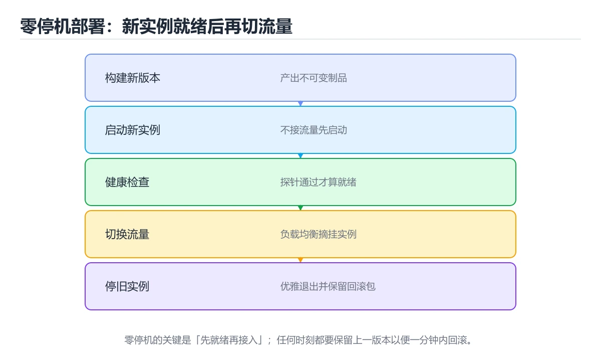

# 实战：Shell 零停机部署脚本




> 内容更新时间：2026-10-06 · 学习阶段：高级 · 预计用时：60 分钟

## 本节知识框架

**课程定位**：所属分类 `shell`（Shell），课程主题 `实战：Shell 零停机部署脚本`，学习阶段 高级，建议用时 70 分钟。

本课主线：用 Bash 实现构建、切换、健康检查和自动回滚的部署脚本。

**学完本课应当能够**
- 说清 `Bash` 与 `部署` 的含义与区别，并各举一个正例和一个反例。
- 用本课示例验证 `健康检查` 的行为，记录输入、输出与失败条件。
- 遇到「部署脚本没有回滚」这类问题时，能说出触发条件与修复顺序。

### 从概念到验证的学习链条

1. `Bash`：先掌握 常见 Unix Shell，用命令、变量、管道和脚本组合自动化系统任务，再用它解释 `部署` 为什么会出现。
2. `部署`：先掌握 把构建产物、配置和依赖发布到目标环境并使其可对外服务，再用它解释 `健康检查` 为什么会出现。
3. `健康检查`：先掌握 周期性探测进程或依赖是否可服务，并据此摘除或重启实例，再用它解释 `回滚` 为什么会出现。
4. `回滚`：先掌握 用 Bash 实现构建、切换、健康检查和自动回滚的部署脚本，再用它解释 `幂等` 为什么会出现。
5. `幂等`：先掌握 本课涉及：Bash、部署、健康检查、回滚、幂等，再用它解释 `Shell` 为什么会出现。
6. `Shell`：先掌握 接收命令并调用操作系统程序的命令行解释器与脚本环境，再用它解释 本课示例的观察结果 为什么会出现。

**先修与衔接**：本课是「Shell」分类的第 18 课。先修内容：《结构化数据处理：jq 与 yq》。《结构化数据处理：jq 与 yq》里的 `sed`、`JSON` 是本课的前提。相关或后续课程：《实战：Shell 日志分析与告警》、《部署与运维：稳定发布与快速回滚》。

### 完成判据

- **定义关**：不看正文也能说明 `Bash` 是 常见 Unix Shell，用命令、变量、管道和脚本组合自动化系统任务，并指出一个反例。
- **机制关**：能按“输入 → 转换 → 输出 → 验证”复述 `实战：Shell 零停机部署脚本`，而不是只背结论。
- **示例关**：能运行或推演 `实战：Shell 零停机部署脚本` 的 `text` 示例，并说明一个真实出现的标识符或字面量。
- **证据关**：能从 `实战：Shell 零停机部署脚本` 的示例写出一个输入、处理、输出三元组，并说明它支持或反驳了本课的哪一条结论。
- **排错关**：能复现 部署脚本没有回滚，记录现象并按 记录当前版本并实现一键回滚 修复。
- **迁移关**：能把 `Bash`、`部署`、`健康检查`、`回滚` 放进一个与 `实战：Shell 零停机部署脚本` 不同的项目场景，并保持输入与验证条件可追踪。
- **复盘关**：学完 `实战：Shell 零停机部署脚本` 后，用一句话写下仍然不确定的结论，并列出下一次验证需要的输入、环境和成功判据。

### 复习清单

- [ ] 能不看正文复述本课核心术语，并指出一个边界或反例。
- [ ] 能运行或推演本课示例，记录输入、输出与失败现象。
- [ ] 能完成一次自测，并把错题对照错误表定位原因。

## 核心概念定义

| 术语 | 操作性定义 | 常见边界与风险 |
| --- | --- | --- |
| Bash | 常见 Unix Shell，用命令、变量、管道和脚本组合自动化系统任务。 | 只在「常见 Unix Shell，用命令、变量、管道和脚本组合自动化系统任务」这一前提下成立，换输入或换环境要重新验证。 |
| 部署 | 把构建产物、配置和依赖发布到目标环境并使其可对外服务。 | 易错：发布失败后停在中途，服务不可用；正确做法是记录当前版本并实现一键回滚。 |
| 健康检查 | 周期性探测进程或依赖是否可服务，并据此摘除或重启实例。 | 易错：切完流量才发现服务异常；正确做法是切换前验证健康检查与关键接口。 |
| 回滚 | 用 Bash 实现构建、切换、健康检查和自动回滚的部署脚本。 | 易错：发布失败后停在中途，服务不可用；正确做法是记录当前版本并实现一键回滚。 |
| 幂等 | 本课涉及：Bash、部署、健康检查、回滚、幂等。 | 隔离级别与并发事务会影响可见性，换级别或换存储引擎后要重新验证。 |
| Shell | 接收命令并调用操作系统程序的命令行解释器与脚本环境 | 只在「接收命令并调用操作系统程序的命令行解释器与脚本环境」这一前提下成立，换输入或换环境要重新验证。 |

## 原理与运行机制

### 机制总览

**教材衔接：技术栈**

- Bash 5
- rsync/ssh
- systemd
- curl
- shellcheck

**教材衔接：架构与数据流**

```text
「实战：Shell 零停机部署脚本」的链路可以写成：项目背景 → 技术栈 → 架构与数据流 → 功能范围。链上任何一环缺少可观察的输出，都不能算验证完成。
                 ↘ 失败分类 → 重试/回滚 → 错误响应
```

- 读路径要明确 Bash 的查询条件、分页方式和返回字段，避免一次加载全部数据。
- APP_DIR 的写入要以幂等键为准，失败后能补偿或安全重试。
- 外部调用要设置超时、重试上限和降级策略。
- 每个关键阶段都要留下日志、指标或测试证据。

**教材衔接：功能范围**

- [ ] 构建指定版本
- [ ] 上传到版本目录
- [ ] 原子切换 current 软链接
- [ ] 健康检查失败自动回滚

**教材衔接：实施步骤**

### 步骤 1：定义目录、版本和锁文件

- 把 部署 这一步的依赖与交付物写成两行清单，再开始实现。
- 验证方法：用最小请求或单元测试证明 Bash 这一步的结果正确。
- 为 APP_DIR 定义失败分类与重试上限，超出后走人工处理。
- 证据留存：保留命令、输出、日志或截图，方便评审与复盘。

### 步骤 2：构建并校验制品

- 定位：这一节说明步骤 2：构建并校验制品在「实战：Shell 零停机部署脚本」知识体系里的位置。
- 要点：本课涉及：Bash、部署、健康检查、回滚、幂等。
- 自检：能否用一个最小例子解释步骤 2：构建并校验制品？

### 步骤 3：上传到新版本目录

- 定位：这一节说明步骤 3：上传到新版本目录在「实战：Shell 零停机部署脚本」知识体系里的位置。
- 要点：一个小型服务需要手动部署，但每次操作容易漏步骤。脚本要完成构建、上传、切换软链接、健康检查和失败回滚，并保证重复执行安全。
- 自检：能否用一个最小例子解释步骤 3：上传到新版本目录？

### 步骤 4：切换软链接并重启服务

- 定位：这一节说明步骤 4：切换软链接并重启服务在「实战：Shell 零停机部署脚本」知识体系里的位置。
- 要点：一句话摘要：用 Bash 实现构建、切换、健康检查和自动回滚的部署脚本。
- 自检：能否用一个最小例子解释步骤 4：切换软链接并重启服务？

### 步骤 5：轮询健康检查

「实战：Shell 零停机部署脚本」的「步骤 5：轮询健康检查」一节补全如下：

- 定位：这一节说明步骤 5：轮询健康检查在「实战：Shell 零停机部署脚本」知识体系里的位置。
- 要点：写路径要明确事务边界、幂等键和失败补偿，不能留下半完成状态。
- 自检：能否用一个最小例子解释步骤 5：轮询健康检查？

### 步骤 6：失败时切回上一版本并输出报告

- 定位：这一节说明步骤 6：失败时切回上一版本并输出报告在「实战：Shell 零停机部署脚本」知识体系里的位置。
- 要点：失败处理：记录错误类型、回滚动作和重试条件，避免把问题带到下一步。
- 自检：能否用一个最小例子解释步骤 6：失败时切回上一版本并输出报告？

**教材衔接：建议目录结构**

**教材衔接：质量门禁**

- [ ] 格式化和静态检查通过，不遗留明显警告。
- [ ] 测试分层：核心规则用单元测试，部署 的边界用集成测试。
- [ ] 错误响应不泄露堆栈、SQL 和密钥。
- [ ] 配置来自环境变量或配置文件，不硬编码敏感信息。
- [ ] README 写清启动、测试、配置和回滚步骤。

**教材衔接：安全、成本与可观测性**

- 权限遵循最小授权：Bash 用到的数据库账号、云资源和令牌都不能使用管理员默认权限。
- 把 部署 的输入约束写成白名单，并统一错误结构。
- 密钥通过环境变量或密钥管理服务注入，并记录轮换方式。
- 为 Bash 涉及的连接、线程或协程、队列与网络请求设置上限，避免资源耗尽。
- 为 APP_DIR 建立四个指标：吞吐、错误率、尾延迟和资源占用。
- 把 部署 的日志与指标对齐到同一时间轴，便于事后复盘。

**教材衔接：扩展任务**

- 加入蓝绿或金丝雀发布
- 把部署记录写入日志和通知
- 用 Docker Compose 替换 systemd

**教材衔接：实施记录与复盘**

每完成一步，记录以下内容：

1. 本步的输入、命令和输出是什么？
2. 遇到的最小失败是什么，如何定位和修复？
3. 哪个假设被验证或推翻？
4. 下一步的风险是什么，如何回滚？
5. 如果 Bash 的数据量或并发扩大 10 倍，最先出现的瓶颈在哪里？

**教材衔接：完成标准**

- [ ] 能从干净环境按 README 启动项目。
- [ ] 自动化测试覆盖 部署 的核心规则，并验证一次错误处理。
- [ ] 能演示一次错误、一次恢复和一次回滚。
- [ ] 有一份资源或性能基线，能说明瓶颈在哪里。
- [ ] 能说清一个尚未解决的问题和下一步验证方法。

**教材衔接：版本与时效**

- 版本提示：Bash 的行为在最近几个大版本里有过调整，升级「实战：Shell 零停机部署脚本」前先用 APP_DIR 复现当前输出，再对照官方发布说明逐条核对。
- 升级「实战：Shell 零停机部署脚本」涉及的依赖前，先用 APP_DIR 复现当前行为，再逐项核对版本说明与破坏性变更。

### 升级检查清单

- 先固定当前版本，跑通全部示例与测验，再升级工具链。
- 只改 Bash 的版本变量，记录编译、测试与产物体积的变化。
- 先回归 Bash 与 部署 的默认行为和错误信息，再扩大测试范围。
- 升级完成后记录 Bash 的新旧版本差异，并据此调整下次复核时间。

**教材衔接：交付评审：评分表、决策记录与证据链**

### 一、「实战：Shell 零停机部署脚本」的交付物评分表

| 交付物 | 权重 | 合格线 | 需要的证据 |
| --- | ---: | --- | --- |
| 核心链路 | 34% | 能在干净环境复现，且失败路径有明确处理 | 命令与输出、对应测试、一次失败与恢复记录 |
| 测试与验收记录 | 33% | 能在干净环境复现，且失败路径有明确处理 | 命令与输出、对应测试、一次失败与恢复记录 |
| 运行与回滚说明 | 33% | 能在干净环境复现，且失败路径有明确处理 | 命令与输出、对应测试、一次失败与恢复记录 |

### 二、需要写下来的决策（ADR）

| 决策点 | 本课给出的做法 | 备选方案 | 代价与回滚 |
| --- | --- | --- | --- |
| 架构与数据流 | 用户/输入 → 接口或命令 → 领域逻辑 → 存储/外部依赖 → 输出与监控 | 不做「架构与数据流」，沿用最朴素的实现（需要额外补一次对照实验） | 若「架构与数据流」出问题，回到上一版本并按本课验收场景重跑 |


### 四、「实战：Shell 零停机部署脚本」的验收指标

| 指标 | 目标值 | 测量方式 | 不达标时的动作 |
| --- | --- | --- | --- |
| | 延迟 | 记录 P50/P95/P99 | 用固定数据集逐步增加并发 | P99 持续上升或超时率增加 | | 用本课正文给出的阈值，没有就写实测基线 | 固定环境重复三次取中位数 | 回到对应小节定位，先修原因再重测 |
| | 存储 | 记录数据增长与索引大小 | 导入 10 倍数据并观察查询 | 磁盘、连接或锁等待成为瓶颈 | | 用本课正文给出的阈值，没有就写实测基线 | 固定环境重复三次取中位数 | 回到对应小节定位，先修原因再重测 |

### 五、评审记录模板

| 记录项 | 填写要求 |
| --- | --- |
| 项目标识 | `shell_project_deploy` |
| 本次范围 | 说明这一轮交付了「实战：Shell 零停机部署脚本」的哪些部分 |
| 未完成项 | 列出与 Bash 相关但本轮未做的内容 |
| 证据位置 | 指向 evidence/ 目录下的具体文件 |
| 风险与回滚 | 写清剩余风险、回滚步骤和验证方式 |
| 结论 | 通过 / 有条件通过 / 不通过，三者选一 |

### 机制拆解：每一步的输入、动作与输出

#### 1. `Bash`
- 输入：`Bash`；本步把 常见 Unix Shell，用命令、变量、管道和脚本组合自动化系统任务 当作判断规则。
- 动作：围绕 `Bash` 保留中间状态，并记录它与 `部署` 的对应关系。
- 输出：`部署`，它可以被下一段代码、测试或记录继续使用。
- `Bash` 的失败条件：只在「常见 Unix Shell，用命令、变量、管道和脚本组合自动化系统任务」这一前提下成立，换输入或换环境要重新验证。

#### 2. `部署`
- 输入：`Bash`；本步把 把构建产物、配置和依赖发布到目标环境并使其可对外服务 当作判断规则。
- 动作：围绕 `部署` 保留中间状态，并记录它与 `健康检查` 的对应关系。
- 输出：`健康检查`，它可以被下一段代码、测试或记录继续使用。
- `部署` 的失败条件：当部署脚本没有回滚时，会出现发布失败后停在中途，服务不可用。

#### 3. `健康检查`
- 输入：`部署`；本步把 周期性探测进程或依赖是否可服务，并据此摘除或重启实例 当作判断规则。
- 动作：围绕 `健康检查` 保留中间状态，并记录它与 `回滚` 的对应关系。
- 输出：`回滚`，它可以被下一段代码、测试或记录继续使用。
- `健康检查` 的失败条件：当切换前不做健康检查时，会出现切完流量才发现服务异常。

#### 4. `回滚`
- 输入：`健康检查`；本步把 用 Bash 实现构建、切换、健康检查和自动回滚的部署脚本 当作判断规则。
- 动作：围绕 `回滚` 保留中间状态，并记录它与 `幂等` 的对应关系。
- 输出：`幂等`，它可以被下一段代码、测试或记录继续使用。
- `回滚` 的失败条件：当部署脚本没有回滚时，会出现发布失败后停在中途，服务不可用。

#### 5. `幂等`
- 输入：`回滚`；本步把 本课涉及：Bash、部署、健康检查、回滚、幂等 当作判断规则。
- 动作：围绕 `幂等` 保留中间状态，并记录它与 `Shell` 的对应关系。
- 输出：`Shell`，它可以被下一段代码、测试或记录继续使用。
- `幂等` 的失败条件：隔离级别与并发事务会影响可见性，换级别或换存储引擎后要重新验证。

#### 6. `Shell`
- 输入：`幂等`；本步把 接收命令并调用操作系统程序的命令行解释器与脚本环境 当作判断规则。
- 动作：围绕 `Shell` 保留中间状态，并记录它与 `本课示例的最终结果` 的对应关系。
- 输出：`本课示例的最终结果`，它可以被下一段代码、测试或记录继续使用。
- `Shell` 的失败条件：只在「接收命令并调用操作系统程序的命令行解释器与脚本环境」这一前提下成立，换输入或换环境要重新验证。

### 复现实验记录

- 环境：`实战：Shell 零停机部署脚本` 使用 `text` 示例，固定 `Bash`、`部署`、`健康检查`、`回滚` 作为第一组条件。
- 首轮输入：从示例中的第一个输入开始，预测 `Bash` 会怎样变化。
- 基线观察：记录命令、输入、输出和错误原文，不用截图代替可复制的文本。
- 单变量修改：只改变 `Bash`，观察 `Shell` 是否仍满足定义。
- 失败注入：复现 部署脚本没有回滚，确认现象是 发布失败后停在中途，服务不可用。
- 记录结论：把“修改前、修改后、预期变化、实际变化”写成四列表，这样复盘 `实战：Shell 零停机部署脚本` 时才能区分概念错误与实现错误。

## 典型应用场景

**教材衔接：项目背景**

一个小型服务需要手动部署，但每次操作容易漏步骤。脚本要完成构建、上传、切换软链接、健康检查和失败回滚，并保证重复执行安全。

一句话摘要：用 Bash 实现构建、切换、健康检查和自动回滚的部署脚本。

**教材衔接：项目专属规格：实战：Shell 零停机部署脚本**

### 核心场景

用 Bash 实现构建、切换、健康检查和自动回滚的部署脚本。 项目目标是把「Bash、部署、健康检查、回滚、幂等」落实为可运行、可测试、可回滚的交付物。

### 架构与数据流

```text
用户/输入 → 接口或命令 → 领域逻辑 → 存储/外部依赖 → 输出与监控
                         ↘ 失败分类 → 重试/补偿 → 回滚
```

### 最小数据模型

| 对象 | 关键字段 | 约束 |
| --- | --- | --- |
| 输入实体 | Bash、时间、来源 | 必填校验、长度限制、幂等键 |
| 任务实体 | 状态、优先级、创建时间 | 状态迁移合法、不可重复执行 |
| 结果实体 | 输出、错误码、耗时 | 可序列化、错误可解释 |
| 审计记录 | 操作者、动作、结果、时间 | 不可篡改、可查询、脱敏 |

### 验收场景

1. 正常路径：最小输入得到预期输出，并留下日志与指标。
2. 边界路径：部署 在重复提交与超长输入下不产生额外副作用。
3. 失败路径：依赖超时或不可用时能快速失败、重试或降级。
4. 幂等路径：同一请求执行两次不会产生重复副作用。
5. 回滚路径：撤掉 APP_DIR 的变更后，数据与资源都回到变更前的状态。

**教材衔接：项目交付物**

### 建议仓库结构

```text
bin/
scripts/
tests/
Makefile
README.md
```


### 验收数据

```json
{
  "project": "shell_project_deploy",
  "scenario": "Bash的正常路径",
  "input": {"case": "normal", "value": "APP_DIR"},
  "expected": {"ok": true, "checks": ["Bash可复现", "部署有记录"]},
  "failure_case": {"case": "部署越界或缺失", "error": "validation_error"},
  "idempotency_key": "shell_project_deploy-001"
}
```

### 复盘模板

| 问题 | 记录 |
| --- | --- |
| 原目标是什么？ | 用一句话描述可验收目标 |
| 实际发生了什么？ | 时间线、指标和关键日志 |
| 哪个假设被推翻？ | 根因与促成因素 |
| 如何回滚？ | 步骤、耗时和数据校验 |
| 下一步做什么？ | 负责人、期限和验证方式 |

> 项目验收围绕「Bash、部署、健康检查」：至少完成一次正常路径、一次边界输入、一次失败恢复和一次幂等检查。

- **部署脚本没有回滚**：典型现象是发布失败后停在中途，服务不可用；正确做法是记录当前版本并实现一键回滚。
- **构建与部署混在一起**：典型现象是失败原因难以区分；正确做法是拆成构建、上传与切换三个阶段。
- **切换前不做健康检查**：典型现象是切完流量才发现服务异常；正确做法是切换前验证健康检查与关键接口。

### 最小验证场景

- 准备：保留 `text` 示例的原始输入，先记录 `实战：Shell 零停机部署脚本` 的基线输出和完整运行命令。
- 判定：新结果与 `实战：Shell 零停机部署脚本` 的基线不同不等于错误；只有当差异破坏了 `Bash` 的定义或错误表中的约束，才判定为失败。

### 选择与边界

- 使用 `Bash` 时，先满足它的定义：常见 Unix Shell，用命令、变量、管道和脚本组合自动化系统任务；只在「常见 Unix Shell，用命令、变量、管道和脚本组合自动化系统任务」这一前提下成立，换输入或换环境要重新验证。
- 使用 `部署` 时，先满足它的定义：把构建产物、配置和依赖发布到目标环境并使其可对外服务；易错：发布失败后停在中途，服务不可用；正确做法是记录当前版本并实现一键回滚。
- 使用 `健康检查` 时，先满足它的定义：周期性探测进程或依赖是否可服务，并据此摘除或重启实例；易错：切完流量才发现服务异常；正确做法是切换前验证健康检查与关键接口。
- 使用 `回滚` 时，先满足它的定义：用 Bash 实现构建、切换、健康检查和自动回滚的部署脚本；易错：发布失败后停在中途，服务不可用；正确做法是记录当前版本并实现一键回滚。
- 使用 `幂等` 时，先满足它的定义：本课涉及：Bash、部署、健康检查、回滚、幂等；隔离级别与并发事务会影响可见性，换级别或换存储引擎后要重新验证。

## 代码/协议/SQL 示例

### 最小可验证示例

**教材衔接：示例数据与边界**

**教材衔接：关键代码**

```bash
#!/usr/bin/env bash
set -euo pipefail

APP_DIR=/srv/app
VERSION=$(git rev-parse --short HEAD)
NEW_DIR="$APP_DIR/releases/$VERSION"

mkdir -p "$NEW_DIR"
rsync -a --delete ./dist/ "$NEW_DIR/"
ln -sfn "$NEW_DIR" "$APP_DIR/current"
systemctl restart myapp
curl --fail --retry 10 --retry-delay 1 http://127.0.0.1:8080/health
```

**教材衔接：验证命令与预期输出**

**教材衔接：测试与验收**

- 健康检查失败时自动回滚到上一版本
- 重复部署同一版本不会报错
- 脚本在任意命令失败时立即退出


### 示例精读：先找证据，再改一个条件

- 在 `实战：Shell 零停机部署脚本` 中与 `Bash` 对照：示例必须能支持 常见 Unix Shell，用命令、变量、管道和脚本组合自动化系统任务，否则说明这一段还缺少实现或验证步骤。
- 在 `实战：Shell 零停机部署脚本` 中与 `部署` 对照：示例必须能支持 把构建产物、配置和依赖发布到目标环境并使其可对外服务，否则说明这一段还缺少实现或验证步骤。
- 在 `实战：Shell 零停机部署脚本` 中与 `健康检查` 对照：示例必须能支持 周期性探测进程或依赖是否可服务，并据此摘除或重启实例，否则说明这一段还缺少实现或验证步骤。
- 在 `实战：Shell 零停机部署脚本` 中与 `回滚` 对照：示例必须能支持 用 Bash 实现构建、切换、健康检查和自动回滚的部署脚本，否则说明这一段还缺少实现或验证步骤。
- `实战：Shell 零停机部署脚本` 的示例没有抽取到函数调用或字面量；按行记录输入、控制流和输出，避免只背代码外形。

## 时间/空间复杂度或性能分析

**性能关注点（实战：Shell 零停机部署脚本）**：进程启动与管道是主要成本：记录总耗时与子进程数量，避免在循环里反复启动外部命令。

**本课特有开销（实战：Shell 零停机部署脚本 · Bash）**：并发度提高后要观察是否出现拐点：延迟上升而吞吐不增，说明瓶颈已转移。

**测量方法**：以 `实战：Shell 零停机部署脚本` 的 `Bash` 场景为对象，固定输入跑一遍记录基线，再把规模或并发度提高一个数量级复测；两次结果的差值与波动范围才是结论依据。

### 需要控制的变量与记录项

- `实战：Shell 零停机部署脚本` 的 `Bash`：固定它的版本、输入范围和资源上限，分别记录速度、内存与失败率的变化。
- `实战：Shell 零停机部署脚本` 的 `部署`：固定它的版本、输入范围和资源上限，分别记录速度、内存与失败率的变化。
- `实战：Shell 零停机部署脚本` 的 `健康检查`：固定它的版本、输入范围和资源上限，分别记录速度、内存与失败率的变化。
- `实战：Shell 零停机部署脚本` 的 `回滚`：固定它的版本、输入范围和资源上限，分别记录速度、内存与失败率的变化。
- `实战：Shell 零停机部署脚本` 的 `幂等`：固定它的版本、输入范围和资源上限，分别记录速度、内存与失败率的变化。
- `实战：Shell 零停机部署脚本` 中 `Bash` 的边界：只在「常见 Unix Shell，用命令、变量、管道和脚本组合自动化系统任务」这一前提下成立，换输入或换环境要重新验证。达到边界时不要外推，必须重新测量。
- `实战：Shell 零停机部署脚本` 中 `部署` 的边界：易错：发布失败后停在中途，服务不可用；正确做法是记录当前版本并实现一键回滚。达到边界时不要外推，必须重新测量。
- `实战：Shell 零停机部署脚本` 中 `健康检查` 的边界：易错：切完流量才发现服务异常；正确做法是切换前验证健康检查与关键接口。达到边界时不要外推，必须重新测量。
- `实战：Shell 零停机部署脚本` 中 `回滚` 的边界：易错：发布失败后停在中途，服务不可用；正确做法是记录当前版本并实现一键回滚。达到边界时不要外推，必须重新测量。
- `实战：Shell 零停机部署脚本` 中 `幂等` 的边界：隔离级别与并发事务会影响可见性，换级别或换存储引擎后要重新验证。达到边界时不要外推，必须重新测量。

## 常见误区与易错点

| 容易写错的做法 | 实际现象 | 原因与正确做法 |
| --- | --- | --- |
| 部署脚本没有回滚 | 发布失败后停在中途，服务不可用。 | 记录当前版本并实现一键回滚。 |
| 构建与部署混在一起 | 失败原因难以区分。 | 拆成构建、上传与切换三个阶段。 |
| 切换前不做健康检查 | 切完流量才发现服务异常。 | 切换前验证健康检查与关键接口。 |

### 现场 1：部署脚本没有回滚

**症状**：发布失败后停在中途，服务不可用。

**根因与修复**：记录当前版本并实现一键回滚。

**自检**：在本课示例里复现「部署脚本没有回滚」，改成记录当前版本并实现一键回滚后重跑；如果症状消失且失败路径按预期变化，说明定位正确。

### 现场 2：构建与部署混在一起

**症状**：失败原因难以区分。

**根因与修复**：拆成构建、上传与切换三个阶段。

**自检**：在本课示例里复现「构建与部署混在一起」，改成拆成构建、上传与切换三个阶段后重跑；如果症状消失且失败路径按预期变化，说明定位正确。

### 现场 3：切换前不做健康检查

**症状**：切完流量才发现服务异常。

**根因与修复**：切换前验证健康检查与关键接口。

**自检**：在本课示例里复现「切换前不做健康检查」，改成切换前验证健康检查与关键接口后重跑；如果症状消失且失败路径按预期变化，说明定位正确。

## 与其他知识点的关系

**教材衔接：复习与迁移**

### 概念复述

- 用一句话说明「实战：Shell 零停机部署脚本」解决什么问题：用 Bash 实现构建、切换、健康检查和自动回滚的部署脚本。
- 写出Bash、部署、健康检查之间的关系，并各举一个例子。
- 说出本课最容易混淆的两个概念，以及区分它们的判据。

### 正文逐节复核

- **项目背景**：一个小型服务需要手动部署，但每次操作容易漏步骤。
- **项目专属规格：实战：Shell 零停机部署脚本**：用 Bash 实现构建、切换、健康检查和自动回滚的部署脚本。


### 迁移练习

- **先修**：`结构化数据处理：jq 与 yq`。本课默认这些内容已经掌握。
- **相关或后续**：`实战：Shell 日志分析与告警`、`部署与运维：稳定发布与快速回滚`。本课术语会在这些课程里继续使用。
- **术语归属**：`Bash`、`部署`、`健康检查` 的定义以本课「核心概念定义」为准，换到其他课程时先确认定义是否被改写。
- 同一分类的《Shell 与 Bash 脚本》也涉及 `Bash`；两课衔接时先确认这个术语的定义是否一致。
- 同一分类的《Shell 与 Docker/K8s 交互》也涉及 `健康检查`；两课衔接时先确认这个术语的定义是否一致。

### 先修与后续术语接口

- `结构化数据处理：jq 与 yq`：共享术语 `Shell`。
- `实战：Shell 日志分析与告警`：共享术语 `Shell`。
- `部署与运维：稳定发布与快速回滚`：共享术语 `部署`、`回滚`，共同关键词 `部署`、`回滚`。

### 容易混淆的相邻概念

- `Bash` 与 `部署`：前者强调 常见 Unix Shell，用命令、变量、管道和脚本组合自动化系统任务；后者强调 把构建产物、配置和依赖发布到目标环境并使其可对外服务。判断时分别检查两条定义的适用范围，不要只看名称相似就互换。
- `部署` 与 `健康检查`：前者强调 把构建产物、配置和依赖发布到目标环境并使其可对外服务；后者强调 周期性探测进程或依赖是否可服务，并据此摘除或重启实例。判断时分别检查两条定义的适用范围，不要只看名称相似就互换。
- `健康检查` 与 `回滚`：前者强调 周期性探测进程或依赖是否可服务，并据此摘除或重启实例；后者强调 用 Bash 实现构建、切换、健康检查和自动回滚的部署脚本。判断时分别检查两条定义的适用范围，不要只看名称相似就互换。
- `回滚` 与 `幂等`：前者强调 用 Bash 实现构建、切换、健康检查和自动回滚的部署脚本；后者强调 本课涉及：Bash、部署、健康检查、回滚、幂等。判断时分别检查两条定义的适用范围，不要只看名称相似就互换。
- `幂等` 与 `Shell`：前者强调 本课涉及：Bash、部署、健康检查、回滚、幂等；后者强调 接收命令并调用操作系统程序的命令行解释器与脚本环境。判断时分别检查两条定义的适用范围，不要只看名称相似就互换。

## 自测题与参考答案

> 先独立作答，再对照参考答案；答案都能在本课正文、术语表或错误表里找到依据。

### 自测 1（概念复述）

不看正文，写出 `Bash` 的操作性定义，并说明它与 `部署` 的区别。

**参考答案**：常见 Unix Shell，用命令、变量、管道和脚本组合自动化系统任务。

`部署` 的定位是：把构建产物、配置和依赖发布到目标环境并使其可对外服务；两者的差别要从适用对象与失败模式上说明。

### 自测 2（排错）

本课错误表记录了「部署脚本没有回滚」这类做法。请写出它会出现的现象、根因，以及修复顺序。

**参考答案**：现象是发布失败后停在中途，服务不可用；正确做法是记录当前版本并实现一键回滚。修复时先复现现象并保留证据，再改动一处假设重跑，确认现象消失。

### 自测 3（动手验证）

运行本课的 `text` 示例，改动其中一个输入后重新运行，记录输出与错误信息。

**参考答案**：正常输入下 `text` 示例应当复现正文给出的结果；改动输入后，如果结果改变或报错，先核对它是否满足 `实战：Shell 零停机部署脚本` 中`Bash` 的适用范围，再检查错误表里是否有同类现象。

### 自测 4（代码阅读）

阅读本课开头的 `text` 示例，说明它体现了`Bash` 的哪一条性质，并指出改动哪个输入会让这条性质不再成立。

**参考答案**：`Bash` 的定义是 常见 Unix Shell，用命令、变量、管道和脚本组合自动化系统任务，示例正是在实现这条定义。改动与 `Bash` 有关的一个输入后，如果结果不再符合 `实战：Shell 零停机部署脚本` 的正文描述，就说明该性质只在当前前提成立。

### 自测 5（迁移）

把 `实战：Shell 零停机部署脚本` 的方法迁移到自己的项目：围绕 `Bash` 写出一个与错误表同类的风险点，并说明触发条件和检验方式。

**参考答案**：例如「切换前不做健康检查」，它会导致切完流量才发现服务异常；检验方式是按切换前验证健康检查与关键接口改一处再复现，确认现象消失且没有引入新的失败分支。

### 自测 6（对比）

用一个表格对比 `Bash` 与 `部署`：各写一行适用场景、一行失败表现。

**参考答案**：`Bash` 的定义是常见 Unix Shell，用命令、变量、管道和脚本组合自动化系统任务；`部署` 的定义是把构建产物、配置和依赖发布到目标环境并使其可对外服务。两者的失败表现分别对应本课错误表里与本术语相关的行。

### 自测 7（排错顺序）

面对「部署脚本没有回滚」引发的问题，请把“复现 发布失败后停在中途，服务不可用 → 保留证据 → 记录当前版本并实现一键回滚 → 回归验证”四步写成可执行的检查清单。

**参考答案**：第一步按发布失败后停在中途，服务不可用复现；第二步记录输入、版本与完整报错；第三步按记录当前版本并实现一键回滚只改一处；第四步重跑并确认失败路径也按预期变化。

### 自测 8（边界判断）

针对 `Shell`，分别写出“可以使用”的条件和“结论不再成立”的条件。

**参考答案**：只在「接收命令并调用操作系统程序的命令行解释器与脚本环境」这一前提下成立，换输入或换环境要重新验证。 同时要把 `Shell` 的定义 接收命令并调用操作系统程序的命令行解释器与脚本环境 与实际输入逐项对照。

### 自测 9（机制重建）

不看正文，按输入、转换、输出、验证四段重建 `Bash` → `部署` → `健康检查` → `回滚` 的作用链。

**参考答案**：起点是 `Bash` 的定义 常见 Unix Shell，用命令、变量、管道和脚本组合自动化系统任务；中间每一步都保留可观察状态；终点由 `Shell` 检查，失败时回到错误表定位第一个偏离定义的步骤。

### 自测 10（综合排错）

在 `实战：Shell 零停机部署脚本` 中，现象是 切完流量才发现服务异常。请围绕 切换前不做健康检查 写出最小复现、关键证据、修复动作和回归验证，并说明为什么不能只凭一次运行下结论。

**参考答案**：先复现 切换前不做健康检查，记录输入与完整错误；再按 切换前验证健康检查与关键接口 只改一处。回归时同时跑正常路径和边界路径，只有两次结果都可解释，才把修复视为完成。

### 自测 11（一分钟复述）

用每分钟约 200 字的速度复述 `实战：Shell 零停机部署脚本`：先给主问题，再按顺序说出 `Bash`、`部署`、`健康检查`、`回滚`，最后给一个失败案例。

**自评标准**：主问题必须对应 用 Bash 实现构建、切换、健康检查和自动回滚的部署脚本；每个术语都要能接上一句定义或边界；失败案例必须写成可观察现象，不能用“可能有风险”代替证据。

## 术语速查

| 术语 | 一句话说明 |
| --- | --- |
| `Bash` | 常见 Unix Shell，用命令、变量、管道和脚本组合自动化系统任务。 |
| `部署` | 把构建产物、配置和依赖发布到目标环境并使其可对外服务。 |
| `健康检查` | 周期性探测进程或依赖是否可服务，并据此摘除或重启实例。 |
| `回滚` | 用 Bash 实现构建、切换、健康检查和自动回滚的部署脚本。 |
| `幂等` | 本课涉及：Bash、部署、健康检查、回滚、幂等。 |
| `Shell` | 接收命令并调用操作系统程序的命令行解释器与脚本环境。 |

**术语关系**：`Bash`（常见 Unix Shell） → `部署`（把构建产物、配置和依赖发布到目标环境并使其可对外服务） → `健康检查`（周期性探测进程或依赖是否可服务） → `回滚`（用 Bash 实现构建、切换、健康检查和自动回滚的部署脚本）。

## 考点精讲

`实战：Shell 零停机部署脚本` 的题库有 6 道题，下面逐题给出题干、正确项与判断依据：先自己作答，再核对正确项，最后回到正文对应小节复核。

### 考点 1：第 1 题

- **题目**：为什么用软链接切换版本？
- **正确项**：原子切换且保留旧版本
- **判断依据**：这道题检验本课主问题：用 Bash 实现构建、切换、健康检查和自动回滚的部署脚本。复习时先复述本课主问题，再举一个会让结论失效的输入。

### 考点 2：第 2 题

- **题目**：部署脚本为什么需要锁？
- **正确项**：防止并发部署互相覆盖
- **判断依据**：这道题落在术语 `部署` 上：把构建产物、配置和依赖发布到目标环境并使其可对外服务。复习时把 `部署` 的定义、适用边界和一个反例一起说清楚，再回到「核心概念定义」核对原文。

### 考点 3：第 3 题

- **题目**：围绕“实战：Shell 零停机部署脚本”中的 Bash、部署、健康检查，下列哪两项是本课强调的实践判断？
- **正确项**：验证 部署 时要固定版本并覆盖边界输入，结论才可复现；学习 Bash 时要同时说明输入、输出和失败路径，不能只看正常流程
- **判断依据**：这道题落在术语 `Bash` 上：常见 Unix Shell，用命令、变量、管道和脚本组合自动化系统任务。复习时把 `Bash` 的定义、适用边界和一个反例一起说清楚，再回到「核心概念定义」核对原文。

### 考点 4：第 4 题

- **题目**：shellcheck 的价值是什么？
- **正确项**：静态发现常见 Shell 错误
- **判断依据**：这道题落在术语 `Shell` 上：接收命令并调用操作系统程序的命令行解释器与脚本环境。复习时把 `Shell` 的定义、适用边界和一个反例一起说清楚，再回到「核心概念定义」核对原文。

### 考点 5：第 5 题

- **题目**：脚本中 set -euo pipefail 会让哪种情况立即失败？
- **正确项**：任意命令返回非零、使用未定义变量或管道中任一命令失败
- **判断依据**：这道题检验本课主问题：用 Bash 实现构建、切换、健康检查和自动回滚的部署脚本。复习时先复述本课主问题，再举一个会让结论失效的输入。

### 考点 6：第 6 题

- **题目**：下面几项都与 `Bash` 有关，请按 `实战：Shell 零停机部署脚本` 的正文顺序排列；该课主线是用 Bash 实现构建、切换、健康检查和自动回滚的部署脚本。
- **正确项**：项目背景 → 技术栈 → 架构与数据流 → 功能范围
- **判断依据**：这道题落在术语 `Bash` 上：常见 Unix Shell，用命令、变量、管道和脚本组合自动化系统任务。复习时把 `Bash` 的定义、适用边界和一个反例一起说清楚，再回到「核心概念定义」核对原文。

### 考点 7：`Bash`

- **要点**：常见 Unix Shell，用命令、变量、管道和脚本组合自动化系统任务。
- **Bash 的边界**：只在「常见 Unix Shell，用命令、变量、管道和脚本组合自动化系统任务」这一前提下成立，换输入或换环境要重新验证。

### 考点 8：`部署`

- **要点**：把构建产物、配置和依赖发布到目标环境并使其可对外服务。
- **部署 的边界**：易错：发布失败后停在中途，服务不可用；正确做法是记录当前版本并实现一键回滚。

### 考点 9：`健康检查`

- **要点**：周期性探测进程或依赖是否可服务，并据此摘除或重启实例。
- **健康检查 的边界**：易错：切完流量才发现服务异常；正确做法是切换前验证健康检查与关键接口。

### 考点 10：`回滚`

- **要点**：用 Bash 实现构建、切换、健康检查和自动回滚的部署脚本。
- **回滚 的边界**：易错：发布失败后停在中途，服务不可用；正确做法是记录当前版本并实现一键回滚。

### 考点 11：`幂等`

- **要点**：本课涉及：Bash、部署、健康检查、回滚、幂等。
- **幂等 的边界**：隔离级别与并发事务会影响可见性，换级别或换存储引擎后要重新验证。

### 考点 12：`Shell`

- **要点**：接收命令并调用操作系统程序的命令行解释器与脚本环境
- **Shell 的边界**：只在「接收命令并调用操作系统程序的命令行解释器与脚本环境」这一前提下成立，换输入或换环境要重新验证。

### 考点 13：排错——部署脚本没有回滚

- **现象**：发布失败后停在中途，服务不可用。
- **处理**：记录当前版本并实现一键回滚。

### 考点 14：排错——构建与部署混在一起

- **现象**：失败原因难以区分。
- **处理**：拆成构建、上传与切换三个阶段。

### 考点 15：综合辨析——`Bash` 与 `Shell`

- **辨析点**：`Bash` 的定义是 常见 Unix Shell，用命令、变量、管道和脚本组合自动化系统任务；`Shell` 的定义是 接收命令并调用操作系统程序的命令行解释器与脚本环境。
- **答题要求**：面对 `实战：Shell 零停机部署脚本` 的题目，先判断描述的是 `Bash` 还是 `Shell`，再归到对应定义，最后写出一个会让该定义失效的边界输入。

### 考点 16：排错评分点

- **现象分**：能写出 发布失败后停在中途，服务不可用，而不是只写“程序有错”。
- **证据分**：保留触发 部署脚本没有回滚 的输入、版本和错误原文。
- **修复分**：按 记录当前版本并实现一键回滚 只改一处，并同时回归正常路径与边界路径。

## 内容元数据

- 内容版本：v2.0
- 最后更新：2026-10-06
- 学习阶段：高级
- 适用环境：Bash 5 / POSIX Shell；本课聚焦 Bash。
- 内容来源：内置结构化课程与工程实践整理
- 相关主题：Bash、部署、健康检查、回滚、幂等
- 质量版本：P0 测验标准 + P1 覆盖扩展 + P2 体验补全

## 参考资料与复核

- 最后复核：2026-10-04
- 下次复核：2027-02-10
- 复核范围：版本兼容、API 行为、安全建议与工程实践
- 来源性质：官方文档、标准或权威教材；本课核对关键词：Bash、部署、健康检查、回滚、幂等。

| 参考资料 | 本课用途 |
| --- | --- |
| [GNU Bash 手册](https://www.gnu.org/software/bash/manual/) | Bash 语法、展开与作业控制 |
| [GNU Findutils](https://www.gnu.org/software/findutils/manual/) | find、xargs 与文件检索 |
| [jq 手册](https://jqlang.org/manual/) | JSON 查询与转换 |

| [本课术语索引：实战：Shell 零停机部署脚本](#核心概念定义) | 按本课输入、术语边界和错误表现逐项核对 |
> 「实战：Shell 零停机部署脚本」的链接用于离线阅读后的延伸核对；App 不会自动联网。