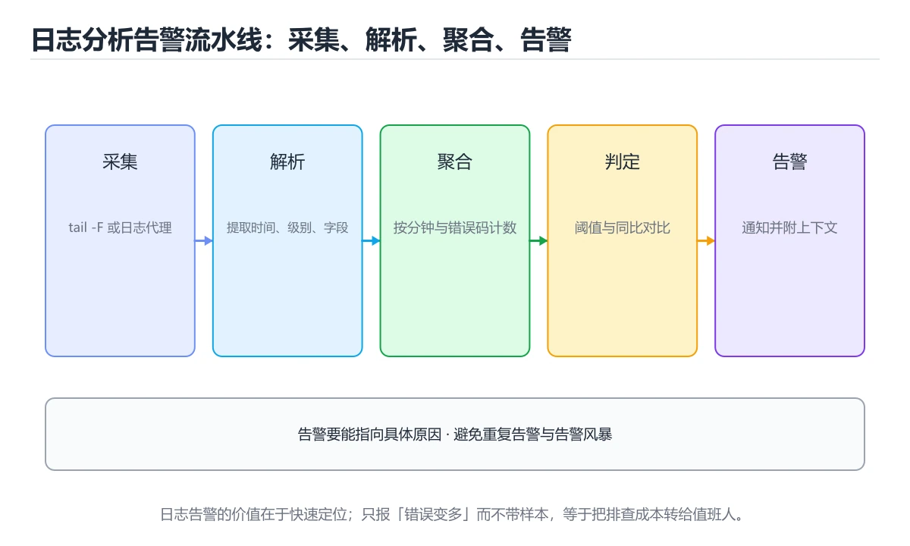
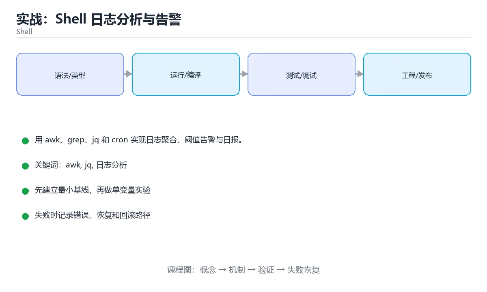

# 实战：Shell 日志分析与告警





> 内容更新时间：2026-10-06 · 学习阶段：高级 · 预计用时：60 分钟

## 本节知识框架

**课程定位**：所属分类 `shell`（Shell），课程主题 `实战：Shell 日志分析与告警`，学习阶段 高级，建议用时 75 分钟。

本课主线：用 awk、grep、jq 和 cron 实现日志聚合、阈值告警与日报。

**学完本课应当能够**
- 说清 `awk` 与 `日志分析` 的含义与区别，并各举一个正例和一个反例。
- 用本课示例验证 `告警` 的行为，记录输入、输出与失败条件。
- 遇到「只靠单一搜索命令统计」这类问题时，能说出触发条件与修复顺序。

### 从概念到验证的学习链条

1. `awk`：先掌握 按列处理文本的小语言：pattern { action } 逐行匹配，常用于日志统计与字段提取，再用它解释 `日志分析` 为什么会出现。
2. `日志分析`：先掌握 按“实战：Shell 日志分析与告警”中 awk、jq、日志分析 的实践顺序，把四个步骤排成从准备到复盘的合理顺序，再用它解释 `告警` 为什么会出现。
3. `告警`：先掌握 用 awk、grep、jq 和 cron 实现日志聚合、阈值告警与日报，再用它解释 `阈值告警` 为什么会出现。
4. `阈值告警`：先掌握 对错误率、P95 等指标设置阈值并在越界时通知，阈值要能区分噪声与真实故障，再用它解释 `Shell` 为什么会出现。
5. `Shell`：先掌握 接收命令并调用操作系统程序的命令行解释器与脚本环境，再用它解释 本课示例的观察结果 为什么会出现。

**先修与衔接**：本课是「Shell」分类的第 19 课。先修内容：《实战：Shell 零停机部署脚本》。《实战：Shell 零停机部署脚本》里的 `Bash`、`部署` 是本课的前提。相关或后续课程：《Shell 可移植性与 POSIX 兼容》。

### 完成判据

- **定义关**：不看正文也能说明 `awk` 是 按列处理文本的小语言：pattern { action } 逐行匹配，常用于日志统计与字段提取，并指出一个反例。
- **机制关**：能按“输入 → 转换 → 输出 → 验证”复述 `实战：Shell 日志分析与告警`，而不是只背结论。
- **示例关**：能运行或推演 `实战：Shell 日志分析与告警` 的 `text` 示例，并说明一个真实出现的标识符或字面量。
- **证据关**：能从 `实战：Shell 日志分析与告警` 的示例写出一个输入、处理、输出三元组，并说明它支持或反驳了本课的哪一条结论。
- **排错关**：能复现 只靠单一搜索命令统计，记录现象并按 组合排序与统计命令，必要时用专用文本处理工具 修复。
- **迁移关**：能把 `awk`、`jq`、`日志分析`、`告警` 放进一个与 `实战：Shell 日志分析与告警` 不同的项目场景，并保持输入与验证条件可追踪。
- **复盘关**：学完 `实战：Shell 日志分析与告警` 后，用一句话写下仍然不确定的结论，并列出下一次验证需要的输入、环境和成功判据。

### 复习清单

- [ ] 能不看正文复述本课核心术语，并指出一个边界或反例。
- [ ] 能运行或推演本课示例，记录输入、输出与失败现象。
- [ ] 能完成一次自测，并把错题对照错误表定位原因。

## 核心概念定义

| 术语 | 操作性定义 | 常见边界与风险 |
| --- | --- | --- |
| awk | 按列处理文本的小语言：pattern { action } 逐行匹配，常用于日志统计与字段提取。 | 只在「按列处理文本的小语言：pattern { action } 逐行匹配，常用于日志统计与字段提取」这一前提下成立，换输入或换环境要重新验证。 |
| 日志分析 | 按“实战：Shell 日志分析与告警”中 awk、jq、日志分析 的实践顺序，把四个步骤排成从准备到复盘的合理顺序。 | 只在「按“实战：Shell 日志分析与告警”中 awk、jq、日志分析 的实践顺序，把四个步骤排成从准备到复盘的合理顺序」这一前提下成立，换输入或换环境要重新验证。 |
| 告警 | 用 awk、grep、jq 和 cron 实现日志聚合、阈值告警与日报。 | 易错：噪音大或者漏报；正确做法是按历史基线调整阈值并记录命中率。 |
| 阈值告警 | 对错误率、P95 等指标设置阈值并在越界时通知，阈值要能区分噪声与真实故障。 | 只在「对错误率、P95 等指标设置阈值并在越界时通知，阈值要能区分噪声与真实故障」这一前提下成立，换输入或换环境要重新验证。 |
| Shell | 接收命令并调用操作系统程序的命令行解释器与脚本环境 | 只在「接收命令并调用操作系统程序的命令行解释器与脚本环境」这一前提下成立，换输入或换环境要重新验证。 |

## 原理与运行机制

### 机制总览

**教材衔接：技术栈**

- Bash 5
- awk
- jq
- cron
- curl

**教材衔接：架构与数据流**

- 查询 jq 时限定字段与分页范围，把全表扫描留作最后手段。
- 写入 jq 前先定义事务范围，跨服务时改用可补偿流程。
- 外部调用要设置超时、重试上限和降级策略。
- 每个关键阶段都要留下日志、指标或测试证据。

**教材衔接：功能范围**

- [ ] 统计状态码分布
- [ ] 输出 Top URL
- [ ] 计算错误率和慢请求
- [ ] 超阈值发送告警

**教材衔接：实施步骤**

### 步骤 1：确定日志格式和字段位置

- 输入与产出：先写清 awk 依赖的配置、数据和最终产物，再开始编码。
- 用一条最小输入验证 shell_project_log_analysis，断言输出符合预期。
- 出错时先记录 jq 的错误信息与回滚结果，再决定是否重试。
- 证据留存：保留命令、输出、日志或截图，方便评审与复盘。

### 步骤 2：用 awk 提取状态码和耗时

- 定位：这一节说明步骤 2：用 awk 提取状态码和耗时在「实战：Shell 日志分析与告警」知识体系里的位置。
- 要点：本课涉及：awk、jq、日志分析、告警、cron。
- 自检：能否用一个最小例子解释步骤 2：用 awk 提取状态码和耗时？

### 步骤 3：用 sort/uniq 统计 Top 项

把这条结论放回「实战：Shell 日志分析与告警」的完整流程里展开：

- 正文依据：服务器每天产生大量 Nginx 日志，需要统计状态码、Top URL、慢请求和错误率，超过阈值时发送告警并生成日报。
- 落地检查：把「步骤 3：用 sort/uniq 统计 Top 项」改写成一条可执行的核对项，逐条验证输入、超时与失败路径。

### 步骤 4：生成 JSON 或 Markdown 日报

把这条结论放回「实战：Shell 日志分析与告警」的完整流程里展开：

- 正文依据：一句话摘要：用 awk、grep、jq 和 cron 实现日志聚合、阈值告警与日报。
- 落地检查：把「步骤 4：生成 JSON 或 Markdown 日报」改写成一条可执行的核对项，逐条验证输入、超时与失败路径。

### 步骤 5：根据阈值发送告警

- 定位：这一节说明步骤 5：根据阈值发送告警在「实战：Shell 日志分析与告警」知识体系里的位置。
- 检查点：用空值、极值和依赖失败各跑一次《实战：Shell 日志分析与告警》，确认边界行为与正文一致。
- 自检：能否用一个最小例子解释步骤 5：根据阈值发送告警？

### 步骤 6：加入锁和日志轮转处理

- 定位：这一节说明步骤 6：加入锁和日志轮转处理在「实战：Shell 日志分析与告警」知识体系里的位置。
- 检查点：用空值、极值和依赖失败各跑一次《实战：Shell 日志分析与告警》，确认边界行为与正文一致。
- 自检：能否用一个最小例子解释步骤 6：加入锁和日志轮转处理？

**教材衔接：建议目录结构**

**教材衔接：质量门禁**

- [ ] 格式化和静态检查通过，不遗留明显警告。
- [ ] 单元测试覆盖 awk 的核心规则，集成测试覆盖数据库或外部边界。
- [ ] 错误响应不泄露堆栈、SQL 和密钥。
- [ ] 配置来自环境变量或配置文件，不硬编码敏感信息。
- [ ] README 写清启动、测试、配置和回滚步骤。

**教材衔接：安全、成本与可观测性**

- shell_project_log_analysis 的运行身份只保留完成任务所需的权限，越权请求应当被拒绝。
- 把 jq 的输入约束写成白名单，并统一错误结构。
- 密钥通过环境变量或密钥管理服务注入，并记录轮换方式。
- 为 awk 涉及的连接、线程或协程、队列与网络请求设置上限，避免资源耗尽。
- 为 shell_project_log_analysis 建立四个指标：吞吐、错误率、尾延迟和资源占用。
- 把 jq 的日志与指标对齐到同一时间轴，便于事后复盘。

**教材衔接：扩展任务**

- 接入 Prometheus Pushgateway
- 按小时生成趋势图
- 支持 JSON 日志和多种服务

**教材衔接：实施记录与复盘**

每完成一步，记录以下内容：

1. 本步的输入、命令和输出是什么？
2. 遇到的最小失败是什么，如何定位和修复？
3. 哪个假设被验证或推翻？
4. 下一步的风险是什么，如何回滚？
5. 如果 awk 的数据量或并发扩大 10 倍，最先出现的瓶颈在哪里？

**教材衔接：完成标准**

- [ ] 能从干净环境按 README 启动项目。
- [ ] 至少 3 条 awk 相关自动化测试通过，其中一条覆盖失败路径。
- [ ] 能演示一次错误、一次恢复和一次回滚。
- [ ] 有一份资源或性能基线，能说明瓶颈在哪里。
- [ ] 能说清一个尚未解决的问题和下一步验证方法。

**教材衔接：版本与时效**

- 版本提示：awk 的行为在最近几个大版本里有过调整，升级「实战：Shell 日志分析与告警」前先用 shell_project_log_analysis 复现当前输出，再对照官方发布说明逐条核对。
- 升级前确认 awk 的兼容范围，把不可回退的改动单独拆成一次提交。

### 升级检查清单

- 先固定当前版本，跑通全部示例与测验，再升级工具链。
- 一次只改一个版本条件，把 awk 相关的差异单独记成一条结论。
- 升级后重点回归 awk 的默认值、警告信息与错误格式。
- 升级后把 shell_project_log_analysis 的实测版本写进「内容元数据」，再更新复核日期。

**教材衔接：交付评审：评分表、决策记录与证据链**


### 四、「实战：Shell 日志分析与告警」的验收指标

| 指标 | 目标值 | 测量方式 | 不达标时的动作 |
| --- | --- | --- | --- |
| 「实战：Shell 日志分析与告警」的「步骤 2：用 awk 提取状态码和耗时」一节补全如下： | 用本课正文给出的阈值，没有就写实测基线 | 固定环境重复三次取中位数 | 回到对应小节定位，先修原因再重测 |
| 定位：这一节说明步骤 2：用 awk 提取状态码和耗时在「实战：Shell 日志分析与告警」知识体系里的位置。 | 用本课正文给出的阈值，没有就写实测基线 | 固定环境重复三次取中位数 | 回到对应小节定位，先修原因再重测 |
| 自检：能否用一个最小例子解释步骤 2：用 awk 提取状态码和耗时？ | 用本课正文给出的阈值，没有就写实测基线 | 固定环境重复三次取中位数 | 回到对应小节定位，先修原因再重测 |
| 「实战：Shell 日志分析与告警」的「步骤 5：根据阈值发送告警」一节补全如下： | 用本课正文给出的阈值，没有就写实测基线 | 固定环境重复三次取中位数 | 回到对应小节定位，先修原因再重测 |
| 定位：这一节说明步骤 5：根据阈值发送告警在「实战：Shell 日志分析与告警」知识体系里的位置。 | 用本课正文给出的阈值，没有就写实测基线 | 固定环境重复三次取中位数 | 回到对应小节定位，先修原因再重测 |

### 五、评审记录模板

| 记录项 | 填写要求 |
| --- | --- |
| 项目标识 | `shell_project_log_analysis` |
| 本次范围 | 说明这一轮交付了「实战：Shell 日志分析与告警」的哪些部分 |
| 未完成项 | 列出与 awk 相关但本轮未做的内容 |
| 证据位置 | 指向 evidence/ 目录下的具体文件 |
| 风险与回滚 | 写清剩余风险、回滚步骤和验证方式 |
| 结论 | 通过 / 有条件通过 / 不通过，三者选一 |

### 机制拆解：每一步的输入、动作与输出

#### 1. `awk`
- 输入：`awk`；本步把 按列处理文本的小语言：pattern { action } 逐行匹配，常用于日志统计与字段提取 当作判断规则。
- 动作：围绕 `awk` 保留中间状态，并记录它与 `日志分析` 的对应关系。
- 输出：`日志分析`，它可以被下一段代码、测试或记录继续使用。
- `awk` 的失败条件：只在「按列处理文本的小语言：pattern { action } 逐行匹配，常用于日志统计与字段提取」这一前提下成立，换输入或换环境要重新验证。

#### 2. `日志分析`
- 输入：`awk`；本步把 按“实战：Shell 日志分析与告警”中 awk、jq、日志分析 的实践顺序，把四个步骤排成从准备到复盘的合理顺序 当作判断规则。
- 动作：围绕 `日志分析` 保留中间状态，并记录它与 `告警` 的对应关系。
- 输出：`告警`，它可以被下一段代码、测试或记录继续使用。
- `日志分析` 的失败条件：只在「按“实战：Shell 日志分析与告警”中 awk、jq、日志分析 的实践顺序，把四个步骤排成从准备到复盘的合理顺序」这一前提下成立，换输入或换环境要重新验证。

#### 3. `告警`
- 输入：`日志分析`；本步把 用 awk、grep、jq 和 cron 实现日志聚合、阈值告警与日报 当作判断规则。
- 动作：围绕 `告警` 保留中间状态，并记录它与 `阈值告警` 的对应关系。
- 输出：`阈值告警`，它可以被下一段代码、测试或记录继续使用。
- `告警` 的失败条件：当告警阈值写死时，会出现噪音大或者漏报。

#### 4. `阈值告警`
- 输入：`告警`；本步把 对错误率、P95 等指标设置阈值并在越界时通知，阈值要能区分噪声与真实故障 当作判断规则。
- 动作：围绕 `阈值告警` 保留中间状态，并记录它与 `Shell` 的对应关系。
- 输出：`Shell`，它可以被下一段代码、测试或记录继续使用。
- `阈值告警` 的失败条件：只在「对错误率、P95 等指标设置阈值并在越界时通知，阈值要能区分噪声与真实故障」这一前提下成立，换输入或换环境要重新验证。

#### 5. `Shell`
- 输入：`阈值告警`；本步把 接收命令并调用操作系统程序的命令行解释器与脚本环境 当作判断规则。
- 动作：围绕 `Shell` 保留中间状态，并记录它与 `本课示例的最终结果` 的对应关系。
- 输出：`本课示例的最终结果`，它可以被下一段代码、测试或记录继续使用。
- `Shell` 的失败条件：只在「接收命令并调用操作系统程序的命令行解释器与脚本环境」这一前提下成立，换输入或换环境要重新验证。

### 复现实验记录

- 环境：`实战：Shell 日志分析与告警` 使用 `text` 示例，固定 `awk`、`jq`、`日志分析`、`告警` 作为第一组条件。
- 首轮输入：从示例中的第一个输入开始，预测 `awk` 会怎样变化。
- 基线观察：记录命令、输入、输出和错误原文，不用截图代替可复制的文本。
- 单变量修改：只改变 `awk`，观察 `Shell` 是否仍满足定义。
- 失败注入：复现 只靠单一搜索命令统计，确认现象是 复杂聚合难以维护。
- 记录结论：把“修改前、修改后、预期变化、实际变化”写成四列表，这样复盘 `实战：Shell 日志分析与告警` 时才能区分概念错误与实现错误。

## 典型应用场景

**教材衔接：项目背景**

服务器每天产生大量 Nginx 日志，需要统计状态码、Top URL、慢请求和错误率，超过阈值时发送告警并生成日报。

一句话摘要：用 awk、grep、jq 和 cron 实现日志聚合、阈值告警与日报。

**教材衔接：项目专属规格：实战：Shell 日志分析与告警**

### 核心场景

用 awk、grep、jq 和 cron 实现日志聚合、阈值告警与日报。 项目目标是把「awk、jq、日志分析、告警、cron」落实为可运行、可测试、可回滚的交付物。


### 验收场景

1. 正常路径：最小输入得到预期输出，并留下日志与指标。
2. 边界路径：awk 的空值、最大值、重复数据和超长内容都得到明确处理。
3. 失败路径：依赖超时或不可用时能快速失败、重试或降级。
4. 幂等路径：同一请求执行两次不会产生重复副作用。
5. 回滚路径：撤掉 shell_project_log_analysis 的变更后，数据与资源都回到变更前的状态。

**教材衔接：项目交付物**

### 建议仓库结构

```text
bin/
scripts/
tests/
Makefile
README.md
```


### 验收数据

```json
{
  "project": "shell_project_log_analysis",
  "scenario": "awk的正常路径",
  "input": {"case": "normal", "value": "shell_project_log_analysis"},
  "expected": {"ok": true, "checks": ["awk可复现", "jq有记录"]},
  "failure_case": {"case": "jq越界或缺失", "error": "validation_error"},
  "idempotency_key": "shell_project_log_analysis-001"
}
```

### 复盘模板

- **只靠单一搜索命令统计**：典型现象是复杂聚合难以维护；正确做法是组合排序与统计命令，必要时用专用文本处理工具。
- **一次性读入超大文件**：典型现象是内存与时间都不可控；正确做法是流式逐行处理并只保留聚合结果。
- **告警阈值写死**：典型现象是噪音大或者漏报；正确做法是按历史基线调整阈值并记录命中率。

### 最小验证场景

- 准备：保留 `text` 示例的原始输入，先记录 `实战：Shell 日志分析与告警` 的基线输出和完整运行命令。
- 判定：新结果与 `实战：Shell 日志分析与告警` 的基线不同不等于错误；只有当差异破坏了 `awk` 的定义或错误表中的约束，才判定为失败。

### 选择与边界

- 使用 `awk` 时，先满足它的定义：按列处理文本的小语言：pattern { action } 逐行匹配，常用于日志统计与字段提取；只在「按列处理文本的小语言：pattern { action } 逐行匹配，常用于日志统计与字段提取」这一前提下成立，换输入或换环境要重新验证。
- 使用 `日志分析` 时，先满足它的定义：按“实战：Shell 日志分析与告警”中 awk、jq、日志分析 的实践顺序，把四个步骤排成从准备到复盘的合理顺序；只在「按“实战：Shell 日志分析与告警”中 awk、jq、日志分析 的实践顺序，把四个步骤排成从准备到复盘的合理顺序」这一前提下成立，换输入或换环境要重新验证。
- 使用 `告警` 时，先满足它的定义：用 awk、grep、jq 和 cron 实现日志聚合、阈值告警与日报；易错：噪音大或者漏报；正确做法是按历史基线调整阈值并记录命中率。
- 使用 `阈值告警` 时，先满足它的定义：对错误率、P95 等指标设置阈值并在越界时通知，阈值要能区分噪声与真实故障；只在「对错误率、P95 等指标设置阈值并在越界时通知，阈值要能区分噪声与真实故障」这一前提下成立，换输入或换环境要重新验证。
- 使用 `Shell` 时，先满足它的定义：接收命令并调用操作系统程序的命令行解释器与脚本环境；只在「接收命令并调用操作系统程序的命令行解释器与脚本环境」这一前提下成立，换输入或换环境要重新验证。

## 代码/协议/SQL 示例

### 最小可验证示例

**教材衔接：示例数据与边界**

**教材衔接：关键代码**

```bash
#!/usr/bin/env bash
set -euo pipefail
LOG=${1:-/var/log/nginx/access.log}
Total=$(wc -l < "$LOG")
Errors=$(awk '$9 >= 500 {count++} END {print count+0}' "$LOG")
Rate=$(awk -v e="$Errors" -v t="$Total" 'BEGIN { if (t>0) printf "%.4f", e/t; else print 0 }')
printf 'total=%s errors=%s error_rate=%s\n' "$Total" "$Errors" "$Rate"
```

**教材衔接：验证命令与预期输出**

**教材衔接：测试与验收**

- 空日志不会除零或产生错误退出
- 重复运行同一天日报结果一致
- 错误率超过阈值时退出码或告警触发


### 示例精读：先找证据，再改一个条件

- 在 `实战：Shell 日志分析与告警` 中与 `awk` 对照：示例必须能支持 按列处理文本的小语言：pattern { action } 逐行匹配，常用于日志统计与字段提取，否则说明这一段还缺少实现或验证步骤。
- 在 `实战：Shell 日志分析与告警` 中与 `日志分析` 对照：示例必须能支持 按“实战：Shell 日志分析与告警”中 awk、jq、日志分析 的实践顺序，把四个步骤排成从准备到复盘的合理顺序，否则说明这一段还缺少实现或验证步骤。
- 在 `实战：Shell 日志分析与告警` 中与 `告警` 对照：示例必须能支持 用 awk、grep、jq 和 cron 实现日志聚合、阈值告警与日报，否则说明这一段还缺少实现或验证步骤。
- 在 `实战：Shell 日志分析与告警` 中与 `阈值告警` 对照：示例必须能支持 对错误率、P95 等指标设置阈值并在越界时通知，阈值要能区分噪声与真实故障，否则说明这一段还缺少实现或验证步骤。
- `实战：Shell 日志分析与告警` 的示例没有抽取到函数调用或字面量；按行记录输入、控制流和输出，避免只背代码外形。

## 时间/空间复杂度或性能分析

**性能关注点（实战：Shell 日志分析与告警）**：进程启动与管道是主要成本：记录总耗时与子进程数量，避免在循环里反复启动外部命令。

**本课特有开销（实战：Shell 日志分析与告警 · awk）**：小文件看元数据开销，大文件看吞吐，两者要分别测量。

**测量方法**：以 `实战：Shell 日志分析与告警` 的 `awk` 场景为对象，固定输入跑一遍记录基线，再把规模或并发度提高一个数量级复测；两次结果的差值与波动范围才是结论依据。

### 需要控制的变量与记录项

- `实战：Shell 日志分析与告警` 的 `awk`：固定它的版本、输入范围和资源上限，分别记录速度、内存与失败率的变化。
- `实战：Shell 日志分析与告警` 的 `jq`：固定它的版本、输入范围和资源上限，分别记录速度、内存与失败率的变化。
- `实战：Shell 日志分析与告警` 的 `日志分析`：固定它的版本、输入范围和资源上限，分别记录速度、内存与失败率的变化。
- `实战：Shell 日志分析与告警` 的 `告警`：固定它的版本、输入范围和资源上限，分别记录速度、内存与失败率的变化。
- `实战：Shell 日志分析与告警` 的 `cron`：固定它的版本、输入范围和资源上限，分别记录速度、内存与失败率的变化。
- `实战：Shell 日志分析与告警` 中 `awk` 的边界：只在「按列处理文本的小语言：pattern { action } 逐行匹配，常用于日志统计与字段提取」这一前提下成立，换输入或换环境要重新验证。达到边界时不要外推，必须重新测量。
- `实战：Shell 日志分析与告警` 中 `日志分析` 的边界：只在「按“实战：Shell 日志分析与告警”中 awk、jq、日志分析 的实践顺序，把四个步骤排成从准备到复盘的合理顺序」这一前提下成立，换输入或换环境要重新验证。达到边界时不要外推，必须重新测量。
- `实战：Shell 日志分析与告警` 中 `告警` 的边界：易错：噪音大或者漏报；正确做法是按历史基线调整阈值并记录命中率。达到边界时不要外推，必须重新测量。
- `实战：Shell 日志分析与告警` 中 `阈值告警` 的边界：只在「对错误率、P95 等指标设置阈值并在越界时通知，阈值要能区分噪声与真实故障」这一前提下成立，换输入或换环境要重新验证。达到边界时不要外推，必须重新测量。
- `实战：Shell 日志分析与告警` 中 `Shell` 的边界：只在「接收命令并调用操作系统程序的命令行解释器与脚本环境」这一前提下成立，换输入或换环境要重新验证。达到边界时不要外推，必须重新测量。

## 常见误区与易错点

| 容易写错的做法 | 实际现象 | 原因与正确做法 |
| --- | --- | --- |
| 只靠单一搜索命令统计 | 复杂聚合难以维护。 | 组合排序与统计命令，必要时用专用文本处理工具。 |
| 一次性读入超大文件 | 内存与时间都不可控。 | 流式逐行处理并只保留聚合结果。 |
| 告警阈值写死 | 噪音大或者漏报。 | 按历史基线调整阈值并记录命中率。 |

### 现场 1：只靠单一搜索命令统计

**症状**：复杂聚合难以维护。

**根因与修复**：组合排序与统计命令，必要时用专用文本处理工具。

**自检**：在本课示例里复现「只靠单一搜索命令统计」，改成组合排序与统计命令，必要时用专用文本处理工具后重跑；如果症状消失且失败路径按预期变化，说明定位正确。

### 现场 2：一次性读入超大文件

**症状**：内存与时间都不可控。

**根因与修复**：流式逐行处理并只保留聚合结果。

**自检**：在本课示例里复现「一次性读入超大文件」，改成流式逐行处理并只保留聚合结果后重跑；如果症状消失且失败路径按预期变化，说明定位正确。

### 现场 3：告警阈值写死

**症状**：噪音大或者漏报。

**根因与修复**：按历史基线调整阈值并记录命中率。

**自检**：在本课示例里复现「告警阈值写死」，改成按历史基线调整阈值并记录命中率后重跑；如果症状消失且失败路径按预期变化，说明定位正确。

## 与其他知识点的关系

**教材衔接：复习与迁移**

### 概念复述

- 用一句话说明「实战：Shell 日志分析与告警」解决什么问题：用 awk、grep、jq 和 cron 实现日志聚合、阈值告警与日报。
- 写出awk、jq、日志分析之间的关系，并各举一个例子。
- 说出本课最容易混淆的两个概念，以及区分它们的判据。

### 正文逐节复核

- **项目背景**：服务器每天产生大量 Nginx 日志，需要统计状态码、Top URL、慢请求和错误率，超过阈值时发送告警并生成日报。
- **项目专属规格：实战：Shell 日志分析与告警**：用 awk、grep、jq 和 cron 实现日志聚合、阈值告警与日报。


### 迁移练习

- **先修**：`实战：Shell 零停机部署脚本`。本课默认这些内容已经掌握。
- **相关或后续**：`Shell 可移植性与 POSIX 兼容`。本课术语会在这些课程里继续使用。
- **术语归属**：`awk`、`日志分析`、`告警` 的定义以本课「核心概念定义」为准，换到其他课程时先确认定义是否被改写。
- 同一分类的《Shell 文本处理流水线》也涉及 `awk`；两课衔接时先确认这个术语的定义是否一致。
- 同一分类的《Shell 进程控制、定时任务与日志》也涉及 `cron`；两课衔接时先确认这个术语的定义是否一致。

### 先修与后续术语接口

- `实战：Shell 零停机部署脚本`：共享术语 `Shell`。
- `Shell 可移植性与 POSIX 兼容`：共享术语 `Shell`。

### 容易混淆的相邻概念

- `awk` 与 `日志分析`：前者强调 按列处理文本的小语言：pattern { action } 逐行匹配，常用于日志统计与字段提取；后者强调 按“实战：Shell 日志分析与告警”中 awk、jq、日志分析 的实践顺序，把四个步骤排成从准备到复盘的合理顺序。判断时分别检查两条定义的适用范围，不要只看名称相似就互换。
- `日志分析` 与 `告警`：前者强调 按“实战：Shell 日志分析与告警”中 awk、jq、日志分析 的实践顺序，把四个步骤排成从准备到复盘的合理顺序；后者强调 用 awk、grep、jq 和 cron 实现日志聚合、阈值告警与日报。判断时分别检查两条定义的适用范围，不要只看名称相似就互换。
- `告警` 与 `阈值告警`：前者强调 用 awk、grep、jq 和 cron 实现日志聚合、阈值告警与日报；后者强调 对错误率、P95 等指标设置阈值并在越界时通知，阈值要能区分噪声与真实故障。判断时分别检查两条定义的适用范围，不要只看名称相似就互换。
- `阈值告警` 与 `Shell`：前者强调 对错误率、P95 等指标设置阈值并在越界时通知，阈值要能区分噪声与真实故障；后者强调 接收命令并调用操作系统程序的命令行解释器与脚本环境。判断时分别检查两条定义的适用范围，不要只看名称相似就互换。

## 自测题与参考答案

> 先独立作答，再对照参考答案；答案都能在本课正文、术语表或错误表里找到依据。

### 自测 1（概念复述）

不看正文，写出 `awk` 的操作性定义，并说明它与 `日志分析` 的区别。

**参考答案**：按列处理文本的小语言：pattern { action } 逐行匹配，常用于日志统计与字段提取。

`日志分析` 的定位是：按“实战：Shell 日志分析与告警”中 awk、jq、日志分析 的实践顺序，把四个步骤排成从准备到复盘的合理顺序；两者的差别要从适用对象与失败模式上说明。

### 自测 2（排错）

本课错误表记录了「只靠单一搜索命令统计」这类做法。请写出它会出现的现象、根因，以及修复顺序。

**参考答案**：现象是复杂聚合难以维护；正确做法是组合排序与统计命令，必要时用专用文本处理工具。修复时先复现现象并保留证据，再改动一处假设重跑，确认现象消失。

### 自测 3（动手验证）

运行本课的 `text` 示例，改动其中一个输入后重新运行，记录输出与错误信息。

**参考答案**：正常输入下 `text` 示例应当复现正文给出的结果；改动输入后，如果结果改变或报错，先核对它是否满足 `实战：Shell 日志分析与告警` 中`awk` 的适用范围，再检查错误表里是否有同类现象。

### 自测 4（代码阅读）

阅读本课开头的 `text` 示例，说明它体现了`awk` 的哪一条性质，并指出改动哪个输入会让这条性质不再成立。

**参考答案**：`awk` 的定义是 按列处理文本的小语言：pattern { action } 逐行匹配，常用于日志统计与字段提取，示例正是在实现这条定义。改动与 `awk` 有关的一个输入后，如果结果不再符合 `实战：Shell 日志分析与告警` 的正文描述，就说明该性质只在当前前提成立。

### 自测 5（迁移）

把 `实战：Shell 日志分析与告警` 的方法迁移到自己的项目：围绕 `awk` 写出一个与错误表同类的风险点，并说明触发条件和检验方式。

**参考答案**：例如「告警阈值写死」，它会导致噪音大或者漏报；检验方式是按按历史基线调整阈值并记录命中率改一处再复现，确认现象消失且没有引入新的失败分支。

### 自测 6（对比）

用一个表格对比 `awk` 与 `日志分析`：各写一行适用场景、一行失败表现。

**参考答案**：`awk` 的定义是按列处理文本的小语言：pattern { action } 逐行匹配，常用于日志统计与字段提取；`日志分析` 的定义是按“实战：Shell 日志分析与告警”中 awk、jq、日志分析 的实践顺序，把四个步骤排成从准备到复盘的合理顺序。两者的失败表现分别对应本课错误表里与本术语相关的行。

### 自测 7（排错顺序）

面对「只靠单一搜索命令统计」引发的问题，请把“复现 复杂聚合难以维护 → 保留证据 → 组合排序与统计命令，必要时用专用文本处理工具 → 回归验证”四步写成可执行的检查清单。

**参考答案**：第一步按复杂聚合难以维护复现；第二步记录输入、版本与完整报错；第三步按组合排序与统计命令，必要时用专用文本处理工具只改一处；第四步重跑并确认失败路径也按预期变化。

### 自测 8（边界判断）

针对 `Shell`，分别写出“可以使用”的条件和“结论不再成立”的条件。

**参考答案**：只在「接收命令并调用操作系统程序的命令行解释器与脚本环境」这一前提下成立，换输入或换环境要重新验证。 同时要把 `Shell` 的定义 接收命令并调用操作系统程序的命令行解释器与脚本环境 与实际输入逐项对照。

### 自测 9（机制重建）

不看正文，按输入、转换、输出、验证四段重建 `awk` → `日志分析` → `告警` → `阈值告警` 的作用链。

**参考答案**：起点是 `awk` 的定义 按列处理文本的小语言：pattern { action } 逐行匹配，常用于日志统计与字段提取；中间每一步都保留可观察状态；终点由 `Shell` 检查，失败时回到错误表定位第一个偏离定义的步骤。

### 自测 10（综合排错）

在 `实战：Shell 日志分析与告警` 中，现象是 噪音大或者漏报。请围绕 告警阈值写死 写出最小复现、关键证据、修复动作和回归验证，并说明为什么不能只凭一次运行下结论。

**参考答案**：先复现 告警阈值写死，记录输入与完整错误；再按 按历史基线调整阈值并记录命中率 只改一处。回归时同时跑正常路径和边界路径，只有两次结果都可解释，才把修复视为完成。

### 自测 11（一分钟复述）

用每分钟约 200 字的速度复述 `实战：Shell 日志分析与告警`：先给主问题，再按顺序说出 `awk`、`日志分析`、`告警`、`阈值告警`，最后给一个失败案例。

**自评标准**：主问题必须对应 用 awk、grep、jq 和 cron 实现日志聚合、阈值告警与日报；每个术语都要能接上一句定义或边界；失败案例必须写成可观察现象，不能用“可能有风险”代替证据。

## 术语速查

| 术语 | 一句话说明 |
| --- | --- |
| `awk` | 按列处理文本的小语言：pattern { action } 逐行匹配，常用于日志统计与字段提取。 |
| `日志分析` | 按“实战：Shell 日志分析与告警”中 awk、jq、日志分析 的实践顺序，把四个步骤排成从准备到复盘的合理顺序。 |
| `告警` | 用 awk、grep、jq 和 cron 实现日志聚合、阈值告警与日报。 |
| `阈值告警` | 对错误率、P95 等指标设置阈值并在越界时通知，阈值要能区分噪声与真实故障。 |
| `Shell` | 接收命令并调用操作系统程序的命令行解释器与脚本环境。 |

**术语关系**：`awk`（按列处理文本的小语言：pattern { action } 逐行匹配） → `日志分析`（按“实战：Shell 日志分析与告警”中 awk、jq、日志分析 的实践顺序） → `告警`（用 awk、grep、jq 和 cron 实现日志聚合、阈值告警与日报） → `阈值告警`（对错误率、P95 等指标设置阈值并在越界时通知）。

## 考点精讲

`实战：Shell 日志分析与告警` 的题库有 6 道题，下面逐题给出题干、正确项与判断依据：先自己作答，再核对正确项，最后回到正文对应小节复核。

### 考点 1：第 1 题

- **题目**：日志文件为空时，这段脚本中的错误率计算应该返回什么？
- **正确项**：0
- **判断依据**：这道题检验本课主问题：用 awk、grep、jq 和 cron 实现日志聚合、阈值告警与日报。复习时先复述本课主问题，再举一个会让结论失效的输入。

### 考点 2：第 2 题

- **题目**：为什么日志分析要流式处理？
- **正确项**：避免把大文件全部读入内存
- **判断依据**：这道题落在术语 `日志分析` 上：按“实战：Shell 日志分析与告警”中 awk、jq、日志分析 的实践顺序，把四个步骤排成从准备到复盘的合理顺序。复习时把 `日志分析` 的定义、适用边界和一个反例一起说清楚，再回到「核心概念定义」核对原文。

### 考点 3：第 3 题

- **题目**：阅读 `实战：Shell 日志分析与告警` 中围绕 `awk` 的代码；课程主线是用 awk、grep、jq 和 cron 实现日志聚合、阈值告警与日报。下面哪项判断最准确？
- **正确项**：用 awk、grep、jq 和 cron 实现日志聚合、阈值告警与日报。
- **判断依据**：这道题落在术语 `awk` 上：按列处理文本的小语言：pattern { action } 逐行匹配，常用于日志统计与字段提取。复习时把 `awk` 的定义、适用边界和一个反例一起说清楚，再回到「核心概念定义」核对原文。

### 考点 4：第 4 题

- **题目**：按“实战：Shell 日志分析与告警”中 awk、jq、日志分析 的实践顺序，把四个步骤排成从准备到复盘的合理顺序。
- **正确项**：先明确 awk 的输入、输出与约束 → 写出最小示例并核对 jq 的基线结果 → 只改一个变量，记录边界与失败路径的变化 → 固定版本与证据，把“实战：Shell 日志分析与告警”的结论写成可复现记录
- **判断依据**：这道题落在术语 `awk` 上：按列处理文本的小语言：pattern { action } 逐行匹配，常用于日志统计与字段提取。复习时把 `awk` 的定义、适用边界和一个反例一起说清楚，再回到「核心概念定义」核对原文。

### 考点 5：第 5 题

- **题目**：日志轮转对脚本有什么影响？
- **正确项**：文件可能被重命名或截断
- **判断依据**：这道题检验本课主问题：用 awk、grep、jq 和 cron 实现日志聚合、阈值告警与日报。复习时先复述本课主问题，再举一个会让结论失效的输入。

### 考点 6：第 6 题

- **题目**：课程 `用 awk、grep、jq 和 cron 实现日志聚合、阈值告警与日报。`。在 `实战：Shell 日志分析与告警` 里，`awk`、`日志分析` 与下面哪些选项属于同一层概念？（多选）
- **正确项**：awk；jq
- **判断依据**：这道题落在术语 `awk` 上：按列处理文本的小语言：pattern { action } 逐行匹配，常用于日志统计与字段提取。复习时把 `awk` 的定义、适用边界和一个反例一起说清楚，再回到「核心概念定义」核对原文。

### 考点 7：`awk`

- **要点**：按列处理文本的小语言：pattern { action } 逐行匹配，常用于日志统计与字段提取。
- **awk 的边界**：只在「按列处理文本的小语言：pattern { action } 逐行匹配，常用于日志统计与字段提取」这一前提下成立，换输入或换环境要重新验证。

### 考点 8：`日志分析`

- **要点**：按“实战：Shell 日志分析与告警”中 awk、jq、日志分析 的实践顺序，把四个步骤排成从准备到复盘的合理顺序。
- **日志分析 的边界**：只在「按“实战：Shell 日志分析与告警”中 awk、jq、日志分析 的实践顺序，把四个步骤排成从准备到复盘的合理顺序」这一前提下成立，换输入或换环境要重新验证。

### 考点 9：`告警`

- **要点**：用 awk、grep、jq 和 cron 实现日志聚合、阈值告警与日报。
- **告警 的边界**：易错：噪音大或者漏报；正确做法是按历史基线调整阈值并记录命中率。

### 考点 10：`阈值告警`

- **要点**：对错误率、P95 等指标设置阈值并在越界时通知，阈值要能区分噪声与真实故障。
- **阈值告警 的边界**：只在「对错误率、P95 等指标设置阈值并在越界时通知，阈值要能区分噪声与真实故障」这一前提下成立，换输入或换环境要重新验证。

### 考点 11：`Shell`

- **要点**：接收命令并调用操作系统程序的命令行解释器与脚本环境
- **Shell 的边界**：只在「接收命令并调用操作系统程序的命令行解释器与脚本环境」这一前提下成立，换输入或换环境要重新验证。

### 考点 12：排错——只靠单一搜索命令统计

- **现象**：复杂聚合难以维护。
- **处理**：组合排序与统计命令，必要时用专用文本处理工具。

### 考点 13：排错——一次性读入超大文件

- **现象**：内存与时间都不可控。
- **处理**：流式逐行处理并只保留聚合结果。

### 考点 14：综合辨析——`awk` 与 `Shell`

- **辨析点**：`awk` 的定义是 按列处理文本的小语言：pattern { action } 逐行匹配，常用于日志统计与字段提取；`Shell` 的定义是 接收命令并调用操作系统程序的命令行解释器与脚本环境。
- **答题要求**：面对 `实战：Shell 日志分析与告警` 的题目，先判断描述的是 `awk` 还是 `Shell`，再归到对应定义，最后写出一个会让该定义失效的边界输入。

### 考点 15：排错评分点

- **现象分**：能写出 复杂聚合难以维护，而不是只写“程序有错”。
- **证据分**：保留触发 只靠单一搜索命令统计 的输入、版本和错误原文。
- **修复分**：按 组合排序与统计命令，必要时用专用文本处理工具 只改一处，并同时回归正常路径与边界路径。

## 内容元数据

- 内容版本：v2.0
- 最后更新：2026-10-06
- 学习阶段：高级
- 适用环境：Bash 5 / POSIX Shell；本课聚焦 awk。
- 内容来源：内置结构化课程与工程实践整理
- 相关主题：awk、jq、日志分析、告警、cron
- 质量版本：P0 测验标准 + P1 覆盖扩展 + P2 体验补全

## 参考资料与复核

- 最后复核：2026-10-04
- 下次复核：2027-02-10
- 复核范围：版本兼容、API 行为、安全建议与工程实践
- 来源性质：官方文档、标准或权威教材；本课核对关键词：awk、jq、日志分析、告警、cron。

| 参考资料 | 本课用途 |
| --- | --- |
| [GNU awk](https://www.gnu.org/software/gawk/manual/) | 字段处理与报表 |
| [GNU Coreutils](https://www.gnu.org/software/coreutils/manual/) | 文件、文本与进程工具 |
| [jq 手册](https://jqlang.org/manual/) | JSON 查询与转换 |

| [本课术语索引：实战：Shell 日志分析与告警](#核心概念定义) | 按本课输入、术语边界和错误表现逐项核对 |
> 「实战：Shell 日志分析与告警」的链接用于离线阅读后的延伸核对；App 不会自动联网。