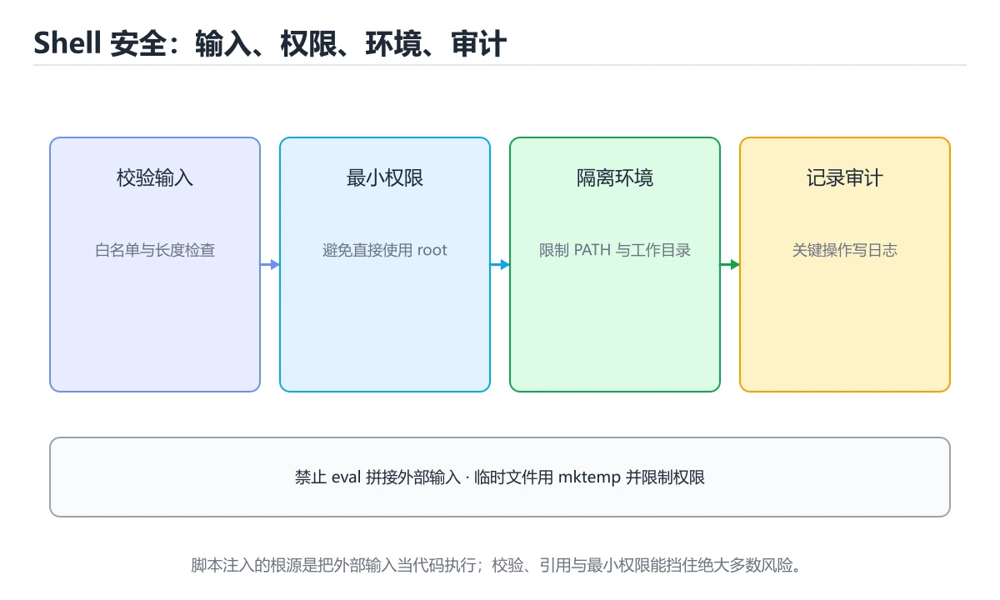
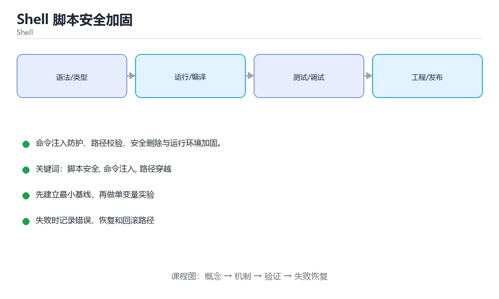

# 本课主题





> 内容更新时间：2026-10-03 · 学习阶段：高级 · 预计用时：18 分钟

## 学习目标

- 能用自己的话解释本课主题解决了什么问题，而不是只背术语。
- 能说清 「脚本安全」、「命令注入」、「路径穿越」、「mktemp」 之间的关系，并分别举出一个例子。
- 能把本课知识放回「Shell」的知识体系，说明它和相邻主题的边界。
- 能完成本课练习，并用验收标准检查自己的结果。

> 一句话摘要：命令注入防护、路径校验、安全删除与运行环境加固。

## 前置知识

- 先完成上一课《CI 脚本模板库》；如果已经掌握，可以直接用本课练习自测。
- 开始前先复习：脚本安全、命令注入、路径穿越。
- 如果某一步看不懂，先记录具体卡点，完成练习后再回头读一遍。

## 常见风险速查

| 风险 | 触发方式 | 加固手段 |
| --- | --- | --- |
| 命令注入 | 用户输入拼进命令 | 参数数组、白名单校验 |
| 路径穿越 | 输入含 `../` | 规范化路径并校验前缀 |
| 通配符爆炸 | 变量直接用作通配 | 加引号、`--` 结束选项 |
| 误删数据 | 变量为空导致 `rm -rf /` | 断言非空且路径合法 |
| 敏感信息泄漏 | 日志或 `set -x` 打印密钥 | 脱敏、临时关闭 xtrace |
| 供应链风险 | 下载后直接执行 | 校验哈希与签名 |
| 权限过大 | 以 root 运行、chmod 777 | 最小权限、专用账号 |
| 临时文件竞态 | 可预测文件名被抢注 | 用 `mktemp` |

## 输入校验速查

| 场景 | 写法 |
| --- | --- |
| 必填变量 | `: "${TOKEN:?必须设置 TOKEN}"` |
| 只允许数字 | `[[ "$count" =~ ^[0-9]+$ ]] \|\| die "count 必须是数字"` |
| 只允许白名单 | `case "$env" in dev\|staging\|prod) ;; *) die "非法环境" ;; esac` |
| 文件必须存在 | `[[ -f "$file" ]] \|\| die "文件不存在"` |
| 路径必须在目录内 | 规范化后校验前缀 |
| 参数转数组 | `args=("$@")` 而不是拼接字符串 |

```bash
#!/usr/bin/env bash
set -Eeuo pipefail
IFS=$'\n\t'

die() { printf 'ERROR: %s\n' "$1" >&2; exit 1; }

# 1. 下载后校验哈希，绝不直接执行
fetch_verified() {
  local url="$1" expected_sha="$2" dest="$3"
  curl --fail --location --silent --show-error --output "$dest" "$url" \
    || die "下载失败：$url"
  local actual
  actual=$(sha256sum "$dest" | awk '{print $1}')
  [[ "$actual" == "$expected_sha" ]] || { rm -f -- "$dest"; die "校验失败：$url"; }
}

# 2. 安全删除：断言路径在允许的根目录内
safe_remove() {
  local target="$1"
  local allowed_root="/var/tmp/app"
  [[ -n "$target" ]] || die "目标为空"
  local resolved
  resolved=$(realpath -m -- "$target")
  case "$resolved" in
    "$allowed_root"/*) ;;
    *) die "拒绝删除允许范围之外的路径：$resolved" ;;
  esac
  rm -rf -- "$resolved"
}

# 3. 避免把用户输入拼成命令
run_with_args() {
  local pattern="$1"
  # 用参数数组，shell 不会再做分词与元字符解析
  grep --fixed-strings -- "$pattern" /var/log/app.log
}

# 4. 敏感操作前临时关闭 xtrace，避免密钥进入日志
with_secret() {
  local secret="$1"
  local had_xtrace=0
  [[ "$-" == *x* ]] && had_xtrace=1
  set +x
  printf '%s' "$secret" > /dev/null      # 这里替换为真实的敏感调用
  (( had_xtrace )) && set -x
}

# 5. 临时文件用 mktemp 并自动清理
readonly WORK_DIR="$(mktemp -d)"
trap 'rm -rf -- "$WORK_DIR"' EXIT
```

## 运行环境加固速查

| 项 | 做法 |
| --- | --- |
| 运行账号 | 专用低权限账号，避免 root |
| 文件权限 | 脚本 750，配置 640，禁止全局可写 |
| umask | 设为 027，避免新建文件对其他用户可读 |
| 环境变量 | 不信任 `PATH`，用绝对路径或显式设置 |
| 日志 | 脱敏、限制权限、集中收集 |
| 依赖 | 固定版本并校验来源 |
| 审计 | 记录执行者、参数与结果 |

## 常见错误对照表

| 容易踩的做法 | 实际现象 | 原因与正确做法 |
| --- | --- | --- |
| 用 `eval` 执行拼接字符串 | 命令注入 | 用参数数组，避免 eval |
| `curl ... \| bash` | 供应链攻击 | 下载后校验哈希再执行 |
| 变量不加引号 | 分词与通配符展开 | 一律 `"$var"` |
| 删除前不校验路径 | 误删系统目录 | 断言非空且限定前缀 |
| 用可预测临时文件名 | 竞态与符号链接攻击 | 用 `mktemp` |
| `set -x` 打印密钥 | 日志泄漏 | 敏感段临时关闭 xtrace |
| 脚本 777 权限 | 被任意用户篡改 | 750 并归属专用账号 |

## 自测清单

- [ ] 所有外部输入经过白名单或格式校验。
- [ ] 破坏性操作断言路径非空且在允许范围内。
- [ ] 下载内容必须校验哈希后才使用。
- [ ] 临时文件用 `mktemp` 并在 trap 中清理。
- [ ] 脚本以最小权限运行，日志中无敏感信息。

## 零基础详解：脚本安全加固

### 一句话说清它是什么

脚本安全要防三件事：**误删自己的数据**、**被别人的文件名/输入攻击**、**泄露密钥**。
三条防线分别是：输入校验、安全调用、密钥外置。

### 用生活比喻理解

| 风险 | 比喻 | 防线 |
| --- | --- | --- |
| 变量为空 | 地址写错，货送到别人家 | 非空校验 + 引号 |
| 文件名含空格 | 名字里有空格被拆成两个人 | 用 NUL 分隔 |
| 临时文件被抢 | 有人提前占了你的柜子 | `mktemp` |
| 密钥进日志 | 密码写在便签上贴上墙 | 环境变量 + 脱敏 |
| 命令注入 | 有人塞了伪造指令 | 避免 `eval`、用数组传参 |

### 三条铁律

```bash
# 铁律一：变量必须非空校验，且一律加引号
: "${TARGET:?拒绝执行：TARGET 未设置}"
rm -rf -- "$TARGET"

# 铁律二：临时文件用 mktemp，别自己拼名字
readonly TMP_FILE="$(mktemp)"
trap 'rm -f -- "$TMP_FILE"' EXIT

# 铁律三：密钥只从环境变量或密钥服务读取，永不写进脚本
: "${API_TOKEN:?缺少 API_TOKEN}"
curl -H "Authorization: Bearer $API_TOKEN" "$URL"
```

### 文件名攻击与安全遍历

```bash
# 危险：文件名含空格或换行会被拆坏
for f in $(find . -name '*.log'); do rm "$f"; done

# 安全一：find 自带执行（推荐）
find . -name '*.log' -exec rm -f -- {} +

# 安全二：NUL 分隔
find . -name '*.log' -print0 | while IFS= read -r -d '' f; do
  rm -f -- "$f"
done

# 安全三：Bash 数组 + globstar
shopt -s nullglob
files=(./logs/**/*.log)
((${#files[@]})) && rm -f -- "${files[@]}"
```

### 命令注入：为什么别用 eval

```bash
# 危险：用户输入直接参与命令构造
name="$1"
eval "echo $name"          # 传入 '; rm -rf /' 就完了

# 安全：用数组传参，避免 shell 再解析一次
args=(--user "$1" --output "$2")
curl "${args[@]}" https://example.com

# 需要执行外部命令时，明确分隔参数
cmd="$1"; shift
"$cmd" "$@"
```

### 权限与最小化

```bash
umask 077                       # 新建文件默认只有自己能读写
chmod 600 "$SECRET_FILE"        # 密钥文件权限收紧
chmod +x script.sh              # 只给需要的执行权限

# 不要用 sudo 跑整段脚本，只给真正需要的命令
sudo systemctl restart myapp
```

### 日志脱敏

```bash
mask() {
  local value="$1"
  if ((${#value} <= 8)); then
    printf '***'
  else
    printf '%s****%s' "${value:0:4}" "${value: -4}"
  fi
}

echo "使用令牌 $(mask "$API_TOKEN") 访问接口"
```

**永远不要打印完整令牌、密码、身份证号、银行卡号。**

### 常见攻击与防护对照

| 攻击 | 触发条件 | 防护 |
| --- | --- | --- |
| 路径穿越 | 拼接用户输入的路径 | 校验不含 `..`，用 `realpath` 比对前缀 |
| 命令注入 | `eval` 或字符串拼命令 | 用数组传参，别 eval |
| 符号链接攻击 | 可预测的临时文件名 | `mktemp` |
| 权限提升 | 脚本被 sudo 执行且使用相对路径 | 用绝对路径，重设 PATH |
| 敏感信息泄露 | 密钥写进脚本或日志 | 环境变量 + 脱敏 |
| 通配符误伤 | `rm -rf $DIR/*` 变量为空 | 引号 + 非空校验 + `--` |

```bash
# 路径穿越防护示例
safe_join() {
  local base="$1" rel="$2"
  local full
  full="$(realpath -m -- "$base/$rel")"
  case "$full" in
    "$base"/*) printf '%s' "$full" ;;
    *) echo "非法路径：$rel" >&2; return 1 ;;
  esac
}
```

### 新手最容易踩的八个坑

| 坑 | 现象 | 正确做法 |
| --- | --- | --- |
| 变量不加引号 | 空格或空值导致意外 | 一律 `"$var"` |
| 用 `eval` 处理输入 | 命令注入 | 改数组传参 |
| 可预测的临时文件名 | 被抢占或符号链接攻击 | `mktemp` |
| 密钥写进脚本 | 泄露且难以轮换 | 环境变量或密钥服务 |
| 日志打印完整令牌 | 日志泄露 | 脱敏后输出 |
| 用 sudo 跑整脚本 | 权限过大 | 只给需要的那条命令 |
| 用相对路径做特权操作 | PATH 劫持 | 绝对路径 + 重设 PATH |
| 不校验用户路径 | 路径穿越 | `realpath` 加前缀比对 |

### 手把手练习：安全的文件清理脚本

```bash
#!/usr/bin/env bash
set -euo pipefail
umask 077

readonly BASE_DIR="${1:?用法：$0 <待清理目录> [保留天数]}"
readonly KEEP_DAYS="${2:-7}"

# 1. 绝对化并确认在允许范围内
readonly REAL_BASE="$(realpath -m -- "$BASE_DIR")"
if [[ "$REAL_BASE" == "/" || "$REAL_BASE" == "$HOME" ]]; then
  echo "拒绝在 $REAL_BASE 上执行清理" >&2
  exit 1
fi
[[ -d "$REAL_BASE" ]] || { echo "目录不存在：$REAL_BASE" >&2; exit 1; }

# 2. 先列出，再删除，全程使用 -print0
count=0
while IFS= read -r -d '' file; do
  ((count++))
  echo "删除：$file"
  rm -f -- "$file"
done < <(find "$REAL_BASE" -type f -mtime "+$KEEP_DAYS" -print0)

echo "共清理 $count 个文件"
```

### 学完自测

- [ ] 能说出脚本安全的三条铁律。
- [ ] 知道为什么不能用 `eval` 处理用户输入。
- [ ] 能说出安全遍历文件名的三种写法。
- [ ] 知道密钥应该从哪里读取。
- [ ] 能说出路径穿越的防护思路。

## 动手练习

> 本课练习重点：围绕「脚本安全、命令注入、路径穿越」完成复述、实验和交付，每个结果都要能被别人检查。

先加严格模式，再在临时目录验证成功与失败路径，最后补回滚。

### 练习 1：建立心智模型（10 分钟）

合上教程，用 3～5 句话回答：

1. 本课主题解决了什么问题？
2. 如果没有它，会出现什么具体后果？
3. 它和「命令注入」是什么关系？

**验收标准**：至少出现一个本课关键词，并写出一个反例、边界条件或失效场景。

### 练习 2：做一次可控实验（20 分钟）

从正文中选一个最小示例，完成以下操作：

1. 先预测修改一个参数、输入或步骤后的结果。
2. 再实际执行或逐步推演，记录真实结果。
3. 如果结果与预测不同，写出差异原因。

**验收标准**：留下「原例 → 改动 → 预测 → 结果 → 原因」五步记录。

### 练习 3：交付一个小结果（30 分钟）

写一个带 `set -euo pipefail` 的脚本，并用临时目录验证成功与失败路径。

任务要求：

- 结果必须能被别人检查，不能只写“我已经理解了”。
- 至少覆盖「脚本安全」和「命令注入」两个关键词。
- 写出 1 个仍然不确定的问题，以及下一步如何验证。

> 提示：时间有限时优先做练习 1 和练习 2；练习 3 可以拆成两次完成。

## 本课小结

- 核心问题：本课主题不是孤立术语，而是在「Shell」中解决一类具体问题。
- 关键关系：先分清「脚本安全」与「命令注入」的职责，再理解「路径穿越」的适用边界。
- 判断标准：能解释正常场景、边界条件和失败场景，才算真正掌握。
- 下一步：完成练习后，用自己的话写下 3 条要点，再去做本课测验。

## 可运行练习

### 任务 1：先跑通，再解释

```bash
mask() {
  local value="$1"
  if ((${#value} <= 8)); then
    printf '***'
  else
    printf '%s****%s' "${value:0:4}" "${value: -4}"
  fi
}

echo "使用令牌 $(mask "$API_TOKEN") 访问接口"
```

**预期输出**：使用令牌 $(mask

### 任务 2：只改一个条件

### 任务 3：迁移到自己的数据

用同一套思路处理一组你自己的数据或场景，保持输出格式与任务 1 一致。

## 故障现场

### 现场 1：本课的 脚本安全 常规用例通过，但边界用例失败

**症状**：在本课的练习或生产场景里出现“本课的 脚本安全 常规用例通过，但边界用例失败”。

**复现**：准备一组最小输入，只保留触发“本课的 脚本安全 常规用例通过，但边界用例失败”的必要条件，连续运行两次确认结果稳定。

**定位**：围绕“脚本安全 的前置条件与取值边界没有写进代码，默认值掩盖了空值和极值”检查调用链、输入数据和环境配置，先验证假设再改代码。

**预防**：把“本课的 脚本安全 常规用例通过，但边界用例失败”写成一条自动化用例，并在本课的验收清单里保留对应检查项。

### 现场 2：本课的 命令注入 结果在两次运行之间不一致

**症状**：在本课的练习或生产场景里出现“本课的 命令注入 结果在两次运行之间不一致”。

**复现**：准备一组最小输入，只保留触发“本课的 命令注入 结果在两次运行之间不一致”的必要条件，连续运行两次确认结果稳定。

**定位**：围绕“命令注入 依赖了当前版本、执行顺序或共享状态，单次运行无法暴露差异”检查调用链、输入数据和环境配置，先验证假设再改代码。

**预防**：把“本课的 命令注入 结果在两次运行之间不一致”写成一条自动化用例，并在本课的验收清单里保留对应检查项。

### 现场 3：本课的验证只在开发机通过

**症状**：在本课的练习或生产场景里出现“本课的验证只在开发机通过”。

**定位**：围绕“环境版本、配置和输入规模与目标环境不同，脚本安全 缺少可重复的验证记录”检查调用链、输入数据和环境配置，先验证假设再改代码。

## 版本与时效

- Bash 5.x 与 POSIX sh 的行为差异仍然是最常见的可移植性来源
- 升级前确认目标环境的 Bash 版本、内置命令与数组能力

### 升级检查清单

- 先固定当前版本，跑通全部示例与测验，再升级工具链。
- 只改一个版本变量，记录编译、测试、性能与产物体积的变化。
- 重点回归默认值、弃用警告、序列化格式、并发语义和错误信息。
- 升级完成后更新本课的“最后复核 / 下次复核”日期与版本说明。

## 本课复习清单

离开本课前，逐项确认：

- [ ] 不看解析，能说出「防止命令注入最根本的做法是？」的判断依据。
- [ ] 不看解析，能说出「删除目录前的安全做法是？」的判断依据。
- [ ] 不看解析，能说出「临时文件应该怎么创建？」的判断依据。
- [ ] 不看解析，能说出「从网络下载脚本后直接执行（curl 管道到 bash）的风险是？」的判断依据。
- [ ] 不看解析，能说出「敏感操作时如何避免密钥进入 CI 日志？」的判断依据。
- [ ] 不看解析，能说出「补全代码：本课主题示例中，下面这行代码缺少哪个关键字或函数名…」的判断依据。
- [ ] 至少运行一次本课示例，记录输入、输出和一个边界情况。
- [ ] 把本课最容易混淆的两个概念写成一句话对照。

| 复盘项 | 记录 |
| --- | --- |
| 已经能独立解释的考点 |  |
| 仍然说不清的概念 |  |
| 下一步验证动作 |  |

## 术语速查

| 术语 | 本课语境 |
| --- | --- |
| `../` | \| 路径穿越 \| 输入含 `../` \| 规范化路径并校验前缀 \| |
| `--` | \| 通配符爆炸 \| 变量直接用作通配 \| 加引号、`--` 结束选项 \| |
| `rm -rf /` | \| 误删数据 \| 变量为空导致 `rm -rf /` \| 断言非空且路径合法 \| |
| `set -x` | \| 敏感信息泄漏 \| 日志或 `set -x` 打印密钥 \| 脱敏、临时关闭 xtrace \| |
| `mktemp` | \| 临时文件竞态 \| 可预测文件名被抢注 \| 用 `mktemp` \| |
| `: "${TOKEN:?必须设置 TOKEN}"` | \| 必填变量 \| `: "${TOKEN:?必须设置 TOKEN}"` \| |
| `[[ -f "$file" ]] \|\| die "文件不存在"` | \| 文件必须存在 \| `[[ -f "$file" ]] \\|\\| die "文件不存在"` \| |
| `args=("$@")` | \| 参数转数组 \| `args=("$@")` 而不是拼接字符串 \| |
| `PATH` | \| 环境变量 \| 不信任 `PATH`，用绝对路径或显式设置 \| |
| `eval` | \| 用 `eval` 执行拼接字符串 \| 命令注入 \| 用参数数组，避免 eval \| |
| `curl ... \| bash` | \| `curl ... \\| bash` \| 供应链攻击 \| 下载后校验哈希再执行 \| |
| `"$var"` | \| 变量不加引号 \| 分词与通配符展开 \| 一律 `"$var"` \| |

## 考点精讲

### 考点 1：防止命令注入最根本的做法是？

- **判断依据**：正确答案是「避免 eval 与字符串拼接」。参数数组让 Shell 不再对内容做分词与元字符解析，从根上消除注入。判断这类题时，要把「避免 eval 与字符串拼接」放回题干限定的对象、输入和边界，「过滤分号与竖线」、「限制输入长度」 等说法虽然包含相关术语，但范围或前提与本题不一致。

### 考点 2：围绕“Shell 脚本安全加固”中的 脚本安全、命令注入、路径穿越，下列哪两项是本课强调的实践判断？

- **判断依据**：正确答案包括「验证 命令注入 时要固定版本并覆盖边界输入，结论才可复现」、「学习 脚本安全 时要同时说明输入、输出和失败路径，不能只看正常流程」。本题应选验证 命令注入 时要固定版本并覆盖边界输入。本课把本课主题拆成概念、示例与故障现场三部分，因此判断 脚本安全 时必须同时交代输入、输出和失败路径，这使“学习 脚本安全 时要同时说明输入、输出和失败路径，不能只看正常流程”成立。在本课主题里，判断 命令注入 时要固定版本与边界输入，所以“验证 命令注入 时要固定版本并覆盖边界输入，结论才可复现”才可复现。

### 考点 3：阅读「Shell 脚本安全加固」中的这段 Shell 代码，下面哪项判断最准确？

- **判断依据**：符合题干条件的是「命令注入防护、路径校验、安全删除与运行环境加固」。符合题干条件的是命令注入防护、路径校验、安全删除与运行环境加固。这段 Shell 代码来自本课的本地示例，主要用来核对 脚本安全、命令注入、路径穿越、mktemp 之间的输入、处理和输出关系，命令注入防护、路径校验、安全删除与运行环境加固。

### 考点 4：从网络下载脚本后直接执行（curl 管道到 bash）的风险是？

- **判断依据**：结论应落在「无法验证来源与完整性」。供应链攻击会替换下载内容，正确做法是先下载、校验哈希或签名，再执行。这道题要求区分概念与边界，「无法验证来源与完整性」只有在题干给出的前提下才成立，而「占用更多内存」、「不支持 HTTPS」缺少同一组条件。

### 考点 5：敏感操作时如何避免密钥进入 CI 日志？

- **判断依据**：正确答案是「临时关闭 xtrace（set +x）并对输出脱敏」。set -x 会把展开后的命令打印到日志，敏感段必须临时关闭跟踪并做遮蔽。判断这类题时，要把「临时关闭 xtrace（set +x）并对输出脱敏」放回题干限定的对象、输入和边界，「使用更短的密钥」、「把日志级别调低」 等说法虽然包含相关术语，但范围或前提与本题不一致。

### 考点 6：补全代码：「Shell 脚本安全加固」示例中，下面这行代码缺少哪个关键字或函数名？请填入 ____。

`resolved=$(____ -m -- "$target")`

- **判断依据**：围绕 补全代码：本课主题示例中，下面这行代码缺少哪个关… 作答时，先用脚本安全建立输入与输出的基线，再把realpath代入边界条件核对，结论才能复现。解题的关键不是记住孤立术语，而是确认「realpath」是否完整覆盖题干的输入、输出和失败路径，并排除这类相邻概念。

## English Overview

**Title:** Shell Script Security

**Summary:** Injection defense, path validation, safe deletion and hardening.

**Category:** Shell
**Level:** 高级
**Key terms:** 脚本安全, 命令注入, 路径穿越, mktemp, 最小权限, 供应链

## 内容元数据

- 内容版本：v2.0
- 最后更新：2026-10-03
- 学习阶段：高级
- 适用环境：Bash 5 / POSIX Shell
- 内容来源：内置结构化课程与工程实践整理
- 相关主题：脚本安全、命令注入、路径穿越、mktemp、最小权限、供应链
- 质量版本：P0 测验标准 + P1 覆盖扩展 + P2 体验补全

## Full English Study Guide

### Overview

**Shell Script Security** focuses on Injection defense, path validation, safe deletion and hardening.

### Learning Outcomes

- Explain what **Shell Script Security** solves and when it should be used.

### Core Mental Model

### Step-by-step Study Plan

### Practice Tasks

### Common Failure Modes

### Self-check Questions

4. What is the rollback path?

### Glossary

- Topic: **Shell Script Security**
- Related terms: 脚本安全, 命令注入, 路径穿越, mktemp

## Bilingual Section Outline

| 中文小节 | English section |
| --- | --- |
| 学习目标 | Learning Objectives |
| 前置知识 | Pre-knowledge |
| 常见风险速查 | Common Quick Risk Checks |
| 输入校验速查 | Enter checksum |
| 运行环境加固速查 | Operational environment reinforcement quick check |
| 常见错误对照表 | Common Errors Comparison Table |
| 自测清单 | Self Test Checklist |
| 零基础详解：脚本安全加固 | Zero Basics Explained in Detail: Script Security Reinforcement |
| 动手练习 | Hands on exercise: |
| 本课小结 | Lesson Summary |


## 参考资料与复核

- 最后复核：2026-10-04
- 下次复核：2027-04-04
- 复核范围：版本兼容、API 行为、安全建议与工程实践
- 来源性质：官方文档、标准或权威教材；正文为离线教学重组

| 参考资料 | 本课用途 |
| --- | --- |
| [GNU Bash 手册](https://www.gnu.org/software/bash/manual/) | Bash 语法、展开与作业控制 |
| [POSIX Shell 标准](https://pubs.opengroup.org/onlinepubs/9799919799/utilities/V3_chap02.html) | 可移植 Shell 语法 |
| [cron 手册](https://man7.org/linux/man-pages/man5/crontab.5.html) | 定时任务与调度 |

> 「Shell 脚本安全加固」的链接用于离线阅读后的延伸核对；App 不会自动联网。
