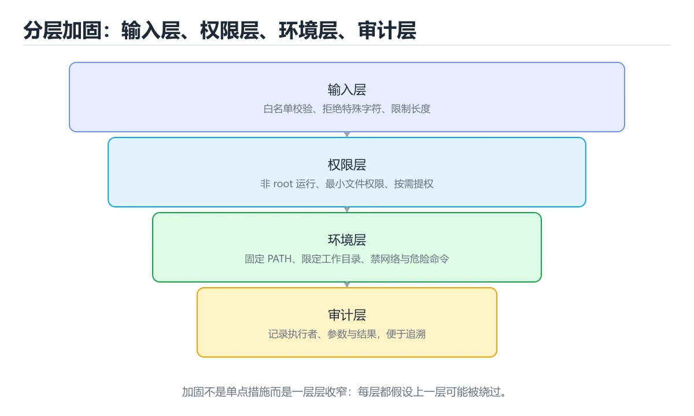
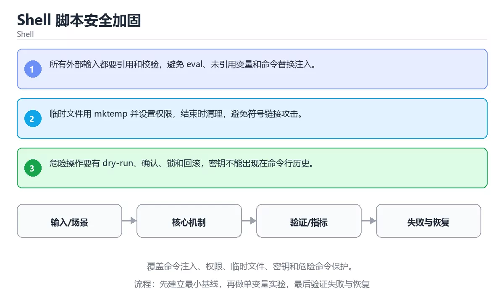

# Shell 脚本安全加固（进阶）

> 内容更新时间：2026-10-06 · 学习阶段：高级 · 预计用时：35 分钟





## 学习目标

- 能用自己的话解释：所有外部输入都要引用和校验，避免 eval、未引用变量和命令替换注入。
- 能用自己的话解释：临时文件用 mktemp 并设置权限，结束时清理，避免符号链接攻击。
- 能用自己的话解释：危险操作要有 dry-run、确认、锁和回滚，密钥不能出现在命令行历史。
- 能把本课知识放回「Shell」，并完成练习与测验。

## 前置知识

- 已完成「Shell」的基础课程，能运行正文中的最小示例。
- 本课关键词：命令注入、权限、临时文件、密钥。
- 遇到不熟悉的术语先记录问题，完成练习后再回读。

## 核心知识

### 1. 所有外部输入都要引用和校验，避免 eval、未引用变量和命令替换注入。

- 关键做法：先用最小示例建立基线，再逐步加入边界、失败和性能条件。
- 验证标准：结果可复现、错误可解释、边界有测试、失败能恢复。

### 2. 临时文件用 mktemp 并设置权限，结束时清理，避免符号链接攻击。

把这条结论放回「Shell 脚本安全加固（进阶）」的完整流程里展开：

- 正文依据：能用自己的话解释：临时文件用 mktemp 并设置权限，结束时清理，避免符号链接攻击。
- 落地检查：把「2. 临时文件用 mktemp 并设置权限，结束时清理，避免符号链接攻击。」改写成一条可执行的核对项，逐条验证输入、超时与失败路径。

### 3. 危险操作要有 dry-run、确认、锁和回滚，密钥不能出现在命令行历史。

把这条结论放回「Shell 脚本安全加固（进阶）」的完整流程里展开：

- 正文依据：能用自己的话解释：危险操作要有 dry-run、确认、锁和回滚，密钥不能出现在命令行历史。
- 落地检查：把「3. 危险操作要有 dry-run、确认、锁和回滚，密钥不能出现在命令行历史。」改写成一条可执行的核对项，逐条验证输入、超时与失败路径。

## 关键流程

```text
输入 → 校验 → 核心处理 → 验证 → 记录指标 → 失败恢复
```

## 实践路径

1. 用一句话复述本课要解决的问题。
2. 跑通正文中的最小示例并记录基线。
3. 只改变一个输入或参数，预测并验证结果。
4. 补一个失败路径，记录错误、恢复和指标。
5. 把结论写成可复现的笔记或测试。

## 常见错误与排查

| 误区 | 后果 | 修正 |
| --- | --- | --- |
| 只记术语不做实验 | 遇到真实问题无法判断 | 用最小输入跑通并记录结果 |
| 只测正常路径 | 边界和故障上线才暴露 | 补空值、极值和依赖失败 |
| 没有基线就优化 | 无法证明改进有效 | 先测量再修改 |
| 忽略成本与安全 | 性能和风险失控 | 同时记录资源、权限与失败代价 |
- **关于，下列说法正确的是？**：正确答案是「所有外部输入都要引用和校验，避免 eval、未引用变量和命令替换注入。
- **关于，下列说法正确的是？**：正确答案是「临时文件用 mktemp 并设置权限，结束时清理，避免符号链接攻击。
- **关于，下列说法正确的是？**：正确答案是「危险操作要有 dry-run、确认、锁和回滚，密钥不能出现在命令行历史。
- **「Shell 脚本安全加固」的核心学习目标是什么？**：正确答案是「覆盖命令注入、权限、临时文件、密钥和危险命令保护。

## 动手练习

1. 合上教程，用 3～5 句话解释「Shell 脚本安全加固」。
2. 从正文选一个例子，改变一个条件并预测结果。
3. 设计一个失败场景，写出止损与恢复步骤。

**验收标准**：留下输入、命令、输出、差异和下一步问题。

## 本课小结

- 本课属于「Shell」，核心关键词是 命令注入、权限、临时文件、密钥。
- 先保证正确与可复现，再讨论性能和扩展。
- 完成练习和测验后，把仍然不确定的问题写成下一轮验证清单。

> 本课由 P1 内容扩展生成，重点补充原有课程缺失的主题与工程边界。

## 可运行练习

### 任务 1：先跑通，再解释

```bash
#!/usr/bin/env bash
set -euo pipefail
IFS=$'\n\t'

workdir="$(mktemp -d)"
trap 'rm -rf "$workdir"' EXIT

target="${workdir}/report.txt"
printf 'safe\n' > "$target"
if [[ -f "$target" ]]; then
```

### 任务 2：只改一个条件

把「Shell 脚本安全加固（进阶）」的最小示例复制一份，只改一个条件再跑一次：

- 改动点：只把命令注入的输入换成空值、极值或错误输入，其余保持不变。
- 预测：先写下「Shell 脚本安全加固（进阶）」在改动后的输出或错误信息，再运行。
- 记录：对照改动前后的结果，指出差异出在哪一步。
- 验收：换回原条件能复现原结果，改动只影响命令注入。

### 任务 3：迁移到自己的数据

用同一套思路处理一组你自己的数据或场景，保持输出格式与任务 1 一致。

## 故障现场

### 现场 1：本课的 命令注入 常规用例通过，但边界用例失败

**症状**：在本课的练习或生产场景里出现“本课的 命令注入 常规用例通过，但边界用例失败”。

**复现**：准备一组最小输入，只保留触发“本课的 命令注入 常规用例通过，但边界用例失败”的必要条件，连续运行两次确认结果稳定。

**定位**：围绕“命令注入 的前置条件与取值边界没有写进代码，默认值掩盖了空值和极值”检查调用链、输入数据和环境配置，先验证假设再改代码。

**预防**：把“本课的 命令注入 常规用例通过，但边界用例失败”写成一条自动化用例，并在本课的验收清单里保留对应检查项。

### 现场 2：本课的 权限 结果在两次运行之间不一致

**症状**：在本课的练习或生产场景里出现“本课的 权限 结果在两次运行之间不一致”。

**复现**：准备一组最小输入，只保留触发“本课的 权限 结果在两次运行之间不一致”的必要条件，连续运行两次确认结果稳定。

**定位**：围绕“权限 依赖了当前版本、执行顺序或共享状态，单次运行无法暴露差异”检查调用链、输入数据和环境配置，先验证假设再改代码。

**预防**：把“本课的 权限 结果在两次运行之间不一致”写成一条自动化用例，并在本课的验收清单里保留对应检查项。

### 现场 3：本课的验证只在开发机通过

**症状**：在本课的练习或生产场景里出现“本课的验证只在开发机通过”。

**定位**：围绕“环境版本、配置和输入规模与目标环境不同，命令注入 缺少可重复的验证记录”检查调用链、输入数据和环境配置，先验证假设再改代码。

## 版本与时效

- Bash 5.x 与 POSIX sh 的行为差异仍然是最常见的可移植性来源
- 升级前确认目标环境的 Bash 版本、内置命令与数组能力

### 升级检查清单

- 先固定当前版本，跑通全部示例与测验，再升级工具链。
- 只改一个版本变量，记录编译、测试、性能与产物体积的变化。
- 重点回归默认值、弃用警告、序列化格式、并发语义和错误信息。
- 升级完成后更新本课的“最后复核 / 下次复核”日期与版本说明。

## 本课复习清单

离开本课前，逐项确认：

- [ ] 不看解析，能说出「关于，下列说法正确的是？」的判断依据。
- [ ] 不看解析，能说出「「Shell 脚本安全加固」的核心学习目标是什么？」的判断依据。
- [ ] 不看解析，能说出「补全代码：「Shell 脚本安全加固」示例中，」的判断依据。
- [ ] 至少运行一次本课示例，记录输入、输出和一个边界情况。
- [ ] 把本课最容易混淆的两个概念写成一句话对照。

| 复盘项 | 记录 |
| --- | --- |
| 已经能独立解释的考点 |  |
| 仍然说不清的概念 |  |
| 下一步验证动作 |  |

## 复习与自测

下面按正文顺序回顾每一节，并给出一个自检问题；说不清的地方回到原章节补课。

### 核心知识

自检：这一节与相邻主题的边界在哪里？

### 动手练习

合上教程，用 3～5 句话解释「Shell 脚本安全加固」。从正文选一个例子，改变一个条件并预测结果。

自检：如果去掉这一节里的一个前提，结论会怎样变化？

### 最小可运行示例

```bash
#!/usr/bin/env bash
set -euo pipefail
IFS=$'\n\t'

workdir="$(mktemp -d)"
trap 'rm -rf "$workdir"' EXIT

target="${workdir}/report.txt"
printf 'safe\n' > "$target"
if [[ -f "$target" ]]; then
```

自检：把这一节讲给没学过的人，最需要强调哪一点？

### 预期输出

```text
checked: report.txt
```

### 验证步骤

制造一次错误输入，记录错误信息与修复方式。

## 术语速查

| 术语 | 一句话说明 |
| --- | --- |
| `命令注入` | 围绕“环境版本、配置和输入规模与目标环境不同，命令注入 缺少可重复的验证记录”检查调用链、输入数据和环境配置，先验证假设再改代码。 |
| `权限` | 围绕“权限 依赖了当前版本、执行顺序或共享状态，单次运行无法暴露差异”检查调用链、输入数据和环境配置，先验证假设再改代码。 |
| `临时文件` | 用一句话说明「Shell 脚本安全加固（进阶）」解决什么问题：覆盖命令注入、权限、临时文件、密钥和危险命令保护。 |
| `密钥` | 本课属于「Shell」，核心关键词是 命令注入、权限、临时文件、密钥。 |

## 零基础精讲：把「Shell 脚本安全加固」真正讲透

### 先建立一个直觉

把「Shell 脚本安全加固」看成一个有输入、处理、输出和失败边界的工程问题。先定义什么叫正确，再讨论性能和扩展。

本课的摘要可以当作一张地图：覆盖命令注入、权限、临时文件、密钥和危险命令保护。

### 逐步拆解

1. 澄清输入与目标。先写清「Shell 脚本安全加固（进阶）」要解决的问题、合法输入范围和成功标准，再进入后续步骤。
2. 描述处理过程。把「命令注入、权限、临时文件、密钥」映射到具体步骤，每步都要求能单独验证。
3. 定义输出。输出不仅包括正常结果，还包括错误码、日志、指标和资源释放状态。
4. 找出一条失败路径。让错误尽早暴露，并说明重试、降级、回滚或人工处理的边界。
5. 用一个小例子贯穿全过程。先手算或预测结果，再运行代码或实验，最后解释差异。

### 把正文串成一条执行链

- **1. 所有外部输入都要引用和校验，避免 eval、未引用变量和命令替换注入。**：在「Shell 脚本安全加固（进阶）」里，「1. 所有外部输入都要引用和校验，避免 eval、未引用变量和命令替换注入。」这一步要先写清输入与预期，再记录实际结果和差异；结果不符时回到对应小节核对前提。
- **2. 临时文件用 mktemp 并设置权限，结束时清理，避免符号链接攻击。**：在「Shell 脚本安全加固（进阶）」里，「2. 临时文件用 mktemp 并设置权限，结束时清理，避免符号链接攻击。」这一步要先写清输入与预期，再记录实际结果和差异；结果不符时回到对应小节核对前提。
- **3. 危险操作要有 dry-run、确认、锁和回滚，密钥不能出现在命令行历史。**：在「Shell 脚本安全加固（进阶）」里，「3. 危险操作要有 dry-run、确认、锁和回滚，密钥不能出现在命令行历史。」这一步要先写清输入与预期，再记录实际结果和差异；结果不符时回到对应小节核对前提。
- **考点 1：关于，下列说法正确的是？**：针对「Shell 脚本安全加固（进阶）」，先自问「关于，下列说法正确的是」；作答后回到对应考点核对判断依据。
- **考点 2：关于，下列说法正确的是？**：针对「Shell 脚本安全加固（进阶）」，先自问「关于，下列说法正确的是」；作答后回到对应考点核对判断依据。
- **考点 3：关于，下列说法正确的是？**：针对「Shell 脚本安全加固（进阶）」，先自问「关于，下列说法正确的是」；作答后回到对应考点核对判断依据。

### 从测验反推易错点

**检查点 1：关于，下列说法正确的是？**

- 参考判断：所有外部输入都要引用和校验，避免 eval、未引用变量和命令替换注入。
- 自问：如果去掉题干里的一个限定词，结论还成立吗？

**检查点 2：关于，下列说法正确的是？**

- 参考判断：临时文件用 mktemp 并设置权限，结束时清理，避免符号链接攻击。

**检查点 3：关于，下列说法正确的是？**

- 参考判断：危险操作要有 dry-run、确认、锁和回滚，密钥不能出现在命令行历史。

**检查点 4：「Shell 脚本安全加固」的核心学习目标是什么？**

- 参考判断：覆盖命令注入、权限、临时文件、密钥和危险命令保护。

- 参考判断：mktemp

### 工程排错顺序

| 先查什么 | 要得到的证据 | 判断标准 |
| --- | --- | --- |
| 输入与前提是否满足 | 日志、输入样例、测试或指标 | 能复现并解释，才算定位 |
| 核心步骤是否产生了预期中间结果 | 日志、输入样例、测试或指标 | 能复现并解释，才算定位 |
| 失败路径是否可观测、可恢复 | 日志、输入样例、测试或指标 | 能复现并解释，才算定位 |
| 资源、权限与成本是否在预算内 | 日志、输入样例、测试或指标 | 能复现并解释，才算定位 |

### 变式训练

1. 把它放进一个只有单机、没有额外依赖的小项目，先保证正确，再考虑扩展。
2. 把输入规模扩大十倍，记录时间、内存和失败路径，找出第一个真正瓶颈。
3. 制造一次依赖超时或错误输入，要求系统给出可解释错误并且不留下半完成状态。
5. 删掉一个看似必要的步骤，观察哪个测试或指标先失败，用证据说明它为什么必要。
6. 把方案切换到低资源设备，重新评估默认参数、超时和降级策略。

### 本课自测

- [ ] 能用一句话解释「命令注入」在本课中的角色与边界。
- [ ] 能举出一个正常例子和一个失败例子。
- [ ] 能说出最小验证步骤，以及需要记录的证据。
- [ ] 能用一句话解释「权限」在本课中的角色与边界。
- [ ] 能用一句话解释「临时文件」在本课中的角色与边界。
- [ ] 能用一句话解释「密钥」在本课中的角色与边界。

### 迁移案例库

下面用不同约束重复同一套方法。每完成一轮，都把结论写进笔记，并只改变一个变量。

#### 迁移案例 1：围绕「命令注入」做一次小实验

**目标**：在不改变课程主体的前提下，验证「Shell 脚本安全加固」中的一个关键判断。

**步骤**：
1. 复述当前方案对「命令注入」的假设，写成一句可证伪的话。
2. 设计一个正常输入和一个边界输入，分别预测输出。
3. 运行或逐步演算，记录实际输出、耗时和失败信息。
4. 只调整一个参数，比较前后差异并解释原因。
5. 补充一条测试或复习卡，确保下次能更快复现。

**验收**：结论有证据、差异可解释、失败可恢复；如果做不到，说明还需要缩小问题范围。

#### 迁移案例 2：围绕「权限」做一次小实验

**步骤**：
1. 复述当前方案对「权限」的假设，写成一句可证伪的话。

#### 迁移案例 3：围绕「临时文件」做一次小实验

**步骤**：
1. 复述当前方案对「临时文件」的假设，写成一句可证伪的话。

#### 迁移案例 4：围绕「密钥」做一次小实验

**步骤**：
1. 复述当前方案对「密钥」的假设，写成一句可证伪的话。

#### 迁移案例 5：围绕「命令注入」做一次小实验

**步骤**：

#### 迁移案例 6：围绕「权限」做一次小实验

**步骤**：

#### 迁移案例 7：围绕「临时文件」做一次小实验

**步骤**：

#### 迁移案例 8：围绕「密钥」做一次小实验

**步骤**：

#### 迁移案例 9：围绕「命令注入」做一次小实验

**步骤**：

#### 迁移案例 10：围绕「权限」做一次小实验

**步骤**：

#### 迁移案例 11：围绕「临时文件」做一次小实验

**步骤**：

#### 迁移案例 12：围绕「密钥」做一次小实验

**步骤**：

#### 迁移案例 13：围绕「命令注入」做一次小实验

**步骤**：

#### 迁移案例 14：围绕「权限」做一次小实验

**步骤**：

#### 迁移案例 15：围绕「临时文件」做一次小实验

**步骤**：

#### 迁移案例 16：围绕「密钥」做一次小实验

**步骤**：

<!-- p0-depth-v2:end -->

## 考点精讲

### 考点 1：多选辨析·命令注入

- **题目**：围绕“Shell 脚本安全加固（进阶）”中的 命令注入、权限、临时文件，下列哪两项是本课强调的实践判断？
- **判断依据**：本课把Shell 脚本安全加固（进阶）拆成概念、示例与故障现场三部分，因此判断 命令注入 时必须同时交代输入、输出和失败路径，这使“学习 命令注入 时要同时说明输入、输出和失败路径，不能只看正常流程”成立。在Shell 脚本安全加固（进阶）里，判断 权限 时要固定版本与边界输入，所以“验证 权限 时要固定版本并覆盖边界输入，结论才可复现”才可复现。

### 考点 2：代码补全·命令注入

- **题目**：阅读「Shell 脚本安全加固（进阶）」中的这段 Shell 代码，下面哪项判断最准确？
- **判断依据**：在「Shell 脚本安全加固（进阶）」里，这段 Shell 代码来自本课的本地示例，主要用来核对 命令注入、权限、临时文件、密钥 之间的输入、处理和输出关系，覆盖命令注入、权限、临时文件、密钥和危险命令保护。这道题的关键在「Shell 脚本安全加固（进阶）」的命令注入、权限、临时文件：先确认题干“阅读Shell 脚本安全加固（进阶）”问的是哪一步，再排除偷换前提的选项。

### 考点 3：概念判断·命令注入

- **题目**：关于「危险操作要有 dry-run、确认、锁和回滚，密钥不能出现在命令行历史。」，下列说法正确的是？
- **判断依据**：在「Shell 脚本安全加固（进阶）」里，危险操作要有 dry-run、确认、锁和回滚，密钥不能出现在命令行历史。在「Shell 脚本安全加固（进阶）」里判断这道题，要把命令注入、权限、临时文件的条件、过程与失败路径逐项对齐，换成“关于危险操作要有 dry-run、确”这个场景，只有满足前提的结论才成立。

### 考点 4：概念判断·Shell 脚本安全加固

- **题目**：「Shell 脚本安全加固」的核心学习目标是什么？
- **判断依据**：在「Shell 脚本安全加固（进阶）」里，结论应落在「覆盖命令注入、权限、临时文件、密钥和危险命令保护」。在「Shell 脚本安全加固（进阶）」里，结论应落在覆盖命令注入、权限、临时文件、密钥和危险命令保护。在「Shell 脚本安全加固（进阶）」里，这道题要求区分概念与边界，覆盖命令注入、权限、临时文件、密钥和危险命令保护。

### 考点 5：填空·Shell 脚本安全加固

- **题目**：补全代码：「Shell 脚本安全加固」示例中，下面这行代码缺少哪个关键字或函数名？请填入 ____。 `workdir="$(____ -d)"`
- **判断依据**：在「Shell 脚本安全加固（进阶）」里，mktemp。这道题的关键在「Shell 脚本安全加固（进阶）」的命令注入、权限、临时文件：先确认题干“补全代码”问的是哪一步，再排除偷换前提的选项。回到命令注入、权限、临时文件本身再看一遍：只有“mktemp”与题干“Shell”的前提一致，结论才成立。

### 考点 6：顺序排列·Shell 脚本安全加固

- **题目**：按照「Shell 脚本安全加固」从概念到实践的讲解顺序排列下列主题。
- **判断依据**：结合命令注入、权限来看，正确的执行顺序是「核心知识 → 关键流程 → 实践路径 → 常见误区」。在「Shell 脚本安全加固」中，正确顺序是：1. 核心知识 → 2. 关键流程 → 3. 实践路径 → 4. 常见误区。「Shell 脚本安全加固」先建立概念，再解释运行机制，随后进入代码与工程实践，最后处理失败路径。

## English Overview

**Title:** Shell Script Security Hardening

**Summary:** Cover command injection, permissions, temp files, secrets and dangerous commands.

**Category:** Shell
**Level:** 高级
**Key terms:** 命令注入, 权限, 临时文件, 密钥

## 内容元数据

- 内容版本：v2.0
- 最后更新：2026-10-06
- 学习阶段：高级
- 适用环境：Bash 5 / POSIX Shell
- 内容来源：内置结构化课程与工程实践整理
- 相关主题：命令注入、权限、临时文件、密钥
- 质量版本：P0 测验标准 + P1 覆盖扩展 + P2 体验补全

## 最小可运行示例

下面示例用于验证「Shell 脚本安全加固」的最小输入、处理和输出。先原样运行，再只修改一个值：

```bash
#!/usr/bin/env bash
set -euo pipefail
IFS=$'\n\t'

workdir="$(mktemp -d)"
trap 'rm -rf "$workdir"' EXIT

target="${workdir}/report.txt"
printf 'safe\n' > "$target"
if [[ -f "$target" ]]; then
  printf 'checked: %s\n' "$(basename "$target")"
fi
```

## 预期输出

```text
checked: report.txt
```

## 验证步骤

1. 记录运行环境、命令和真实输出。
2. 修改一个输入，先写预测再运行。
4. 把结论写回本课笔记或测试用例。

## 参考资料与复核

- 最后复核：2026-10-04
- 下次复核：2027-04-04
- 复核范围：版本兼容、API 行为、安全建议与工程实践
- 来源性质：官方文档、标准或权威教材；正文为离线教学重组

| 参考资料 | 本课用途 |
| --- | --- |
| [GNU Findutils](https://www.gnu.org/software/findutils/manual/) | find、xargs 与文件检索 |
| [ShellCheck 文档](https://www.shellcheck.net/wiki/) | 脚本缺陷与安全写法 |
| [jq 手册](https://jqlang.org/manual/) | JSON 查询与转换 |

> 「Shell 脚本安全加固（进阶）」的链接用于离线阅读后的延伸核对；App 不会自动联网。

## 复习与迁移

复习目标：把「Shell 脚本安全加固（进阶）」的判断标准放回可复现的例子里。先自己作答，再对照依据；如果结论正确但理由不完整，回到正文补足前提。

### 概念复述

- 用一句话说明「Shell 脚本安全加固（进阶）」解决什么问题：覆盖命令注入、权限、临时文件、密钥和危险命令保护。
- 写出命令注入、权限、临时文件之间的关系，并各举一个例子。
- 说出本课最容易混淆的两个概念，以及区分它们的判据。

### 正文逐节复核

- **零基础精讲：把「Shell 脚本安全加固」真正讲透**：本课的摘要可以当作一张地图：覆盖命令注入、权限、临时文件、密钥和危险命令保护。

### 测验回顾

1. 围绕“Shell 脚本安全加固（进阶）”中的 命令注入、权限、临时文件，下列哪两项是本课强调的实践判断？
   - 依据：本课把Shell 脚本安全加固（进阶）拆成概念、示例与故障现场三部分，因此判断 命令注入 时必须同时交代输入、输出和失败路径，这使“学习 命令注入 时要同时说明输入、输出和失败路径，不能只看正常流程”成立。在Shell 脚本安全加固（进阶）里，判断 权限 时要固定版本与边界输入，所以“验证 权限 时要固定版本并覆盖边界输入，结论才可复现”才可复现。
2. 阅读「Shell 脚本安全加固（进阶）」中的这段 Shell 代码，下面哪项判断最准确？
   - 依据：在「Shell 脚本安全加固（进阶）」里，这段 Shell 代码来自本课的本地示例，主要用来核对 命令注入、权限、临时文件、密钥 之间的输入、处理和输出关系，覆盖命令注入、权限、临时文件、密钥和危险命令保护。这道题的关键在「Shell 脚本安全加固（进阶）」的命令注入、权限、临时文件：先确认题干“阅读Shell 脚本安全加固（进阶）”问的是哪一步，再排除偷换前提的选项。
3. 关于「危险操作要有 dry-run、确认、锁和回滚，密钥不能出现在命令行历史。」，下列说法正确的是？
   - 依据：在「Shell 脚本安全加固（进阶）」里，危险操作要有 dry-run、确认、锁和回滚，密钥不能出现在命令行历史。在「Shell 脚本安全加固（进阶）」里判断这道题，要把命令注入、权限、临时文件的条件、过程与失败路径逐项对齐，换成“关于危险操作要有 dry-run、确”这个场景，只有满足前提的结论才成立。
4. 「Shell 脚本安全加固」的核心学习目标是什么？
   - 依据：在「Shell 脚本安全加固（进阶）」里，结论应落在「覆盖命令注入、权限、临时文件、密钥和危险命令保护」。在「Shell 脚本安全加固（进阶）」里，结论应落在覆盖命令注入、权限、临时文件、密钥和危险命令保护。在「Shell 脚本安全加固（进阶）」里，这道题要求区分概念与边界，覆盖命令注入、权限、临时文件、密钥和危险命令保护。
5. 补全代码：「Shell 脚本安全加固」示例中，下面这行代码缺少哪个关键字或函数名？请填入 ____。

`workdir="$(____ -d)"`
   - 依据：在「Shell 脚本安全加固（进阶）」里，mktemp。这道题的关键在「Shell 脚本安全加固（进阶）」的命令注入、权限、临时文件：先确认题干“补全代码”问的是哪一步，再排除偷换前提的选项。回到命令注入、权限、临时文件本身再看一遍：只有“mktemp”与题干“Shell”的前提一致，结论才成立。
1. 按照「Shell 脚本安全加固」从概念到实践的讲解顺序排列下列主题。
   - 依据：结合命令注入、权限来看，正确的执行顺序是「核心知识 → 关键流程 → 实践路径 → 常见误区」。在「Shell 脚本安全加固」中，正确顺序是：1. 核心知识 → 2. 关键流程 → 3. 实践路径 → 4. 常见误区。「Shell 脚本安全加固」先建立概念，再解释运行机制，随后进入代码与工程实践，最后处理失败路径。

### 迁移练习

把「Shell 脚本安全加固（进阶）」的结论迁移到相邻主题，每次迁移都写清预测与证据：

1. 换输入：用命令注入处理一组你自己的数据，对比教材示例的结果差异。
2. 换失败条件：制造一个权限相关的错误，说明如何从错误信息定位根因。
3. 换规模：把数据量或并发度提高一个数量级，说明「Shell 脚本安全加固（进阶）」的结论是否仍成立。
