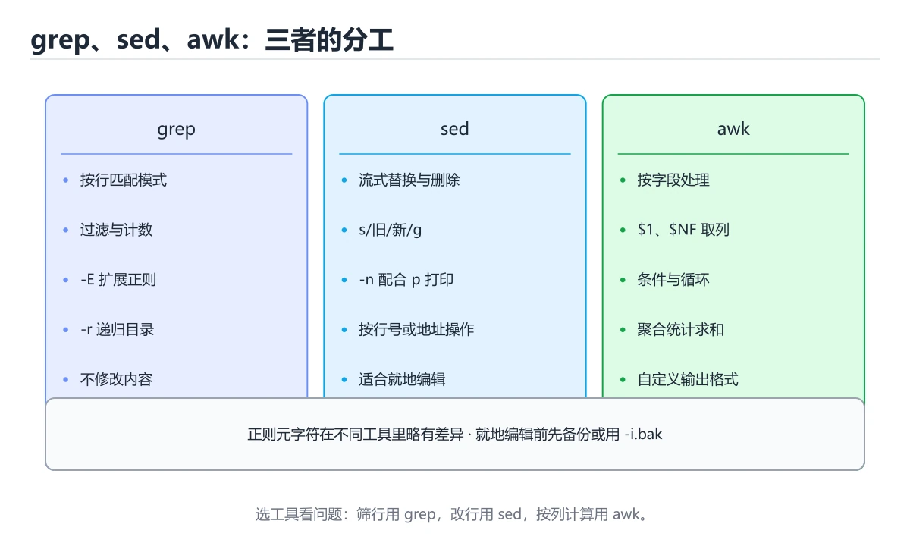
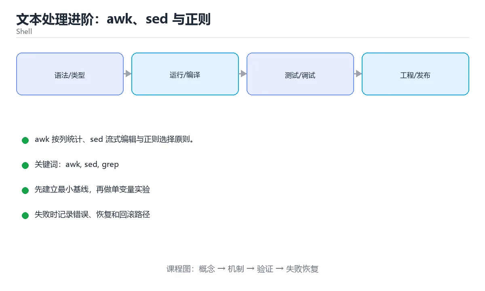

# 文本处理进阶：awk、sed 与正则

> 内容更新时间：2026-10-06 · 学习阶段：进阶 · 预计用时：45 分钟





## 本节知识框架

**课程定位**：所属分类 `shell`（Shell），课程主题 `文本处理进阶：awk、sed 与正则`，学习阶段 进阶，建议用时 45 分钟。

本课主线：awk 按列统计、sed 流式编辑与正则选择原则。

**学完本课应当能够**
- 说清 `sed` 与 `正则捕获组` 的含义与区别，并各举一个正例和一个反例。
- 用本课示例验证 `awk 字段` 的行为，记录输入、输出与失败条件。
- 遇到「用 `cut` 处理多空格分隔」这类问题时，能说出触发条件与修复顺序。

### 从概念到验证的学习链条

1. `sed`：先掌握 面向行的流编辑器，用替换等脚本做抽取与改写，适合大文件一次扫过，再用它解释 `正则捕获组` 为什么会出现。
2. `正则捕获组`：先掌握 用括号把匹配的一部分单独提取出来，在替换里按序号引用，再用它解释 `awk 字段` 为什么会出现。
3. `awk 字段`：先掌握 awk 默认按空白把每行切成若干字段并按列编号，适合直接统计日志中的某一列，再用它解释 `排序去重` 为什么会出现。
4. `排序去重`：先掌握 sort 与 uniq 组合统计频次，uniq 只能处理相邻重复，所以必须先排序，再用它解释 本课示例的观察结果 为什么会出现。

**先修与衔接**：本课是「Shell」分类的第 13 课。先修内容：《Shell 与 Docker/K8s 交互》。《Shell 与 Docker/K8s 交互》里的 `Docker`、`Kubernetes` 是本课的前提。相关或后续课程：《系统运维脚本实战》。

### 完成判据

- **定义关**：不看正文也能说明 `sed` 是 面向行的流编辑器，用替换等脚本做抽取与改写，适合大文件一次扫过，并指出一个反例。
- **机制关**：能按“输入 → 转换 → 输出 → 验证”复述 `文本处理进阶：awk、sed 与正则`，而不是只背结论。
- **示例关**：能运行或推演 `文本处理进阶：awk、sed 与正则` 的 `bash` 示例，并说明一个真实出现的标识符或字面量。
- **证据关**：能指出 `文本处理进阶：awk、sed 与正则` 示例里的 出现字面量 `a-z`，并说明它支持或反驳了本课的哪一条结论。
- **排错关**：能复现 用 `cut` 处理多空格分隔，记录现象并按 改用 `awk '{print $3}'` 修复。
- **迁移关**：能把 `awk`、`sed`、`grep`、`正则` 放进一个与 `文本处理进阶：awk、sed 与正则` 不同的项目场景，并保持输入与验证条件可追踪。
- **复盘关**：学完 `文本处理进阶：awk、sed 与正则` 后，用一句话写下仍然不确定的结论，并列出下一次验证需要的输入、环境和成功判据。

### 复习清单

- [ ] 能不看正文复述本课核心术语，并指出一个边界或反例。
- [ ] 能运行或推演本课示例，记录输入、输出与失败现象。
- [ ] 能完成一次自测，并把错题对照错误表定位原因。

## 核心概念定义

| 术语 | 操作性定义 | 常见边界与风险 |
| --- | --- | --- |
| sed | 面向行的流编辑器，用替换等脚本做抽取与改写，适合大文件一次扫过。 | 易错：不生效；正确做法是用 `[0-9]` 或 `sed -E`。 |
| 正则捕获组 | 用括号把匹配的一部分单独提取出来，在替换里按序号引用。 | 越界、悬垂引用与释放顺序会破坏结论，必须在边界输入下复验。 |
| awk 字段 | awk 默认按空白把每行切成若干字段并按列编号，适合直接统计日志中的某一列。 | 只在「awk 默认按空白把每行切成若干字段并按列编号，适合直接统计日志中的某一列」这一前提下成立，换输入或换环境要重新验证。 |
| 排序去重 | sort 与 uniq 组合统计频次，uniq 只能处理相邻重复，所以必须先排序。 | 只在「sort 与 uniq 组合统计频次，uniq 只能处理相邻重复，所以必须先排序」这一前提下成立，换输入或换环境要重新验证。 |

## 原理与运行机制

### 机制总览

**教材衔接：三者分工速查**

| 工具 | 定位 | 最适合 |
| --- | --- | --- |
| grep | 按行筛选 | 找包含/不包含某模式的行 |
| sed | 流式替换与编辑 | 批量替换、按行号增删 |
| awk | 面向字段的小语言 | 按列统计、条件聚合、格式化输出 |

经验：**只筛选用 grep，只替换用 sed，要按列计算就用 awk**；能用 awk 一次完成，就别串联五个命令。

**教材衔接：sed 速查**

| 需求 | 写法 |
| --- | --- |
| 替换首个匹配 | `sed 's/old/new/'` |
| 替换全部 | `sed 's/old/new/g'` |
| 按行号操作 | `sed -n '10,20p'` |
| 删除匹配行 | `sed '/^#/d'` |
| 原地修改（先备份） | `sed -i.bak 's/old/new/g' file` |
| 多表达式 | `sed -e 's/a/b/' -e 's/c/d/'` |
| 引用捕获组 | `sed -E 's/^([0-9]+)-/\1:/'` |

注意：GNU sed 与 BSD/macOS sed 的 `-i` 参数不同，跨平台脚本要封装或用临时文件。

**教材衔接：正则速查**

| 写法 | 含义 |
| --- | --- |
| `^` `$` | 行首与行尾 |
| `.` | 任意单字符 |
| `*` `+` `?` | 重复零次以上、一次以上、零或一次 |
| `[abc]` `[^abc]` | 字符集合与取反 |
| `\b` | 词边界 |
| `(a\|b)` | 分组与或（ERE） |
| `[[:digit:]]` | POSIX 字符类，兼容性更好 |

建议：纯字符串搜索用 `grep -F`（关闭正则），避免 `*`、`.` 等被当元字符。

**教材衔接：版本与时效**

- 版本提示：awk 的行为在最近几个大版本里有过调整，升级「文本处理进阶：awk、sed 与正则」前先用 server_errors 复现当前输出，再对照官方发布说明逐条核对。
- 升级「文本处理进阶：awk、sed 与正则」涉及的依赖前，先用 server_errors 复现当前行为，再逐项核对版本说明与破坏性变更。

### 升级检查清单

- 先固定当前版本，跑通全部示例与测验，再升级工具链。
- 升级时只动一个依赖版本，用 server_errors 记录构建与运行结果。
- 先回归 awk 与 sed 的默认行为和错误信息，再扩大测试范围。
- 升级完成后更新本课「最后复核 / 下次复核」日期，并记录 awk 的版本变化。

### 机制拆解：每一步的输入、动作与输出

#### 1. `sed`
- 输入：`awk`；本步把 面向行的流编辑器，用替换等脚本做抽取与改写，适合大文件一次扫过 当作判断规则。
- 动作：围绕 `sed` 保留中间状态，并记录它与 `正则捕获组` 的对应关系。
- 输出：`正则捕获组`，它可以被下一段代码、测试或记录继续使用。
- `sed` 的失败条件：当在 `sed` 里用 `\d`时，会出现不生效。

#### 2. `正则捕获组`
- 输入：`sed`；本步把 用括号把匹配的一部分单独提取出来，在替换里按序号引用 当作判断规则。
- 动作：围绕 `正则捕获组` 保留中间状态，并记录它与 `awk 字段` 的对应关系。
- 输出：`awk 字段`，它可以被下一段代码、测试或记录继续使用。
- `正则捕获组` 的失败条件：越界、悬垂引用与释放顺序会破坏结论，必须在边界输入下复验。

#### 3. `awk 字段`
- 输入：`正则捕获组`；本步把 awk 默认按空白把每行切成若干字段并按列编号，适合直接统计日志中的某一列 当作判断规则。
- 动作：围绕 `awk 字段` 保留中间状态，并记录它与 `排序去重` 的对应关系。
- 输出：`排序去重`，它可以被下一段代码、测试或记录继续使用。
- `awk 字段` 的失败条件：只在「awk 默认按空白把每行切成若干字段并按列编号，适合直接统计日志中的某一列」这一前提下成立，换输入或换环境要重新验证。

#### 4. `排序去重`
- 输入：`awk 字段`；本步把 sort 与 uniq 组合统计频次，uniq 只能处理相邻重复，所以必须先排序 当作判断规则。
- 动作：围绕 `排序去重` 保留中间状态，并记录它与 `a-z` 的对应关系。
- 输出：`a-z`，它可以被下一段代码、测试或记录继续使用。
- `排序去重` 的失败条件：只在「sort 与 uniq 组合统计频次，uniq 只能处理相邻重复，所以必须先排序」这一前提下成立，换输入或换环境要重新验证。

### 示例中的可观察事实

1. 出现字面量 `a-z`；它对应的课程主题是 `文本处理进阶：awk、sed 与正则`。
2. 出现字面量 `A-Z`；它对应的课程主题是 `文本处理进阶：awk、sed 与正则`。
3. 出现字面量 `s/.*\.//`；它对应的课程主题是 `文本处理进阶：awk、sed 与正则`。

### 复现实验记录

- 环境：`文本处理进阶：awk、sed 与正则` 使用 `bash` 示例，固定 `awk`、`sed`、`grep`、`正则` 作为第一组条件。
- 首轮输入：先确认 出现字面量 `a-z`，预测 `sed` 会怎样变化。
- 基线观察：记录命令、输入、输出和错误原文，不用截图代替可复制的文本。
- 单变量修改：只改变 `awk`，观察 `排序去重` 是否仍满足定义。
- 失败注入：复现 用 `cut` 处理多空格分隔，确认现象是 取不到正确列。
- 记录结论：把“修改前、修改后、预期变化、实际变化”写成四列表，这样复盘 `文本处理进阶：awk、sed 与正则` 时才能区分概念错误与实现错误。

## 典型应用场景

- **用 `cut` 处理多空格分隔**：典型现象是取不到正确列；正确做法是改用 `awk '{print $3}'`。
- **`uniq` 前不排序**：典型现象是结果偏小；正确做法是先 `sort`。
- **在 `sed` 里用 `\d`**：典型现象是不生效；正确做法是用 `[0-9]` 或 `sed -E`。
- **处理 Windows 换行**：典型现象是出现 `\r` 导致匹配失败；正确做法是`tr -d '\r'` 或 `dos2unix`。

### 最小验证场景

- 准备：保留 `bash` 示例的原始输入，先记录 `文本处理进阶：awk、sed 与正则` 的基线输出和完整运行命令。
- 观察：先核对 出现字面量 `a-z`，再改变一个与 `sed` 相关的条件。
- 判定：新结果与 `文本处理进阶：awk、sed 与正则` 的基线不同不等于错误；只有当差异破坏了 `sed` 的定义或错误表中的约束，才判定为失败。

### 选择与边界

- 使用 `sed` 时，先满足它的定义：面向行的流编辑器，用替换等脚本做抽取与改写，适合大文件一次扫过；易错：不生效；正确做法是用 `[0-9]` 或 `sed -E`。
- 使用 `正则捕获组` 时，先满足它的定义：用括号把匹配的一部分单独提取出来，在替换里按序号引用；越界、悬垂引用与释放顺序会破坏结论，必须在边界输入下复验。
- 使用 `awk 字段` 时，先满足它的定义：awk 默认按空白把每行切成若干字段并按列编号，适合直接统计日志中的某一列；只在「awk 默认按空白把每行切成若干字段并按列编号，适合直接统计日志中的某一列」这一前提下成立，换输入或换环境要重新验证。
- 使用 `排序去重` 时，先满足它的定义：sort 与 uniq 组合统计频次，uniq 只能处理相邻重复，所以必须先排序；只在「sort 与 uniq 组合统计频次，uniq 只能处理相邻重复，所以必须先排序」这一前提下成立，换输入或换环境要重新验证。

## 代码/协议/SQL 示例

### 最小可验证示例

```bash
# 统计访问日志里每个 IP 的请求数与平均响应大小
awk '{count[$1]++; bytes[$1] += $10}
     END {for (ip in count) printf "%-16s %6d %10.1f\n", ip, count[ip], bytes[ip]/count[ip]}' \
  access.log | sort -k2 -nr | head -10

# 按状态码区间分类统计
awk '{ if ($9 >= 500) server_errors++
       else if ($9 >= 400) client_errors++
       else ok++ }
     END { printf "2xx/3xx=%d 4xx=%d 5xx=%d\n", ok, client_errors, server_errors }' access.log
```

**教材衔接：awk 速查**

| 需求 | 写法 |
| --- | --- |
| 指定分隔符 | `awk -F, '{print $3}'` |
| 按条件过滤 | `awk '$3 > 100 {print $1}'` |
| 求和与计数 | `awk '{sum += $2} END {print sum, NR}'` |
| 分组统计 | `awk '{count[$1]++} END {for (k in count) print k, count[k]}'` |
| 格式化输出 | `awk '{printf "%-10s %6.2f\n", $1, $2}'` |
| 内置变量 | `NR` 行号、`NF` 字段数、`FS` 分隔符、`OFS` 输出分隔符 |
| 多文件处理 | `awk 'FNR==1 {print "== " FILENAME}'` |

**教材衔接：零基础详解：高级文本处理工具箱**

### 一句话说清它是什么

除了管道三剑客，Linux 还有一批「专治某类文本问题」的小工具。
认清每个工具的强项，就能用一条管道解决过去要写脚本的活。

### 工具定位表

| 工具 | 专治 | 典型用法 |
| --- | --- | --- |
| `cut` | 按固定分隔符取列 | `cut -d: -f1` |
| `paste` | 把多个文件按行并排 | `paste a.txt b.txt` |
| `tr` | 字符替换与删除 | `tr 'a-z' 'A-Z'` |
| `sort` | 排序与去重 | `sort -u -k2,2n` |
| `uniq` | 相邻去重与计数 | `uniq -c` |
| `comm` | 比较两个已排序文件 | `comm -12 a b` |
| `diff` | 比较内容差异 | `diff -u a b` |
| `wc` | 统计行/词/字符 | `wc -l` |
| `split` | 大文件切分 | `split -l 1000 big.txt part_` |
| `sed` | 流式替换与提取 | `sed -n '10,20p'` |
| `awk` | 按列计算与格式化 | `awk -F, '{sum+=$3} END{print sum}'` |

### 一行一例

```bash
# 取第 1 与第 3 列（以逗号分隔）
cut -d, -f1,3 data.csv

# 大小写转换与删除空行
tr 'a-z' 'A-Z' < input.txt
tr -d '\r' < windows.txt > unix.txt        # 去掉 Windows 换行符

# 按第 2 列数字排序，去重后取前 10
sort -k2,2n data.txt | uniq | head -n 10

# 只保留两个文件共有的行
comm -12 <(sort a.txt) <(sort b.txt)

# 生成带行号的差异补丁
diff -u old.txt new.txt > change.patch

# 统计目录下各扩展名的数量
find . -type f | sed 's/.*\.//' | sort | uniq -c | sort -rn

# 按列求和并格式化输出
awk -F, 'NR>1 {sum += $3; count++} END {printf "共 %d 条，合计 %.2f\n", count, sum}' sales.csv
```

### 正则的三档强度

| 写法 | 支持 | 说明 |
| --- | --- | --- |
| `grep` | 基本正则 | `+`、`?` 要转义 |
| `grep -E` | 扩展正则 | 常用写法，推荐 |
| `grep -P` | Perl 正则 | 支持 `\d`、`\w`、环视 |
| `sed -E` | 扩展正则 | 替换时更易读 |

```bash
grep -E '^(ERROR|WARN)' app.log
grep -P '(?<=user_id=)\d+' app.log        # 环视提取，GNU grep 支持
sed -E 's/([0-9]{4})-([0-9]{2})-([0-9]{2})/\3\/\2\/\1/' dates.txt
```

### awk 的三个必会块

```awk
BEGIN   { FS=","; print "开始统计" }      # 处理前执行一次
        { sum += $3; count++ }             # 每一行执行
END     { printf "平均 %.2f\n", sum / count }   # 处理后执行一次
```

```bash
# 按第一列分组求和
awk -F, '{sum[$1] += $3} END {for (k in sum) print k, sum[k]}' sales.csv

# 只处理匹配的行
awk -F, '$1 == "2026-10" {print $2, $3}' sales.csv

# 过滤掉表头与空行
awk -F, 'NR > 1 && NF > 0' data.csv
```

### 处理大文件的原则

| 原则 | 原因 |
| --- | --- |
| 用流式工具（sed、awk） | 不用把整个文件读进内存 |
| 避免多次遍历 | 一次 awk 能做完就别串五个命令 |
| 善用 `LC_ALL=C` | 按字节比较比按语言环境快很多 |
| 排序大文件加 `-S` | 提高排序使用的内存 |
| 先 `head` 验证管道 | 避免跑完才发现格式错 |

```bash
LC_ALL=C sort -S 2G -T /data/tmp big.txt > sorted.txt
```

### 新手最容易踩的八个坑

| 坑 | 现象 | 正确做法 |
| --- | --- | --- |
| 用 `cut` 处理多空格分隔 | 取不到正确列 | 改用 `awk '{print $3}'` |
| `uniq` 前不排序 | 结果偏小 | 先 `sort` |
| 在 `sed` 里用 `\d` | 不生效 | 用 `[0-9]` 或 `sed -E` |
| 处理 Windows 换行 | 出现 `\r` 导致匹配失败 | `tr -d '\r'` 或 `dos2unix` |
| 忘记引号包正则 | shell 先把 `*` 展开 | 正则一律加单引号 |
| 大文件用 `sort` 未指定临时目录 | 临时空间不足 | 加 `-T` 指定目录 |
| 直接改源文件 | 出错无法回滚 | 先输出到临时文件再 `mv` |
| 忽略语言环境影响排序 | 结果与预期不同 | 需要字节序时设 `LC_ALL=C` |

### 手把手练习：分析访问日志

```bash
#!/usr/bin/env bash
set -euo pipefail

readonly LOG="${1:-access.log}"

echo "=== 总览 ==="
awk 'END {print "总请求数:", NR}' "$LOG"

echo "=== 状态码分布 ==="
awk '{codes[$9]++} END {for (c in codes) printf "%s %d\n", c, codes[c]}' "$LOG" \
  | sort -k2,2nr

echo "=== 最多访问的 5 个路径 ==="
awk '{paths[$7]++} END {for (p in paths) print paths[p], p}' "$LOG" \
  | sort -rn | head -n 5

echo "=== 传输量前 3 的 IP（按字节）==="
awk '{bytes[$1] += $10} END {for (ip in bytes) print bytes[ip], ip}' "$LOG" \
  | sort -rn | head -n 3

echo "=== 5xx 错误的时间分布（按小时）==="
awk '$9 ~ /^5/ {gsub(/\[/, "", $4); split($4, t, ":"); hours[t[2]]++}
     END {for (h in hours) printf "%s 时: %d\n", h, hours[h]}' "$LOG" | sort
```

### 学完自测

- [ ] 能说出 cut 与 awk 在取列上的取舍。
- [ ] 知道 `grep`、`grep -E`、`grep -P` 的区别。
- [ ] 能说出 awk 的 BEGIN、主体、END 三块执行时机。
- [ ] 知道处理 Windows 换行要先做什么。
- [ ] 能说出大文件处理的两条性能原则。

**运行方式**：运行 `文本处理进阶：awk、sed 与正则` 的示例时，用 `bash 文件名.sh` 运行；先 `bash -n` 做语法检查更稳妥。

### 示例精读：先找证据，再改一个条件

1. 出现字面量 `a-z`；它出现在 `文本处理进阶：awk、sed 与正则` 的示例中，阅读时先确认它前后各发生了什么。
2. 出现字面量 `A-Z`；它出现在 `文本处理进阶：awk、sed 与正则` 的示例中，阅读时先确认它前后各发生了什么。
3. 出现字面量 `s/.*\.//`；它出现在 `文本处理进阶：awk、sed 与正则` 的示例中，阅读时先确认它前后各发生了什么。
- 在 `文本处理进阶：awk、sed 与正则` 中与 `sed` 对照：示例必须能支持 面向行的流编辑器，用替换等脚本做抽取与改写，适合大文件一次扫过，否则说明这一段还缺少实现或验证步骤。
- 在 `文本处理进阶：awk、sed 与正则` 中与 `正则捕获组` 对照：示例必须能支持 用括号把匹配的一部分单独提取出来，在替换里按序号引用，否则说明这一段还缺少实现或验证步骤。
- 在 `文本处理进阶：awk、sed 与正则` 中与 `awk 字段` 对照：示例必须能支持 awk 默认按空白把每行切成若干字段并按列编号，适合直接统计日志中的某一列，否则说明这一段还缺少实现或验证步骤。
- 在 `文本处理进阶：awk、sed 与正则` 中与 `排序去重` 对照：示例必须能支持 sort 与 uniq 组合统计频次，uniq 只能处理相邻重复，所以必须先排序，否则说明这一段还缺少实现或验证步骤。

## 时间/空间复杂度或性能分析

**性能关注点（文本处理进阶：awk、sed 与正则）**：进程启动与管道是主要成本：记录总耗时与子进程数量，避免在循环里反复启动外部命令。

**本课特有开销（文本处理进阶：awk、sed 与正则 · awk）**：回溯会让正则表达式在特定输入上急剧变慢，必须用最坏输入做基准。

**测量方法**：以 `文本处理进阶：awk、sed 与正则` 的 `awk` 场景为对象，固定输入跑一遍记录基线，再把规模或并发度提高一个数量级复测；两次结果的差值与波动范围才是结论依据。

### 需要控制的变量与记录项

- `文本处理进阶：awk、sed 与正则` 的 `awk`：固定它的版本、输入范围和资源上限，分别记录速度、内存与失败率的变化。
- `文本处理进阶：awk、sed 与正则` 的 `sed`：固定它的版本、输入范围和资源上限，分别记录速度、内存与失败率的变化。
- `文本处理进阶：awk、sed 与正则` 的 `grep`：固定它的版本、输入范围和资源上限，分别记录速度、内存与失败率的变化。
- `文本处理进阶：awk、sed 与正则` 的 `正则`：固定它的版本、输入范围和资源上限，分别记录速度、内存与失败率的变化。
- `文本处理进阶：awk、sed 与正则` 的 `文本处理`：固定它的版本、输入范围和资源上限，分别记录速度、内存与失败率的变化。
- `文本处理进阶：awk、sed 与正则` 中 `sed` 的边界：易错：不生效；正确做法是用 `[0-9]` 或 `sed -E`。达到边界时不要外推，必须重新测量。
- `文本处理进阶：awk、sed 与正则` 中 `正则捕获组` 的边界：越界、悬垂引用与释放顺序会破坏结论，必须在边界输入下复验。达到边界时不要外推，必须重新测量。
- `文本处理进阶：awk、sed 与正则` 中 `awk 字段` 的边界：只在「awk 默认按空白把每行切成若干字段并按列编号，适合直接统计日志中的某一列」这一前提下成立，换输入或换环境要重新验证。达到边界时不要外推，必须重新测量。
- `文本处理进阶：awk、sed 与正则` 中 `排序去重` 的边界：只在「sort 与 uniq 组合统计频次，uniq 只能处理相邻重复，所以必须先排序」这一前提下成立，换输入或换环境要重新验证。达到边界时不要外推，必须重新测量。
- `文本处理进阶：awk、sed 与正则` 的代码证据：先验证 出现字面量 `a-z`，再记录该路径的输入规模与耗时；只看代码行数不能推出复杂度。

## 常见误区与易错点

| 容易写错的做法 | 实际现象 | 原因与正确做法 |
| --- | --- | --- |
| 用 `cut` 处理多空格分隔 | 取不到正确列 | 改用 `awk '{print $3}'` |
| `uniq` 前不排序 | 结果偏小 | 先 `sort` |
| 在 `sed` 里用 `\d` | 不生效 | 用 `[0-9]` 或 `sed -E` |
| 处理 Windows 换行 | 出现 `\r` 导致匹配失败 | `tr -d '\r'` 或 `dos2unix` |
| 忘记引号包正则 | shell 先把 `*` 展开 | 正则一律加单引号 |
| 大文件用 `sort` 未指定临时目录 | 临时空间不足 | 加 `-T` 指定目录 |
| 直接改源文件 | 出错无法回滚 | 先输出到临时文件再 `mv` |
| 忽略语言环境影响排序 | 结果与预期不同 | 需要字节序时设 `LC_ALL=C` |
| awk 不指定分隔符处理 CSV | 列错位 | 用 `-F,` |
| 用 `$0` 与 `$1` 混淆 | 输出整行而非首列 | `$0` 是整行，`$1` 是首字段 |
| sed 直接 `-i` 不备份 | 改错无法回滚 | 用 `-i.bak` 或先 `cp` |
| 把变量直接拼进正则 | 特殊字符导致误匹配 | 用 `grep -F` 或转义 |
| 用 `==` 比较字符串之外的数值 | 结果不符预期 | 数值比较用 `awk '$3 > 100'` |
| 忘记 `LC_ALL=C` | 大文件排序统计慢 | 纯 ASCII 场景可加速 |
| 串联过多管道 | 维护困难、多次遍历 | 用一个 awk 完成 |
| 对二进制文件跑文本工具 | 输出乱码 | 先 `file` 判断类型 |
| 用 $0 与 $1 混淆 | 输出整行而非首列。 | $0 是整行，$1 是首字段。 |
| sed 直接 -i 不备份 | 改错无法回滚。 | 用 -i.bak 或先 cp。 |

### 现场 1：用 `cut` 处理多空格分隔

**症状**：取不到正确列。

**根因与修复**：改用 `awk '{print $3}'`。

**自检**：在本课示例里复现「用 `cut` 处理多空格分隔」，改成改用 `awk '{print $3}'`后重跑；如果症状消失且失败路径按预期变化，说明定位正确。

### 现场 2：`uniq` 前不排序

**症状**：结果偏小。

**根因与修复**：先 `sort`。

**自检**：在本课示例里复现「`uniq` 前不排序」，改成先 `sort`后重跑；如果症状消失且失败路径按预期变化，说明定位正确。

### 现场 3：在 `sed` 里用 `\d`

**症状**：不生效。

**根因与修复**：用 `[0-9]` 或 `sed -E`。

**自检**：在本课示例里复现「在 `sed` 里用 `\d`」，改成用 `[0-9]` 或 `sed -E`后重跑；如果症状消失且失败路径按预期变化，说明定位正确。

### 现场 4：处理 Windows 换行

**症状**：出现 `\r` 导致匹配失败。

**根因与修复**：`tr -d '\r'` 或 `dos2unix`。

**自检**：在本课示例里复现「处理 Windows 换行」，改成`tr -d '\r'` 或 `dos2unix`后重跑；如果症状消失且失败路径按预期变化，说明定位正确。

### 现场 5：忘记引号包正则

**症状**：shell 先把 `*` 展开。

**根因与修复**：正则一律加单引号。

**自检**：在本课示例里复现「忘记引号包正则」，改成正则一律加单引号后重跑；如果症状消失且失败路径按预期变化，说明定位正确。

### 现场 6：大文件用 `sort` 未指定临时目录

**症状**：临时空间不足。

**根因与修复**：加 `-T` 指定目录。

**自检**：在本课示例里复现「大文件用 `sort` 未指定临时目录」，改成加 `-T` 指定目录后重跑；如果症状消失且失败路径按预期变化，说明定位正确。

### 现场 7：直接改源文件

**症状**：出错无法回滚。

**根因与修复**：先输出到临时文件再 `mv`。

**自检**：在本课示例里复现「直接改源文件」，改成先输出到临时文件再 `mv`后重跑；如果症状消失且失败路径按预期变化，说明定位正确。

### 现场 8：忽略语言环境影响排序

**症状**：结果与预期不同。

**根因与修复**：需要字节序时设 `LC_ALL=C`。

**自检**：在本课示例里复现「忽略语言环境影响排序」，改成需要字节序时设 `LC_ALL=C`后重跑；如果症状消失且失败路径按预期变化，说明定位正确。

### 现场 9：awk 不指定分隔符处理 CSV

**症状**：列错位。

**根因与修复**：用 `-F,`。

**自检**：在本课示例里复现「awk 不指定分隔符处理 CSV」，改成用 `-F,`后重跑；如果症状消失且失败路径按预期变化，说明定位正确。

## 与其他知识点的关系

- **先修**：`Shell 与 Docker/K8s 交互`。本课默认这些内容已经掌握。
- **相关或后续**：`系统运维脚本实战`。本课术语会在这些课程里继续使用。
- **术语归属**：`sed`、`正则捕获组`、`awk 字段` 的定义以本课「核心概念定义」为准，换到其他课程时先确认定义是否被改写。
- 同一分类的《Shell 文本处理流水线》也涉及 `grep`；两课衔接时先确认这个术语的定义是否一致。
- 同一分类的《实战：Shell 日志分析与告警》也涉及 `awk`；两课衔接时先确认这个术语的定义是否一致。

### 先修与后续术语接口

- `Shell 与 Docker/K8s 交互`：两者通过本分类的学习顺序衔接，阅读时重点比较各自的输入与失败条件。
- `系统运维脚本实战`：两者通过本分类的学习顺序衔接，阅读时重点比较各自的输入与失败条件。

### 容易混淆的相邻概念

- `sed` 与 `正则捕获组`：前者强调 面向行的流编辑器，用替换等脚本做抽取与改写，适合大文件一次扫过；后者强调 用括号把匹配的一部分单独提取出来，在替换里按序号引用。判断时分别检查两条定义的适用范围，不要只看名称相似就互换。
- `正则捕获组` 与 `awk 字段`：前者强调 用括号把匹配的一部分单独提取出来，在替换里按序号引用；后者强调 awk 默认按空白把每行切成若干字段并按列编号，适合直接统计日志中的某一列。判断时分别检查两条定义的适用范围，不要只看名称相似就互换。
- `awk 字段` 与 `排序去重`：前者强调 awk 默认按空白把每行切成若干字段并按列编号，适合直接统计日志中的某一列；后者强调 sort 与 uniq 组合统计频次，uniq 只能处理相邻重复，所以必须先排序。判断时分别检查两条定义的适用范围，不要只看名称相似就互换。

## 自测题与参考答案

> 先独立作答，再对照参考答案；答案都能在本课正文、术语表或错误表里找到依据。

### 自测 1（概念复述）

不看正文，写出 `sed` 的操作性定义，并说明它与 `正则捕获组` 的区别。

**参考答案**：面向行的流编辑器，用替换等脚本做抽取与改写，适合大文件一次扫过。

`正则捕获组` 的定位是：用括号把匹配的一部分单独提取出来，在替换里按序号引用；两者的差别要从适用对象与失败模式上说明。

### 自测 2（排错）

本课错误表记录了「用 `cut` 处理多空格分隔」这类做法。请写出它会出现的现象、根因，以及修复顺序。

**参考答案**：现象是取不到正确列；正确做法是改用 `awk '{print $3}'`。修复时先复现现象并保留证据，再改动一处假设重跑，确认现象消失。

### 自测 3（动手验证）

运行本课的 `bash` 示例，把其中的 `"%-16s %6d %10.1f\n"` 换成一个边界值后重新运行，记录输出与错误信息。

**参考答案**：正常输入下 `bash` 示例应当复现正文给出的结果；把 `"%-16s %6d %10.1f\n"` 换成边界值后，如果结果改变或报错，先核对它是否满足 `文本处理进阶：awk、sed 与正则` 中`sed` 的适用范围，再检查错误表里是否有同类现象。

### 自测 4（代码阅读）

阅读本课开头的 `bash` 示例，说明它体现了`sed` 的哪一条性质，并指出改动哪个输入会让这条性质不再成立。

**参考答案**：`sed` 的定义是 面向行的流编辑器，用替换等脚本做抽取与改写，适合大文件一次扫过，示例正是在实现这条定义。改动与 `sed` 有关的一个输入后，如果结果不再符合 `文本处理进阶：awk、sed 与正则` 的正文描述，就说明该性质只在当前前提成立。

### 自测 5（迁移）

把 `文本处理进阶：awk、sed 与正则` 的方法迁移到自己的项目：围绕 `sed` 写出一个与错误表同类的风险点，并说明触发条件和检验方式。

**参考答案**：例如「sed 直接 -i 不备份」，它会导致改错无法回滚；检验方式是按用 -i.bak 或先 cp改一处再复现，确认现象消失且没有引入新的失败分支。

### 自测 6（对比）

用一个表格对比 `sed` 与 `正则捕获组`：各写一行适用场景、一行失败表现。

**参考答案**：`sed` 的定义是面向行的流编辑器，用替换等脚本做抽取与改写，适合大文件一次扫过；`正则捕获组` 的定义是用括号把匹配的一部分单独提取出来，在替换里按序号引用。两者的失败表现分别对应本课错误表里与本术语相关的行。

### 自测 7（排错顺序）

面对「用 `cut` 处理多空格分隔」引发的问题，请把“复现 取不到正确列 → 保留证据 → 改用 `awk '{print $3}'` → 回归验证”四步写成可执行的检查清单。

**参考答案**：第一步按取不到正确列复现；第二步记录输入、版本与完整报错；第三步按改用 `awk '{print $3}'`只改一处；第四步重跑并确认失败路径也按预期变化。

### 自测 8（边界判断）

针对 `排序去重`，分别写出“可以使用”的条件和“结论不再成立”的条件。

**参考答案**：只在「sort 与 uniq 组合统计频次，uniq 只能处理相邻重复，所以必须先排序」这一前提下成立，换输入或换环境要重新验证。 同时要把 `排序去重` 的定义 sort 与 uniq 组合统计频次，uniq 只能处理相邻重复，所以必须先排序 与实际输入逐项对照。

### 自测 9（机制重建）

不看正文，按输入、转换、输出、验证四段重建 `sed` → `正则捕获组` → `awk 字段` → `排序去重` 的作用链。

**参考答案**：起点是 `sed` 的定义 面向行的流编辑器，用替换等脚本做抽取与改写，适合大文件一次扫过；中间每一步都保留可观察状态；终点由 `排序去重` 检查，失败时回到错误表定位第一个偏离定义的步骤。

### 自测 10（综合排错）

在 `文本处理进阶：awk、sed 与正则` 中，现象是 改错无法回滚。请围绕 sed 直接 -i 不备份 写出最小复现、关键证据、修复动作和回归验证，并说明为什么不能只凭一次运行下结论。

**参考答案**：先复现 sed 直接 -i 不备份，记录输入与完整错误；再按 用 -i.bak 或先 cp 只改一处。回归时同时跑正常路径和边界路径，只有两次结果都可解释，才把修复视为完成。

### 自测 11（一分钟复述）

用每分钟约 200 字的速度复述 `文本处理进阶：awk、sed 与正则`：先给主问题，再按顺序说出 `sed`、`正则捕获组`、`awk 字段`、`排序去重`，最后给一个失败案例。

**自评标准**：主问题必须对应 awk 按列统计、sed 流式编辑与正则选择原则；每个术语都要能接上一句定义或边界；失败案例必须写成可观察现象，不能用“可能有风险”代替证据。

## 术语速查

| 术语 | 一句话说明 |
| --- | --- |
| `sed` | 面向行的流编辑器，用替换等脚本做抽取与改写，适合大文件一次扫过。 |
| `正则捕获组` | 用括号把匹配的一部分单独提取出来，在替换里按序号引用。 |
| `awk 字段` | awk 默认按空白把每行切成若干字段并按列编号，适合直接统计日志中的某一列。 |
| `排序去重` | sort 与 uniq 组合统计频次，uniq 只能处理相邻重复，所以必须先排序。 |

**术语关系**：`sed`（面向行的流编辑器） → `正则捕获组`（用括号把匹配的一部分单独提取出来） → `awk 字段`（awk 默认按空白把每行切成若干字段并按列编号） → `排序去重`（sort 与 uniq 组合统计频次）。

## 考点精讲

`文本处理进阶：awk、sed 与正则` 的题库有 6 道题，下面逐题给出题干、正确项与判断依据：先自己作答，再核对正确项，最后回到正文对应小节复核。

### 考点 1：第 1 题

- **题目**：围绕“文本处理进阶：awk、sed 与正则”中的 awk、sed、grep，下列哪两项是本课强调的实践判断？
- **正确项**：学习 awk 时要同时说明输入、输出和失败路径，不能只看正常流程；验证 sed 时要固定版本并覆盖边界输入，结论才可复现
- **判断依据**：这道题落在术语 `sed` 上：面向行的流编辑器，用替换等脚本做抽取与改写，适合大文件一次扫过。复习时把 `sed` 的定义、适用边界和一个反例一起说清楚，再回到「核心概念定义」核对原文。

### 考点 2：第 2 题

- **题目**：处理逗号分隔文件时，awk 应该加什么参数？
- **正确项**：-F,
- **判断依据**：这道题检验本课主问题：awk 按列统计、sed 流式编辑与正则选择原则。复习时先复述本课主问题，再举一个会让结论失效的输入。

### 考点 3：第 3 题

- **题目**：阅读 `文本处理进阶：awk、sed 与正则` 中围绕 `sed` 的代码；课程主线是awk 按列统计、sed 流式编辑与正则选择原则。下面哪项判断最准确？
- **正确项**：awk 按列统计、sed 流式编辑与正则选择原则。
- **判断依据**：这道题落在术语 `sed` 上：面向行的流编辑器，用替换等脚本做抽取与改写，适合大文件一次扫过。复习时把 `sed` 的定义、适用边界和一个反例一起说清楚，再回到「核心概念定义」核对原文。

### 考点 4：第 4 题

- **题目**：sed 原地修改文件前，推荐的做法是？
- **正确项**：先备份（如 -i.bak）或输出到临时文件验证后再替换
- **判断依据**：这道题落在术语 `sed` 上：面向行的流编辑器，用替换等脚本做抽取与改写，适合大文件一次扫过。复习时把 `sed` 的定义、适用边界和一个反例一起说清楚，再回到「核心概念定义」核对原文。

### 考点 5：第 5 题

- **题目**：搜索包含大量正则元字符的固定字符串时，应该？
- **正确项**：用 grep -F
- **判断依据**：这道题检验本课主问题：awk 按列统计、sed 流式编辑与正则选择原则。复习时先复述本课主问题，再举一个会让结论失效的输入。

### 考点 6：第 6 题

- **题目**：填空：补齐下面这段术语说明中的空缺。课程 `awk 按列统计、sed 流式编辑与正则选择原则。`，这段说明是：`____`：awk 默认按空白把每行切成若干字段并按列编号，适合直接统计日志中的某一列。空缺处应填哪个术语？
- **正确项**：awk 字段
- **判断依据**：这道题落在术语 `sed` 上：面向行的流编辑器，用替换等脚本做抽取与改写，适合大文件一次扫过。复习时把 `sed` 的定义、适用边界和一个反例一起说清楚，再回到「核心概念定义」核对原文。

### 考点 7：`sed`

- **要点**：面向行的流编辑器，用替换等脚本做抽取与改写，适合大文件一次扫过。
- **sed 的边界**：易错：不生效；正确做法是用 `[0-9]` 或 `sed -E`。

### 考点 8：`正则捕获组`

- **要点**：用括号把匹配的一部分单独提取出来，在替换里按序号引用。
- **正则捕获组 的边界**：越界、悬垂引用与释放顺序会破坏结论，必须在边界输入下复验。

### 考点 9：`awk 字段`

- **要点**：awk 默认按空白把每行切成若干字段并按列编号，适合直接统计日志中的某一列。
- **awk 字段 的边界**：只在「awk 默认按空白把每行切成若干字段并按列编号，适合直接统计日志中的某一列」这一前提下成立，换输入或换环境要重新验证。

### 考点 10：`排序去重`

- **要点**：sort 与 uniq 组合统计频次，uniq 只能处理相邻重复，所以必须先排序。
- **排序去重 的边界**：只在「sort 与 uniq 组合统计频次，uniq 只能处理相邻重复，所以必须先排序」这一前提下成立，换输入或换环境要重新验证。

### 考点 11：排错——用 `cut` 处理多空格分隔

- **现象**：取不到正确列。
- **处理**：改用 `awk '{print $3}'`。

### 考点 12：排错——`uniq` 前不排序

- **现象**：结果偏小。
- **处理**：先 `sort`。

### 考点 13：综合辨析——`sed` 与 `排序去重`

- **辨析点**：`sed` 的定义是 面向行的流编辑器，用替换等脚本做抽取与改写，适合大文件一次扫过；`排序去重` 的定义是 sort 与 uniq 组合统计频次，uniq 只能处理相邻重复，所以必须先排序。
- **答题要求**：面对 `文本处理进阶：awk、sed 与正则` 的题目，先判断描述的是 `sed` 还是 `排序去重`，再归到对应定义，最后写出一个会让该定义失效的边界输入。

### 考点 14：排错评分点

- **现象分**：能写出 取不到正确列，而不是只写“程序有错”。
- **证据分**：保留触发 用 `cut` 处理多空格分隔 的输入、版本和错误原文。
- **修复分**：按 改用 `awk '{print $3}'` 只改一处，并同时回归正常路径与边界路径。

## 内容元数据

- 内容版本：v2.0
- 最后更新：2026-10-06
- 学习阶段：进阶
- 适用环境：Bash 5 / POSIX Shell
；本课聚焦 awk。
- 内容来源：内置结构化课程与工程实践整理
- 相关主题：awk、sed、grep、正则、文本处理、日志分析
- 质量版本：P0 测验标准 + P1 覆盖扩展 + P2 体验补全

## 参考资料与复核

- 最后复核：2026-10-04
- 下次复核：2027-02-10
- 复核范围：版本兼容、API 行为、安全建议与工程实践
- 来源性质：官方文档、标准或权威教材；本课核对关键词：awk、sed、grep、正则、文本处理、日志分析。

| 参考资料 | 本课用途 |
| --- | --- |
| [GNU awk](https://www.gnu.org/software/gawk/manual/) | 字段处理与报表 |
| [GNU grep](https://www.gnu.org/software/grep/manual/) | 模式匹配与过滤 |
| [GNU Bash 手册](https://www.gnu.org/software/bash/manual/) | Bash 语法、展开与作业控制 |

| [本课术语索引：文本处理进阶：awk、sed 与正则](#核心概念定义) | 按本课输入、术语边界和错误表现逐项核对 |
> 「文本处理进阶：awk、sed 与正则」的链接用于离线阅读后的延伸核对；App 不会自动联网。