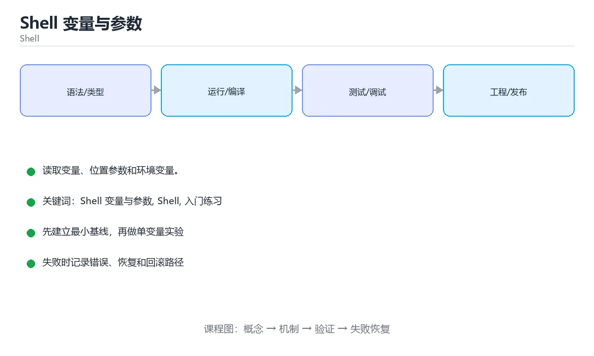

# Shell 变量与参数



> 内容更新时间：2026-10-03 · 学习阶段：入门 · 预计用时：15 分钟

## 学习目标

- 先认识「Shell 变量与参数」需要的工具、输入和输出。
- 按步骤运行最小示例，并记录结果与错误。
- 用一个边界输入验证自己是否真正掌握。

## 前置知识

- 会进行基本的文件或命令行操作。
- 不需要预先掌握「Shell」的高级知识。

## 一句话入门

读取变量、位置参数和环境变量。

## 最小示例

```bash
#!/usr/bin/env bash
set -euo pipefail

name="${1:-world}"
echo "hello, ${name}"
```

## 预期输出

```text
hello, world
```

## 常见错误

- 变量没有加引号，路径包含空格时命令参数被拆分。
- 复制命令时遗漏空格、引号或必要参数。

## 动手练习

1. 原样运行最小示例，保存命令和输出。
2. 把数字 2 改成 10，预测并验证新结果。
3. 制造一个错误输入，写出错误信息和修复方法。

## 本课小结

- 入门阶段先保证能运行、能观察、能解释，再追求复杂功能。
- 每次只改一个变量，记录预测与实际结果。
- 遇到错误先看第一条错误信息，再回到最小示例。


## 代码实验：把示例跑成证据

这一节不引入新语法，而是把「Shell 变量与参数」的最小示例变成可以复现、可以对照的实验。每次只改变一个条件，先写预测，再运行，最后解释差异。

### 实验一：建立基线

```bash
#!/usr/bin/env bash
set -euo pipefail

name="${1:-world}"
echo "hello, ${name}"
```

先原样运行上面的代码，记录命令、完整输出和退出状态。然后把输出与正文的预期输出逐字对照，不要用“看起来差不多”代替核对；空格、大小写、换行和错误流向都可能暴露环境差异。

### 实验二：只改一个输入

从代码中选一个会影响结果的字面量、参数或输入，把它替换成边界值：数值可尝试 0、1、最大值和最小值，字符串可尝试空串和超长文本，集合可尝试空集合、单元素和重复元素。先写出预测，再运行并记录实际结果。

### 实验三：制造一个可控错误

去掉变量展开外的引号，或者让管道中的前一段命令失败。记录退出码、标准错误和最终输出，确认错误是否被掩盖。

| 实验 | 改动 | 预测 | 实际 | 结论 |
| --- | --- | --- | --- | --- |
| 基线 | 保持原样 |  |  |  |
| 边界 |  |  |  |  |
| 失败 |  |  |  |  |

### 实验四：用三句话复述

1. 输入是什么，哪些输入属于合法范围，哪些属于边界或非法范围？
2. 程序按什么顺序处理输入，在哪一步产生了状态变化或副作用？
3. 输出如何验证，失败时第一条可观察证据是什么？

## Shell 脚本基础机制速览

### Shebang、执行权限与环境

脚本第一行的 shebang 指定解释器，例如 `#!/usr/bin/env bash`。文件需要执行权限才能直接运行，也可以用 `bash script.sh` 显式调用。环境变量通过 `export` 传给子进程，普通变量只在当前 shell 可见。脚本应以明确的 `set -euo pipefail` 开始，再根据兼容性决定是否使用 Bash 扩展语法；如果目标环境只有 POSIX sh，应避免数组、`[[ ]]` 和进程替换。

### 变量、引号与参数

变量赋值等号两边不能有空格，引用时通常要写 `"$var"`，防止空值和空格被拆分。单引号原样保留，双引号允许变量展开，反引号或 `$()` 执行命令替换。脚本参数用 `$1`、`$2` 访问，`$#` 是数量，`$@` 保留参数边界，`$*` 会把它们合并。处理选项时可以使用 `getopts`，并始终为缺失参数提供用法提示和非零退出码。

### 条件、退出码与控制流

每个命令都返回退出码，0 表示成功，非 0 表示失败。`if` 判断的是命令退出状态，`test` 或 `[ ]` 是常用判断工具。`&&` 和 `||` 根据前一个命令的结果决定是否执行下一个，`case` 适合多分支字符串匹配。`set -e` 在命令失败时退出，但在条件表达式、管道和 `!` 取反中行为有例外，不能把它当作完整的错误处理。

### 函数、循环与管道

函数通过 `name() { ...; }` 定义，参数用 `$1` 等访问，返回值仍是退出码，数据结果通常写到标准输出。`for` 遍历列表，`while read` 逐行处理输入，`until` 在条件为假时循环。管道把 stdout 接到下一个命令的 stdin，默认不传递 stderr，也不会自动传递数组或结构化对象；需要保留变量时避免在管道子 shell 中赋值。

### 可移植性与安全

写文件前先创建临时文件，成功后原子重命名；删除前先打印目标，使用 `--` 防止文件名被当作选项。路径和变量要加引号，命令替换要注意分词和通配符展开。脚本要处理信号和清理，使用 `trap` 在退出时删除临时文件。跨平台脚本避免依赖 GNU 专有参数，必要时用 `command -v` 检测工具，并提供清晰的降级路径。

## 本课自测清单与错误对照

下面把「Shell 变量与参数」最容易混淆的选项集中起来。不要只记正确答案，要能说明错误选项在什么条件下看似合理、又为什么不能满足题干。

本课测验以直接定义和步骤判断为主。请把每个错误选项改写成一句反例，
说明它在哪个输入、边界或前提变化下会失败。

### 完成标准

- [ ] 能用具体输入复现最小示例，并逐行解释输入、处理与输出。
- [ ] 能只改一个值完成边界实验，并让预测与实际结果一致。
- [ ] 能制造一个可控错误，读出第一条错误信息并完成修复。
- [ ] 能不看书说出本课至少两个易错点和对应的验证方法。

### 复盘记录

| 项目 | 记录 |
| --- | --- |
| 学到的核心机制 |  |
| 仍然不确定的问题 |  |
| 下一步验证动作 |  |


## 考点精讲：把测验题还原成判断过程

本课有 5 个判断点。先自己作答，再看「判断依据」；如果结论正确但理由不完整，回到正文对应章节补足概念。

### 考点 1：写法 name="${1:-world}" 的含义是？

- **正确判断**：取第一个位置参数，未传入时使用默认值 world
- **判断依据**：正确答案是「取第一个位置参数，未传入时使用默认值 world」，这道题在问写法name="${1:-world}"的含义是，判断时要把题干限定的输入、边界与目标逐项对齐。${1:-world} 是参数展开语法：第一个位置参数存在且非空时取其值，否则使用默认值 world。
- **迁移检查**：如果给某个错误选项去掉一个限定词，它会不会变成正确？说明理由。

### 考点 2：为什么脚本中推荐把变量写成 "$path" 而不是 $path？

- **正确判断**：双引号防止含空格或通配符的值被再次拆分成多个参数
- **判断依据**：正确答案是「双引号防止含空格或通配符的值被再次拆分成多个参数」，这道题在问为什么脚本中推荐把变量写成"$path"而不是$path，判断时要把题干限定的输入、边界与目标逐项对齐。Shell 在展开未加引号的变量后会进行分词与通配符展开，路径含空格时会被拆成多个参数，从而误删或误改文件。
- **迁移检查**：遮住选项，只根据定义复述一次答案，再回来看哪个选项与复述一致。

### 考点 3：脚本中 $# 与 $@ 分别表示什么？

- **正确判断**：$# 是位置参数个数，$@ 是全部位置参数
- **判断依据**：正确答案是「$# 是位置参数个数，$@ 是全部位置参数」，这道题在问脚本中$#与$@分别表示什么，判断时要把题干限定的输入、边界与目标逐项对齐。$# 返回位置参数的数量，常用于参数校验。脚本中 $# 与 $@ 分别表示什么。课程摘要指出读取变量，位置参数和环境变量，本课要判断的正是脚本中$#与$@分别表示什么。
- **迁移检查**：遮住选项，只根据定义复述一次答案，再回来看哪个选项与复述一致。

### 考点 4：示例在未传参数时运行，输出是什么？

- **正确判断**：hello, world，使用了默认值分支
- **判断依据**：正确答案是「hello, world，使用了默认值分支」，这道题在问示例在未传参数时运行，输出是什么，判断时要把题干限定的输入、边界与目标逐项对齐。没有任何参数时 ${1:-world} 取默认值，name 变成 world，echo 输出 hello, world。示例在未传参数时运行，输出是什么。
- **迁移检查**：如果给某个错误选项去掉一个限定词，它会不会变成正确？说明理由。

### 考点 5：填空：「Shell 变量与参数」术语速查中，表示「脚本第一行的 shebang 指定解释器，例如 `____`。文件需要执行权限才能直接运行，也可以用 `bash script.sh` 显式调用。环境变量通过 `export` 传给子进程，普通变量只在当前 s…」的术语是什么？

- **正确判断**：#!/usr/bin/env bash
- **判断依据**：正确答案是「#!/usr/bin/env bash」，这道题在问填空：Shell变量与参数术语速查中，表示脚本第一行…子进程，普通变量只在当前s…的术语是什么，判断时要把题干限定的输入、边界与目标逐项对齐。本课示例中还能看到 `#!/usr/bin/env bash` 这样的用法，说明该关键字在本课代码中承担实际功能。
- **迁移检查**：把答案换成另一种等价写法，是否仍然正确？说明依据。

## 本课复习清单

离开本课前，逐项确认：

- [ ] 不看解析，能说出「写法 name="${1:-world}" 的含义是？」的判断依据。
- [ ] 不看解析，能说出「为什么脚本中推荐把变量写成 "$path" 而不是 $path？」的判断依据。
- [ ] 不看解析，能说出「脚本中 $# 与 $@ 分别表示什么？」的判断依据。
- [ ] 不看解析，能说出「示例在未传参数时运行，输出是什么？」的判断依据。
- [ ] 不看解析，能说出「填空：「Shell 变量与参数」术语速查中，表示「脚本第一行的 shebang …」的判断依据。
- [ ] 至少运行一次本课示例，记录输入、输出和一个边界情况。
- [ ] 把本课最容易混淆的两个概念写成一句话对照。

| 复盘项 | 记录 |
| --- | --- |
| 已经能独立解释的考点 |  |
| 仍然说不清的概念 |  |
| 下一步验证动作 |  |

## 逐节复习与自检

下面按正文顺序回顾每一节，并给出一个自检问题；说不清的地方回到原章节补课。

### 最小示例

```bash
#!/usr/bin/env bash
set -euo pipefail

name="${1:-world}"
echo "hello, ${name}"
```

自检：这一节与相邻主题的边界在哪里？

### 预期输出

```text
hello, world
```

自检：这一节与相邻主题的边界在哪里？

### 常见错误

变量没有加引号，路径包含空格时命令参数被拆分。

自检：把这一节讲给没学过的人，最需要强调哪一点？

### 动手练习

把数字 2 改成 10，预测并验证新结果。制造一个错误输入，写出错误信息和修复方法。

自检：如果去掉这一节里的一个前提，结论会怎样变化？

## 术语速查

| 术语 | 本课语境 |
| --- | --- |
| `#!/usr/bin/env bash` | 脚本第一行的 shebang 指定解释器，例如 `#!/usr/bin/env bash`。文件需要执行权限才能直接运行，也可以用 `bash script.sh` 显式调用。环境变量通过 `export` 传给子进程，普通变量只在当前 s… |
| `bash script.sh` | 脚本第一行的 shebang 指定解释器，例如 `#!/usr/bin/env bash`。文件需要执行权限才能直接运行，也可以用 `bash script.sh` 显式调用。环境变量通过 `export` 传给子进程，普通变量只在当前 s… |
| `export` | 脚本第一行的 shebang 指定解释器，例如 `#!/usr/bin/env bash`。文件需要执行权限才能直接运行，也可以用 `bash script.sh` 显式调用。环境变量通过 `export` 传给子进程，普通变量只在当前 s… |
| `set -euo pipefail` | 脚本第一行的 shebang 指定解释器，例如 `#!/usr/bin/env bash`。文件需要执行权限才能直接运行，也可以用 `bash script.sh` 显式调用。环境变量通过 `export` 传给子进程，普通变量只在当前 s… |
| `[[ ]]` | 脚本第一行的 shebang 指定解释器，例如 `#!/usr/bin/env bash`。文件需要执行权限才能直接运行，也可以用 `bash script.sh` 显式调用。环境变量通过 `export` 传给子进程，普通变量只在当前 s… |
| `"$var"` | 变量赋值等号两边不能有空格，引用时通常要写 `"$var"`，防止空值和空格被拆分。单引号原样保留，双引号允许变量展开，反引号或 `$()` 执行命令替换。脚本参数用 `$1`、`$2` 访问，`$#` 是数量，`$@` 保留参数边界，`$… |
| `$()` | 变量赋值等号两边不能有空格，引用时通常要写 `"$var"`，防止空值和空格被拆分。单引号原样保留，双引号允许变量展开，反引号或 `$()` 执行命令替换。脚本参数用 `$1`、`$2` 访问，`$#` 是数量，`$@` 保留参数边界，`$… |
| `$1` | 变量赋值等号两边不能有空格，引用时通常要写 `"$var"`，防止空值和空格被拆分。单引号原样保留，双引号允许变量展开，反引号或 `$()` 执行命令替换。脚本参数用 `$1`、`$2` 访问，`$#` 是数量，`$@` 保留参数边界，`$… |
| `$2` | 变量赋值等号两边不能有空格，引用时通常要写 `"$var"`，防止空值和空格被拆分。单引号原样保留，双引号允许变量展开，反引号或 `$()` 执行命令替换。脚本参数用 `$1`、`$2` 访问，`$#` 是数量，`$@` 保留参数边界，`$… |
| `$#` | 变量赋值等号两边不能有空格，引用时通常要写 `"$var"`，防止空值和空格被拆分。单引号原样保留，双引号允许变量展开，反引号或 `$()` 执行命令替换。脚本参数用 `$1`、`$2` 访问，`$#` 是数量，`$@` 保留参数边界，`$… |
| `$@` | 变量赋值等号两边不能有空格，引用时通常要写 `"$var"`，防止空值和空格被拆分。单引号原样保留，双引号允许变量展开，反引号或 `$()` 执行命令替换。脚本参数用 `$1`、`$2` 访问，`$#` 是数量，`$@` 保留参数边界，`$… |
| `$*` | 变量赋值等号两边不能有空格，引用时通常要写 `"$var"`，防止空值和空格被拆分。单引号原样保留，双引号允许变量展开，反引号或 `$()` 执行命令替换。脚本参数用 `$1`、`$2` 访问，`$#` 是数量，`$@` 保留参数边界，`$… |

## English Overview

**Title:** Shell Variables and Arguments

**Summary:** Read variables, positional args and environment.

**Category:** Shell  
**Level:** 入门  
**Key terms:** Shell 变量与参数, Shell, 入门练习

> The full tutorial is written in Chinese. This bilingual overview helps English readers identify the topic, scope and key terms before studying the detailed examples.

## 内容元数据

- 内容版本：v2.0
- 最后更新：2026-10-03
- 学习阶段：入门
- 适用环境：Bash 5 / POSIX Shell
- 内容来源：内置结构化课程与工程实践整理
- 相关主题：Shell 变量与参数、Shell、入门练习
- 质量版本：P0 测验标准 + P1 覆盖扩展 + P2 体验补全


## 参考资料与复核

- 最后复核：2026-10-04
- 下次复核：2027-04-04
- 复核范围：版本兼容、API 行为、安全建议与工程实践
- 来源性质：官方文档与标准；本课正文为离线教学重组，不复制原文

| 参考资料 | 本课用途 |
| --- | --- |
| [GNU Bash Manual](https://www.gnu.org/software/bash/manual/) | Bash 语法与行为 |
| [POSIX Shell](https://pubs.opengroup.org/onlinepubs/9799919799/) | 可移植 Shell 标准 |

> 本课主题：读取变量、位置参数和环境变量。

> App 完全离线展示文字链接，不会自动联网；需要延伸阅读时可复制链接到浏览器。
