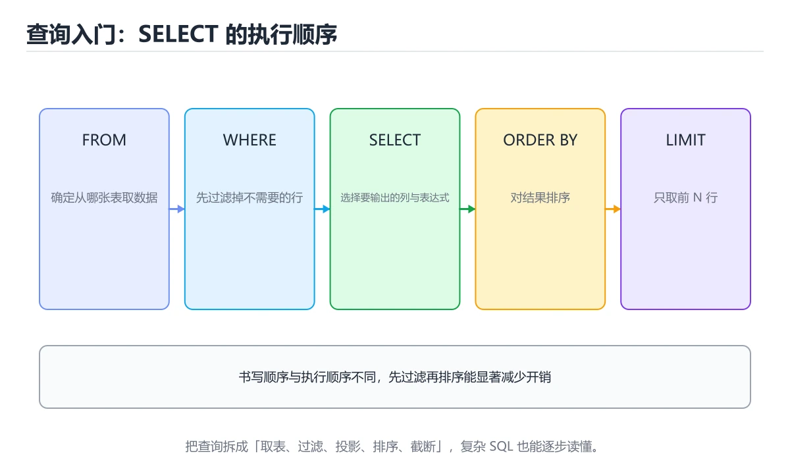
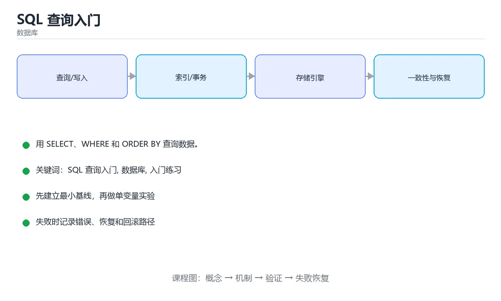

# SQL 查询入门

> 内容更新时间：2026-10-06 · 学习阶段：基础 · 预计用时：30 分钟





## 学习目标

- 先认识SQL 查询入门需要的工具、输入和输出。
- 按步骤运行最小示例，并记录结果与错误。
- 用一个边界输入验证自己是否真正掌握。

## 前置知识

- 会进行基本的文件或命令行操作。
- 不需要预先掌握「数据库」的高级知识。

## 一句话入门

用 SELECT、WHERE 和 ORDER BY 查询数据。

## 最小示例

```sql
SELECT name, score
FROM students
WHERE score >= 60
ORDER BY score DESC;
```

## 预期输出

```text
name | score
Ada  | 92
Lin  | 75
```

## 常见错误与排查

> 说明：本表由《SQL 查询入门》的核心知识整理（2026-10-07），人工复核进度见 docs/content_review_batches.md。

| 易错点 | 容易踩的做法 | 正确结论 |
| --- | --- | --- |
| 习惯写 SELECT 星号 | 传输与解析开销大，列变更影响调用方 | 只查需要的列并显式列出 |
| 条件里对列做函数运算 | 索引无法命中 | 把运算移到常量侧，保持列本身可比较 |
| 不写排序却期望顺序稳定 | 返回顺序没有保证 | 需要稳定顺序时显式排序，并确定唯一键 |

## 动手练习

1. 原样运行最小示例，保存命令和输出。
2. 把数字 2 改成 10，预测并验证新结果。
3. 制造一个错误输入，写出错误信息和修复方法。

## 本课小结

- 入门阶段先保证能运行、能观察、能解释，再追求复杂功能。
- 每次只改一个变量，记录预测与实际结果。
- 遇到错误先看第一条错误信息，再回到最小示例。

## SELECT 的逻辑处理顺序

写 SQL 时按 `SELECT ... FROM ... WHERE ...` 的顺序输入，但数据库的逻辑处理顺序通常是：先确定数据源并执行连接，再过滤行，然后分组、过滤分组、计算选择列表，最后排序和截断。这个顺序解释了为什么 `WHERE` 不能直接使用聚合函数，为什么 `HAVING` 可以过滤分组结果，以及为什么列别名通常不能在 `WHERE` 中引用、却可能在 `ORDER BY` 中引用。理解逻辑顺序，是从“背语法”转向“能推断结果”的关键。

连接决定行如何组合。内连接只保留两边匹配的行，左连接保留左表全部行，右连接相反，全外连接保留两边未匹配的行。连接条件写错会造成笛卡尔积，行数突然膨胀；连接键存在重复值时，也会让结果行数超过预期。执行查询前先估算两边行数和键的唯一性，可以避免很多“数据变多了”的问题。

聚合把多行压缩成一组，`COUNT`、`SUM`、`AVG`、`MIN`、`MAX` 都会忽略 NULL，但 `COUNT(*)` 统计行数，`COUNT(column)` 只统计该列非空值。`GROUP BY` 的列决定分组粒度，选择列表中未聚合的列通常必须出现在分组条件里。分组后想过滤组，要使用 `HAVING`，不要把它和行级过滤的 `WHERE` 混用。

## NULL、聚合与 JOIN 的边界

NULL 表示“未知”，不是 0，也不是空字符串。任何与 NULL 的普通比较结果都是未知，因此 `column = NULL` 不会返回预期结果，应使用 `IS NULL` 或 `IS NOT NULL`。在 `NOT IN` 子查询中，如果子查询返回 NULL，整个条件可能无法成立，这是很隐蔽的坑。处理可空列时，要明确业务语义：未知、缺失和不适用是三种不同状态。

排序和分页也有边界。`ORDER BY` 不唯一时，分页结果可能重复或遗漏，因此最好追加主键作为稳定的次级排序键。深分页使用大偏移量会越来越慢，可以考虑基于游标的分页。没有 `ORDER BY` 时，数据库不保证返回顺序，即使当前测试看起来稳定。

验证查询时，先只看原始行，再加过滤，再加聚合，最后加排序和分页，每一步都检查行数和关键列。对连接查询，比较连接前后的行数；对聚合查询，比较分组数量；对可空列，专门构造 NULL 样例。把逻辑顺序和每一步的预期写成注释，能显著减少“结果不对但不知道哪一步错了”的时间。

## 代码实验：把示例跑成证据

### 实验一：建立基线

```sql
SELECT name, score
FROM students
WHERE score >= 60
ORDER BY score DESC;
```

### 实验二：只改一个输入

沿用「SQL 查询入门」的最小示例做一次单变量实验：

| 实验 | 改动 | 预测 | 实际 | 结论 |
| --- | --- | --- | --- | --- |
| 基线 | 保持「SQL 查询入门」示例原样 |  |  |  |
| 边界 | 把SQL 查询入门换成空值或极值 |  |  |  |
| 失败 | 给数据库传入非法输入 |  |  |  |

做完后用一句话写出「SQL 查询入门」的结论：输入怎么变，结果才怎么变。

### 实验三：制造一个可控错误

插入一条违反主键、非空或唯一约束的记录，或者让 NULL 参与普通比较。记录数据库拒绝操作的位置和错误码，再验证正确写法。

| 实验 | 改动 | 预测 | 实际 | 结论 |
| --- | --- | --- | --- | --- |
| 基线 | 保持原样 |  |  |  |
| 边界 |  |  |  |  |
| 失败 |  |  |  |  |

### 实验四：用三句话复述

1. SQL 查询入门 的输入是什么，哪些取值合法，哪些属于边界或非法范围？
2. SELECT 的执行顺序里，哪一步会写数据或产生外部副作用？
3. 输出如何验证，失败时第一条可观察证据是什么？

## 可运行练习

### 任务 1：先跑通，再解释

```sql
SELECT name, score
FROM students
WHERE score >= 60
ORDER BY score DESC;
```

### 任务 2：只改一个条件

把「SQL 查询入门」的最小示例复制一份，只改一个条件再跑一次：

- 改动点：只调整 SELECT 的一个参数，其余条件一律不动。
- 预测：先写下「SQL 查询入门」在改动后的输出或错误信息，再运行。
- 记录：对照改动前后的结果，指出差异出在哪一步。
- 验收：换回原条件能复现原结果，改动只影响SQL 查询入门。

### 任务 3：迁移到自己的数据

换一个 数据库 场景重做一次，确认结论不是只对示例数据成立。

## 故障现场

### 现场 1：习惯写 SELECT 星号

**症状**：在《SQL 查询入门》的复现场景中，传输与解析开销大，列变更影响调用方。

**根因**：当出现“习惯写 SELECT 星号”时，执行路径已经绕过了《SQL 查询入门》的关键约束，最终以“传输与解析开销大，列变更影响调用方”暴露出来；修复前必须先确认约束在哪里失效。

**修复**：针对《SQL 查询入门》的问题，只查需要的列并显式列出。

**验证**：保留《SQL 查询入门》里触发“传输与解析开销大，列变更影响调用方”的输入、版本和日志，按“只查需要的列并显式列出”完成修改后原样重放；只有失败现象消失且相邻场景仍可解释，才保留改动。

### 现场 2：条件里对列做函数运算

**症状**：在《SQL 查询入门》的复现场景中，索引无法命中。

**根因**：触发点是把“条件里对列做函数运算”当成安全做法。它没有满足《SQL 查询入门》要求的前提，因此先表现为“索引无法命中”；排查时先完整复现这一段，再核对输入、配置与依赖。

**修复**：针对《SQL 查询入门》的问题，把运算移到常量侧，保持列本身可比较。

**验证**：保留《SQL 查询入门》里触发“索引无法命中”的输入、版本和日志，按“把运算移到常量侧，保持列本身可比较”完成修改后原样重放；只有失败现象消失且相邻场景仍可解释，才保留改动。

### 现场 3：不写排序却期望顺序稳定

**症状**：在《SQL 查询入门》的复现场景中，返回顺序没有保证。

**根因**：“返回顺序没有保证”只是表层结果。向上追溯会落到“不写排序却期望顺序稳定”这一步，因为它省略了《SQL 查询入门》的约束，使实现行为和预期模型发生了偏离。

**修复**：针对《SQL 查询入门》的问题，需要稳定顺序时显式排序，并确定唯一键。

**验证**：先在《SQL 查询入门》中记录“不写排序却期望顺序稳定”留下的失败证据，再执行“需要稳定顺序时显式排序，并确定唯一键”并重放；确认错误路径变为明确结果，且修复没有掩盖同类故障。

## 本课复习清单

离开本课前，逐项确认：

- [ ] 不看解析，能说出「SQL 查询的逻辑处理顺序通常是？」的判断依据。
- [ ] 不看解析，能说出「在 SELECT 中明确列出需要的列，而不是使用星号，主要的收益是？」的判断依据。
- [ ] 不看解析，能说出「把 SQL 查询的逻辑处理步骤调整为常见顺序。」的判断依据。
- [ ] 用 SQL 查询入门 构造一个正常输入和一个边界输入，分别记录输出与判断依据。
- [ ] 把本课最容易混淆的两个概念写成一句话对照。

| 复盘项 | 记录 |
| --- | --- |
| 已经能独立解释的考点 |  |
| 仍然说不清的概念 |  |
| 下一步验证动作 |  |

## 复习与自测

下面按正文顺序回顾「SQL 查询入门」的每一节；说不清的地方回到 SELECT 的逻辑处理顺序 补课。

### 一句话入门

自检：这一节的关键输入与输出分别是什么？

### 最小示例

```sql
SELECT name, score
FROM students
WHERE score >= 60
ORDER BY score DESC;
```

自检：这一节与相邻主题的边界在哪里？

### 预期输出

```text
name | score
Ada  | 92
Lin  | 75
```

### 常见错误

自检：把这一节讲给没学过的人，最需要强调哪一点？

### 动手练习

自检：如果去掉这一节里的一个前提，结论会怎样变化？

### SELECT 的逻辑处理顺序

写 SQL 时按 `SELECT ... FROM ... WHERE ...` 的顺序输入，但数据库的逻辑处理顺序通常是：先确定数据源并执行连接，再过滤行，然后分组、过滤分组、计算选择列表，最后排序和截断。这个顺序解释了为什么 `WHERE` 不能直接使用聚合函数，为什么 `HAVING` 可以过滤分组结果，以及为什么列别名通常不能在 `WHERE` 中引用、却可能在 `ORDER BY` 中引用。

### NULL、聚合与 JOIN 的边界

NULL 表示“未知”，不是 0，也不是空字符串。任何与 NULL 的普通比较结果都是未知，因此 `column = NULL` 不会返回预期结果，应使用 `IS NULL` 或 `IS NOT NULL`。

## 术语速查

把「SQL 查询入门」里反复出现的术语集中放在一起。复习时先遮住右列，尝试用自己的话解释，再回到正文核对。

| 术语 | 一句话说明 |
| --- | --- |
| `SELECT` | 指定要取哪些列，写星号通配符表示取全部列。 |
| `WHERE` | 在分组前过滤行，只保留满足条件的记录。 |
| `ORDER BY` | 按指定列排序，ASC 升序、DESC 降序，可以多列组合。 |
| `聚合与 GROUP BY` | SUM、COUNT 等把多行汇总成一行，GROUP BY 决定按什么分组。 |
| `JOIN` | 按关联条件把多张表拼在一起，最常用的是 INNER 与 LEFT JOIN。 |

## 零基础精讲：把SQL 查询入门真正讲透

### 先建立一个直觉

把数据库看成一本多人同时改写的账本：先定义事实与约束，再考虑索引、并发和恢复，最后才讨论性能。
落到本课，「SQL 查询入门」关心的是 SQL 查询入门 与 数据库 的配合，也就是说这条直觉要在 SELECT 的逻辑处理顺序 里被具体验证。

本课的摘要可以当作一张地图：用 SELECT、WHERE 和 ORDER BY 查询数据。

### 逐步拆解

1. 澄清输入与目标。先写清「SQL 查询入门」要解决的问题、合法输入范围和成功标准，再进入后续步骤。
2. 描述处理过程。把「SQL 查询入门、数据库、入门练习」映射到具体步骤，每步都要求能单独验证。
3. 定义输出。明确 SQL 查询入门 与 数据库 各自的产物，以及失败时留下什么证据。
4. 先预测SQL 查询入门会怎样失败，再实际触发一次；差异部分就是本课最需要补的前提。
5. 把 SELECT 的规模缩小到一眼能算清的程度，手动推导结果后再用程序验证，差异处就是理解漏洞。

### 把正文串成一条执行链

- **实验一：建立基线**：先原样运行 SELECT 所在的示例，记录版本、命令、完整输出与退出状态。
- **实验三：制造一个可控错误**：在「SQL 查询入门」里，「实验三：制造一个可控错误」这一步要先写清输入与预期，再记录实际结果和差异；结果不符时回到对应小节核对前提。
- **考点 1：WHERE score >= 60 配合 ORDER BY score DESC 得到什么结果？**：针对「SQL 查询入门」，先自问「WHERE score >= 60 配合 ORDER BY score DESC 得到什么结果」；作答后回到对应考点核对判断依据。
- **考点 2：SQL 查询的逻辑处理顺序通常是？**：针对「SQL 查询入门」，先自问「SQL 查询的逻辑处理顺序通常是」；作答后回到对应考点核对判断依据。

### 从测验反推易错点

**检查点 1：WHERE score >= 60 配合 ORDER BY score DESC 得到什么结果？**

- 参考判断：先过滤出及格记录，再按分数从高到低排序
- 自问：如果去掉题干里的一个限定词，结论还成立吗？

**检查点 2：SQL 查询的逻辑处理顺序通常是？**

- 参考判断：FROM 定位数据源，WHERE 过滤，SELECT 投影

**检查点 3：在 SELECT 中明确列出需要的列，而不是使用星号，主要的收益是？**

- 参考判断：减少传输与解析开销，并让接口契约更清晰

**检查点 4：把 SQL 查询的逻辑处理步骤调整为常见顺序。**

- 参考判断：ORDER BY 排序

### 工程排错顺序

| 先查什么 | 要得到的证据 | 判断标准 |
| --- | --- | --- |
| 事务边界是否覆盖全部写操作？ | 日志、输入样例、测试或指标 | 能复现并解释，才算定位 |
| 索引是否匹配真实查询与排序？ | 日志、输入样例、测试或指标 | 能复现并解释，才算定位 |
| 迁移是否可回滚、可灰度、可校验？ | 日志、输入样例、测试或指标 | 能复现并解释，才算定位 |
| 锁等待与慢查询是否有观测？ | 日志、输入样例、测试或指标 | 能复现并解释，才算定位 |

### 变式训练

1. 先用一个单文件示例验证 SELECT，确认正确性后再引入框架或分布式组件。
2. 把 SELECT 的数据量提高一个数量级，观察延迟与内存的变化拐点。
3. 把 数据库 换成失败输入，记录错误信息与恢复动作。
5. 故意跳过 数据库 的检查再运行，比较与正常流程的差异，并说明这个检查挡住的到底是哪一类失败。
6. 限制 CPU 与内存上限后重跑 SELECT，观察哪一项参数需要重新设定。

### 本课自测

- [ ] 能用一句话解释SQL 查询入门在本课中的角色与边界。
- [ ] 能举出一个正常例子和一个失败例子。
- [ ] 能说出最小验证步骤，以及需要记录的证据。
- [ ] 能用一句话解释「数据库」在本课中的角色与边界。
- [ ] 能用一句话解释 SQL 查询入门 在「SQL 查询入门」中的角色与边界。

### 迁移案例库

下面用不同约束重复同一套方法，每轮只改变 SQL 查询入门 的一个取值并记录结论。

#### 迁移案例 1：围绕SQL 查询入门做一次小实验

**目标**：在不改变课程主体的前提下，验证SQL 查询入门中的一个关键判断。

**步骤**：
1. 复述当前方案对本课的假设，写成一句可证伪的话。
2. 设计一个正常输入和一个边界输入，分别预测输出。
3. 运行或逐步演算，记录实际输出、耗时和失败信息。
4. 只调整一个参数，比较前后差异并解释原因。
5. 补充一条测试或复习卡，确保下次能更快复现。

**验收**：迁移过程要留下 SELECT 的可运行记录，并说明数据库在新场景下是否仍然成立。

#### 迁移案例 2：围绕「数据库」做一次小实验

**步骤**：
1. 复述当前方案对「数据库」的假设，写成一句可证伪的话。

#### 迁移案例 3：围绕「入门练习」做一次小实验

**步骤**：
1. 写出 数据库 在新场景下必须成立的一个前提。

#### 迁移案例 4：围绕SQL 查询入门做一次小实验

**步骤**：

#### 迁移案例 5：围绕「数据库」做一次小实验

**步骤**：

#### 迁移案例 6：围绕「入门练习」做一次小实验

**步骤**：

#### 迁移案例 7：围绕SQL 查询入门做一次小实验

**步骤**：

#### 迁移案例 8：围绕「数据库」做一次小实验

**步骤**：

#### 迁移案例 9：围绕「入门练习」做一次小实验

**步骤**：

#### 迁移案例 10：围绕SQL 查询入门做一次小实验

**步骤**：

#### 迁移案例 11：围绕「数据库」做一次小实验

**步骤**：

#### 迁移案例 12：围绕「入门练习」做一次小实验

**步骤**：

#### 迁移案例 13：围绕SQL 查询入门做一次小实验

**步骤**：

#### 迁移案例 14：围绕「数据库」做一次小实验

**步骤**：

#### 迁移案例 15：围绕「入门练习」做一次小实验

**步骤**：

#### 迁移案例 16：围绕SQL 查询入门做一次小实验

**步骤**：

<!-- p0-depth-v2:end -->

## 考点精讲

### 考点 1：多选辨析·SQL 查询入门

- **题目**：围绕“SQL 查询入门”中的 SQL 查询入门、数据库、入门练习，下列哪两项是本课强调的实践判断？
- **判断依据**：题干的正确项是验证 数据库 时要固定版本并覆盖边界输入，结论才可复现。学习 SQL 查询入门 时要同时说明输入、输出和失败路径，不能只看正常流程。把“验证 数据库 时要固定版本并覆盖边界输入”代回「SQL 查询入门」里“围绕SQL 查询入门中的 SQL 查询入门、数据库、入门练习”的例子核对，条件一旦改变，结论就要用SQL 查询入门、数据库、入门练习重新推导。

### 考点 2：概念判断·SQL 查询入门

- **题目**：SQL 查询的逻辑处理顺序通常是？
- **判断依据**：在「SQL 查询入门」里，FROM 定位数据源，WHERE 过滤，SELECT 投影。逻辑上先确定数据来源与连接，再按条件过滤行，然后选择要输出的列，最后排序并应用分页。回到「SQL 查询入门」的正文示例，用“SQL 查询的逻辑处理顺序通常是”走一遍SQL 查询入门、数据库、入门练习的完整流程，能复现的结论才可以保留。

### 考点 3：代码补全·SQL 查询入门

- **题目**：下面这段 SQL 代码摘自「SQL 查询入门」的正文示例。关于这段代码，下面哪一项说法与实际内容相符？
- **判断依据**：在「SQL 查询入门」里，题干的正确项是这段代码只做静态声明，没有循环、分支或可观察输出，在「SQL 查询入门」里它只能证明SQL 查询入门相关约束存在，不能替代真实运行证据。「SQL 查询入门」要求先交代SQL 查询入门、数据库、入门练习的前提再下结论，所以“这段代码只做静态声明，没有循环”只在题干“下面这段 SQL 代码摘自SQL 查询入门的正文示例关于这段”给定的条件下成立。

### 考点 4：顺序排列·SQL 查询入门

- **题目**：把 SQL 查询的逻辑处理步骤调整为常见顺序。
- **判断依据**：在「SQL 查询入门」里，正确的执行顺序是「FROM / JOIN 确定数据源」 → 「WHERE 过滤行」 → 「SELECT 生成输出列」 → 「ORDER BY 排序」。理解查询时先把它读成“从哪里取数据、保留哪些行、计算哪些列、最后怎样排序”。「SQL 查询入门」要求先交代SQL 查询入门、数据库、入门练习的前提再下结论，所以“ORDER BY 排序”只在题干“把 SQL 查询的逻辑处理步骤调整为常见顺序”给定的条件下成立。

### 考点 5：填空·SQL 查询入门

- **题目**：补全 SQL：查询结果按 score 从高到低排序，应写成 ORDER BY score ____。
- **判断依据**：DESC 表示降序排列，省略排序方向时默认按 ASC 升序。SQL 查询入门 的正文强调，ORDER BY 在 SELECT 之后执行，可以用列名、别名或表达式排序；同时写多列时前面的列优先级更高，只有前面的值相同时才继续按后面的列比较；把排序方向写错时，结果顺序会与预期完全相反。

## English Overview

**Title:** SQL Query Basics

**Summary:** Query with SELECT, WHERE and ORDER BY.

**Category:** Database
**Level:** 入门
**Key terms:** SQL 查询入门, 数据库, 入门练习

## 内容元数据

- 内容版本：v2.0
- 最后更新：2026-10-06
- 学习阶段：基础
- 适用环境：PostgreSQL / MySQL / SQLite 等主流数据库；本课聚焦其中的 SQL 查询入门。
- 内容来源：内置结构化课程与工程实践整理
- 相关主题：SQL 查询入门、数据库、入门练习
- 质量版本：P0 测验标准 + P1 覆盖扩展 + P2 体验补全

## 参考资料与复核

- 最后复核：2026-10-04
- 下次复核：2027-06-10
- 复核范围：版本兼容、API 行为、安全建议与工程实践
- 来源性质：官方文档、标准或权威教材；正文为离线教学重组

| 参考资料 | 本课用途 |
| --- | --- |
| [PostgreSQL 文档](https://www.postgresql.org/docs/) | SQL、索引、事务与并发 |
| [SQLite 文档](https://sqlite.org/docs.html) | 嵌入式 SQL 与事务 |
| [MongoDB 文档](https://www.mongodb.com/docs/) | 文档数据库与聚合 |

> 「SQL 查询入门」的链接用于离线阅读后的延伸核对；App 不会自动联网。

## 复习与迁移

复习目标：把「SQL 查询入门」的判断标准放回可复现的例子里。先自己作答，再对照依据；如果结论正确但理由不完整，回到正文补足前提。

### 概念复述

- 用一句话说明「SQL 查询入门」解决什么问题：用 SELECT、WHERE 和 ORDER BY 查询数据。
- 写出SQL 查询入门、数据库、入门练习之间的关系，并各举一个例子。
- 说出本课最容易混淆的两个概念，以及区分它们的判据。

### 正文逐节复核

- **SELECT 的逻辑处理顺序**：写 SQL 时按 `SELECT ... FROM ... WHERE ...` 的顺序输入，但数据库的逻辑处理顺序通常是：先确定数据源并执行连接，再过滤行，然后分组、过滤分组、计算选择列表，最后排序和截断。
- **NULL、聚合与 JOIN 的边界**：排序和分页也有边界。`ORDER BY` 不唯一时，分页结果可能重复或遗漏，因此最好追加主键作为稳定的次级排序键。深分页使用大偏移量会越来越慢，可以考虑基于游标的分页。没有 `ORDER BY` 时，数据库不保证返回顺序，即使当前测试看起来稳定。
- **逐节复习与自检**：写 SQL 时按 `SELECT ... FROM ... WHERE ...` 的顺序输入，但数据库的逻辑处理顺序通常是：先确定数据源并执行连接，再过滤行，然后分组、过滤分组、计算选择列表，最后排序和截断。
- **零基础精讲：把SQL 查询入门真正讲透**：把数据库看成一本多人同时改写的账本：先定义事实与约束，再考虑索引、并发和恢复，最后才讨论性能。

### 测验回顾

1. 围绕“SQL 查询入门”中的 SQL 查询入门、数据库、入门练习，下列哪两项是本课强调的实践判断？
   - 依据：题干的正确项是验证 数据库 时要固定版本并覆盖边界输入，结论才可复现。学习 SQL 查询入门 时要同时说明输入、输出和失败路径，不能只看正常流程。把“验证 数据库 时要固定版本并覆盖边界输入”代回「SQL 查询入门」里“围绕SQL 查询入门中的 SQL 查询入门、数据库、入门练习”的例子核对，条件一旦改变，结论就要用SQL 查询入门、数据库、入门练习重新推导。
2. SQL 查询的逻辑处理顺序通常是？
   - 依据：在「SQL 查询入门」里，FROM 定位数据源，WHERE 过滤，SELECT 投影。逻辑上先确定数据来源与连接，再按条件过滤行，然后选择要输出的列，最后排序并应用分页。回到「SQL 查询入门」的正文示例，用“SQL 查询的逻辑处理顺序通常是”走一遍SQL 查询入门、数据库、入门练习的完整流程，能复现的结论才可以保留。
3. 下面这段 SQL 代码摘自「SQL 查询入门」的正文示例。关于这段代码，下面哪一项说法与实际内容相符？
   - 依据：在「SQL 查询入门」里，题干的正确项是这段代码只做静态声明，没有循环、分支或可观察输出，在「SQL 查询入门」里它只能证明SQL 查询入门相关约束存在，不能替代真实运行证据。「SQL 查询入门」要求先交代SQL 查询入门、数据库、入门练习的前提再下结论，所以“这段代码只做静态声明，没有循环”只在题干“下面这段 SQL 代码摘自SQL 查询入门的正文示例关于这段”给定的条件下成立。
4. 把 SQL 查询的逻辑处理步骤调整为常见顺序。
   - 依据：在「SQL 查询入门」里，正确的执行顺序是「FROM / JOIN 确定数据源」 → 「WHERE 过滤行」 → 「SELECT 生成输出列」 → 「ORDER BY 排序」。理解查询时先把它读成“从哪里取数据、保留哪些行、计算哪些列、最后怎样排序”。「SQL 查询入门」要求先交代SQL 查询入门、数据库、入门练习的前提再下结论，所以“ORDER BY 排序”只在题干“把 SQL 查询的逻辑处理步骤调整为常见顺序”给定的条件下成立。

### 迁移练习

把「SQL 查询入门」的结论迁移到相邻主题，每次迁移都写清预测与证据：

1. 换输入：用SQL 查询入门处理一组你自己的数据，对比教材示例的结果差异。
2. 换失败条件：制造一个数据库相关的错误，说明如何从错误信息定位根因。
3. 换规模：把数据量或并发度提高一个数量级，说明「SQL 查询入门」的结论是否仍成立。
