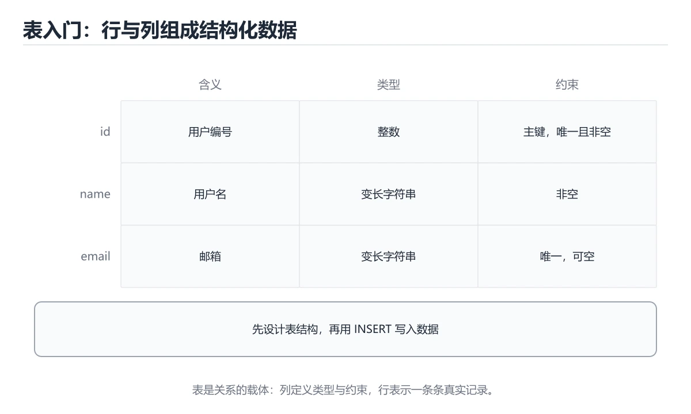
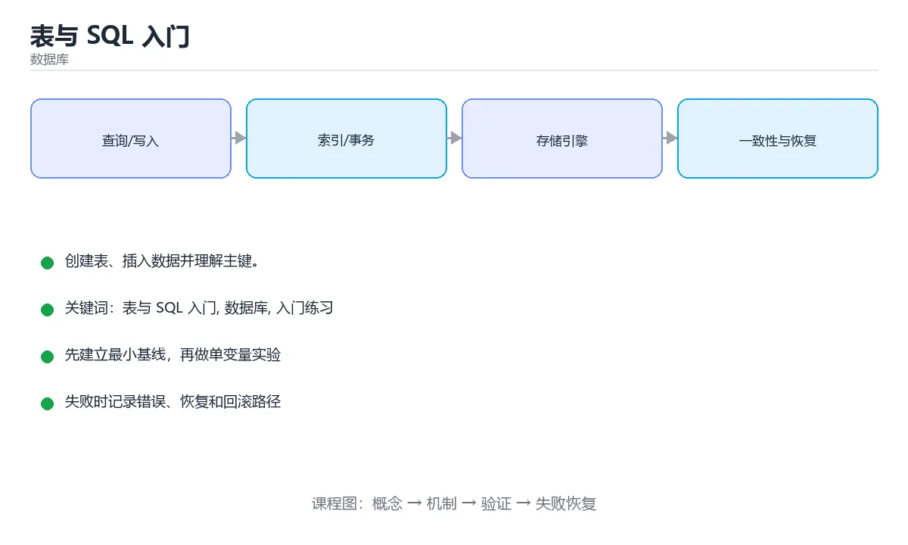

# 表与 SQL 入门

> 内容更新时间：2026-10-06 · 学习阶段：入门 · 预计用时：45 分钟





## 本节知识框架

**课程定位**：所属分类为「数据库」，课程主题为「表与 SQL 入门」，学习阶段为「入门」，建议用时 45 分钟。

**本课要解决的主问题**：创建表、插入数据并理解主键。

| 学习层次 | 要回答的问题 | 完成判据 |
| --- | --- | --- |
| 概念层 | 「表与 SQL 入门」有哪些必须区分的对象与术语？ | 能用自己的话定义核心术语，并各举一个正例和一个反例。 |
| 机制层 | 这些对象按什么顺序发生作用，输入如何变成输出？ | 能画出或写出机制步骤，并说明每一步的失败条件。 |
| 应用层 | 什么场景适合使用「表与 SQL 入门」，什么场景不适合？ | 能给出一个真实场景、一个最小示例和一个边界案例。 |
| 性能层 | 时间、空间、吞吐或延迟受哪些量影响？ | 能说出复杂度或性能瓶颈的证据来源；没有证据时明确写“材料未提供”。 |
| 复习层 | 怎样确认自己不是只记住了结论？ | 能独立完成本课自测，并把错误定位到概念、机制、示例或边界。 |

### 阅读路线

1. 先读「核心概念定义」，建立「表与 SQL 入门」等对象的精确定义。
2. 再读「原理与运行机制」，把定义串成可重复的过程。
3. 用「代码/协议/SQL 示例」验证过程，并只改一个条件观察结果变化。
4. 最后检查性能、易错点、知识关系与自测题，形成可复习的证据链。

**前置知识**：没有硬性先修课；仍建议先具备本分类的基础阅读与操作能力。

**学习位置**：本课是当前分类的第一课，建议从本页开始建立术语表。

**后续衔接**：下一课《SQL 查询入门》会继续使用本课术语，学完后建议立即完成一次自测。

**教材衔接：学习目标**

- 先认识表与 SQL 入门需要的工具、输入和输出。
- 按步骤运行最小示例，并记录结果与错误。
- 用一个边界输入验证自己是否真正掌握。

**教材衔接：前置知识**

- 会进行基本的文件或命令行操作。
- 不需要预先掌握「数据库」的高级知识。

**教材衔接：本课小结**

- 入门阶段先保证能运行、能观察、能解释，再追求复杂功能。
- 每次只改一个变量，记录预测与实际结果。
- 遇到错误先看第一条错误信息，再回到最小示例。

## 核心概念定义

> 阅读约定：本课先给「表与 SQL 入门」相关术语的操作性定义与适用边界；正文里的口语化说法与定义冲突时，以定义和可复现示例为准。

| 术语 | 操作性定义 | 本课中的边界 |
| --- | --- | --- |
| 表、行与列 | 表由若干行记录组成，每一列定义字段名与数据类型。 | 仅在「表与 SQL 入门」明确给出的输入、版本与资源条件下成立。 |
| 主键 | 唯一标识一行的列或列组合，不允许重复也不能为空。 | 仅在「表与 SQL 入门」明确给出的输入、版本与资源条件下成立。 |
| 数据类型与约束 | 类型限制可存的值，NOT NULL、UNIQUE、CHECK 等约束保证数据有效。 | 仅在「表与 SQL 入门」明确给出的输入、版本与资源条件下成立。 |
| CREATE TABLE | 用 DDL 语句建表，一次写清列、类型与约束。 | 仅在「表与 SQL 入门」明确给出的输入、版本与资源条件下成立。 |
| 外键 | 指向另一张表主键的列，用来维护表之间的引用完整性。 | 仅在「表与 SQL 入门」明确给出的输入、版本与资源条件下成立。 |

### 定义如何使用

在「表与 SQL 入门」中判断一个说法是否成立，先确认它使用的是哪个对象的定义，再检查输入规模、运行环境与失败路径。定义不是口号，而是后续推导、代码示例和自测题共享的约束。

## 原理与运行机制

### 机制总览

1. **建立输入**：把「表、行与列」按本课定义整理成可观察、可重复的输入条件。
2. **执行转换**：围绕「主键」执行本课的核心步骤；每一步都记录中间状态，避免只看最终输出。
3. **产生输出**：得到「数据类型与约束」后，用正文示例或协议/SQL 结果核对输出是否符合预期。
4. **改变一个条件**：只替换一个边界条件或环境参数，观察「表与 SQL 入门」的结论是否仍然成立。

| 阶段 | 关注对象 | 失败时应检查 |
| --- | --- | --- |
| 输入 | 表、行与列 | 类型、范围、编码、版本或前置状态是否满足定义。 |
| 处理 | 主键 | 顺序、可见性、锁、路由、事务或调度规则是否被破坏。 |
| 输出 | 数据类型与约束 | 结果是否可复现，错误是否被正确传播而不是被吞掉。 |

本课的机制结论要用「表与 SQL 入门」自己的示例验证。「表与 SQL 入门」没有给出某个数量级、吞吐或内存数据时，本课把该判断标为“材料未提供”，不从相邻主题外推。

**教材衔接：一句话入门**

创建表、插入数据并理解主键。

**教材衔接：表、行、列与约束**

关系数据库中的表不是一张普通电子表格，而是有模式约束的二维结构。列定义名称和数据类型，行表示一条实体记录，主键唯一标识一行，外键保证它引用的另一张表记录存在。`NOT NULL` 禁止空值，`UNIQUE` 保证列值不重复，`CHECK` 限制取值范围，`DEFAULT` 在未提供值时自动填充。约束的价值在于把数据规则放进数据库，而不是只依赖应用代码；任何写入路径都要经过约束检查。

设计表时要先确定实体和关系。学生和课程是多对多关系，通常需要一张选课表作为关联表，并保存选课时间、成绩等关系属性。把关系属性硬塞进学生表或课程表，会导致重复、更新异常和删除异常。主键可以是业务字段，也可以是自增或 UUID 等代理键；前者语义清晰但可能变化，后者稳定但需要额外索引或映射。

创建表只是第一步，后续还要考虑数据增长、查询模式和迁移。频繁按某列过滤或连接时，可能需要索引；索引会加快读取，但增加写入成本和存储空间。修改线上表结构时，要先评估锁表时间、回滚方案和旧版本应用兼容性，不能直接在高峰期执行大表变更。

**教材衔接：从建表到可验证的数据**

可以用一个最小闭环验证表设计：创建表、插入若干行、查询预期结果、更新一行、删除一行，再检查约束是否按预期拒绝非法数据。特别要测试重复主键、外键指向不存在的记录、必填列为空、字符串超长和数值越界。插入成功不代表约束正确，必须专门验证失败路径。

事务用于把多条写入组合成原子操作。例如选课需要同时插入选课记录并扣减名额，如果第二步失败，第一步也必须回滚。理解 ACID 中的原子性、一致性、隔离性和持久性，有助于解释“为什么这条记录一会儿看得到、一会儿看不到”以及“并发下为什么会超卖”。

最后，SQL 语句的可读性同样重要。给表、列和约束起清晰的名称，统一大小写和格式，避免 `SELECT *` 在生产查询中隐藏列变更风险。把建表语句纳入版本控制，并用迁移工具按顺序执行，才能让开发、测试和生产环境保持一致。

## 典型应用场景

| 场景 | 典型输入或前提 | 期望产物 |
| --- | --- | --- |
| 学习验证 | 使用本课最小示例和 表与 SQL 入门、数据库 | 能复现正文结论，并解释每一步。 |
| 工程落地 | 把「表与 SQL 入门」放入真实模块或服务边界 | 输出可观测、失败可定位、参数可配置。 |
| 故障排查 | 只改一个版本、规模、输入或依赖条件 | 能区分概念错误、实现错误和环境差异。 |

判断「表与 SQL 入门」的场景是否成立，标准是能否写出输入、处理、输出和失败路径；材料中没有出现的数据在本课标注为“材料未提供”，不用推测替代证据。

**课程内置实验入口**：`system_database`，用于动手验证《表与 SQL 入门》的机制；实验结论不替代概念定义与复杂度分析。

**教材衔接：代码实验：把示例跑成证据**

### 实验一：建立基线

```sql
CREATE TABLE students (
  id INTEGER PRIMARY KEY,
  name TEXT NOT NULL UNIQUE
);
INSERT INTO students (id, name) VALUES (1, 'Ada');
SELECT id, name FROM students;
```

### 实验二：只改一个输入

沿用「表与 SQL 入门」的最小示例做一次单变量实验：

| 实验 | 改动 | 预测 | 实际 | 结论 |
| --- | --- | --- | --- | --- |
| 基线 | 保持「表与 SQL 入门」示例原样 |  |  |  |
| 边界 | 把表与 SQL 入门换成空值或极值 |  |  |  |
| 失败 | 给数据库传入非法输入 |  |  |  |

做完后用一句话写出「表与 SQL 入门」的结论：输入怎么变，结果才怎么变。

### 实验三：制造一个可控错误

插入一条违反主键、非空或唯一约束的记录，或者让 NULL 参与普通比较。记录数据库拒绝操作的位置和错误码，再验证正确写法。

| 实验 | 改动 | 预测 | 实际 | 结论 |
| --- | --- | --- | --- | --- |
| 基线 | 保持原样 |  |  |  |
| 边界 |  |  |  |  |
| 失败 |  |  |  |  |

### 实验四：用三句话复述

1. 先写清 表与 SQL 入门 的输入契约：类型、范围、缺省值与非法值分别怎么处理？
2. INTEGER 的执行顺序里，哪一步会写数据或产生外部副作用？
3. 输出如何验证，失败时第一条可观察证据是什么？

**教材衔接：深度拓展与实战**

这一节把 表与 SQL 入门 的定义、INTEGER 的代码与常见失败串成一条复习路线。

### 机制拆解

- **实验一：建立基线**：先原样运行 INTEGER 所在的示例，记录版本、命令、完整输出与退出状态。
- **实验三：制造一个可控错误**：在「表与 SQL 入门」里，「实验三：制造一个可控错误」这一步要先写清输入与预期，再记录实际结果和差异；结果不符时回到对应小节核对前提。
- **考点 1：在 SQL 中，CREATE TABLE、INSERT 与 SELECT 分别用于？**：针对「表与 SQL 入门」，先自问「在 SQL 中，CREATE TABLE、INSERT 与 SELECT 分别用于」；作答后回到对应考点核对判断依据。

### 边界条件与常见反例

「表与 SQL 入门」的边界不只包括最大最小值，还要覆盖空、重复和失败：

| 条件 | 常见反例 | 处理方式 |
| --- | --- | --- |
| 空输入 | 表与 SQL 入门 没有任何取值 | 先判空，给出明确错误而不是继续执行 |
| 边界值 | 数据库 取最小或最大 | 用最小值、最大值和越界值各跑一次 |
| 重复执行 | 同一输入被执行两次 | 保证结果可重复，必要时加锁或去重 |
| 失败路径 | 表与 SQL 入门 相关步骤报错 | 保留原始错误，确认回滚或重试行为 |

### 工程检查表

- [ ] 能否用自己的话说明表与 SQL 入门解决什么问题，以及它不负责什么？
- [ ] 能否说明 表与 SQL 入门 的正常输出，以及失败时留下的错误信息？
- [ ] 能否解释本课关键词在真实项目中的边界与取舍？
- [ ] 能否把 表与 SQL 入门 的方法迁移到相近问题，并说明需要改哪一步？

### 迁移练习

1. 保持正文示例不变，写出它的输入、处理步骤和预期输出。
2. 只改变 表与 SQL 入门 的一个条件，预测结果并说明依据；再运行或手算验证。
3. 结合表与 SQL 入门、数据库、入门练习，写出一个真实项目中的使用场景。
4. 写下一个反例，说明它在什么条件下会使朴素做法失效。

<!-- p0-depth-v2:start -->

## 代码/协议/SQL 示例

### 最小可验证示例

下面保留《表与 SQL 入门》原文中的最小示例。先预测《表与 SQL 入门》示例的输出，再按正文步骤运行或推演；示例依赖外部环境时，同时记录版本与输入。

```sql
CREATE TABLE students (
  id INTEGER PRIMARY KEY,
  name TEXT NOT NULL UNIQUE
);
INSERT INTO students (id, name) VALUES (1, 'Ada');
SELECT id, name FROM students;
```

**教材衔接：最小示例**

```sql
CREATE TABLE students (
  id INTEGER PRIMARY KEY,
  name TEXT NOT NULL UNIQUE
);
INSERT INTO students (id, name) VALUES (1, 'Ada');
SELECT id, name FROM students;
```

**教材衔接：预期输出**

```text
id | name
1  | Ada
```

**教材衔接：零基础精讲：把表与 SQL 入门真正讲透**

### 先建立一个直觉

把数据库看成一本多人同时改写的账本：先定义事实与约束，再考虑索引、并发和恢复，最后才讨论性能。
落到本课，「表与 SQL 入门」关心的是 表与 SQL 入门 与 数据库 的配合，也就是说这条直觉要在 表、行、列与约束 里被具体验证。

本课的摘要可以当作一张地图：创建表、插入数据并理解主键。

### 逐步拆解

1. 澄清输入与目标。先写清「表与 SQL 入门」要解决的问题、合法输入范围和成功标准，再进入后续步骤。
2. 描述处理过程。把「表与 SQL 入门、数据库、入门练习」映射到具体步骤，每步都要求能单独验证。
3. 定义输出。明确 表与 SQL 入门 与 数据库 各自的产物，以及失败时留下什么证据。
4. 先预测表与 SQL 入门会怎样失败，再实际触发一次；差异部分就是本课最需要补的前提。
5. 把 INTEGER 的规模缩小到一眼能算清的程度，手动推导结果后再用程序验证，差异处就是理解漏洞。

### 把正文串成一条执行链

- **考点 2：把 id 列声明为 INTEGER PRIMARY KEY 意味着什么？**：针对「表与 SQL 入门」，先自问「把 id 列声明为 INTEGER PRIMARY KEY 意味着什么」；作答后回到对应考点核对判断依据。

### 从测验反推易错点

**检查点 1：在 SQL 中，CREATE TABLE、INSERT 与 SELECT 分别用于？**

- 参考判断：建表、写入数据与查询数据，是三类最基础的操作
- 自问：如果去掉题干里的一个限定词，结论还成立吗？

**检查点 2：把 id 列声明为 INTEGER PRIMARY KEY 意味着什么？**

- 参考判断：该列唯一标识每一行，不能重复也不能为空

**检查点 3：NOT NULL 与 UNIQUE 两个约束分别限制什么？**

- 参考判断：前者禁止空值，后者要求值在整个表中唯一

- 参考判断：CREATE TABLE、create table

### 工程排错顺序

| 先查什么 | 要得到的证据 | 判断标准 |
| --- | --- | --- |
| 事务边界是否覆盖全部写操作？ | 日志、输入样例、测试或指标 | 能复现并解释，才算定位 |
| 索引是否匹配真实查询与排序？ | 日志、输入样例、测试或指标 | 能复现并解释，才算定位 |
| 迁移是否可回滚、可灰度、可校验？ | 日志、输入样例、测试或指标 | 能复现并解释，才算定位 |
| 锁等待与慢查询是否有观测？ | 日志、输入样例、测试或指标 | 能复现并解释，才算定位 |

### 变式训练

1. 把 表与 SQL 入门 放进一个只有单机、没有额外依赖的小项目，先保证正确再扩展。
2. 把 表与 SQL 入门 的输入规模扩大十倍，记录时间、内存和失败路径，找出第一个瓶颈。
3. 把 数据库 换成失败输入，记录错误信息与恢复动作。
5. 故意跳过 数据库 的检查再运行，比较与正常流程的差异，并说明这个检查挡住的到底是哪一类失败。
6. 限制 CPU 与内存上限后重跑 INTEGER，观察哪一项参数需要重新设定。

### 本课自测

- [ ] 能用一句话解释表与 SQL 入门在本课中的角色与边界。
- [ ] 能举出一个正常例子和一个失败例子。
- [ ] 能说出最小验证步骤，以及需要记录的证据。
- [ ] 能用一句话解释「数据库」在本课中的角色与边界。
- [ ] 能用一句话解释 表与 SQL 入门 在「表与 SQL 入门」中的角色与边界。

### 迁移案例库

换一个 数据库 约束重做一次，确认结论在新条件下是否仍然成立。

#### 迁移案例 1：围绕表与 SQL 入门做一次小实验

**目标**：在不改变课程主体的前提下，验证表与 SQL 入门中的一个关键判断。

**步骤**：
1. 复述当前方案对本课的假设，写成一句可证伪的话。
2. 设计一个正常输入和一个边界输入，分别预测输出。
3. 运行或逐步演算，记录实际输出、耗时和失败信息。
4. 只调整一个参数，比较前后差异并解释原因。
5. 补充一条测试或复习卡，确保下次能更快复现。

**验收**：迁移过程要留下 INTEGER 的可运行记录，并说明数据库在新场景下是否仍然成立。

#### 迁移案例 2：围绕「数据库」做一次小实验

**步骤**：
1. 复述当前方案对「数据库」的假设，写成一句可证伪的话。

#### 迁移案例 3：围绕「入门练习」做一次小实验

**步骤**：
1. 把 INTEGER 依赖的前提写成一句可以被反例推翻的陈述。

#### 迁移案例 4：围绕表与 SQL 入门做一次小实验

**步骤**：

#### 迁移案例 5：围绕「数据库」做一次小实验

**步骤**：

#### 迁移案例 6：围绕「入门练习」做一次小实验

**步骤**：

#### 迁移案例 7：围绕表与 SQL 入门做一次小实验

**步骤**：

#### 迁移案例 8：围绕「数据库」做一次小实验

**步骤**：

#### 迁移案例 9：围绕「入门练习」做一次小实验

**步骤**：

#### 迁移案例 10：围绕表与 SQL 入门做一次小实验

**步骤**：

#### 迁移案例 11：围绕「数据库」做一次小实验

**步骤**：

#### 迁移案例 12：围绕「入门练习」做一次小实验

**步骤**：

#### 迁移案例 13：围绕表与 SQL 入门做一次小实验

**步骤**：

#### 迁移案例 14：围绕「数据库」做一次小实验

**步骤**：

#### 迁移案例 15：围绕「入门练习」做一次小实验

**步骤**：

#### 迁移案例 16：围绕表与 SQL 入门做一次小实验

**步骤**：

<!-- p0-depth-v2:end -->

## 时间/空间复杂度或性能分析

**复杂度证据**：「表与 SQL 入门」的现有材料没有给出渐近时间或空间复杂度的明确结论，本课只做定性检查，不补写未经验证的 $O$ 记号。

| 维度 | 本课关注点 | 判断依据 |
| --- | --- | --- |
| 时间/延迟 | 「表与 SQL 入门」的主要步骤是否会随输入规模、并发度或网络往返增长。 | 以正文复杂度、基准数据或可重复测量为准。 |
| 空间/内存 | 中间状态、缓存、副本、连接或索引是否随规模增长。 | 记录峰值内存与数据副本，不只看最终结果。 |
| 吞吐/资源 | 版本、调度、锁、IO、序列化或协议开销是否成为瓶颈。 | 固定环境做对照实验，改变一个变量。 |

评估「表与 SQL 入门」时要区分“正确性成立”和“性能达标”两件事；材料没有给出基准时，本课只保留量级来源与测量方法，不写不可验证的绝对数字。

## 常见误区与易错点

> 复核《表与 SQL 入门》的易错点时，优先保留原文的错误表、故障现场与排错路径；每条修正都要能用本课示例复验。

| 易错点 | 常见表现 | 正确做法 |
| --- | --- | --- |
| 只背结论 | 能复述「表与 SQL 入门」的定义，却说不清输入、输出与边界。 | 回到机制步骤，用最小示例逐一验证。 |
| 混淆相邻概念 | 把本课对象与相邻主题的对象当成同一类。 | 先比较定义、资源归属、生命周期和失败模式。 |
| 忽略版本与环境 | 在开发机通过后直接外推到生产环境。 | 固定版本、输入和资源条件，再记录可复现结果。 |

**教材衔接：常见错误与排查**

> 说明：本表由《表与 SQL 入门》的核心知识整理（2026-10-07），人工复核进度见 docs/content_review_batches.md。

| 易错点 | 容易踩的做法 | 正确结论 |
| --- | --- | --- |
| 建表不定义主键 | 无法唯一标识行，更新删除容易误伤 | 每张表定义主键，必要时补唯一约束 |
| 字段类型选得过大或过小 | 存储浪费或运行期溢出 | 按取值范围选类型，并预留合理增长空间 |
| 约束只写在应用层 | 绕过应用就能写入脏数据 | 用非空、唯一与外键等数据库约束兜底 |

**教材衔接：故障现场**

### 现场 1：建表不定义主键

**症状**：在《表与 SQL 入门》的复现场景中，无法唯一标识行，更新删除容易误伤。

**根因**：触发点是把“建表不定义主键”当成安全做法。它没有满足《表与 SQL 入门》要求的前提，因此先表现为“无法唯一标识行，更新删除容易误伤”；排查时先完整复现这一段，再核对输入、配置与依赖。

**修复**：针对《表与 SQL 入门》的问题，每张表定义主键，必要时补唯一约束。

**验证**：先在《表与 SQL 入门》中记录“建表不定义主键”留下的失败证据，再执行“每张表定义主键，必要时补唯一约束”并重放；确认错误路径变为明确结果，且修复没有掩盖同类故障。

### 现场 2：字段类型选得过大或过小

**症状**：在《表与 SQL 入门》的复现场景中，存储浪费或运行期溢出。

**根因**：触发点是把“字段类型选得过大或过小”当成安全做法。它没有满足《表与 SQL 入门》要求的前提，因此先表现为“存储浪费或运行期溢出”；排查时先完整复现这一段，再核对输入、配置与依赖。

**修复**：针对《表与 SQL 入门》的问题，按取值范围选类型，并预留合理增长空间。

**验证**：在《表与 SQL 入门》中按“按取值范围选类型，并预留合理增长空间”调整后，从“字段类型选得过大或过小”的触发条件重放同一条路径，确认“存储浪费或运行期溢出”不再出现，并补一个相邻边界用例检查没有引入新问题。

### 现场 3：约束只写在应用层

**症状**：在《表与 SQL 入门》的复现场景中，绕过应用就能写入脏数据。

**根因**：当出现“约束只写在应用层”时，执行路径已经绕过了《表与 SQL 入门》的关键约束，最终以“绕过应用就能写入脏数据”暴露出来；修复前必须先确认约束在哪里失效。

**修复**：针对《表与 SQL 入门》的问题，用非空、唯一与外键等数据库约束兜底。

**验证**：在《表与 SQL 入门》中按“用非空、唯一与外键等数据库约束兜底”调整后，从“约束只写在应用层”的触发条件重放同一条路径，确认“绕过应用就能写入脏数据”不再出现，并补一个相邻边界用例检查没有引入新问题。

## 与其他知识点的关系

| 关系 | 课程 | 为什么 |
| --- | --- | --- |
| 关联 | 《SQL 查询入门》 | 用于横向比较或把本课结论迁移到相邻主题。 |
| 后续顺序 | 《SQL 查询入门》 | 同分类中安排在本课之后，会继续使用本课术语。 |

把「表与 SQL 入门」放回知识体系时，不只要记住“前面学过什么”，还要说明两个主题在输入、机制、资源边界和失败模式上的差异。这样才能把单课知识迁移到项目、排障和后续课程。

**教材衔接：复习与迁移**

复习目标：把「表与 SQL 入门」的判断标准放回可复现的例子里。先自己作答，再对照依据；如果结论正确但理由不完整，回到正文补足前提。

### 概念复述

- 用一句话说明「表与 SQL 入门」解决什么问题：创建表、插入数据并理解主键。
- 写出表与 SQL 入门、数据库、入门练习之间的关系，并各举一个例子。
- 说出本课最容易混淆的两个概念，以及区分它们的判据。

### 正文逐节复核

- **表、行、列与约束**：关系数据库中的表不是一张普通电子表格，而是有模式约束的二维结构。
- **逐节复习与自检**：关系数据库中的表不是一张普通电子表格，而是有模式约束的二维结构。
- **零基础精讲：把表与 SQL 入门真正讲透**：把数据库看成一本多人同时改写的账本：先定义事实与约束，再考虑索引、并发和恢复，最后才讨论性能。

### 测验回顾

1. 围绕“表与 SQL 入门”中的 表与 SQL 入门、数据库、入门练习，下列哪两项是本课强调的实践判断？
   - 依据：题干的正确项是学习 表与 SQL 入门 时要同时说明输入、输出和失败路径，不能只看正常流程。在「表与 SQL 入门」里，验证 数据库 时要固定版本并覆盖边界输入，结论才可复现。“围绕表与”与「表与 SQL 入门」的术语表相呼应，只有符合表与 SQL 入门、数据库、入门练习约束的“学习 表与 SQL 入门 时要同时说明输”才是正文支持的结论。
2. 这段 SQL 代码是「表与 SQL 入门」的示例片段，下面哪一项描述与它一致？
   - 依据：在「表与 SQL 入门」里，题干的正确项是这段代码只做静态声明，没有循环、分支或可观察输出，在「表与 SQL 入门」里它只能证明表与 SQL 入门相关约束存在，不能替代真实运行证据。把输入或边界换成空值、极值或失败情况后，结论要以「表与 SQL 入门」的实际运行结果为准。这道题的关键在「表与 SQL 入门」的表与 SQL 入门、数据库、入门练习：先确认题干“这段 SQL 代码是表与 SQL 入”问的是哪一步，再排除偷换前提的选项。
3. NOT NULL 与 UNIQUE 两个约束分别限制什么？
   - 依据：在「表与 SQL 入门」里，前者禁止空值，后者要求值在整个表中唯一。NOT NULL 保证列必须有值，UNIQUE 保证同一列或列组合中的值不重复。“NULL”与「表与 SQL 入门」的术语表相呼应，只有符合表与 SQL 入门、数据库、入门练习约束的“前者禁止空值，后者要求值在整个表中唯一”才是正文支持的结论。
4. 补全 SQL：创建一张学生表应使用 ____ students (id INTEGER PRIMARY KEY, name TEXT);。
   - 依据：CREATE TABLE 用来定义表名、列名、数据类型和约束。示例中的 id INTEGER PRIMARY KEY 表示主键，通常会唯一标识每一行。这道题要求区分概念与边界，「CREATE TABLE 或 create table」只有在题干给出的前提下才成立，而缺少同一组条件。把“CREATE TABLE”代回「表与 SQL 入门」里“补全 SQL”的例子核对，条件一旦改变，结论就要用表与 SQL 入门、数据库、入门练习重新推导。

### 迁移练习

把「表与 SQL 入门」的结论迁移到相邻主题，每次迁移都写清预测与证据：

1. 换输入：用表与 SQL 入门处理一组你自己的数据，对比教材示例的结果差异。
2. 换失败条件：制造一个数据库相关的错误，说明如何从错误信息定位根因。
3. 换规模：把数据量或并发度提高一个数量级，说明「表与 SQL 入门」的结论是否仍成立。

## 自测题与参考答案

> 先独立作答《表与 SQL 入门》的自测题，再对照答案与解析；每处判断都要能在本课正文或示例中找到依据。

### 自测 1

围绕“表与 SQL 入门”中的 表与 SQL 入门、数据库、入门练习，下列哪两项是本课强调的实践判断？

A. 学习 表与 SQL 入门 时要同时说明输入、输出和失败路径，不能只看正常流程
B. 只要 表与 SQL 入门 的常规示例通过，就可以跳过边界与异常路径
C. 验证 数据库 时要固定版本并覆盖边界输入，结论才可复现
D. 把 数据库 的单次运行结果当成所有版本和规模都成立

**参考答案**：学习 表与 SQL 入门 时要同时说明输入、输出和失败路径，不能只看正常流程；验证 数据库 时要固定版本并覆盖边界输入，结论才可复现

**解析**：题干的正确项是学习 表与 SQL 入门 时要同时说明输入、输出和失败路径，不能只看正常流程。在「表与 SQL 入门」里，验证 数据库 时要固定版本并覆盖边界输入，结论才可复现。“围绕表与”与「表与 SQL 入门」的术语表相呼应，只有符合表与 SQL 入门、数据库、入门练习约束的“学习 表与 SQL 入门 时要同时说明输”才是正文支持的结论。

### 自测 2

这段 SQL 代码是「表与 SQL 入门」的示例片段，下面哪一项描述与它一致？

```sql
CREATE TABLE students (
  id INTEGER PRIMARY KEY,
  name TEXT NOT NULL UNIQUE
);
INSERT INTO students (id, name) VALUES (1, 'Ada');
SELECT id, name FROM students;
```

A. 这段代码包含条件分支，不同输入会走不同的执行路径。
B. 这段代码只做静态声明，没有循环、分支或可观察输出。
C. 这段代码会产生可观察的输出，运行后能看到结果。
D. 这段代码包含循环结构，同一段逻辑会被重复执行。

**参考答案**：这段代码只做静态声明，没有循环、分支或可观察输出。

**解析**：在「表与 SQL 入门」里，题干的正确项是这段代码只做静态声明，没有循环、分支或可观察输出，在「表与 SQL 入门」里它只能证明表与 SQL 入门相关约束存在，不能替代真实运行证据。把输入或边界换成空值、极值或失败情况后，结论要以「表与 SQL 入门」的实际运行结果为准。这道题的关键在「表与 SQL 入门」的表与 SQL 入门、数据库、入门练习：先确认题干“这段 SQL 代码是表与 SQL 入”问的是哪一步，再排除偷换前提的选项。

### 自测 3

NOT NULL 与 UNIQUE 两个约束分别限制什么？

A. 两者都表示必须填写且可以重复
B. 前者禁止空值，后者要求值在整个表中唯一
C. 两者都只能用于主键列，不能用于其他列
D. 前者要求唯一，后者禁止空值

**参考答案**：前者禁止空值，后者要求值在整个表中唯一

**解析**：在「表与 SQL 入门」里，前者禁止空值，后者要求值在整个表中唯一。NOT NULL 保证列必须有值，UNIQUE 保证同一列或列组合中的值不重复。“NULL”与「表与 SQL 入门」的术语表相呼应，只有符合表与 SQL 入门、数据库、入门练习约束的“前者禁止空值，后者要求值在整个表中唯一”才是正文支持的结论。

**教材衔接：动手练习**

1. 原样运行最小示例，保存命令和输出。
2. 把数字 2 改成 10，预测并验证新结果。
3. 制造一个错误输入，写出错误信息和修复方法。

**教材衔接：可运行练习**

### 任务 1：先跑通，再解释

```sql
CREATE TABLE students (
  id INTEGER PRIMARY KEY,
  name TEXT NOT NULL UNIQUE
);
INSERT INTO students (id, name) VALUES (1, 'Ada');
SELECT id, name FROM students;
```

### 任务 2：只改一个条件

把「表与 SQL 入门」的最小示例复制一份，只改一个条件再跑一次：

- 改动点：把 数据库 换成边界值，其他输入保持原样。
- 预测：先写下「表与 SQL 入门」在改动后的输出或错误信息，再运行。
- 记录：对照改动前后的结果，指出差异出在哪一步。
- 验收：换回原条件能复现原结果，改动只影响表与 SQL 入门。

### 任务 3：迁移到自己的数据

换一个 数据库 场景重做一次，确认结论不是只对示例数据成立。

**教材衔接：本课复习清单**

离开本课前，逐项确认：

- [ ] 不看解析，能说出「把 id 列声明为 INTEGER PRIMARY KEY 意味着什么？」的判断依据。
- [ ] 不看解析，能说出「NOT NULL 与 UNIQUE 两个约束分别限制什么？」的判断依据。
- [ ] 用 表与 SQL 入门 构造一个正常输入和一个边界输入，分别记录输出与判断依据。
- [ ] 把本课最容易混淆的两个概念写成一句话对照。

| 复盘项 | 记录 |
| --- | --- |
| 已经能独立解释的考点 |  |
| 仍然说不清的概念 |  |
| 下一步验证动作 |  |

**教材衔接：复习与自测**

下面按正文顺序回顾「表与 SQL 入门」的每一节；说不清的地方回到 表、行、列与约束 补课。

### 最小示例

```sql
CREATE TABLE students (
  id INTEGER PRIMARY KEY,
  name TEXT NOT NULL UNIQUE
);
INSERT INTO students (id, name) VALUES (1, 'Ada');
SELECT id, name FROM students;
```

自检：这一节与相邻主题的边界在哪里？

### 预期输出

```text
id | name
1  | Ada
```

### 常见错误

自检：把这一节讲给没学过的人，最需要强调哪一点？

### 动手练习

自检：如果去掉这一节里的一个前提，结论会怎样变化？

### 表、行、列与约束

关系数据库中的表不是一张普通电子表格，而是有模式约束的二维结构。列定义名称和数据类型，行表示一条实体记录，主键唯一标识一行，外键保证它引用的另一张表记录存在。

自检：INTEGER 出错时你会先看到什么现象？如何确认根因？

### 从建表到可验证的数据

可以用一个最小闭环验证表设计：创建表、插入若干行、查询预期结果、更新一行、删除一行，再检查约束是否按预期拒绝非法数据。特别要测试重复主键、外键指向不存在的记录、必填列为空、字符串超长和数值越界。

---

## 术语速查

把「表与 SQL 入门」里反复出现的术语集中放在一起。复习时先遮住右列，尝试用自己的话解释，再回到正文核对。

| 术语 | 一句话说明 |
| --- | --- |
| `表、行与列` | 表由若干行记录组成，每一列定义字段名与数据类型。 |
| `主键` | 唯一标识一行的列或列组合，不允许重复也不能为空。 |
| `数据类型与约束` | 类型限制可存的值，NOT NULL、UNIQUE、CHECK 等约束保证数据有效。 |
| `CREATE TABLE` | 用 DDL 语句建表，一次写清列、类型与约束。 |
| `外键` | 指向另一张表主键的列，用来维护表之间的引用完整性。 |

## 考点精讲

### 考点 1：多选辨析·表与 SQL 入门

- **题目**：围绕“表与 SQL 入门”中的 表与 SQL 入门、数据库、入门练习，下列哪两项是本课强调的实践判断？
- **判断依据**：题干的正确项是学习 表与 SQL 入门 时要同时说明输入、输出和失败路径，不能只看正常流程。在「表与 SQL 入门」里，验证 数据库 时要固定版本并覆盖边界输入，结论才可复现。“围绕表与”与「表与 SQL 入门」的术语表相呼应，只有符合表与 SQL 入门、数据库、入门练习约束的“学习 表与 SQL 入门 时要同时说明输”才是正文支持的结论。

### 考点 2：代码补全·表与 SQL 入门

- **题目**：这段 SQL 代码是「表与 SQL 入门」的示例片段，下面哪一项描述与它一致？
- **判断依据**：在「表与 SQL 入门」里，题干的正确项是这段代码只做静态声明，没有循环、分支或可观察输出，在「表与 SQL 入门」里它只能证明表与 SQL 入门相关约束存在，不能替代真实运行证据。把输入或边界换成空值、极值或失败情况后，结论要以「表与 SQL 入门」的实际运行结果为准。这道题的关键在「表与 SQL 入门」的表与 SQL 入门、数据库、入门练习：先确认题干“这段 SQL 代码是表与 SQL 入”问的是哪一步，再排除偷换前提的选项。

### 考点 3：概念判断·表与 SQL 入门

- **题目**：NOT NULL 与 UNIQUE 两个约束分别限制什么？
- **判断依据**：在「表与 SQL 入门」里，前者禁止空值，后者要求值在整个表中唯一。NOT NULL 保证列必须有值，UNIQUE 保证同一列或列组合中的值不重复。“NULL”与「表与 SQL 入门」的术语表相呼应，只有符合表与 SQL 入门、数据库、入门练习约束的“前者禁止空值，后者要求值在整个表中唯一”才是正文支持的结论。

### 考点 4：填空·表与 SQL 入门

- **题目**：补全 SQL：创建一张学生表应使用 ____ students (id INTEGER PRIMARY KEY, name TEXT);。
- **判断依据**：CREATE TABLE 用来定义表名、列名、数据类型和约束。示例中的 id INTEGER PRIMARY KEY 表示主键，通常会唯一标识每一行。这道题要求区分概念与边界，「CREATE TABLE 或 create table」只有在题干给出的前提下才成立，而缺少同一组条件。把“CREATE TABLE”代回「表与 SQL 入门」里“补全 SQL”的例子核对，条件一旦改变，结论就要用表与 SQL 入门、数据库、入门练习重新推导。

### 考点 5：填空·表与 SQL 入门

- **题目**：补全 SQL：让某列的取值在整张表里不重复，应在列定义后加上 ____ 约束。
- **判断依据**：UNIQUE 约束保证这一列或多列组合的取值在表中不重复，数据库会为它建立唯一索引。表与 SQL 入门 的正文在建表示例里同时使用了 PRIMARY KEY 与 UNIQUE：主键既唯一又非空，而且一张表只能有一个；UNIQUE 允许多个列各自声明，也允许插入 NULL，两者语义不能互相替代。

## English Overview

**Title:** Tables and SQL Basics

**Summary:** Create tables, insert rows and use primary keys.

**Category:** Database
**Level:** 入门
**Key terms:** 表与 SQL 入门, 数据库, 入门练习

## 内容元数据

- 内容版本：v2.0
- 最后更新：2026-10-06
- 学习阶段：入门
- 适用环境：PostgreSQL / MySQL / SQLite 等主流数据库；本课聚焦其中的 表与 SQL 入门。
- 内容来源：内置结构化课程与工程实践整理
- 相关主题：表与 SQL 入门、数据库、入门练习
- 质量版本：P0 测验标准 + P1 覆盖扩展 + P2 体验补全

## 参考资料与复核

- 最后复核：2026-10-04
- 下次复核：2027-09-17
- 复核范围：版本兼容、API 行为、安全建议与工程实践
- 来源性质：官方文档、标准或权威教材；正文为离线教学重组

| 参考资料 | 本课用途 |
| --- | --- |
| [SQL 标准概览](https://www.iso.org/standard/76583.html) | SQL 标准范围 |
| [数据库规范化](https://learn.microsoft.com/office/troubleshoot/access/database-normalization-description) | 范式与表设计 |
| [JDBC 事务](https://docs.oracle.com/javase/tutorial/jdbc/basics/transactions.html) | 连接事务与回滚 |

> 「表与 SQL 入门」的链接用于离线阅读后的延伸核对；App 不会自动联网。
