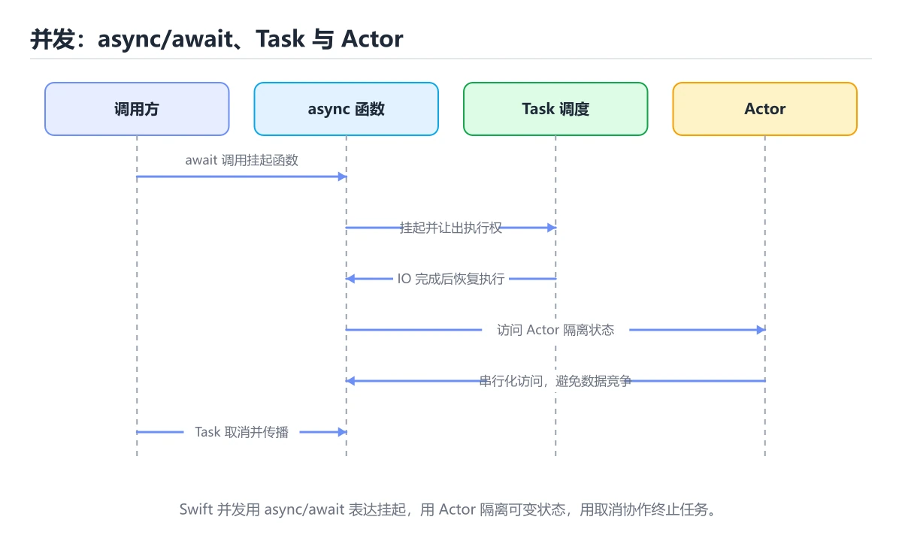
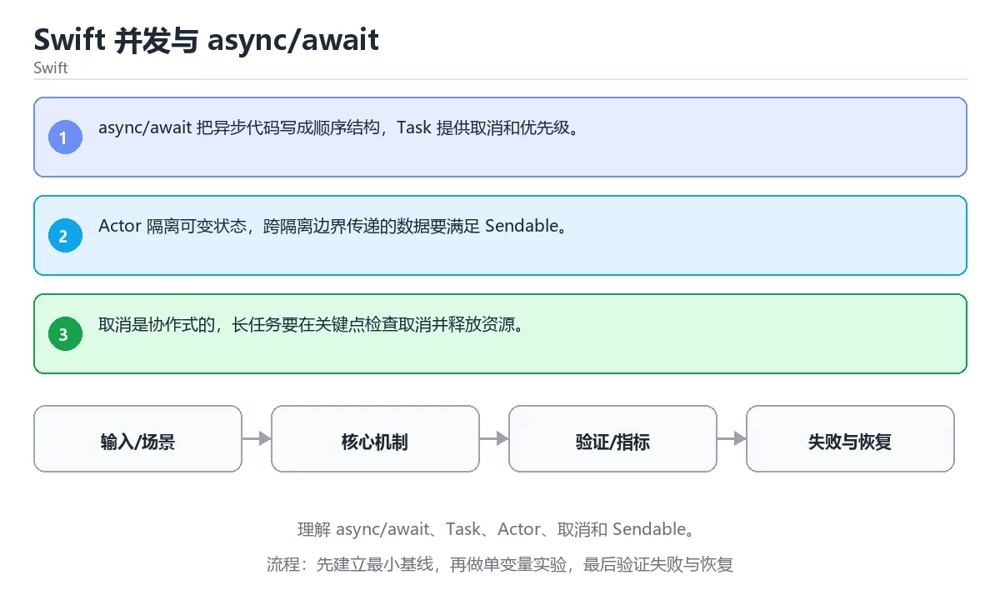

# 本课主题

> 内容更新时间：2026-10-03





## 学习目标

- 能用自己的话解释：async/await 把异步代码写成顺序结构，Task 提供取消和优先级。
- 能用自己的话解释：Actor 隔离可变状态，跨隔离边界传递的数据要满足 Sendable。
- 能用自己的话解释：取消是协作式的，长任务要在关键点检查取消并释放资源。
- 能把本课知识放回「Swift」，并完成练习与测验。

## 前置知识

- 已完成「Swift」的基础课程，能运行正文中的最小示例。
- 本课关键词：async、Actor、Task、Sendable。
- 遇到不熟悉的术语先记录问题，完成练习后再回读。

## 核心知识

### 1. async/await 把异步代码写成顺序结构，Task 提供取消和优先级。

- 关键做法：先用最小示例建立基线，再逐步加入边界、失败和性能条件。
- 验证标准：结果可复现、错误可解释、边界有测试、失败能恢复。

### 2. Actor 隔离可变状态，跨隔离边界传递的数据要满足 Sendable。

### 3. 取消是协作式的，长任务要在关键点检查取消并释放资源。

## 关键流程

```text
输入 → 校验 → 核心处理 → 验证 → 记录指标 → 失败恢复
```

## 实践路径

1. 用一句话复述本课要解决的问题。
2. 跑通正文中的最小示例并记录基线。
3. 只改变一个输入或参数，预测并验证结果。
4. 补一个失败路径，记录错误、恢复和指标。
5. 把结论写成可复现的笔记或测试。

## 常见误区

| 误区 | 后果 | 修正 |
| --- | --- | --- |
| 只记术语不做实验 | 遇到真实问题无法判断 | 用最小输入跑通并记录结果 |
| 只测正常路径 | 边界和故障上线才暴露 | 补空值、极值和依赖失败 |
| 没有基线就优化 | 无法证明改进有效 | 先测量再修改 |
| 忽略成本与安全 | 性能和风险失控 | 同时记录资源、权限与失败代价 |

## 动手练习

1. 合上教程，用 3～5 句话解释本课主题。
2. 从正文选一个例子，改变一个条件并预测结果。
3. 设计一个失败场景，写出止损与恢复步骤。

**验收标准**：留下输入、命令、输出、差异和下一步问题。

## 本课小结

- 本课属于「Swift」，核心关键词是 async、Actor、Task、Sendable。
- 先保证正确与可复现，再讨论性能和扩展。
- 完成练习和测验后，把仍然不确定的问题写成下一轮验证清单。

> 本课由 P1 内容扩展生成，重点补充原有课程缺失的主题与工程边界。

## 语言专项实践：本课主题

### 一、工具链

| 阶段 | 推荐工具 | 验收标准 |
| --- | --- | --- |
| 编译构建 | swiftc / xcodebuild | 命令可复现且错误能被定位 |
| 测试 | XCTest + async 测试 | 命令可复现且错误能被定位 |
| 性能 | Instruments / signpost | 命令可复现且错误能被定位 |
| 发布 | TestFlight + App Store 审核 | 命令可复现且错误能被定位 |

### 二、运行时与内存模型

围绕「async、Actor、Task、Sendable」说明变量生命周期、资源释放、并发模型和错误传播。语言语法只是入口，真正决定行为的是运行时、标准库和平台约束。

### 三、测试策略

- 单元测试覆盖核心规则和边界。
- 集成测试覆盖文件、网络、数据库或平台 API。
- 失败测试覆盖超时、取消、异常和资源耗尽。
- 性能测试记录基线，避免只凭感觉优化。

### 四、发布检查

- [ ] 版本和依赖锁定，构建可复现。
- [ ] 产物经过签名、校验和最小权限配置。
- [ ] 日志不泄露密钥和个人信息。
- [ ] 有升级、回滚和故障恢复说明。

## 实践任务

本节围绕本课主题安排 3 个可交付任务，每个任务都要求留下可以复查的记录。

### 任务 1：用自己的话画出结构

### 任务 2：做一次对比实验

**验收标准**：表格里两个方案的结论不能完全一样；写下“在什么条件下应该换方案”。

### 任务 3：迁移到自己的场景

**验收标准**：至少有一个可复现的命令、代码片段或数据样例；结论能被别人独立检查。

## 故障现场

### 现场 1：本课的 async 常规用例通过，但边界用例失败

**症状**：在本课的练习或生产场景里出现“本课的 async 常规用例通过，但边界用例失败”。

**复现**：准备一组最小输入，只保留触发“本课的 async 常规用例通过，但边界用例失败”的必要条件，连续运行两次确认结果稳定。

**定位**：围绕“async 的前置条件与取值边界没有写进代码，默认值掩盖了空值和极值”检查调用链、输入数据和环境配置，先验证假设再改代码。

**预防**：把“本课的 async 常规用例通过，但边界用例失败”写成一条自动化用例，并在本课的验收清单里保留对应检查项。

### 现场 2：本课的 Actor 结果在两次运行之间不一致

**症状**：在本课的练习或生产场景里出现“本课的 Actor 结果在两次运行之间不一致”。

**复现**：准备一组最小输入，只保留触发“本课的 Actor 结果在两次运行之间不一致”的必要条件，连续运行两次确认结果稳定。

**定位**：围绕“Actor 依赖了当前版本、执行顺序或共享状态，单次运行无法暴露差异”检查调用链、输入数据和环境配置，先验证假设再改代码。

**预防**：把“本课的 Actor 结果在两次运行之间不一致”写成一条自动化用例，并在本课的验收清单里保留对应检查项。

### 现场 3：本课的验证只在开发机通过

**症状**：在本课的练习或生产场景里出现“本课的验证只在开发机通过”。

**定位**：围绕“环境版本、配置和输入规模与目标环境不同，async 缺少可重复的验证记录”检查调用链、输入数据和环境配置，先验证假设再改代码。

## 版本与时效

- Swift 6.x 默认开启更严格的数据竞争检查，迁移成本主要在并发边界
- 升级前先用 Swift 6 语言模式编译，再逐模块处理 Sendable 与 actor 隔离
- SwiftUI 与 Swift Testing 是当前迭代最快的两块
- 官方发布说明：https://www.swift.org/blog/

### 升级检查清单

- 先固定当前版本，跑通全部示例与测验，再升级工具链。
- 只改一个版本变量，记录编译、测试、性能与产物体积的变化。
- 重点回归默认值、弃用警告、序列化格式、并发语义和错误信息。
- 升级完成后更新本课的“最后复核 / 下次复核”日期与版本说明。

## 本课复习清单

离开本课前，逐项确认：

- [ ] 不看解析，能说出「关于「async/await 把异步代码写…」，下列说法正确的是？」的判断依据。
- [ ] 不看解析，能说出「关于「Actor 隔离可变状态 跨隔离边界…」，下列说法正确的是？」的判断依据。
- [ ] 不看解析，能说出「关于「取消是协作式的 长任务要在关键点检查…」，下列说法正确的是？」的判断依据。
- [ ] 不看解析，能说出「本课的核心学习目标是什么？」的判断依据。
- [ ] 不看解析，能说出「补全代码：本课主题示例中，下面这行代码缺少…」的判断依据。
- [ ] 至少运行一次本课示例，记录输入、输出和一个边界情况。
- [ ] 把本课最容易混淆的两个概念写成一句话对照。

| 复盘项 | 记录 |
| --- | --- |
| 已经能独立解释的考点 |  |
| 仍然说不清的概念 |  |
| 下一步验证动作 |  |

## 术语速查

| 术语 | 本课语境 |
| --- | --- |
| `，判断时要把题干限定的输入、边界与目标逐项对齐。本课示例中还能看到` | 判断依据**：正确答案是「main」，这道题在问补全代码：Swift并发与async/await示例…ticfunc____()async{`，判断时要把题干限定的输入、边界与目标逐项对齐。本课示例中还能看到 `@mai… |
| `async` | 本课围绕该主题展开，结合正文与代码示例理解它的适用边界。 |
| `Actor` | 本课围绕该主题展开，结合正文与代码示例理解它的适用边界。 |
| `Task` | 本课围绕该主题展开，结合正文与代码示例理解它的适用边界。 |
| `Sendable` | 本课围绕该主题展开，结合正文与代码示例理解它的适用边界。 |

## 考点精讲

### 考点 1：关于「async/await 把异步代码写…」，下列说法正确的是？

- **判断依据**：正确答案是「async/await 把异步代码写成顺序结构，Task 提供取消和优先级」。正确答案是async/await 把异步代码写成顺序结构，Task 提供取消和优先级。判断这类题时，要把「async/await 把异步代码写成顺序结构，Task 提供取消和优先…」放回题干限定的对象、输入和边界，「Optional 表示可能有值也可能为 nil，要用 i…」、「参数标签让调用点更可读，闭包捕获外部变量并延长其生命周期…」 等说法虽然包含相关术语，但范围或前提与本题不一致。

### 考点 2：围绕“Swift 并发与 async/await”中的 async、Actor、Task，下列哪两项是本课强调的实践判断？

- **判断依据**：正确答案包括「验证 Actor 时要固定版本并覆盖边界输入，结论才可复现」、「学习 async 时要同时说明输入、输出和失败路径，不能只看正常流程」。本题应选验证 Actor 时要固定版本并覆盖边界输入。本课把本课主题拆成概念、示例与故障现场三部分，因此判断 async 时必须同时交代输入、输出和失败路径，这使“学习 async 时要同时说明输入、输出和失败路径，不能只看正常流程”成立。在本课主题里，判断 Actor 时要固定版本与边界输入，所以“验证 Actor 时要固定版本并覆盖边界输入，结论才可复现”才可复现。

### 考点 3：关于「取消是协作式的 长任务要在关键点检查…」，下列说法正确的是？

- **判断依据**：符合题干条件的是「取消是协作式的，长任务要在关键点检查取消并释放资源」。符合题干条件的是取消是协作式的，长任务要在关键点检查取消并释放资源。正确答案是取消是协作式的，长任务要在关键点检查取消并释放资源。如果只凭关键词作答，很容易把throws、Result 和 do-catch 让可恢…、协议定义能力，协议扩展提供默认实现，但默认实现不会自动获…与取消是协作式的，长任务要在关键点检查取消并释放资源。

### 考点 4：「Swift 并发与 async/await」的核心学习目标是什么？

- **判断依据**：结论应落在理解 async/await。这道题要求区分概念与边界，理解 async/await，Task，Actor只有在题干给出的前提下才成立，而掌握 let/var、可选绑定、值类型和错误处理。理解参数标签、闭包捕获、逃逸闭包和协议扩展。

### 考点 5：补全代码：「Swift 并发与 async/await」示例中，下面这行代码缺少哪个关键字或函数名？请填入 ____。

`static func ____() async {`

- **判断依据**：结合async、Actor来看，判断这类题时，要把「main」放回题干限定的对象、输入和边界， 等说法虽然包含相关术语，但范围或前提与本题不一致。围绕 补全代码：本课主题示例中，下面… 作答时，先用async建立输入与输出的基线，再把main代入边界条件核对，结论才能复现。

### 考点 6：阅读「Swift 并发与 async/await」的代码片段，下面哪项判断是正确的？

- **判断依据**：本题应选「async/await 把异步代码写成顺序结构，Task 提供取消和优先级」。本题应选async/await 把异步代码写成顺序结构，Task 提供取消和优先级。正确答案是async/await 把异步代码写成顺序结构，Task 提供取消和优先级。

## English Overview

**Title:** Swift Concurrency and async/await

**Summary:** Learn async/await, Task, Actor, cancellation and Sendable.

**Category:** Swift
**Level:** 高级
**Key terms:** async, Actor, Task, Sendable

## 内容元数据

- 内容版本：v2.0
- 最后更新：2026-10-03
- 学习阶段：高级
- 适用环境：Swift 6 / Xcode 16+
- 内容来源：内置结构化课程与工程实践整理
- 相关主题：async、Actor、Task、Sendable
- 质量版本：P0 测验标准 + P1 覆盖扩展 + P2 体验补全

## 最小可运行示例

下面示例用于验证本课的最小输入、处理和输出。先原样运行，再只修改一个值：

```swift
func fetchValue() async -> Int { 42 }

@main
struct App {
    static func main() async {
        print("answer=\(await fetchValue())")
    }
}
```

## 预期输出

```text
answer=42
```

## 验证步骤

1. 记录运行环境、命令和真实输出。
2. 修改一个输入，先写预测再运行。
3. 制造一次错误输入，记录错误信息与修复方式。
4. 把结论写回本课笔记或测试用例。

## Full English Study Guide

### Overview

**Swift Concurrency and async/await** focuses on Learn async/await, Task, Actor, cancellation and Sendable.

### Learning Outcomes

- Explain what **Swift Concurrency and async/await** solves and when it should be used.

### Core Mental Model

### Step-by-step Study Plan

### Practice Tasks

### Common Failure Modes

### Self-check Questions

4. What is the rollback path?

### Glossary

- Topic: **Swift Concurrency and async/await**
- Related terms: async, Actor, Task, Sendable

## Bilingual Section Outline

| 中文小节 | English section |
| --- | --- |
| 学习目标 | Learning Objectives |
| 前置知识 | Pre-knowledge |
| 核心知识 | Core knowledge |
| 关键流程 | Key Processes |
| 实践路径 | Practice Path |
| 常见误区 | Common Misconceptions |
| 动手练习 | Hands on exercise: |
| 本课小结 | Lesson Summary |
| 语言专项实践：本课主题 | Language-specific practices: Swift concurrency with async/await |
| 最小可运行示例 | Minimal Runnable Examples |


## 参考资料与复核

- 最后复核：2026-10-04
- 下次复核：2027-04-04
- 复核范围：版本兼容、API 行为、安全建议与工程实践
- 来源性质：官方文档、标准或权威教材；正文为离线教学重组

| 参考资料 | 本课用途 |
| --- | --- |
| [Swift 并发](https://docs.swift.org/swift-book/documentation/the-swift-programming-language/concurrency/) | async/await 与 actor |
| [Apple 人机界面指南](https://developer.apple.com/design/human-interface-guidelines/) | iOS 设计规范与可访问性 |
| [Swift 官方文档](https://www.swift.org/documentation/) | 工具链、包管理与语言演进 |

> 「Swift 并发与 async/await」的链接用于离线阅读后的延伸核对；App 不会自动联网。

## 复习与迁移

- 围绕「关于「async/await 把异步代码写…」，下列说法正确的是？」做迁移时，先记录输入、边界和预期，再观察async对结果的影响，并用「async/await 把异步代码写成顺序结构，Task 提供取消和优先级。」解释正常与失败路径。
- 把Actor放进最小实验：固定版本和输入，只改变一个条件，记录输出差异，并说明「验证 Actor 时要固定版本并覆盖边界输入，结论才可复现；学习 async 时要同…」在什么前提下成立。
- 复习「关于「取消是协作式的 长任务要在关键点检查…」，下列说法正确的是？」时，不要只背结论；用Task的边界值复现一次，再把现象、原因和修复写成三步记录。
- 如果把Sendable换成空值、极值或并发输入，「理解 async/await，Task，Actor」是否仍然成立？写出验证命令和观察到的结果。
- 围绕「补全代码：本课主题示例中，下面这行代码缺少哪个关键字或函数名？请填入 ____。

`stati…」做迁移时，先记录输入、边界和预期，再观察async对结果的影响，并用「main」解释正常与失败路径。
- 把Actor放进最小实验：固定版本和输入，只改变一个条件，记录输出差异，并说明「async/await 把异步代码写成顺序结构，Task 提供取消和优先级。」在什么前提下成立。
- 复习「关于「async/await 把异步代码写…」，下列说法正确的是？」时，不要只背结论；用Task的边界值复现一次，再把现象、原因和修复写成三步记录。
- 如果把Sendable换成空值、极值或并发输入，「验证 Actor 时要固定版本并覆盖边界输入，结论才可复现；学习 async 时要同…」是否仍然成立？写出验证命令和观察到的结果。
- 围绕「关于「取消是协作式的 长任务要在关键点检查…」，下列说法正确的是？」做迁移时，先记录输入、边界和预期，再观察async对结果的影响，并用「取消是协作式的，长任务要在关键点检查取消并释放资源。」解释正常与失败路径。

<!-- p0p1-review:start -->
## 复习与迁移

- 围绕「关于「async/await 把异步代码写…」，下列说法正确的是？」做迁移时，先记录输入、边界和预期，再观察async对结果的影响，并用「async/await 把异步代码写成顺序结构，Task 提供取消和优先级。」解释正常与失败路径。
- 把Actor放进最小实验：固定版本和输入，只改变一个条件，记录输出差异，并说明「验证 Actor 时要固定版本并覆盖边界输入，结论才可复现；学习 async 时要同…」在什么前提下成立。
- 复习「关于「取消是协作式的 长任务要在关键点检查…」，下列说法正确的是？」时，不要只背结论；用Task的边界值复现一次，再把现象、原因和修复写成三步记录。
- 如果把Sendable换成空值、极值或并发输入，「理解 async/await，Task，Actor」是否仍然成立？写出验证命令和观察到的结果。
- 围绕「补全代码：本课主题示例中，下面这行代码缺少哪个关键字或函数名？请填入 ____。

`stati…」做迁移时，先记录输入、边界和预期，再观察async对结果的影响，并用「main」解释正常与失败路径。
- 把Actor放进最小实验：固定版本和输入，只改变一个条件，记录输出差异，并说明「async/await 把异步代码写成顺序结构，Task 提供取消和优先级。」在什么前提下成立。
- 复习「关于「async/await 把异步代码写…」，下列说法正确的是？」时，不要只背结论；用Task的边界值复现一次，再把现象、原因和修复写成三步记录。
- 如果把Sendable换成空值、极值或并发输入，「验证 Actor 时要固定版本并覆盖边界输入，结论才可复现；学习 async 时要同…」是否仍然成立？写出验证命令和观察到的结果。
- 围绕「关于「取消是协作式的 长任务要在关键点检查…」，下列说法正确的是？」做迁移时，先记录输入、边界和预期，再观察async对结果的影响，并用「取消是协作式的，长任务要在关键点检查取消并释放资源。」解释正常与失败路径。
- 把Actor放进最小实验：固定版本和输入，只改变一个条件，记录输出差异，并说明「理解 async/await，Task，Actor」在什么前提下成立。
- 复习「补全代码：本课主题示例中，下面这行代码缺少哪个关键字或函数名？请填入 ____。

`stati…」时，不要只背结论；用Task的边界值复现一次，再把现象、原因和修复写成三步记录。
- 如果把Sendable换成空值、极值或并发输入，「async/await 把异步代码写成顺序结构，Task 提供取消和优先级。」是否仍然成立？写出验证命令和观察到的结果。
- 围绕「关于「async/await 把异步代码写…」，下列说法正确的是？」做迁移时，先记录输入、边界和预期，再观察async对结果的影响，并用「async/await 把异步代码写成顺序结构，Task 提供取消和优先级。」解释正常与失败路径。
- 把Actor放进最小实验：固定版本和输入，只改变一个条件，记录输出差异，并说明「验证 Actor 时要固定版本并覆盖边界输入，结论才可复现；学习 async 时要同…」在什么前提下成立。
- 复习「关于「取消是协作式的 长任务要在关键点检查…」，下列说法正确的是？」时，不要只背结论；用Task的边界值复现一次，再把现象、原因和修复写成三步记录。
- 如果把Sendable换成空值、极值或并发输入，「理解 async/await，Task，Actor」是否仍然成立？写出验证命令和观察到的结果。
- 围绕「补全代码：本课主题示例中，下面这行代码缺少哪个关键字或函数名？请填入 ____。

`stati…」做迁移时，先记录输入、边界和预期，再观察async对结果的影响，并用「main」解释正常与失败路径。
- 把Actor放进最小实验：固定版本和输入，只改变一个条件，记录输出差异，并说明「async/await 把异步代码写成顺序结构，Task 提供取消和优先级。」在什么前提下成立。
- 复习「关于「async/await 把异步代码写…」，下列说法正确的是？」时，不要只背结论；用Task的边界值复现一次，再把现象、原因和修复写成三步记录。
<!-- p0p1-review:end -->
