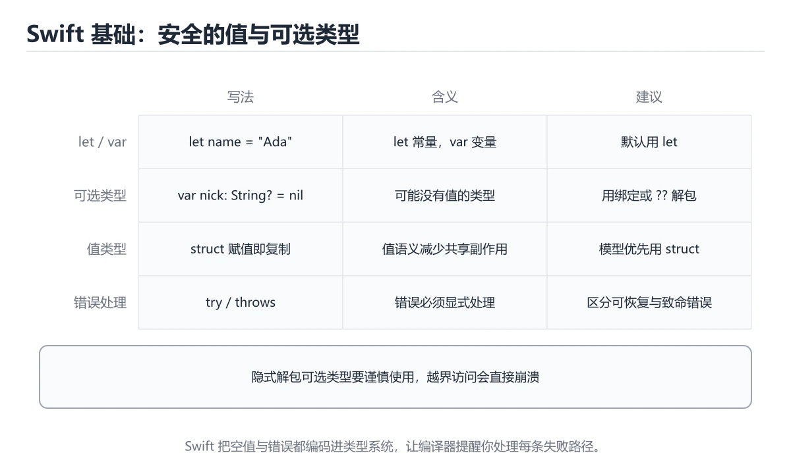
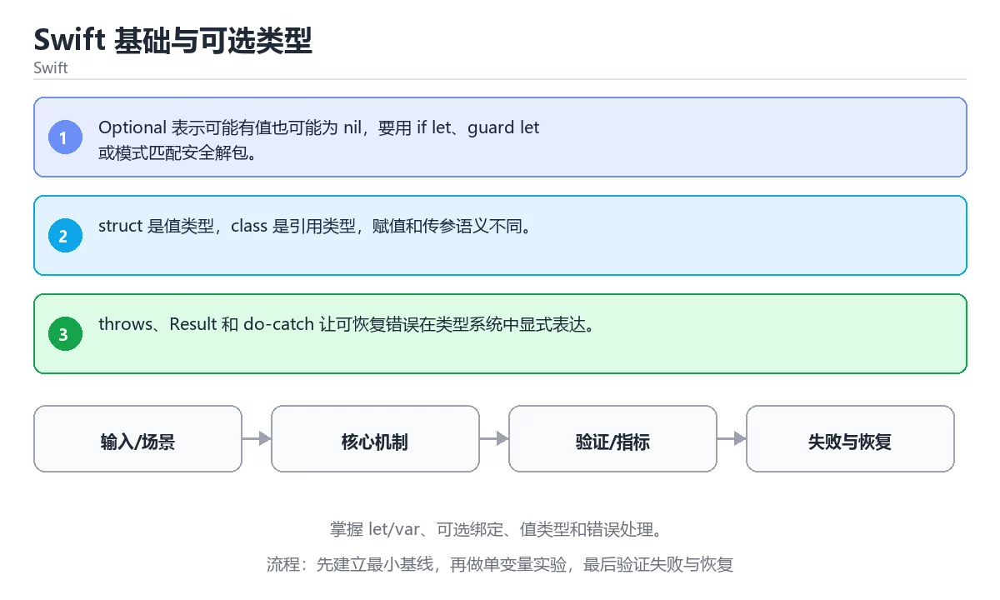

# Swift 基础与可选类型





> 内容更新时间：2026-10-06 · 学习阶段：基础 · 预计用时：35 分钟

## 学习目标

- 能用自己的话解释：Optional 表示可能有值也可能为 nil，要用 if let、guard let 或模式匹配安全解包。
- 能用自己的话解释：struct 是值类型，class 是引用类型，赋值和传参语义不同。
- 能用自己的话解释：throws、Result 和 do-catch 让可恢复错误在类型系统中显式表达。
- 能把本课知识放回「Swift」，并完成练习与测验。

## 前置知识

- 已完成「Swift」的基础课程，能运行正文中的最小示例。
- 本课关键词：Swift、Optional、值类型、错误处理。
- 遇到不熟悉的术语先记录问题，完成练习后再回读。

## 核心知识

### 1. Optional 表示可能有值也可能为 nil，要用 if let、guard let 或模式匹配安全解包。

- 关键做法：先用最小示例建立基线，再逐步加入边界、失败和性能条件。
- 验证标准：结果可复现、错误可解释、边界有测试、失败能恢复。

### 2. struct 是值类型，class 是引用类型，赋值和传参语义不同。

把这条结论放回「Swift 基础与可选类型」的完整流程里展开：

- 正文依据：能用自己的话解释：Optional 表示可能有值也可能为 nil，要用 if let、guard let 或模式匹配安全解包。
- 落地检查：把「2. struct 是值类型，class 是引用类型，赋值和传参语义不同。」改写成一条可执行的核对项，逐条验证输入、超时与失败路径。

### 3. throws、Result 和 do-catch 让可恢复错误在类型系统中显式表达。

把这条结论放回「Swift 基础与可选类型」的完整流程里展开：

- 正文依据：能用自己的话解释：struct 是值类型，class 是引用类型，赋值和传参语义不同。
- 落地检查：把「3. throws、Result 和 do-catch 让可恢复错误在类型系统中显式表达。」改写成一条可执行的核对项，逐条验证输入、超时与失败路径。

## 关键流程

```text
输入 → 校验 → 核心处理 → 验证 → 记录指标 → 失败恢复
```

## 实践路径

1. 用一句话复述本课要解决的问题。
2. 跑通正文中的最小示例并记录基线。
3. 只改变一个输入或参数，预测并验证结果。
4. 补一个失败路径，记录错误、恢复和指标。
5. 把结论写成可复现的笔记或测试。

## 常见误区

| 误区 | 后果 | 修正 |
| --- | --- | --- |
| 只记术语不做实验 | 遇到真实问题无法判断 | 用最小输入跑通并记录结果 |
| 只测正常路径 | 边界和故障上线才暴露 | 补空值、极值和依赖失败 |
| 没有基线就优化 | 无法证明改进有效 | 先测量再修改 |
| 忽略成本与安全 | 性能和风险失控 | 同时记录资源、权限与失败代价 |

## 动手练习

1. 合上教程，用 3～5 句话解释Swift 基础与可选类型。
2. 从正文选一个例子，改变一个条件并预测结果。
3. 设计一个失败场景，写出止损与恢复步骤。

**验收标准**：留下输入、命令、输出、差异和下一步问题。

## 本课小结

- 本课属于「Swift」，核心关键词是 Swift、Optional、值类型、错误处理。
- 先保证正确与可复现，再讨论性能和扩展。
- 完成练习和测验后，把仍然不确定的问题写成下一轮验证清单。

> 本课由 P1 内容扩展生成，重点补充原有课程缺失的主题与工程边界。

## 语言专项实践：Swift 基础与可选类型

### 一、工具链

| 阶段 | 推荐工具 | 验收标准 |
| --- | --- | --- |
| 编译构建 | swiftc / xcodebuild | 命令可复现且错误能被定位 |
| 测试 | XCTest + async 测试 | 命令可复现且错误能被定位 |
| 性能 | Instruments / signpost | 命令可复现且错误能被定位 |
| 发布 | TestFlight + App Store 审核 | 命令可复现且错误能被定位 |

### 二、运行时与内存模型

围绕「Swift、Optional、值类型、错误处理」说明变量生命周期、资源释放、并发模型和错误传播。语言语法只是入口，真正决定行为的是运行时、标准库和平台约束。

### 三、测试策略

- 单元测试覆盖核心规则和边界。
- 集成测试覆盖文件、网络、数据库或平台 API。
- 失败测试覆盖超时、取消、异常和资源耗尽。
- 性能测试记录基线，避免只凭感觉优化。

### 四、发布检查

- [ ] 版本和依赖锁定，构建可复现。
- [ ] 产物经过签名、校验和最小权限配置。
- [ ] 日志不泄露密钥和个人信息。
- [ ] 有升级、回滚和故障恢复说明。

## 实践任务

本节围绕Swift 基础与可选类型安排 3 个可交付任务，每个任务都要求留下可以复查的记录。

### 任务 1：用自己的话画出结构

不看书，用一张图说清「Swift 基础与可选类型」的结构，画完再对照骨架：

- 主干：核心知识 → 关键流程 → 实践路径 → 常见误区
- 连接线：在每条边上标出输入、输出与失败路径。
- 自检：能否用一句话说明Swift与Optional的关系？

### 任务 2：做一次对比实验

**验收标准**：表格里两个方案的结论不能完全一样；写下“在什么条件下应该换方案”。

### 任务 3：迁移到自己的场景

**验收标准**：至少有一个可复现的命令、代码片段或数据样例；结论能被别人独立检查。

## 故障现场

### 现场 1：本课的 Swift 常规用例通过，但边界用例失败

**症状**：在本课的练习或生产场景里出现“本课的 Swift 常规用例通过，但边界用例失败”。

**复现**：准备一组最小输入，只保留触发“本课的 Swift 常规用例通过，但边界用例失败”的必要条件，连续运行两次确认结果稳定。

**定位**：围绕“Swift 的前置条件与取值边界没有写进代码，默认值掩盖了空值和极值”检查调用链、输入数据和环境配置，先验证假设再改代码。

**预防**：把“本课的 Swift 常规用例通过，但边界用例失败”写成一条自动化用例，并在本课的验收清单里保留对应检查项。

### 现场 2：本课的 Optional 结果在两次运行之间不一致

**症状**：在本课的练习或生产场景里出现“本课的 Optional 结果在两次运行之间不一致”。

**复现**：准备一组最小输入，只保留触发“本课的 Optional 结果在两次运行之间不一致”的必要条件，连续运行两次确认结果稳定。

**定位**：围绕“Optional 依赖了当前版本、执行顺序或共享状态，单次运行无法暴露差异”检查调用链、输入数据和环境配置，先验证假设再改代码。

**预防**：把“本课的 Optional 结果在两次运行之间不一致”写成一条自动化用例，并在本课的验收清单里保留对应检查项。

### 现场 3：本课的验证只在开发机通过

**症状**：在本课的练习或生产场景里出现“本课的验证只在开发机通过”。

**定位**：围绕“环境版本、配置和输入规模与目标环境不同，Swift 缺少可重复的验证记录”检查调用链、输入数据和环境配置，先验证假设再改代码。

## 版本与时效

- Swift 6.x 默认开启更严格的数据竞争检查，迁移成本主要在并发边界
- 升级前先用 Swift 6 语言模式编译，再逐模块处理 Sendable 与 actor 隔离
- SwiftUI 与 Swift Testing 是当前迭代最快的两块
- 官方发布说明：https://www.swift.org/blog/

### 升级检查清单

- 先固定当前版本，跑通全部示例与测验，再升级工具链。
- 只改一个版本变量，记录编译、测试、性能与产物体积的变化。
- 重点回归默认值、弃用警告、序列化格式、并发语义和错误信息。
- 升级完成后更新本课的“最后复核 / 下次复核”日期与版本说明。

## 本课复习清单

离开本课前，逐项确认：

- [ ] 不看解析，能说出「关于，下列说法正确的是？」的判断依据。
- [ ] 不看解析，能说出「本课的核心学习目标是什么？」的判断依据。
- [ ] 至少运行一次本课示例，记录输入、输出和一个边界情况。
- [ ] 把本课最容易混淆的两个概念写成一句话对照。

| 复盘项 | 记录 |
| --- | --- |
| 已经能独立解释的考点 |  |
| 仍然说不清的概念 |  |
| 下一步验证动作 |  |

## 术语速查

| 术语 | 本课语境 |
| --- | --- |
| `Swift` | Swift Basics and Optionals focuses on Learn let/var, optional binding, value types and error handling.。 |
| `Optional` | Swift Basics and Optionals focuses on Learn let/var, optional binding, value types and error handling.。 |
| `值类型` | 「Swift、Optional、值类型、错误处理」说明变量生命周期、资源释放、并发模型和错误传播。 |
| `错误处理` | 「Swift、Optional、值类型、错误处理」说明变量生命周期、资源释放、并发模型和错误传播。 |

## 考点精讲

### 考点 1：概念判断·Swift

- **题目**：关于「Optional 表示可能有值也可能为 nil，要用 if let」，下列说法正确的是？
- **判断依据**：在「Swift 基础与可选类型」里，Optional 表示可能有值也可能为 nil，要用 if let。「Swift 基础与可选类型」要求先交代Swift、Optional、值类型的前提再下结论，所以“Optional 表示可能有值也可能为”只在题干“Optional 表示可能有值也可能为 nil”给定的条件下成立。

### 考点 2：代码补全·Swift

- **题目**：下面这段 Swift 代码摘自「Swift 基础与可选类型」的正文示例。关于这段代码，下面哪一项说法与实际内容相符？
- **判断依据**：在「Swift 基础与可选类型」里，这段代码会产生可观察的输出，运行后能看到结果。这段代码出自「Swift 基础与可选类型」的正文示例，围绕Swift、Optional、值类型展开；把输入或边界换成空值、极值或失败情况后，结论要以「Swift 基础与可选类型」的实际运行结果为准。

### 考点 3：概念判断·throws

- **题目**：关于「throws」，下列说法正确的是？
- **判断依据**：在「Swift 基础与可选类型」里，throws。这道题的关键在「Swift 基础与可选类型」的Swift、Optional、值类型：先确认题干“关于throws”问的是哪一步，再排除偷换前提的选项。把“throws”代回「Swift 基础与可选类型」里“throws”的例子核对，条件一旦改变，结论就要用Swift、Optional、值类型重新推导。

### 考点 4：概念判断·Swift

- **题目**：「Swift 基础与可选类型」的核心学习目标是什么？
- **判断依据**：在「Swift 基础与可选类型」里，结论应落在「掌握 let/var、可选绑定、值类型和错误处理」。在「Swift 基础与可选类型」里，结论应落在掌握 let/var、可选绑定、值类型和错误处理。在「Swift 基础与可选类型」里，这道题要求区分概念与边界，掌握 let/var、可选绑定、值类型和错误处理。

### 考点 5：多选辨析·Swift

- **题目**：以下哪些术语与「Swift 基础与可选类型」直接相关？（多选）
- **判断依据**：在「Swift 基础与可选类型」里，Optional。「Swift 基础与可选类型」要求先交代Swift、Optional、值类型的前提再下结论，所以“Swift”只在题干“以下哪些术语与Swift 基础与可选类型直接相关”给定的条件下成立。

### 考点 6：顺序排列·Swift

- **题目**：按照「Swift 基础与可选类型」从概念到实践的讲解顺序排列下列主题。
- **判断依据**：结合Swift、Optional来看，正确的执行顺序是「核心知识 → 关键流程 → 实践路径 → 常见误区」。本课围绕掌握 let/var、可选绑定、值类型和错误处理。在「Swift 基础与可选类型」里判断这道题，要把Swift、Optional、值类型的条件、过程与失败路径逐项对齐，换成“按照Swift 基础与可选类型从概念”这个场景，只有满足前提的结论才成立。

## English Overview

**Title:** Swift Basics and Optionals

**Summary:** Learn let/var, optional binding, value types and error handling.

**Category:** Swift
**Level:** 基础
**Key terms:** Swift, Optional, 值类型, 错误处理

## 内容元数据

- 内容版本：v2.0
- 最后更新：2026-10-06
- 学习阶段：基础
- 适用环境：Swift 6 / Xcode 16+
- 内容来源：内置结构化课程与工程实践整理
- 相关主题：Swift、Optional、值类型、错误处理
- 质量版本：P0 测验标准 + P1 覆盖扩展 + P2 体验补全

## 最小可运行示例

下面示例用于验证本课的最小输入、处理和输出。先原样运行，再只修改一个值：

```swift
let nickname: String? = "ada"
print(nickname?.uppercased() ?? "none")
```

## 预期输出

```text
ADA
```

## 验证步骤

1. 记录运行环境、命令和真实输出。
2. 修改一个输入，先写预测再运行。
3. 制造一次错误输入，记录错误信息与修复方式。
4. 把结论写回本课笔记或测试用例。

## Full English Study Guide

### Overview

**Swift Basics and Optionals** focuses on Learn let/var, optional binding, value types and error handling.

### Learning Outcomes

- Explain what **Swift Basics and Optionals** solves and when it should be used.

### Glossary

- Topic: **Swift Basics and Optionals**
- Related terms: Swift, Optional, 值类型, 错误处理

## Bilingual Section Outline

| 中文小节 | English section |
| --- | --- |
| 学习目标 | Learning objectives |
| 前置知识 | Prerequisites |
| 核心知识 | Core concepts |
| 关键流程 | 关键流程 |
| 实践路径 | 实践路径 |
| 常见误区 | 常见误区 |
| 动手练习 | Hands-on practice |
| 本课小结 | Summary |
| 语言专项实践：Swift 基础与可选类型 | 语言专项实践：Swift 基础与可选Types |
| 最小可运行示例 | 最小可运行示例 |

## 参考资料与复核

- 最后复核：2026-10-04
- 下次复核：2027-04-04
- 复核范围：版本兼容、API 行为、安全建议与工程实践
- 来源性质：官方文档、标准或权威教材；正文为离线教学重组

| 参考资料 | 本课用途 |
| --- | --- |
| [Swift 语言指南](https://docs.swift.org/swift-book/documentation/the-swift-programming-language/) | 语法、类型与内存模型 |
| [Apple 人机界面指南](https://developer.apple.com/design/human-interface-guidelines/) | iOS 设计规范与可访问性 |
| [Apple 内存管理](https://developer.apple.com/documentation/swift/automatic-reference-counting) | ARC 与循环引用 |

> 「Swift 基础与可选类型」的链接用于离线阅读后的延伸核对；App 不会自动联网。

## 复习与迁移

复习目标：把「Swift 基础与可选类型」的判断标准放回可复现的例子里。先自己作答，再对照依据；如果结论正确但理由不完整，回到正文补足前提。

### 概念复述

- 用一句话说明「Swift 基础与可选类型」解决什么问题：掌握 let/var、可选绑定、值类型和错误处理。
- 写出Swift、Optional、值类型之间的关系，并各举一个例子。
- 说出本课最容易混淆的两个概念，以及区分它们的判据。

### 正文逐节复核

- **语言专项实践：Swift 基础与可选类型**：围绕「Swift、Optional、值类型、错误处理」说明变量生命周期、资源释放、并发模型和错误传播。
- **实践任务**：本节围绕Swift 基础与可选类型安排 3 个可交付任务，每个任务都要求留下可以复查的记录。

### 测验回顾

1. 关于「Optional 表示可能有值也可能为 nil，要用 if let」，下列说法正确的是？
   - 依据：在「Swift 基础与可选类型」里，Optional 表示可能有值也可能为 nil，要用 if let。「Swift 基础与可选类型」要求先交代Swift、Optional、值类型的前提再下结论，所以“Optional 表示可能有值也可能为”只在题干“Optional 表示可能有值也可能为 nil”给定的条件下成立。
2. 下面这段 Swift 代码摘自「Swift 基础与可选类型」的正文示例。关于这段代码，下面哪一项说法与实际内容相符？
   - 依据：在「Swift 基础与可选类型」里，这段代码会产生可观察的输出，运行后能看到结果。这段代码出自「Swift 基础与可选类型」的正文示例，围绕Swift、Optional、值类型展开；把输入或边界换成空值、极值或失败情况后，结论要以「Swift 基础与可选类型」的实际运行结果为准。
3. 关于「throws」，下列说法正确的是？
   - 依据：在「Swift 基础与可选类型」里，throws。这道题的关键在「Swift 基础与可选类型」的Swift、Optional、值类型：先确认题干“关于throws”问的是哪一步，再排除偷换前提的选项。把“throws”代回「Swift 基础与可选类型」里“throws”的例子核对，条件一旦改变，结论就要用Swift、Optional、值类型重新推导。
4. 「Swift 基础与可选类型」的核心学习目标是什么？
   - 依据：在「Swift 基础与可选类型」里，结论应落在「掌握 let/var、可选绑定、值类型和错误处理」。在「Swift 基础与可选类型」里，结论应落在掌握 let/var、可选绑定、值类型和错误处理。在「Swift 基础与可选类型」里，这道题要求区分概念与边界，掌握 let/var、可选绑定、值类型和错误处理。
5. 以下哪些术语与「Swift 基础与可选类型」直接相关？（多选）
   - 依据：在「Swift 基础与可选类型」里，Optional。「Swift 基础与可选类型」要求先交代Swift、Optional、值类型的前提再下结论，所以“Swift”只在题干“以下哪些术语与Swift 基础与可选类型直接相关”给定的条件下成立。
6. 按照「Swift 基础与可选类型」从概念到实践的讲解顺序排列下列主题。
   - 依据：结合Swift、Optional来看，正确的执行顺序是「核心知识 → 关键流程 → 实践路径 → 常见误区」。本课围绕掌握 let/var、可选绑定、值类型和错误处理。在「Swift 基础与可选类型」里判断这道题，要把Swift、Optional、值类型的条件、过程与失败路径逐项对齐，换成“按照Swift 基础与可选类型从概念”这个场景，只有满足前提的结论才成立。

### 迁移练习

把「Swift 基础与可选类型」的结论迁移到相邻主题，每次迁移都写清预测与证据：

1. 换输入：用Swift处理一组你自己的数据，对比教材示例的结果差异。
2. 换失败条件：制造一个Optional相关的错误，说明如何从错误信息定位根因。
3. 换规模：把数据量或并发度提高一个数量级，说明「Swift 基础与可选类型」的结论是否仍成立。

## 工程化精练：决策、失败与验证

这一章把「Swift 基础与可选类型」从“看懂”推进到“能判断、能验证、能排错”。所有判断都围绕Swift、Optional与值类型展开，并与前文的示例、测验和失败现场互相对照。

### 一、Swift 的判断算法

| 步骤 | 要回答的问题 | 判断依据 | 记录什么 |
| --- | --- | --- | --- |
| 1. 定目标 | 「Swift 基础与可选类型」这一步要解决什么问题？ | 把Swift的目标写成一句可验证的结论 | 输入、约束、成功标准 |
| 2. 找边界 | Optional在什么条件下失效？ | 先列空值、极值、重复和失败路径 | 反例与触发条件 |
| 3. 跑基线 | 原始示例的真实输出是什么？ | 命令、版本和环境必须可复现 | 命令、输出、耗时 |
| 4. 只改一处 | 把值类型换成另一种取值会怎样？ | 预测写在运行之前 | 预测与实际的差异 |
| 5. 回写结论 | 结论能否被他人复现？ | 把判断写成清单或测试 | 结论、证据、遗留问题 |

这张表的用法不是从上到下浏览，而是每次只填一行：先用「Swift 基础与可选类型」前文的示例验证第 3 行，再故意破坏一个条件验证第 2 行。当你能在不看解析的情况下说出Swift的判断依据，才算真正掌握本课。

- 先从Swift入手：把它写成“输入是什么、输出是什么、哪一步最容易出错”。如果这三句话中有一句说不清，说明对「Swift 基础与可选类型」的理解还停留在术语层面，需要回到正文的最小示例重新观察一次。

- 再把Optional当成对照实验的变量：固定其他条件，只改变它的取值，记录输出是否变化。结论“变”或“不变”都要写出理由，并说明这个理由能否被他人独立复现。

- 针对值类型做一次失败演练：故意给出空值、极值或错误类型，观察「Swift 基础与可选类型」的报错位置和处理方式。错误信息只是入口，真正要定位的是哪一层假设被破坏。

- 把「Swift 基础与可选类型」的结论压缩成一条可执行清单：先检查输入，再检查版本与环境，然后跑最小用例，最后才扩大规模。顺序颠倒会让排错范围成倍增加。

- 如果结论依赖时间或规模，就把数据量提高一个数量级再跑一次。在「Swift 基础与可选类型」里，小样本成立不代表大样本成立，复杂度、资源占用和失败率都要重新记录。

- 如果结论依赖并发或共享状态，就固定输入并连续运行多次。结果不一致时，优先怀疑「Swift 基础与可选类型」中Swift相关步骤的隐藏状态，而不是先改代码。

- 把「Swift 基础与可选类型」的判断写成测试：一个正常用例、一个边界用例、一个失败用例。测试通过只是起点，还要确认失败用例确实以预期方式失败。

- 把本课与相邻主题连起来：Swift解决的是“怎么做”，Optional回答“什么时候不适用”。两者都答得出来，迁移才算完成。

> 第 2 轮复核「Swift 基础与可选类型」：把上面的结论逐条改写为可验证的问题，并记录仍不确定的部分。

- 先从Swift入手：把它写成“输入是什么、输出是什么、哪一步最容易出错”。如果这三句话中有一句说不清，说明对「Swift 基础与可选类型」的理解还停留在术语层面，需要回到正文的最小示例重新观察一次。

- 再把Optional当成对照实验的变量：固定其他条件，只改变它的取值，记录输出是否变化。结论“变”或“不变”都要写出理由，并说明这个理由能否被他人独立复现。

- 针对值类型做一次失败演练：故意给出空值、极值或错误类型，观察「Swift 基础与可选类型」的报错位置和处理方式。错误信息只是入口，真正要定位的是哪一层假设被破坏。

- 把「Swift 基础与可选类型」的结论压缩成一条可执行清单：先检查输入，再检查版本与环境，然后跑最小用例，最后才扩大规模。顺序颠倒会让排错范围成倍增加。

- 如果结论依赖时间或规模，就把数据量提高一个数量级再跑一次。在「Swift 基础与可选类型」里，小样本成立不代表大样本成立，复杂度、资源占用和失败率都要重新记录。

- 如果结论依赖并发或共享状态，就固定输入并连续运行多次。结果不一致时，优先怀疑「Swift 基础与可选类型」中Swift相关步骤的隐藏状态，而不是先改代码。

- 把「Swift 基础与可选类型」的判断写成测试：一个正常用例、一个边界用例、一个失败用例。测试通过只是起点，还要确认失败用例确实以预期方式失败。

- 把本课与相邻主题连起来：Swift解决的是“怎么做”，Optional回答“什么时候不适用”。两者都答得出来，迁移才算完成。

> 第 3 轮复核「Swift 基础与可选类型」：把上面的结论逐条改写为可验证的问题，并记录仍不确定的部分。

- 先从Swift入手：把它写成“输入是什么、输出是什么、哪一步最容易出错”。如果这三句话中有一句说不清，说明对「Swift 基础与可选类型」的理解还停留在术语层面，需要回到正文的最小示例重新观察一次。

- 再把Optional当成对照实验的变量：固定其他条件，只改变它的取值，记录输出是否变化。结论“变”或“不变”都要写出理由，并说明这个理由能否被他人独立复现。

- 针对值类型做一次失败演练：故意给出空值、极值或错误类型，观察「Swift 基础与可选类型」的报错位置和处理方式。错误信息只是入口，真正要定位的是哪一层假设被破坏。

- 把「Swift 基础与可选类型」的结论压缩成一条可执行清单：先检查输入，再检查版本与环境，然后跑最小用例，最后才扩大规模。顺序颠倒会让排错范围成倍增加。

- 如果结论依赖时间或规模，就把数据量提高一个数量级再跑一次。在「Swift 基础与可选类型」里，小样本成立不代表大样本成立，复杂度、资源占用和失败率都要重新记录。

- 如果结论依赖并发或共享状态，就固定输入并连续运行多次。结果不一致时，优先怀疑「Swift 基础与可选类型」中Swift相关步骤的隐藏状态，而不是先改代码。

- 把「Swift 基础与可选类型」的判断写成测试：一个正常用例、一个边界用例、一个失败用例。测试通过只是起点，还要确认失败用例确实以预期方式失败。

- 把本课与相邻主题连起来：Swift解决的是“怎么做”，Optional回答“什么时候不适用”。两者都答得出来，迁移才算完成。

> 第 4 轮复核「Swift 基础与可选类型」：把上面的结论逐条改写为可验证的问题，并记录仍不确定的部分。

- 先从Swift入手：把它写成“输入是什么、输出是什么、哪一步最容易出错”。如果这三句话中有一句说不清，说明对「Swift 基础与可选类型」的理解还停留在术语层面，需要回到正文的最小示例重新观察一次。

- 再把Optional当成对照实验的变量：固定其他条件，只改变它的取值，记录输出是否变化。结论“变”或“不变”都要写出理由，并说明这个理由能否被他人独立复现。

- 针对值类型做一次失败演练：故意给出空值、极值或错误类型，观察「Swift 基础与可选类型」的报错位置和处理方式。错误信息只是入口，真正要定位的是哪一层假设被破坏。

- 把「Swift 基础与可选类型」的结论压缩成一条可执行清单：先检查输入，再检查版本与环境，然后跑最小用例，最后才扩大规模。顺序颠倒会让排错范围成倍增加。

- 如果结论依赖时间或规模，就把数据量提高一个数量级再跑一次。在「Swift 基础与可选类型」里，小样本成立不代表大样本成立，复杂度、资源占用和失败率都要重新记录。

- 如果结论依赖并发或共享状态，就固定输入并连续运行多次。结果不一致时，优先怀疑「Swift 基础与可选类型」中Swift相关步骤的隐藏状态，而不是先改代码。

- 把「Swift 基础与可选类型」的判断写成测试：一个正常用例、一个边界用例、一个失败用例。测试通过只是起点，还要确认失败用例确实以预期方式失败。

- 把本课与相邻主题连起来：Swift解决的是“怎么做”，Optional回答“什么时候不适用”。两者都答得出来，迁移才算完成。

> 第 5 轮复核「Swift 基础与可选类型」：把上面的结论逐条改写为可验证的问题，并记录仍不确定的部分。

- 先从Swift入手：把它写成“输入是什么、输出是什么、哪一步最容易出错”。如果这三句话中有一句说不清，说明对「Swift 基础与可选类型」的理解还停留在术语层面，需要回到正文的最小示例重新观察一次。

- 再把Optional当成对照实验的变量：固定其他条件，只改变它的取值，记录输出是否变化。结论“变”或“不变”都要写出理由，并说明这个理由能否被他人独立复现。

- 针对值类型做一次失败演练：故意给出空值、极值或错误类型，观察「Swift 基础与可选类型」的报错位置和处理方式。错误信息只是入口，真正要定位的是哪一层假设被破坏。

- 把「Swift 基础与可选类型」的结论压缩成一条可执行清单：先检查输入，再检查版本与环境，然后跑最小用例，最后才扩大规模。顺序颠倒会让排错范围成倍增加。

- 如果结论依赖时间或规模，就把数据量提高一个数量级再跑一次。在「Swift 基础与可选类型」里，小样本成立不代表大样本成立，复杂度、资源占用和失败率都要重新记录。

- 如果结论依赖并发或共享状态，就固定输入并连续运行多次。结果不一致时，优先怀疑「Swift 基础与可选类型」中Swift相关步骤的隐藏状态，而不是先改代码。

- 把「Swift 基础与可选类型」的判断写成测试：一个正常用例、一个边界用例、一个失败用例。测试通过只是起点，还要确认失败用例确实以预期方式失败。

### 二、Swift 基础与可选类型 的机制拆解与自测

把本课考点还原成可回答的问题，再逐题写出依据：

**问题 1**：关于「Optional 表示可能有值也可能为 nil，要用 if let」，下列说法正确的是？

- 关联术语：Swift
- 判断依据：Optional 表示可能有值也可能为 nil，要用 if let
- 追问：如果把Swift的条件换成边界值，这个结论是否仍然成立？

**问题 2**：下面这段 Swift 代码摘自「Swift 基础与可选类型」的正文示例。关于这段代码，下面哪一项说法与实际内容相符？

- 关联术语：Optional
- 判断依据：回到「Swift 基础与可选类型」正文对应小节，先用最小示例验证再下结论。
- 追问：如果把Optional的条件换成边界值，这个结论是否仍然成立？

**问题 3**：关于「throws」，下列说法正确的是？

- 关联术语：值类型
- 判断依据：throws
- 追问：如果把值类型的条件换成边界值，这个结论是否仍然成立？

**问题 4**：「Swift 基础与可选类型」的核心学习目标是什么？

- 关联术语：错误处理
- 判断依据：掌握 let/var、可选绑定、值类型和错误处理。
- 追问：如果把错误处理的条件换成边界值，这个结论是否仍然成立？

**问题 5**：以下哪些术语与「Swift 基础与可选类型」直接相关？（多选）

- 关联术语：Swift
- 判断依据：回到「Swift 基础与可选类型」正文对应小节，先用最小示例验证再下结论。
- 追问：如果把Swift的条件换成边界值，这个结论是否仍然成立？

**问题 6**：按照「Swift 基础与可选类型」从概念到实践的讲解顺序排列下列主题。

- 关联术语：Optional
- 判断依据：回到「Swift 基础与可选类型」正文对应小节，先用最小示例验证再下结论。
- 追问：如果把Optional的条件换成边界值，这个结论是否仍然成立？

### 三、失败模式与修复顺序

| 失败信号 | 常见根因 | 先做什么 | 修复后如何确认 |
| --- | --- | --- | --- |
| 「Swift 基础与可选类型」中 Swift 相关步骤报错 | 输入、版本或前置条件与示例不一致 | 保留第一条错误信息，回到最小输入 | 用Optional 表示可能有值也可能为 nil，要用 if let复跑，确认输出可复现 |
| 「Swift 基础与可选类型」中 Optional 相关步骤报错 | 输入、版本或前置条件与示例不一致 | 保留第一条错误信息，回到最小输入 | 用throws复跑，确认输出可复现 |
| 「Swift 基础与可选类型」中 值类型 相关步骤报错 | 输入、版本或前置条件与示例不一致 | 保留第一条错误信息，回到最小输入 | 用掌握 let/var、可选绑定、值类型和错误处理。复跑，确认输出可复现 |
| 结果在两次运行之间不一致 | 隐藏状态、并发或环境差异 | 固定版本与输入，记录随机因素 | 连续运行三次得到同一结论 |
| 单次结果正确但规模一大就失效 | 只测了正常路径，没有覆盖边界 | 把数据量或并发度提高一个数量级 | 记录边界值、耗时与失败率 |

排错顺序固定为：先复现，再缩小输入，然后只改一个条件，最后把结论写成回归用例。对「Swift 基础与可选类型」来说，任何不能复现的“修好了”都不算完成。

### 四、离开本课前的验证清单

| 检查项 | 通过标准 | 证据 |
| --- | --- | --- |
| 能复述 | 用三句话说明「Swift 基础与可选类型」解决什么问题、边界在哪 | 不看解析写出的结论 |
| 能运行 | 最小示例在本机跑通 | 命令、输出与版本 |
| 能改条件 | 只改一个输入并解释差异 | 预测与实际的对照 |
| 能排错 | 至少制造并修复一个失败 | 错误信息与修复步骤 |
| 能迁移 | 把Swift、Optional、值类型、错误处理用到新场景 | 一个自选练习的结论 |

完成标准：能不看解析说清「Swift 基础与可选类型」全部自测题的依据，并且至少有一条Swift相关的结论经过真实运行验证。如果某一步只停留在“感觉懂了”，就把它写成下一轮针对「Swift 基础与可选类型」的最小验证任务。

### 五、把结论写成可检查的证据

学习「Swift 基础与可选类型」时，最容易出现的情况是“听过、看懂了，但换一个输入就说不清”。下面把Swift与Optional放进一条可检查的证据链：每一句结论都要能回答“从哪里来、在什么条件下成立、失败时怎么发现”。

| 证据类型 | 本课要求 | 不合格的表现 |
| --- | --- | --- |
| 概念证据 | 用一句话说明Swift的定义与适用场景 | 只背术语，说不出它解决什么问题 |
| 运行证据 | 能复现「Swift 基础与可选类型」的最小示例 | 输出与记录对不上，或换机器就不一致 |
| 对照证据 | 只改一个条件，说明差异来自哪里 | 一次改多个变量，无法归因 |
| 失败证据 | 故意制造错误并记录恢复步骤 | 只测正常路径，失败时靠猜 |
| 迁移证据 | 把Optional用到自选场景 | 换一个例子就完全套不上 |

举例：Optional 表示可能有值也可能为 nil，要用 if let。把这个结论代回「Swift 基础与可选类型」的正文，找出它对应的输入、处理步骤与输出；再换掉其中一个条件，观察结论是否仍然成立。能完成这一步，才说明这条知识已经从“记忆”变成“可用的判断”。

最后留一个自检问题：如果只能保留三条笔记，你会写下哪三句？把答案限定为「Swift 基础与可选类型」中的可验证结论，并给每条结论配一个反例。这三句加上对应反例，就是本课最值得带入后续课程的复习材料。
