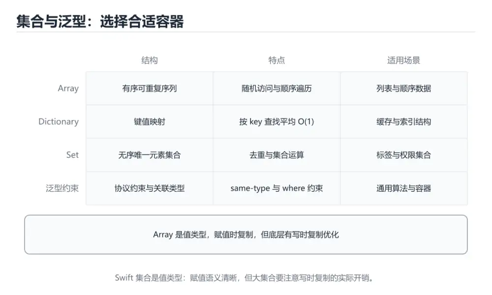

# Swift 集合与泛型




> 内容更新时间：2026-10-06 · 学习阶段：进阶 · 预计用时：35 分钟

## 学习目标

- 能用自己的话解释：Array 有序可重复，Set 去重无序，Dictionary 按键索引且键必须可哈希。
- 能用自己的话解释：泛型让算法与具体类型解耦，where 子句表达类型约束。
- 能用自己的话解释：协议关联类型让协议更灵活，但也会影响存在类型和类型擦除。
- 能把本课知识放回「Swift」，并完成练习与测验。

## 前置知识

- 已完成本分类的基础课程，能独立运行 集合 的最小示例。
- 本课关键词：集合、泛型、约束、关联类型。
- 遇到不熟悉的术语先记录问题，完成练习后再回读。

## 核心知识

### 1. Array 有序可重复，Set 去重无序，Dictionary 按键索引且键必须可哈希。

- 关键做法：基线只保留 泛型 必需的部分，其余条件一次加一个。
- 验证标准：集合 的结果可复现、错误可解释、失败能恢复。

### 2. 泛型让算法与具体类型解耦，where 子句表达类型约束。

把这条结论放回「Swift 集合与泛型」的完整流程里展开：

- 正文依据：能用自己的话解释：泛型让算法与具体类型解耦，where 子句表达类型约束。
- 落地检查：把「2. 泛型让算法与具体类型解耦，where 子句表达类型约束。」改写成一条可执行的核对项，逐条验证输入、超时与失败路径。

### 3. 协议关联类型让协议更灵活，但也会影响存在类型和类型擦除。

把这条结论放回「Swift 集合与泛型」的完整流程里展开：

- 正文依据：能用自己的话解释：协议关联类型让协议更灵活，但也会影响存在类型和类型擦除。
- 落地检查：把「3. 协议关联类型让协议更灵活，但也会影响存在类型和类型擦除。」改写成一条可执行的核对项，逐条验证输入、超时与失败路径。

## 关键流程

```text
输入 → 校验 → 核心处理 → 验证 → 记录指标 → 失败恢复
```

## 实践路径

1. 用一句话复述本课要解决的问题。
2. 跑通正文中的最小示例并记录基线。
3. 只改变一个输入或参数，预测并验证结果。
4. 补一个失败路径，记录错误、恢复和指标。
5. 把结论写成可复现的笔记或测试。

## 常见错误与排查

> 说明：本表由《Swift 集合与泛型》的核心知识整理（2026-10-07），人工复核进度见 docs/content_review_batches.md。

| 易错点 | 容易踩的做法 | 正确结论 |
| --- | --- | --- |
| 遍历时修改集合 | 行为不可预测或直接崩溃 | 先收集改动，遍历结束后统一处理 |
| 高阶函数链过长 | 中间结果多且可读性差 | 适度组合，必要时改回显式循环 |
| 忽视复制语义 | 改了副本却以为原集合变了 | 明确复制时机，需要共享时改用引用类型 |

## 动手练习

1. 合上教程，用 3～5 句话解释Swift 集合与泛型。
2. 从正文选一个例子，改变一个条件并预测结果。
3. 设计一个失败场景，写出止损与恢复步骤。

**验收标准**：留下输入、命令、输出、差异和下一步问题。

## 本课小结

- 本课围绕 集合、泛型、约束、关联类型 展开，复习时重点核对它们的输入、输出和失败路径。
- 做完本课测验后，把答错且解释不清的 泛型 相关题目记成验证任务。


## 语言专项实践：Swift 集合与泛型

### 一、工具链

| 阶段 | 推荐工具 | 验收标准 |
| --- | --- | --- |
| 编译构建 | swiftc / xcodebuild | 命令可复现且错误能被定位 |
| 测试 | XCTest + async 测试 | 命令可复现且错误能被定位 |
| 性能 | Instruments / signpost | 命令可复现且错误能被定位 |
| 发布 | TestFlight + App Store 审核 | 命令可复现且错误能被定位 |

### 二、运行时与内存模型

围绕「集合、泛型、约束、关联类型」说明变量生命周期、资源释放、并发模型和错误传播。语言语法只是入口，真正决定行为的是运行时、标准库和平台约束。

### 三、测试策略

- 单元测试覆盖核心规则和边界。
- 集成测试覆盖文件、网络、数据库或平台 API。
- 失败测试覆盖超时、取消、异常和资源耗尽。
- 性能测试记录基线，避免只凭感觉优化。

### 四、发布检查

- [ ] 版本和依赖锁定，构建可复现。
- [ ] 产物经过签名、校验和最小权限配置。
- [ ] 日志不泄露密钥和个人信息。
- [ ] 有升级、回滚和故障恢复说明。

## 可运行练习

本节围绕Swift 集合与泛型安排 3 个可交付任务，每个任务都要求留下可以复查的记录。

### 任务 1：用自己的话画出结构

不看书，用一张图说清「Swift 集合与泛型」的结构，画完再对照骨架：

- 主干：scores 的原理 → 操作步骤 → 验证方法 → 易错点
- 连接线：在每条边上标出输入、输出与失败路径。
- 自检：能否用一句话说明集合与泛型的关系？

### 任务 2：做一次对比实验

**验收标准**：用 scores 做一次真实对照，结论要说明在「Swift 集合与泛型」的哪个前提下成立。

### 任务 3：迁移到自己的场景

**验收标准**：结论要附带 scores 的可复现记录，并说明 集合 在「核心知识」里的位置。

## 故障现场

### 现场 1：遍历时修改集合

**症状**：在《Swift 集合与泛型》的复现场景中，行为不可预测或直接崩溃。

**根因**：当出现“遍历时修改集合”时，执行路径已经绕过了《Swift 集合与泛型》的关键约束，最终以“行为不可预测或直接崩溃”暴露出来；修复前必须先确认约束在哪里失效。

**修复**：针对《Swift 集合与泛型》的问题，先收集改动，遍历结束后统一处理。

**验证**：在《Swift 集合与泛型》中按“先收集改动，遍历结束后统一处理”调整后，从“遍历时修改集合”的触发条件重放同一条路径，确认“行为不可预测或直接崩溃”不再出现，并补一个相邻边界用例检查没有引入新问题。

### 现场 2：高阶函数链过长

**症状**：在《Swift 集合与泛型》的复现场景中，中间结果多且可读性差。

**根因**：“中间结果多且可读性差”只是表层结果。向上追溯会落到“高阶函数链过长”这一步，因为它省略了《Swift 集合与泛型》的约束，使实现行为和预期模型发生了偏离。

**修复**：针对《Swift 集合与泛型》的问题，适度组合，必要时改回显式循环。

**验证**：先在《Swift 集合与泛型》中记录“高阶函数链过长”留下的失败证据，再执行“适度组合，必要时改回显式循环”并重放；确认错误路径变为明确结果，且修复没有掩盖同类故障。

### 现场 3：忽视复制语义

**症状**：在《Swift 集合与泛型》的复现场景中，改了副本却以为原集合变了。

**根因**：“改了副本却以为原集合变了”只是表层结果。向上追溯会落到“忽视复制语义”这一步，因为它省略了《Swift 集合与泛型》的约束，使实现行为和预期模型发生了偏离。

**修复**：针对《Swift 集合与泛型》的问题，明确复制时机，需要共享时改用引用类型。

**验证**：在《Swift 集合与泛型》中按“明确复制时机，需要共享时改用引用类型”调整后，从“忽视复制语义”的触发条件重放同一条路径，确认“改了副本却以为原集合变了”不再出现，并补一个相邻边界用例检查没有引入新问题。

## 版本与时效

- 迁移成本集中在并发边界，先把 泛型 的共享状态标出来。
- 升级前先用 scores 建立基线：记录版本、命令和输出，升级后只比较这些可观察量。
- scores 的写法在最近几个版本有变化，升级前先跑一遍测试。
- 官方发布说明：https://www.swift.org/blog/

### 升级检查清单

- 先固定当前版本，跑通全部示例与测验，再升级工具链。
- 升级时只动一个依赖版本，用 scores 记录构建与运行结果。
- 回归范围锁定 scores 的默认行为，并确认弃用警告是否出现在构建输出里。
- 升级完成后更新本课「最后复核 / 下次复核」日期，并记录 集合 的版本变化。

## 本课复习清单


离开本课前，逐项确认：

- [ ] 不看解析，能说出「关于「泛型让算法与具体类型解耦，where 子句表达类型约束。」，下列说法正确的是？」的判断依据。
- [ ] 不看解析，能说出「关于「协议关联类型让协议更灵活，但也会影响存在类型和类型擦除。」，下列说法正确的是？」的判断依据。
- [ ] 不看解析，能说出「「Swift 集合与泛型」的核心学习目标是什么？」的判断依据。
- [ ] 至少运行一次《Swift 集合与泛型》的示例，记录输入、输出和一个边界情况。
- [ ] 把本课最容易混淆的两个概念写成一句话对照。

| 复盘项 | 记录 |
| --- | --- |
| 已经能独立解释的考点 |  |
| 仍然说不清的概念 |  |
| 下一步验证动作 |  |

## 复习与自测

对照 核心知识 复述本课结论，答不上来的部分回到 scores 的示例重跑一次。

### 核心知识

自检：这一节与相邻主题的边界在哪里？

### 动手练习

自检：如果去掉这一节里的一个前提，结论会怎样变化？

### 语言专项实践：Swift 集合与泛型

自检：这一节的关键输入与输出分别是什么？

### 最小可运行示例

```swift
let scores = ["a": 90, "b": 72]
let passed = scores.filter { $0.value >= 80 }.keys.sorted()
print(passed)
```

自检：把这一节讲给没学过的人，最需要强调哪一点？

### 预期输出

```text
["a"]
```

### 验证步骤

制造一次错误输入，记录错误信息与修复方式。

## 术语速查

| 术语 | 一句话说明 |
| --- | --- |
| `集合` | 不保证顺序、通常不允许重复元素的数据结构。 |
| `泛型` | 把类型作为参数复用同一套逻辑，同时让编译器保留类型检查。 |
| `约束` | 检查点 1：按Swift 集合与泛型中 集合、泛型、约束 的实践顺序，把四个步骤排成从准备到复盘的合理顺序。 |
| `关联类型` | 二、运行时与内存模型：围绕「集合、泛型、约束、关联类型」说明变量生命周期、资源释放、并发模型和错误传播。 |

## 深度拓展与实战

这一节把「Swift 集合与泛型」正文里的定义、代码和失败模式串成一条可操作的复习路线。

### 机制拆解

- **1. Array 有序可重复，Set 去重无序，Dictionary 按键索引且键必须可哈希。**：在「Swift 集合与泛型」里，「1. Array 有序可重复，Set 去重无序，Dictionary 按键索引且键必须可哈希。」这一步要先写清输入与预期，再记录实际结果和差异；结果不符时回到对应小节核对前提。
- **2. 泛型让算法与具体类型解耦，where 子句表达类型约束。**：在「Swift 集合与泛型」里，「2. 泛型让算法与具体类型解耦，where 子句表达类型约束。」这一步要先写清输入与预期，再记录实际结果和差异；结果不符时回到对应小节核对前提。
- **3. 协议关联类型让协议更灵活，但也会影响存在类型和类型擦除。**：在「Swift 集合与泛型」里，「3. 协议关联类型让协议更灵活，但也会影响存在类型和类型擦除。」这一步要先写清输入与预期，再记录实际结果和差异；结果不符时回到对应小节核对前提。
- 一、工具链：实现 scores 所需的阶段与验收标准
- **二、运行时与内存模型**：围绕「集合、泛型、约束、关联类型」说明变量生命周期、资源释放、并发模型和错误传播

### 边界条件与常见反例

「Swift 集合与泛型」的边界不只包括最大最小值，还要覆盖空、重复和失败：

| 条件 | 常见反例 | 处理方式 |
| --- | --- | --- |
| 空输入 | 集合 没有任何取值 | 先判空，给出明确错误而不是继续执行 |
| 边界值 | 泛型 取最小或最大 | 用最小值、最大值和越界值各跑一次 |
| 重复执行 | 同一输入被执行两次 | 保证结果可重复，必要时加锁或去重 |
| 失败路径 | 集合 相关步骤报错 | 保留原始错误，确认回滚或重试行为 |

### 工程检查表

- [ ] 能否用自己的话说明Swift 集合与泛型解决什么问题，以及它不负责什么？
- [ ] 能否说明 集合 的正常输出，以及失败时留下的错误信息？
- [ ] 能否解释本课关键词在真实项目中的边界与取舍？
- [ ] 能否说明 泛型 在新场景下需要补充什么前提？

### 迁移练习

1. 保持正文示例不变，写出它的输入、处理步骤和预期输出。
2. 只改变 集合 的一个条件，预测结果并说明依据；再运行或手算验证。
3. 结合集合、泛型、约束、关联类型，写出一个真实项目中的使用场景。
4. 写下一个反例，说明它在什么条件下会使朴素做法失效。

<!-- p0-depth-v2:start -->

## 零基础精讲：把Swift 集合与泛型真正讲透

### 先建立一个直觉

本课的摘要可以当作一张地图：掌握 Array/Dictionary/Set、泛型约束和协议关联类型。

### 逐步拆解

1. 澄清输入与目标。先写清「Swift 集合与泛型」要解决的问题、合法输入范围和成功标准，再进入后续步骤。
2. 描述处理过程。把「集合、泛型、约束、关联类型」映射到具体步骤，每步都要求能单独验证。
3. 定义输出。明确 集合 与 泛型 各自的产物，以及失败时留下什么证据。
4. 让「Swift 集合与泛型」的失败路径尽早暴露：把集合推到边界值，记录错误信息、重试或降级动作，以及人工兜底条件。
5. 选一个只有两三步的集合例子，先写出预期输出，再运行确认；不一致时先怀疑前提而不是代码。

### 把正文串成一条执行链

- **三、测试策略**：- 单元测试覆盖核心规则和边界

### 从测验反推易错点

**检查点 1：按Swift 集合与泛型中 集合、泛型、约束 的实践顺序，把四个步骤排成从准备到复盘的合理顺序。**

- 参考判断：先明确 集合 的输入、输出与约束
- 解析：在本课的练习里，顺序应当是：先明确 集合 的输入、输出与约束 → 写出最小示例并核对 泛型 的基线结果 → 只改一个变量，记录边界与失败路径的变化 → 固定版本与证据，把本课的结论写成可复现记录。这个顺序把 集合 的输入、输出和约束放在最前面，在Swift 集合与泛型里避免概念没对齐就开始调参。第二步用 泛型 建立可核对的基线，在Swift 集合与泛型里第三步才允许改变一个变量并观察失败路径。最后一步把本课的版本、证据与结论固定下来，别人才能复现同样的结果。
- 自问：如果去掉题干里的一个限定词，结论还成立吗？

**检查点 2：关于「泛型让算法与具体类型解耦，where 子句表达类型约束。」，下列说法正确的是？**

- 参考判断：泛型让算法与具体类型解耦，where 子句表达类型约束。

**检查点 3：关于「协议关联类型让协议更灵活，但也会影响存在类型和类型擦除。」，下列说法正确的是？**

- 参考判断：协议关联类型让协议更灵活，但也会影响存在类型和类型擦除。

**检查点 4：本课的核心学习目标是什么？**

- 参考判断：掌握 Array/Dictionary/Set

**检查点 5：以下哪些术语与Swift 集合与泛型直接相关？（多选）**

- 参考判断：集合、泛型

### 工程排错顺序

| 先查什么 | 要得到的证据 | 判断标准 |
| --- | --- | --- |
| 输入与前提是否满足 | 日志、输入样例、测试或指标 | 能复现并解释，才算定位 |
| 核心步骤是否产生了预期中间结果 | 日志、输入样例、测试或指标 | 能复现并解释，才算定位 |
| 失败路径是否可观测、可恢复 | 日志、输入样例、测试或指标 | 能复现并解释，才算定位 |
| 资源、权限与成本是否在预算内 | 日志、输入样例、测试或指标 | 能复现并解释，才算定位 |

### 变式训练

1. 把 集合 放进一个只有单机、没有额外依赖的小项目，先保证正确再扩展。
2. 扩大 泛型 的规模，记录本课结论在哪一个量级开始不成立。
3. 制造一次 集合 相关的依赖超时或错误输入，要求错误可解释且不留半完成状态。
5. 减少一个输入字段后重跑 scores，记录失败信息出现在哪一层，据此判断这个字段是必填还是可推导。
6. 把 集合 的方案切换到低资源设备，重新评估默认参数、超时和降级策略。

### 本课自测

- [ ] 能用一句话解释「集合」在本课中的角色与边界。
- [ ] 能举出一个正常例子和一个失败例子。
- [ ] 能说出最小验证步骤，以及需要记录的证据。
- [ ] 能用一句话解释「泛型」在本课中的角色与边界。
- [ ] 能用一句话解释「约束」在本课中的角色与边界。
- [ ] 能用一句话解释「关联类型」在本课中的角色与边界。

### 迁移案例库

围绕 scores 重复同一套方法，每完成一轮就把差异写进笔记。

#### 迁移案例 1：围绕「集合」做一次小实验

**目标**：在不改变课程主体的前提下，验证Swift 集合与泛型中的一个关键判断。

**步骤**：
1. 复述当前方案对「集合」的假设，写成一句可证伪的话。
2. 设计一个正常输入和一个边界输入，分别预测输出。
3. 运行或逐步演算，记录实际输出、耗时和失败信息。
4. 只调整一个参数，比较前后差异并解释原因。
5. 补充一条测试或复习卡，确保下次能更快复现。

**验收**：至少给出一个反例，说明集合在什么情况下会失效；只写成功案例不算通过。

#### 迁移案例 2：围绕「泛型」做一次小实验

**步骤**：
1. 复述当前方案对「泛型」的假设，写成一句可证伪的话。

#### 迁移案例 3：围绕「约束」做一次小实验

**步骤**：
1. 复述当前方案对「约束」的假设，写成一句可证伪的话。

#### 迁移案例 4：围绕「关联类型」做一次小实验

**步骤**：
1. 复述当前方案对「关联类型」的假设，写成一句可证伪的话。

#### 迁移案例 5：围绕「集合」做一次小实验

**步骤**：

#### 迁移案例 6：围绕「泛型」做一次小实验

**步骤**：

#### 迁移案例 7：围绕「约束」做一次小实验

**步骤**：

#### 迁移案例 8：围绕「关联类型」做一次小实验

**步骤**：

#### 迁移案例 9：围绕「集合」做一次小实验

**步骤**：

#### 迁移案例 10：围绕「泛型」做一次小实验

**步骤**：

#### 迁移案例 11：围绕「约束」做一次小实验

**步骤**：

#### 迁移案例 12：围绕「关联类型」做一次小实验

**步骤**：

#### 迁移案例 13：围绕「集合」做一次小实验

**步骤**：

#### 迁移案例 14：围绕「泛型」做一次小实验

**步骤**：

#### 迁移案例 15：围绕「约束」做一次小实验

**步骤**：

#### 迁移案例 16：围绕「关联类型」做一次小实验

**步骤**：

<!-- p0-depth-v2:end -->

## 考点精讲

### 考点 1：顺序排列·集合

- **题目**：按“Swift 集合与泛型”中 集合、泛型、约束 的实践顺序，把四个步骤排成从准备到复盘的合理顺序。
- **判断依据**：在「Swift 集合与泛型」里，在本课的练习里，顺序应当是：先明确 集合 的输入、输出与约束 → 写出最小示例并核对 泛型 的基线结果 → 只改一个变量，记录边界与失败路径的变化 → 固定版本与证据，把本课的结论写成可复现记录。这个顺序把 集合 的输入、输出和约束放在最前面，在Swift 集合与泛型里避免概念没对齐就开始调参。第二步用 泛型 建立可核对的基线，在Swift 集合与泛型里第三步才允许改变一个变量并观察失败路径。

### 考点 2：概念判断·集合

- **题目**：关于「泛型让算法与具体类型解耦，where 子句表达类型约束。」，下列说法正确的是？
- **判断依据**：在「Swift 集合与泛型」里，泛型让算法与具体类型解耦，where 子句表达类型约束。回到「Swift 集合与泛型」的正文示例，用“关于泛型让算法与具体类型解耦”走一遍集合、泛型、约束的完整流程，能复现的结论才可以保留。回到集合、泛型、约束本身再看一遍：只有“泛型让算法与具体类型解耦”与题干“泛型让算法与具体类型解耦”的前提一致，结论才成立。

### 考点 3：概念判断·集合

- **题目**：关于「协议关联类型让协议更灵活，但也会影响存在类型和类型擦除。」，下列说法正确的是？
- **判断依据**：在「Swift 集合与泛型」里，协议关联类型让协议更灵活，但也会影响存在类型和类型擦除。在「Swift 集合与泛型」里判断这道题，要把集合、泛型、约束的条件、过程与失败路径逐项对齐，换成“关于协议关联类型让协议更灵活”这个场景，只有满足前提的结论才成立。“协议关联类型让协议更灵活”与「Swift 集合与泛型」的术语表相呼应，只有符合集合、泛型、约束约束的“协议关联类型让协议更灵活”才是正文支持的结论。

### 考点 4：概念判断·集合

- **题目**：「Swift 集合与泛型」的核心学习目标是什么？
- **判断依据**：在「Swift 集合与泛型」里，这道题要求区分概念与边界，掌握 Array/Dictionary/Set只有在题干给出的前提下才成立，而理解参数标签、闭包捕获、逃逸闭包和协议扩展。在「Swift 集合与泛型」里，比较值语义、继承、协议组合和自动引用计数。在「Swift 集合与泛型」里，作答时，先用集合建立输入与输出的基线，再把掌握 Array/Dictionary/Set代入边界条件核对，结论才能复现。

### 考点 5：多选辨析·集合

- **题目**：以下哪些术语与「Swift 集合与泛型」直接相关？（多选）
- **判断依据**：这道题的关键在「Swift 集合与泛型」的集合、泛型、约束：先确认题干“以下哪些术语与Swift 集合与泛型”问的是哪一步，再排除偷换前提的选项。回到集合、泛型、约束本身再看一遍：只有“集合”与题干“以下哪些术语与Swift”的前提一致，结论才成立。

### 考点 6：排错·集合

- **题目**：阅读「Swift 集合与泛型」的代码片段，下面哪项判断是正确的？
- **判断依据**：在「Swift 集合与泛型」里，Array 有序可重复，Set 去重无序，Dictionary 按键索引且键必须可哈希。这道题的关键在「Swift 集合与泛型」的集合、泛型、约束：先确认题干“阅读Swift 集合与泛型的代码片段”问的是哪一步，再排除偷换前提的选项。这道题的关键在集合、泛型、约束：先确认题干“阅读Swift”问的是哪一步，再排除偷换前提的选项。

## English Overview

**Title:** Swift Collections and Generics

**Summary:** Learn Array/Dictionary/Set, generic constraints and associated types.

**Category:** Swift
**Level:** 进阶
**Key terms:** 集合, 泛型, 约束, 关联类型

## 内容元数据

- 内容版本：v2.0
- 最后更新：2026-10-06
- 学习阶段：进阶
- 适用环境：Swift 6 / Xcode 16+；本课聚焦 集合。
- 内容来源：内置结构化课程与工程实践整理
- 相关主题：集合、泛型、约束、关联类型
- 质量版本：P0 测验标准 + P1 覆盖扩展 + P2 体验补全

## 最小可运行示例

下面的示例覆盖「Swift 集合与泛型」中 集合 的核心路径。先原样运行，再按注释改一处：

```swift
let scores = ["a": 90, "b": 72]
let passed = scores.filter { $0.value >= 80 }.keys.sorted()
print(passed)
```

## 预期输出

```text
["a"]
```

## 验证步骤

1. 记录运行环境、命令和真实输出。
2. 修改一个输入，先写预测再运行。
4. 把结论写回本课笔记或测试用例。

## 参考资料与复核

- 最后复核：2026-10-04
- 下次复核：2026-12-17
- 复核范围：版本兼容、API 行为、安全建议与工程实践
- 来源性质：官方文档、标准或权威教材；正文为离线教学重组

| 参考资料 | 本课用途 |
| --- | --- |
| [Swift 语言指南](https://docs.swift.org/swift-book/documentation/the-swift-programming-language/) | 语法、类型与内存模型 |
| [Apple 人机界面指南](https://developer.apple.com/design/human-interface-guidelines/) | iOS 设计规范与可访问性 |
| [Swift 并发](https://docs.swift.org/swift-book/documentation/the-swift-programming-language/concurrency/) | async/await 与 actor |

> 「Swift 集合与泛型」的链接用于离线阅读后的延伸核对；App 不会自动联网。

## 复习与迁移

复习目标：把「Swift 集合与泛型」的判断标准放回可复现的例子里。先自己作答，再对照依据；如果结论正确但理由不完整，回到正文补足前提。

### 概念复述

- 用一句话说明「Swift 集合与泛型」解决什么问题：掌握 Array/Dictionary/Set、泛型约束和协议关联类型。
- 写出集合、泛型、约束之间的关系，并各举一个例子。
- 说出本课最容易混淆的两个概念，以及区分它们的判据。

### 正文逐节复核

- **语言专项实践：Swift 集合与泛型**：围绕「集合、泛型、约束、关联类型」说明变量生命周期、资源释放、并发模型和错误传播。
- **实践任务**：本节围绕Swift 集合与泛型安排 3 个可交付任务，每个任务都要求留下可以复查的记录。
- **零基础精讲：把Swift 集合与泛型真正讲透**：本课的摘要可以当作一张地图：掌握 Array/Dictionary/Set、泛型约束和协议关联类型。

### 测验回顾

1. 按“Swift 集合与泛型”中 集合、泛型、约束 的实践顺序，把四个步骤排成从准备到复盘的合理顺序。
   - 依据：在「Swift 集合与泛型」里，在本课的练习里，顺序应当是：先明确 集合 的输入、输出与约束 → 写出最小示例并核对 泛型 的基线结果 → 只改一个变量，记录边界与失败路径的变化 → 固定版本与证据，把本课的结论写成可复现记录。这个顺序把 集合 的输入、输出和约束放在最前面，在Swift 集合与泛型里避免概念没对齐就开始调参。第二步用 泛型 建立可核对的基线，在Swift 集合与泛型里第三步才允许改变一个变量并观察失败路径。
2. 关于「泛型让算法与具体类型解耦，where 子句表达类型约束。」，下列说法正确的是？
   - 依据：在「Swift 集合与泛型」里，泛型让算法与具体类型解耦，where 子句表达类型约束。回到「Swift 集合与泛型」的正文示例，用“关于泛型让算法与具体类型解耦”走一遍集合、泛型、约束的完整流程，能复现的结论才可以保留。回到集合、泛型、约束本身再看一遍：只有“泛型让算法与具体类型解耦”与题干“泛型让算法与具体类型解耦”的前提一致，结论才成立。
3. 关于「协议关联类型让协议更灵活，但也会影响存在类型和类型擦除。」，下列说法正确的是？
   - 依据：在「Swift 集合与泛型」里，协议关联类型让协议更灵活，但也会影响存在类型和类型擦除。在「Swift 集合与泛型」里判断这道题，要把集合、泛型、约束的条件、过程与失败路径逐项对齐，换成“关于协议关联类型让协议更灵活”这个场景，只有满足前提的结论才成立。“协议关联类型让协议更灵活”与「Swift 集合与泛型」的术语表相呼应，只有符合集合、泛型、约束约束的“协议关联类型让协议更灵活”才是正文支持的结论。
4. 「Swift 集合与泛型」的核心学习目标是什么？
   - 依据：在「Swift 集合与泛型」里，这道题要求区分概念与边界，掌握 Array/Dictionary/Set只有在题干给出的前提下才成立，而理解参数标签、闭包捕获、逃逸闭包和协议扩展。在「Swift 集合与泛型」里，比较值语义、继承、协议组合和自动引用计数。在「Swift 集合与泛型」里，作答时，先用集合建立输入与输出的基线，再把掌握 Array/Dictionary/Set代入边界条件核对，结论才能复现。
5. 以下哪些术语与「Swift 集合与泛型」直接相关？（多选）
   - 依据：这道题的关键在「Swift 集合与泛型」的集合、泛型、约束：先确认题干“以下哪些术语与Swift 集合与泛型”问的是哪一步，再排除偷换前提的选项。回到集合、泛型、约束本身再看一遍：只有“集合”与题干“以下哪些术语与Swift”的前提一致，结论才成立。
6. 阅读「Swift 集合与泛型」的代码片段，下面哪项判断是正确的？
   - 依据：在「Swift 集合与泛型」里，Array 有序可重复，Set 去重无序，Dictionary 按键索引且键必须可哈希。这道题的关键在「Swift 集合与泛型」的集合、泛型、约束：先确认题干“阅读Swift 集合与泛型的代码片段”问的是哪一步，再排除偷换前提的选项。这道题的关键在集合、泛型、约束：先确认题干“阅读Swift”问的是哪一步，再排除偷换前提的选项。

### 迁移练习

把「Swift 集合与泛型」的结论迁移到相邻主题，每次迁移都写清预测与证据：

1. 换输入：用集合处理一组你自己的数据，对比教材示例的结果差异。
2. 换失败条件：制造一个泛型相关的错误，说明如何从错误信息定位根因。
3. 换规模：把数据量或并发度提高一个数量级，说明「Swift 集合与泛型」的结论是否仍成立。
