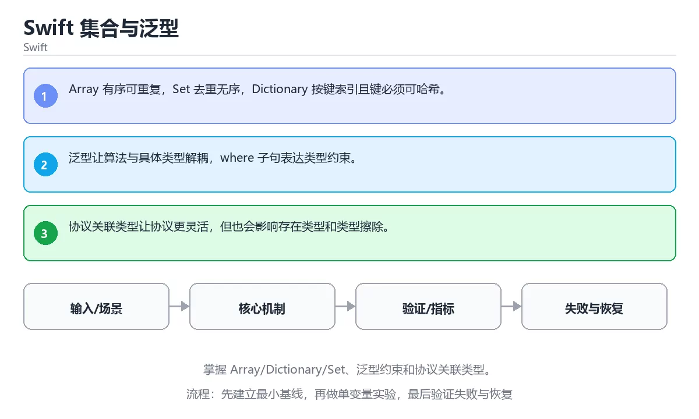

# Swift 集合与泛型



> 内容更新时间：2026-10-03 · 学习阶段：进阶 · 预计用时：22 分钟

## 学习目标

- 能用自己的话解释：Array 有序可重复，Set 去重无序，Dictionary 按键索引且键必须可哈希。
- 能用自己的话解释：泛型让算法与具体类型解耦，where 子句表达类型约束。
- 能用自己的话解释：协议关联类型让协议更灵活，但也会影响存在类型和类型擦除。
- 能把本课知识放回「Swift」，并完成练习与测验。

## 前置知识

- 已完成「Swift」的基础课程，能运行正文中的最小示例。
- 本课关键词：集合、泛型、约束、关联类型。
- 遇到不熟悉的术语先记录问题，完成练习后再回读。

## 核心知识

### 1. Array 有序可重复，Set 去重无序，Dictionary 按键索引且键必须可哈希。

- 它解决的问题：把「Array 有序可重复，Set 去重无序，Dictionary 按键索引且键必须可哈希。」放回真实场景，说明不做它会带来什么后果。
- 关键做法：先用最小示例建立基线，再逐步加入边界、失败和性能条件。
- 验证标准：结果可复现、错误可解释、边界有测试、失败能恢复。

### 2. 泛型让算法与具体类型解耦，where 子句表达类型约束。

- 它解决的问题：把「泛型让算法与具体类型解耦，where 子句表达类型约束。」放回真实场景，说明不做它会带来什么后果。
- 关键做法：先用最小示例建立基线，再逐步加入边界、失败和性能条件。
- 验证标准：结果可复现、错误可解释、边界有测试、失败能恢复。

### 3. 协议关联类型让协议更灵活，但也会影响存在类型和类型擦除。

- 它解决的问题：把「协议关联类型让协议更灵活，但也会影响存在类型和类型擦除。」放回真实场景，说明不做它会带来什么后果。
- 关键做法：先用最小示例建立基线，再逐步加入边界、失败和性能条件。
- 验证标准：结果可复现、错误可解释、边界有测试、失败能恢复。

## 关键流程

```text
输入 → 校验 → 核心处理 → 验证 → 记录指标 → 失败恢复
```

## 实践路径

1. 用一句话复述本课要解决的问题。
2. 跑通正文中的最小示例并记录基线。
3. 只改变一个输入或参数，预测并验证结果。
4. 补一个失败路径，记录错误、恢复和指标。
5. 把结论写成可复现的笔记或测试。

## 常见误区

| 误区 | 后果 | 修正 |
| --- | --- | --- |
| 只记术语不做实验 | 遇到真实问题无法判断 | 用最小输入跑通并记录结果 |
| 只测正常路径 | 边界和故障上线才暴露 | 补空值、极值和依赖失败 |
| 没有基线就优化 | 无法证明改进有效 | 先测量再修改 |
| 忽略成本与安全 | 性能和风险失控 | 同时记录资源、权限与失败代价 |

## 动手练习

1. 合上教程，用 3～5 句话解释「Swift 集合与泛型」。
2. 从正文选一个例子，改变一个条件并预测结果。
3. 设计一个失败场景，写出止损与恢复步骤。

**验收标准**：留下输入、命令、输出、差异和下一步问题。

## 本课小结

- 本课属于「Swift」，核心关键词是 集合、泛型、约束、关联类型。
- 先保证正确与可复现，再讨论性能和扩展。
- 完成练习和测验后，把仍然不确定的问题写成下一轮验证清单。

> 本课由 P1 内容扩展生成，重点补充原有课程缺失的主题与工程边界。


## 语言专项实践：Swift 集合与泛型

### 一、工具链

| 阶段 | 推荐工具 | 验收标准 |
| --- | --- | --- |
| 编译构建 | swiftc / xcodebuild | 命令可复现且错误能被定位 |
| 测试 | XCTest + async 测试 | 命令可复现且错误能被定位 |
| 性能 | Instruments / signpost | 命令可复现且错误能被定位 |
| 发布 | TestFlight + App Store 审核 | 命令可复现且错误能被定位 |

### 二、运行时与内存模型

围绕「集合、泛型、约束、关联类型」说明变量生命周期、资源释放、并发模型和错误传播。语言语法只是入口，真正决定行为的是运行时、标准库和平台约束。

### 三、测试策略

- 单元测试覆盖核心规则和边界。
- 集成测试覆盖文件、网络、数据库或平台 API。
- 失败测试覆盖超时、取消、异常和资源耗尽。
- 性能测试记录基线，避免只凭感觉优化。

### 四、发布检查

- [ ] 版本和依赖锁定，构建可复现。
- [ ] 产物经过签名、校验和最小权限配置。
- [ ] 日志不泄露密钥和个人信息。
- [ ] 有升级、回滚和故障恢复说明。


## 考点精讲：把测验题还原成判断过程

本课有 5 个判断点。先自己作答，再看「判断依据」；如果结论正确但理由不完整，回到正文对应章节补足概念。

### 考点 1：关于「Array 有序可重复 Set 去重…」，下列说法正确的是？

- **正确判断**：Array 有序可重复，Set 去重无序，Dictionary 按键索引且键必须可哈希。
- **判断依据**：正确答案是「Array 有序可重复，Set 去重无序，Dictionary 按键索引且键必须可哈希。」，本课在「本课小结」中说明：本课属于「Swift」，核心关键词是 集合、泛型、约束、关联类型。，本课在「核心知识」中说明：它解决的问题：把Array 有序可重复，Set 去重无序，Dictionary 按键索引且键必须可哈希。，本课在「核心知识」中说明：它解决的问题：把协议关联类型让协议更灵活，但也会影响存在类型和类型擦除。
- **迁移检查**：如果给某个错误选项去掉一个限定词，它会不会变成正确？说明理由。

### 考点 2：关于「泛型让算法与具体类型解耦 where…」，下列说法正确的是？

- **正确判断**：泛型让算法与具体类型解耦，where 子句表达类型约束。
- **判断依据**：正确答案是「泛型让算法与具体类型解耦，where 子句表达类型约束。」，本课在「本课小结」中说明：本课属于「Swift」，核心关键词是 集合、泛型、约束、关联类型。，本课在「核心知识」中说明：它解决的问题：把泛型让算法与具体类型解耦，where 子句表达类型约束。，本课在「核心知识」中说明：它解决的问题：把协议关联类型让协议更灵活，但也会影响存在类型和类型擦除。
- **迁移检查**：如果给某个错误选项去掉一个限定词，它会不会变成正确？说明理由。

### 考点 3：关于「协议关联类型让协议更灵活 但也会影响…」，下列说法正确的是？

- **正确判断**：协议关联类型让协议更灵活，但也会影响存在类型和类型擦除。
- **判断依据**：正确答案是「协议关联类型让协议更灵活，但也会影响存在类型和类型擦除。」，本课在「核心知识」中说明：它解决的问题：把Array 有序可重复，Set 去重无序，Dictionary 按键索引且键必须可哈希。，本课在核心知识中说明：它解决的问题：把协议关联类型让协议更灵活，但也会影响存在类型和类型擦除。本课还在核心知识中说明：它解决的问题：把泛型让算法与具体类型解耦，where 子句表达类型约束。
- **迁移检查**：把题干里的一个条件换成边界值，原来的结论还成立吗？写出判断过程。

### 考点 4：「Swift 集合与泛型」的核心学习目标是什么？

- **正确判断**：掌握 Array/Dictionary/Set
- **判断依据**：正确答案是「掌握 Array/Dictionary/Set」，本课在「核心知识」中说明：它解决的问题：把协议关联类型让协议更灵活，但也会影响存在类型和类型擦除。，本课在核心知识中说明：它解决的问题：把泛型让算法与具体类型解耦，where 子句表达类型约束。
- **迁移检查**：如果给某个错误选项去掉一个限定词，它会不会变成正确？说明理由。

### 考点 5：以下哪些术语与「Swift 集合与泛型」直接相关？（多选）

- **正确判断**：集合、泛型
- **判断依据**：正确答案是「集合、泛型」，本课在「核心知识」中说明：它解决的问题：把协议关联类型让协议更灵活，但也会影响存在类型和类型擦除。本课还在「核心知识」中说明：它解决的问题：把泛型让算法与具体类型解耦，where 子句表达类型约束。课程摘要指出掌握 Array/Dictionary/Set，泛型约束和协议关联类型，本课要判断的正是以下哪些术语与Swift集合与泛型直接相关，（多选）。
- **迁移检查**：每个正确项各自成立的条件是什么？有没有互相依赖。

## 本课复习清单

离开本课前，逐项确认：

- [ ] 不看解析，能说出「关于「Array 有序可重复 Set 去重…」，下列说法正确的是？」的判断依据。
- [ ] 不看解析，能说出「关于「泛型让算法与具体类型解耦 where…」，下列说法正确的是？」的判断依据。
- [ ] 不看解析，能说出「关于「协议关联类型让协议更灵活 但也会影响…」，下列说法正确的是？」的判断依据。
- [ ] 不看解析，能说出「「Swift 集合与泛型」的核心学习目标是什么？」的判断依据。
- [ ] 不看解析，能说出「以下哪些术语与「Swift 集合与泛型」直接相关？（多选）」的判断依据。
- [ ] 至少运行一次本课示例，记录输入、输出和一个边界情况。
- [ ] 把本课最容易混淆的两个概念写成一句话对照。

| 复盘项 | 记录 |
| --- | --- |
| 已经能独立解释的考点 |  |
| 仍然说不清的概念 |  |
| 下一步验证动作 |  |

## 逐节复习与自检

下面按正文顺序回顾每一节，并给出一个自检问题；说不清的地方回到原章节补课。

### 核心知识

」放回真实场景，说明不做它会带来什么后果。关键做法：先用最小示例建立基线，再逐步加入边界、失败和性能条件。

自检：这一节与相邻主题的边界在哪里？

### 动手练习

合上教程，用 3～5 句话解释「Swift 集合与泛型」。从正文选一个例子，改变一个条件并预测结果。

自检：如果去掉这一节里的一个前提，结论会怎样变化？

### 语言专项实践：Swift 集合与泛型

围绕「集合、泛型、约束、关联类型」说明变量生命周期、资源释放、并发模型和错误传播。语言语法只是入口，真正决定行为的是运行时、标准库和平台约束。

自检：这一节的关键输入与输出分别是什么？

### 最小可运行示例

```swift
let scores = ["a": 90, "b": 72]
let passed = scores.filter { $0.value >= 80 }.keys.sorted()
print(passed)
```

自检：把这一节讲给没学过的人，最需要强调哪一点？

### 预期输出

```text
["a"]
```

自检：这一节与相邻主题的边界在哪里？

### 验证步骤

制造一次错误输入，记录错误信息与修复方式。

自检：如果去掉这一节里的一个前提，结论会怎样变化？

## English Overview

**Title:** Swift Collections and Generics

**Summary:** Learn Array/Dictionary/Set, generic constraints and associated types.

**Category:** Swift  
**Level:** 进阶  
**Key terms:** 集合, 泛型, 约束, 关联类型

> The full tutorial is written in Chinese. This bilingual overview helps English readers identify the topic, scope and key terms before studying the detailed examples.

## 内容元数据

- 内容版本：v2.0
- 最后更新：2026-10-03
- 学习阶段：进阶
- 适用环境：Swift 6 / Xcode 16+
- 内容来源：内置结构化课程与工程实践整理
- 相关主题：集合、泛型、约束、关联类型
- 质量版本：P0 测验标准 + P1 覆盖扩展 + P2 体验补全


## 最小可运行示例

下面示例用于验证「Swift 集合与泛型」的最小输入、处理和输出。先原样运行，再只修改一个值：

```swift
let scores = ["a": 90, "b": 72]
let passed = scores.filter { $0.value >= 80 }.keys.sorted()
print(passed)
```

## 预期输出

```text
["a"]
```

## 验证步骤

1. 记录运行环境、命令和真实输出。
2. 修改一个输入，先写预测再运行。
3. 制造一次错误输入，记录错误信息与修复方式。
4. 把结论写回本课笔记或测试用例。


## 参考资料与复核

- 最后复核：2026-10-04
- 下次复核：2027-04-04
- 复核范围：版本兼容、API 行为、安全建议与工程实践
- 来源性质：官方文档与标准；本课正文为离线教学重组，不复制原文

| 参考资料 | 本课用途 |
| --- | --- |
| [Swift 官方文档](https://www.swift.org/documentation/) | 语言、并发与包管理 |
| [Apple Developer](https://developer.apple.com/documentation/swift) | 平台 API 与工具链 |

> 本课主题：掌握 Array/Dictionary/Set、泛型约束和协议关联类型。

> App 完全离线展示文字链接，不会自动联网；需要延伸阅读时可复制链接到浏览器。

