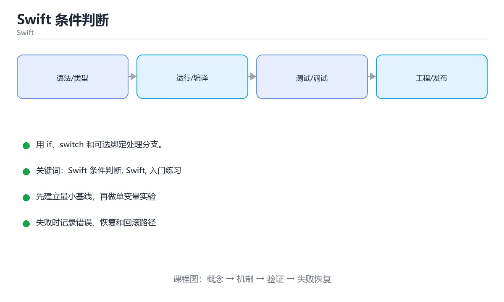

# Swift 条件判断



> 内容更新时间：2026-10-03 · 学习阶段：入门 · 预计用时：15 分钟

## 学习目标

- 先认识「Swift 条件判断」需要的工具、输入和输出。
- 按步骤运行最小示例，并记录结果与错误。
- 用一个边界输入验证自己是否真正掌握。

## 前置知识

- 会进行基本的文件或命令行操作。
- 不需要预先掌握「Swift」的高级知识。

## 一句话入门

用 if、switch 和可选绑定处理分支。

## 最小示例

```swift
let temperature = 31
print(temperature > 30 ? "hot" : "normal")
```

## 预期输出

```text
hot
```

## 常见错误

- 强制解包 nil 可选值，运行时崩溃。
- 复制命令时遗漏空格、引号或必要参数。

## 动手练习

1. 原样运行最小示例，保存命令和输出。
2. 把数字 2 改成 10，预测并验证新结果。
3. 制造一个错误输入，写出错误信息和修复方法。

## 本课小结

- 入门阶段先保证能运行、能观察、能解释，再追求复杂功能。
- 每次只改一个变量，记录预测与实际结果。
- 遇到错误先看第一条错误信息，再回到最小示例。


## 代码实验：把示例跑成证据

这一节不引入新语法，而是把「Swift 条件判断」的最小示例变成可以复现、可以对照的实验。每次只改变一个条件，先写预测，再运行，最后解释差异。

### 实验一：建立基线

```swift
let temperature = 31
print(temperature > 30 ? "hot" : "normal")
```

先原样运行上面的代码，记录命令、完整输出和退出状态。然后把输出与正文的预期输出逐字对照，不要用“看起来差不多”代替核对；空格、大小写、换行和错误流向都可能暴露环境差异。

### 实验二：只改一个输入

从代码中选一个会影响结果的字面量、参数或输入，把它替换成边界值：数值可尝试 0、1、最大值和最小值，字符串可尝试空串和超长文本，集合可尝试空集合、单元素和重复元素。先写出预测，再运行并记录实际结果。

### 实验三：制造一个可控错误

把输入改成空值、极值或类型不匹配的形式，记录程序抛出的第一条错误、发生位置和恢复方式。

| 实验 | 改动 | 预测 | 实际 | 结论 |
| --- | --- | --- | --- | --- |
| 基线 | 保持原样 |  |  |  |
| 边界 |  |  |  |  |
| 失败 |  |  |  |  |

### 实验四：用三句话复述

1. 输入是什么，哪些输入属于合法范围，哪些属于边界或非法范围？
2. 程序按什么顺序处理输入，在哪一步产生了状态变化或副作用？
3. 输出如何验证，失败时第一条可观察证据是什么？

## Swift 基础机制速览

### 编译、常量与变量

Swift 使用 LLVM 编译成原生代码，Xcode 和 Swift Package Manager 是主要工具链。`let` 声明常量，`var` 声明变量；优先使用 let，让编译器帮助你发现意外修改。类型推断根据初始值确定类型，公共 API 和复杂表达式仍应显式标注。字符串、数组、字典和集合都有值语义，赋值或传参时发生写时复制，修改副本通常不会影响原值。

### 可选值、解包与空安全

`Optional` 表示可能有值也可能为 nil，必须显式处理。`if let`、`guard let`、`??` 和可选链 `?.` 是常用解包方式；强制解包 `!` 只应在逻辑上绝不可能为空且有测试保证时使用。`guard` 适合提前退出，让正常路径保持在函数主体层级。区分“值为 nil”和“值为空字符串/空数组”，不要把两者混为一谈。

### 函数、闭包与参数标签

Swift 函数支持参数标签、默认参数、可变参数、输入输出参数和抛出错误。参数标签让调用点更接近自然语言，`_` 可以省略标签。闭包捕获外部变量，默认是引用捕获；需要修改捕获值或在并发环境中使用时，要明确捕获列表和所有权。尾随闭包语法让回调、排序和异步代码更易读，但嵌套过深时应提取成命名函数。

### 结构体、类、协议与扩展

结构体是值类型，类是引用类型；优先使用结构体表达数据，除非需要继承、身份或共享可变状态。协议定义能力契约，扩展可以为已有类型添加方法，泛型让算法适用于多种类型。协议组合、关联类型和 existential 各有取舍。属性观察器、计算属性和懒加载属性让状态管理更清晰，但要避免在初始化完成前访问依赖属性。

### 内存、并发与错误处理

Swift 使用 ARC 自动管理引用计数，强引用循环会让对象无法释放；闭包捕获 self 时使用 `[weak self]` 或 `[unowned self]` 要理解生命周期。错误用 `throws` 和 `try` 传播，`defer` 负责清理。结构化并发使用 async/await、Task 和 actor 隔离共享状态；并发代码仍要处理取消、优先级和数据竞争。测试时分别覆盖值语义、可选值边界和异步失败路径。

## 考点精讲：把测验题还原成判断过程

本课有 4 个判断点。先自己作答，再看「判断依据」；如果结论正确但理由不完整，回到正文对应章节补足概念。

### 考点 1：if let name = optionalName { ... } 这种写法的作用是？

- **正确判断**：可选绑定：值非空时解包并进入分支，否则跳过
- **判断依据**：可选绑定会先判断可选值是否为 nil，有值时把它解包并绑定到新常量 name，供花括号内使用；为 nil 时整个分支跳过，不会崩溃。它比强制解包安全，也可以与 guard 搭配在函数开头提前退出。绑定出来的名字默认是不可变的，需要修改时要写成 if var。
- **迁移检查**：如果给某个错误选项去掉一个限定词，它会不会变成正确？说明理由。

### 考点 2：Swift 的 switch 语句有什么特点？

- **正确判断**：每个 case 结束自动跳出，不需要写 break
- **判断依据**：Swift 的 switch 默认不穿透，case 执行完自动结束，需要在同一分支继续执行下一个条件时要显式写 fallthrough。它支持区间、元组、值绑定与 where 条件，表达能力很强；只有在没有穷尽所有情况时才必须提供 default。这与 C 风格 switch 的行为不同。
- **迁移检查**：如果给某个错误选项去掉一个限定词，它会不会变成正确？说明理由。

### 考点 3：guard 语句的主要用途是？

- **正确判断**：在条件不满足时提前退出，让正常路径保持在主线
- **判断依据**：guard 要求条件成立才能继续执行后面的代码，else 分支必须退出当前作用域（return、throw、break 或 continue），因此适合做参数校验与提前返回。它绑定的可选值在后续代码中保持可用，能减少嵌套层级。跳过本轮循环应使用 continue，而不是 guard。
- **迁移检查**：遮住选项，只根据定义复述一次答案，再回来看哪个选项与复述一致。

### 考点 4：示例中 temperature 为 31，输出结果是什么？

- **正确判断**：hot，三目运算符在条件成立时取前一个值
- **判断依据**：31 > 30 成立，三目运算符返回 "hot"，print 把它输出为一行 hot。Swift 支持三目运算符，也支持把 if 作为表达式赋给变量。若条件不成立则返回 "normal"，两个分支的类型需要一致，否则编译器会要求显式转换或调整表达式。
- **迁移检查**：把题干里的一个条件换成边界值，原来的结论还成立吗？写出判断过程。

## 本课复习清单

离开本课前，逐项确认：

- [ ] 不看解析，能说出「if let name = optionalName { ... } 这种写法的…」的判断依据。
- [ ] 不看解析，能说出「Swift 的 switch 语句有什么特点？」的判断依据。
- [ ] 不看解析，能说出「guard 语句的主要用途是？」的判断依据。
- [ ] 不看解析，能说出「示例中 temperature 为 31，输出结果是什么？」的判断依据。
- [ ] 至少运行一次本课示例，记录输入、输出和一个边界情况。
- [ ] 把本课最容易混淆的两个概念写成一句话对照。

| 复盘项 | 记录 |
| --- | --- |
| 已经能独立解释的考点 |  |
| 仍然说不清的概念 |  |
| 下一步验证动作 |  |

## 逐节复习与自检

下面按正文顺序回顾每一节，并给出一个自检问题；说不清的地方回到原章节补课。

### 一句话入门

用 if、switch 和可选绑定处理分支。

自检：这一节的关键输入与输出分别是什么？

### 最小示例

```swift
let temperature = 31
print(temperature > 30 ? "hot" : "normal")
```

自检：这一节与相邻主题的边界在哪里？

### 预期输出

```text
hot
```

自检：这一节与相邻主题的边界在哪里？

### 动手练习

把数字 2 改成 10，预测并验证新结果。制造一个错误输入，写出错误信息和修复方法。

自检：如果去掉这一节里的一个前提，结论会怎样变化？

### 语言专项实践：Swift 条件判断

围绕「Swift 条件判断、Swift、入门练习」说明变量生命周期、资源释放、并发模型和错误传播。语言语法只是入口，真正决定行为的是运行时、标准库和平台约束。

自检：把这一节讲给没学过的人，最需要强调哪一点？

## 术语速查

| 术语 | 本课语境 |
| --- | --- |
| `let` | Swift 使用 LLVM 编译成原生代码，Xcode 和 Swift Package Manager 是主要工具链。`let` 声明常量，`var` 声明变量；优先使用 let，让编译器帮助你发现意外修改。类型推断根据初始值确定类型，公共… |
| `var` | Swift 使用 LLVM 编译成原生代码，Xcode 和 Swift Package Manager 是主要工具链。`let` 声明常量，`var` 声明变量；优先使用 let，让编译器帮助你发现意外修改。类型推断根据初始值确定类型，公共… |
| `Optional` | `Optional` 表示可能有值也可能为 nil，必须显式处理。`if let`、`guard let`、`??` 和可选链 `?.` 是常用解包方式；强制解包 `!` 只应在逻辑上绝不可能为空且有测试保证时使用。`guard` 适合提前… |
| `if let` | `Optional` 表示可能有值也可能为 nil，必须显式处理。`if let`、`guard let`、`??` 和可选链 `?.` 是常用解包方式；强制解包 `!` 只应在逻辑上绝不可能为空且有测试保证时使用。`guard` 适合提前… |
| `guard let` | `Optional` 表示可能有值也可能为 nil，必须显式处理。`if let`、`guard let`、`??` 和可选链 `?.` 是常用解包方式；强制解包 `!` 只应在逻辑上绝不可能为空且有测试保证时使用。`guard` 适合提前… |
| `??` | `Optional` 表示可能有值也可能为 nil，必须显式处理。`if let`、`guard let`、`??` 和可选链 `?.` 是常用解包方式；强制解包 `!` 只应在逻辑上绝不可能为空且有测试保证时使用。`guard` 适合提前… |
| `?.` | `Optional` 表示可能有值也可能为 nil，必须显式处理。`if let`、`guard let`、`??` 和可选链 `?.` 是常用解包方式；强制解包 `!` 只应在逻辑上绝不可能为空且有测试保证时使用。`guard` 适合提前… |
| `只应在逻辑上绝不可能为空且有测试保证时使用。` | `Optional` 表示可能有值也可能为 nil，必须显式处理。`if let`、`guard let`、`??` 和可选链 `?.` 是常用解包方式；强制解包 `!` 只应在逻辑上绝不可能为空且有测试保证时使用。`guard` 适合提前… |
| `[weak self]` | Swift 使用 ARC 自动管理引用计数，强引用循环会让对象无法释放；闭包捕获 self 时使用 `[weak self]` 或 `[unowned self]` 要理解生命周期。错误用 `throws` 和 `try` 传播，`defe… |
| `[unowned self]` | Swift 使用 ARC 自动管理引用计数，强引用循环会让对象无法释放；闭包捕获 self 时使用 `[weak self]` 或 `[unowned self]` 要理解生命周期。错误用 `throws` 和 `try` 传播，`defe… |
| `throws` | Swift 使用 ARC 自动管理引用计数，强引用循环会让对象无法释放；闭包捕获 self 时使用 `[weak self]` 或 `[unowned self]` 要理解生命周期。错误用 `throws` 和 `try` 传播，`defe… |
| `try` | Swift 使用 ARC 自动管理引用计数，强引用循环会让对象无法释放；闭包捕获 self 时使用 `[weak self]` 或 `[unowned self]` 要理解生命周期。错误用 `throws` 和 `try` 传播，`defe… |

## English Overview

**Title:** Swift Conditionals

**Summary:** Use if, switch and optional binding.

**Category:** Swift  
**Level:** 入门  
**Key terms:** Swift 条件判断, Swift, 入门练习

> The full tutorial is written in Chinese. This bilingual overview helps English readers identify the topic, scope and key terms before studying the detailed examples.

## 内容元数据

- 内容版本：v2.0
- 最后更新：2026-10-03
- 学习阶段：入门
- 适用环境：Swift 6 / Xcode 16+
- 内容来源：内置结构化课程与工程实践整理
- 相关主题：Swift 条件判断、Swift、入门练习
- 质量版本：P0 测验标准 + P1 覆盖扩展 + P2 体验补全


## 语言专项实践：Swift 条件判断

### 一、工具链

| 阶段 | 推荐工具 | 验收标准 |
| --- | --- | --- |
| 编译构建 | swiftc / xcodebuild | 命令可复现且错误能被定位 |
| 测试 | XCTest + async 测试 | 命令可复现且错误能被定位 |
| 性能 | Instruments / signpost | 命令可复现且错误能被定位 |
| 发布 | TestFlight + App Store 审核 | 命令可复现且错误能被定位 |

### 二、运行时与内存模型

围绕「Swift 条件判断、Swift、入门练习」说明变量生命周期、资源释放、并发模型和错误传播。语言语法只是入口，真正决定行为的是运行时、标准库和平台约束。

### 三、测试策略

- 单元测试覆盖核心规则和边界。
- 集成测试覆盖文件、网络、数据库或平台 API。
- 失败测试覆盖超时、取消、异常和资源耗尽。
- 性能测试记录基线，避免只凭感觉优化。

### 四、发布检查

- [ ] 版本和依赖锁定，构建可复现。
- [ ] 产物经过签名、校验和最小权限配置。
- [ ] 日志不泄露密钥和个人信息。
- [ ] 有升级、回滚和故障恢复说明。


## 参考资料与复核

- 最后复核：2026-10-04
- 下次复核：2027-04-04
- 复核范围：版本兼容、API 行为、安全建议与工程实践
- 来源性质：官方文档与标准；本课正文为离线教学重组，不复制原文

| 参考资料 | 本课用途 |
| --- | --- |
| [Swift 官方文档](https://www.swift.org/documentation/) | 语言、并发与包管理 |
| [Apple Developer](https://developer.apple.com/documentation/swift) | 平台 API 与工具链 |

> 本课主题：用 if、switch 和可选绑定处理分支。

> App 完全离线展示文字链接，不会自动联网；需要延伸阅读时可复制链接到浏览器。
