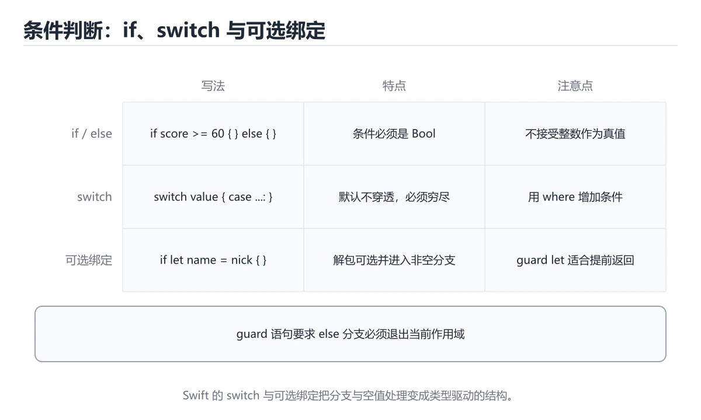

# Swift 条件判断

> 内容更新时间：2026-10-06 · 学习阶段：入门 · 预计用时：40 分钟




## 本节知识框架

**课程定位**：所属分类 `swift`（Swift），课程主题 `Swift 条件判断`，学习阶段 入门，建议用时 50 分钟。

本课主线：用 if、switch 和可选绑定处理分支。

**学完本课应当能够**
- 说清 `Bool` 与 `if-else` 的含义与区别，并各举一个正例和一个反例。
- 用本课示例验证 `guard` 的行为，记录输入、输出与失败条件。
- 遇到「条件分支不穷尽」这类问题时，能说出触发条件与修复顺序。

### 从概念到验证的学习链条

1. `Bool`：先掌握 Swift 的条件必须是真正的布尔值，没有隐式真假转换，再用它解释 `if-else` 为什么会出现。
2. `if-else`：先掌握 按条件选择分支，条件不写括号但必须写花括号，再用它解释 `guard` 为什么会出现。
3. `guard`：先掌握 guard 条件不成立时提前退出，用于减少嵌套层级，再用它解释 `switch` 为什么会出现。
4. `switch`：先掌握 多分支匹配，要求覆盖所有情况，且默认不贯穿，再用它解释 `可选绑定` 为什么会出现。
5. `可选绑定`：先掌握 if let / guard let 把可选值解包成非空常量后再使用，再用它解释 `闭包` 为什么会出现。
6. `闭包`：先掌握 闭包捕获外部变量，默认是引用捕获；需要修改捕获值或在并发环境中使用时，要明确捕获列表和所有权，再用它解释 本课示例的观察结果 为什么会出现。

**先修与衔接**：本课是「Swift」分类的第 3 课。先修内容：《Swift 常量与变量》。《Swift 常量与变量》里的 `常量 let`、`变量 var` 是本课的前提。相关或后续课程：《Swift 循环入门》。

### 完成判据

- **定义关**：不看正文也能说明 `Bool` 是 Swift 的条件必须是真正的布尔值，没有隐式真假转换，并指出一个反例。
- **机制关**：能按“输入 → 转换 → 输出 → 验证”复述 `Swift 条件判断`，而不是只背结论。
- **示例关**：能运行或推演 `Swift 条件判断` 的 `swift` 示例，并说明一个真实出现的标识符或字面量。
- **证据关**：能指出 `Swift 条件判断` 示例里的 调用了 `print()`，并说明它支持或反驳了本课的哪一条结论。
- **排错关**：能复现 条件分支不穷尽，记录现象并按 穷尽所有情况，必要时写默认分支 修复。
- **迁移关**：能把 `Swift 条件判断`、`Swift`、`入门练习` 放进一个与 `Swift 条件判断` 不同的项目场景，并保持输入与验证条件可追踪。
- **复盘关**：学完 `Swift 条件判断` 后，用一句话写下仍然不确定的结论，并列出下一次验证需要的输入、环境和成功判据。

### 复习清单

- [ ] 能不看正文复述本课核心术语，并指出一个边界或反例。
- [ ] 能运行或推演本课示例，记录输入、输出与失败现象。
- [ ] 能完成一次自测，并把错题对照错误表定位原因。

## 核心概念定义

| 术语 | 操作性定义 | 常见边界与风险 |
| --- | --- | --- |
| Bool | Swift 的条件必须是真正的布尔值，没有隐式真假转换。 | 只在「Swift 的条件必须是真正的布尔值，没有隐式真假转换」这一前提下成立，换输入或换环境要重新验证。 |
| if-else | 按条件选择分支，条件不写括号但必须写花括号。 | 只在「按条件选择分支，条件不写括号但必须写花括号」这一前提下成立，换输入或换环境要重新验证。 |
| guard | guard 条件不成立时提前退出，用于减少嵌套层级。 | 只在「guard 条件不成立时提前退出，用于减少嵌套层级」这一前提下成立，换输入或换环境要重新验证。 |
| switch | 多分支匹配，要求覆盖所有情况，且默认不贯穿。 | 只在「多分支匹配，要求覆盖所有情况，且默认不贯穿」这一前提下成立，换输入或换环境要重新验证。 |
| 可选绑定 | if let / guard let 把可选值解包成非空常量后再使用。 | 只在「if let / guard let 把可选值解包成非空常量后再使用」这一前提下成立，换输入或换环境要重新验证。 |
| 闭包 | 闭包捕获外部变量，默认是引用捕获；需要修改捕获值或在并发环境中使用时，要明确捕获列表和所有权 | 共享状态与调度顺序会改变结论，单线程或串行测试通过不等于并发下成立。 |

## 原理与运行机制

### 机制总览

**教材衔接：一句话入门**

用 if、switch 和可选绑定处理分支。

**教材衔接：Swift 基础机制速览**

### 编译、常量与变量

Swift 使用 LLVM 编译成原生代码，Xcode 和 Swift Package Manager 是主要工具链。`let` 声明常量，`var` 声明变量；优先使用 let，让编译器帮助你发现意外修改。类型推断根据初始值确定类型，公共 API 和复杂表达式仍应显式标注。字符串、数组、字典和集合都有值语义，赋值或传参时发生写时复制，修改副本通常不会影响原值。

### 可选值、解包与空安全

`Optional` 表示可能有值也可能为 nil，必须显式处理。`if let`、`guard let`、`??` 和可选链 `?.` 是常用解包方式；强制解包 `!` 只应在逻辑上绝不可能为空且有测试保证时使用。`guard` 适合提前退出，让正常路径保持在函数主体层级。区分“值为 nil”和“值为空字符串/空数组”，不要把两者混为一谈。

### 函数、闭包与参数标签

Swift 函数支持参数标签、默认参数、可变参数、输入输出参数和抛出错误。参数标签让调用点更接近自然语言，`_` 可以省略标签。闭包捕获外部变量，默认是引用捕获；需要修改捕获值或在并发环境中使用时，要明确捕获列表和所有权。尾随闭包语法让回调、排序和异步代码更易读，但嵌套过深时应提取成命名函数。

### 结构体、类、协议与扩展

结构体是值类型，类是引用类型；优先使用结构体表达数据，除非需要继承、身份或共享可变状态。协议定义能力契约，扩展可以为已有类型添加方法，泛型让算法适用于多种类型。协议组合、关联类型和 existential 各有取舍。属性观察器、计算属性和懒加载属性让状态管理更清晰，但要避免在初始化完成前访问依赖属性。

### 内存、并发与错误处理

Swift 使用 ARC 自动管理引用计数，强引用循环会让对象无法释放；闭包捕获 self 时使用 `[weak self]` 或 `[unowned self]` 要理解生命周期。错误用 `throws` 和 `try` 传播，`defer` 负责清理。结构化并发使用 async/await、Task 和 actor 隔离共享状态；并发代码仍要处理取消、优先级和数据竞争。测试时分别覆盖值语义、可选值边界和异步失败路径。

**教材衔接：版本与时效**

- Swift 6.x 默认开启更严格的数据竞争检查；Swift 条件判断 的并发边界要先梳理。
- 升级「Swift 条件判断」涉及的依赖前，先用 temperature 复现当前行为，再逐项核对版本说明与破坏性变更。
- 把 Swift 的 UI 与测试代码分开，降低版本升级的影响面。
- 官方发布说明：https://www.swift.org/blog/

### 升级检查清单

- 先固定当前版本，跑通全部示例与测验，再升级工具链。
- 只改 Swift 条件判断 的版本变量，记录编译、测试与产物体积的变化。
- 先回归 Swift 条件判断 与 Swift 的默认行为和错误信息，再扩大测试范围。
- 升级完成后更新本课「最后复核 / 下次复核」日期，并记录 Swift 条件判断 的版本变化。

**教材衔接：语言专项实践：Swift 条件判断**

### 一、工具链

| 阶段 | 推荐工具 | 验收标准 |
| --- | --- | --- |
| 编译构建 | swiftc / xcodebuild | 命令可复现且错误能被定位 |
| 测试 | XCTest + async 测试 | 命令可复现且错误能被定位 |
| 性能 | Instruments / signpost | 命令可复现且错误能被定位 |
| 发布 | TestFlight + App Store 审核 | 命令可复现且错误能被定位 |

### 二、运行时与内存模型

「Swift 条件判断」的「二、运行时与内存模型」一节补全如下：

- 定位：这一节说明二、运行时与内存模型在「Swift 条件判断」知识体系里的位置。
- 检查点：固定版本与输入重跑《Swift 条件判断》，记录两次差异并定位不稳定条件。
- 自检：能否用一个最小例子解释二、运行时与内存模型？


### 机制拆解：每一步的输入、动作与输出

#### 1. `Bool`
- 输入：`Swift 条件判断`；本步把 Swift 的条件必须是真正的布尔值，没有隐式真假转换 当作判断规则。
- 动作：围绕 `Bool` 保留中间状态，并记录它与 `if-else` 的对应关系。
- 输出：`if-else`，它可以被下一段代码、测试或记录继续使用。
- `Bool` 的失败条件：只在「Swift 的条件必须是真正的布尔值，没有隐式真假转换」这一前提下成立，换输入或换环境要重新验证。

#### 2. `if-else`
- 输入：`Bool`；本步把 按条件选择分支，条件不写括号但必须写花括号 当作判断规则。
- 动作：围绕 `if-else` 保留中间状态，并记录它与 `guard` 的对应关系。
- 输出：`guard`，它可以被下一段代码、测试或记录继续使用。
- `if-else` 的失败条件：只在「按条件选择分支，条件不写括号但必须写花括号」这一前提下成立，换输入或换环境要重新验证。

#### 3. `guard`
- 输入：`if-else`；本步把 guard 条件不成立时提前退出，用于减少嵌套层级 当作判断规则。
- 动作：围绕 `guard` 保留中间状态，并记录它与 `switch` 的对应关系。
- 输出：`switch`，它可以被下一段代码、测试或记录继续使用。
- `guard` 的失败条件：只在「guard 条件不成立时提前退出，用于减少嵌套层级」这一前提下成立，换输入或换环境要重新验证。

#### 4. `switch`
- 输入：`guard`；本步把 多分支匹配，要求覆盖所有情况，且默认不贯穿 当作判断规则。
- 动作：围绕 `switch` 保留中间状态，并记录它与 `可选绑定` 的对应关系。
- 输出：`可选绑定`，它可以被下一段代码、测试或记录继续使用。
- `switch` 的失败条件：只在「多分支匹配，要求覆盖所有情况，且默认不贯穿」这一前提下成立，换输入或换环境要重新验证。

#### 5. `可选绑定`
- 输入：`switch`；本步把 if let / guard let 把可选值解包成非空常量后再使用 当作判断规则。
- 动作：围绕 `可选绑定` 保留中间状态，并记录它与 `闭包` 的对应关系。
- 输出：`闭包`，它可以被下一段代码、测试或记录继续使用。
- `可选绑定` 的失败条件：只在「if let / guard let 把可选值解包成非空常量后再使用」这一前提下成立，换输入或换环境要重新验证。

#### 6. `闭包`
- 输入：`可选绑定`；本步把 闭包捕获外部变量，默认是引用捕获；需要修改捕获值或在并发环境中使用时，要明确捕获列表和所有权 当作判断规则。
- 动作：围绕 `闭包` 保留中间状态，并记录它与 `print` 的对应关系。
- 输出：`print`，它可以被下一段代码、测试或记录继续使用。
- `闭包` 的失败条件：共享状态与调度顺序会改变结论，单线程或串行测试通过不等于并发下成立。

### 示例中的可观察事实

1. 调用了 `print()`；它对应的课程主题是 `Swift 条件判断`。
2. 出现字面量 `hot`；它对应的课程主题是 `Swift 条件判断`。
3. 出现字面量 `normal`；它对应的课程主题是 `Swift 条件判断`。

### 复现实验记录

- 环境：`Swift 条件判断` 使用 `swift` 示例，固定 `Swift 条件判断`、`Swift`、`入门练习` 作为第一组条件。
- 首轮输入：先确认 调用了 `print()`，预测 `Bool` 会怎样变化。
- 基线观察：记录命令、输入、输出和错误原文，不用截图代替可复制的文本。
- 单变量修改：只改变 `Swift 条件判断`，观察 `闭包` 是否仍满足定义。
- 失败注入：复现 条件分支不穷尽，确认现象是 编译错误或漏掉场景。
- 记录结论：把“修改前、修改后、预期变化、实际变化”写成四列表，这样复盘 `Swift 条件判断` 时才能区分概念错误与实现错误。

## 典型应用场景

**课程内置实验入口**：`sandbox:swift`，用于动手验证《Swift 条件判断》的机制；实验结论不替代概念定义与复杂度分析。

**教材衔接：代码实验：把示例跑成证据**

### 实验一：建立基线

```swift
let temperature = 31
print(temperature > 30 ? "hot" : "normal")
```

### 实验二：只改一个输入

沿用「Swift 条件判断」的最小示例做一次单变量实验：

做完后用一句话写出「Swift 条件判断」的结论：输入怎么变，结果才怎么变。

### 实验三：制造一个可控错误

把 temperature 的输入推到越界值，记录错误信息与恢复动作。

### 实验四：用三句话复述

1. Swift 条件判断 的输入是什么，哪些取值合法，哪些属于边界或非法范围？
2. Swift 条件判断 按什么顺序处理输入，在哪一步产生了状态变化或副作用？
3. 输出如何验证，失败时第一条可观察证据是什么？

- **条件分支不穷尽**：典型现象是编译错误或漏掉场景；正确做法是穷尽所有情况，必要时写默认分支。
- **可选值与布尔判断混用**：典型现象是分支逻辑出错；正确做法是先解包再做判断。
- **区间边界写错**：典型现象是多包含或少包含一次；正确做法是明确区间开闭并使用范围表达式。

### 最小验证场景

- 准备：保留 `swift` 示例的原始输入，先记录 `Swift 条件判断` 的基线输出和完整运行命令。
- 观察：先核对 调用了 `print()`，再改变一个与 `Bool` 相关的条件。
- 判定：新结果与 `Swift 条件判断` 的基线不同不等于错误；只有当差异破坏了 `Bool` 的定义或错误表中的约束，才判定为失败。

### 选择与边界

- 使用 `Bool` 时，先满足它的定义：Swift 的条件必须是真正的布尔值，没有隐式真假转换；只在「Swift 的条件必须是真正的布尔值，没有隐式真假转换」这一前提下成立，换输入或换环境要重新验证。
- 使用 `if-else` 时，先满足它的定义：按条件选择分支，条件不写括号但必须写花括号；只在「按条件选择分支，条件不写括号但必须写花括号」这一前提下成立，换输入或换环境要重新验证。
- 使用 `guard` 时，先满足它的定义：guard 条件不成立时提前退出，用于减少嵌套层级；只在「guard 条件不成立时提前退出，用于减少嵌套层级」这一前提下成立，换输入或换环境要重新验证。
- 使用 `switch` 时，先满足它的定义：多分支匹配，要求覆盖所有情况，且默认不贯穿；只在「多分支匹配，要求覆盖所有情况，且默认不贯穿」这一前提下成立，换输入或换环境要重新验证。
- 使用 `可选绑定` 时，先满足它的定义：if let / guard let 把可选值解包成非空常量后再使用；只在「if let / guard let 把可选值解包成非空常量后再使用」这一前提下成立，换输入或换环境要重新验证。

## 代码/协议/SQL 示例

### 最小可验证示例

```swift
let temperature = 31
print(temperature > 30 ? "hot" : "normal")
```

**教材衔接：最小示例**

```swift
let temperature = 31
print(temperature > 30 ? "hot" : "normal")
```

**教材衔接：预期输出**

```text
hot
```

**教材衔接：零基础通俗讲：Swift 条件判断**

### 一句话说清它是什么

Swift 的 if 条件必须是布尔表达式，且括号可以省略；三目运算符适合在两种取值之间二选一。

### 用生活比喻理解

三目运算符像考试卷上的选择题：条件成立就选第一个答案，否则选第二个，只用一行就能表达完整的分支。

### 完整可运行代码

```swift
let score = 72

if score >= 90 {
    print("优秀")
} else if score >= 60 {
    print("及格")
} else {
    print("需要补考")
}

let level = score >= 60 ? "通过" : "未通过"
print("结果：\(level)")
```

### 逐行拆开看

- `let score = 72` 类型推断为 Int。
- `if score >= 90 {` 条件外可以省略括号，花括号必需。
- `else if` 和 `else` 只在前面的条件为假时才会被求值。
- 三目运算符的写法是「条件 ? 取值一 : 取值二」，两个分支类型必须一致。
- 字符串插值把变量值嵌进输出文字。
- Swift 还提供 switch，而且默认不贯穿，比 C 的 switch 更安全。

### 把程序跑一遍

- score 为 72：第一个条件假，第二个真，输出「及格」。
- 三目运算符条件为真，level 得到「通过」。
- 输出「结果：通过」。
- 如果把 score 改成 95，会先输出「优秀」，level 仍是「通过」。

### 新手最容易踩的坑

- 用整数当条件：Swift 不接受非布尔值，编译直接报错。
- 两个分支类型不一致：三目运算符会编译失败，需要显式转换。
- 在条件里写赋值：Swift 的赋值不返回值，写在条件位置会报错。
- 把 switch 当 C 的写法加 break：Swift 的 case 默认不贯穿，break 一般不需要。
- 浮点数用等号比较：应比较差值是否小于容差。

### 动手练一练

- 用 90、89、60、59 四个值测试每条分支。
- 用 switch 重写这段判断，体会默认不贯穿的差别。
- 把三目运算符改成完整的 if/else 语句，比较可读性。

### 本课速查卡

把下面八行抄进自己的笔记，复习时只看这一页就能回忆整课：

| 复习项 | 本课要点 |
| --- | --- |
| 核心结论 | Swift 的 if 条件必须是布尔表达式，且括号可以省略；三目运算符适合在两种取值之间二选一。 |
| 最少要写的代码 | `let score = 72` |
| 正确做法 | score 为 72：第一个条件假，第二个真，输出「及格」。 |
| 最常见的错误 | 用整数当条件：Swift 不接受非布尔值，编译直接报错。 |
| 出错先查什么 | 先读第一条报错信息，再回到最小示例只改一个地方 |
| 怎么确认学会了 | 用 90、89、60、59 四个值测试每条分支。 |
| 和别的知识点的关系 | 本课打下的语法与思维方式会被后面每一课反复用到 |
| 接下来做什么 | 合上教程，凭记忆把上面的最小代码重写一遍再运行 |

**运行方式**：运行 `Swift 条件判断` 的示例时，用 `swift 文件名.swift` 运行脚本，或在 Xcode 工程里运行。

### 示例精读：先找证据，再改一个条件

1. 调用了 `print()`；它出现在 `Swift 条件判断` 的示例中，阅读时先确认它前后各发生了什么。
2. 出现字面量 `hot`；它出现在 `Swift 条件判断` 的示例中，阅读时先确认它前后各发生了什么。
3. 出现字面量 `normal`；它出现在 `Swift 条件判断` 的示例中，阅读时先确认它前后各发生了什么。
- 在 `Swift 条件判断` 中与 `Bool` 对照：示例必须能支持 Swift 的条件必须是真正的布尔值，没有隐式真假转换，否则说明这一段还缺少实现或验证步骤。
- 在 `Swift 条件判断` 中与 `if-else` 对照：示例必须能支持 按条件选择分支，条件不写括号但必须写花括号，否则说明这一段还缺少实现或验证步骤。
- 在 `Swift 条件判断` 中与 `guard` 对照：示例必须能支持 guard 条件不成立时提前退出，用于减少嵌套层级，否则说明这一段还缺少实现或验证步骤。
- 在 `Swift 条件判断` 中与 `switch` 对照：示例必须能支持 多分支匹配，要求覆盖所有情况，且默认不贯穿，否则说明这一段还缺少实现或验证步骤。

## 时间/空间复杂度或性能分析

**性能关注点（Swift 条件判断）**：编译期优化与引用计数影响开销：记录构建时间、运行时间与内存峰值。

**本课特有开销（Swift 条件判断 · Swift 条件判断）**：并发度提高后要观察是否出现拐点：延迟上升而吞吐不增，说明瓶颈已转移。

**测量方法**：以 `Swift 条件判断` 的 `Swift 条件判断` 场景为对象，固定输入跑一遍记录基线，再把规模或并发度提高一个数量级复测；两次结果的差值与波动范围才是结论依据。

### 需要控制的变量与记录项

- `Swift 条件判断` 的 `Swift 条件判断`：固定它的版本、输入范围和资源上限，分别记录速度、内存与失败率的变化。
- `Swift 条件判断` 的 `Swift`：固定它的版本、输入范围和资源上限，分别记录速度、内存与失败率的变化。
- `Swift 条件判断` 的 `入门练习`：固定它的版本、输入范围和资源上限，分别记录速度、内存与失败率的变化。
- `Swift 条件判断` 中 `Bool` 的边界：只在「Swift 的条件必须是真正的布尔值，没有隐式真假转换」这一前提下成立，换输入或换环境要重新验证。达到边界时不要外推，必须重新测量。
- `Swift 条件判断` 中 `if-else` 的边界：只在「按条件选择分支，条件不写括号但必须写花括号」这一前提下成立，换输入或换环境要重新验证。达到边界时不要外推，必须重新测量。
- `Swift 条件判断` 中 `guard` 的边界：只在「guard 条件不成立时提前退出，用于减少嵌套层级」这一前提下成立，换输入或换环境要重新验证。达到边界时不要外推，必须重新测量。
- `Swift 条件判断` 中 `switch` 的边界：只在「多分支匹配，要求覆盖所有情况，且默认不贯穿」这一前提下成立，换输入或换环境要重新验证。达到边界时不要外推，必须重新测量。
- `Swift 条件判断` 中 `可选绑定` 的边界：只在「if let / guard let 把可选值解包成非空常量后再使用」这一前提下成立，换输入或换环境要重新验证。达到边界时不要外推，必须重新测量。
- `Swift 条件判断` 的代码证据：先验证 调用了 `print()`，再记录该路径的输入规模与耗时；只看代码行数不能推出复杂度。

## 常见误区与易错点

| 容易写错的做法 | 实际现象 | 原因与正确做法 |
| --- | --- | --- |
| 条件分支不穷尽 | 编译错误或漏掉场景。 | 穷尽所有情况，必要时写默认分支。 |
| 可选值与布尔判断混用 | 分支逻辑出错。 | 先解包再做判断。 |
| 区间边界写错 | 多包含或少包含一次。 | 明确区间开闭并使用范围表达式。 |

### 现场 1：条件分支不穷尽

**症状**：编译错误或漏掉场景。

**根因与修复**：穷尽所有情况，必要时写默认分支。

**自检**：在本课示例里复现「条件分支不穷尽」，改成穷尽所有情况，必要时写默认分支后重跑；如果症状消失且失败路径按预期变化，说明定位正确。

### 现场 2：可选值与布尔判断混用

**症状**：分支逻辑出错。

**根因与修复**：先解包再做判断。

**自检**：在本课示例里复现「可选值与布尔判断混用」，改成先解包再做判断后重跑；如果症状消失且失败路径按预期变化，说明定位正确。

### 现场 3：区间边界写错

**症状**：多包含或少包含一次。

**根因与修复**：明确区间开闭并使用范围表达式。

**自检**：在本课示例里复现「区间边界写错」，改成明确区间开闭并使用范围表达式后重跑；如果症状消失且失败路径按预期变化，说明定位正确。

## 与其他知识点的关系

**教材衔接：复习与迁移**

### 概念复述

- 用一句话说明「Swift 条件判断」解决什么问题：用 if、switch 和可选绑定处理分支。
- 写出Swift 条件判断、Swift、入门练习之间的关系，并各举一个例子。
- 说出本课最容易混淆的两个概念，以及区分它们的判据。

### 正文逐节复核

- **Swift 基础机制速览**：Swift 使用 LLVM 编译成原生代码，Xcode 和 Swift Package Manager 是主要工具链。
- **实践任务**：本节围绕Swift 条件判断安排 3 个可交付任务，每个任务都要求留下可以复查的记录。
- **逐节复习与自检**：围绕「Swift 条件判断、Swift、入门练习」说明变量生命周期、资源释放、并发模型和错误传播。


### 迁移练习

把「Swift 条件判断」的结论迁移到相邻主题，每次迁移都写清预测与证据：

- **先修**：`Swift 常量与变量`。本课默认这些内容已经掌握。
- **相关或后续**：`Swift 循环入门`。本课术语会在这些课程里继续使用。
- **术语归属**：`Bool`、`if-else`、`guard` 的定义以本课「核心概念定义」为准，换到其他课程时先确认定义是否被改写。
- 同一分类的《Swift 第一个程序》也涉及 `Swift`；两课衔接时先确认这个术语的定义是否一致。
- 同一分类的《Swift 常量与变量》也涉及 `Swift`；两课衔接时先确认这个术语的定义是否一致。

### 先修与后续术语接口

- `Swift 常量与变量`：共享术语 `闭包`，共同关键词 `Swift`、`入门练习`。
- `Swift 循环入门`：共享术语 `闭包`，共同关键词 `Swift`、`入门练习`。

### 容易混淆的相邻概念

- `Bool` 与 `if-else`：前者强调 Swift 的条件必须是真正的布尔值，没有隐式真假转换；后者强调 按条件选择分支，条件不写括号但必须写花括号。判断时分别检查两条定义的适用范围，不要只看名称相似就互换。
- `if-else` 与 `guard`：前者强调 按条件选择分支，条件不写括号但必须写花括号；后者强调 guard 条件不成立时提前退出，用于减少嵌套层级。判断时分别检查两条定义的适用范围，不要只看名称相似就互换。
- `guard` 与 `switch`：前者强调 guard 条件不成立时提前退出，用于减少嵌套层级；后者强调 多分支匹配，要求覆盖所有情况，且默认不贯穿。判断时分别检查两条定义的适用范围，不要只看名称相似就互换。
- `switch` 与 `可选绑定`：前者强调 多分支匹配，要求覆盖所有情况，且默认不贯穿；后者强调 if let / guard let 把可选值解包成非空常量后再使用。判断时分别检查两条定义的适用范围，不要只看名称相似就互换。
- `可选绑定` 与 `闭包`：前者强调 if let / guard let 把可选值解包成非空常量后再使用；后者强调 闭包捕获外部变量，默认是引用捕获；需要修改捕获值或在并发环境中使用时，要明确捕获列表和所有权。判断时分别检查两条定义的适用范围，不要只看名称相似就互换。

## 自测题与参考答案

> 先独立作答，再对照参考答案；答案都能在本课正文、术语表或错误表里找到依据。

### 自测 1（概念复述）

不看正文，写出 `Bool` 的操作性定义，并说明它与 `if-else` 的区别。

**参考答案**：Swift 的条件必须是真正的布尔值，没有隐式真假转换。

`if-else` 的定位是：按条件选择分支，条件不写括号但必须写花括号；两者的差别要从适用对象与失败模式上说明。

### 自测 2（排错）

本课错误表记录了「条件分支不穷尽」这类做法。请写出它会出现的现象、根因，以及修复顺序。

**参考答案**：现象是编译错误或漏掉场景；正确做法是穷尽所有情况，必要时写默认分支。修复时先复现现象并保留证据，再改动一处假设重跑，确认现象消失。

### 自测 3（动手验证）

运行本课的 `swift` 示例，把其中的 `"hot"` 换成一个边界值后重新运行，记录输出与错误信息。

**参考答案**：正常输入下 `swift` 示例应当复现正文给出的结果；把 `"hot"` 换成边界值后，如果结果改变或报错，先核对它是否满足 `Swift 条件判断` 中`Bool` 的适用范围，再检查错误表里是否有同类现象。

### 自测 4（代码阅读）

阅读本课开头的 `swift` 示例，说明它体现了`Bool` 的哪一条性质，并指出改动哪个输入会让这条性质不再成立。

**参考答案**：`Bool` 的定义是 Swift 的条件必须是真正的布尔值，没有隐式真假转换，示例正是在实现这条定义。改动与 `Bool` 有关的一个输入后，如果结果不再符合 `Swift 条件判断` 的正文描述，就说明该性质只在当前前提成立。

### 自测 5（迁移）

把 `Swift 条件判断` 的方法迁移到自己的项目：围绕 `Bool` 写出一个与错误表同类的风险点，并说明触发条件和检验方式。

**参考答案**：例如「区间边界写错」，它会导致多包含或少包含一次；检验方式是按明确区间开闭并使用范围表达式改一处再复现，确认现象消失且没有引入新的失败分支。

### 自测 6（对比）

用一个表格对比 `Bool` 与 `if-else`：各写一行适用场景、一行失败表现。

**参考答案**：`Bool` 的定义是Swift 的条件必须是真正的布尔值，没有隐式真假转换；`if-else` 的定义是按条件选择分支，条件不写括号但必须写花括号。两者的失败表现分别对应本课错误表里与本术语相关的行。

### 自测 7（排错顺序）

面对「条件分支不穷尽」引发的问题，请把“复现 编译错误或漏掉场景 → 保留证据 → 穷尽所有情况，必要时写默认分支 → 回归验证”四步写成可执行的检查清单。

**参考答案**：第一步按编译错误或漏掉场景复现；第二步记录输入、版本与完整报错；第三步按穷尽所有情况，必要时写默认分支只改一处；第四步重跑并确认失败路径也按预期变化。

### 自测 8（边界判断）

针对 `闭包`，分别写出“可以使用”的条件和“结论不再成立”的条件。

**参考答案**：共享状态与调度顺序会改变结论，单线程或串行测试通过不等于并发下成立。 同时要把 `闭包` 的定义 闭包捕获外部变量，默认是引用捕获；需要修改捕获值或在并发环境中使用时，要明确捕获列表和所有权 与实际输入逐项对照。

### 自测 9（机制重建）

不看正文，按输入、转换、输出、验证四段重建 `Bool` → `if-else` → `guard` → `switch` 的作用链。

**参考答案**：起点是 `Bool` 的定义 Swift 的条件必须是真正的布尔值，没有隐式真假转换；中间每一步都保留可观察状态；终点由 `闭包` 检查，失败时回到错误表定位第一个偏离定义的步骤。

### 自测 10（综合排错）

在 `Swift 条件判断` 中，现象是 多包含或少包含一次。请围绕 区间边界写错 写出最小复现、关键证据、修复动作和回归验证，并说明为什么不能只凭一次运行下结论。

**参考答案**：先复现 区间边界写错，记录输入与完整错误；再按 明确区间开闭并使用范围表达式 只改一处。回归时同时跑正常路径和边界路径，只有两次结果都可解释，才把修复视为完成。

### 自测 11（一分钟复述）

用每分钟约 200 字的速度复述 `Swift 条件判断`：先给主问题，再按顺序说出 `Bool`、`if-else`、`guard`、`switch`，最后给一个失败案例。

**自评标准**：主问题必须对应 用 if、switch 和可选绑定处理分支；每个术语都要能接上一句定义或边界；失败案例必须写成可观察现象，不能用“可能有风险”代替证据。

## 术语速查

| 术语 | 一句话说明 |
| --- | --- |
| `Bool` | Swift 的条件必须是真正的布尔值，没有隐式真假转换。 |
| `if-else` | 按条件选择分支，条件不写括号但必须写花括号。 |
| `guard` | guard 条件不成立时提前退出，用于减少嵌套层级。 |
| `switch` | 多分支匹配，要求覆盖所有情况，且默认不贯穿。 |
| `可选绑定` | if let / guard let 把可选值解包成非空常量后再使用。 |
| `闭包` | 闭包捕获外部变量，默认是引用捕获；需要修改捕获值或在并发环境中使用时，要明确捕获列表和所有权。 |

**术语关系**：`Bool`（Swift 的条件必须是真正的布尔值） → `if-else`（按条件选择分支） → `guard`（guard 条件不成立时提前退出） → `switch`（多分支匹配）。

## 考点精讲

`Swift 条件判断` 的题库有 5 道题，下面逐题给出题干、正确项与判断依据：先自己作答，再核对正确项，最后回到正文对应小节复核。

### 考点 1：第 1 题

- **题目**：围绕“Swift 条件判断”中的 Swift 条件判断、Swift、入门练习，下列哪两项是本课强调的实践判断？
- **正确项**：验证 Swift 时要固定版本并覆盖边界输入，结论才可复现；学习 Swift 条件判断 时要同时说明输入、输出和失败路径，不能只看正常流程
- **判断依据**：这道题检验本课主问题：用 if、switch 和可选绑定处理分支。复习时先复述本课主问题，再举一个会让结论失效的输入。

### 考点 2：第 2 题

- **题目**：代码语言为 `swift`，选自 `Swift 条件判断` 的 `Bool` 部分。课程问题为用 if、switch 和可选绑定处理分支。哪一项描述与代码一致？
- **正确项**：调用了 `print()`
- **判断依据**：这道题落在术语 `Bool` 上：Swift 的条件必须是真正的布尔值，没有隐式真假转换。复习时把 `Bool` 的定义、适用边界和一个反例一起说清楚，再回到「核心概念定义」核对原文。

### 考点 3：第 3 题

- **题目**：guard 语句的主要用途是？
- **正确项**：在条件不满足时提前退出
- **判断依据**：这道题落在术语 `guard` 上：guard 条件不成立时提前退出，用于减少嵌套层级。复习时把 `guard` 的定义、适用边界和一个反例一起说清楚，再回到「核心概念定义」核对原文。

### 考点 4：第 4 题

- **题目**：示例中 temperature 为 31，输出结果是什么？
- **正确项**：hot，三目运算符在条件成立时取前一个值
- **判断依据**：这道题检验本课主问题：用 if、switch 和可选绑定处理分支。复习时先复述本课主问题，再举一个会让结论失效的输入。

### 考点 5：第 5 题

- **题目**：填空：补齐下面这段术语说明中的空缺。课程 `用 if、switch 和可选绑定处理分支。`，这段说明是：`____`捕获外部变量，默认是引用捕获；需要修改捕获值或在并发环境中使用时，要明确捕获列表和所有权。空缺处应填哪个术语？
- **正确项**：闭包
- **判断依据**：这道题落在术语 `switch` 上：多分支匹配，要求覆盖所有情况，且默认不贯穿。复习时把 `switch` 的定义、适用边界和一个反例一起说清楚，再回到「核心概念定义」核对原文。

### 考点 6：`Bool`

- **要点**：Swift 的条件必须是真正的布尔值，没有隐式真假转换。
- **Bool 的边界**：只在「Swift 的条件必须是真正的布尔值，没有隐式真假转换」这一前提下成立，换输入或换环境要重新验证。

### 考点 7：`if-else`

- **要点**：按条件选择分支，条件不写括号但必须写花括号。
- **if-else 的边界**：只在「按条件选择分支，条件不写括号但必须写花括号」这一前提下成立，换输入或换环境要重新验证。

### 考点 8：`guard`

- **要点**：guard 条件不成立时提前退出，用于减少嵌套层级。
- **guard 的边界**：只在「guard 条件不成立时提前退出，用于减少嵌套层级」这一前提下成立，换输入或换环境要重新验证。

### 考点 9：`switch`

- **要点**：多分支匹配，要求覆盖所有情况，且默认不贯穿。
- **switch 的边界**：只在「多分支匹配，要求覆盖所有情况，且默认不贯穿」这一前提下成立，换输入或换环境要重新验证。

### 考点 10：`可选绑定`

- **要点**：if let / guard let 把可选值解包成非空常量后再使用。
- **可选绑定 的边界**：只在「if let / guard let 把可选值解包成非空常量后再使用」这一前提下成立，换输入或换环境要重新验证。

### 考点 11：`闭包`

- **要点**：闭包捕获外部变量，默认是引用捕获；需要修改捕获值或在并发环境中使用时，要明确捕获列表和所有权
- **闭包 的边界**：共享状态与调度顺序会改变结论，单线程或串行测试通过不等于并发下成立。

### 考点 12：排错——条件分支不穷尽

- **现象**：编译错误或漏掉场景。
- **处理**：穷尽所有情况，必要时写默认分支。

### 考点 13：排错——可选值与布尔判断混用

- **现象**：分支逻辑出错。
- **处理**：先解包再做判断。

### 考点 14：综合辨析——`Bool` 与 `闭包`

- **辨析点**：`Bool` 的定义是 Swift 的条件必须是真正的布尔值，没有隐式真假转换；`闭包` 的定义是 闭包捕获外部变量，默认是引用捕获；需要修改捕获值或在并发环境中使用时，要明确捕获列表和所有权。
- **答题要求**：面对 `Swift 条件判断` 的题目，先判断描述的是 `Bool` 还是 `闭包`，再归到对应定义，最后写出一个会让该定义失效的边界输入。

### 考点 15：排错评分点

- **现象分**：能写出 编译错误或漏掉场景，而不是只写“程序有错”。
- **证据分**：保留触发 条件分支不穷尽 的输入、版本和错误原文。
- **修复分**：按 穷尽所有情况，必要时写默认分支 只改一处，并同时回归正常路径与边界路径。

## 内容元数据

- 内容版本：v2.0
- 最后更新：2026-10-06
- 学习阶段：入门
- 适用环境：Swift 6 / Xcode 16+；本课聚焦 Swift 条件判断。
- 内容来源：内置结构化课程与工程实践整理
- 相关主题：Swift 条件判断、Swift、入门练习
- 质量版本：P0 测验标准 + P1 覆盖扩展 + P2 体验补全

## 参考资料与复核

- 最后复核：2026-10-04
- 下次复核：2026-12-17
- 复核范围：版本兼容、API 行为、安全建议与工程实践
- 来源性质：官方文档、标准或权威教材；本课核对关键词：Swift 条件判断、Swift、入门练习。

| 参考资料 | 本课用途 |
| --- | --- |
| [Swift 语言指南](https://docs.swift.org/swift-book/documentation/the-swift-programming-language/) | 语法、类型与内存模型 |
| [Apple 内存管理](https://developer.apple.com/documentation/swift/automatic-reference-counting) | ARC 与循环引用 |
| [Swift Package Manager](https://www.swift.org/documentation/package-manager/) | 依赖与模块化 |

| [本课术语索引：Swift 条件判断](#核心概念定义) | 按本课输入、术语边界和错误表现逐项核对 |
> 「Swift 条件判断」的链接用于离线阅读后的延伸核对；App 不会自动联网。