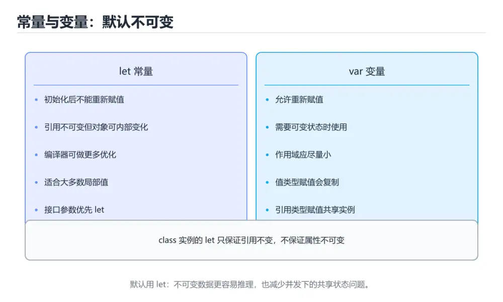
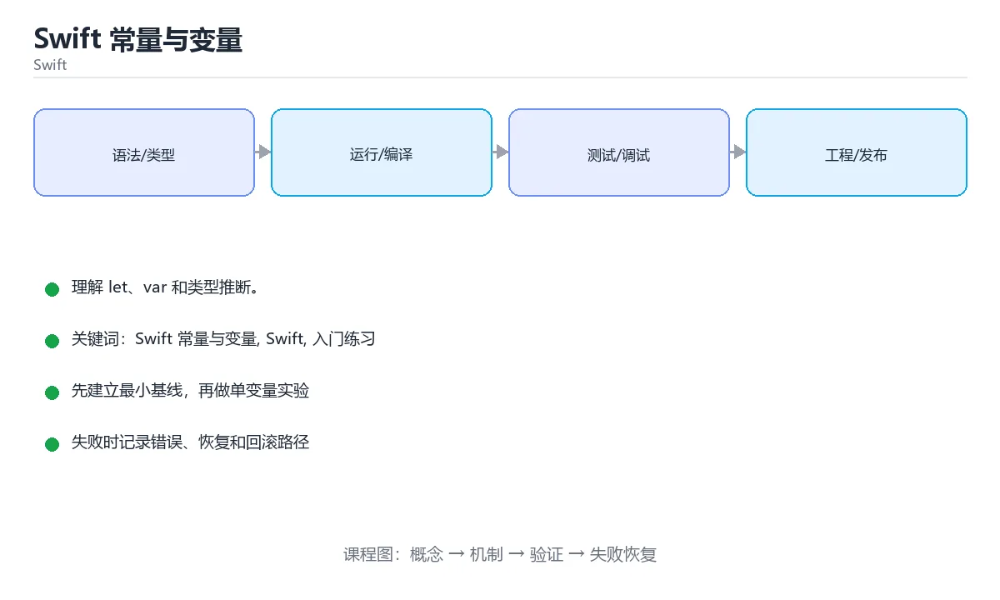

# Swift 常量与变量





> 内容更新时间：2026-10-03 · 学习阶段：入门 · 预计用时：15 分钟

## 学习目标

- 先认识「Swift 常量与变量」需要的工具、输入和输出。
- 按步骤运行最小示例，并记录结果与错误。
- 用一个边界输入验证自己是否真正掌握。

## 前置知识

- 会进行基本的文件或命令行操作。
- 不需要预先掌握「Swift」的高级知识。

## 一句话入门

理解 let、var 和类型推断。

## 最小示例

```swift
let name = "Ada"
var year = 1815
year += 1
print("\(name) \(year)")
```

## 预期输出

```text
Ada 1816
```

## 常见错误

- 强制解包 nil 可选值，运行时崩溃。
- 复制命令时遗漏空格、引号或必要参数。

## 动手练习

1. 原样运行最小示例，保存命令和输出。
2. 把数字 2 改成 10，预测并验证新结果。
3. 制造一个错误输入，写出错误信息和修复方法。

## 本课小结

- 入门阶段先保证能运行、能观察、能解释，再追求复杂功能。
- 每次只改一个变量，记录预测与实际结果。
- 遇到错误先看第一条错误信息，再回到最小示例。


## 代码实验：把示例跑成证据

这一节不引入新语法，而是把「Swift 常量与变量」的最小示例变成可以复现、可以对照的实验。每次只改变一个条件，先写预测，再运行，最后解释差异。

### 实验一：建立基线

```swift
let name = "Ada"
var year = 1815
year += 1
print("\(name) \(year)")
```

先原样运行上面的代码，记录命令、完整输出和退出状态。然后把输出与正文的预期输出逐字对照，不要用“看起来差不多”代替核对；空格、大小写、换行和错误流向都可能暴露环境差异。

### 实验二：只改一个输入

从代码中选一个会影响结果的字面量、参数或输入，把它替换成边界值：数值可尝试 0、1、最大值和最小值，字符串可尝试空串和超长文本，集合可尝试空集合、单元素和重复元素。先写出预测，再运行并记录实际结果。

### 实验三：制造一个可控错误

把输入改成空值、极值或类型不匹配的形式，记录程序抛出的第一条错误、发生位置和恢复方式。

| 实验 | 改动 | 预测 | 实际 | 结论 |
| --- | --- | --- | --- | --- |
| 基线 | 保持原样 |  |  |  |
| 边界 |  |  |  |  |
| 失败 |  |  |  |  |

### 实验四：用三句话复述

1. 输入是什么，哪些输入属于合法范围，哪些属于边界或非法范围？
2. 程序按什么顺序处理输入，在哪一步产生了状态变化或副作用？
3. 输出如何验证，失败时第一条可观察证据是什么？

## Swift 基础机制速览

### 编译、常量与变量

Swift 使用 LLVM 编译成原生代码，Xcode 和 Swift Package Manager 是主要工具链。`let` 声明常量，`var` 声明变量；优先使用 let，让编译器帮助你发现意外修改。类型推断根据初始值确定类型，公共 API 和复杂表达式仍应显式标注。字符串、数组、字典和集合都有值语义，赋值或传参时发生写时复制，修改副本通常不会影响原值。

### 可选值、解包与空安全

`Optional` 表示可能有值也可能为 nil，必须显式处理。`if let`、`guard let`、`??` 和可选链 `?.` 是常用解包方式；强制解包 `!` 只应在逻辑上绝不可能为空且有测试保证时使用。`guard` 适合提前退出，让正常路径保持在函数主体层级。区分“值为 nil”和“值为空字符串/空数组”，不要把两者混为一谈。

### 函数、闭包与参数标签

Swift 函数支持参数标签、默认参数、可变参数、输入输出参数和抛出错误。参数标签让调用点更接近自然语言，`_` 可以省略标签。闭包捕获外部变量，默认是引用捕获；需要修改捕获值或在并发环境中使用时，要明确捕获列表和所有权。尾随闭包语法让回调、排序和异步代码更易读，但嵌套过深时应提取成命名函数。

### 结构体、类、协议与扩展

结构体是值类型，类是引用类型；优先使用结构体表达数据，除非需要继承、身份或共享可变状态。协议定义能力契约，扩展可以为已有类型添加方法，泛型让算法适用于多种类型。协议组合、关联类型和 existential 各有取舍。属性观察器、计算属性和懒加载属性让状态管理更清晰，但要避免在初始化完成前访问依赖属性。

### 内存、并发与错误处理

Swift 使用 ARC 自动管理引用计数，强引用循环会让对象无法释放；闭包捕获 self 时使用 `[weak self]` 或 `[unowned self]` 要理解生命周期。错误用 `throws` 和 `try` 传播，`defer` 负责清理。结构化并发使用 async/await、Task 和 actor 隔离共享状态；并发代码仍要处理取消、优先级和数据竞争。测试时分别覆盖值语义、可选值边界和异步失败路径。

## 考点精讲：把测验题还原成判断过程

本课有 5 个判断点。先自己作答，再看「判断依据」；如果结论正确但理由不完整，回到正文对应章节补足概念。

### 考点 1：Swift 中 let 与 var 的区别是？

- **正确判断**：let 声明常量不能重新赋值，var 声明变量可以修改
- **判断依据**：正确答案是「let 声明常量不能重新赋值，var 声明变量可以修改」，这道题在问Swift中let与var的区别是，判断时要把题干限定的输入、边界与目标逐项对齐。let 绑定的值一旦设定就不能再改变，var 可以在之后重新赋值。课程摘要指出理解 let，var 和类型推断，本课要判断的正是Swift中let与var的区别是。
- **迁移检查**：遮住选项，只根据定义复述一次答案，再回来看哪个选项与复述一致。

### 考点 2：示例中 var year = 1815 之后执行 year += 1，输出会是什么？

- **正确判断**：Ada 1816，变量自增后再参与字符串插值
- **判断依据**：正确答案是「Ada 1816，变量自增后再参与字符串插值」，这道题在问示例中varyear=1815之后执行year+=1，输出会是什么，判断时要把题干限定的输入、边界与目标逐项对齐。var 允许修改，year += 1 把 1815 更新为 1816，随后字符串插值读取最新值输出 Ada 1816。
- **迁移检查**：把题干里的一个条件换成边界值，原来的结论还成立吗？写出判断过程。

### 考点 3：字符串写法 "\(name) \(year)" 中的 \() 起什么作用？

- **正确判断**：把变量的值插入字符串，称为字符串插值
- **判断依据**：正确答案是「把变量的值插入字符串，称为字符串插值」，这道题在问字符串写法"\(name)\(year)"中的\()起什么作用，判断时要把题干限定的输入、边界与目标逐项对齐。反斜杠加括号是 Swift 的字符串插值语法，括号内可以写变量、属性或表达式，运行时求值并转换成文本插入。
- **迁移检查**：如果给某个错误选项去掉一个限定词，它会不会变成正确？说明理由。

### 考点 4：Swift 的类型推断指的是？

- **正确判断**：根据初始值自动确定变量类型，无需写出类型标注
- **判断依据**：正确答案是「根据初始值自动确定变量类型，无需写出类型标注」，这道题在问Swift的类型推断指的是，判断时要把题干限定的输入、边界与目标逐项对齐。写 let name = "Ada" 时，编译器根据字面量推断出 String，既保证类型安全又省去重复标注。Swift 的类型推断指的是。
- **迁移检查**：如果给某个错误选项去掉一个限定词，它会不会变成正确？说明理由。

### 考点 5：填空：「Swift 常量与变量」术语速查中，表示「Swift 使用 LLVM 编译成原生代码，Xcode 和 Swift Package Manager 是主要工具链。`____` 声明常量，`var` 声明变量；优先使用 ____，让编译器帮助你发现意外修改。类型推断根据初始值确定类型，公共…」的术语是什么？

- **正确判断**：let
- **判断依据**：let 声明常量，var 声明变量。本课示例中还能看到 `let name = "Ada"` 这样的用法，说明该关键字在本课代码中承担实际功能。课程摘要指出理解 let，var 和类型推断，本课要判断的正是填空：Swift常量与变量术语速查中，表示Swift…断根据初始值确定类型，公共…的术语是什么。
- **迁移检查**：把答案换成另一种等价写法，是否仍然正确？说明依据。

## 本课复习清单

离开本课前，逐项确认：

- [ ] 不看解析，能说出「Swift 中 let 与 var 的区别是？」的判断依据。
- [ ] 不看解析，能说出「示例中 var year = 1815 之后执行 year += 1，输出会是什…」的判断依据。
- [ ] 不看解析，能说出「字符串写法 "\(name) \(year)" 中的 \() 起什么作用？」的判断依据。
- [ ] 不看解析，能说出「Swift 的类型推断指的是？」的判断依据。
- [ ] 不看解析，能说出「填空：「Swift 常量与变量」术语速查中，表示「Swift 使用 LLVM 编…」的判断依据。
- [ ] 至少运行一次本课示例，记录输入、输出和一个边界情况。
- [ ] 把本课最容易混淆的两个概念写成一句话对照。

| 复盘项 | 记录 |
| --- | --- |
| 已经能独立解释的考点 |  |
| 仍然说不清的概念 |  |
| 下一步验证动作 |  |

## 逐节复习与自检

下面按正文顺序回顾每一节，并给出一个自检问题；说不清的地方回到原章节补课。

### 最小示例

```swift
let name = "Ada"
var year = 1815
year += 1
print("\(name) \(year)")
```

自检：这一节与相邻主题的边界在哪里？

### 预期输出

```text
Ada 1816
```

自检：这一节与相邻主题的边界在哪里？

### 动手练习

把数字 2 改成 10，预测并验证新结果。制造一个错误输入，写出错误信息和修复方法。

自检：如果去掉这一节里的一个前提，结论会怎样变化？

### 语言专项实践：Swift 常量与变量

围绕「Swift 常量与变量、Swift、入门练习」说明变量生命周期、资源释放、并发模型和错误传播。语言语法只是入口，真正决定行为的是运行时、标准库和平台约束。

自检：把这一节讲给没学过的人，最需要强调哪一点？

## 术语速查

把本课反复出现的术语集中放在一起。复习时先遮住右列，尝试用自己的话解释，再回到正文核对。

| 术语 | 本课语境 |
| --- | --- |
| `let` | Swift 使用 LLVM 编译成原生代码，Xcode 和 Swift Package Manager 是主要工具链。`let` 声明常量，`var` 声明变量；优先使用 let，让编译器帮助你发现意外修改。类型推断根据… |
| `var` | Swift 使用 LLVM 编译成原生代码，Xcode 和 Swift Package Manager 是主要工具链。`let` 声明常量，`var` 声明变量；优先使用 let，让编译器帮助你发现意外修改。类型推断根据… |
| `Optional` | `Optional` 表示可能有值也可能为 nil，必须显式处理。`if let`、`guard let`、`??` 和可选链 `?.` 是常用解包方式；强制解包 `!` 只应在逻辑上绝不可能为空且有测试保证时使用。`g… |
| `if let` | `Optional` 表示可能有值也可能为 nil，必须显式处理。`if let`、`guard let`、`??` 和可选链 `?.` 是常用解包方式；强制解包 `!` 只应在逻辑上绝不可能为空且有测试保证时使用。`g… |
| `guard let` | `Optional` 表示可能有值也可能为 nil，必须显式处理。`if let`、`guard let`、`??` 和可选链 `?.` 是常用解包方式；强制解包 `!` 只应在逻辑上绝不可能为空且有测试保证时使用。`g… |
| `??` | `Optional` 表示可能有值也可能为 nil，必须显式处理。`if let`、`guard let`、`??` 和可选链 `?.` 是常用解包方式；强制解包 `!` 只应在逻辑上绝不可能为空且有测试保证时使用。`g… |
| `?.` | `Optional` 表示可能有值也可能为 nil，必须显式处理。`if let`、`guard let`、`??` 和可选链 `?.` 是常用解包方式；强制解包 `!` 只应在逻辑上绝不可能为空且有测试保证时使用。`g… |
| `只应在逻辑上绝不可能为空且有测试保证时使用。` | `Optional` 表示可能有值也可能为 nil，必须显式处理。`if let`、`guard let`、`??` 和可选链 `?.` 是常用解包方式；强制解包 `!` 只应在逻辑上绝不可能为空且有测试保证时使用。`g… |
| `[weak self]` | Swift 使用 ARC 自动管理引用计数，强引用循环会让对象无法释放；闭包捕获 self 时使用 `[weak self]` 或 `[unowned self]` 要理解生命周期。错误用 `throws` 和 `try… |
| `[unowned self]` | Swift 使用 ARC 自动管理引用计数，强引用循环会让对象无法释放；闭包捕获 self 时使用 `[weak self]` 或 `[unowned self]` 要理解生命周期。错误用 `throws` 和 `try… |
| `throws` | Swift 使用 ARC 自动管理引用计数，强引用循环会让对象无法释放；闭包捕获 self 时使用 `[weak self]` 或 `[unowned self]` 要理解生命周期。错误用 `throws` 和 `try… |
| `try` | Swift 使用 ARC 自动管理引用计数，强引用循环会让对象无法释放；闭包捕获 self 时使用 `[weak self]` 或 `[unowned self]` 要理解生命周期。错误用 `throws` 和 `try… |

## 面试问答与自测

下面把本课考点换成面试追问。先口述自己的答案，
再对照参考回答检查是否遗漏了前提、边界或失败路径。

### 追问 1：Swift 中 let 与 var 的区别是？

**参考回答**：正确答案是「let 声明常量不能重新赋值，var 声明变量可以修改」，这道题在问Swift中let与var的区别是，判断时要把题干限定的输入、边界与目标逐项对齐。let 绑定的值一旦设定就不能再改变，var 可以在之后重新赋值。课程摘要指出理解 let，var 和类型推断，本课要判断的正是Swift中let与var的区别是。

### 追问 2：示例中 var year = 1815 之后执行 year += 1，输出会是什么？

**参考回答**：正确答案是「Ada 1816，变量自增后再参与字符串插值」，这道题在问示例中varyear=1815之后执行year+=1，输出会是什么，判断时要把题干限定的输入、边界与目标逐项对齐。var 允许修改，year += 1 把 1815 更新为 1816，随后字符串插值读取最新值输出 Ada 1816。

### 追问 3：字符串写法 "\(name) \(year)" 中的 \() 起什么作用？

**参考回答**：正确答案是「把变量的值插入字符串，称为字符串插值」，这道题在问字符串写法"\(name)\(year)"中的\()起什么作用，判断时要把题干限定的输入、边界与目标逐项对齐。反斜杠加括号是 Swift 的字符串插值语法，括号内可以写变量、属性或表达式，运行时求值并转换成文本插入。

### 追问 4：Swift 的类型推断指的是？

**参考回答**：正确答案是「根据初始值自动确定变量类型，无需写出类型标注」，这道题在问Swift的类型推断指的是，判断时要把题干限定的输入、边界与目标逐项对齐。写 let name = "Ada" 时，编译器根据字面量推断出 String，既保证类型安全又省去重复标注。Swift 的类型推断指的是。

### 追问 5：填空：「Swift 常量与变量」术语速查中，表示「Swift 使用 LLVM 编译成原生代码，Xcode 和 Swift Package Manager 是主要工具链。`____` 声明常量，`var` 声明变量；优先使用 ____，让编译器帮助你发现意外修改。类型推断根据初始值确定类型，公共…」的术语是什么？

**参考回答**：let 声明常量，var 声明变量。本课示例中还能看到 `let name = "Ada"` 这样的用法，说明该关键字在本课代码中承担实际功能。课程摘要指出理解 let，var 和类型推断，本课要判断的正是填空：Swift常量与变量术语速查中，表示Swift…断根据初始值确定类型，公共…的术语是什么。

<!-- p0-depth-v2:start -->
## 零基础精讲：把「Swift 常量与变量」真正讲透

### 先建立一个直觉

把「Swift 常量与变量」看成一个有输入、处理、输出和失败边界的工程问题。先定义什么叫正确，再讨论性能和扩展。

本课的摘要可以当作一张地图：理解 let、var 和类型推断。

阅读时不要只记结论，先问三个问题：它解决什么问题？依赖哪些前提？在什么条件下会失效？

### 逐步拆解

1. 识别输入。先写清数据类型、取值范围、空值策略，以及输入来自用户、文件还是另一个服务。
2. 描述处理过程。把「Swift 常量与变量、Swift、入门练习」映射到具体步骤，每步都要求能单独验证。
3. 定义输出。输出不仅包括正常结果，还包括错误码、日志、指标和资源释放状态。
4. 找出一条失败路径。让错误尽早暴露，并说明重试、降级、回滚或人工处理的边界。
5. 用一个小例子贯穿全过程。先手算或预测结果，再运行代码或实验，最后解释差异。

### 把正文串成一条执行链

- **实验一：建立基线**：先原样运行上面的代码，记录命令、完整输出和退出状态
- **实验二：只改一个输入**：从代码中选一个会影响结果的字面量、参数或输入，把它替换成边界值：数值可尝试 0、1、最大值和最小值，字符串可尝试空串和超长文本，集合可尝试空集合、单元素和重复元素
- **实验三：制造一个可控错误**：实验三：制造一个可控错误
- **实验四：用三句话复述**：1. 输入是什么，哪些输入属于合法范围，哪些属于边界或非法范围
- **编译、常量与变量**：Swift 使用 LLVM 编译成原生代码，Xcode 和 Swift Package Manager 是主要工具链
- **可选值、解包与空安全**：`Optional` 表示可能有值也可能为 nil，必须显式处理

### 从测验反推易错点

**检查点 1：Swift 中 let 与 var 的区别是？**

- 参考判断：let 声明常量不能重新赋值，var 声明变量可以修改
- 解析：正确答案是「let 声明常量不能重新赋值，var 声明变量可以修改」，这道题在问Swift中let与var的区别是，判断时要把题干限定的输入、边界与目标逐项对齐。let 绑定的值一旦设定就不能再改变，var 可以在之后重新赋值。课程摘要指出理解 let，var 和类型推断，本课要判断的正是Swift中let与var的区别是。
- 自问：如果去掉题干里的一个限定词，结论还成立吗？

**检查点 2：示例中 var year = 1815 之后执行 year += 1，输出会是什么？**

- 参考判断：Ada 1816，变量自增后再参与字符串插值
- 解析：正确答案是「Ada 1816，变量自增后再参与字符串插值」，这道题在问示例中varyear=1815之后执行year+=1，输出会是什么，判断时要把题干限定的输入、边界与目标逐项对齐。var 允许修改，year += 1 把 1815 更新为 1816，随后字符串插值读取最新值输出 Ada 1816。
- 自问：如果去掉题干里的一个限定词，结论还成立吗？

**检查点 3：字符串写法 "\(name) \(year)" 中的 \() 起什么作用？**

- 参考判断：把变量的值插入字符串，称为字符串插值
- 解析：正确答案是「把变量的值插入字符串，称为字符串插值」，这道题在问字符串写法"\(name)\(year)"中的\()起什么作用，判断时要把题干限定的输入、边界与目标逐项对齐。反斜杠加括号是 Swift 的字符串插值语法，括号内可以写变量、属性或表达式，运行时求值并转换成文本插入。
- 自问：如果去掉题干里的一个限定词，结论还成立吗？

**检查点 4：Swift 的类型推断指的是？**

- 参考判断：根据初始值自动确定变量类型，无需写出类型标注
- 解析：正确答案是「根据初始值自动确定变量类型，无需写出类型标注」，这道题在问Swift的类型推断指的是，判断时要把题干限定的输入、边界与目标逐项对齐。写 let name = "Ada" 时，编译器根据字面量推断出 String，既保证类型安全又省去重复标注。Swift 的类型推断指的是。
- 自问：如果去掉题干里的一个限定词，结论还成立吗？

**检查点 5：填空：「Swift 常量与变量」术语速查中，表示「Swift 使用 LLVM 编译成原生代码，Xcode 和…**

- 参考判断：let
- 解析：let 声明常量，var 声明变量。本课示例中还能看到 `let name = "Ada"` 这样的用法，说明该关键字在本课代码中承担实际功能。课程摘要指出理解 let，var 和类型推断，本课要判断的正是填空：Swift常量与变量术语速查中，表示Swift…断根据初始值确定类型，公共…的术语是什么。
- 自问：如果去掉题干里的一个限定词，结论还成立吗？

### 工程排错顺序

| 先查什么 | 要得到的证据 | 判断标准 |
| --- | --- | --- |
| 输入与前提是否满足 | 日志、输入样例、测试或指标 | 能复现并解释，才算定位 |
| 核心步骤是否产生了预期中间结果 | 日志、输入样例、测试或指标 | 能复现并解释，才算定位 |
| 失败路径是否可观测、可恢复 | 日志、输入样例、测试或指标 | 能复现并解释，才算定位 |
| 资源、权限与成本是否在预算内 | 日志、输入样例、测试或指标 | 能复现并解释，才算定位 |

排查顺序应遵循「先复现、再缩小范围、再验证假设、最后修改」。不要同时改多个变量，否则即使问题消失，也无法知道真正原因。

### 变式训练

1. 把它放进一个只有单机、没有额外依赖的小项目，先保证正确，再考虑扩展。
2. 把输入规模扩大十倍，记录时间、内存和失败路径，找出第一个真正瓶颈。
3. 制造一次依赖超时或错误输入，要求系统给出可解释错误并且不留下半完成状态。
4. 让另一个同学只读接口说明和测试用例，复现你的结论；无法复现的部分继续补文档或测试。
5. 删掉一个看似必要的步骤，观察哪个测试或指标先失败，用证据说明它为什么必要。
6. 把方案切换到低资源设备，重新评估默认参数、超时和降级策略。

每道变式都写下：预测、实际结果、差异、下一步。没有留下证据的练习，很难迁移到真实项目。

### 本课自测

- [ ] 能用一句话解释「Swift 常量与变量」在本课中的角色与边界。
- [ ] 能举出一个正常例子和一个失败例子。
- [ ] 能说出最小验证步骤，以及需要记录的证据。
- [ ] 能用一句话解释「Swift」在本课中的角色与边界。
- [ ] 能举出一个正常例子和一个失败例子。
- [ ] 能说出最小验证步骤，以及需要记录的证据。
- [ ] 能用一句话解释「入门练习」在本课中的角色与边界。
- [ ] 能举出一个正常例子和一个失败例子。
- [ ] 能说出最小验证步骤，以及需要记录的证据。
- [ ] 能用一句话解释「Swift 常量与变量」在本课中的角色与边界。
- [ ] 能举出一个正常例子和一个失败例子。
- [ ] 能说出最小验证步骤，以及需要记录的证据。
- [ ] 能用一句话解释「Swift」在本课中的角色与边界。
- [ ] 能举出一个正常例子和一个失败例子。
- [ ] 能说出最小验证步骤，以及需要记录的证据。

### 迁移案例库

下面用不同约束重复同一套方法。每完成一轮，都把结论写进笔记，并只改变一个变量。

#### 迁移案例 1：围绕「Swift 常量与变量」做一次小实验

**目标**：在不改变课程主体的前提下，验证「Swift 常量与变量」中的一个关键判断。

**步骤**：
1. 复述当前方案对「Swift 常量与变量」的假设，写成一句可证伪的话。
2. 设计一个正常输入和一个边界输入，分别预测输出。
3. 运行或逐步演算，记录实际输出、耗时和失败信息。
4. 只调整一个参数，比较前后差异并解释原因。
5. 补充一条测试或复习卡，确保下次能更快复现。

**验收**：结论有证据、差异可解释、失败可恢复；如果做不到，说明还需要缩小问题范围。

#### 迁移案例 2：围绕「Swift」做一次小实验

**目标**：在不改变课程主体的前提下，验证「Swift 常量与变量」中的一个关键判断。

**步骤**：
1. 复述当前方案对「Swift」的假设，写成一句可证伪的话。
2. 设计一个正常输入和一个边界输入，分别预测输出。
3. 运行或逐步演算，记录实际输出、耗时和失败信息。
4. 只调整一个参数，比较前后差异并解释原因。
5. 补充一条测试或复习卡，确保下次能更快复现。

**验收**：结论有证据、差异可解释、失败可恢复；如果做不到，说明还需要缩小问题范围。

#### 迁移案例 3：围绕「入门练习」做一次小实验

**目标**：在不改变课程主体的前提下，验证「Swift 常量与变量」中的一个关键判断。

**步骤**：
1. 复述当前方案对「入门练习」的假设，写成一句可证伪的话。
2. 设计一个正常输入和一个边界输入，分别预测输出。
3. 运行或逐步演算，记录实际输出、耗时和失败信息。
4. 只调整一个参数，比较前后差异并解释原因。
5. 补充一条测试或复习卡，确保下次能更快复现。

**验收**：结论有证据、差异可解释、失败可恢复；如果做不到，说明还需要缩小问题范围。

#### 迁移案例 4：围绕「Swift 常量与变量」做一次小实验

**目标**：在不改变课程主体的前提下，验证「Swift 常量与变量」中的一个关键判断。

**步骤**：
1. 复述当前方案对「Swift 常量与变量」的假设，写成一句可证伪的话。
2. 设计一个正常输入和一个边界输入，分别预测输出。
3. 运行或逐步演算，记录实际输出、耗时和失败信息。
4. 只调整一个参数，比较前后差异并解释原因。
5. 补充一条测试或复习卡，确保下次能更快复现。

**验收**：结论有证据、差异可解释、失败可恢复；如果做不到，说明还需要缩小问题范围。

#### 迁移案例 5：围绕「Swift」做一次小实验

**目标**：在不改变课程主体的前提下，验证「Swift 常量与变量」中的一个关键判断。

**步骤**：
1. 复述当前方案对「Swift」的假设，写成一句可证伪的话。
2. 设计一个正常输入和一个边界输入，分别预测输出。
3. 运行或逐步演算，记录实际输出、耗时和失败信息。
4. 只调整一个参数，比较前后差异并解释原因。
5. 补充一条测试或复习卡，确保下次能更快复现。

**验收**：结论有证据、差异可解释、失败可恢复；如果做不到，说明还需要缩小问题范围。

#### 迁移案例 6：围绕「入门练习」做一次小实验

**目标**：在不改变课程主体的前提下，验证「Swift 常量与变量」中的一个关键判断。

**步骤**：
1. 复述当前方案对「入门练习」的假设，写成一句可证伪的话。
2. 设计一个正常输入和一个边界输入，分别预测输出。
3. 运行或逐步演算，记录实际输出、耗时和失败信息。
4. 只调整一个参数，比较前后差异并解释原因。
5. 补充一条测试或复习卡，确保下次能更快复现。

**验收**：结论有证据、差异可解释、失败可恢复；如果做不到，说明还需要缩小问题范围。

#### 迁移案例 7：围绕「Swift 常量与变量」做一次小实验

**目标**：在不改变课程主体的前提下，验证「Swift 常量与变量」中的一个关键判断。

**步骤**：
1. 复述当前方案对「Swift 常量与变量」的假设，写成一句可证伪的话。
2. 设计一个正常输入和一个边界输入，分别预测输出。
3. 运行或逐步演算，记录实际输出、耗时和失败信息。
4. 只调整一个参数，比较前后差异并解释原因。
5. 补充一条测试或复习卡，确保下次能更快复现。

**验收**：结论有证据、差异可解释、失败可恢复；如果做不到，说明还需要缩小问题范围。

#### 迁移案例 8：围绕「Swift」做一次小实验

**目标**：在不改变课程主体的前提下，验证「Swift 常量与变量」中的一个关键判断。

**步骤**：
1. 复述当前方案对「Swift」的假设，写成一句可证伪的话。
2. 设计一个正常输入和一个边界输入，分别预测输出。
3. 运行或逐步演算，记录实际输出、耗时和失败信息。
4. 只调整一个参数，比较前后差异并解释原因。
5. 补充一条测试或复习卡，确保下次能更快复现。

**验收**：结论有证据、差异可解释、失败可恢复；如果做不到，说明还需要缩小问题范围。

#### 迁移案例 9：围绕「入门练习」做一次小实验

**目标**：在不改变课程主体的前提下，验证「Swift 常量与变量」中的一个关键判断。

**步骤**：
1. 复述当前方案对「入门练习」的假设，写成一句可证伪的话。
2. 设计一个正常输入和一个边界输入，分别预测输出。
3. 运行或逐步演算，记录实际输出、耗时和失败信息。
4. 只调整一个参数，比较前后差异并解释原因。
5. 补充一条测试或复习卡，确保下次能更快复现。

**验收**：结论有证据、差异可解释、失败可恢复；如果做不到，说明还需要缩小问题范围。

#### 迁移案例 10：围绕「Swift 常量与变量」做一次小实验

**目标**：在不改变课程主体的前提下，验证「Swift 常量与变量」中的一个关键判断。

**步骤**：
1. 复述当前方案对「Swift 常量与变量」的假设，写成一句可证伪的话。
2. 设计一个正常输入和一个边界输入，分别预测输出。
3. 运行或逐步演算，记录实际输出、耗时和失败信息。
4. 只调整一个参数，比较前后差异并解释原因。
5. 补充一条测试或复习卡，确保下次能更快复现。

**验收**：结论有证据、差异可解释、失败可恢复；如果做不到，说明还需要缩小问题范围。

#### 迁移案例 11：围绕「Swift」做一次小实验

**目标**：在不改变课程主体的前提下，验证「Swift 常量与变量」中的一个关键判断。

**步骤**：
1. 复述当前方案对「Swift」的假设，写成一句可证伪的话。
2. 设计一个正常输入和一个边界输入，分别预测输出。
3. 运行或逐步演算，记录实际输出、耗时和失败信息。
4. 只调整一个参数，比较前后差异并解释原因。
5. 补充一条测试或复习卡，确保下次能更快复现。

**验收**：结论有证据、差异可解释、失败可恢复；如果做不到，说明还需要缩小问题范围。

#### 迁移案例 12：围绕「入门练习」做一次小实验

**目标**：在不改变课程主体的前提下，验证「Swift 常量与变量」中的一个关键判断。

**步骤**：
1. 复述当前方案对「入门练习」的假设，写成一句可证伪的话。
2. 设计一个正常输入和一个边界输入，分别预测输出。
3. 运行或逐步演算，记录实际输出、耗时和失败信息。
4. 只调整一个参数，比较前后差异并解释原因。
5. 补充一条测试或复习卡，确保下次能更快复现。

**验收**：结论有证据、差异可解释、失败可恢复；如果做不到，说明还需要缩小问题范围。

#### 迁移案例 13：围绕「Swift 常量与变量」做一次小实验

**目标**：在不改变课程主体的前提下，验证「Swift 常量与变量」中的一个关键判断。

**步骤**：
1. 复述当前方案对「Swift 常量与变量」的假设，写成一句可证伪的话。
2. 设计一个正常输入和一个边界输入，分别预测输出。
3. 运行或逐步演算，记录实际输出、耗时和失败信息。
4. 只调整一个参数，比较前后差异并解释原因。
5. 补充一条测试或复习卡，确保下次能更快复现。

**验收**：结论有证据、差异可解释、失败可恢复；如果做不到，说明还需要缩小问题范围。

#### 迁移案例 14：围绕「Swift」做一次小实验

**目标**：在不改变课程主体的前提下，验证「Swift 常量与变量」中的一个关键判断。

**步骤**：
1. 复述当前方案对「Swift」的假设，写成一句可证伪的话。
2. 设计一个正常输入和一个边界输入，分别预测输出。
3. 运行或逐步演算，记录实际输出、耗时和失败信息。
4. 只调整一个参数，比较前后差异并解释原因。
5. 补充一条测试或复习卡，确保下次能更快复现。

**验收**：结论有证据、差异可解释、失败可恢复；如果做不到，说明还需要缩小问题范围。

#### 迁移案例 15：围绕「入门练习」做一次小实验

**目标**：在不改变课程主体的前提下，验证「Swift 常量与变量」中的一个关键判断。

**步骤**：
1. 复述当前方案对「入门练习」的假设，写成一句可证伪的话。
2. 设计一个正常输入和一个边界输入，分别预测输出。
3. 运行或逐步演算，记录实际输出、耗时和失败信息。
4. 只调整一个参数，比较前后差异并解释原因。
5. 补充一条测试或复习卡，确保下次能更快复现。

**验收**：结论有证据、差异可解释、失败可恢复；如果做不到，说明还需要缩小问题范围。

#### 迁移案例 16：围绕「Swift 常量与变量」做一次小实验

**目标**：在不改变课程主体的前提下，验证「Swift 常量与变量」中的一个关键判断。

**步骤**：
1. 复述当前方案对「Swift 常量与变量」的假设，写成一句可证伪的话。
2. 设计一个正常输入和一个边界输入，分别预测输出。
3. 运行或逐步演算，记录实际输出、耗时和失败信息。
4. 只调整一个参数，比较前后差异并解释原因。
5. 补充一条测试或复习卡，确保下次能更快复现。

**验收**：结论有证据、差异可解释、失败可恢复；如果做不到，说明还需要缩小问题范围。

<!-- p0-depth-v2:end -->

## English Overview

**Title:** Swift Constants and Variables

**Summary:** Learn let, var and type inference.

**Category:** Swift  
**Level:** 入门  
**Key terms:** Swift 常量与变量, Swift, 入门练习

> The full tutorial is written in Chinese. This bilingual overview helps English readers identify the topic, scope and key terms before studying the detailed examples.

## 内容元数据

- 内容版本：v2.0
- 最后更新：2026-10-03
- 学习阶段：入门
- 适用环境：Swift 6 / Xcode 16+
- 内容来源：内置结构化课程与工程实践整理
- 相关主题：Swift 常量与变量、Swift、入门练习
- 质量版本：P0 测验标准 + P1 覆盖扩展 + P2 体验补全


## 语言专项实践：Swift 常量与变量

### 一、工具链

| 阶段 | 推荐工具 | 验收标准 |
| --- | --- | --- |
| 编译构建 | swiftc / xcodebuild | 命令可复现且错误能被定位 |
| 测试 | XCTest + async 测试 | 命令可复现且错误能被定位 |
| 性能 | Instruments / signpost | 命令可复现且错误能被定位 |
| 发布 | TestFlight + App Store 审核 | 命令可复现且错误能被定位 |

### 二、运行时与内存模型

围绕「Swift 常量与变量、Swift、入门练习」说明变量生命周期、资源释放、并发模型和错误传播。语言语法只是入口，真正决定行为的是运行时、标准库和平台约束。

### 三、测试策略

- 单元测试覆盖核心规则和边界。
- 集成测试覆盖文件、网络、数据库或平台 API。
- 失败测试覆盖超时、取消、异常和资源耗尽。
- 性能测试记录基线，避免只凭感觉优化。

### 四、发布检查

- [ ] 版本和依赖锁定，构建可复现。
- [ ] 产物经过签名、校验和最小权限配置。
- [ ] 日志不泄露密钥和个人信息。
- [ ] 有升级、回滚和故障恢复说明。


## 参考资料与复核

- 最后复核：2026-10-04
- 下次复核：2027-04-04
- 复核范围：版本兼容、API 行为、安全建议与工程实践
- 来源性质：官方文档与标准；本课正文为离线教学重组，不复制原文

| 参考资料 | 本课用途 |
| --- | --- |
| [Swift 官方文档](https://www.swift.org/documentation/) | 语言、并发与包管理 |
| [Apple Developer](https://developer.apple.com/documentation/swift) | 平台 API 与工具链 |

> 本课主题：理解 let、var 和类型推断。

> App 完全离线展示文字链接，不会自动联网；需要延伸阅读时可复制链接到浏览器。

<!-- code-practice:v1:start -->

## 代码练习（6 题）

下面题目与课程测验同源：覆盖代码输出、排错与场景判断。建议先自己写出答案，再到「测验」里核对成绩。

### 练习 1 · 代码输出

在 Swift 课程“Swift 常量与变量”的函数实验里，这段代码运行后输出什么？

```swift
let x = 7
print(x)
```

- A. 14
- B. 6
- C. 8
- D. 7

**参考答案**：D. 7
**参考输出**：`7`

**解析**

在 Swift 课程“Swift 常量与变量”的函数代码实验里，程序先完成赋值、循环或函数调用，再把结果写到标准输出，因此正确结果是 7。
判断 Swift 课程“Swift 常量与变量”的代码输出时，要把“源码写了什么”和“运行时实际打印什么”分开；变量值和循环边界都会直接改变最终结果。
把 7 当作基线后，可以只改一个输入或一个边界，再观察 Swift 课程“Swift 常量与变量”的输出如何变化，这就是验证掌握程度的方法。

### 练习 2 · 代码输出

在 Swift 课程“Swift 常量与变量”的集合实验里，这段代码运行后输出什么？

```swift
var total = 0
for i in 1...4 {
    total += i
}
print(total)
```

- A. 10
- B. 9
- C. 11
- D. 20

**参考答案**：A. 10
**参考输出**：`10`

**解析**

在 Swift 课程“Swift 常量与变量”的集合代码实验里，程序先完成赋值、循环或函数调用，再把结果写到标准输出，因此正确结果是 10。
判断 Swift 课程“Swift 常量与变量”的代码输出时，要把“源码写了什么”和“运行时实际打印什么”分开；变量值和循环边界都会直接改变最终结果。
把 10 当作基线后，可以只改一个输入或一个边界，再观察 Swift 课程“Swift 常量与变量”的输出如何变化，这就是验证掌握程度的方法。

### 练习 3 · 代码输出

在 Swift 课程“Swift 常量与变量”的条件实验里，这段代码运行后输出什么？

```swift
func double(_ value: Int) -> Int {
    return value * 2
}

print(double(4))
```

- A. 16
- B. 7
- C. 9
- D. 8

**参考答案**：D. 8
**参考输出**：`8`

**解析**

在 Swift 课程“Swift 常量与变量”的条件代码实验里，程序先完成赋值、循环或函数调用，再把结果写到标准输出，因此正确结果是 8。
判断 Swift 课程“Swift 常量与变量”的代码输出时，要把“源码写了什么”和“运行时实际打印什么”分开；变量值和循环边界都会直接改变最终结果。
把 8 当作基线后，可以只改一个输入或一个边界，再观察 Swift 课程“Swift 常量与变量”的输出如何变化，这就是验证掌握程度的方法。

### 练习 4 · 代码排错

Swift 课程“Swift 常量与变量”的下面这段代码无法运行，最可能的修复是什么？

```swift
let score = 7
if score > 0
    print("positive")
```

- A. 把变量名改成另一个单词即可
- B. 给 if 分支补上花括号
- C. 把输出语句整段删除，代码就会自动修复
- D. 重新安装运行时并清空所有缓存

**参考答案**：B. 给 if 分支补上花括号

**解析**

Swift 课程“Swift 常量与变量”里的这段代码无法通过编译或解析，关键原因是缺少了必要语法结构，正确修复是给 if 分支补上花括号。
在 Swift 课程“Swift 常量与变量”中，错误信息通常会指出出错行和期望符号；先读第一条错误，再检查这一行的括号、冒号、分号或花括号。
修复后还要重新运行 Swift 课程“Swift 常量与变量”的最小示例，确认输出恢复，并记录这次问题属于语法错误而不是逻辑错误。

### 练习 5 · 代码排错

Swift 课程“Swift 常量与变量”的这段代码结果偏小，应该怎样修改？

```swift
var total = 0
for i in 1..<4 {
    total += i
}
print(total)
```

- A. 把输出语句移到循环体内部
- B. 把累加操作改成减法操作
- C. 把循环变量从 1 改成 0，其余保持不变
- D. 把 1..<4 改成 1...4

**参考答案**：D. 把 1..<4 改成 1...4
**修复后输出**：`10`

**解析**

Swift 课程“Swift 常量与变量”里的循环边界少算了最后一项，当前输出是 6，而完整求和应为 10。
正确修复是把 1..<4 改成 1...4；这类错误属于边界问题，代码能运行但结果偏离，所以比语法错误更隐蔽。
验证 Swift 课程“Swift 常量与变量”时至少选择首项、中间值和末尾值三个输入，比较手算结果与程序输出，才能发现类似偏差。

### 练习 6 · 概念判断

在 Swift 课程“Swift 常量与变量”的学习或项目场景中，哪种做法最有助于得到可验证、可迁移的结果？

- A. 跳过错误信息，直接复制另一段代码直到能运行
- B. 先围绕「Swift 常量与变量」写最小可运行示例，再用边界输入验证“Swift 常量与变量”的结果
- C. 一次改完所有变量和依赖，再统一观察是否报错
- D. 只背下「Swift 常量与变量」的结论，遇到新输入时凭感觉修改代码

**参考答案**：B. 先围绕「Swift 常量与变量」写最小可运行示例，再用边界输入验证“Swift 常量与变量”的结果

**解析**

在 Swift 课程“Swift 常量与变量”里，Swift 常量与变量不是孤立的名词，而是一组可以用输入、过程、输出和边界验证的行为。
对 Swift 课程“Swift 常量与变量”来说，先写最小可运行示例，再逐步增加边界输入，能把“感觉会了”转化成可以重复的证据。
如果只背结论或一次改很多变量，出错时就无法判断是哪一步破坏了 Swift 课程“Swift 常量与变量”的预期；先把变化隔离出来才容易定位。

<!-- code-practice:v1:end -->
