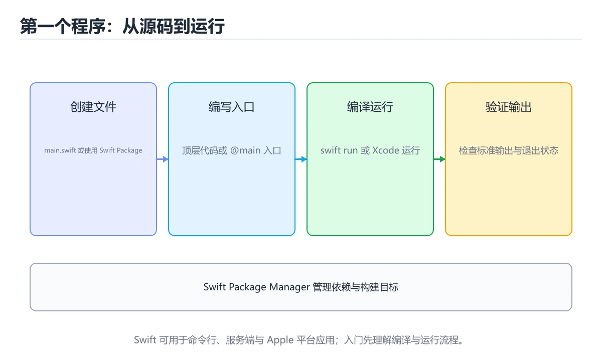
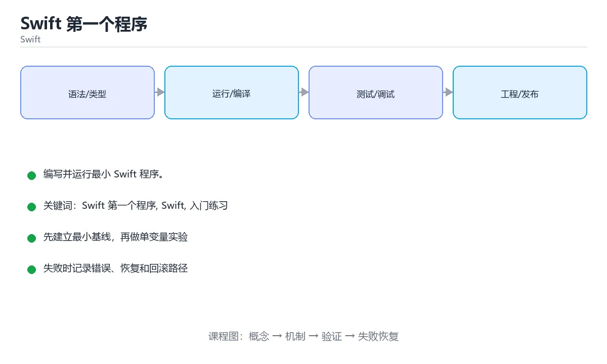

# Swift 第一个程序

> 内容更新时间：2026-10-06 · 学习阶段：入门 · 预计用时：40 分钟





## 本节知识框架

**课程定位**：所属分类为「Swift」，课程主题为「Swift 第一个程序」，学习阶段为「入门」，建议用时 40 分钟。

**本课要解决的主问题**：编写并运行最小 Swift 程序。

| 学习层次 | 要回答的问题 | 完成判据 |
| --- | --- | --- |
| 概念层 | 「Swift 第一个程序」有哪些必须区分的对象与术语？ | 能用自己的话定义核心术语，并各举一个正例和一个反例。 |
| 机制层 | 这些对象按什么顺序发生作用，输入如何变成输出？ | 能画出或写出机制步骤，并说明每一步的失败条件。 |
| 应用层 | 什么场景适合使用「Swift 第一个程序」，什么场景不适合？ | 能给出一个真实场景、一个最小示例和一个边界案例。 |
| 性能层 | 时间、空间、吞吐或延迟受哪些量影响？ | 能说出复杂度或性能瓶颈的证据来源；没有证据时明确写“材料未提供”。 |
| 复习层 | 怎样确认自己不是只记住了结论？ | 能独立完成本课自测，并把错误定位到概念、机制、示例或边界。 |

### 阅读路线

1. 先读「核心概念定义」，建立「Swift 第一个程序」等对象的精确定义。
2. 再读「原理与运行机制」，把定义串成可重复的过程。
3. 用「代码/协议/SQL 示例」验证过程，并只改一个条件观察结果变化。
4. 最后检查性能、易错点、知识关系与自测题，形成可复习的证据链。

**前置知识**：没有硬性先修课；仍建议先具备本分类的基础阅读与操作能力。

**学习位置**：本课是当前分类的第一课，建议从本页开始建立术语表。

**后续衔接**：下一课《Swift 常量与变量》会继续使用本课术语，学完后建议立即完成一次自测。

**教材衔接：学习目标**

- 先认识Swift 第一个程序需要的工具、输入和输出。
- 按步骤运行最小示例，并记录结果与错误。
- 用一个边界输入验证自己是否真正掌握。

**教材衔接：前置知识**

- 会进行基本的文件或命令行操作。
- 不需要预先掌握「Swift」的高级知识。

**教材衔接：本课小结**

- 入门阶段先保证能运行、能观察、能解释，再追求复杂功能。
- 每次只改一个变量，记录预测与实际结果。
- 遇到错误先看第一条错误信息，再回到最小示例。

## 核心概念定义

> 阅读约定：本课先给「Swift 第一个程序」相关术语的操作性定义与适用边界；正文里的口语化说法与定义冲突时，以定义和可复现示例为准。

| 术语 | 操作性定义 | 本课中的边界 |
| --- | --- | --- |
| print | 把内容输出到控制台，是观察程序行为的最快方式。 | 仅在「Swift 第一个程序」明确给出的输入、版本与资源条件下成立。 |
| let 与 var | let 声明常量，var 声明变量，编译器会推荐优先使用 let。 | 仅在「Swift 第一个程序」明确给出的输入、版本与资源条件下成立。 |
| 类型推断 | 编译器根据初值推断类型，也可以显式写类型注解。 | 仅在「Swift 第一个程序」明确给出的输入、版本与资源条件下成立。 |
| 字符串插值 | 在字符串里用 \(表达式) 嵌入值。 | 仅在「Swift 第一个程序」明确给出的输入、版本与资源条件下成立。 |
| 可选类型 | 用 ? 标记可能没有值的变量，取值前需要解包。 | 仅在「Swift 第一个程序」明确给出的输入、版本与资源条件下成立。 |
| 闭包 | 闭包捕获外部变量，默认是引用捕获；需要修改捕获值或在并发环境中使用时，要明确捕获列表和所有权 | 仅在「Swift 第一个程序」明确给出的输入、版本与资源条件下成立。 |

### 定义如何使用

在「Swift 第一个程序」中判断一个说法是否成立，先确认它使用的是哪个对象的定义，再检查输入规模、运行环境与失败路径。定义不是口号，而是后续推导、代码示例和自测题共享的约束。

## 原理与运行机制

### 机制总览

1. **建立输入**：把「print」按本课定义整理成可观察、可重复的输入条件。
2. **执行转换**：围绕「let 与 var」执行本课的核心步骤；每一步都记录中间状态，避免只看最终输出。
3. **产生输出**：得到「类型推断」后，用正文示例或协议/SQL 结果核对输出是否符合预期。
4. **改变一个条件**：只替换一个边界条件或环境参数，观察「Swift 第一个程序」的结论是否仍然成立。

| 阶段 | 关注对象 | 失败时应检查 |
| --- | --- | --- |
| 输入 | print | 类型、范围、编码、版本或前置状态是否满足定义。 |
| 处理 | let 与 var | 顺序、可见性、锁、路由、事务或调度规则是否被破坏。 |
| 输出 | 类型推断 | 结果是否可复现，错误是否被正确传播而不是被吞掉。 |

本课的机制结论要用「Swift 第一个程序」自己的示例验证。「Swift 第一个程序」没有给出某个数量级、吞吐或内存数据时，本课把该判断标为“材料未提供”，不从相邻主题外推。

**教材衔接：一句话入门**

编写并运行最小 Swift 程序。

**教材衔接：Swift 基础机制速览**

### 编译、常量与变量

Swift 使用 LLVM 编译成原生代码，Xcode 和 Swift Package Manager 是主要工具链。`let` 声明常量，`var` 声明变量；优先使用 let，让编译器帮助你发现意外修改。类型推断根据初始值确定类型，公共 API 和复杂表达式仍应显式标注。字符串、数组、字典和集合都有值语义，赋值或传参时发生写时复制，修改副本通常不会影响原值。

### 可选值、解包与空安全

`Optional` 表示可能有值也可能为 nil，必须显式处理。`if let`、`guard let`、`??` 和可选链 `?.` 是常用解包方式；强制解包 `!` 只应在逻辑上绝不可能为空且有测试保证时使用。`guard` 适合提前退出，让正常路径保持在函数主体层级。区分“值为 nil”和“值为空字符串/空数组”，不要把两者混为一谈。

### 函数、闭包与参数标签

Swift 函数支持参数标签、默认参数、可变参数、输入输出参数和抛出错误。参数标签让调用点更接近自然语言，`_` 可以省略标签。闭包捕获外部变量，默认是引用捕获；需要修改捕获值或在并发环境中使用时，要明确捕获列表和所有权。尾随闭包语法让回调、排序和异步代码更易读，但嵌套过深时应提取成命名函数。

### 结构体、类、协议与扩展

结构体是值类型，类是引用类型；优先使用结构体表达数据，除非需要继承、身份或共享可变状态。协议定义能力契约，扩展可以为已有类型添加方法，泛型让算法适用于多种类型。协议组合、关联类型和 existential 各有取舍。属性观察器、计算属性和懒加载属性让状态管理更清晰，但要避免在初始化完成前访问依赖属性。

### 内存、并发与错误处理

Swift 使用 ARC 自动管理引用计数，强引用循环会让对象无法释放；闭包捕获 self 时使用 `[weak self]` 或 `[unowned self]` 要理解生命周期。错误用 `throws` 和 `try` 传播，`defer` 负责清理。结构化并发使用 async/await、Task 和 actor 隔离共享状态；并发代码仍要处理取消、优先级和数据竞争。测试时分别覆盖值语义、可选值边界和异步失败路径。

**教材衔接：版本与时效**

- 迁移成本集中在并发边界，先把 Swift 的共享状态标出来。
- 升级前先用 hello 建立基线：记录版本、命令和输出，升级后只比较这些可观察量。
- 把 Swift 的 UI 与测试代码分开，降低版本升级的影响面。
- 官方发布说明：https://www.swift.org/blog/

### 升级检查清单

- 先固定当前版本，跑通全部示例与测验，再升级工具链。
- 一次只改一个版本条件，把 Swift 第一个程序 相关的差异单独记成一条结论。
- 升级后重点回归 Swift 第一个程序 的默认值、警告信息与错误格式。
- 升级后把 hello 的实测版本写进「内容元数据」，再更新复核日期。

**教材衔接：语言专项实践：Swift 第一个程序**

### 一、工具链

| 阶段 | 推荐工具 | 验收标准 |
| --- | --- | --- |
| 编译构建 | swiftc / xcodebuild | 命令可复现且错误能被定位 |
| 测试 | XCTest + async 测试 | 命令可复现且错误能被定位 |
| 性能 | Instruments / signpost | 命令可复现且错误能被定位 |
| 发布 | TestFlight + App Store 审核 | 命令可复现且错误能被定位 |

### 二、运行时与内存模型

「Swift 第一个程序」的「二、运行时与内存模型」一节补全如下：

- 定位：这一节说明二、运行时与内存模型在「Swift 第一个程序」知识体系里的位置。
- 检查点：固定版本与输入重跑《Swift 第一个程序》，记录两次差异并定位不稳定条件。
- 自检：能否用一个最小例子解释二、运行时与内存模型？

### 三、测试策略

- 单元测试覆盖核心规则和边界。
- 集成测试覆盖文件、网络、数据库或平台 API。
- 失败测试覆盖超时、取消、异常和资源耗尽。
- 性能测试记录基线，避免只凭感觉优化。

### 四、发布检查

- [ ] 版本和依赖锁定，构建可复现。
- [ ] 产物经过签名、校验和最小权限配置。
- [ ] 日志不泄露密钥和个人信息。
- [ ] 有升级、回滚和故障恢复说明。

## 典型应用场景

| 场景 | 典型输入或前提 | 期望产物 |
| --- | --- | --- |
| 学习验证 | 使用本课最小示例和 Swift 第一个程序、Swift | 能复现正文结论，并解释每一步。 |
| 工程落地 | 把「Swift 第一个程序」放入真实模块或服务边界 | 输出可观测、失败可定位、参数可配置。 |
| 故障排查 | 只改一个版本、规模、输入或依赖条件 | 能区分概念错误、实现错误和环境差异。 |

判断「Swift 第一个程序」的场景是否成立，标准是能否写出输入、处理、输出和失败路径；材料中没有出现的数据在本课标注为“材料未提供”，不用推测替代证据。

**课程内置实验入口**：`sandbox:swift`，用于动手验证《Swift 第一个程序》的机制；实验结论不替代概念定义与复杂度分析。

**教材衔接：代码实验：把示例跑成证据**

### 实验一：建立基线

```swift
print("hello from Swift")
```

### 实验二：只改一个输入

沿用「Swift 第一个程序」的最小示例做一次单变量实验：

| 实验 | 改动 | 预测 | 实际 | 结论 |
| --- | --- | --- | --- | --- |
| 基线 | 保持「Swift 第一个程序」示例原样 |  |  |  |
| 边界 | 把Swift 第一个程序换成空值或极值 |  |  |  |
| 失败 | 给Swift传入非法输入 |  |  |  |

做完后用一句话写出「Swift 第一个程序」的结论：输入怎么变，结果才怎么变。

### 实验三：制造一个可控错误

删掉 Swift 相关的一处必要写法，观察错误在哪一层出现，再恢复代码确认基线仍然可运行。

| 实验 | 改动 | 预测 | 实际 | 结论 |
| --- | --- | --- | --- | --- |
| 基线 | 保持原样 |  |  |  |
| 边界 |  |  |  |  |
| 失败 |  |  |  |  |

### 实验四：用三句话复述

1. 在「Swift 第一个程序」里，hello 接受哪些输入，非法输入应该在哪里被挡住？
2. 在 代码实验：把示例跑成证据 里，Swift 的状态是在什么条件下被改变的？
3. 输出如何验证，失败时第一条可观察证据是什么？

## 代码/协议/SQL 示例

### 最小可验证示例

下面保留《Swift 第一个程序》原文中的最小示例。先预测《Swift 第一个程序》示例的输出，再按正文步骤运行或推演；示例依赖外部环境时，同时记录版本与输入。

```swift
print("hello from Swift")
```

**教材衔接：最小示例**

```swift
print("hello from Swift")
```

**教材衔接：预期输出**

```text
hello from Swift
```

**教材衔接：零基础通俗讲：Swift 第一个程序**

### 一句话说清它是什么

Swift 代码可以直接在脚本模式或 Playground 里运行，print 把内容输出到控制台，不需要写入口函数。

### 用生活比喻理解

Playground 像一块可以随时改字的电子白板：你写一行，右边立刻显示结果，非常适合刚开始学语法时快速试错。

### 完整可运行代码

```swift
print("你好，Swift")
```

### 逐行拆开看

- `print` 是全局函数，把参数转换成文本输出并换行。
- 字符串用双引号，中文可以直接写，Swift 源码默认按 UTF-8 处理。
- 顶层语句可以直接执行，不需要包在函数或类里，这一点和脚本语言很像。
- 语句末尾不写分号，只有在同一行写多条语句时才需要用分号分隔。
- 要编译成可执行文件，用 `swiftc hello.swift -o hello` 生成二进制。

### 把程序跑一遍

- 用 `swift hello.swift` 直接运行，或先编译再执行。
- 顶层语句从上往下依次执行。
- print 把字符串送到标准输出。
- 屏幕显示「你好，Swift」，进程结束。

### 新手最容易踩的坑

- 在没有安装 Swift 工具链的机器上直接运行：Windows 需要额外安装 Swift for Windows。
- 把 print 写成 Print：Swift 区分大小写，会提示找不到标识符。
- 用单引号写字符串：Swift 的字符和字符串都用双引号，单引号不是合法语法。
- 在 iOS 项目里期待顶层语句可执行：应用入口需要遵循 UIApplication 生命周期。
- 忽略可选值：从字典或类型转换拿到的值可能是 nil，需要先解包。

### 动手练一练

- 把输出改成自己的名字并重新运行。
- 加一行 print，输出两行内容。
- 用 swiftc 编译成二进制，再直接执行它。

### 本课速查卡

把下面八行抄进自己的笔记，复习时只看这一页就能回忆整课：

| 复习项 | 本课要点 |
| --- | --- |
| 核心结论 | Swift 代码可以直接在脚本模式或 Playground 里运行，print 把内容输出到控制台，不需要写入口函数。 |
| 最少要写的代码 | `print("你好，Swift")` |
| 正确做法 | 用 `swift hello.swift` 直接运行，或先编译再执行。 |
| 最常见的错误 | 在没有安装 Swift 工具链的机器上直接运行：Windows 需要额外安装 Swift for Windows。 |
| 出错先查什么 | 先读第一条报错信息，再回到最小示例只改一个地方 |
| 怎么确认学会了 | 把输出改成自己的名字并重新运行。 |
| 和别的知识点的关系 | 本课打下的语法与思维方式会被后面每一课反复用到 |
| 接下来做什么 | 合上教程，凭记忆把上面的最小代码重写一遍再运行 |

## 时间/空间复杂度或性能分析

**复杂度证据**：「Swift 第一个程序」的现有材料没有给出渐近时间或空间复杂度的明确结论，本课只做定性检查，不补写未经验证的 $O$ 记号。

| 维度 | 本课关注点 | 判断依据 |
| --- | --- | --- |
| 时间/延迟 | 「Swift 第一个程序」的主要步骤是否会随输入规模、并发度或网络往返增长。 | 以正文复杂度、基准数据或可重复测量为准。 |
| 空间/内存 | 中间状态、缓存、副本、连接或索引是否随规模增长。 | 记录峰值内存与数据副本，不只看最终结果。 |
| 吞吐/资源 | 版本、调度、锁、IO、序列化或协议开销是否成为瓶颈。 | 固定环境做对照实验，改变一个变量。 |

评估「Swift 第一个程序」时要区分“正确性成立”和“性能达标”两件事；材料没有给出基准时，本课只保留量级来源与测量方法，不写不可验证的绝对数字。

## 常见误区与易错点

> 复核《Swift 第一个程序》的易错点时，优先保留原文的错误表、故障现场与排错路径；每条修正都要能用本课示例复验。

| 易错点 | 常见表现 | 正确做法 |
| --- | --- | --- |
| 只背结论 | 能复述「Swift 第一个程序」的定义，却说不清输入、输出与边界。 | 回到机制步骤，用最小示例逐一验证。 |
| 混淆相邻概念 | 把本课对象与相邻主题的对象当成同一类。 | 先比较定义、资源归属、生命周期和失败模式。 |
| 忽略版本与环境 | 在开发机通过后直接外推到生产环境。 | 固定版本、输入和资源条件，再记录可复现结果。 |

**教材衔接：常见错误与排查**

> 说明：本表由《Swift 第一个程序》的核心知识整理（2026-10-07），人工复核进度见 docs/content_review_batches.md。

| 易错点 | 容易踩的做法 | 正确结论 |
| --- | --- | --- |
| 入口与目标配置混乱 | 程序无法运行 | 明确入口与目标配置并保持整洁 |
| 忘记导入所需模块 | 编译报错找不到符号 | 显式导入依赖 |
| 字符串插值写错 | 输出与预期不符 | 用括号明确表达式边界 |

**教材衔接：故障现场**

### 现场 1：入口与目标配置混乱

**症状**：在《Swift 第一个程序》的复现场景中，程序无法运行。

**根因**：当出现“入口与目标配置混乱”时，执行路径已经绕过了《Swift 第一个程序》的关键约束，最终以“程序无法运行”暴露出来；修复前必须先确认约束在哪里失效。

**修复**：针对《Swift 第一个程序》的问题，明确入口与目标配置并保持整洁。

**验证**：先在《Swift 第一个程序》中记录“入口与目标配置混乱”留下的失败证据，再执行“明确入口与目标配置并保持整洁”并重放；确认错误路径变为明确结果，且修复没有掩盖同类故障。

### 现场 2：忘记导入所需模块

**症状**：在《Swift 第一个程序》的复现场景中，编译报错找不到符号。

**根因**：“编译报错找不到符号”只是表层结果。向上追溯会落到“忘记导入所需模块”这一步，因为它省略了《Swift 第一个程序》的约束，使实现行为和预期模型发生了偏离。

**修复**：针对《Swift 第一个程序》的问题，显式导入依赖。

**验证**：在《Swift 第一个程序》中按“显式导入依赖”调整后，从“忘记导入所需模块”的触发条件重放同一条路径，确认“编译报错找不到符号”不再出现，并补一个相邻边界用例检查没有引入新问题。

### 现场 3：字符串插值写错

**症状**：在《Swift 第一个程序》的复现场景中，输出与预期不符。

**根因**：“输出与预期不符”只是表层结果。向上追溯会落到“字符串插值写错”这一步，因为它省略了《Swift 第一个程序》的约束，使实现行为和预期模型发生了偏离。

**修复**：针对《Swift 第一个程序》的问题，用括号明确表达式边界。

**验证**：先在《Swift 第一个程序》中记录“字符串插值写错”留下的失败证据，再执行“用括号明确表达式边界”并重放；确认错误路径变为明确结果，且修复没有掩盖同类故障。

## 与其他知识点的关系

| 关系 | 课程 | 为什么 |
| --- | --- | --- |
| 关联 | 《Swift 常量与变量》 | 用于横向比较或把本课结论迁移到相邻主题。 |
| 后续顺序 | 《Swift 常量与变量》 | 同分类中安排在本课之后，会继续使用本课术语。 |

把「Swift 第一个程序」放回知识体系时，不只要记住“前面学过什么”，还要说明两个主题在输入、机制、资源边界和失败模式上的差异。这样才能把单课知识迁移到项目、排障和后续课程。

**教材衔接：复习与迁移**

复习目标：把「Swift 第一个程序」的判断标准放回可复现的例子里。先自己作答，再对照依据；如果结论正确但理由不完整，回到正文补足前提。

### 概念复述

- 用一句话说明「Swift 第一个程序」解决什么问题：编写并运行最小 Swift 程序。
- 写出Swift 第一个程序、Swift、入门练习之间的关系，并各举一个例子。
- 说出本课最容易混淆的两个概念，以及区分它们的判据。

### 正文逐节复核

- **Swift 基础机制速览**：Swift 使用 LLVM 编译成原生代码，Xcode 和 Swift Package Manager 是主要工具链。
- **实践任务**：本节围绕Swift 第一个程序安排 3 个可交付任务，每个任务都要求留下可以复查的记录。
- **逐节复习与自检**：围绕「Swift 第一个程序、Swift、入门练习」说明变量生命周期、资源释放、并发模型和错误传播。
- **零基础精讲：把Swift 第一个程序真正讲透**：本课的摘要可以当作一张地图：编写并运行最小 Swift 程序。

### 测验回顾

1. 「Swift 第一个程序」的核心结论是什么？
   - 依据：题干的正确项是Swift 第一个程序：编写并运行最小 Swift 程序。“Swift”与术语表相呼应，只有符合Swift 第一个程序、Swift、入门练习约束的“Swift 第一个程序”才是正文支持的结论。「Swift 第一个程序」要求先交代Swift 第一个程序、Swift、入门练习的前提再下结论，所以“Swift 第一个程序”只在题干“Swift”给定的条件下成立。
2. 围绕“Swift 第一个程序”中的 Swift 第一个程序、Swift、入门练习，下列哪两项是本课强调的实践判断？
   - 依据：题干的正确项是学习 Swift 第一个程序 时要同时说明输入、输出和失败路径，不能只看正常流程；在「Swift 第一个程序」里，验证 Swift 时要固定版本并覆盖边界输入，结论才可复现。这道题的关键在「Swift 第一个程序」的Swift 第一个程序、Swift、入门练习：先确认题干“围绕Swift 第一个程序中的 Sw”问的是哪一步，再排除偷换前提的选项。
3. Swift 被描述为类型安全语言，这意味着什么？
   - 依据：在「Swift 第一个程序」里，变量类型在编译期确定，类型不匹配会直接报错。Swift 在编译期检查类型是否匹配，例如把字符串赋给 Int 变量会直接失败，而不是留到运行时才暴露问题。Swift 被描述为类型安全语言，这意味着什么。回到「Swift 第一个程序」的正文示例，用“Swift 被描述为类型安全语言”走一遍Swift 第一个程序、Swift、入门练习的完整流程，能复现的结论才可以保留。
4. 示例运行后控制台会显示什么？
   - 依据：在「Swift 第一个程序」里，结论应落在「一行文本 hello from Swift」。print("hello from Swift") 把字符串字面量输出到标准输出并换行，因此看到的是文本内容而不是源码或地址。在「Swift 第一个程序」里，这道题要求区分概念与边界，「一行文本 hello from Swift」只有在题干给出的前提下才成立，而「字符串对象的内存地址」、「hello from Swift 这行源码本身」缺少同一组条件。
5. 填空：在「Swift 第一个程序」的术语速查里，「Swift 使用 LLVM 编译成原生代码，Xcode 和 Swift Package Manager 是主要工具链。`____` 声明常量，`var` 声明变量；优先使用 ____，让编译器帮助你发现意外修改。类型推断根据初始值确定类型，公共」描述的是哪个术语？
   - 依据：空格应填写「let」。回到「Swift 第一个程序」的正文示例，用“填空”走一遍Swift 第一个程序、Swift、入门练习的完整流程，能复现的结论才可以保留。回到Swift 第一个程序、Swift、入门练习本身再看一遍：只有“let”与题干“在Swift”的前提一致，结论才成立。

### 迁移练习

把「Swift 第一个程序」的结论迁移到相邻主题，每次迁移都写清预测与证据：

1. 换输入：用Swift 第一个程序处理一组你自己的数据，对比教材示例的结果差异。
2. 换失败条件：制造一个Swift相关的错误，说明如何从错误信息定位根因。
3. 换规模：把数据量或并发度提高一个数量级，说明「Swift 第一个程序」的结论是否仍成立。

<!-- language-intro-deep-dive:start -->

## 自测题与参考答案

> 先独立作答《Swift 第一个程序》的自测题，再对照答案与解析；每处判断都要能在本课正文或示例中找到依据。

### 自测 1

「Swift 第一个程序」的核心结论是什么？

A. 只要示例数据能跑通，边界输入和失败路径就不必再验证。
B. 记住术语的字面意思就等于掌握本课，示例和输出可以跳过。
C. 把相邻知识点的结论直接套用到本课，不需要重新确认前提。
D. Swift 第一个程序：编写并运行最小 Swift 程序

**参考答案**：Swift 第一个程序：编写并运行最小 Swift 程序

**解析**：题干的正确项是Swift 第一个程序：编写并运行最小 Swift 程序。“Swift”与术语表相呼应，只有符合Swift 第一个程序、Swift、入门练习约束的“Swift 第一个程序”才是正文支持的结论。「Swift 第一个程序」要求先交代Swift 第一个程序、Swift、入门练习的前提再下结论，所以“Swift 第一个程序”只在题干“Swift”给定的条件下成立。

### 自测 2

围绕“Swift 第一个程序”中的 Swift 第一个程序、Swift、入门练习，下列哪两项是本课强调的实践判断？

A. 把 Swift 的单次运行结果当成所有版本和规模都成立
B. 学习 Swift 第一个程序 时要同时说明输入、输出和失败路径，不能只看正常流程
C. 只要 Swift 第一个程序 的常规示例通过，就可以跳过边界与异常路径
D. 验证 Swift 时要固定版本并覆盖边界输入，结论才可复现

**参考答案**：学习 Swift 第一个程序 时要同时说明输入、输出和失败路径，不能只看正常流程；验证 Swift 时要固定版本并覆盖边界输入，结论才可复现

**解析**：题干的正确项是学习 Swift 第一个程序 时要同时说明输入、输出和失败路径，不能只看正常流程；在「Swift 第一个程序」里，验证 Swift 时要固定版本并覆盖边界输入，结论才可复现。这道题的关键在「Swift 第一个程序」的Swift 第一个程序、Swift、入门练习：先确认题干“围绕Swift 第一个程序中的 Sw”问的是哪一步，再排除偷换前提的选项。

### 自测 3

填空：在「Swift 第一个程序」的术语速查里，「Swift 使用 LLVM 编译成原生代码，Xcode 和 Swift Package Manager 是主要工具链。`____` 声明常量，`var` 声明变量；优先使用 ____，让编译器帮助你发现意外修改。类型推断根据初始值确定类型，公共」描述的是哪个术语？

**参考答案**：let

**解析**：空格应填写「let」。回到「Swift 第一个程序」的正文示例，用“填空”走一遍Swift 第一个程序、Swift、入门练习的完整流程，能复现的结论才可以保留。回到Swift 第一个程序、Swift、入门练习本身再看一遍：只有“let”与题干“在Swift”的前提一致，结论才成立。

**教材衔接：动手练习**

1. 原样运行最小示例，保存命令和输出。
2. 把数字 2 改成 10，预测并验证新结果。
3. 制造一个错误输入，写出错误信息和修复方法。

**教材衔接：可运行练习**

本节围绕Swift 第一个程序安排 3 个可交付任务，每个任务都要求留下可以复查的记录。

### 任务 1：用自己的话画出结构

不看书，用一张图说清「Swift 第一个程序」的结构，画完再对照骨架：

- 主干：代码实验：把示例跑成证据 → 可运行示例 → 边界实验 → 复盘
- 连接线：在每条边上标出输入、输出与失败路径。
- 自检：能否用一句话说明Swift 第一个程序与Swift的关系？

### 任务 2：做一次对比实验

**验收标准**：用 hello 做一次真实对照，结论要说明在「Swift 第一个程序」的哪个前提下成立。

### 任务 3：迁移到自己的场景

**验收标准**：把自己的判断写成可检查的形式——输入、步骤、输出、差异各一条，其中输入必须包含 Swift 第一个程序。

**教材衔接：本课复习清单**

离开本课前，逐项确认：

- [ ] 不看解析，能说出「Swift 中把一行文本输出到控制台，使用哪个函数？」的判断依据。
- [ ] 不看解析，能说出「关于 Swift 源文件中的顶层代码，下列说法正确的是？」的判断依据。
- [ ] 不看解析，能说出「Swift 被描述为类型安全语言，这意味着什么？」的判断依据。
- [ ] 不看解析，能说出「示例运行后控制台会显示什么？」的判断依据。
- [ ] 不看解析，能说出「填空：Swift 第一个程序术语速查中，表示的判断依据。
- [ ] 至少运行一次 hello 的示例，记录输入、输出和 Swift 第一个程序 的边界情况。
- [ ] 把本课最容易混淆的两个概念写成一句话对照。

| 复盘项 | 记录 |
| --- | --- |
| 已经能独立解释的考点 |  |
| 仍然说不清的概念 |  |
| 下一步验证动作 |  |

**教材衔接：复习与自测**

对照 代码实验：把示例跑成证据 复述本课结论，答不上来的部分回到 hello 的示例重跑一次。

### 最小示例

```swift
print("hello from Swift")
```

自检：这一节与相邻主题的边界在哪里？

### 预期输出

```text
hello from Swift
```

### 动手练习

自检：如果去掉这一节里的一个前提，结论会怎样变化？

### 语言专项实践：Swift 第一个程序

围绕「Swift 第一个程序、Swift、入门练习」说明变量生命周期、资源释放、并发模型和错误传播。语言语法只是入口，真正决定行为的是运行时、标准库和平台约束。

自检：把这一节讲给没学过的人，最需要强调哪一点？

---

## 术语速查

把「Swift 第一个程序」里反复出现的术语集中放在一起。复习时先遮住右列，尝试用自己的话解释，再回到正文核对。

| 术语 | 一句话说明 |
| --- | --- |
| `print` | 把内容输出到控制台，是观察程序行为的最快方式。 |
| `let 与 var` | let 声明常量，var 声明变量，编译器会推荐优先使用 let。 |
| `类型推断` | 编译器根据初值推断类型，也可以显式写类型注解。 |
| `字符串插值` | 在字符串里用 \(表达式) 嵌入值。 |
| `可选类型` | 用 ? 标记可能没有值的变量，取值前需要解包。 |
| `闭包` | 闭包捕获外部变量，默认是引用捕获；需要修改捕获值或在并发环境中使用时，要明确捕获列表和所有权 |

## 考点精讲

### 考点 1：概念判断·Swift 第一个程序

- **题目**：「Swift 第一个程序」的核心结论是什么？
- **判断依据**：题干的正确项是Swift 第一个程序：编写并运行最小 Swift 程序。“Swift”与术语表相呼应，只有符合Swift 第一个程序、Swift、入门练习约束的“Swift 第一个程序”才是正文支持的结论。「Swift 第一个程序」要求先交代Swift 第一个程序、Swift、入门练习的前提再下结论，所以“Swift 第一个程序”只在题干“Swift”给定的条件下成立。

### 考点 2：多选辨析·Swift 第一个程序

- **题目**：围绕“Swift 第一个程序”中的 Swift 第一个程序、Swift、入门练习，下列哪两项是本课强调的实践判断？
- **判断依据**：题干的正确项是学习 Swift 第一个程序 时要同时说明输入、输出和失败路径，不能只看正常流程；在「Swift 第一个程序」里，验证 Swift 时要固定版本并覆盖边界输入，结论才可复现。这道题的关键在「Swift 第一个程序」的Swift 第一个程序、Swift、入门练习：先确认题干“围绕Swift 第一个程序中的 Sw”问的是哪一步，再排除偷换前提的选项。

### 考点 3：概念判断·Swift 第一个程序

- **题目**：Swift 被描述为类型安全语言，这意味着什么？
- **判断依据**：在「Swift 第一个程序」里，变量类型在编译期确定，类型不匹配会直接报错。Swift 在编译期检查类型是否匹配，例如把字符串赋给 Int 变量会直接失败，而不是留到运行时才暴露问题。Swift 被描述为类型安全语言，这意味着什么。回到「Swift 第一个程序」的正文示例，用“Swift 被描述为类型安全语言”走一遍Swift 第一个程序、Swift、入门练习的完整流程，能复现的结论才可以保留。

### 考点 4：概念判断·Swift 第一个程序

- **题目**：示例运行后控制台会显示什么？
- **判断依据**：在「Swift 第一个程序」里，结论应落在「一行文本 hello from Swift」。print("hello from Swift") 把字符串字面量输出到标准输出并换行，因此看到的是文本内容而不是源码或地址。在「Swift 第一个程序」里，这道题要求区分概念与边界，「一行文本 hello from Swift」只有在题干给出的前提下才成立，而「字符串对象的内存地址」、「hello from Swift 这行源码本身」缺少同一组条件。

### 考点 5：填空·____

- **题目**：填空：在「Swift 第一个程序」的术语速查里，「Swift 使用 LLVM 编译成原生代码，Xcode 和 Swift Package Manager 是主要工具链。`____` 声明常量，`var` 声明变量；优先使用 ____，让编译器帮助你发现意外修改。类型推断根据初始值确定类型，公共」描述的是哪个术语？
- **判断依据**：空格应填写「let」。回到「Swift 第一个程序」的正文示例，用“填空”走一遍Swift 第一个程序、Swift、入门练习的完整流程，能复现的结论才可以保留。回到Swift 第一个程序、Swift、入门练习本身再看一遍：只有“let”与题干“在Swift”的前提一致，结论才成立。

## English Overview

**Title:** First Swift Program

**Summary:** Write and run a minimal Swift program.

**Category:** Swift
**Level:** 入门
**Key terms:** Swift 第一个程序, Swift, 入门练习

## 内容元数据

- 内容版本：v2.0
- 最后更新：2026-10-06
- 学习阶段：入门
- 适用环境：Swift 6 / Xcode 16+；本课聚焦 Swift 第一个程序。
- 内容来源：内置结构化课程与工程实践整理
- 相关主题：Swift 第一个程序、Swift、入门练习
- 质量版本：P0 测验标准 + P1 覆盖扩展 + P2 体验补全

## 参考资料与复核

- 最后复核：2026-10-04
- 下次复核：2026-12-17
- 复核范围：版本兼容、API 行为、安全建议与工程实践
- 来源性质：官方文档、标准或权威教材；正文为离线教学重组

| 参考资料 | 本课用途 |
| --- | --- |
| [Apple 人机界面指南](https://developer.apple.com/design/human-interface-guidelines/) | iOS 设计规范与可访问性 |
| [Swift 语言指南](https://docs.swift.org/swift-book/documentation/the-swift-programming-language/) | 语法、类型与内存模型 |
| [XCTest 文档](https://developer.apple.com/documentation/xctest) | 单元测试与 UI 测试 |

> 「Swift 第一个程序」的链接用于离线阅读后的延伸核对；App 不会自动联网。
