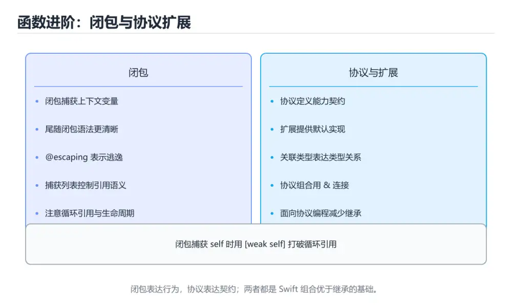
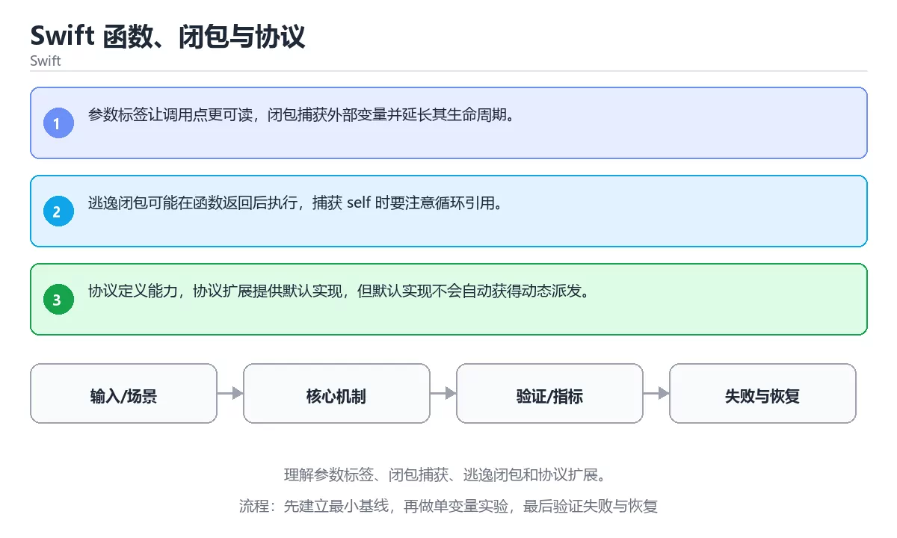

# Swift 函数、闭包与协议





> 内容更新时间：2026-10-06 · 学习阶段：基础 · 预计用时：40 分钟

## 本节知识框架

**课程定位**：所属分类 `swift`（Swift），课程主题 `Swift 函数、闭包与协议`，学习阶段 基础，建议用时 45 分钟。

本课主线：理解参数标签、闭包捕获、逃逸闭包和协议扩展。

**学完本课应当能够**
- 说清 `函数` 与 `闭包` 的含义与区别，并各举一个正例和一个反例。
- 用本课示例验证 `逃逸闭包` 的行为，记录输入、输出与失败条件。
- 遇到「闭包捕获造成循环引用」这类问题时，能说出触发条件与修复顺序。

### 从概念到验证的学习链条

1. `函数`：先掌握 接收输入、执行确定逻辑并返回结果的代码单元，再用它解释 `闭包` 为什么会出现。
2. `闭包`：先掌握 函数与其定义时词法环境的组合，使函数离开原作用域后仍能访问捕获的变量，再用它解释 `逃逸闭包` 为什么会出现。
3. `逃逸闭包`：先掌握 二、运行时与内存模型：围绕「函数、闭包、逃逸闭包、协议」说明变量生命周期、资源释放、并发模型和错误传播，再用它解释 `参数标签` 为什么会出现。
4. `参数标签`：先掌握 Swift 在调用点使用外部标签表达语义，用下划线可以省略，用来提升可读性，再用它解释 本课示例的观察结果 为什么会出现。

**先修与衔接**：本课是「Swift」分类的第 7 课。先修内容：《Swift 基础与可选类型》。《Swift 基础与可选类型》里的 `Swift`、`Optional` 是本课的前提。相关或后续课程：《Swift 结构体、类与 ARC》、《函数、作用域与 this》。

### 完成判据

- **定义关**：不看正文也能说明 `函数` 是 接收输入、执行确定逻辑并返回结果的代码单元，并指出一个反例。
- **机制关**：能按“输入 → 转换 → 输出 → 验证”复述 `Swift 函数、闭包与协议`，而不是只背结论。
- **示例关**：能运行或推演 `Swift 函数、闭包与协议` 的 `text` 示例，并说明一个真实出现的标识符或字面量。
- **证据关**：能指出 `Swift 函数、闭包与协议` 示例里的 调用了 `area()`，并说明它支持或反驳了本课的哪一条结论。
- **排错关**：能复现 闭包捕获造成循环引用，记录现象并按 用捕获列表明确弱引用或无主引用 修复。
- **迁移关**：能把 `函数`、`闭包`、`逃逸闭包`、`协议` 放进一个与 `Swift 函数、闭包与协议` 不同的项目场景，并保持输入与验证条件可追踪。
- **复盘关**：学完 `Swift 函数、闭包与协议` 后，用一句话写下仍然不确定的结论，并列出下一次验证需要的输入、环境和成功判据。

### 复习清单

- [ ] 能不看正文复述本课核心术语，并指出一个边界或反例。
- [ ] 能运行或推演本课示例，记录输入、输出与失败现象。
- [ ] 能完成一次自测，并把错题对照错误表定位原因。

## 核心概念定义

| 术语 | 操作性定义 | 常见边界与风险 |
| --- | --- | --- |
| 函数 | 接收输入、执行确定逻辑并返回结果的代码单元。 | 只在「接收输入、执行确定逻辑并返回结果的代码单元」这一前提下成立，换输入或换环境要重新验证。 |
| 闭包 | 函数与其定义时词法环境的组合，使函数离开原作用域后仍能访问捕获的变量。 | 易错：对象无法释放；正确做法是用捕获列表明确弱引用或无主引用。 |
| 逃逸闭包 | 二、运行时与内存模型：围绕「函数、闭包、逃逸闭包、协议」说明变量生命周期、资源释放、并发模型和错误传播。 | 共享状态与调度顺序会改变结论，单线程或串行测试通过不等于并发下成立。 |
| 参数标签 | Swift 在调用点使用外部标签表达语义，用下划线可以省略，用来提升可读性。 | 只在「Swift 在调用点使用外部标签表达语义，用下划线可以省略，用来提升可读性」这一前提下成立，换输入或换环境要重新验证。 |

## 原理与运行机制

### 机制总览

1. **建立输入**：把「函数」按本课定义整理成可观察、可重复的输入条件。
2. **执行转换**：围绕「闭包」执行本课的核心步骤；每一步都记录中间状态，避免只看最终输出。
3. **产生输出**：得到「逃逸闭包」后，用正文示例或协议/SQL 结果核对输出是否符合预期。
4. **改变一个条件**：只替换一个边界条件或环境参数，观察「Swift 函数、闭包与协议」的结论是否仍然成立。

**教材衔接：核心知识**

### 1. 参数标签让调用点更可读，闭包捕获外部变量并延长其生命周期。

- 关键做法：先让 函数 的最小示例可复现，再加入并发或规模条件。
- 验证标准：函数 的结果可复现、错误可解释、失败能恢复。

### 2. 逃逸闭包可能在函数返回后执行，捕获 self 时要注意循环引用。

把这条结论放回「Swift 函数、闭包与协议」的完整流程里展开：

- 正文依据：能用自己的话解释：参数标签让调用点更可读，闭包捕获外部变量并延长其生命周期。
- 落地检查：把「2. 逃逸闭包可能在函数返回后执行，捕获 self 时要注意循环引用。」改写成一条可执行的核对项，逐条验证输入、超时与失败路径。

### 3. 协议定义能力，协议扩展提供默认实现，但默认实现不会自动获得动态派发。

把这条结论放回「Swift 函数、闭包与协议」的完整流程里展开：

- 正文依据：能用自己的话解释：逃逸闭包可能在函数返回后执行，捕获 self 时要注意循环引用。
- 落地检查：把「3. 协议定义能力，协议扩展提供默认实现，但默认实现不会自动获得动态派发。」改写成一条可执行的核对项，逐条验证输入、超时与失败路径。

**教材衔接：关键流程**

**教材衔接：实践路径**

**教材衔接：版本与时效**

- Swift 6.x 默认开启更严格的数据竞争检查；函数 的并发边界要先梳理。
- 升级前确认 函数 的兼容范围，把不可回退的改动单独拆成一次提交。
- SwiftUI 与 Swift Testing 迭代最快；函数 的示例要注明工具链版本。
- 官方发布说明：https://www.swift.org/blog/

### 升级检查清单

- 先固定当前版本，跑通全部示例与测验，再升级工具链。
- 升级时只动一个依赖版本，用 protocol 记录构建与运行结果。
- 升级后重点回归 函数 的默认值、警告信息与错误格式。
- 升级完成后记录 函数 的新旧版本差异，并据此调整下次复核时间。

**教材衔接：验证步骤**

### 机制拆解：每一步的输入、动作与输出

#### 1. `函数`
- 输入：`函数`；本步把 接收输入、执行确定逻辑并返回结果的代码单元 当作判断规则。
- 动作：围绕 `函数` 保留中间状态，并记录它与 `闭包` 的对应关系。
- 输出：`闭包`，它可以被下一段代码、测试或记录继续使用。
- `函数` 的失败条件：只在「接收输入、执行确定逻辑并返回结果的代码单元」这一前提下成立，换输入或换环境要重新验证。

#### 2. `闭包`
- 输入：`函数`；本步把 函数与其定义时词法环境的组合，使函数离开原作用域后仍能访问捕获的变量 当作判断规则。
- 动作：围绕 `闭包` 保留中间状态，并记录它与 `逃逸闭包` 的对应关系。
- 输出：`逃逸闭包`，它可以被下一段代码、测试或记录继续使用。
- `闭包` 的失败条件：当闭包捕获造成循环引用时，会出现对象无法释放。

#### 3. `逃逸闭包`
- 输入：`闭包`；本步把 二、运行时与内存模型：围绕「函数、闭包、逃逸闭包、协议」说明变量生命周期、资源释放、并发模型和错误传播 当作判断规则。
- 动作：围绕 `逃逸闭包` 保留中间状态，并记录它与 `参数标签` 的对应关系。
- 输出：`参数标签`，它可以被下一段代码、测试或记录继续使用。
- `逃逸闭包` 的失败条件：共享状态与调度顺序会改变结论，单线程或串行测试通过不等于并发下成立。

#### 4. `参数标签`
- 输入：`逃逸闭包`；本步把 Swift 在调用点使用外部标签表达语义，用下划线可以省略，用来提升可读性 当作判断规则。
- 动作：围绕 `参数标签` 保留中间状态，并记录它与 `area` 的对应关系。
- 输出：`area`，它可以被下一段代码、测试或记录继续使用。
- `参数标签` 的失败条件：只在「Swift 在调用点使用外部标签表达语义，用下划线可以省略，用来提升可读性」这一前提下成立，换输入或换环境要重新验证。

### 示例中的可观察事实

1. 调用了 `area()`；它对应的课程主题是 `Swift 函数、闭包与协议`。
2. 调用了 `print()`；它对应的课程主题是 `Swift 函数、闭包与协议`。
3. 调用了 `Square()`；它对应的课程主题是 `Swift 函数、闭包与协议`。

### 复现实验记录

- 环境：`Swift 函数、闭包与协议` 使用 `text` 示例，固定 `函数`、`闭包`、`逃逸闭包`、`协议` 作为第一组条件。
- 首轮输入：先确认 调用了 `area()`，预测 `函数` 会怎样变化。
- 基线观察：记录命令、输入、输出和错误原文，不用截图代替可复制的文本。
- 单变量修改：只改变 `函数`，观察 `参数标签` 是否仍满足定义。
- 失败注入：复现 闭包捕获造成循环引用，确认现象是 对象无法释放。
- 记录结论：把“修改前、修改后、预期变化、实际变化”写成四列表，这样复盘 `Swift 函数、闭包与协议` 时才能区分概念错误与实现错误。

## 典型应用场景

**课程内置实验入口**：`sandbox:swift`，用于动手验证《Swift 函数、闭包与协议》的机制；实验结论不替代概念定义与复杂度分析。

**教材衔接：深度拓展与实战**

这一节把「Swift 函数、闭包与协议」正文里的定义、代码和失败模式串成一条可操作的复习路线。

### 机制拆解

- **1. 参数标签让调用点更可读，闭包捕获外部变量并延长其生命周期。**：在「Swift 函数、闭包与协议」里，「1. 参数标签让调用点更可读，闭包捕获外部变量并延长其生命周期。」这一步要先写清输入与预期，再记录实际结果和差异；结果不符时回到对应小节核对前提。
- **2. 逃逸闭包可能在函数返回后执行，捕获 self 时要注意循环引用。**：在「Swift 函数、闭包与协议」里，「2. 逃逸闭包可能在函数返回后执行，捕获 self 时要注意循环引用。」这一步要先写清输入与预期，再记录实际结果和差异；结果不符时回到对应小节核对前提。
- **3. 协议定义能力，协议扩展提供默认实现，但默认实现不会自动获得动态派发。**：在「Swift 函数、闭包与协议」里，「3. 协议定义能力，协议扩展提供默认实现，但默认实现不会自动获得动态派发。」这一步要先写清输入与预期，再记录实际结果和差异；结果不符时回到对应小节核对前提。
- 一、工具链：实现 protocol 所需的阶段与验收标准
- **二、运行时与内存模型**：围绕「函数、闭包、逃逸闭包、协议」说明变量生命周期、资源释放、并发模型和错误传播


### 工程检查表

- [ ] 能否用自己的话说明Swift 函数、闭包与协议解决什么问题，以及它不负责什么？
- [ ] 能否用「Swift 函数、闭包与协议」的最小示例复现一次失败并解释原因？
- [ ] 能否解释本课关键词在真实项目中的边界与取舍？
- [ ] 换一个输入后，protocol 的判断依据是否仍然成立？

### 迁移练习

1. 保持正文示例不变，写出它的输入、处理步骤和预期输出。
2. 固定其他输入，只调整 protocol 的一个参数，先写预测再验证。
3. 结合函数、闭包、逃逸闭包、协议，写出一个真实项目中的使用场景。
4. 写下一个反例，说明它在什么条件下会使朴素做法失效。

<!-- p0-depth-v2:start -->

- **闭包捕获造成循环引用**：典型现象是对象无法释放；正确做法是用捕获列表明确弱引用或无主引用。
- **协议默认实现与实现方冲突**：典型现象是调用到意料之外的实现；正确做法是明确协议要求与默认实现的边界。
- **闭包参数过多**：典型现象是调用点可读性差；正确做法是用结构体或参数对象组织。

### 最小验证场景

- 准备：保留 `text` 示例的原始输入，先记录 `Swift 函数、闭包与协议` 的基线输出和完整运行命令。
- 观察：先核对 调用了 `area()`，再改变一个与 `函数` 相关的条件。
- 判定：新结果与 `Swift 函数、闭包与协议` 的基线不同不等于错误；只有当差异破坏了 `函数` 的定义或错误表中的约束，才判定为失败。

### 选择与边界

- 使用 `函数` 时，先满足它的定义：接收输入、执行确定逻辑并返回结果的代码单元；只在「接收输入、执行确定逻辑并返回结果的代码单元」这一前提下成立，换输入或换环境要重新验证。
- 使用 `闭包` 时，先满足它的定义：函数与其定义时词法环境的组合，使函数离开原作用域后仍能访问捕获的变量；易错：对象无法释放；正确做法是用捕获列表明确弱引用或无主引用。
- 使用 `逃逸闭包` 时，先满足它的定义：二、运行时与内存模型：围绕「函数、闭包、逃逸闭包、协议」说明变量生命周期、资源释放、并发模型和错误传播；共享状态与调度顺序会改变结论，单线程或串行测试通过不等于并发下成立。
- 使用 `参数标签` 时，先满足它的定义：Swift 在调用点使用外部标签表达语义，用下划线可以省略，用来提升可读性；只在「Swift 在调用点使用外部标签表达语义，用下划线可以省略，用来提升可读性」这一前提下成立，换输入或换环境要重新验证。

## 代码/协议/SQL 示例

### 最小可验证示例

**教材衔接：语言专项实践：Swift 函数、闭包与协议**

### 一、工具链

| 阶段 | 推荐工具 | 验收标准 |
| --- | --- | --- |
| 编译构建 | swiftc / xcodebuild | 命令可复现且错误能被定位 |
| 测试 | XCTest + async 测试 | 命令可复现且错误能被定位 |
| 性能 | Instruments / signpost | 命令可复现且错误能被定位 |
| 发布 | TestFlight + App Store 审核 | 命令可复现且错误能被定位 |


### 四、发布检查

**教材衔接：零基础精讲：把Swift 函数、闭包与协议真正讲透**

### 先建立一个直觉

本课的摘要可以当作一张地图：理解参数标签、闭包捕获、逃逸闭包和协议扩展。

### 逐步拆解

1. 澄清输入与目标。先写清「Swift 函数、闭包与协议」要解决的问题、合法输入范围和成功标准，再进入后续步骤。
2. 描述处理过程。把「函数、闭包、逃逸闭包、协议」映射到具体步骤，每步都要求能单独验证。
3. 定义输出。函数 的输出不仅包括正常结果，还包括错误码、日志和资源释放状态。
4. 关掉一个看似必要的检查（闭包相关），观察哪个测试或指标先失败，用证据说明它为什么不能省。
5. 选一个只有两三步的函数例子，先写出预期输出，再运行确认；不一致时先怀疑前提而不是代码。

### 把正文串成一条执行链

- **三、测试策略**：- 单元测试覆盖核心规则和边界

### 从测验反推易错点

- 参考判断：参数标签让调用点更可读，闭包捕获外部变量并延长其生命周期。
- 自问：如果去掉题干里的一个限定词，结论还成立吗？

- 参考判断：逃逸闭包可能在函数返回后执行，捕获 self 时要注意循环引用。

- 参考判断：协议定义能力，协议扩展提供默认实现，但默认实现不会自动获得动态派发。

**检查点 4：本课的核心学习目标是什么？**

- 参考判断：理解参数标签、闭包捕获、逃逸闭包和协议扩展。

- 参考判断：protocol


### 变式训练

1. 把 函数 的实现压缩到一个进程内，去掉所有外部依赖后再谈扩展。
2. 扩大 闭包 的规模，记录本课结论在哪一个量级开始不成立。
3. 制造一次 函数 相关的依赖超时或错误输入，要求错误可解释且不留半完成状态。
5. 减少一个输入字段后重跑 protocol，记录失败信息出现在哪一层，据此判断这个字段是必填还是可推导。
6. 在低带宽或低算力条件下重跑 闭包，记录降级路径是否仍然可用。


### 迁移案例库

围绕 protocol 重复同一套方法，每完成一轮就把差异写进笔记。

#### 迁移案例 1：围绕「函数」做一次小实验

**验收**：函数 的正常、边界、失败三条路径都要有结论；失败路径要写清恢复动作与「Swift 函数、闭包与协议」里仍然存在的剩余风险。

#### 迁移案例 2：围绕「闭包」做一次小实验

**步骤**：
1. 复述当前方案对「闭包」的假设，写成一句可证伪的话。

#### 迁移案例 3：围绕「逃逸闭包」做一次小实验

**步骤**：
1. 复述当前方案对「逃逸闭包」的假设，写成一句可证伪的话。

#### 迁移案例 4：围绕「协议」做一次小实验

**步骤**：
1. 复述当前方案对「协议」的假设，写成一句可证伪的话。

#### 迁移案例 5：围绕「函数」做一次小实验

**步骤**：

#### 迁移案例 6：围绕「闭包」做一次小实验

**步骤**：

#### 迁移案例 7：围绕「逃逸闭包」做一次小实验

**步骤**：

#### 迁移案例 8：围绕「协议」做一次小实验

**步骤**：

#### 迁移案例 9：围绕「函数」做一次小实验

**步骤**：

#### 迁移案例 10：围绕「闭包」做一次小实验

**步骤**：

#### 迁移案例 11：围绕「逃逸闭包」做一次小实验

**步骤**：

#### 迁移案例 12：围绕「协议」做一次小实验

**步骤**：

#### 迁移案例 13：围绕「函数」做一次小实验

**步骤**：

#### 迁移案例 14：围绕「闭包」做一次小实验

**步骤**：

#### 迁移案例 15：围绕「逃逸闭包」做一次小实验

**步骤**：

#### 迁移案例 16：围绕「协议」做一次小实验

**步骤**：

<!-- p0-depth-v2:end -->

**教材衔接：最小可运行示例**

下面的示例覆盖「Swift 函数、闭包与协议」中 函数 的核心路径。先原样运行，再按注释改一处：

```swift
protocol Shape {
    func area() -> Int
}

struct Square: Shape {
    let side: Int
    func area() -> Int { side * side }
}

print(Square(side: 7).area())
```

**教材衔接：预期输出**

```text
49
```

### 示例精读：先找证据，再改一个条件

1. 调用了 `area()`；它出现在 `Swift 函数、闭包与协议` 的示例中，阅读时先确认它前后各发生了什么。
2. 调用了 `print()`；它出现在 `Swift 函数、闭包与协议` 的示例中，阅读时先确认它前后各发生了什么。
3. 调用了 `Square()`；它出现在 `Swift 函数、闭包与协议` 的示例中，阅读时先确认它前后各发生了什么。
- 在 `Swift 函数、闭包与协议` 中与 `函数` 对照：示例必须能支持 接收输入、执行确定逻辑并返回结果的代码单元，否则说明这一段还缺少实现或验证步骤。
- 在 `Swift 函数、闭包与协议` 中与 `闭包` 对照：示例必须能支持 函数与其定义时词法环境的组合，使函数离开原作用域后仍能访问捕获的变量，否则说明这一段还缺少实现或验证步骤。
- 在 `Swift 函数、闭包与协议` 中与 `逃逸闭包` 对照：示例必须能支持 二、运行时与内存模型：围绕「函数、闭包、逃逸闭包、协议」说明变量生命周期、资源释放、并发模型和错误传播，否则说明这一段还缺少实现或验证步骤。
- 在 `Swift 函数、闭包与协议` 中与 `参数标签` 对照：示例必须能支持 Swift 在调用点使用外部标签表达语义，用下划线可以省略，用来提升可读性，否则说明这一段还缺少实现或验证步骤。

## 时间/空间复杂度或性能分析

**性能关注点（Swift 函数、闭包与协议）**：编译期优化与引用计数影响开销：记录构建时间、运行时间与内存峰值。

**本课特有开销（Swift 函数、闭包与协议 · 函数）**：并发度提高后要观察是否出现拐点：延迟上升而吞吐不增，说明瓶颈已转移。

**测量方法**：以 `Swift 函数、闭包与协议` 的 `函数` 场景为对象，固定输入跑一遍记录基线，再把规模或并发度提高一个数量级复测；两次结果的差值与波动范围才是结论依据。

### 需要控制的变量与记录项

- `Swift 函数、闭包与协议` 的 `函数`：固定它的版本、输入范围和资源上限，分别记录速度、内存与失败率的变化。
- `Swift 函数、闭包与协议` 的 `闭包`：固定它的版本、输入范围和资源上限，分别记录速度、内存与失败率的变化。
- `Swift 函数、闭包与协议` 的 `逃逸闭包`：固定它的版本、输入范围和资源上限，分别记录速度、内存与失败率的变化。
- `Swift 函数、闭包与协议` 的 `协议`：固定它的版本、输入范围和资源上限，分别记录速度、内存与失败率的变化。
- `Swift 函数、闭包与协议` 中 `函数` 的边界：只在「接收输入、执行确定逻辑并返回结果的代码单元」这一前提下成立，换输入或换环境要重新验证。达到边界时不要外推，必须重新测量。
- `Swift 函数、闭包与协议` 中 `闭包` 的边界：易错：对象无法释放；正确做法是用捕获列表明确弱引用或无主引用。达到边界时不要外推，必须重新测量。
- `Swift 函数、闭包与协议` 中 `逃逸闭包` 的边界：共享状态与调度顺序会改变结论，单线程或串行测试通过不等于并发下成立。达到边界时不要外推，必须重新测量。
- `Swift 函数、闭包与协议` 中 `参数标签` 的边界：只在「Swift 在调用点使用外部标签表达语义，用下划线可以省略，用来提升可读性」这一前提下成立，换输入或换环境要重新验证。达到边界时不要外推，必须重新测量。
- `Swift 函数、闭包与协议` 的代码证据：先验证 调用了 `area()`，再记录该路径的输入规模与耗时；只看代码行数不能推出复杂度。

## 常见误区与易错点

| 容易写错的做法 | 实际现象 | 原因与正确做法 |
| --- | --- | --- |
| 闭包捕获造成循环引用 | 对象无法释放。 | 用捕获列表明确弱引用或无主引用。 |
| 协议默认实现与实现方冲突 | 调用到意料之外的实现。 | 明确协议要求与默认实现的边界。 |
| 闭包参数过多 | 调用点可读性差。 | 用结构体或参数对象组织。 |

### 现场 1：闭包捕获造成循环引用

**症状**：对象无法释放。

**根因与修复**：用捕获列表明确弱引用或无主引用。

**自检**：在本课示例里复现「闭包捕获造成循环引用」，改成用捕获列表明确弱引用或无主引用后重跑；如果症状消失且失败路径按预期变化，说明定位正确。

### 现场 2：协议默认实现与实现方冲突

**症状**：调用到意料之外的实现。

**根因与修复**：明确协议要求与默认实现的边界。

**自检**：在本课示例里复现「协议默认实现与实现方冲突」，改成明确协议要求与默认实现的边界后重跑；如果症状消失且失败路径按预期变化，说明定位正确。

### 现场 3：闭包参数过多

**症状**：调用点可读性差。

**根因与修复**：用结构体或参数对象组织。

**自检**：在本课示例里复现「闭包参数过多」，改成用结构体或参数对象组织后重跑；如果症状消失且失败路径按预期变化，说明定位正确。

## 与其他知识点的关系

**教材衔接：复习与迁移**

### 概念复述

- 用一句话说明「Swift 函数、闭包与协议」解决什么问题：理解参数标签、闭包捕获、逃逸闭包和协议扩展。
- 写出函数、闭包、逃逸闭包之间的关系，并各举一个例子。
- 说出本课最容易混淆的两个概念，以及区分它们的判据。

### 正文逐节复核

- **语言专项实践：Swift 函数、闭包与协议**：围绕「函数、闭包、逃逸闭包、协议」说明变量生命周期、资源释放、并发模型和错误传播。
- **实践任务**：本节围绕Swift 函数、闭包与协议安排 3 个可交付任务，每个任务都要求留下可以复查的记录。
- **零基础精讲：把Swift 函数、闭包与协议真正讲透**：本课的摘要可以当作一张地图：理解参数标签、闭包捕获、逃逸闭包和协议扩展。


### 迁移练习

- **先修**：`Swift 基础与可选类型`。本课默认这些内容已经掌握。
- **相关或后续**：`Swift 结构体、类与 ARC`、`函数、作用域与 this`。本课术语会在这些课程里继续使用。
- **术语归属**：`函数`、`闭包`、`逃逸闭包` 的定义以本课「核心概念定义」为准，换到其他课程时先确认定义是否被改写。

### 先修与后续术语接口

- `Swift 基础与可选类型`：两者通过本分类的学习顺序衔接，阅读时重点比较各自的输入与失败条件。
- `Swift 结构体、类与 ARC`：两者通过本分类的学习顺序衔接，阅读时重点比较各自的输入与失败条件。
- `函数、作用域与 this`：共享术语 `函数`、`闭包`，共同关键词 `函数`、`闭包`。

### 容易混淆的相邻概念

- `函数` 与 `闭包`：前者强调 接收输入、执行确定逻辑并返回结果的代码单元；后者强调 函数与其定义时词法环境的组合，使函数离开原作用域后仍能访问捕获的变量。判断时分别检查两条定义的适用范围，不要只看名称相似就互换。
- `闭包` 与 `逃逸闭包`：前者强调 函数与其定义时词法环境的组合，使函数离开原作用域后仍能访问捕获的变量；后者强调 二、运行时与内存模型：围绕「函数、闭包、逃逸闭包、协议」说明变量生命周期、资源释放、并发模型和错误传播。判断时分别检查两条定义的适用范围，不要只看名称相似就互换。
- `逃逸闭包` 与 `参数标签`：前者强调 二、运行时与内存模型：围绕「函数、闭包、逃逸闭包、协议」说明变量生命周期、资源释放、并发模型和错误传播；后者强调 Swift 在调用点使用外部标签表达语义，用下划线可以省略，用来提升可读性。判断时分别检查两条定义的适用范围，不要只看名称相似就互换。

## 自测题与参考答案

> 先独立作答，再对照参考答案；答案都能在本课正文、术语表或错误表里找到依据。

### 自测 1（概念复述）

不看正文，写出 `函数` 的操作性定义，并说明它与 `闭包` 的区别。

**参考答案**：接收输入、执行确定逻辑并返回结果的代码单元。

`闭包` 的定位是：函数与其定义时词法环境的组合，使函数离开原作用域后仍能访问捕获的变量；两者的差别要从适用对象与失败模式上说明。

### 自测 2（排错）

本课错误表记录了「闭包捕获造成循环引用」这类做法。请写出它会出现的现象、根因，以及修复顺序。

**参考答案**：现象是对象无法释放；正确做法是用捕获列表明确弱引用或无主引用。修复时先复现现象并保留证据，再改动一处假设重跑，确认现象消失。

### 自测 3（动手验证）

运行本课的 `text` 示例，改动其中一个输入后重新运行，记录输出与错误信息。

**参考答案**：正常输入下 `text` 示例应当复现正文给出的结果；改动输入后，如果结果改变或报错，先核对它是否满足 `Swift 函数、闭包与协议` 中`函数` 的适用范围，再检查错误表里是否有同类现象。

### 自测 4（代码阅读）

阅读本课开头的 `text` 示例，说明它体现了`函数` 的哪一条性质，并指出改动哪个输入会让这条性质不再成立。

**参考答案**：`函数` 的定义是 接收输入、执行确定逻辑并返回结果的代码单元，示例正是在实现这条定义。改动与 `函数` 有关的一个输入后，如果结果不再符合 `Swift 函数、闭包与协议` 的正文描述，就说明该性质只在当前前提成立。

### 自测 5（迁移）

把 `Swift 函数、闭包与协议` 的方法迁移到自己的项目：围绕 `函数` 写出一个与错误表同类的风险点，并说明触发条件和检验方式。

**参考答案**：例如「闭包参数过多」，它会导致调用点可读性差；检验方式是按用结构体或参数对象组织改一处再复现，确认现象消失且没有引入新的失败分支。

### 自测 6（对比）

用一个表格对比 `函数` 与 `闭包`：各写一行适用场景、一行失败表现。

**参考答案**：`函数` 的定义是接收输入、执行确定逻辑并返回结果的代码单元；`闭包` 的定义是函数与其定义时词法环境的组合，使函数离开原作用域后仍能访问捕获的变量。两者的失败表现分别对应本课错误表里与本术语相关的行。

### 自测 7（排错顺序）

面对「闭包捕获造成循环引用」引发的问题，请把“复现 对象无法释放 → 保留证据 → 用捕获列表明确弱引用或无主引用 → 回归验证”四步写成可执行的检查清单。

**参考答案**：第一步按对象无法释放复现；第二步记录输入、版本与完整报错；第三步按用捕获列表明确弱引用或无主引用只改一处；第四步重跑并确认失败路径也按预期变化。

### 自测 8（边界判断）

针对 `参数标签`，分别写出“可以使用”的条件和“结论不再成立”的条件。

**参考答案**：只在「Swift 在调用点使用外部标签表达语义，用下划线可以省略，用来提升可读性」这一前提下成立，换输入或换环境要重新验证。 同时要把 `参数标签` 的定义 Swift 在调用点使用外部标签表达语义，用下划线可以省略，用来提升可读性 与实际输入逐项对照。

### 自测 9（机制重建）

不看正文，按输入、转换、输出、验证四段重建 `函数` → `闭包` → `逃逸闭包` → `参数标签` 的作用链。

**参考答案**：起点是 `函数` 的定义 接收输入、执行确定逻辑并返回结果的代码单元；中间每一步都保留可观察状态；终点由 `参数标签` 检查，失败时回到错误表定位第一个偏离定义的步骤。

### 自测 10（综合排错）

在 `Swift 函数、闭包与协议` 中，现象是 调用点可读性差。请围绕 闭包参数过多 写出最小复现、关键证据、修复动作和回归验证，并说明为什么不能只凭一次运行下结论。

**参考答案**：先复现 闭包参数过多，记录输入与完整错误；再按 用结构体或参数对象组织 只改一处。回归时同时跑正常路径和边界路径，只有两次结果都可解释，才把修复视为完成。

### 自测 11（一分钟复述）

用每分钟约 200 字的速度复述 `Swift 函数、闭包与协议`：先给主问题，再按顺序说出 `函数`、`闭包`、`逃逸闭包`、`参数标签`，最后给一个失败案例。

**自评标准**：主问题必须对应 理解参数标签、闭包捕获、逃逸闭包和协议扩展；每个术语都要能接上一句定义或边界；失败案例必须写成可观察现象，不能用“可能有风险”代替证据。

## 术语速查

| 术语 | 一句话说明 |
| --- | --- |
| `函数` | 接收输入、执行确定逻辑并返回结果的代码单元。 |
| `闭包` | 函数与其定义时词法环境的组合，使函数离开原作用域后仍能访问捕获的变量。 |
| `逃逸闭包` | 二、运行时与内存模型：围绕「函数、闭包、逃逸闭包、协议」说明变量生命周期、资源释放、并发模型和错误传播。 |
| `参数标签` | Swift 在调用点使用外部标签表达语义，用下划线可以省略，用来提升可读性。 |

**术语关系**：`函数`（接收输入、执行确定逻辑并返回结果的代码单元） → `闭包`（函数与其定义时词法环境的组合） → `逃逸闭包`（二、运行时与内存模型：围绕「函数、闭包、逃逸闭包、协议」说明变量生命周期、资源释放、并发模型和错误传播） → `参数标签`（Swift 在调用点使用外部标签表达语义）。

## 考点精讲

`Swift 函数、闭包与协议` 的题库有 6 道题，下面逐题给出题干、正确项与判断依据：先自己作答，再核对正确项，最后回到正文对应小节复核。

### 考点 1：第 1 题

- **题目**：围绕“Swift 函数、闭包与协议”中的 函数、闭包、逃逸闭包，下列哪两项是本课强调的实践判断？
- **正确项**：验证 闭包 时要固定版本并覆盖边界输入，结论才可复现；学习 函数 时要同时说明输入、输出和失败路径，不能只看正常流程
- **判断依据**：这道题落在术语 `函数` 上：接收输入、执行确定逻辑并返回结果的代码单元。复习时把 `函数` 的定义、适用边界和一个反例一起说清楚，再回到「核心概念定义」核对原文。

### 考点 2：第 2 题

- **题目**：在 `Swift 函数、闭包与协议` 里，与 `函数` 有关的说法中，哪一项最符合理解参数标签、闭包捕获、逃逸闭包和协议扩展。？
- **正确项**：逃逸闭包可能在函数返回后执行，捕获 self 时要注意循环引用。
- **判断依据**：这道题落在术语 `函数` 上：接收输入、执行确定逻辑并返回结果的代码单元。复习时把 `函数` 的定义、适用边界和一个反例一起说清楚，再回到「核心概念定义」核对原文。

### 考点 3：第 3 题

- **题目**：在 `Swift 函数、闭包与协议` 里，与 `函数` 有关的说法中，哪一项最符合理解参数标签、闭包捕获、逃逸闭包和协议扩展。？（Swift 函数、闭包与协议·Swift 第 3 题）
- **正确项**：协议定义能力，协议扩展提供默认实现，但默认实现不会自动获得动态派发。
- **判断依据**：这道题落在术语 `函数` 上：接收输入、执行确定逻辑并返回结果的代码单元。复习时把 `函数` 的定义、适用边界和一个反例一起说清楚，再回到「核心概念定义」核对原文。

### 考点 4：第 4 题

- **题目**：阅读 `Swift 函数、闭包与协议` 的 `函数` 示例。它服务于理解参数标签、闭包捕获、逃逸闭包和协议扩展。代码中实际包含下列哪一项？
- **正确项**：调用了 `area()`
- **判断依据**：这道题落在术语 `函数` 上：接收输入、执行确定逻辑并返回结果的代码单元。复习时把 `函数` 的定义、适用边界和一个反例一起说清楚，再回到「核心概念定义」核对原文。

### 考点 5：第 5 题

- **题目**：填空：补齐下面这段术语说明中的空缺。课程 `理解参数标签、闭包捕获、逃逸闭包和协议扩展。`，这段说明是：`____`：接收输入、执行确定逻辑并返回结果的代码单元。空缺处应填哪个术语？
- **正确项**：函数
- **判断依据**：这道题落在术语 `函数` 上：接收输入、执行确定逻辑并返回结果的代码单元。复习时把 `函数` 的定义、适用边界和一个反例一起说清楚，再回到「核心概念定义」核对原文。

### 考点 6：第 6 题

- **题目**：下面几项都与 `函数` 有关，请按 `Swift 函数、闭包与协议` 的正文顺序排列；该课主线是理解参数标签、闭包捕获、逃逸闭包和协议扩展。
- **正确项**：核心知识 → 关键流程 → 实践路径 → 常见误区
- **判断依据**：这道题落在术语 `函数` 上：接收输入、执行确定逻辑并返回结果的代码单元。复习时把 `函数` 的定义、适用边界和一个反例一起说清楚，再回到「核心概念定义」核对原文。

### 考点 7：`函数`

- **要点**：接收输入、执行确定逻辑并返回结果的代码单元。
- **函数 的边界**：只在「接收输入、执行确定逻辑并返回结果的代码单元」这一前提下成立，换输入或换环境要重新验证。

### 考点 8：`闭包`

- **要点**：函数与其定义时词法环境的组合，使函数离开原作用域后仍能访问捕获的变量。
- **闭包 的边界**：易错：对象无法释放；正确做法是用捕获列表明确弱引用或无主引用。

### 考点 9：`逃逸闭包`

- **要点**：二、运行时与内存模型：围绕「函数、闭包、逃逸闭包、协议」说明变量生命周期、资源释放、并发模型和错误传播。
- **逃逸闭包 的边界**：共享状态与调度顺序会改变结论，单线程或串行测试通过不等于并发下成立。

### 考点 10：`参数标签`

- **要点**：Swift 在调用点使用外部标签表达语义，用下划线可以省略，用来提升可读性。
- **参数标签 的边界**：只在「Swift 在调用点使用外部标签表达语义，用下划线可以省略，用来提升可读性」这一前提下成立，换输入或换环境要重新验证。

### 考点 11：排错——闭包捕获造成循环引用

- **现象**：对象无法释放。
- **处理**：用捕获列表明确弱引用或无主引用。

### 考点 12：排错——协议默认实现与实现方冲突

- **现象**：调用到意料之外的实现。
- **处理**：明确协议要求与默认实现的边界。

### 考点 13：综合辨析——`函数` 与 `参数标签`

- **辨析点**：`函数` 的定义是 接收输入、执行确定逻辑并返回结果的代码单元；`参数标签` 的定义是 Swift 在调用点使用外部标签表达语义，用下划线可以省略，用来提升可读性。
- **答题要求**：面对 `Swift 函数、闭包与协议` 的题目，先判断描述的是 `函数` 还是 `参数标签`，再归到对应定义，最后写出一个会让该定义失效的边界输入。

### 考点 14：排错评分点

- **现象分**：能写出 对象无法释放，而不是只写“程序有错”。
- **证据分**：保留触发 闭包捕获造成循环引用 的输入、版本和错误原文。
- **修复分**：按 用捕获列表明确弱引用或无主引用 只改一处，并同时回归正常路径与边界路径。

## 内容元数据

- 内容版本：v2.0
- 最后更新：2026-10-06
- 学习阶段：基础
- 适用环境：Swift 6 / Xcode 16+；本课聚焦 函数。
- 内容来源：内置结构化课程与工程实践整理
- 相关主题：函数、闭包、逃逸闭包、协议
- 质量版本：P0 测验标准 + P1 覆盖扩展 + P2 体验补全

## 参考资料与复核

- 最后复核：2026-10-04
- 下次复核：2026-12-17
- 复核范围：版本兼容、API 行为、安全建议与工程实践
- 来源性质：官方文档、标准或权威教材；本课核对关键词：函数、闭包、逃逸闭包、协议。

| 参考资料 | 本课用途 |
| --- | --- |
| [Swift Package Manager](https://www.swift.org/documentation/package-manager/) | 依赖与模块化 |
| [Swift 官方文档](https://www.swift.org/documentation/) | 工具链、包管理与语言演进 |
| [Apple 内存管理](https://developer.apple.com/documentation/swift/automatic-reference-counting) | ARC 与循环引用 |

| [本课术语索引：Swift 函数、闭包与协议](#核心概念定义) | 按本课输入、术语边界和错误表现逐项核对 |
> 「Swift 函数、闭包与协议」的链接用于离线阅读后的延伸核对；App 不会自动联网。