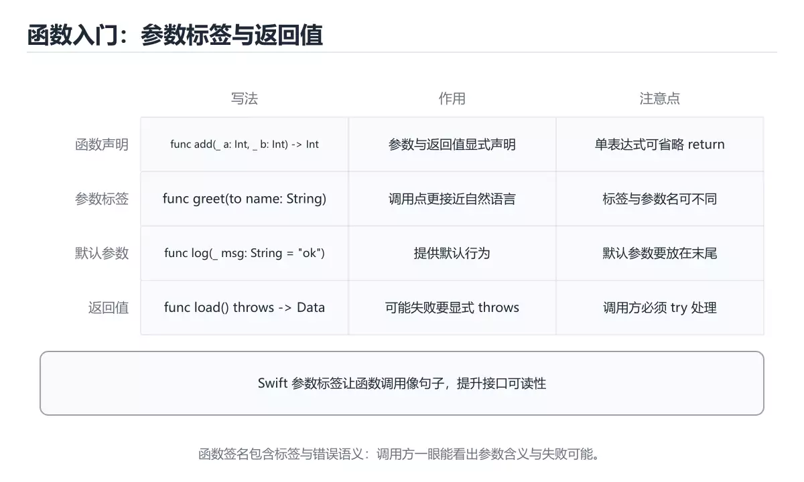
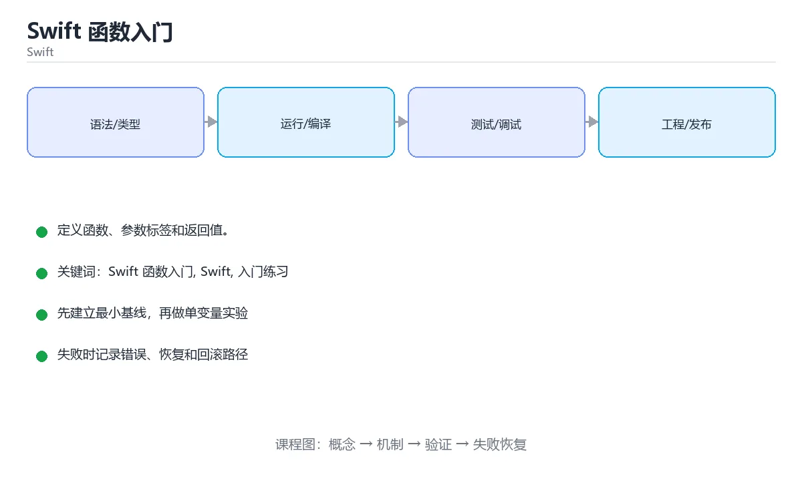

# Swift 函数入门

> 内容更新时间：2026-10-06 · 学习阶段：基础 · 预计用时：40 分钟





## 学习目标

- 先认识Swift 函数入门需要的工具、输入和输出。
- 按步骤运行最小示例，并记录结果与错误。
- 用一个边界输入验证自己是否真正掌握。

## 前置知识

- 会进行基本的文件或命令行操作。
- 不需要预先掌握「Swift」的高级知识。

## 一句话入门

定义函数、参数标签和返回值。

## 最小示例

```swift
func square(_ n: Int) -> Int { n * n }

print("square(7)=\(square(7))")
```

## 预期输出

```text
square(7)=49
```

## 常见错误与排查

> 说明：本表由《Swift 函数入门》的核心知识整理（2026-10-07），人工复核进度见 docs/content_review_batches.md。

| 易错点 | 容易踩的做法 | 正确结论 |
| --- | --- | --- |
| 参数标签与参数名混淆 | 调用点可读性差或编译失败 | 明确外部标签与内部名称 |
| 返回类型表达不准确 | 调用方误用返回值 | 让返回类型表达真实含义 |
| 默认参数与重载混用 | 调用解析不明确 | 控制重载数量，让调用点一目了然 |

## 动手练习

1. 原样运行最小示例，保存命令和输出。
2. 把数字 2 改成 10，预测并验证新结果。
3. 制造一个错误输入，写出错误信息和修复方法。

## 本课小结

- 入门阶段先保证能运行、能观察、能解释，再追求复杂功能。
- 每次只改一个变量，记录预测与实际结果。
- 遇到错误先看第一条错误信息，再回到最小示例。

## 代码实验：把示例跑成证据

### 实验一：建立基线

```swift
func square(_ n: Int) -> Int { n * n }

print("square(7)=\(square(7))")
```

### 实验二：只改一个输入

沿用「Swift 函数入门」的最小示例做一次单变量实验：

| 实验 | 改动 | 预测 | 实际 | 结论 |
| --- | --- | --- | --- | --- |
| 基线 | 保持「Swift 函数入门」示例原样 |  |  |  |
| 边界 | 把Swift 函数入门换成空值或极值 |  |  |  |
| 失败 | 给Swift传入非法输入 |  |  |  |

做完后用一句话写出「Swift 函数入门」的结论：输入怎么变，结果才怎么变。

### 实验三：制造一个可控错误

把 square 的一个参数换成不兼容的类型，先预测报错位置再实际运行；预测与实际的差异就是本课的考点。

| 实验 | 改动 | 预测 | 实际 | 结论 |
| --- | --- | --- | --- | --- |
| 基线 | 保持原样 |  |  |  |
| 边界 |  |  |  |  |
| 失败 |  |  |  |  |

### 实验四：用三句话复述

1. 先写清 Swift 函数入门 的输入契约：类型、范围、缺省值与非法值分别怎么处理？
2. square 的执行顺序里，哪一步会写数据或产生外部副作用？
3. 输出如何验证，失败时第一条可观察证据是什么？

## Swift 基础机制速览

### 编译、常量与变量

Swift 使用 LLVM 编译成原生代码，Xcode 和 Swift Package Manager 是主要工具链。`let` 声明常量，`var` 声明变量；优先使用 let，让编译器帮助你发现意外修改。类型推断根据初始值确定类型，公共 API 和复杂表达式仍应显式标注。字符串、数组、字典和集合都有值语义，赋值或传参时发生写时复制，修改副本通常不会影响原值。

### 可选值、解包与空安全

`Optional` 表示可能有值也可能为 nil，必须显式处理。`if let`、`guard let`、`??` 和可选链 `?.` 是常用解包方式；强制解包 `!` 只应在逻辑上绝不可能为空且有测试保证时使用。`guard` 适合提前退出，让正常路径保持在函数主体层级。区分“值为 nil”和“值为空字符串/空数组”，不要把两者混为一谈。

### 函数、闭包与参数标签

Swift 函数支持参数标签、默认参数、可变参数、输入输出参数和抛出错误。参数标签让调用点更接近自然语言，`_` 可以省略标签。闭包捕获外部变量，默认是引用捕获；需要修改捕获值或在并发环境中使用时，要明确捕获列表和所有权。尾随闭包语法让回调、排序和异步代码更易读，但嵌套过深时应提取成命名函数。

### 结构体、类、协议与扩展

结构体是值类型，类是引用类型；优先使用结构体表达数据，除非需要继承、身份或共享可变状态。协议定义能力契约，扩展可以为已有类型添加方法，泛型让算法适用于多种类型。协议组合、关联类型和 existential 各有取舍。属性观察器、计算属性和懒加载属性让状态管理更清晰，但要避免在初始化完成前访问依赖属性。

### 内存、并发与错误处理

Swift 使用 ARC 自动管理引用计数，强引用循环会让对象无法释放；闭包捕获 self 时使用 `[weak self]` 或 `[unowned self]` 要理解生命周期。错误用 `throws` 和 `try` 传播，`defer` 负责清理。结构化并发使用 async/await、Task 和 actor 隔离共享状态；并发代码仍要处理取消、优先级和数据竞争。测试时分别覆盖值语义、可选值边界和异步失败路径。

## 可运行练习

本节围绕Swift 函数入门安排 3 个可交付任务，每个任务都要求留下可以复查的记录。

### 任务 1：用自己的话画出结构

不看书，用一张图说清「Swift 函数入门」的结构，画完再对照骨架：

- 主干：代码实验：把示例跑成证据 → 可运行示例 → 边界实验 → 复盘
- 连接线：在每条边上标出输入、输出与失败路径。
- 自检：能否用一句话说明Swift 函数入门与Swift的关系？

### 任务 2：做一次对比实验

**验收标准**：两个方案的差异必须落在「Swift 函数入门」的实际约束上；写清当Swift 函数入门越过哪条边界时应该换方案。

### 任务 3：迁移到自己的场景

**验收标准**：换一个人按你的记录重跑 square，能得到相同输出；得不到就补写缺失的前提。

## 故障现场

### 现场 1：参数标签与参数名混淆

**症状**：在《Swift 函数入门》的复现场景中，调用点可读性差或编译失败。

**根因**：“调用点可读性差或编译失败”只是表层结果。向上追溯会落到“参数标签与参数名混淆”这一步，因为它省略了《Swift 函数入门》的约束，使实现行为和预期模型发生了偏离。

**修复**：针对《Swift 函数入门》的问题，明确外部标签与内部名称。

**验证**：保留《Swift 函数入门》里触发“调用点可读性差或编译失败”的输入、版本和日志，按“明确外部标签与内部名称”完成修改后原样重放；只有失败现象消失且相邻场景仍可解释，才保留改动。

### 现场 2：返回类型表达不准确

**症状**：在《Swift 函数入门》的复现场景中，调用方误用返回值。

**根因**：当出现“返回类型表达不准确”时，执行路径已经绕过了《Swift 函数入门》的关键约束，最终以“调用方误用返回值”暴露出来；修复前必须先确认约束在哪里失效。

**修复**：针对《Swift 函数入门》的问题，让返回类型表达真实含义。

**验证**：先在《Swift 函数入门》中记录“返回类型表达不准确”留下的失败证据，再执行“让返回类型表达真实含义”并重放；确认错误路径变为明确结果，且修复没有掩盖同类故障。

### 现场 3：默认参数与重载混用

**症状**：在《Swift 函数入门》的复现场景中，调用解析不明确。

**根因**：触发点是把“默认参数与重载混用”当成安全做法。它没有满足《Swift 函数入门》要求的前提，因此先表现为“调用解析不明确”；排查时先完整复现这一段，再核对输入、配置与依赖。

**修复**：针对《Swift 函数入门》的问题，控制重载数量，让调用点一目了然。

**验证**：在《Swift 函数入门》中按“控制重载数量，让调用点一目了然”调整后，从“默认参数与重载混用”的触发条件重放同一条路径，确认“调用解析不明确”不再出现，并补一个相邻边界用例检查没有引入新问题。

## 版本与时效

- Swift 6.x 默认开启更严格的数据竞争检查；Swift 函数入门 的并发边界要先梳理。
- 升级前先用 square 建立基线：记录版本、命令和输出，升级后只比较这些可观察量。
- SwiftUI 与 Swift Testing 迭代最快；Swift 函数入门 的示例要注明工具链版本。
- 官方发布说明：https://www.swift.org/blog/

### 升级检查清单

- 先固定当前版本，跑通全部示例与测验，再升级工具链。
- 一次只改一个版本条件，把 Swift 函数入门 相关的差异单独记成一条结论。
- 先回归 Swift 函数入门 与 Swift 的默认行为和错误信息，再扩大测试范围。
- 升级完成后更新本课「最后复核 / 下次复核」日期，并记录 Swift 函数入门 的版本变化。

## 本课复习清单

离开本课前，逐项确认：

- [ ] 不看解析，能说出「Swift 中函数参数默认按什么方式传递？」的判断依据。
- [ ] 不看解析，能说出「Swift 示例运行后，控制台输出的内容是什么？」的判断依据。
- [ ] 不看解析，能说出「填空：Swift 函数入门术语速查中，表示的判断依据。
- [ ] 用 Swift 函数入门 构造一个正常输入和一个边界输入，分别记录输出与判断依据。
- [ ] 把本课最容易混淆的两个概念写成一句话对照。

| 复盘项 | 记录 |
| --- | --- |
| 已经能独立解释的考点 |  |
| 仍然说不清的概念 |  |
| 下一步验证动作 |  |

## 复习与自测

对照 代码实验：把示例跑成证据 复述本课结论，答不上来的部分回到 square 的示例重跑一次。

### 最小示例

```swift
func square(_ n: Int) -> Int { n * n }

print("square(7)=\(square(7))")
```

自检：这一节与相邻主题的边界在哪里？

### 预期输出

```text
square(7)=49
```

### 动手练习

自检：如果去掉这一节里的一个前提，结论会怎样变化？

### 语言专项实践：Swift 函数入门

围绕「Swift 函数入门、Swift、入门练习」说明变量生命周期、资源释放、并发模型和错误传播。语言语法只是入口，真正决定行为的是运行时、标准库和平台约束。

自检：这一节的关键输入与输出分别是什么？

## 术语速查

把「Swift 函数入门」里反复出现的术语集中放在一起。复习时先遮住右列，尝试用自己的话解释，再回到正文核对。

| 术语 | 一句话说明 |
| --- | --- |
| `func` | 声明函数的关键字，后面跟函数名与参数列表。 |
| `参数标签` | 调用时写在参数前的说明性标签，让调用语句更像自然语言。 |
| `默认参数` | 参数可以带默认值，调用时省略即使用默认值。 |
| `可变参数` | 用 ... 声明同类型不定个数参数，在函数体内当作数组使用。 |

## 考点精讲

### 考点 1：代码补全·Swift 函数入门

- **题目**：下面这段 Swift 代码摘自「Swift 函数入门」的正文示例。关于这段代码，下面哪一项说法与实际内容相符？
- **判断依据**：在「Swift 函数入门」里，题干的正确项是这段代码会产生可观察的输出，运行后能看到结果，在「Swift 函数入门」里要结合Swift 函数入门核对输出是否符合预期。把输入或边界换成空值、极值或失败情况后，结论要以「Swift 函数入门」的实际运行结果为准。这道题的关键在「Swift 函数入门」的Swift 函数入门、Swift、入门练习：先确认题干“下面这段 Swift 代码摘自Swi”问的是哪一步，再排除偷换前提的选项。

### 考点 2：概念判断·Swift 函数入门

- **题目**：单表达式函数 func square(_ n: Int) -> Int { n * n } 可以省略什么？
- **判断依据**：在「Swift 函数入门」里，可以省略 return。当函数体只有一个表达式时，Swift 允许省略 return，表达式结果就是返回值。“单表达式函数”与「Swift 函数入门」的术语表相呼应，只有符合Swift 函数入门、Swift、入门练习约束的“可以省略 return”才是正文支持的结论。

### 考点 3：多选辨析·Swift 函数入门

- **题目**：围绕“Swift 函数入门”中的 Swift 函数入门、Swift、入门练习，下列哪两项是本课强调的实践判断？
- **判断依据**：在「Swift 函数入门」里，题干的正确项是验证 Swift 时要固定版本并覆盖边界输入，结论才可复现；学习 Swift 函数入门 时要同时说明输入、输出和失败路径，不能只看正常流程。回到「Swift 函数入门」的正文示例，用“围绕Swift 函数入门中的 Swi”走一遍Swift 函数入门、Swift、入门练习的完整流程，能复现的结论才可以保留。

### 考点 4：概念判断·Swift 函数入门

- **题目**：Swift 示例运行后，控制台输出的内容是什么？
- **判断依据**：在「Swift 函数入门」里，结论应落在「square(7)=49，函数返回参数平方后插入字符串」。square 接收 Int 参数，返回 n n，调用 square(7) 得到 49，再用字符串插值拼进输出文本，得到 square(7)=49。在「Swift 函数入门」里，这道题要求区分概念与边界，「square(7)=49，函数返回参数平方后插入字符串」只有在题干给出的前提下才成立，而「square(7)=7，函数原样返回传入参数」、「square(7)=14，函数把参数翻倍后返回」缺少同一组条件。

### 考点 5：填空·____

- **题目**：填空：在「Swift 函数入门」的术语速查里，「Swift 使用 LLVM 编译成原生代码，Xcode 和 Swift Package Manager 是主要工具链。`____` 声明常量，`var` 声明变量；优先使用 ____，让编译器帮助你发现意外修改。类型推断根据初始值确定类型，公共」描述的是哪个术语？
- **判断依据**：在「Swift 函数入门」里，let。这道题的关键在「Swift 函数入门」的Swift 函数入门、Swift、入门练习：先确认题干“填空”问的是哪一步，再排除偷换前提的选项。这道题的关键在Swift 函数入门、Swift、入门练习：先确认题干“在Swift”问的是哪一步，再排除偷换前提的选项。

## English Overview

**Title:** Swift Functions

**Summary:** Define functions with labels and returns.

**Category:** Swift
**Level:** 入门
**Key terms:** Swift 函数入门, Swift, 入门练习

## 内容元数据

- 内容版本：v2.0
- 最后更新：2026-10-06
- 学习阶段：基础
- 适用环境：Swift 6 / Xcode 16+；本课聚焦 Swift 函数入门。
- 内容来源：内置结构化课程与工程实践整理
- 相关主题：Swift 函数入门、Swift、入门练习
- 质量版本：P0 测验标准 + P1 覆盖扩展 + P2 体验补全

## 语言专项实践：Swift 函数入门

### 一、工具链

| 阶段 | 推荐工具 | 验收标准 |
| --- | --- | --- |
| 编译构建 | swiftc / xcodebuild | 命令可复现且错误能被定位 |
| 测试 | XCTest + async 测试 | 命令可复现且错误能被定位 |
| 性能 | Instruments / signpost | 命令可复现且错误能被定位 |
| 发布 | TestFlight + App Store 审核 | 命令可复现且错误能被定位 |

### 二、运行时与内存模型

「Swift 函数入门」的「二、运行时与内存模型」一节补全如下：

- 定位：这一节说明二、运行时与内存模型在「Swift 函数入门」知识体系里的位置。
- 检查点：固定版本与输入重跑《Swift 函数入门》，记录两次差异并定位不稳定条件。
- 自检：能否用一个最小例子解释二、运行时与内存模型？

### 三、测试策略

- 单元测试覆盖核心规则和边界。
- 集成测试覆盖文件、网络、数据库或平台 API。
- 失败测试覆盖超时、取消、异常和资源耗尽。
- 性能测试记录基线，避免只凭感觉优化。

### 四、发布检查

- [ ] 版本和依赖锁定，构建可复现。
- [ ] 产物经过签名、校验和最小权限配置。
- [ ] 日志不泄露密钥和个人信息。
- [ ] 有升级、回滚和故障恢复说明。

## 参考资料与复核

- 最后复核：2026-10-04
- 下次复核：2026-11-10
- 复核范围：版本兼容、API 行为、安全建议与工程实践
- 来源性质：官方文档、标准或权威教材；正文为离线教学重组

| 参考资料 | 本课用途 |
| --- | --- |
| [Apple 人机界面指南](https://developer.apple.com/design/human-interface-guidelines/) | iOS 设计规范与可访问性 |
| [Swift 官方文档](https://www.swift.org/documentation/) | 工具链、包管理与语言演进 |
| [XCTest 文档](https://developer.apple.com/documentation/xctest) | 单元测试与 UI 测试 |

> 「Swift 函数入门」的链接用于离线阅读后的延伸核对；App 不会自动联网。

## 复习与迁移

复习目标：把「Swift 函数入门」的判断标准放回可复现的例子里。先自己作答，再对照依据；如果结论正确但理由不完整，回到正文补足前提。

### 概念复述

- 用一句话说明「Swift 函数入门」解决什么问题：定义函数、参数标签和返回值。
- 写出Swift 函数入门、Swift、入门练习之间的关系，并各举一个例子。
- 说出本课最容易混淆的两个概念，以及区分它们的判据。

### 正文逐节复核

- **Swift 基础机制速览**：Swift 使用 LLVM 编译成原生代码，Xcode 和 Swift Package Manager 是主要工具链。
- **实践任务**：本节围绕Swift 函数入门安排 3 个可交付任务，每个任务都要求留下可以复查的记录。
- **逐节复习与自检**：围绕「Swift 函数入门、Swift、入门练习」说明变量生命周期、资源释放、并发模型和错误传播。

### 测验回顾

1. 下面这段 Swift 代码摘自「Swift 函数入门」的正文示例。关于这段代码，下面哪一项说法与实际内容相符？
   - 依据：在「Swift 函数入门」里，题干的正确项是这段代码会产生可观察的输出，运行后能看到结果，在「Swift 函数入门」里要结合Swift 函数入门核对输出是否符合预期。把输入或边界换成空值、极值或失败情况后，结论要以「Swift 函数入门」的实际运行结果为准。这道题的关键在「Swift 函数入门」的Swift 函数入门、Swift、入门练习：先确认题干“下面这段 Swift 代码摘自Swi”问的是哪一步，再排除偷换前提的选项。
2. 单表达式函数 func square(_ n: Int) -> Int { n * n } 可以省略什么？
   - 依据：在「Swift 函数入门」里，可以省略 return。当函数体只有一个表达式时，Swift 允许省略 return，表达式结果就是返回值。“单表达式函数”与「Swift 函数入门」的术语表相呼应，只有符合Swift 函数入门、Swift、入门练习约束的“可以省略 return”才是正文支持的结论。
3. 围绕“Swift 函数入门”中的 Swift 函数入门、Swift、入门练习，下列哪两项是本课强调的实践判断？
   - 依据：在「Swift 函数入门」里，题干的正确项是验证 Swift 时要固定版本并覆盖边界输入，结论才可复现；学习 Swift 函数入门 时要同时说明输入、输出和失败路径，不能只看正常流程。回到「Swift 函数入门」的正文示例，用“围绕Swift 函数入门中的 Swi”走一遍Swift 函数入门、Swift、入门练习的完整流程，能复现的结论才可以保留。
4. Swift 示例运行后，控制台输出的内容是什么？
   - 依据：在「Swift 函数入门」里，结论应落在「square(7)=49，函数返回参数平方后插入字符串」。square 接收 Int 参数，返回 n n，调用 square(7) 得到 49，再用字符串插值拼进输出文本，得到 square(7)=49。在「Swift 函数入门」里，这道题要求区分概念与边界，「square(7)=49，函数返回参数平方后插入字符串」只有在题干给出的前提下才成立，而「square(7)=7，函数原样返回传入参数」、「square(7)=14，函数把参数翻倍后返回」缺少同一组条件。
5. 填空：在「Swift 函数入门」的术语速查里，「Swift 使用 LLVM 编译成原生代码，Xcode 和 Swift Package Manager 是主要工具链。`____` 声明常量，`var` 声明变量；优先使用 ____，让编译器帮助你发现意外修改。类型推断根据初始值确定类型，公共」描述的是哪个术语？
   - 依据：在「Swift 函数入门」里，let。这道题的关键在「Swift 函数入门」的Swift 函数入门、Swift、入门练习：先确认题干“填空”问的是哪一步，再排除偷换前提的选项。这道题的关键在Swift 函数入门、Swift、入门练习：先确认题干“在Swift”问的是哪一步，再排除偷换前提的选项。

### 迁移练习

把「Swift 函数入门」的结论迁移到相邻主题，每次迁移都写清预测与证据：

1. 换输入：用Swift 函数入门处理一组你自己的数据，对比教材示例的结果差异。
2. 换失败条件：制造一个Swift相关的错误，说明如何从错误信息定位根因。
3. 换规模：把数据量或并发度提高一个数量级，说明「Swift 函数入门」的结论是否仍成立。

## 工程化精练：决策、失败与验证

这一章把「Swift 函数入门」从“看懂”推进到“能判断、能验证、能排错”。所有判断都围绕Swift 函数入门、Swift与入门练习展开，并与前文的示例、测验和失败现场互相对照。

### 一、Swift 函数入门 的判断算法

| 步骤 | 要回答的问题 | 判断依据 | 记录什么 |
| --- | --- | --- | --- |
| 1. 定目标 | 「Swift 函数入门」这一步要解决什么问题？ | 把Swift 函数入门的目标写成一句可验证的结论 | 输入、约束、成功标准 |
| 2. 找边界 | Swift在什么条件下失效？ | 先列空值、极值、重复和失败路径 | 反例与触发条件 |
| 3. 跑基线 | 原始示例的真实输出是什么？ | 命令、版本和环境必须可复现 | 命令、输出、耗时 |
| 4. 只改一处 | 把入门练习换成另一种取值会怎样？ | 预测写在运行之前 | 预测与实际的差异 |
| 5. 回写结论 | 结论能否被他人复现？ | 把判断写成清单或测试 | 结论、证据、遗留问题 |

这张表的用法不是从上到下浏览，而是每次只填一行：先用「Swift 函数入门」前文的示例验证第 3 行，再故意破坏一个条件验证第 2 行。当你能在不看解析的情况下说出Swift 函数入门的判断依据，才算真正掌握本课。

- 先从Swift 函数入门入手：把它写成“输入是什么、输出是什么、哪一步最容易出错”。如果这三句话中有一句说不清，说明对「Swift 函数入门」的理解还停留在术语层面，需要回到正文的最小示例重新观察一次。

- 再把Swift当成对照实验的变量：固定其他条件，只改变它的取值，记录输出是否变化。结论“变”或“不变”都要写出理由，并说明这个理由能否被他人独立复现。

- 针对入门练习做一次失败演练：故意给出空值、极值或错误类型，观察「Swift 函数入门」的报错位置和处理方式。错误信息只是入口，真正要定位的是哪一层假设被破坏。

- 把「Swift 函数入门」的结论压缩成一条可执行清单：先检查输入，再检查版本与环境，然后跑最小用例，最后才扩大规模。顺序颠倒会让排错范围成倍增加。

- 如果结论依赖时间或规模，就把数据量提高一个数量级再跑一次。在「Swift 函数入门」里，小样本成立不代表大样本成立，复杂度、资源占用和失败率都要重新记录。

- 如果结论依赖并发或共享状态，就固定输入并连续运行多次。结果不一致时，优先怀疑「Swift 函数入门」中Swift 函数入门相关步骤的隐藏状态，而不是先改代码。

- 把「Swift 函数入门」的判断写成测试：一个正常用例、一个边界用例、一个失败用例。测试通过只是起点，还要确认失败用例确实以预期方式失败。

- 把本课与相邻主题连起来：Swift 函数入门解决的是“怎么做”，Swift回答“什么时候不适用”。两者都答得出来，迁移才算完成。

> 第 2 轮复核「Swift 函数入门」：把上面的结论逐条改写为可验证的问题，并记录仍不确定的部分。

- 先从Swift 函数入门入手：把它写成“输入是什么、输出是什么、哪一步最容易出错”。如果这三句话中有一句说不清，说明对「Swift 函数入门」的理解还停留在术语层面，需要回到正文的最小示例重新观察一次。

- 再把Swift当成对照实验的变量：固定其他条件，只改变它的取值，记录输出是否变化。结论“变”或“不变”都要写出理由，并说明这个理由能否被他人独立复现。

- 针对入门练习做一次失败演练：故意给出空值、极值或错误类型，观察「Swift 函数入门」的报错位置和处理方式。错误信息只是入口，真正要定位的是哪一层假设被破坏。

- 把「Swift 函数入门」的结论压缩成一条可执行清单：先检查输入，再检查版本与环境，然后跑最小用例，最后才扩大规模。顺序颠倒会让排错范围成倍增加。

- 如果结论依赖时间或规模，就把数据量提高一个数量级再跑一次。在「Swift 函数入门」里，小样本成立不代表大样本成立，复杂度、资源占用和失败率都要重新记录。

- 如果结论依赖并发或共享状态，就固定输入并连续运行多次。结果不一致时，优先怀疑「Swift 函数入门」中Swift 函数入门相关步骤的隐藏状态，而不是先改代码。

- 把「Swift 函数入门」的判断写成测试：一个正常用例、一个边界用例、一个失败用例。测试通过只是起点，还要确认失败用例确实以预期方式失败。

- 把本课与相邻主题连起来：Swift 函数入门解决的是“怎么做”，Swift回答“什么时候不适用”。两者都答得出来，迁移才算完成。

> 第 3 轮复核「Swift 函数入门」：把上面的结论逐条改写为可验证的问题，并记录仍不确定的部分。

- 先从Swift 函数入门入手：把它写成“输入是什么、输出是什么、哪一步最容易出错”。如果这三句话中有一句说不清，说明对「Swift 函数入门」的理解还停留在术语层面，需要回到正文的最小示例重新观察一次。

- 再把Swift当成对照实验的变量：固定其他条件，只改变它的取值，记录输出是否变化。结论“变”或“不变”都要写出理由，并说明这个理由能否被他人独立复现。

- 针对入门练习做一次失败演练：故意给出空值、极值或错误类型，观察「Swift 函数入门」的报错位置和处理方式。错误信息只是入口，真正要定位的是哪一层假设被破坏。

- 把「Swift 函数入门」的结论压缩成一条可执行清单：先检查输入，再检查版本与环境，然后跑最小用例，最后才扩大规模。顺序颠倒会让排错范围成倍增加。

- 如果结论依赖时间或规模，就把数据量提高一个数量级再跑一次。在「Swift 函数入门」里，小样本成立不代表大样本成立，复杂度、资源占用和失败率都要重新记录。

- 如果结论依赖并发或共享状态，就固定输入并连续运行多次。结果不一致时，优先怀疑「Swift 函数入门」中Swift 函数入门相关步骤的隐藏状态，而不是先改代码。

- 把「Swift 函数入门」的判断写成测试：一个正常用例、一个边界用例、一个失败用例。测试通过只是起点，还要确认失败用例确实以预期方式失败。

- 把本课与相邻主题连起来：Swift 函数入门解决的是“怎么做”，Swift回答“什么时候不适用”。两者都答得出来，迁移才算完成。

> 第 4 轮复核「Swift 函数入门」：把上面的结论逐条改写为可验证的问题，并记录仍不确定的部分。

- 先从Swift 函数入门入手：把它写成“输入是什么、输出是什么、哪一步最容易出错”。如果这三句话中有一句说不清，说明对「Swift 函数入门」的理解还停留在术语层面，需要回到正文的最小示例重新观察一次。

- 再把Swift当成对照实验的变量：固定其他条件，只改变它的取值，记录输出是否变化。结论“变”或“不变”都要写出理由，并说明这个理由能否被他人独立复现。

- 针对入门练习做一次失败演练：故意给出空值、极值或错误类型，观察「Swift 函数入门」的报错位置和处理方式。错误信息只是入口，真正要定位的是哪一层假设被破坏。

- 把「Swift 函数入门」的结论压缩成一条可执行清单：先检查输入，再检查版本与环境，然后跑最小用例，最后才扩大规模。顺序颠倒会让排错范围成倍增加。

- 如果结论依赖时间或规模，就把数据量提高一个数量级再跑一次。在「Swift 函数入门」里，小样本成立不代表大样本成立，复杂度、资源占用和失败率都要重新记录。

- 如果结论依赖并发或共享状态，就固定输入并连续运行多次。结果不一致时，优先怀疑「Swift 函数入门」中Swift 函数入门相关步骤的隐藏状态，而不是先改代码。

- 把「Swift 函数入门」的判断写成测试：一个正常用例、一个边界用例、一个失败用例。测试通过只是起点，还要确认失败用例确实以预期方式失败。

- 把本课与相邻主题连起来：Swift 函数入门解决的是“怎么做”，Swift回答“什么时候不适用”。两者都答得出来，迁移才算完成。

> 第 5 轮复核「Swift 函数入门」：把上面的结论逐条改写为可验证的问题，并记录仍不确定的部分。

- 先从Swift 函数入门入手：把它写成“输入是什么、输出是什么、哪一步最容易出错”。如果这三句话中有一句说不清，说明对「Swift 函数入门」的理解还停留在术语层面，需要回到正文的最小示例重新观察一次。

- 再把Swift当成对照实验的变量：固定其他条件，只改变它的取值，记录输出是否变化。结论“变”或“不变”都要写出理由，并说明这个理由能否被他人独立复现。

- 针对入门练习做一次失败演练：故意给出空值、极值或错误类型，观察「Swift 函数入门」的报错位置和处理方式。错误信息只是入口，真正要定位的是哪一层假设被破坏。

- 把「Swift 函数入门」的结论压缩成一条可执行清单：先检查输入，再检查版本与环境，然后跑最小用例，最后才扩大规模。顺序颠倒会让排错范围成倍增加。

- 如果结论依赖时间或规模，就把数据量提高一个数量级再跑一次。在「Swift 函数入门」里，小样本成立不代表大样本成立，复杂度、资源占用和失败率都要重新记录。

- 如果结论依赖并发或共享状态，就固定输入并连续运行多次。结果不一致时，优先怀疑「Swift 函数入门」中Swift 函数入门相关步骤的隐藏状态，而不是先改代码。

- 把「Swift 函数入门」的判断写成测试：一个正常用例、一个边界用例、一个失败用例。测试通过只是起点，还要确认失败用例确实以预期方式失败。

- 把本课与相邻主题连起来：Swift 函数入门解决的是“怎么做”，Swift回答“什么时候不适用”。两者都答得出来，迁移才算完成。

### 二、Swift 函数入门 的机制拆解与自测

把本课考点还原成可回答的问题，再逐题写出依据：

**问题 1**：下面这段 Swift 代码摘自「Swift 函数入门」的正文示例。关于这段代码，下面哪一项说法与实际内容相符？

- 关联术语：Swift 函数入门
- 判断依据：回到「Swift 函数入门」正文对应小节，先用最小示例验证再下结论。
- 追问：如果把Swift 函数入门的条件换成边界值，这个结论是否仍然成立？

**问题 2**：单表达式函数 func square(_ n: Int) -> Int { n * n } 可以省略什么？

- 关联术语：Swift
- 判断依据：可以省略 return
- 追问：如果把Swift的条件换成边界值，这个结论是否仍然成立？

**问题 3**：围绕“Swift 函数入门”中的 Swift 函数入门、Swift、入门练习，下列哪两项是本课强调的实践判断？

- 关联术语：入门练习
- 判断依据：验证 Swift 时要固定版本并覆盖边界输入，结论才可复现
- 追问：Swift 的条件变化到什么程度时，需要换一种做法？

**问题 4**：Swift 示例运行后，控制台输出的内容是什么？

- 关联术语：Swift 函数入门
- 判断依据：square(7)=49，函数返回参数平方后插入字符串
- 追问：如果把Swift 函数入门的条件换成边界值，这个结论是否仍然成立？

**问题 5**：填空：在「Swift 函数入门」的术语速查里，「Swift 使用 LLVM 编译成原生代码，Xcode 和 Swift Package Manager 是主要工具链。`____` 声明常量，`var` 声明变量；优先使用 ____，让编译器帮助你发现意外修改。类型推断根据初始值确定类型，公共」描述的是哪个术语？

- 关联术语：Swift
- 判断依据：回到「Swift 函数入门」正文对应小节，先用最小示例验证再下结论。
- 追问：如果把Swift的条件换成边界值，这个结论是否仍然成立？

### 三、失败模式与修复顺序

| 失败信号 | 常见根因 | 先做什么 | 修复后如何确认 |
| --- | --- | --- | --- |
| 「Swift 函数入门」中 Swift 函数入门 相关步骤报错 | 输入、版本或前置条件与示例不一致 | 保留第一条错误信息，回到最小输入 | 用可以省略 return复跑，确认输出可复现 |
| 「Swift 函数入门」中 Swift 相关步骤报错 | 输入、版本或前置条件与示例不一致 | 保留第一条错误信息，回到最小输入 | 用验证 Swift 时要固定版本并覆盖边界输入，结论才可复现复跑，确认输出可复现 |
| 「Swift 函数入门」中 入门练习 相关步骤报错 | 输入、版本或前置条件与示例不一致 | 保留第一条错误信息，回到最小输入 | 用square(7)=49，函数返回参数平方后插入字符串复跑，确认输出可复现 |
- 检查点：固定版本与输入重跑《Swift 函数入门》，记录两次差异并定位不稳定条件。
| 单次结果正确但规模一大就失效 | 只测了正常路径，没有覆盖边界 | 把数据量或并发度提高一个数量级 | 记录边界值、耗时与失败率 |

排错顺序固定为：先复现，再缩小输入，然后只改一个条件，最后把结论写成回归用例。对「Swift 函数入门」来说，任何不能复现的“修好了”都不算完成。

### 四、离开本课前的验证清单

| 检查项 | 通过标准 | 证据 |
| --- | --- | --- |
| 能复述 | 用三句话说明「Swift 函数入门」解决什么问题、边界在哪 | 不看解析写出的结论 |
| 能运行 | 最小示例在本机跑通 | 命令、输出与版本 |
| 能改条件 | 只改一个输入并解释差异 | 预测与实际的对照 |
| 能排错 | 至少制造并修复一个失败 | 错误信息与修复步骤 |
| 能迁移 | 把Swift 函数入门、Swift、入门练习用到新场景 | 一个自选练习的结论 |

完成标准：能不看解析说清「Swift 函数入门」全部自测题的依据，并且至少有一条Swift 函数入门相关的结论经过真实运行验证。如果某一步只停留在“感觉懂了”，就把它写成下一轮针对「Swift 函数入门」的最小验证任务。

### 五、把结论写成可检查的证据

学习「Swift 函数入门」时，最容易出现的情况是“听过、看懂了，但换一个输入就说不清”。下面把Swift 函数入门与Swift放进一条可检查的证据链：每一句结论都要能回答“从哪里来、在什么条件下成立、失败时怎么发现”。

| 证据类型 | 本课要求 | 不合格的表现 |
| --- | --- | --- |
| 概念证据 | 用一句话说明Swift 函数入门的定义与适用场景 | 只背术语，说不出它解决什么问题 |
| 运行证据 | 能复现「Swift 函数入门」的最小示例 | 输出与记录对不上，或换机器就不一致 |
| 对照证据 | 只改一个条件，说明差异来自哪里 | 一次改多个变量，无法归因 |
| 失败证据 | 故意制造错误并记录恢复步骤 | 只测正常路径，失败时靠猜 |
| 迁移证据 | 把Swift用到自选场景 | 换一个例子就完全套不上 |

举例：可以省略 return。把这个结论代回「Swift 函数入门」的正文，找出它对应的输入、处理步骤与输出；再换掉其中一个条件，观察结论是否仍然成立。能完成这一步，才说明这条知识已经从“记忆”变成“可用的判断”。

最后留一个自检问题：如果只能保留三条笔记，你会写下哪三句？把答案限定为「Swift 函数入门」中的可验证结论，并给每条结论配一个反例。这三句加上对应反例，就是本课最值得带入后续课程的复习材料。
