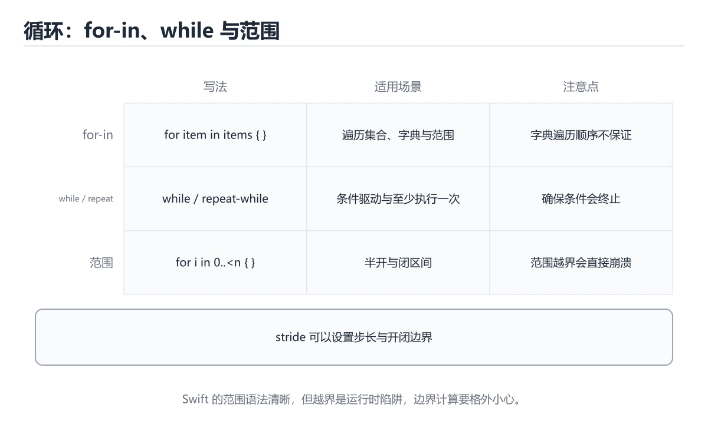
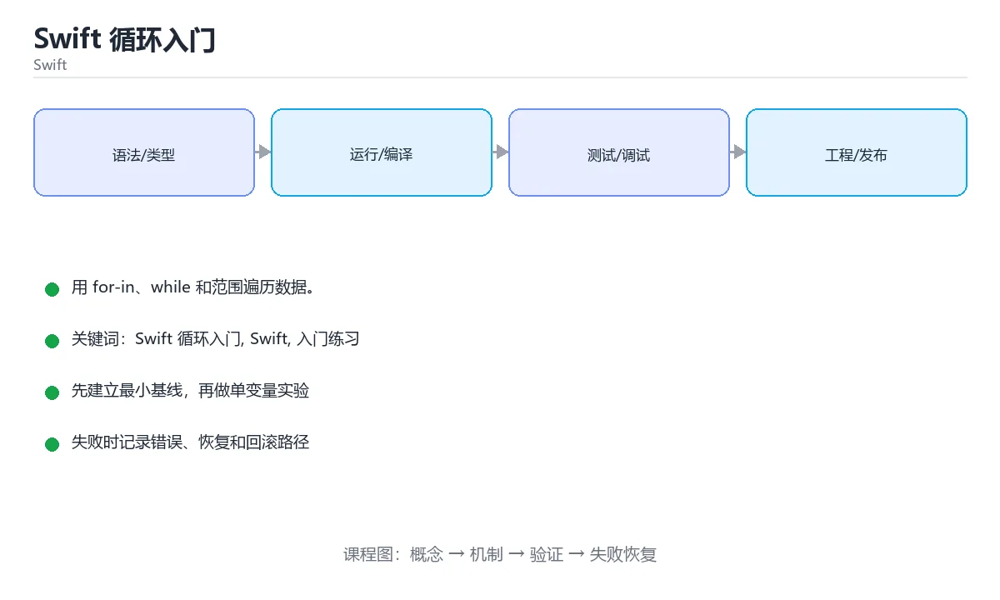

# 本课主题

> 内容更新时间：2026-10-03





## 学习目标

- 先认识本课主题需要的工具、输入和输出。
- 按步骤运行最小示例，并记录结果与错误。
- 用一个边界输入验证自己是否真正掌握。

## 前置知识

- 会进行基本的文件或命令行操作。
- 不需要预先掌握「Swift」的高级知识。

## 一句话入门

用 for-in、while 和范围遍历数据。

## 最小示例

```swift
var total = 0
for i in 1...5 {
    total += i
}
print("total=\(total)")
```

## 预期输出

```text
total=15
```

## 常见错误

- 强制解包 nil 可选值，运行时崩溃。
- 复制命令时遗漏空格、引号或必要参数。

## 动手练习

1. 原样运行最小示例，保存命令和输出。
2. 把数字 2 改成 10，预测并验证新结果。
3. 制造一个错误输入，写出错误信息和修复方法。

## 本课小结

- 入门阶段先保证能运行、能观察、能解释，再追求复杂功能。
- 每次只改一个变量，记录预测与实际结果。
- 遇到错误先看第一条错误信息，再回到最小示例。

## 代码实验：把示例跑成证据

### 实验一：建立基线

```swift
var total = 0
for i in 1...5 {
    total += i
}
print("total=\(total)")
```

### 实验二：只改一个输入

### 实验三：制造一个可控错误

把输入改成空值、极值或类型不匹配的形式，记录程序抛出的第一条错误、发生位置和恢复方式。

| 实验 | 改动 | 预测 | 实际 | 结论 |
| --- | --- | --- | --- | --- |
| 基线 | 保持原样 |  |  |  |
| 边界 |  |  |  |  |
| 失败 |  |  |  |  |

### 实验四：用三句话复述

1. 输入是什么，哪些输入属于合法范围，哪些属于边界或非法范围？
2. 程序按什么顺序处理输入，在哪一步产生了状态变化或副作用？
3. 输出如何验证，失败时第一条可观察证据是什么？

## Swift 基础机制速览

### 编译、常量与变量

Swift 使用 LLVM 编译成原生代码，Xcode 和 Swift Package Manager 是主要工具链。`let` 声明常量，`var` 声明变量；优先使用 let，让编译器帮助你发现意外修改。类型推断根据初始值确定类型，公共 API 和复杂表达式仍应显式标注。字符串、数组、字典和集合都有值语义，赋值或传参时发生写时复制，修改副本通常不会影响原值。

### 可选值、解包与空安全

`Optional` 表示可能有值也可能为 nil，必须显式处理。`if let`、`guard let`、`??` 和可选链 `?.` 是常用解包方式；强制解包 `!` 只应在逻辑上绝不可能为空且有测试保证时使用。`guard` 适合提前退出，让正常路径保持在函数主体层级。区分“值为 nil”和“值为空字符串/空数组”，不要把两者混为一谈。

### 函数、闭包与参数标签

Swift 函数支持参数标签、默认参数、可变参数、输入输出参数和抛出错误。参数标签让调用点更接近自然语言，`_` 可以省略标签。闭包捕获外部变量，默认是引用捕获；需要修改捕获值或在并发环境中使用时，要明确捕获列表和所有权。尾随闭包语法让回调、排序和异步代码更易读，但嵌套过深时应提取成命名函数。

### 结构体、类、协议与扩展

结构体是值类型，类是引用类型；优先使用结构体表达数据，除非需要继承、身份或共享可变状态。协议定义能力契约，扩展可以为已有类型添加方法，泛型让算法适用于多种类型。协议组合、关联类型和 existential 各有取舍。属性观察器、计算属性和懒加载属性让状态管理更清晰，但要避免在初始化完成前访问依赖属性。

### 内存、并发与错误处理

Swift 使用 ARC 自动管理引用计数，强引用循环会让对象无法释放；闭包捕获 self 时使用 `[weak self]` 或 `[unowned self]` 要理解生命周期。错误用 `throws` 和 `try` 传播，`defer` 负责清理。结构化并发使用 async/await、Task 和 actor 隔离共享状态；并发代码仍要处理取消、优先级和数据竞争。测试时分别覆盖值语义、可选值边界和异步失败路径。

## 实践任务

本节围绕本课主题安排 3 个可交付任务，每个任务都要求留下可以复查的记录。

### 任务 1：用自己的话画出结构

### 任务 2：做一次对比实验

**验收标准**：表格里两个方案的结论不能完全一样；写下“在什么条件下应该换方案”。

### 任务 3：迁移到自己的场景

**验收标准**：至少有一个可复现的命令、代码片段或数据样例；结论能被别人独立检查。

## 故障现场

### 现场 1：本课的 本课主题 常规用例通过，但边界用例失败

### 现场 2：本课的 Swift 结果在两次运行之间不一致

**症状**：在本课的练习或生产场景里出现“本课的 Swift 结果在两次运行之间不一致”。

**复现**：准备一组最小输入，只保留触发“本课的 Swift 结果在两次运行之间不一致”的必要条件，连续运行两次确认结果稳定。

**定位**：围绕“Swift 依赖了当前版本、执行顺序或共享状态，单次运行无法暴露差异”检查调用链、输入数据和环境配置，先验证假设再改代码。

**预防**：把“本课的 Swift 结果在两次运行之间不一致”写成一条自动化用例，并在本课的验收清单里保留对应检查项。

### 现场 3：本课的验证只在开发机通过

**症状**：在本课的练习或生产场景里出现“本课的验证只在开发机通过”。

## 版本与时效

- Swift 6.x 默认开启更严格的数据竞争检查，迁移成本主要在并发边界
- 升级前先用 Swift 6 语言模式编译，再逐模块处理 Sendable 与 actor 隔离
- SwiftUI 与 Swift Testing 是当前迭代最快的两块
- 官方发布说明：https://www.swift.org/blog/

### 升级检查清单

- 先固定当前版本，跑通全部示例与测验，再升级工具链。
- 只改一个版本变量，记录编译、测试、性能与产物体积的变化。
- 重点回归默认值、弃用警告、序列化格式、并发语义和错误信息。
- 升级完成后更新本课的“最后复核 / 下次复核”日期与版本说明。

## 本课复习清单

离开本课前，逐项确认：

- [ ] 不看解析，能说出「Swift 中 1...5 与 1..<5 的区别是？」的判断依据。
- [ ] 不看解析，能说出「示例中的 for i in 1...5 累加后输出是什么？」的判断依据。
- [ ] 不看解析，能说出「需要以步长 2 遍历 0 到 10，正确的写法是？」的判断依据。
- [ ] 不看解析，能说出「Swift 中 repeat-while 与 while 的区别是？」的判断依据。
- [ ] 不看解析，能说出「填空：本课主题术语速查中，表示「Swift 使用 LLVM 编译…」的判断依据。
- [ ] 至少运行一次本课示例，记录输入、输出和一个边界情况。
- [ ] 把本课最容易混淆的两个概念写成一句话对照。

| 复盘项 | 记录 |
| --- | --- |
| 已经能独立解释的考点 |  |
| 仍然说不清的概念 |  |
| 下一步验证动作 |  |

## 逐节复习与自检

下面按正文顺序回顾每一节，并给出一个自检问题；说不清的地方回到原章节补课。

### 一句话入门

自检：这一节的关键输入与输出分别是什么？

### 最小示例

```swift
var total = 0
for i in 1...5 {
    total += i
}
print("total=\(total)")
```

自检：这一节与相邻主题的边界在哪里？

### 预期输出

```text
total=15
```

### 动手练习

自检：如果去掉这一节里的一个前提，结论会怎样变化？

### 语言专项实践：本课主题

围绕「本课主题、Swift、入门练习」说明变量生命周期、资源释放、并发模型和错误传播。语言语法只是入口，真正决定行为的是运行时、标准库和平台约束。

自检：用自己的话复述这一节，并举一个反例。

## 术语速查

| 术语 | 本课语境 |
| --- | --- |
| `let` | Swift 使用 LLVM 编译成原生代码，Xcode 和 Swift Package Manager 是主要工具链。`let` 声明常量，`var` 声明变量；优先使用 let，让编译器帮助你发现意外修改。类型推断根据… |
| `var` | Swift 使用 LLVM 编译成原生代码，Xcode 和 Swift Package Manager 是主要工具链。`let` 声明常量，`var` 声明变量；优先使用 let，让编译器帮助你发现意外修改。类型推断根据… |
| `Optional` | `Optional` 表示可能有值也可能为 nil，必须显式处理。`if let`、`guard let`、`??` 和可选链 `?.` 是常用解包方式；强制解包 `!` 只应在逻辑上绝不可能为空且有测试保证时使用。`g… |
| `if let` | `Optional` 表示可能有值也可能为 nil，必须显式处理。`if let`、`guard let`、`??` 和可选链 `?.` 是常用解包方式；强制解包 `!` 只应在逻辑上绝不可能为空且有测试保证时使用。`g… |
| `guard let` | `Optional` 表示可能有值也可能为 nil，必须显式处理。`if let`、`guard let`、`??` 和可选链 `?.` 是常用解包方式；强制解包 `!` 只应在逻辑上绝不可能为空且有测试保证时使用。`g… |
| `??` | `Optional` 表示可能有值也可能为 nil，必须显式处理。`if let`、`guard let`、`??` 和可选链 `?.` 是常用解包方式；强制解包 `!` 只应在逻辑上绝不可能为空且有测试保证时使用。`g… |
| `?.` | `Optional` 表示可能有值也可能为 nil，必须显式处理。`if let`、`guard let`、`??` 和可选链 `?.` 是常用解包方式；强制解包 `!` 只应在逻辑上绝不可能为空且有测试保证时使用。`g… |
| `只应在逻辑上绝不可能为空且有测试保证时使用。` | `Optional` 表示可能有值也可能为 nil，必须显式处理。`if let`、`guard let`、`??` 和可选链 `?.` 是常用解包方式；强制解包 `!` 只应在逻辑上绝不可能为空且有测试保证时使用。`g… |
| `[weak self]` | Swift 使用 ARC 自动管理引用计数，强引用循环会让对象无法释放；闭包捕获 self 时使用 `[weak self]` 或 `[unowned self]` 要理解生命周期。错误用 `throws` 和 `try… |
| `[unowned self]` | Swift 使用 ARC 自动管理引用计数，强引用循环会让对象无法释放；闭包捕获 self 时使用 `[weak self]` 或 `[unowned self]` 要理解生命周期。错误用 `throws` 和 `try… |
| `throws` | Swift 使用 ARC 自动管理引用计数，强引用循环会让对象无法释放；闭包捕获 self 时使用 `[weak self]` 或 `[unowned self]` 要理解生命周期。错误用 `throws` 和 `try… |
| `try` | Swift 使用 ARC 自动管理引用计数，强引用循环会让对象无法释放；闭包捕获 self 时使用 `[weak self]` 或 `[unowned self]` 要理解生命周期。错误用 `throws` 和 `try… |

## 考点精讲

### 考点 1：围绕“Swift 循环入门”中的 Swift 循环入门、Swift、入门练习，下列哪两项是本课强调的实践判断？

- **判断依据**：正确答案包括「验证 Swift 时要固定版本并覆盖边界输入，结论才可复现」、「学习 Swift 循环入门 时要同时说明输入、输出和失败路径，不能只看正常流程」。正确答案是验证 Swift 时要固定版本并覆盖边界输入。判断这类题时，要把验证 Swift 时要固定版本并覆盖边界输入，结论才可复现。学习 Swi…放回题干限定的对象、输入和边界，只要 Swift 循环入门 的常规示例通过，就可以跳过边…、验证 Swift 时要固定版本并覆盖边界输入，结论才可复… 等说法虽然包含相关术语，但范围或前提与本题不一致。

### 考点 2：下面这段 Swift 代码复现了“Swift 循环入门”中 Swift 循环入门、Swift、入门练习 相关的一个常见故障，哪一项最准确地解释了问题？

- **判断依据**：本题应选「name 是可选类型，直接访问 count 无法通过编译，应使用 name?.count 或解包」（swift_loops 第 2 题）。.count 或解包（swift_loops 第 2 题）。Swift 循环入门 的安全访问需要显式处理。在这个复现里，要让 Swift 的结果符合预期，可以使用 name。

### 考点 3：需要以步长 2 遍历 0 到 10，正确的写法是？

- **判断依据**：符合题干条件的是「for i in stride(from: 0, through: 10, by: 2)」。stride 函数可以指定起点、终点与步长，through 表示包含终点，to 则表示不包含。如果只凭关键词作答，很容易把for i in 0...10 step 2、for (i = 0。i += 2)…与for i in stride(from: 0, through: 10…混在一起。

### 考点 4：Swift 中 repeat-while 与 while 的区别是？

- **判断依据**：结论应落在「repeat-while 先执行一次循环体，再判断条件」。结论应落在repeat-while 先执行一次循环体。repeat-while 把条件判断放在循环体之后，因此循环体至少执行一次，适合「先尝试、再决定是否继续」的流程。这道题要求区分概念与边界，「repeat-while 先执行一次循环体，再判断条件」只有在题干给出的前提下才成立，而「while 至少执行一次，repeat-while 可能…」、「两者完全等价，只是关键字不同」缺少同一组条件。

### 考点 5：填空：「Swift 循环入门」术语速查中，表示「Swift 使用 LLVM 编译成原生代码，Xcode 和 Swift Package Manager 是主要工具链。`____` 声明常量，`var` 声明变量；优先使用 ____，让编译器帮助你发现意外修改。类型推断根据初始值确定类型，公共…」的术语是什么？

- **判断依据**：类型推断根据初始值确定类型，公共…的术语是什么。围绕 填空：Swift 循环入门术语速查中，表示Swift 使用 L… 作答时，先用Swift 循环入门建立输入与输出的基线，再把let代入边界条件核对，结论才能复现。判断这类题时，要把「let」放回题干限定的对象、输入和边界， 等说法虽然包含相关术语，但范围或前提与本题不一致。

## English Overview

**Title:** Swift Loops

**Summary:** Iterate with for-in, while and ranges.

**Category:** Swift
**Level:** 入门
**Key terms:** 本课主题, Swift, 入门练习

## 内容元数据

- 内容版本：v2.0
- 最后更新：2026-10-03
- 学习阶段：入门
- 适用环境：Swift 6 / Xcode 16+
- 内容来源：内置结构化课程与工程实践整理
- 相关主题：本课主题、Swift、入门练习
- 质量版本：P0 测验标准 + P1 覆盖扩展 + P2 体验补全

## 语言专项实践：本课主题

### 一、工具链

| 阶段 | 推荐工具 | 验收标准 |
| --- | --- | --- |
| 编译构建 | swiftc / xcodebuild | 命令可复现且错误能被定位 |
| 测试 | XCTest + async 测试 | 命令可复现且错误能被定位 |
| 性能 | Instruments / signpost | 命令可复现且错误能被定位 |
| 发布 | TestFlight + App Store 审核 | 命令可复现且错误能被定位 |

### 二、运行时与内存模型

### 三、测试策略

- 单元测试覆盖核心规则和边界。
- 集成测试覆盖文件、网络、数据库或平台 API。
- 失败测试覆盖超时、取消、异常和资源耗尽。
- 性能测试记录基线，避免只凭感觉优化。

### 四、发布检查

- [ ] 版本和依赖锁定，构建可复现。
- [ ] 产物经过签名、校验和最小权限配置。
- [ ] 日志不泄露密钥和个人信息。
- [ ] 有升级、回滚和故障恢复说明。


## 参考资料与复核

- 最后复核：2026-10-04
- 下次复核：2027-04-04
- 复核范围：版本兼容、API 行为、安全建议与工程实践
- 来源性质：官方文档、标准或权威教材；正文为离线教学重组

| 参考资料 | 本课用途 |
| --- | --- |
| [Apple 人机界面指南](https://developer.apple.com/design/human-interface-guidelines/) | iOS 设计规范与可访问性 |
| [Swift 官方文档](https://www.swift.org/documentation/) | 工具链、包管理与语言演进 |
| [SwiftUI 文档](https://developer.apple.com/documentation/swiftui) | 声明式界面与状态 |

> 「Swift 循环入门」的链接用于离线阅读后的延伸核对；App 不会自动联网。

## 复习与迁移

- 围绕「围绕本课主题中的 本课主题、Swift、入门练习，下列哪两项是本课强调的实践判断？」做迁移时，先记录输入、边界和预期，再观察本课主题对结果的影响，并用「验证 Swift 时要固定版本并覆盖边界输入，结论才可复现；学习 Swift 循环入…」解释正常与失败路径。
- 把Swift放进最小实验：固定版本和输入，只改变一个条件，记录输出差异，并说明「name 是可选类型，直接访问 count 无法通过编译，应使用 name?.cou…」在什么前提下成立。
- 复习「需要以步长 2 遍历 0 到 10，正确的写法是？」时，不要只背结论；用入门练习的边界值复现一次，再把现象、原因和修复写成三步记录。
- 如果把本课主题换成空值、极值或并发输入，「repeat-while 先执行一次循环体，再判断条件」是否仍然成立？写出验证命令和观察到的结果。
- 围绕「填空：本课主题术语速查中，表示「Swift 使用 LLVM 编译成原生代码，Xcode 和 Sw…」做迁移时，先记录输入、边界和预期，再观察Swift对结果的影响，并用「let」解释正常与失败路径。
- 把入门练习放进最小实验：固定版本和输入，只改变一个条件，记录输出差异，并说明「验证 Swift 时要固定版本并覆盖边界输入，结论才可复现；学习 Swift 循环入…」在什么前提下成立。
- 复习「下面这段 Swift 代码复现了本课主题中 本课主题、Swift、入门练习 相关的一…」时，不要只背结论；用本课主题的边界值复现一次，再把现象、原因和修复写成三步记录。
- 如果把Swift换成空值、极值或并发输入，「for i in stride(from: 0, through: 10, by: …」是否仍然成立？写出验证命令和观察到的结果。
- 围绕「Swift 中 repeat-while 与 while 的区别是？」做迁移时，先记录输入、边界和预期，再观察入门练习对结果的影响，并用「repeat-while 先执行一次循环体，再判断条件」解释正常与失败路径。
- 把本课主题放进最小实验：固定版本和输入，只改变一个条件，记录输出差异，并说明「let」在什么前提下成立。
- 复习「围绕本课主题中的 本课主题、Swift、入门练习，下列哪两项是本课强调的实践判断？」时，不要只背结论；用Swift的边界值复现一次，再把现象、原因和修复写成三步记录。
- 如果把入门练习换成空值、极值或并发输入，「name 是可选类型，直接访问 count 无法通过编译，应使用 name?.cou…」是否仍然成立？写出验证命令和观察到的结果。
- 围绕「需要以步长 2 遍历 0 到 10，正确的写法是？」做迁移时，先记录输入、边界和预期，再观察本课主题对结果的影响，并用「for i in stride(from: 0, through: 10, by: …」解释正常与失败路径。
- 把Swift放进最小实验：固定版本和输入，只改变一个条件，记录输出差异，并说明「repeat-while 先执行一次循环体，再判断条件」在什么前提下成立。
- 复习「填空：本课主题术语速查中，表示「Swift 使用 LLVM 编译成原生代码，Xcode 和 Sw…」时，不要只背结论；用入门练习的边界值复现一次，再把现象、原因和修复写成三步记录。
- 如果把本课主题换成空值、极值或并发输入，「验证 Swift 时要固定版本并覆盖边界输入，结论才可复现；学习 Swift 循环入…」是否仍然成立？写出验证命令和观察到的结果。
- 围绕「下面这段 Swift 代码复现了本课主题中 本课主题、Swift、入门练习 相关的一…」做迁移时，先记录输入、边界和预期，再观察Swift对结果的影响，并用「name 是可选类型，直接访问 count 无法通过编译，应使用 name?.cou…」解释正常与失败路径。
- 把入门练习放进最小实验：固定版本和输入，只改变一个条件，记录输出差异，并说明「for i in stride(from: 0, through: 10, by: …」在什么前提下成立。
- 复习「Swift 中 repeat-while 与 while 的区别是？」时，不要只背结论；用本课主题的边界值复现一次，再把现象、原因和修复写成三步记录。
- 如果把Swift换成空值、极值或并发输入，「let」是否仍然成立？写出验证命令和观察到的结果。
- 围绕「围绕本课主题中的 本课主题、Swift、入门练习，下列哪两项是本课强调的实践判断？」做迁移时，先记录输入、边界和预期，再观察入门练习对结果的影响，并用「验证 Swift 时要固定版本并覆盖边界输入，结论才可复现；学习 Swift 循环入…」解释正常与失败路径。
- 把本课主题放进最小实验：固定版本和输入，只改变一个条件，记录输出差异，并说明「name 是可选类型，直接访问 count 无法通过编译，应使用 name?.cou…」在什么前提下成立。
- 复习「需要以步长 2 遍历 0 到 10，正确的写法是？」时，不要只背结论；用Swift的边界值复现一次，再把现象、原因和修复写成三步记录。
- 如果把入门练习换成空值、极值或并发输入，「repeat-while 先执行一次循环体，再判断条件」是否仍然成立？写出验证命令和观察到的结果。
- 围绕「填空：本课主题术语速查中，表示「Swift 使用 LLVM 编译成原生代码，Xcode 和 Sw…」做迁移时，先记录输入、边界和预期，再观察本课主题对结果的影响，并用「let」解释正常与失败路径。
- 把Swift放进最小实验：固定版本和输入，只改变一个条件，记录输出差异，并说明「验证 Swift 时要固定版本并覆盖边界输入，结论才可复现；学习 Swift 循环入…」在什么前提下成立。

<!-- p0p1-review:start -->
## 复习与迁移

- 围绕「围绕本课主题中的 本课主题、Swift、入门练习，下列哪两项是本课强调的实践判断？」做迁移时，先记录输入、边界和预期，再观察本课主题对结果的影响，并用「验证 Swift 时要固定版本并覆盖边界输入，结论才可复现；学习 本课主题 时要同时…」解释正常与失败路径。
- 把Swift放进最小实验：固定版本和输入，只改变一个条件，记录输出差异，并说明「name 是可选类型，直接访问 count 无法通过编译，应使用 name?.cou…」在什么前提下成立。
- 复习「需要以步长 2 遍历 0 到 10，正确的写法是？」时，不要只背结论；用入门练习的边界值复现一次，再把现象、原因和修复写成三步记录。
- 如果把本课主题换成空值、极值或并发输入，「repeat-while 先执行一次循环体，再判断条件」是否仍然成立？写出验证命令和观察到的结果。
- 围绕「填空：本课主题术语速查中，表示「Swift 使用 LLVM 编译成原生代码，Xcode 和 Sw…」做迁移时，先记录输入、边界和预期，再观察Swift对结果的影响，并用「let」解释正常与失败路径。
- 把入门练习放进最小实验：固定版本和输入，只改变一个条件，记录输出差异，并说明「验证 Swift 时要固定版本并覆盖边界输入，结论才可复现；学习 本课主题 时要同时…」在什么前提下成立。
- 复习「下面这段 Swift 代码复现了本课主题中 本课主题、Swift、入门练习 相关的一个常见故障，…」时，不要只背结论；用本课主题的边界值复现一次，再把现象、原因和修复写成三步记录。
- 如果把Swift换成空值、极值或并发输入，「for i in stride(from: 0, through: 10, by: …」是否仍然成立？写出验证命令和观察到的结果。
- 围绕「Swift 中 repeat-while 与 while 的区别是？」做迁移时，先记录输入、边界和预期，再观察入门练习对结果的影响，并用「repeat-while 先执行一次循环体，再判断条件」解释正常与失败路径。
- 把本课主题放进最小实验：固定版本和输入，只改变一个条件，记录输出差异，并说明「let」在什么前提下成立。
- 复习「围绕本课主题中的 本课主题、Swift、入门练习，下列哪两项是本课强调的实践判断？」时，不要只背结论；用Swift的边界值复现一次，再把现象、原因和修复写成三步记录。
- 如果把入门练习换成空值、极值或并发输入，「name 是可选类型，直接访问 count 无法通过编译，应使用 name?.cou…」是否仍然成立？写出验证命令和观察到的结果。
- 围绕「需要以步长 2 遍历 0 到 10，正确的写法是？」做迁移时，先记录输入、边界和预期，再观察本课主题对结果的影响，并用「for i in stride(from: 0, through: 10, by: …」解释正常与失败路径。
- 把Swift放进最小实验：固定版本和输入，只改变一个条件，记录输出差异，并说明「repeat-while 先执行一次循环体，再判断条件」在什么前提下成立。
- 复习「填空：本课主题术语速查中，表示「Swift 使用 LLVM 编译成原生代码，Xcode 和 Sw…」时，不要只背结论；用入门练习的边界值复现一次，再把现象、原因和修复写成三步记录。
- 如果把本课主题换成空值、极值或并发输入，「验证 Swift 时要固定版本并覆盖边界输入，结论才可复现；学习 本课主题 时要同时…」是否仍然成立？写出验证命令和观察到的结果。
- 围绕「下面这段 Swift 代码复现了本课主题中 本课主题、Swift、入门练习 相关的一个常见故障，…」做迁移时，先记录输入、边界和预期，再观察Swift对结果的影响，并用「name 是可选类型，直接访问 count 无法通过编译，应使用 name?.cou…」解释正常与失败路径。
<!-- p0p1-review:end -->
