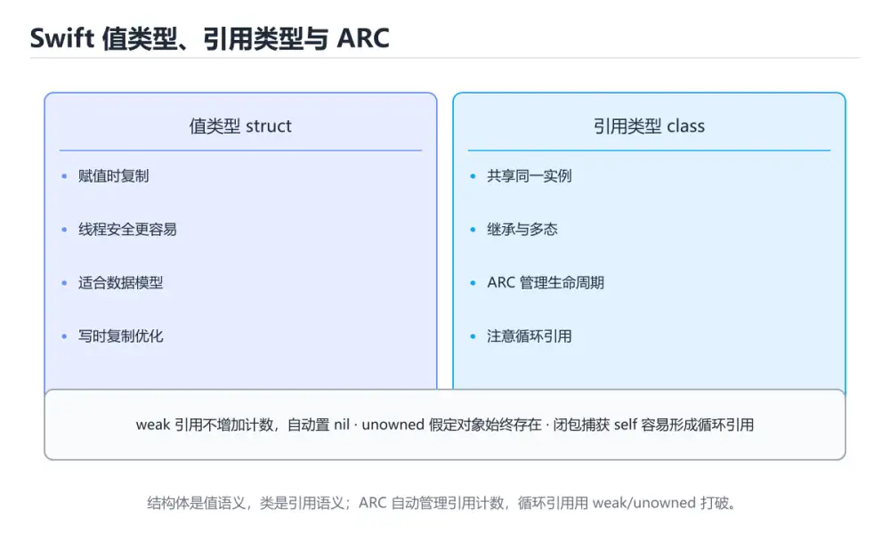
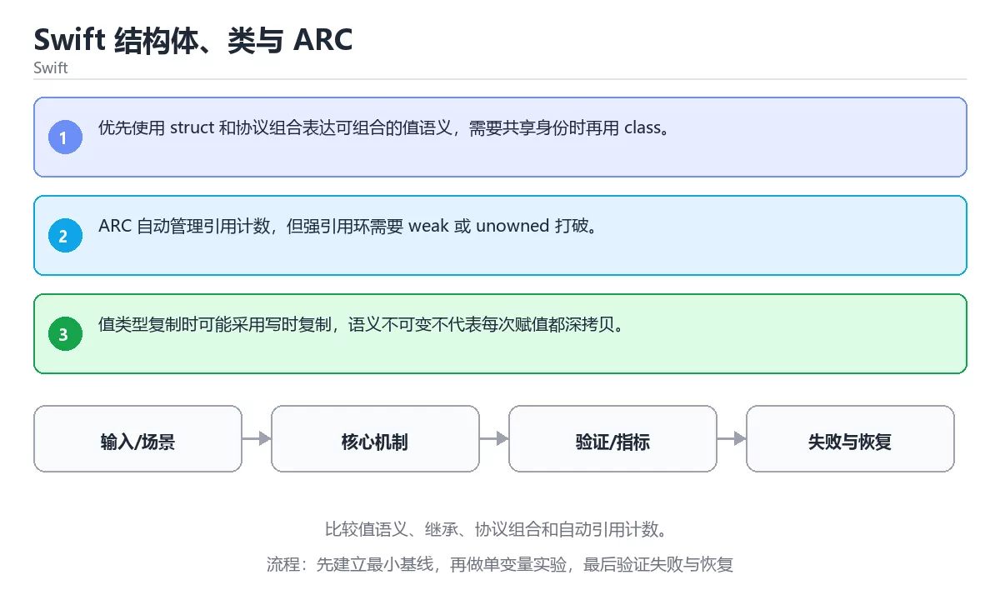

# Swift 结构体、类与 ARC





> 内容更新时间：2026-10-06 · 学习阶段：进阶 · 预计用时：35 分钟

## 学习目标

- 能用自己的话解释：优先使用 struct 和协议组合表达可组合的值语义，需要共享身份时再用 class。
- 能用自己的话解释：ARC 自动管理引用计数，但强引用环需要 weak 或 unowned 打破。
- 能用自己的话解释：值类型复制时可能采用写时复制，语义不可变不代表每次赋值都深拷贝。
- 能把本课知识放回「Swift」，并完成练习与测验。

## 前置知识

- 具备本分类的前置知识，能跑通「Swift 结构体、类与 ARC」的示例并解释输出。
- 本课关键词：struct、class、ARC、协议组合。
- 遇到不熟悉的术语先记录问题，完成练习后再回读。

## 核心知识

### 1. 优先使用 struct 和协议组合表达可组合的值语义，需要共享身份时再用 class。

- 关键做法：基线只保留 class 必需的部分，其余条件一次加一个。
- 验证标准：increment 的输出能被他人复现，边界输入有对应用例。

### 2. ARC 自动管理引用计数，但强引用环需要 weak 或 unowned 打破。

把这条结论放回「Swift 结构体、类与 ARC」的完整流程里展开：

- 正文依据：能用自己的话解释：优先使用 struct 和协议组合表达可组合的值语义，需要共享身份时再用 class。
- 落地检查：把「2. ARC 自动管理引用计数，但强引用环需要 weak 或 unowned 打破。」改写成一条可执行的核对项，逐条验证输入、超时与失败路径。

### 3. 值类型复制时可能采用写时复制，语义不可变不代表每次赋值都深拷贝。

把这条结论放回「Swift 结构体、类与 ARC」的完整流程里展开：

- 正文依据：能用自己的话解释：ARC 自动管理引用计数，但强引用环需要 weak 或 unowned 打破。
- 落地检查：把「3. 值类型复制时可能采用写时复制，语义不可变不代表每次赋值都深拷贝。」改写成一条可执行的核对项，逐条验证输入、超时与失败路径。

## 关键流程

```text
输入 → 校验 → 核心处理 → 验证 → 记录指标 → 失败恢复
```

## 实践路径

1. 用一句话复述本课要解决的问题。
2. 跑通正文中的最小示例并记录基线。
3. 只改变一个输入或参数，预测并验证结果。
4. 补一个失败路径，记录错误、恢复和指标。
5. 把结论写成可复现的笔记或测试。

## 常见错误与排查

> 说明：本表由《Swift 结构体、类与 ARC》的核心知识整理（2026-10-07），人工复核进度见 docs/content_review_batches.md。

| 易错点 | 容易踩的做法 | 正确结论 |
| --- | --- | --- |
| 结构体与类选择随意 | 语义与预期不符 | 值语义用结构体，需要共享状态用类 |
| 强引用形成环 | 对象无法释放 | 用弱引用打破循环 |
| 继承层级过深 | 改动牵连面大 | 优先使用组合与协议 |

## 动手练习

1. 合上教程，用 3～5 句话解释Swift 结构体、类与 ARC。
2. 从正文选一个例子，改变一个条件并预测结果。
3. 设计一个失败场景，写出止损与恢复步骤。

**验收标准**：留下输入、命令、输出、差异和下一步问题。

## 本课小结

- 本课围绕 struct、class、ARC、协议组合 展开，复习时重点核对它们的输入、输出和失败路径。
- 把还不确定的 increment 行为写成一条可执行验证，再进入下一课。


## 语言专项实践：Swift 结构体、类与 ARC

### 一、工具链

| 阶段 | 推荐工具 | 验收标准 |
| --- | --- | --- |
| 编译构建 | swiftc / xcodebuild | 命令可复现且错误能被定位 |
| 测试 | XCTest + async 测试 | 命令可复现且错误能被定位 |
| 性能 | Instruments / signpost | 命令可复现且错误能被定位 |
| 发布 | TestFlight + App Store 审核 | 命令可复现且错误能被定位 |

### 二、运行时与内存模型

围绕「struct、class、ARC、协议组合」说明变量生命周期、资源释放、并发模型和错误传播。语言语法只是入口，真正决定行为的是运行时、标准库和平台约束。

### 三、测试策略

- 单元测试覆盖核心规则和边界。
- 集成测试覆盖文件、网络、数据库或平台 API。
- 失败测试覆盖超时、取消、异常和资源耗尽。
- 性能测试记录基线，避免只凭感觉优化。

### 四、发布检查

- [ ] 版本和依赖锁定，构建可复现。
- [ ] 产物经过签名、校验和最小权限配置。
- [ ] 日志不泄露密钥和个人信息。
- [ ] 有升级、回滚和故障恢复说明。

## 可运行练习

本节围绕Swift 结构体、类与 ARC安排 3 个可交付任务，每个任务都要求留下可以复查的记录。

### 任务 1：用自己的话画出结构

不看书，用一张图说清「Swift 结构体、类与 ARC」的结构，画完再对照骨架：

- 主干：increment 的原理 → 操作步骤 → 验证方法 → 易错点
- 连接线：在每条边上标出输入、输出与失败路径。
- 自检：能否用一句话说明struct与class的关系？

### 任务 2：做一次对比实验

**验收标准**：两个方案的差异必须落在「Swift 结构体、类与 ARC」的实际约束上；写清当struct越过哪条边界时应该换方案。

### 任务 3：迁移到自己的场景

**验收标准**：换一个人按你的记录重跑 increment，能得到相同输出；得不到就补写缺失的前提。

## 故障现场

### 现场 1：结构体与类选择随意

**症状**：在《Swift 结构体、类与 ARC》的复现场景中，语义与预期不符。

**根因**：当出现“结构体与类选择随意”时，执行路径已经绕过了《Swift 结构体、类与 ARC》的关键约束，最终以“语义与预期不符”暴露出来；修复前必须先确认约束在哪里失效。

**修复**：针对《Swift 结构体、类与 ARC》的问题，值语义用结构体，需要共享状态用类。

**验证**：先在《Swift 结构体、类与 ARC》中记录“结构体与类选择随意”留下的失败证据，再执行“值语义用结构体，需要共享状态用类”并重放；确认错误路径变为明确结果，且修复没有掩盖同类故障。

### 现场 2：强引用形成环

**症状**：在《Swift 结构体、类与 ARC》的复现场景中，对象无法释放。

**根因**：触发点是把“强引用形成环”当成安全做法。它没有满足《Swift 结构体、类与 ARC》要求的前提，因此先表现为“对象无法释放”；排查时先完整复现这一段，再核对输入、配置与依赖。

**修复**：针对《Swift 结构体、类与 ARC》的问题，用弱引用打破循环。

**验证**：在《Swift 结构体、类与 ARC》中按“用弱引用打破循环”调整后，从“强引用形成环”的触发条件重放同一条路径，确认“对象无法释放”不再出现，并补一个相邻边界用例检查没有引入新问题。

### 现场 3：继承层级过深

**症状**：在《Swift 结构体、类与 ARC》的复现场景中，改动牵连面大。

**根因**：“改动牵连面大”只是表层结果。向上追溯会落到“继承层级过深”这一步，因为它省略了《Swift 结构体、类与 ARC》的约束，使实现行为和预期模型发生了偏离。

**修复**：针对《Swift 结构体、类与 ARC》的问题，优先使用组合与协议。

**验证**：保留《Swift 结构体、类与 ARC》里触发“改动牵连面大”的输入、版本和日志，按“优先使用组合与协议”完成修改后原样重放；只有失败现象消失且相邻场景仍可解释，才保留改动。

## 版本与时效

- Swift 6.x 默认开启更严格的数据竞争检查；struct 的并发边界要先梳理。
- 升级前确认 struct 的兼容范围，把不可回退的改动单独拆成一次提交。
- increment 的写法在最近几个版本有变化，升级前先跑一遍测试。
- 官方发布说明：https://www.swift.org/blog/

### 升级检查清单

- 先固定当前版本，跑通全部示例与测验，再升级工具链。
- 一次只改一个版本条件，把 struct 相关的差异单独记成一条结论。
- 升级后重点回归 struct 的默认值、警告信息与错误格式。
- 升级后把 increment 的实测版本写进「内容元数据」，再更新复核日期。

## 本课复习清单


离开本课前，逐项确认：

- [ ] 不看解析，能说出「关于「优先使用 struct 和协议组合表达可组合的值语义，需要共享身份时再用 class。」，下列说法正确的是？」的判断依据。
- [ ] 不看解析，能说出「关于「ARC 自动管理引用计数，但强引用环需要 weak 或 unowned 打破。」，下列说法正确的是？」的判断依据。
- [ ] 不看解析，能说出「关于「值类型复制时可能采用写时复制，语义不可变不代表每次赋值都深拷贝。」，下列说法正确的是？」的判断依据。
- [ ] 至少运行一次《Swift 结构体、类与 ARC》的示例，记录输入、输出和一个边界情况。
- [ ] 把本课最容易混淆的两个概念写成一句话对照。

| 复盘项 | 记录 |
| --- | --- |
| 已经能独立解释的考点 |  |
| 仍然说不清的概念 |  |
| 下一步验证动作 |  |

## 复习与自测

逐节自检：能说清 struct 的输入、输出与失败路径才算通过，否则回到原文。

### 核心知识

自检：这一节与相邻主题的边界在哪里？

### 动手练习

自检：如果去掉这一节里的一个前提，结论会怎样变化？

### 语言专项实践：Swift 结构体、类与 ARC

自检：把这一节讲给没学过的人，最需要强调哪一点？

### 最小可运行示例

```swift
class Counter {
    var value = 0
    func increment() { value += 1 }
}

let counter = Counter()
counter.increment()
counter.increment()
print("counter=\(counter.value)")
```

### 预期输出

```text
counter=2
```

### 验证步骤

制造一次错误输入，记录错误信息与修复方式。

## 术语速查

| 术语 | 一句话说明 |
| --- | --- |
| `struct` | Swift 中的值类型，赋值或传参时复制，适合封装独立的数据模型。 |
| `class` | 定义对象属性与行为的类型模板，实例化后得到具体对象。 |
| `ARC` | Summary: Compare value semantics, inheritance, protocol composition and ARC.。 |
| `协议组合` | 二、运行时与内存模型：围绕「struct、class、ARC、协议组合」说明变量生命周期、资源释放、并发模型和错误传播。 |

## 零基础精讲：把Swift 结构体、类与 ARC真正讲透

### 先建立一个直觉

本课的摘要可以当作一张地图：比较值语义、继承、协议组合和自动引用计数。

### 逐步拆解

1. 澄清输入与目标。先写清「Swift 结构体、类与 ARC」要解决的问题、合法输入范围和成功标准，再进入后续步骤。
2. 描述处理过程。把「struct、class、ARC、协议组合」映射到具体步骤，每步都要求能单独验证。
3. 定义输出。struct 的输出不仅包括正常结果，还包括错误码、日志和资源释放状态。
4. 构造一次struct越界，记录系统是拒绝、降级还是静默出错；三者对应的修复策略完全不同。
5. 用 increment 构造一个最小反例，证明「Swift 结构体、类与 ARC」的结论有边界。

### 把正文串成一条执行链

- **1. 优先使用 struct 和协议组合表达可组合的值语义，需要共享身份时再用 class。**：在「Swift 结构体、类与 ARC」里，「1. 优先使用 struct 和协议组合表达可组合的值语义，需要共享身份时再用 class。」这一步要先写清输入与预期，再记录实际结果和差异；结果不符时回到对应小节核对前提。
- **2. ARC 自动管理引用计数，但强引用环需要 weak 或 unowned 打破。**：在「Swift 结构体、类与 ARC」里，「2. ARC 自动管理引用计数，但强引用环需要 weak 或 unowned 打破。」这一步要先写清输入与预期，再记录实际结果和差异；结果不符时回到对应小节核对前提。
- **3. 值类型复制时可能采用写时复制，语义不可变不代表每次赋值都深拷贝。**：在「Swift 结构体、类与 ARC」里，「3. 值类型复制时可能采用写时复制，语义不可变不代表每次赋值都深拷贝。」这一步要先写清输入与预期，再记录实际结果和差异；结果不符时回到对应小节核对前提。
- 一、工具链：完成 核心知识 的推荐工具与检查项
- **二、运行时与内存模型**：围绕「struct、class、ARC、协议组合」说明变量生命周期、资源释放、并发模型和错误传播
- **三、测试策略**：- 单元测试覆盖核心规则和边界

### 从测验反推易错点

**检查点 1：关于「优先使用 struct 和协议组合表达可组合的值语义，需要共享身份时再用 class。」，下列说法正确的是？**

- 参考判断：优先使用 struct 和协议组合表达可组合的值语义，需要共享身份时再用 class。
- 自问：如果去掉题干里的一个限定词，结论还成立吗？

**检查点 2：关于「ARC 自动管理引用计数，但强引用环需要 weak 或 unowned 打破。」，下列说法正确的是？**

- 参考判断：ARC 自动管理引用计数，但强引用环需要 weak 或 unowned 打破。

**检查点 3：关于「值类型复制时可能采用写时复制，语义不可变不代表每次赋值都深拷贝。」，下列说法正确的是？**

- 参考判断：值类型复制时可能采用写时复制，语义不可变不代表每次赋值都深拷贝。

**检查点 4：本课的核心学习目标是什么？**

- 参考判断：比较值语义、继承、协议组合和自动引用计数。

**检查点 5：以下哪些术语与Swift 结构体、类与 ARC直接相关？（多选）**

- 参考判断：struct、class

### 工程排错顺序

| 先查什么 | 要得到的证据 | 判断标准 |
| --- | --- | --- |
| 输入与前提是否满足 | 日志、输入样例、测试或指标 | 能复现并解释，才算定位 |
| 核心步骤是否产生了预期中间结果 | 日志、输入样例、测试或指标 | 能复现并解释，才算定位 |
| 失败路径是否可观测、可恢复 | 日志、输入样例、测试或指标 | 能复现并解释，才算定位 |
| 资源、权限与成本是否在预算内 | 日志、输入样例、测试或指标 | 能复现并解释，才算定位 |

### 变式训练

1. 先用一个单文件示例验证 increment，确认正确性后再引入框架或分布式组件。
2. 把 struct 的输入规模扩大十倍，记录时间、内存和失败路径，找出第一个瓶颈。
3. 让 increment 的外部依赖超时，确认系统能回滚或补偿，而不是留下脏数据。
5. 故意跳过 class 的检查再运行，比较与正常流程的差异，并说明这个检查挡住的到底是哪一类失败。
6. 在低带宽或低算力条件下重跑 class，记录降级路径是否仍然可用。

### 本课自测

- [ ] 能用一句话解释「struct」在本课中的角色与边界。
- [ ] 能举出一个正常例子和一个失败例子。
- [ ] 能说出最小验证步骤，以及需要记录的证据。
- [ ] 能用一句话解释「class」在本课中的角色与边界。
- [ ] 能用一句话解释「ARC」在本课中的角色与边界。
- [ ] 能用一句话解释「协议组合」在本课中的角色与边界。

### 迁移案例库

下面用不同约束重复同一套方法，每轮只改变 struct 的一个取值并记录结论。

#### 迁移案例 1：围绕「struct」做一次小实验

**目标**：在不改变课程主体的前提下，验证Swift 结构体、类与 ARC中的一个关键判断。

**步骤**：
1. 复述当前方案对「struct」的假设，写成一句可证伪的话。
2. 设计一个正常输入和一个边界输入，分别预测输出。
3. 运行或逐步演算，记录实际输出、耗时和失败信息。
4. 只调整一个参数，比较前后差异并解释原因。
5. 补充一条测试或复习卡，确保下次能更快复现。

**验收**：迁移过程要留下 increment 的可运行记录，并说明class在新场景下是否仍然成立。

#### 迁移案例 2：围绕「class」做一次小实验

**步骤**：
1. 复述当前方案对「class」的假设，写成一句可证伪的话。

#### 迁移案例 3：围绕「ARC」做一次小实验

**步骤**：
1. 复述当前方案对「ARC」的假设，写成一句可证伪的话。

#### 迁移案例 4：围绕「协议组合」做一次小实验

**步骤**：
1. 复述当前方案对「协议组合」的假设，写成一句可证伪的话。

#### 迁移案例 5：围绕「struct」做一次小实验

**步骤**：

#### 迁移案例 6：围绕「class」做一次小实验

**步骤**：

#### 迁移案例 7：围绕「ARC」做一次小实验

**步骤**：

#### 迁移案例 8：围绕「协议组合」做一次小实验

**步骤**：

#### 迁移案例 9：围绕「struct」做一次小实验

**步骤**：

#### 迁移案例 10：围绕「class」做一次小实验

**步骤**：

#### 迁移案例 11：围绕「ARC」做一次小实验

**步骤**：

#### 迁移案例 12：围绕「协议组合」做一次小实验

**步骤**：

#### 迁移案例 13：围绕「struct」做一次小实验

**步骤**：

#### 迁移案例 14：围绕「class」做一次小实验

**步骤**：

#### 迁移案例 15：围绕「ARC」做一次小实验

**步骤**：

#### 迁移案例 16：围绕「协议组合」做一次小实验

**步骤**：

<!-- p0-depth-v2:end -->

## 考点精讲

### 考点 1：概念判断·struct

- **题目**：关于「优先使用 struct 和协议组合表达可组合的值语义，需要共享身份时再用 class。」，下列说法正确的是？
- **判断依据**：在「Swift 结构体、类与 ARC」里，优先使用 struct 和协议组合表达可组合的值语义，需要共享身份时再用 class。回到「Swift 结构体、类与 ARC」的正文示例，用“关于优先使用 struct 和协议组”走一遍struct、class、ARC的完整流程，能复现的结论才可以保留。

### 考点 2：概念判断·struct

- **题目**：关于「ARC 自动管理引用计数，但强引用环需要 weak 或 unowned 打破。」，下列说法正确的是？
- **判断依据**：在「Swift 结构体、类与 ARC」里，ARC 自动管理引用计数，但强引用环需要 weak 或 unowned 打破。「Swift 结构体、类与 ARC」要求先交代struct、class、ARC的前提再下结论，所以“ARC 自动管理引用计数”只在题干“ARC 自动管理引用计数”给定的条件下成立。

### 考点 3：概念判断·struct

- **题目**：关于「值类型复制时可能采用写时复制，语义不可变不代表每次赋值都深拷贝。」，下列说法正确的是？
- **判断依据**：在「Swift 结构体、类与 ARC」里，值类型复制时可能采用写时复制，语义不可变不代表每次赋值都深拷贝。「Swift 结构体、类与 ARC」要求先交代struct、class、ARC的前提再下结论，所以“值类型复制时可能采用写时复制”只在题干“值类型复制时可能采用写时复制”给定的条件下成立。

### 考点 4：代码补全·struct

- **题目**：这段 Swift 代码是「Swift 结构体、类与 ARC」的示例片段，下面哪一项描述与它一致？
- **判断依据**：在「Swift 结构体、类与 ARC」里，这段代码会产生可观察的输出，运行后能看到结果。这段代码出自「Swift 结构体、类与 ARC」的正文示例，围绕struct、class、ARC展开；把输入或边界换成空值、极值或失败情况后，结论要以「Swift 结构体、类与 ARC」的实际运行结果为准。

### 考点 5：多选辨析·struct

- **题目**：以下哪些术语与「Swift 结构体、类与 ARC」直接相关？（多选）
- **判断依据**：在「Swift 结构体、类与 ARC」里，class。回到「Swift 结构体、类与 ARC」的正文示例，用“以下哪些术语与Swift 结构体、类”走一遍struct、class、ARC的完整流程，能复现的结论才可以保留。回到struct、class、ARC本身再看一遍：只有“struct”与题干“以下哪些术语与Swift”的前提一致，结论才成立。

### 考点 6：顺序排列·struct

- **题目**：按照「Swift 结构体、类与 ARC」从概念到实践的讲解顺序排列下列主题。
- **判断依据**：结合struct、class来看，正确的执行顺序是「核心知识 → 关键流程 → 实践路径 → 常见误区」。本课围绕比较值语义、继承、协议组合和自动引用计数。把“核心知识”代回「Swift 结构体、类与 ARC」里“按照Swift 结构体、类与 ARC从概念到实践的讲解顺序排”的例子核对，条件一旦改变，结论就要用struct、class、ARC重新推导。

## English Overview

**Title:** Swift Structs, Classes and ARC

**Summary:** Compare value semantics, inheritance, protocol composition and ARC.

**Category:** Swift
**Level:** 进阶
**Key terms:** struct, class, ARC, 协议组合

## 内容元数据

- 内容版本：v2.0
- 最后更新：2026-10-06
- 学习阶段：进阶
- 适用环境：Swift 6 / Xcode 16+；本课聚焦 struct。
- 内容来源：内置结构化课程与工程实践整理
- 相关主题：struct、class、ARC、协议组合
- 质量版本：P0 测验标准 + P1 覆盖扩展 + P2 体验补全

## 最小可运行示例

先用 increment 跑通最小示例，然后只改一个与 struct 相关的取值：

```swift
class Counter {
    var value = 0
    func increment() { value += 1 }
}

let counter = Counter()
counter.increment()
counter.increment()
print("counter=\(counter.value)")
```

## 预期输出

```text
counter=2
```

## 验证步骤

1. 记录运行环境、命令和真实输出。
2. 修改一个输入，先写预测再运行。
4. 把结论写回本课笔记或测试用例。

## 参考资料与复核

- 最后复核：2026-10-04
- 下次复核：2026-11-10
- 复核范围：版本兼容、API 行为、安全建议与工程实践
- 来源性质：官方文档、标准或权威教材；正文为离线教学重组

| 参考资料 | 本课用途 |
| --- | --- |
| [Apple 内存管理](https://developer.apple.com/documentation/swift/automatic-reference-counting) | ARC 与循环引用 |
| [Apple 人机界面指南](https://developer.apple.com/design/human-interface-guidelines/) | iOS 设计规范与可访问性 |
| [Swift 并发](https://docs.swift.org/swift-book/documentation/the-swift-programming-language/concurrency/) | async/await 与 actor |

> 「Swift 结构体、类与 ARC」的链接用于离线阅读后的延伸核对；App 不会自动联网。

## 复习与迁移

复习目标：把「Swift 结构体、类与 ARC」的判断标准放回可复现的例子里。先自己作答，再对照依据；如果结论正确但理由不完整，回到正文补足前提。

### 概念复述

- 用一句话说明「Swift 结构体、类与 ARC」解决什么问题：比较值语义、继承、协议组合和自动引用计数。
- 写出struct、class、ARC之间的关系，并各举一个例子。
- 说出本课最容易混淆的两个概念，以及区分它们的判据。

### 正文逐节复核

- **语言专项实践：Swift 结构体、类与 ARC**：围绕「struct、class、ARC、协议组合」说明变量生命周期、资源释放、并发模型和错误传播。
- **实践任务**：本节围绕Swift 结构体、类与 ARC安排 3 个可交付任务，每个任务都要求留下可以复查的记录。
- **零基础精讲：把Swift 结构体、类与 ARC真正讲透**：本课的摘要可以当作一张地图：比较值语义、继承、协议组合和自动引用计数。

### 测验回顾

1. 关于「优先使用 struct 和协议组合表达可组合的值语义，需要共享身份时再用 class。」，下列说法正确的是？
   - 依据：在「Swift 结构体、类与 ARC」里，优先使用 struct 和协议组合表达可组合的值语义，需要共享身份时再用 class。回到「Swift 结构体、类与 ARC」的正文示例，用“关于优先使用 struct 和协议组”走一遍struct、class、ARC的完整流程，能复现的结论才可以保留。
2. 关于「ARC 自动管理引用计数，但强引用环需要 weak 或 unowned 打破。」，下列说法正确的是？
   - 依据：在「Swift 结构体、类与 ARC」里，ARC 自动管理引用计数，但强引用环需要 weak 或 unowned 打破。「Swift 结构体、类与 ARC」要求先交代struct、class、ARC的前提再下结论，所以“ARC 自动管理引用计数”只在题干“ARC 自动管理引用计数”给定的条件下成立。
3. 关于「值类型复制时可能采用写时复制，语义不可变不代表每次赋值都深拷贝。」，下列说法正确的是？
   - 依据：在「Swift 结构体、类与 ARC」里，值类型复制时可能采用写时复制，语义不可变不代表每次赋值都深拷贝。「Swift 结构体、类与 ARC」要求先交代struct、class、ARC的前提再下结论，所以“值类型复制时可能采用写时复制”只在题干“值类型复制时可能采用写时复制”给定的条件下成立。
4. 这段 Swift 代码是「Swift 结构体、类与 ARC」的示例片段，下面哪一项描述与它一致？
   - 依据：在「Swift 结构体、类与 ARC」里，这段代码会产生可观察的输出，运行后能看到结果。这段代码出自「Swift 结构体、类与 ARC」的正文示例，围绕struct、class、ARC展开；把输入或边界换成空值、极值或失败情况后，结论要以「Swift 结构体、类与 ARC」的实际运行结果为准。
5. 以下哪些术语与「Swift 结构体、类与 ARC」直接相关？（多选）
   - 依据：在「Swift 结构体、类与 ARC」里，class。回到「Swift 结构体、类与 ARC」的正文示例，用“以下哪些术语与Swift 结构体、类”走一遍struct、class、ARC的完整流程，能复现的结论才可以保留。回到struct、class、ARC本身再看一遍：只有“struct”与题干“以下哪些术语与Swift”的前提一致，结论才成立。
6. 按照「Swift 结构体、类与 ARC」从概念到实践的讲解顺序排列下列主题。
   - 依据：结合struct、class来看，正确的执行顺序是「核心知识 → 关键流程 → 实践路径 → 常见误区」。本课围绕比较值语义、继承、协议组合和自动引用计数。把“核心知识”代回「Swift 结构体、类与 ARC」里“按照Swift 结构体、类与 ARC从概念到实践的讲解顺序排”的例子核对，条件一旦改变，结论就要用struct、class、ARC重新推导。

### 迁移练习

把「Swift 结构体、类与 ARC」的结论迁移到相邻主题，每次迁移都写清预测与证据：

1. 换输入：用struct处理一组你自己的数据，对比教材示例的结果差异。
2. 换失败条件：制造一个class相关的错误，说明如何从错误信息定位根因。
3. 换规模：把数据量或并发度提高一个数量级，说明「Swift 结构体、类与 ARC」的结论是否仍成立。
