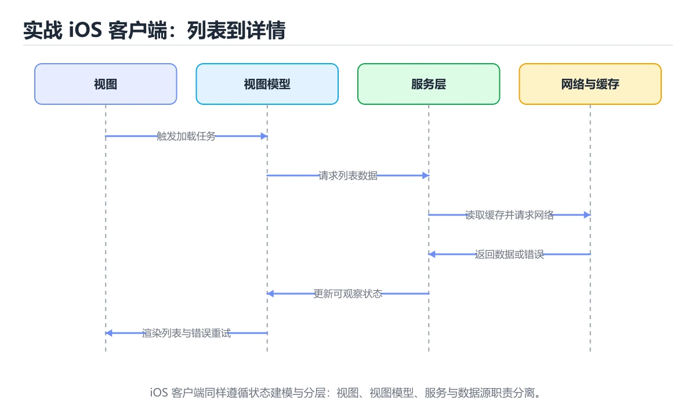
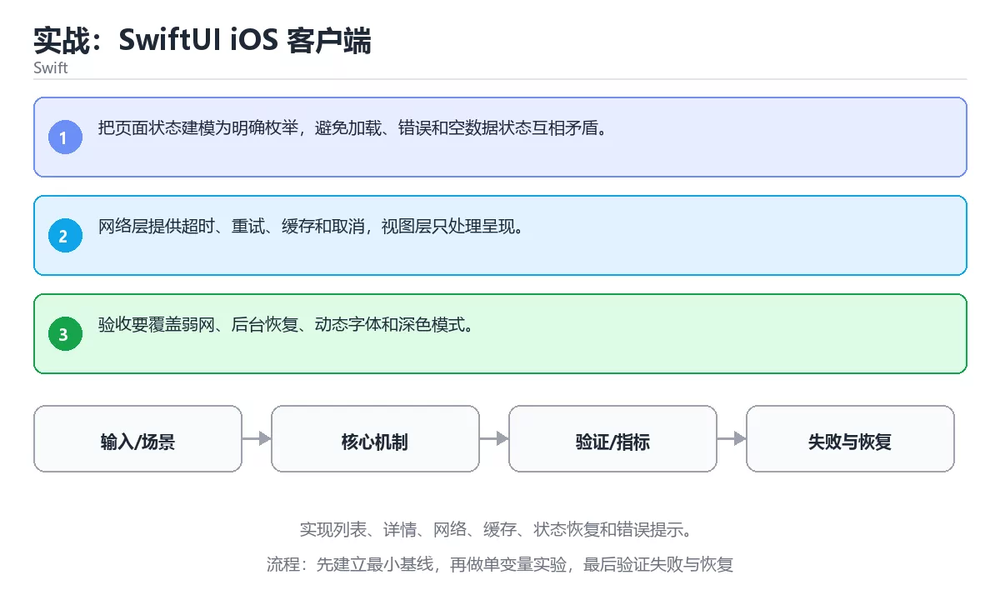

# 实战：SwiftUI iOS 客户端





> 内容更新时间：2026-10-03 · 学习阶段：高级 · 预计用时：130 分钟

## 学习目标

- 能用自己的话解释：把页面状态建模为明确枚举，避免加载、错误和空数据状态互相矛盾。
- 能用自己的话解释：网络层提供超时、重试、缓存和取消，视图层只处理呈现。
- 能用自己的话解释：验收要覆盖弱网、后台恢复、动态字体和深色模式。
- 能把本课知识放回「Swift」，并完成练习与测验。

## 前置知识

- 已完成「Swift」的基础课程，能运行正文中的最小示例。
- 本课关键词：iOS 项目、SwiftUI、网络、缓存。
- 遇到不熟悉的术语先记录问题，完成练习后再回读。

## 核心知识

### 1. 把页面状态建模为明确枚举，避免加载、错误和空数据状态互相矛盾。

- 关键做法：先用最小示例建立基线，再逐步加入边界、失败和性能条件。
- 验证标准：结果可复现、错误可解释、边界有测试、失败能恢复。

### 2. 网络层提供超时、重试、缓存和取消，视图层只处理呈现。

把这条结论放回「实战：SwiftUI iOS 客户端」的完整流程里展开：

- 正文依据：能用自己的话解释：网络层提供超时、重试、缓存和取消，视图层只处理呈现。
- 落地检查：把「2. 网络层提供超时、重试、缓存和取消，视图层只处理呈现。」改写成一条可执行的核对项，逐条验证输入、超时与失败路径。

### 3. 验收要覆盖弱网、后台恢复、动态字体和深色模式。

把这条结论放回「实战：SwiftUI iOS 客户端」的完整流程里展开：

- 正文依据：本课关键词：iOS 项目、SwiftUI、网络、缓存。
- 落地检查：把「3. 验收要覆盖弱网、后台恢复、动态字体和深色模式。」改写成一条可执行的核对项，逐条验证输入、超时与失败路径。

## 关键流程

```text
输入 → 校验 → 核心处理 → 验证 → 记录指标 → 失败恢复
```

## 实践路径

1. 用一句话复述本课要解决的问题。
2. 跑通正文中的最小示例并记录基线。
3. 只改变一个输入或参数，预测并验证结果。
4. 补一个失败路径，记录错误、恢复和指标。
5. 把结论写成可复现的笔记或测试。

## 常见误区

| 误区 | 后果 | 修正 |
| --- | --- | --- |
| 只记术语不做实验 | 遇到真实问题无法判断 | 用最小输入跑通并记录结果 |
| 只测正常路径 | 边界和故障上线才暴露 | 补空值、极值和依赖失败 |
| 没有基线就优化 | 无法证明改进有效 | 先测量再修改 |
| 忽略成本与安全 | 性能和风险失控 | 同时记录资源、权限与失败代价 |

## 动手练习

1. 合上教程，用 3～5 句话解释实战：SwiftUI iOS 客户端。
2. 从正文选一个例子，改变一个条件并预测结果。
3. 设计一个失败场景，写出止损与恢复步骤。

**验收标准**：留下输入、命令、输出、差异和下一步问题。

## 本课小结

- 本课属于「Swift」，核心关键词是 iOS 项目、SwiftUI、网络、缓存。
- 先保证正确与可复现，再讨论性能和扩展。
- 完成练习和测验后，把仍然不确定的问题写成下一轮验证清单。

> 本课由 P1 内容扩展生成，重点补充原有课程缺失的主题与工程边界。

## 验证命令与预期输出

项目代码不能只看“能编译”，还要能按固定命令复现结果。下表给出最低验证集：

| 阶段 | 命令 | 预期输出 |
| --- | --- | --- |
| 安装依赖 | `python -m pip install -r requirements.txt` | 依赖安装完成，没有版本冲突 |
| 语法检查 | `python -m compileall .` | 所有模块编译通过 |
| 运行测试 | `python -m pytest -q` | 测试全部通过，失败用例数为 0 |
| 启动示例 | `python main.py` | 服务启动并输出监听地址 |

### 验收证据

- [ ] 保存依赖安装和启动命令的完整输出。
- [ ] 至少运行 3 条测试，其中包含一条非法输入或失败路径。
- [ ] 重复执行同一操作两次，确认没有重复写入或副作用。
- [ ] 记录一次失败状态码、错误日志和恢复步骤。
- [ ] 在 README 中写明环境版本、启动方式和回滚方式。

### 回归与回滚

1. 先在一个可丢弃的目录或临时数据库执行，避免污染真实数据。
2. 修改一处逻辑后重跑全部验证命令，确认没有回归。
3. 若失败，回滚到上一个可运行版本并保留失败日志。
4. 定位原因后补一条自动化测试，再重新执行发布流程。
5. 把教训写入项目复盘或本课笔记，形成下一次的检查项。

## 语言专项实践：实战：SwiftUI iOS 客户端

### 一、工具链

| 阶段 | 推荐工具 | 验收标准 |
| --- | --- | --- |
| 编译构建 | swiftc / xcodebuild | 命令可复现且错误能被定位 |
| 测试 | XCTest + async 测试 | 命令可复现且错误能被定位 |
| 性能 | Instruments / signpost | 命令可复现且错误能被定位 |
| 发布 | TestFlight + App Store 审核 | 命令可复现且错误能被定位 |

### 二、运行时与内存模型

围绕「iOS 项目、SwiftUI、网络、缓存」说明变量生命周期、资源释放、并发模型和错误传播。语言语法只是入口，真正决定行为的是运行时、标准库和平台约束。

### 三、测试策略

- 单元测试覆盖核心规则和边界。
- 集成测试覆盖文件、网络、数据库或平台 API。
- 失败测试覆盖超时、取消、异常和资源耗尽。
- 性能测试记录基线，避免只凭感觉优化。

### 四、发布检查

- [ ] 版本和依赖锁定，构建可复现。
- [ ] 产物经过签名、校验和最小权限配置。
- [ ] 日志不泄露密钥和个人信息。
- [ ] 有升级、回滚和故障恢复说明。

## 可运行练习

### 任务 1：先跑通，再解释

```json
{
  "project": "swift_project",
  "input": {"case": "normal", "value": 5},
  "expected": {"ok": true, "result": 5},
  "failure_case": {"value": -1, "error": "validation_error"},
  "idempotency_key": "demo-001"
}
```

### 任务 2：只改一个条件

把「实战：SwiftUI iOS 客户端」的最小示例复制一份，只改一个条件再跑一次：

- 改动点：只把iOS 项目的输入换成空值、极值或错误输入，其余保持不变。
- 预测：先写下「实战：SwiftUI iOS 客户端」在改动后的输出或错误信息，再运行。
- 记录：对照改动前后的结果，指出差异出在哪一步。
- 验收：换回原条件能复现原结果，改动只影响iOS 项目。

### 任务 3：迁移到自己的数据

用同一套思路处理一组你自己的数据或场景，保持输出格式与任务 1 一致。

## 故障现场

### 现场 1：本课的 iOS 项目 常规用例通过，但边界用例失败

**症状**：在本课的练习或生产场景里出现“本课的 iOS 项目 常规用例通过，但边界用例失败”。

**复现**：准备一组最小输入，只保留触发“本课的 iOS 项目 常规用例通过，但边界用例失败”的必要条件，连续运行两次确认结果稳定。

**定位**：围绕“iOS 项目 的前置条件与取值边界没有写进代码，默认值掩盖了空值和极值”检查调用链、输入数据和环境配置，先验证假设再改代码。

**预防**：把“本课的 iOS 项目 常规用例通过，但边界用例失败”写成一条自动化用例，并在本课的验收清单里保留对应检查项。

### 现场 2：本课的 SwiftUI 结果在两次运行之间不一致

**症状**：在本课的练习或生产场景里出现“本课的 SwiftUI 结果在两次运行之间不一致”。

**复现**：准备一组最小输入，只保留触发“本课的 SwiftUI 结果在两次运行之间不一致”的必要条件，连续运行两次确认结果稳定。

**定位**：围绕“SwiftUI 依赖了当前版本、执行顺序或共享状态，单次运行无法暴露差异”检查调用链、输入数据和环境配置，先验证假设再改代码。

**预防**：把“本课的 SwiftUI 结果在两次运行之间不一致”写成一条自动化用例，并在本课的验收清单里保留对应检查项。

### 现场 3：本课的验证只在开发机通过

**症状**：在本课的练习或生产场景里出现“本课的验证只在开发机通过”。

**定位**：围绕“环境版本、配置和输入规模与目标环境不同，iOS 项目 缺少可重复的验证记录”检查调用链、输入数据和环境配置，先验证假设再改代码。

## 版本与时效

- Swift 6.x 默认开启更严格的数据竞争检查，迁移成本主要在并发边界
- 升级前先用 Swift 6 语言模式编译，再逐模块处理 Sendable 与 actor 隔离
- SwiftUI 与 Swift Testing 是当前迭代最快的两块
- 官方发布说明：https://www.swift.org/blog/

### 升级检查清单

- 先固定当前版本，跑通全部示例与测验，再升级工具链。
- 只改一个版本变量，记录编译、测试、性能与产物体积的变化。
- 重点回归默认值、弃用警告、序列化格式、并发语义和错误信息。
- 升级完成后更新本课的“最后复核 / 下次复核”日期与版本说明。

## 本课复习清单

离开本课前，逐项确认：

- [ ] 不看解析，能说出「关于，下列说法正确的是？」的判断依据。
- [ ] 不看解析，能说出「本课的核心学习目标是什么？」的判断依据。
- [ ] 不看解析，能说出的判断依据。
- [ ] 至少运行一次本课示例，记录输入、输出和一个边界情况。
- [ ] 把本课最容易混淆的两个概念写成一句话对照。

| 复盘项 | 记录 |
| --- | --- |
| 已经能独立解释的考点 |  |
| 仍然说不清的概念 |  |
| 下一步验证动作 |  |

## 术语速查

把「实战：SwiftUI iOS 客户端」里反复出现的术语集中放在一起。复习时先遮住右列，尝试用自己的话解释，再回到正文核对。

| 术语 | 本课语境 |
| --- | --- |
| `iOS 项目` | 围绕“环境版本、配置和输入规模与目标环境不同，iOS 项目 缺少可重复的验证记录”检查调用链、输入数据和环境配置，先验证假设再改代码。 |
| `SwiftUI` | Project: SwiftUI iOS Client focuses on Build list, detail, network, cache, state restoration and error UI.。 |
| `网络` | 用一句话说明「实战：SwiftUI iOS 客户端」解决什么问题：实现列表、详情、网络、缓存、状态恢复和错误提示。 |
| `缓存` | 用一句话说明「实战：SwiftUI iOS 客户端」解决什么问题：实现列表、详情、网络、缓存、状态恢复和错误提示。 |

## 考点精讲

### 考点 1：多选辨析·iOS 项目

- **题目**：围绕“实战：SwiftUI iOS 客户端”中的 iOS 项目、SwiftUI、网络，下列哪两项是本课强调的实践判断？
- **判断依据**：本课把实战：SwiftUI iOS 客户端拆成概念、示例与故障现场三部分，因此判断 iOS 项目 时必须同时交代输入、输出和失败路径，这使“学习 iOS 项目 时要同时说明输入、输出和失败路径，不能只看正常流程”成立。在实战：SwiftUI iOS 客户端里，判断 SwiftUI 时要固定版本与边界输入，所以“验证 SwiftUI 时要固定版本并覆盖边界输入，结论才可复现”才可复现。

### 考点 2：代码补全·iOS 项目

- **题目**：阅读「实战：SwiftUI iOS 客户端」正文里的这段 Swift 代码，下面哪一项判断是正确的？
- **判断依据**：在「实战：SwiftUI iOS 客户端」里，这段代码会产生可观察的输出，运行后能看到结果。这段代码出自「实战：SwiftUI iOS 客户端」的正文示例，围绕iOS 项目、SwiftUI、网络展开；把输入或边界换成空值、极值或失败情况后，结论要以「实战：SwiftUI iOS 客户端」的实际运行结果为准。

### 考点 3：概念判断·iOS 项目

- **题目**：关于「验收要覆盖弱网、后台恢复、动态字体和深色模式。」，下列说法正确的是？
- **判断依据**：在「实战：SwiftUI iOS 客户端」里，验收要覆盖弱网、后台恢复、动态字体和深色模式。「实战：SwiftUI iOS 客户端」要求先交代iOS 项目、SwiftUI、网络的前提再下结论，所以“验收要覆盖弱网、后台恢复”只在题干“验收要覆盖弱网、后台恢复、动态字体和深色模式”给定的条件下成立。

### 考点 4：概念判断·iOS 项目

- **题目**：「实战：SwiftUI iOS 客户端」的核心学习目标是什么？
- **判断依据**：在「实战：SwiftUI iOS 客户端」里，结论应落在「实现列表、详情、网络、缓存、状态恢复和错误提示」。在「实战：SwiftUI iOS 客户端」里，结论应落在实现列表、详情、网络、缓存、状态恢复和错误提示。在「实战：SwiftUI iOS 客户端」里，这道题要求区分概念与边界，实现列表、详情、网络、缓存、状态恢复和错误提示。

### 考点 5：填空·"project": "____",

- **题目**：补全代码：「实战：SwiftUI iOS 客户端」示例中，下面这行代码缺少哪个关键字或函数名？请填入 ____。 `"project": "____",`
- **判断依据**：在「实战：SwiftUI iOS 客户端」里，swift_project。「实战：SwiftUI iOS 客户端」要求先交代iOS 项目、SwiftUI、网络的前提再下结论，所以“swiftproject”只在题干“实战：SwiftUI iOS 客户端示例中，下面这行代码缺少”给定的条件下成立。

## English Overview

**Title:** Project: SwiftUI iOS Client

**Summary:** Build list, detail, network, cache, state restoration and error UI.

**Category:** Swift
**Level:** 高级
**Key terms:** iOS 项目, SwiftUI, 网络, 缓存

## 内容元数据

- 内容版本：v2.0
- 最后更新：2026-10-03
- 学习阶段：高级
- 适用环境：Swift 6 / Xcode 16+
- 内容来源：内置结构化课程与工程实践整理
- 相关主题：iOS 项目、SwiftUI、网络、缓存
- 质量版本：P0 测验标准 + P1 覆盖扩展 + P2 体验补全

## 项目专属规格：实战：SwiftUI iOS 客户端

### 核心场景

实现列表、详情、网络、缓存、状态恢复和错误提示。 项目目标是把「iOS 项目、SwiftUI、网络、缓存」落实为可运行、可测试、可回滚的交付物。

### 架构与数据流

```text
用户/输入 → 接口或命令 → 领域逻辑 → 存储/外部依赖 → 输出与监控
                         ↘ 失败分类 → 重试/补偿 → 回滚
```

### 最小数据模型

| 对象 | 关键字段 | 约束 |
| --- | --- | --- |
| 输入实体 | iOS 项目、时间、来源 | 必填校验、长度限制、幂等键 |
| 任务实体 | 状态、优先级、创建时间 | 状态迁移合法、不可重复执行 |
| 结果实体 | 输出、错误码、耗时 | 可序列化、错误可解释 |
| 审计记录 | 操作者、动作、结果、时间 | 不可篡改、可查询、脱敏 |

### 验收场景

1. 正常路径：最小输入得到预期输出，并留下日志与指标。
2. 边界路径：空值、最大值、重复数据和超长内容得到明确处理。
3. 失败路径：依赖超时或不可用时能快速失败、重试或降级。
4. 幂等路径：同一请求执行两次不会产生重复副作用。
5. 回滚路径：回滚后数据一致，且能说明恢复时间和影响范围。

## 最小可运行示例

下面示例用于验证本课的最小输入、处理和输出。先原样运行，再只修改一个值：

```swift
struct Task {
    let title: String
    var done = false
}

let tasks = [Task(title: "读教程"), Task(title: "写代码", done: true)]
print(tasks.filter { $0.done }.count)
```

## 预期输出

```text
1
```

## 验证步骤

1. 记录运行环境、命令和真实输出。
2. 修改一个输入，先写预测再运行。
3. 制造一次错误输入，记录错误信息与修复方式。
4. 把结论写回本课笔记或测试用例。

## 项目交付物

### 建议仓库结构

```text
Sources/App/
Tests/
Package.swift
README.md
```

### 测试矩阵

| 层级 | 覆盖内容 | 最低数量 | 通过标准 |
| --- | --- | ---: | --- |
| 单元测试 | 领域规则、边界和错误分类 | 8 | 正常、边界、失败路径全部通过 |
| 集成测试 | 数据库、网络、文件或平台边界 | 3 | 使用真实边界且可重复运行 |
| 端到端测试 | 核心用户路径 | 1 | 从输入到输出完整跑通 |
| 手动验收 | 文档中列出的 5 个场景 | 5 | 有命令、输出和结论记录 |

### 验收数据

```json
{
  "project": "swift_project",
  "input": {"case": "normal", "value": 5},
  "expected": {"ok": true, "result": 5},
  "failure_case": {"value": -1, "error": "validation_error"},
  "idempotency_key": "demo-001"
}
```

### 复盘模板

| 问题 | 记录 |
| --- | --- |
| 原目标是什么？ | 用一句话描述可验收目标 |
| 实际发生了什么？ | 时间线、指标和关键日志 |
| 哪个假设被推翻？ | 根因与促成因素 |
| 如何回滚？ | 步骤、耗时和数据校验 |
| 下一步做什么？ | 负责人、期限和验证方式 |

> 项目验收围绕「iOS 项目、SwiftUI、网络」：至少完成一次正常路径、一次边界输入、一次失败恢复和一次幂等检查。

## Full English Study Guide

### Overview

**Project: SwiftUI iOS Client** focuses on Build list, detail, network, cache, state restoration and error UI.

### Learning Outcomes

- Explain what **Project: SwiftUI iOS Client** solves and when it should be used.

### Glossary

- Topic: **Project: SwiftUI iOS Client**
- Related terms: iOS 项目, SwiftUI, 网络, 缓存

## Bilingual Section Outline

| 中文小节 | English section |
| --- | --- |
| 学习目标 | Learning Objectives |
| 前置知识 | Pre-knowledge |
| 核心知识 | Core knowledge |
| 关键流程 | Key Processes |
| 实践路径 | Practice Path |
| 常见误区 | Common Misconceptions |
| 动手练习 | Hands on exercise: |
| 本课小结 | Lesson Summary |
| 验证命令与预期输出 | Validation Commands and Expected Output |
| 语言专项实践：实战：SwiftUI iOS 客户端 | Language Practice: Hands-on: SwiftUI iOS Client |

## 参考资料与复核

- 最后复核：2026-10-04
- 下次复核：2027-04-04
- 复核范围：版本兼容、API 行为、安全建议与工程实践
- 来源性质：官方文档、标准或权威教材；正文为离线教学重组

| 参考资料 | 本课用途 |
| --- | --- |
| [SwiftUI 文档](https://developer.apple.com/documentation/swiftui) | 声明式界面与状态 |
| [Apple 内存管理](https://developer.apple.com/documentation/swift/automatic-reference-counting) | ARC 与循环引用 |
| [Swift 语言指南](https://docs.swift.org/swift-book/documentation/the-swift-programming-language/) | 语法、类型与内存模型 |

> 「实战：SwiftUI iOS 客户端」的链接用于离线阅读后的延伸核对；App 不会自动联网。

## 复习与迁移

复习目标：把「实战：SwiftUI iOS 客户端」的判断标准放回可复现的例子里。先自己作答，再对照依据；如果结论正确但理由不完整，回到正文补足前提。

### 概念复述

- 用一句话说明「实战：SwiftUI iOS 客户端」解决什么问题：实现列表、详情、网络、缓存、状态恢复和错误提示。
- 写出iOS 项目、SwiftUI、网络之间的关系，并各举一个例子。
- 说出本课最容易混淆的两个概念，以及区分它们的判据。

### 正文逐节复核

- **语言专项实践：实战：SwiftUI iOS 客户端**：围绕「iOS 项目、SwiftUI、网络、缓存」说明变量生命周期、资源释放、并发模型和错误传播。
- **项目专属规格：实战：SwiftUI iOS 客户端**：实现列表、详情、网络、缓存、状态恢复和错误提示。

### 测验回顾

1. 围绕“实战：SwiftUI iOS 客户端”中的 iOS 项目、SwiftUI、网络，下列哪两项是本课强调的实践判断？
   - 依据：本课把实战：SwiftUI iOS 客户端拆成概念、示例与故障现场三部分，因此判断 iOS 项目 时必须同时交代输入、输出和失败路径，这使“学习 iOS 项目 时要同时说明输入、输出和失败路径，不能只看正常流程”成立。在实战：SwiftUI iOS 客户端里，判断 SwiftUI 时要固定版本与边界输入，所以“验证 SwiftUI 时要固定版本并覆盖边界输入，结论才可复现”才可复现。
2. 阅读「实战：SwiftUI iOS 客户端」正文里的这段 Swift 代码，下面哪一项判断是正确的？
   - 依据：在「实战：SwiftUI iOS 客户端」里，这段代码会产生可观察的输出，运行后能看到结果。这段代码出自「实战：SwiftUI iOS 客户端」的正文示例，围绕iOS 项目、SwiftUI、网络展开；把输入或边界换成空值、极值或失败情况后，结论要以「实战：SwiftUI iOS 客户端」的实际运行结果为准。
3. 关于「验收要覆盖弱网、后台恢复、动态字体和深色模式。」，下列说法正确的是？
   - 依据：在「实战：SwiftUI iOS 客户端」里，验收要覆盖弱网、后台恢复、动态字体和深色模式。「实战：SwiftUI iOS 客户端」要求先交代iOS 项目、SwiftUI、网络的前提再下结论，所以“验收要覆盖弱网、后台恢复”只在题干“验收要覆盖弱网、后台恢复、动态字体和深色模式”给定的条件下成立。
4. 「实战：SwiftUI iOS 客户端」的核心学习目标是什么？
   - 依据：在「实战：SwiftUI iOS 客户端」里，结论应落在「实现列表、详情、网络、缓存、状态恢复和错误提示」。在「实战：SwiftUI iOS 客户端」里，结论应落在实现列表、详情、网络、缓存、状态恢复和错误提示。在「实战：SwiftUI iOS 客户端」里，这道题要求区分概念与边界，实现列表、详情、网络、缓存、状态恢复和错误提示。
5. 补全代码：「实战：SwiftUI iOS 客户端」示例中，下面这行代码缺少哪个关键字或函数名？请填入 ____。

`"project": "____",`
   - 依据：在「实战：SwiftUI iOS 客户端」里，swift_project。「实战：SwiftUI iOS 客户端」要求先交代iOS 项目、SwiftUI、网络的前提再下结论，所以“swiftproject”只在题干“实战：SwiftUI iOS 客户端示例中，下面这行代码缺少”给定的条件下成立。

### 迁移练习

把「实战：SwiftUI iOS 客户端」的结论迁移到相邻主题，每次迁移都写清预测与证据：

1. 换输入：用iOS 项目处理一组你自己的数据，对比教材示例的结果差异。
2. 换失败条件：制造一个SwiftUI相关的错误，说明如何从错误信息定位根因。
3. 换规模：把数据量或并发度提高一个数量级，说明「实战：SwiftUI iOS 客户端」的结论是否仍成立。
