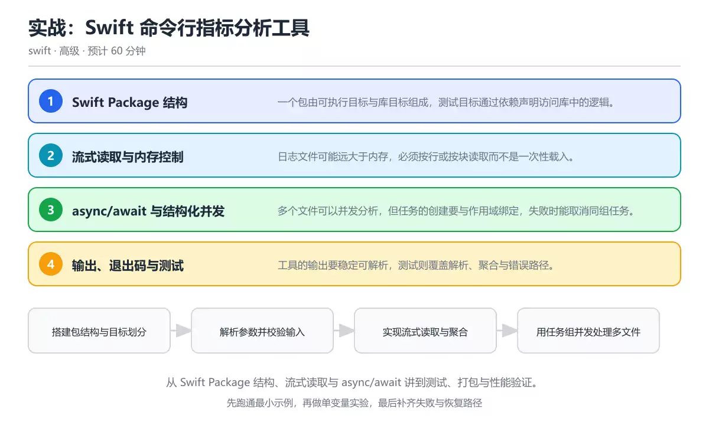
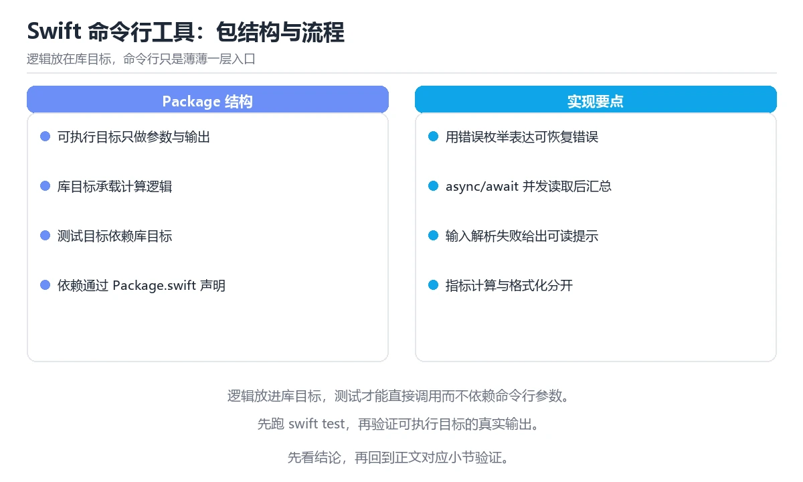

# 实战：Swift 命令行指标分析工具

> 内容更新时间：2026-10-06 · 学习阶段：高级 · 预计用时：60 分钟

分类：swift。关键词：Swift、Swift Package Manager、async/await、并发、测试。从 Swift Package 结构、流式读取与 async/await 讲到测试、打包与性能验证。

学习建议：先通读《实战：Swift 命令行指标分析工具》的核心知识与关键流程，再运行可运行练习并完成测验；遇到不确定的结论，回到「故障现场」按症状、根因、修复、验证四步核对。



## 学习目标

- 能建立一个包含可执行目标与测试目标的 Swift Package。
- 能用流式读取处理大于内存的日志文件。
- 能用任务组并发分析多个文件并保证错误被正确传播。

## 前置知识

- 熟悉 Swift 的可选类型、结构体与协议。
- 了解 async/await 与任务的基本用法。
- 知道命令行参数与退出码的作用。

## 核心知识

### 1. Swift Package 结构

一个包由可执行目标与库目标组成，测试目标通过依赖声明访问库中的逻辑。

Package.swift 声明目标、依赖与平台版本，构建工具据此生成可执行文件并运行测试。

在实战：Swift 命令行指标分析工具里可以这样验证：把解析与聚合逻辑放进库目标，可执行目标只负责参数处理与输出，测试目标直接引用库。

边界：把所有代码塞进可执行目标会让测试无法导入这些类型，只能通过进程调用间接验证。

工程视角：按「库放逻辑、可执行放编排」划分目标，测试只依赖库目标。

### 2. 流式读取与内存控制

日志文件可能远大于内存，必须按行或按块读取而不是一次性载入。

按块读取并按换行切分，保留未完成的尾部片段与下一块拼接，保证跨块的行也能被正确解析。

在实战：Swift 命令行指标分析工具里可以这样验证：用一块很小的缓冲区读取大文件，验证行数与一次性读取的结果一致。

边界：忽略跨块拼接会丢掉被切断的行，统计结果会出现难以复现的偏差。

工程视角：把读取抽象成返回行的序列，让上层聚合逻辑与文件大小无关。

### 3. async/await 与结构化并发

多个文件可以并发分析，但任务的创建要与作用域绑定，失败时能取消同组任务。

任务组在作用域结束前等待所有子任务，任一子任务抛出错误时可取消其余任务并把错误向上传播。

在实战：Swift 命令行指标分析工具里可以这样验证：并发分析若干文件，其中一个文件缺失，观察整体是否快速失败并释放资源。

边界：在任务组里捕获并吞掉错误会让调用方误以为全部成功，统计结果因此不完整。

工程视角：统一在任务组外处理错误，并限制并发度以避免同时打开过多文件。

### 4. 输出、退出码与测试

工具的输出要稳定可解析，测试则覆盖解析、聚合与错误路径。

聚合结果按固定列宽或分隔符输出，退出码区分成功、用法错误与数据错误，测试用固定样本文件断言结果与退出码。

在实战：Swift 命令行指标分析工具里可以这样验证：为同一份样本文件写测试，断言表格内容与退出码均为预期值。

边界：只在开发机上手工运行无法发现平台差异，尤其是并发任务数量与文件编码相关的行为。

工程视角：把样本数据放进测试资源，用固定输入断言输出格式，保证脚本调用方长期可用。

## 关键流程

```text
搭建包结构与目标划分 → 解析参数并校验输入 → 实现流式读取与聚合 → 用任务组并发处理多文件 → 补测试并打包验证
```

1. 搭建包结构与目标划分
2. 解析参数并校验输入
3. 实现流式读取与聚合
4. 用任务组并发处理多文件
5. 补测试并打包验证

## 动手练习

1. 建立一个包含可执行目标与测试目标的 Swift Package，并让测试直接引用库目标。
2. 用 8 KB 缓冲区读取一份大日志，验证行数与一次性读取完全一致。
3. 并发分析多个文件并在其中一个缺失时验证错误传播与退出码。

**验收标准**：记录 Swift 的输入、实际输出与差异解释，缺一项都不算完成。

## 常见错误与排查

> 说明：本表由《实战：Swift 命令行指标分析工具》的核心知识整理（2026-10-06），人工复核进度见 docs/content_review_batches.md。

| 易错点 | 容易踩的做法 | 正确结论 |
| --- | --- | --- |
| 一次性把日志读进内存 | 用一次性读取的方式载入几百兆的文件 | 按块流式读取并按行切分，只保留必要状态 |
| 忽略跨块被切断的行 | 每读一块就立即切分并丢弃未完成的尾部 | 保留尾部数据与下一块拼接后再切分 |
| 任务组里吞掉错误 | 在子任务里捕获错误并返回空结果 | 让错误向上传播，由调用方统一处理并返回非 0 退出码 |

## 可运行练习

### 任务 1：先跑通，再解释

```swift
import Foundation

enum MetricsError: Error {
    case missingInput
    case unreadable(String)
}

/// 流式读取：按块读取并保留未完成的尾部，避免一次性载入整个文件
func lines(of path: String, chunkSize: Int = 8192) throws -> [String] {
    guard let handle = FileHandle(forReadingAtPath: path) else {
        throw MetricsError.unreadable(path)
    }
    defer { try? handle.close() }

    var result: [String] = []
    var pending = Data()
    while let chunk = try handle.read(upToCount: chunkSize), !chunk.isEmpty {
        pending.append(chunk)
        while let index = pending.firstIndex(of: 0x0A) {
            let lineData = pending[pending.startIndex..<index]
            result.append(String(decoding: lineData, as: UTF8.self))
            pending = pending[pending.index(after: index)...]
        }
    }
    if !pending.isEmpty {
        result.append(String(decoding: pending, as: UTF8.self))
    }
    return result
}

/// 任务组并发分析多个文件，错误向上传播，任一失败即取消其余任务
func analyze(paths: [String]) async throws -> [String: Int] {
    try await withThrowingTaskGroup(of: [String: Int].self) { group in
        for path in paths {
            group.addTask {
                var counter: [String: Int] = [:]
                for line in try lines(of: path) {
                    let level = line.split(separator: " ").first.map(String.init) ?? "unknown"
                    counter[level, default: 0] += 1
                }
                return counter
            }
        }
        var total: [String: Int] = [:]
        for try await partial in group {
            for (level, count) in partial {
                total[level, default: 0] += count
            }
        }
        return total
    }
}
```

示例用数据块读取并保留未完成的尾部，保证跨块的行也能被正确切分；任务组把每个文件的分析放进子任务，错误向上传播并取消同组任务，最后在主任务里合并统计结果。

### 任务 2：只改一个条件

复制上面的示例，只改一个输入或参数再跑一次；先写下预测，再和真实输出对照，并说明差异来自实战：Swift 命令行指标分析工具的哪条机制。

### 任务 3：迁移到自己的数据

把《实战：Swift 命令行指标分析工具》里的示例换成你自己的一小段数据或场景，保持结构不变；如果换不动，说明还有哪条前提没有理解，回到核心知识对应小节。

## 项目专属规格

### 交付目标

从 Swift Package 结构、流式读取与 async/await 讲到测试、打包与性能验证。

### 里程碑

1. 搭建包结构与目标划分
2. 解析参数并校验输入
3. 实现流式读取与聚合
4. 用任务组并发处理多文件
5. 补测试并打包验证

### 输入与约束

- 输入：建立一个包含可执行目标与测试目标的 Swift Package，并让测试直接引用库目标。
- 约束：把所有代码塞进可执行目标会让测试无法导入这些类型，只能通过进程调用间接验证。
- 失败预算：按块流式读取并按行切分，只保留必要状态

### 验收场景

1. 正常路径：跑通「可运行练习」里的最小示例并保存输出。
2. 边界路径：把解析与聚合逻辑放进库目标，可执行目标只负责参数处理与输出，测试目标直接引用库。
3. 失败路径：出现「用一次性读取的方式载入几百兆的文件」时按上面的失败预算恢复。

## 项目交付物

- 可运行代码：包含swift源文件、依赖说明与启动入口。
- README：环境版本、启动命令、目录结构与已知限制。
- 测试记录：为 MetricsError 各准备一条正常、边界与失败用例，并附完整输出。
- 复盘记录：写下 MetricsError 的哪条假设被推翻，以及下一次验证怎么做。

### 交付验收清单

- [ ] 能建立一个包含可执行目标与测试目标的 Swift Package。
- [ ] 能用流式读取处理大于内存的日志文件。
- [ ] 能用任务组并发分析多个文件并保证错误被正确传播。

## 验证命令与预期输出

| 步骤 | 命令 | 预期输出 |
| --- | --- | --- |
| 准备环境 | 按 README 安装依赖 | 依赖安装完成且没有版本冲突 |
| 运行示例 | 运行「可运行练习」中的入口 | 对同一份样本日志，流式读取得到的行数与一次性读取一致；并发分析多个文件时结果与串行一致；任一文件缺失时整体抛出错误并以非 0 退出码结束。 |
| 边界输入 | 替换一个输入后重跑 | 结果仍能被正文机制解释 |
| 失败演练 | 按「故障现场」制造一次失败 | 能定位根因并恢复到正常输出 |

### 验收证据

- [ ] 保存一次成功运行的完整输出。
- [ ] 保存一次边界输入的输出与解释。
- [ ] 记录一次失败现象、根因与修复动作。

> 项目目标：实战：Swift 命令行指标分析工具 的每一步都要能复现，做不到复现就先缩小范围。

## 故障现场

### 现场 1：一次性把日志读进内存

**症状**：在《实战：Swift 命令行指标分析工具》的复现场景中，用一次性读取的方式载入几百兆的文件。

**根因**：“用一次性读取的方式载入几百兆的文件”只是表层结果。向上追溯会落到“一次性把日志读进内存”这一步，因为它省略了《实战：Swift 命令行指标分析工具》的约束，使实现行为和预期模型发生了偏离。

**修复**：针对《实战：Swift 命令行指标分析工具》的问题，按块流式读取并按行切分，只保留必要状态。

**验证**：保留《实战：Swift 命令行指标分析工具》里触发“用一次性读取的方式载入几百兆的文件”的输入、版本和日志，按“按块流式读取并按行切分，只保留必要状态”完成修改后原样重放；只有失败现象消失且相邻场景仍可解释，才保留改动。

### 现场 2：忽略跨块被切断的行

**症状**：在《实战：Swift 命令行指标分析工具》的复现场景中，每读一块就立即切分并丢弃未完成的尾部。

**根因**：“每读一块就立即切分并丢弃未完成的尾部”只是表层结果。向上追溯会落到“忽略跨块被切断的行”这一步，因为它省略了《实战：Swift 命令行指标分析工具》的约束，使实现行为和预期模型发生了偏离。

**修复**：针对《实战：Swift 命令行指标分析工具》的问题，保留尾部数据与下一块拼接后再切分。

**验证**：保留《实战：Swift 命令行指标分析工具》里触发“每读一块就立即切分并丢弃未完成的尾部”的输入、版本和日志，按“保留尾部数据与下一块拼接后再切分”完成修改后原样重放；只有失败现象消失且相邻场景仍可解释，才保留改动。

### 现场 3：任务组里吞掉错误

**症状**：在《实战：Swift 命令行指标分析工具》的复现场景中，在子任务里捕获错误并返回空结果。

**根因**：触发点是把“任务组里吞掉错误”当成安全做法。它没有满足《实战：Swift 命令行指标分析工具》要求的前提，因此先表现为“在子任务里捕获错误并返回空结果”；排查时先完整复现这一段，再核对输入、配置与依赖。

**修复**：针对《实战：Swift 命令行指标分析工具》的问题，让错误向上传播，由调用方统一处理并返回非 0 退出码。

**验证**：先在《实战：Swift 命令行指标分析工具》中记录“任务组里吞掉错误”留下的失败证据，再执行“让错误向上传播，由调用方统一处理并返回非 0 退出码”并重放；确认错误路径变为明确结果，且修复没有掩盖同类故障。

## 本课复习清单

离开本课前，逐项确认：

- [ ] 能说明库目标与可执行目标的划分理由。
- [ ] 能写出流式读取中处理跨块行的步骤。
- [ ] 能解释任务组如何传播错误并等待子任务。
- [ ] 跑通「实战：Swift 命令行指标分析工具」的最小示例，并记录一次失败输入的处理方式。
- [ ] 把本课最容易混淆的两个概念写成一句话对照。

| 复盘项 | 记录 |
| --- | --- |
| 已经能独立解释的考点 |  |
| 仍然说不清的概念 |  |
| 下一步验证动作 |  |

## 复习与自测

### 核心知识

遮住正文回答：实战：Swift 命令行指标分析工具解决什么问题、依赖哪些前提、失败时先看哪个信号？三问都能答清楚，再进入下一节。

### 动手练习

把《实战：Swift 命令行指标分析工具》里「只改一个条件」的练习再做一遍，这次先写预测再运行；预测和结果不一致的地方，就是需要回读的章节。

### 最小可运行示例

```swift
import Foundation

enum MetricsError: Error {
    case missingInput
    case unreadable(String)
}

/// 流式读取：按块读取并保留未完成的尾部，避免一次性载入整个文件
func lines(of path: String, chunkSize: Int = 8192) throws -> [String] {
    guard let handle = FileHandle(forReadingAtPath: path) else {
        throw MetricsError.unreadable(path)
    }
    defer { try? handle.close() }

    var result: [String] = []
    var pending = Data()
    while let chunk = try handle.read(upToCount: chunkSize), !chunk.isEmpty {
        pending.append(chunk)
        while let index = pending.firstIndex(of: 0x0A) {
            let lineData = pending[pending.startIndex..<index]
            result.append(String(decoding: lineData, as: UTF8.self))
            pending = pending[pending.index(after: index)...]
        }
    }
    if !pending.isEmpty {
        result.append(String(decoding: pending, as: UTF8.self))
    }
    return result
}

/// 任务组并发分析多个文件，错误向上传播，任一失败即取消其余任务
func analyze(paths: [String]) async throws -> [String: Int] {
    try await withThrowingTaskGroup(of: [String: Int].self) { group in
        for path in paths {
            group.addTask {
                var counter: [String: Int] = [:]
                for line in try lines(of: path) {
                    let level = line.split(separator: " ").first.map(String.init) ?? "unknown"
                    counter[level, default: 0] += 1
                }
                return counter
            }
        }
        var total: [String: Int] = [:]
        for try await partial in group {
            for (level, count) in partial {
                total[level, default: 0] += count
            }
        }
        return total
    }
}
```

### 预期输出

```text
对同一份样本日志，流式读取得到的行数与一次性读取一致；并发分析多个文件时结果与串行一致；任一文件缺失时整体抛出错误并以非 0 退出码结束。
```

### 验证步骤

1. 确认输入数据与运行环境和示例一致。
2. 运行示例，记录输出与耗时等可观测指标。
3. 换一个边界输入重跑，确认结论仍然成立。
4. 把两次结果写成一句话结论，注明前提与局限。

## 术语速查

先遮住右列，尝试用自己的话解释，再回到正文核对。

| 术语 | 一句话说明 |
| --- | --- |
| `Swift Package Manager` | Swift 官方的依赖与构建工具，用 Package.swift 描述目标。 |
| `目标` | 包中的构建单元，分为可执行、库与测试等类型。 |
| `流式读取` | 按块或按行逐步读取数据，避免一次性载入内存。 |
| `任务组` | 受作用域约束、可并发执行并传播错误的子任务集合。 |
| `退出码` | 进程返回给调用方的整数状态，用于区分成功与不同失败类型。 |

## 考点精讲

### 考点 1：为什么要把业务逻辑放进库目标而不是可执行

题型：概念判断。题干：为什么要把业务逻辑放进库目标而不是可执行目标？

判断要点：测试目标可以直接导入这些类型进行单元测试。可执行目标的代码无法被测试目标直接导入，把解析与聚合逻辑放进库目标后，测试可以构造输入并断言输出，而不必通过启动子进程间接验证。 正确选项「测试目标可以直接导入这些类型进行单元测试」对应《实战：Swift 命令行指标分析工具》的要点「Swift Package 结构」：一个包由可执行目标与库目标组成，测试目标通过依赖声明访问库中的逻辑。判断「Swift Package 结构」时先确认前提是否成立，再回到《实战：Swift 命令行指标分析工具》的示例核对一次；把别的语言或框架的默认做法直接搬到Swift Package 结构上，往往会在本课的边界条件里失效。

### 考点 2：按块读取时保留未完成尾部的原因是什么？

题型：概念判断。题干：按块读取时保留未完成尾部的原因是什么？

判断要点：一行可能被切在块边界上。按固定大小读取时，一行很可能被切在两个块之间，如果直接丢弃尾部就会漏掉这一行；保留尾部与下一块拼接后才能得到完整的行。 正确选项「一行可能被切在块边界上」对应《实战：Swift 命令行指标分析工具》的要点「流式读取与内存控制」：日志文件可能远大于内存，必须按行或按块读取而不是一次性载入。判断「流式读取与内存控制」时先确认前提是否成立，再回到《实战：Swift 命令行指标分析工具》的示例核对一次；借鉴相邻主题的经验之前，先核对流式读取与内存控制的前提是否成立。

### 考点 3：以下哪些做法符合结构化并发的要求？（多选

题型：多选辨析。题干：以下哪些做法符合结构化并发的要求？（多选）

判断要点：子任务错误向上传播；限制同时打开的文件数量；作用域结束前等待所有子任务。结构化并发要求作用域结束时所有子任务都已收尾，错误应向上传播，同时要限制并发度避免资源耗尽；吞掉错误会让调用方误判结果完整。 正确选项「子任务错误向上传播；限制同时打开的文件数量；作用域结束前等待所有子任务」对应《实战：Swift 命令行指标分析工具》的要点「async/await 与结构化并发」：多个文件可以并发分析，但任务的创建要与作用域绑定，失败时能取消同组任务。判断「async/await 与结构化并发」时先确认前提是否成立，再回到《实战：Swift 命令行指标分析工具》的示例核对一次；记住async/await 与结构化并发的结论之外还要记住适用条件，换一个输入往往就不成立了。

### 考点 4：请按命令行工具处理一次分析的顺序排列。

题型：顺序排列。题干：请按命令行工具处理一次分析的顺序排列。

判断要点：输出表格并返回退出码。开发顺序是先搭好包与目标结构，再实现参数解析与校验，随后并发分析并合并统计，最后输出结果与退出码；把输出放在最前会让错误路径缺少明确状态。 正确选项「搭建包与目标结构；解析并校验输入参数；并发分析各文件并合并统计；输出表格并返回退出码」对应《实战：Swift 命令行指标分析工具》的要点「输出、退出码与测试」：工具的输出要稳定可解析，测试则覆盖解析、聚合与错误路径。判断「输出、退出码与测试」时先确认前提是否成立，再回到《实战：Swift 命令行指标分析工具》的示例核对一次；干扰项常常是相邻主题里成立的结论，只有按输出、退出码与测试的输入与约束判断才能排除。

### 考点 5：阅读这段并发分析代码，下面哪项判断是正确

题型：排错。题干：阅读这段并发分析代码，下面哪项判断是正确的？

判断要点：任务组的子任务把错误向上传播，作用域结束前会等待全部任务。这段 Swift 代码用可抛出错误的 Swift 并发任务组并发分析文件，子任务的错误会向上传播，作用域结束前会等待全部任务收尾；实际项目还应限制并发度，避免同时打开过多文件。 正确选项「任务组的子任务把错误向上传播，作用域结束前会等待全部任务」对应《实战：Swift 命令行指标分析工具》的要点「Swift Package 结构」：一个包由可执行目标与库目标组成，测试目标通过依赖声明访问库中的逻辑。判断「Swift Package 结构」时先确认前提是否成立，再回到《实战：Swift 命令行指标分析工具》的示例核对一次；把Swift Package 结构的做法换到别的约束下未必成立，先确认边界再决定答案。

## English Overview

Hands-on Swift CLI Metrics Tool

A Swift CLI tool separates a library target with parsing and aggregation logic from a thin executable target, so tests can import the logic directly. Read large files in chunks while keeping the unfinished tail, run per-file analysis inside a throwing task group so errors propagate and siblings cancel, and keep output and exit codes stable for scripted callers.



## 本课小结

- 实战：Swift 命令行指标分析工具围绕Swift、Swift Package Manager、async/await展开，先建立基线再讨论优化。
- 一个包由可执行目标与库目标组成，测试目标通过依赖声明访问库中的逻辑。
- MetricsError 出错时先记录症状，再定位根因，最后用一次复跑确认修复。

## 内容元数据

- 内容版本：v2.0
- 最后更新：2026-10-06
- 学习阶段：高级

| 字段 | 值 |
| --- | --- |
| 课程 ID | `swift_project_cli_metrics` |
| 所属分类 | `swift` |
| 难度 | 高级 |
| 预计用时 | 60 分钟 |
| 关键词 | Swift、Swift Package Manager、async/await、并发、测试 |
| 配图 | `images/lesson_swift_project_cli_metrics.webp` |
| 参考资料 | 3 条 |
| 内容更新时间 | 2026-10-06 |

## 参考资料与复核

- 最后复核：2026-10-04
- 下次复核：2026-12-17
- 复核范围：版本兼容、API 行为与工程实践

下面列出的资料用于核对本课结论，复习时可以对照阅读：
- [Swift 官方文档：并发](https://docs.swift.org/swift-book/documentation/the-swift-programming-language/concurrency/)
- [Swift Package Manager 文档](https://www.swift.org/documentation/package-manager/)
- [Apple 文档：FileHandle](https://developer.apple.com/documentation/foundation/filehandle)

> 复核提示：《实战：Swift 命令行指标分析工具》的结论如与资料冲突，以资料中的规范文本为准，并在笔记里记录差异与日期。

## 复习与迁移

### 概念复述

不看正文，把实战：Swift 命令行指标分析工具讲给一个没学过的同事：先讲它解决什么问题，再讲一个最小例子，最后说明一个不适用场景。

### 测验回顾

回到《实战：Swift 命令行指标分析工具》测验，只重做答错或犹豫的题；对每道题写一句「我为什么改选这个答案」，写不出理由就回到对应小节。

### 迁移练习

把《实战：Swift 命令行指标分析工具》的方法用到一个你自己的真实场景：说明输入、约束与验证方式，并列出仍然不确定、需要下一次实验回答的问题。

<!-- p1-project-review:start -->
## 交付评审：评分表、决策记录与证据链

「实战：Swift 命令行指标分析工具」的验收不能只看功能能不能跑通。下面把正文里的交付物、验证命令和关键设计点整理成一张评审表，按表逐项留下证据即可。

### 一、「实战：Swift 命令行指标分析工具」的交付物评分表

| 交付物 | 权重 | 合格线 | 需要的证据 |
| --- | ---: | --- | --- |
| 可运行代码：包含swift源文件、依赖说明与启动入口。 | 25% | 能在干净环境复现，且失败路径有明确处理 | 命令与输出、对应测试、一次失败与恢复记录 |
| README：环境版本、启动命令、目录结构与已知限制。 | 25% | 能在干净环境复现，且失败路径有明确处理 | 命令与输出、对应测试、一次失败与恢复记录 |
| 测试记录：正常、边界与失败路径各至少一条，附命令与输出。 | 25% | 能在干净环境复现，且失败路径有明确处理 | 命令与输出、对应测试、一次失败与恢复记录 |
| 复盘记录：本次实现推翻了哪个假设，下一步验证动作是什么。 | 25% | 能在干净环境复现，且失败路径有明确处理 | 命令与输出、对应测试、一次失败与恢复记录 |

「实战：Swift 命令行指标分析工具」的评分先看证据再打分：任意一项只要拿不出可复现的命令或测试，该项按 0 分计，不允许用「基本完成」代替。

### 二、需要写下来的决策（ADR）

| 决策点 | 本课给出的做法 | 备选方案 | 代价与回滚 |
| --- | --- | --- | --- |
| 里程碑 | 1. 搭建包结构与目标划分 | 不做「里程碑」，沿用最朴素的实现（需要额外补一次对照实验） | 若「里程碑」出问题，回到上一版本并按本课验收场景重跑 |

ADR 不需要长：每个决策三行就够——选了什么、放弃了什么、出问题怎么退。评审时只检查这三行是否和「实战：Swift 命令行指标分析工具」的实际代码一致。

### 三、「实战：Swift 命令行指标分析工具」的交付证据链

本课未给出可执行命令，用下面的最小证据集代替：

1. 一条从零开始的环境准备命令。
2. 一条跑通核心链路的命令及其完整输出。
3. 一条触发失败的命令，以及恢复后的验证结果。

把「实战：Swift 命令行指标分析工具」的上表整理成一个 evidence/ 目录：每条命令一个文件，文件名带日期，内容包含版本、命令与输出。评审时直接按目录核对，不再口头确认。

### 四、「实战：Swift 命令行指标分析工具」的验收指标

| 指标 | 目标值 | 测量方式 | 不达标时的动作 |
| --- | --- | --- | --- |
| 失败路径：出现「用一次性读取的方式载入几百兆的文件」时按上面的失败预算恢复。 | 用本课正文给出的阈值，没有就写实测基线 | 固定环境重复三次取中位数 | 回到对应小节定位，先修原因再重测 |

指标必须能用一条命令或一次操作测出来；写不出测量方式的指标，在「实战：Swift 命令行指标分析工具」的评审里一律视为未定义。

### 五、评审记录模板

| 记录项 | 填写要求 |
| --- | --- |
| 项目标识 | `swift_project_cli_metrics` |
| 本次范围 | 说明这一轮交付了「实战：Swift 命令行指标分析工具」的哪些部分 |
| 未完成项 | 列出与 Swift 相关但本轮未做的内容 |
| 证据位置 | 指向 evidence/ 目录下的具体文件 |
| 风险与回滚 | 写清剩余风险、回滚步骤和验证方式 |
| 结论 | 通过 / 有条件通过 / 不通过，三者选一 |

「实战：Swift 命令行指标分析工具」评审结束后把这张表填完并归档；下一轮迭代直接读上一次的「未完成项」与「风险与回滚」，避免重复讨论同一个问题。
<!-- p1-project-review:end -->
