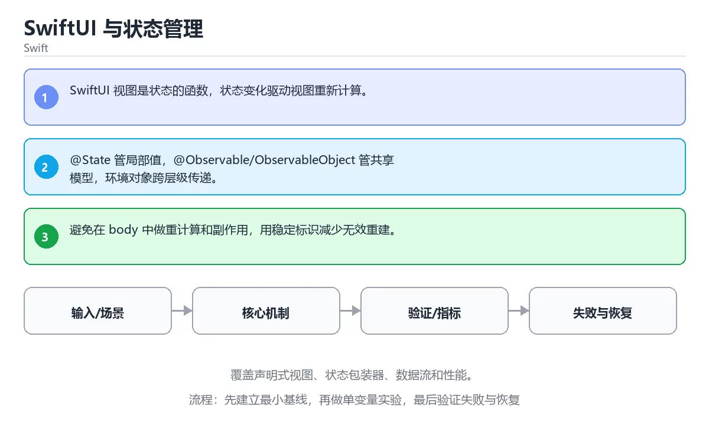

# SwiftUI 与状态管理



> 内容更新时间：2026-10-03 · 学习阶段：高级 · 预计用时：24 分钟

## 学习目标

- 能用自己的话解释：SwiftUI 视图是状态的函数，状态变化驱动视图重新计算。
- 能用自己的话解释：@State 管局部值，@Observable/ObservableObject 管共享模型，环境对象跨层级传递。
- 能用自己的话解释：避免在 body 中做重计算和副作用，用稳定标识减少无效重建。
- 能把本课知识放回「Swift」，并完成练习与测验。

## 前置知识

- 已完成「Swift」的基础课程，能运行正文中的最小示例。
- 本课关键词：SwiftUI、状态、数据流、视图。
- 遇到不熟悉的术语先记录问题，完成练习后再回读。

## 核心知识

### 1. SwiftUI 视图是状态的函数，状态变化驱动视图重新计算。

- 它解决的问题：把「SwiftUI 视图是状态的函数，状态变化驱动视图重新计算。」放回真实场景，说明不做它会带来什么后果。
- 关键做法：先用最小示例建立基线，再逐步加入边界、失败和性能条件。
- 验证标准：结果可复现、错误可解释、边界有测试、失败能恢复。

### 2. @State 管局部值，@Observable/ObservableObject 管共享模型，环境对象跨层级传递。

- 它解决的问题：把「@State 管局部值，@Observable/ObservableObject 管共享模型，环境对象跨层级传递。」放回真实场景，说明不做它会带来什么后果。
- 关键做法：先用最小示例建立基线，再逐步加入边界、失败和性能条件。
- 验证标准：结果可复现、错误可解释、边界有测试、失败能恢复。

### 3. 避免在 body 中做重计算和副作用，用稳定标识减少无效重建。

- 它解决的问题：把「避免在 body 中做重计算和副作用，用稳定标识减少无效重建。」放回真实场景，说明不做它会带来什么后果。
- 关键做法：先用最小示例建立基线，再逐步加入边界、失败和性能条件。
- 验证标准：结果可复现、错误可解释、边界有测试、失败能恢复。

## 关键流程

```text
输入 → 校验 → 核心处理 → 验证 → 记录指标 → 失败恢复
```

## 实践路径

1. 用一句话复述本课要解决的问题。
2. 跑通正文中的最小示例并记录基线。
3. 只改变一个输入或参数，预测并验证结果。
4. 补一个失败路径，记录错误、恢复和指标。
5. 把结论写成可复现的笔记或测试。

## 常见误区

| 误区 | 后果 | 修正 |
| --- | --- | --- |
| 只记术语不做实验 | 遇到真实问题无法判断 | 用最小输入跑通并记录结果 |
| 只测正常路径 | 边界和故障上线才暴露 | 补空值、极值和依赖失败 |
| 没有基线就优化 | 无法证明改进有效 | 先测量再修改 |
| 忽略成本与安全 | 性能和风险失控 | 同时记录资源、权限与失败代价 |

## 动手练习

1. 合上教程，用 3～5 句话解释「SwiftUI 与状态管理」。
2. 从正文选一个例子，改变一个条件并预测结果。
3. 设计一个失败场景，写出止损与恢复步骤。

**验收标准**：留下输入、命令、输出、差异和下一步问题。

## 本课小结

- 本课属于「Swift」，核心关键词是 SwiftUI、状态、数据流、视图。
- 先保证正确与可复现，再讨论性能和扩展。
- 完成练习和测验后，把仍然不确定的问题写成下一轮验证清单。

> 本课由 P1 内容扩展生成，重点补充原有课程缺失的主题与工程边界。

<!-- domain-supplement:v1 -->

## 语言专项实践：SwiftUI 与状态管理

### 一、工具链

| 阶段 | 推荐工具 | 验收标准 |
| --- | --- | --- |
| 编译构建 | swiftc / xcodebuild | 命令可复现且错误能被定位 |
| 测试 | XCTest + async 测试 | 命令可复现且错误能被定位 |
| 性能 | Instruments / signpost | 命令可复现且错误能被定位 |
| 发布 | TestFlight + App Store 审核 | 命令可复现且错误能被定位 |

### 二、运行时与内存模型

围绕「SwiftUI、状态、数据流、视图」说明变量生命周期、资源释放、并发模型和错误传播。语言语法只是入口，真正决定行为的是运行时、标准库和平台约束。

### 三、测试策略

- 单元测试覆盖核心规则和边界。
- 集成测试覆盖文件、网络、数据库或平台 API。
- 失败测试覆盖超时、取消、异常和资源耗尽。
- 性能测试记录基线，避免只凭感觉优化。

### 四、发布检查

- [ ] 版本和依赖锁定，构建可复现。
- [ ] 产物经过签名、校验和最小权限配置。
- [ ] 日志不泄露密钥和个人信息。
- [ ] 有升级、回滚和故障恢复说明。

<!-- p2-enrichment:v1 -->

## English Overview

**Title:** SwiftUI and State Management

**Summary:** Cover declarative views, property wrappers, data flow and performance.

**Category:** Swift  
**Level:** 高级  
**Key terms:** SwiftUI, 状态, 数据流, 视图

> The full tutorial is written in Chinese. This bilingual overview helps English readers identify the topic, scope and key terms before studying the detailed examples.

## 内容元数据

- 内容版本：v2.0
- 最后更新：2026-10-03
- 学习阶段：高级
- 适用环境：Swift 6 / Xcode 16+
- 内容来源：内置结构化课程与工程实践整理
- 相关主题：SwiftUI、状态、数据流、视图
- 质量版本：P0 测验标准 + P1 覆盖扩展 + P2 体验补全

<!-- minimal-code:v1 -->

## 最小可运行示例

下面示例用于验证「SwiftUI 与状态管理」的最小输入、处理和输出。先原样运行，再只修改一个值：

```swift
struct CounterView: View {
    @State private var count = 0

    var body: some View {
        Button("count=\(count)") { count += 1 }
    }
}
```

## 预期输出

```text
界面显示一个按钮：初始文案为 count=0，每次点击后数字加一
```

## 验证步骤

1. 记录运行环境、命令和真实输出。
2. 修改一个输入，先写预测再运行。
3. 制造一次错误输入，记录错误信息与修复方式。
4. 把结论写回本课笔记或测试用例。

<!-- top50-rewrite:v1 -->

## 课程专属精读：SwiftUI 与状态管理

### 一、知识地图

| 主题 | 核心要点 | 验证方式 |
| --- | --- | --- |
| 核心知识 | ### 1. SwiftUI 视图是状态的函数，状态变化驱动视图重新计算。 | 复述要点 + 举一个反例 |
| 关键流程 | 输入 → 校验 → 核心处理 → 验证 → 记录指标 → 失败恢复 | 运行示例 + 换一个边界输入 |
| 实践路径 | 用一句话复述本课要解决的问题。 | 复述要点 + 举一个反例 |
| 语言专项实践：SwiftUI 与状态管理 | 阶段：编译构建；推荐工具：swiftc / xcodebuild；验收标准：命令可复现且错误能被定位 | 复述要点 + 举一个反例 |

### 二、机制与验证

1. **核心知识**：### 1. SwiftUI 视图是状态的函数，状态变化驱动视图重新计算。 验证方式：先复述要点，再举一个反例说明边界。
2. **关键流程**：输入 → 校验 → 核心处理 → 验证 → 记录指标 → 失败恢复 验证方式：先原样运行示例，再把输入换成边界值，对照输出差异。
3. **实践路径**：用一句话复述本课要解决的问题。 验证方式：先复述要点，再举一个反例说明边界。
4. **语言专项实践：SwiftUI 与状态管理**：阶段：编译构建；推荐工具：swiftc / xcodebuild；验收标准：命令可复现且错误能被定位 验证方式：先复述要点，再举一个反例说明边界。

### 三、专属检查问题

1. 「核心知识」要解决什么问题？请用一句话说明，并给出一个具体例子。
2. 「关键流程」的输入和输出分别是什么？
3. 「实践路径」最常见的失败方式是什么？如何定位？
4. 「语言专项实践：SwiftUI 与状态管理」的适用边界在哪里？什么情况下不该使用？

### 四、故障排查

1. 固定输入和环境，确认问题能稳定复现。
2. 找到第一个异常状态，不从最终错误倒推。
3. 每次只改一个变量，记录预测和真实结果。
4. 修复后补边界、失败与重复执行三类测试。

## 专属复习题库

**问：核心知识的核心要点是什么？**

答：### 1. SwiftUI 视图是状态的函数，状态变化驱动视图重新计算。

**问：关键流程的核心要点是什么？**

答：输入 → 校验 → 核心处理 → 验证 → 记录指标 → 失败恢复

**问：实践路径的核心要点是什么？**

答：用一句话复述本课要解决的问题。

**问：语言专项实践：SwiftUI 与状态管理的核心要点是什么？**

答：阶段：编译构建；推荐工具：swiftc / xcodebuild；验收标准：命令可复现且错误能被定位

## 逐步练习：SwiftUI 与状态管理

### 练习 1：核心知识

1. 不看原文，用自己的话复述：### 1. SwiftUI 视图是状态的函数，状态变化驱动视图重新计算。
2. 举一个正例和一个反例，说明边界在哪里。
3. 把结论写成两行笔记：一行结论，一行验证方式。

### 练习 2：关键流程

1. 不看原文，用自己的话复述：输入 → 校验 → 核心处理 → 验证 → 记录指标 → 失败恢复
2. 跑通本课示例，再把其中一个输入换成边界值，记录输出差异。
3. 把结论写成两行笔记：一行结论，一行验证方式。

### 练习 3：实践路径

1. 不看原文，用自己的话复述：用一句话复述本课要解决的问题。
2. 举一个正例和一个反例，说明边界在哪里。
3. 把结论写成两行笔记：一行结论，一行验证方式。

### 练习 4：语言专项实践：SwiftUI 与状态管理

1. 不看原文，用自己的话复述：阶段：编译构建；推荐工具：swiftc / xcodebuild；验收标准：命令可复现且错误能被定位
2. 举一个正例和一个反例，说明边界在哪里。
3. 把结论写成两行笔记：一行结论，一行验证方式。

## 故障排查手册：SwiftUI 与状态管理

| 现象 | 优先检查 | 修复动作 |
| --- | --- | --- |
| 「核心知识」的结果与预期不符 | 输入、环境、依赖版本、日志里的第一条错误 | 固定最小复现，只改一个变量并回归 |
| 「关键流程」的结果与预期不符 | 输入、环境、依赖版本、日志里的第一条错误 | 固定最小复现，只改一个变量并回归 |
| 「实践路径」的结果与预期不符 | 输入、环境、依赖版本、日志里的第一条错误 | 固定最小复现，只改一个变量并回归 |
| 「语言专项实践：SwiftUI 与状态管理」的结果与预期不符 | 输入、环境、依赖版本、日志里的第一条错误 | 固定最小复现，只改一个变量并回归 |

## 自测与面试：SwiftUI 与状态管理

1. 「核心知识」的输入和输出分别是什么？
2. 「关键流程」最常见的失败方式是什么？如何定位？
3. 「实践路径」的适用边界在哪里？什么情况下不该使用？
4. 「语言专项实践：SwiftUI 与状态管理」和相邻主题相比，最关键的差别是什么？

## 专属进阶任务 5：SwiftUI 与状态管理

把本课 4 个主题串成一个小练习：选其中一个主题做出可运行的例子，再为另外两个主题各写一条边界用例，最后用一句话说明你的验证结论。

### 验收标准

- 例子可以独立运行，输出与预期一致。
- 两条边界用例都说清了输入、预期与实际结果。
- 验证结论用一句话写清，不依赖“感觉正确”。

<!-- p2-references:v1 -->
## 参考资料与复核

- 最后复核：2026-10-04
- 下次复核：2027-04-04
- 复核范围：版本兼容、API 行为、安全建议与工程实践
- 来源性质：官方文档与标准；本课正文为离线教学重组，不复制原文

| 参考资料 | 本课用途 |
| --- | --- |
| [Swift 官方文档](https://www.swift.org/documentation/) | 语言、并发与包管理 |
| [Apple Developer](https://developer.apple.com/documentation/swift) | 平台 API 与工具链 |

> 本课主题：覆盖声明式视图、状态包装器、数据流和性能。

> App 完全离线展示文字链接，不会自动联网；需要延伸阅读时可复制链接到浏览器。

