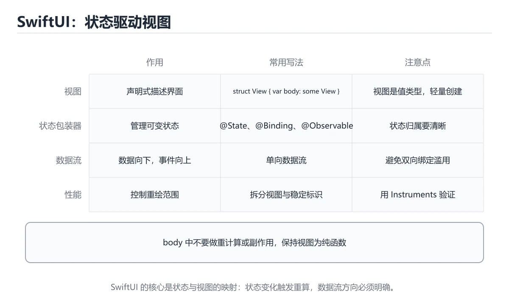

# SwiftUI 与状态管理

> 内容更新时间：2026-10-06 · 学习阶段：高级 · 预计用时：30 分钟




## 学习目标

- 能用自己的话解释：SwiftUI 视图是状态的函数，状态变化驱动视图重新计算。
- 能用自己的话解释：@State 管局部值，@Observable/ObservableObject 管共享模型，环境对象跨层级传递。
- 能用自己的话解释：避免在 body 中做重计算和副作用，用稳定标识减少无效重建。
- 能把本课知识放回「Swift」，并完成练习与测验。

## 前置知识

- 能运行 CounterView 所在的示例环境，并读懂报错信息。
- 本课关键词：SwiftUI、状态、数据流、视图。
- 遇到不熟悉的术语先记录问题，完成练习后再回读。

## 核心知识

### 1. SwiftUI 视图是状态的函数，状态变化驱动视图重新计算。

- 关键做法：先让 SwiftUI 的最小示例可复现，再加入并发或规模条件。
- 验证标准：CounterView 的输出能被他人复现，边界输入有对应用例。

### 2. @State 管局部值，@Observable/ObservableObject 管共享模型，环境对象跨层级传递。

把这条结论放回「SwiftUI 与状态管理」的完整流程里展开：

- 正文依据：能用自己的话解释：SwiftUI 视图是状态的函数，状态变化驱动视图重新计算。
- 落地检查：把「2. @State 管局部值，@Observable/ObservableObject 管共享模型，环境对象跨层级传递。」改写成一条可执行的核对项，逐条验证输入、超时与失败路径。

### 3. 避免在 body 中做重计算和副作用，用稳定标识减少无效重建。

把这条结论放回「SwiftUI 与状态管理」的完整流程里展开：

- 正文依据：本课关键词：SwiftUI、状态、数据流、视图。
- 落地检查：把「3. 避免在 body 中做重计算和副作用，用稳定标识减少无效重建。」改写成一条可执行的核对项，逐条验证输入、超时与失败路径。

## 关键流程

```text
输入 → 校验 → 核心处理 → 验证 → 记录指标 → 失败恢复
```

## 实践路径

1. 用一句话复述本课要解决的问题。
2. 跑通正文中的最小示例并记录基线。
3. 只改变一个输入或参数，预测并验证结果。
4. 补一个失败路径，记录错误、恢复和指标。
5. 把结论写成可复现的笔记或测试。

## 常见错误与排查

> 说明：本表由《SwiftUI 与状态管理》的核心知识整理（2026-10-07），人工复核进度见 docs/content_review_batches.md。

| 易错点 | 容易踩的做法 | 正确结论 |
| --- | --- | --- |
| 在视图构建里做副作用 | 视图重建导致重复执行 | 副作用放到任务或数据层 |
| 状态源多处重复 | 界面显示不同步 | 明确单一数据源并向下传递 |
| 过度使用双向绑定 | 状态来源混乱 | 只在需要编辑时使用绑定 |

## 动手练习

1. 合上教程，用 3～5 句话解释SwiftUI 与状态管理。
2. 从正文选一个例子，改变一个条件并预测结果。
3. 设计一个失败场景，写出止损与恢复步骤。

**验收标准**：留下输入、命令、输出、差异和下一步问题。

## 本课小结

- 本课围绕 SwiftUI、状态、数据流、视图 展开，复习时重点核对它们的输入、输出和失败路径。
- 做完本课测验后，把答错且解释不清的 状态 相关题目记成验证任务。


## 语言专项实践：SwiftUI 与状态管理

### 一、工具链

| 阶段 | 推荐工具 | 验收标准 |
| --- | --- | --- |
| 编译构建 | swiftc / xcodebuild | 命令可复现且错误能被定位 |
| 测试 | XCTest + async 测试 | 命令可复现且错误能被定位 |
| 性能 | Instruments / signpost | 命令可复现且错误能被定位 |
| 发布 | TestFlight + App Store 审核 | 命令可复现且错误能被定位 |

### 二、运行时与内存模型

围绕「SwiftUI、状态、数据流、视图」说明变量生命周期、资源释放、并发模型和错误传播。语言语法只是入口，真正决定行为的是运行时、标准库和平台约束。

### 三、测试策略

- 单元测试覆盖核心规则和边界。
- 集成测试覆盖文件、网络、数据库或平台 API。
- 失败测试覆盖超时、取消、异常和资源耗尽。
- 性能测试记录基线，避免只凭感觉优化。

### 四、发布检查

- [ ] 版本和依赖锁定，构建可复现。
- [ ] 产物经过签名、校验和最小权限配置。
- [ ] 日志不泄露密钥和个人信息。
- [ ] 有升级、回滚和故障恢复说明。

## 可运行练习

本节围绕SwiftUI 与状态管理安排 3 个可交付任务，每个任务都要求留下可以复查的记录。

### 任务 1：用自己的话画出结构

不看书，用一张图说清「SwiftUI 与状态管理」的结构，画完再对照骨架：

- 主干：核心知识 → 交付物 → 验收标准 → 复盘
- 连接线：在每条边上标出输入、输出与失败路径。
- 自检：能否用一句话说明SwiftUI与状态的关系？

### 任务 2：做一次对比实验

**验收标准**：写出换方案的触发条件——当状态的规模、精度或资源上限变化到什么程度时，「核心知识」里的结论不再成立。

### 任务 3：迁移到自己的场景

**验收标准**：用自己的话复述 SwiftUI，并配一个反例；只写定义不算通过。

## 故障现场

### 现场 1：在视图构建里做副作用

**症状**：在《SwiftUI 与状态管理》的复现场景中，视图重建导致重复执行。

**根因**：当出现“在视图构建里做副作用”时，执行路径已经绕过了《SwiftUI 与状态管理》的关键约束，最终以“视图重建导致重复执行”暴露出来；修复前必须先确认约束在哪里失效。

**修复**：针对《SwiftUI 与状态管理》的问题，副作用放到任务或数据层。

**验证**：保留《SwiftUI 与状态管理》里触发“视图重建导致重复执行”的输入、版本和日志，按“副作用放到任务或数据层”完成修改后原样重放；只有失败现象消失且相邻场景仍可解释，才保留改动。

### 现场 2：状态源多处重复

**症状**：在《SwiftUI 与状态管理》的复现场景中，界面显示不同步。

**根因**：触发点是把“状态源多处重复”当成安全做法。它没有满足《SwiftUI 与状态管理》要求的前提，因此先表现为“界面显示不同步”；排查时先完整复现这一段，再核对输入、配置与依赖。

**修复**：针对《SwiftUI 与状态管理》的问题，明确单一数据源并向下传递。

**验证**：保留《SwiftUI 与状态管理》里触发“界面显示不同步”的输入、版本和日志，按“明确单一数据源并向下传递”完成修改后原样重放；只有失败现象消失且相邻场景仍可解释，才保留改动。

### 现场 3：过度使用双向绑定

**症状**：在《SwiftUI 与状态管理》的复现场景中，状态来源混乱。

**根因**：当出现“过度使用双向绑定”时，执行路径已经绕过了《SwiftUI 与状态管理》的关键约束，最终以“状态来源混乱”暴露出来；修复前必须先确认约束在哪里失效。

**修复**：针对《SwiftUI 与状态管理》的问题，只在需要编辑时使用绑定。

**验证**：在《SwiftUI 与状态管理》中按“只在需要编辑时使用绑定”调整后，从“过度使用双向绑定”的触发条件重放同一条路径，确认“状态来源混乱”不再出现，并补一个相邻边界用例检查没有引入新问题。

## 版本与时效

- Swift 6.x 默认开启更严格的数据竞争检查；SwiftUI 的并发边界要先梳理。
- 升级前确认 SwiftUI 的兼容范围，把不可回退的改动单独拆成一次提交。
- SwiftUI 与 Swift Testing 迭代最快；SwiftUI 的示例要注明工具链版本。
- 官方发布说明：https://www.swift.org/blog/

### 升级检查清单

- 先固定当前版本，跑通全部示例与测验，再升级工具链。
- 升级时只动一个依赖版本，用 CounterView 记录构建与运行结果。
- 回归范围锁定 CounterView 的默认行为，并确认弃用警告是否出现在构建输出里。
- 升级后把 CounterView 的实测版本写进「内容元数据」，再更新复核日期。

## 本课复习清单


离开本课前，逐项确认：

- [ ] 不看解析，能说出「关于「@State 管局部值，@Observable/ObservableObject 管共享模型」，下列说法正确的是？」的判断依据。
- [ ] 不看解析，能说出「关于「避免在 body 中做重计算和副作用，用稳定标识减少无效重建。」，下列说法正确的是？」的判断依据。
- [ ] 不看解析，能说出「「SwiftUI 与状态管理」的核心学习目标是什么？」的判断依据。
- [ ] 至少运行一次《SwiftUI 与状态管理》的示例，记录输入、输出和一个边界情况。
- [ ] 把本课最容易混淆的两个概念写成一句话对照。

| 复盘项 | 记录 |
| --- | --- |
| 已经能独立解释的考点 |  |
| 仍然说不清的概念 |  |
| 下一步验证动作 |  |

## 复习与自测

下面按正文顺序回顾「SwiftUI 与状态管理」的每一节；说不清的地方回到 核心知识 补课。

### 核心知识

自检：这一节与相邻主题的边界在哪里？

### 动手练习

自检：如果去掉这一节里的一个前提，结论会怎样变化？

### 语言专项实践：SwiftUI 与状态管理

自检：这一节的关键输入与输出分别是什么？

### 最小可运行示例

```swift
struct CounterView: View {
    @State private var count = 0

    var body: some View {
        Button("count=\(count)") { count += 1 }
    }
}
```

自检：把这一节讲给没学过的人，最需要强调哪一点？

### 预期输出

```text
界面显示一个按钮：初始文案为 count=0，每次点击后数字加一
```

### 验证步骤

制造一次错误输入，记录错误信息与修复方式。

## 术语速查

| 术语 | 一句话说明 |
| --- | --- |
| `SwiftUI` | Apple 的声明式 UI 框架，用状态驱动视图并跨 Apple 平台复用。 |
| `状态` | 系统在某一时刻保存的数据与条件，变化时会驱动界面或流程更新。 |
| `数据流` | 按“SwiftUI 与状态管理”中 SwiftUI、状态、数据流 的实践顺序，把四个步骤排成从准备到复盘的合理顺序。 |
| `视图` | 二、运行时与内存模型：围绕「SwiftUI、状态、数据流、视图」说明变量生命周期、资源释放、并发模型和错误传播。 |

## 深度拓展与实战

这一节把 SwiftUI 的定义、CounterView 的代码与常见失败串成一条复习路线。

### 机制拆解

- **1. SwiftUI 视图是状态的函数，状态变化驱动视图重新计算。**：在「SwiftUI 与状态管理」里，「1. SwiftUI 视图是状态的函数，状态变化驱动视图重新计算。」这一步要先写清输入与预期，再记录实际结果和差异；结果不符时回到对应小节核对前提。
- **2. @State 管局部值，@Observable/ObservableObject 管共享模型，环境对象跨层级传递。**：在「SwiftUI 与状态管理」里，「2. @State 管局部值，@Observable/ObservableObject 管共享模型，环境对象跨层级传递。」这一步要先写清输入与预期，再记录实际结果和差异；结果不符时回到对应小节核对前提。
- **3. 避免在 body 中做重计算和副作用，用稳定标识减少无效重建。**：在「SwiftUI 与状态管理」里，「3. 避免在 body 中做重计算和副作用，用稳定标识减少无效重建。」这一步要先写清输入与预期，再记录实际结果和差异；结果不符时回到对应小节核对前提。
- 一、工具链：实现 CounterView 所需的阶段与验收标准
- **二、运行时与内存模型**：围绕「SwiftUI、状态、数据流、视图」说明变量生命周期、资源释放、并发模型和错误传播

### 边界条件与常见反例

「SwiftUI 与状态管理」的边界不只包括最大最小值，还要覆盖空、重复和失败：

| 条件 | 常见反例 | 处理方式 |
| --- | --- | --- |
| 空输入 | SwiftUI 没有任何取值 | 先判空，给出明确错误而不是继续执行 |
| 边界值 | 状态 取最小或最大 | 用最小值、最大值和越界值各跑一次 |
| 重复执行 | 同一输入被执行两次 | 保证结果可重复，必要时加锁或去重 |
| 失败路径 | SwiftUI 相关步骤报错 | 保留原始错误，确认回滚或重试行为 |

### 工程检查表

- [ ] 能否用自己的话说明SwiftUI 与状态管理解决什么问题，以及它不负责什么？
- [ ] 能否用「SwiftUI 与状态管理」的最小示例复现一次失败并解释原因？
- [ ] 能否解释本课关键词在真实项目中的边界与取舍？
- [ ] 能否说明 状态 在新场景下需要补充什么前提？

### 迁移练习

1. 保持正文示例不变，写出它的输入、处理步骤和预期输出。
2. 固定其他输入，只调整 CounterView 的一个参数，先写预测再验证。
3. 结合SwiftUI、状态、数据流、视图，写出一个真实项目中的使用场景。
4. 写下一个反例，说明它在什么条件下会使朴素做法失效。

## 考点精讲

### 考点 1：顺序排列·SwiftUI

- **题目**：按“SwiftUI 与状态管理”中 SwiftUI、状态、数据流 的实践顺序，把四个步骤排成从准备到复盘的合理顺序。
- **判断依据**：在「SwiftUI 与状态管理」里，在本课的练习里，顺序应当是：先明确 SwiftUI 的输入、输出与约束 → 写出最小示例并核对 状态 的基线结果 → 只改一个变量，记录边界与失败路径的变化 → 固定版本与证据，把本课的结论写成可复现记录。这个顺序把 SwiftUI 的输入、输出和约束放在最前面，在SwiftUI 与状态管理里避免概念没对齐就开始调参。第二步用 状态 建立可核对的基线，在SwiftUI 与状态管理里第三步才允许改变一个变量并观察失败路径。

### 考点 2：概念判断·SwiftUI

- **题目**：关于「@State 管局部值，@Observable/ObservableObject 管共享模型」，下列说法正确的是？
- **判断依据**：在「SwiftUI 与状态管理」里，@State 管局部值。这道题的关键在「SwiftUI 与状态管理」的SwiftUI、状态、数据流：先确认题干“关于@State 管局部值”问的是哪一步，再排除偷换前提的选项。区分要点：局部状态用 @State，共享模型才交给 @Observable 或 ObservableObject。

### 考点 3：概念判断·SwiftUI

- **题目**：关于「避免在 body 中做重计算和副作用，用稳定标识减少无效重建。」，下列说法正确的是？
- **判断依据**：在「SwiftUI 与状态管理」里，避免在 body 中做重计算和副作用，用稳定标识减少无效重建。这道题的关键在「SwiftUI 与状态管理」的SwiftUI、状态、数据流：先确认题干“关于避免在 body 中做重计算和副”问的是哪一步，再排除偷换前提的选项。

### 考点 4：概念判断·SwiftUI

- **题目**：「SwiftUI 与状态管理」的核心学习目标是什么？
- **判断依据**：在「SwiftUI 与状态管理」里，这道题要求区分概念与边界，「覆盖声明式视图、状态包装器、数据流和性能。在「SwiftUI 与状态管理」里，」只有在题干给出的前提下才成立，而「掌握 let/var、可选绑定、值类型和错误处理。在「SwiftUI 与状态管理」里，」、「理解参数标签、闭包捕获、逃逸闭包和协议扩展。」缺少同一组条件。

### 考点 5：多选辨析·SwiftUI

- **题目**：以下哪些术语与「SwiftUI 与状态管理」直接相关？（多选）
- **判断依据**：「SwiftUI 与状态管理」要求先交代SwiftUI、状态、数据流的前提再下结论，所以“SwiftUI”只在题干“以下哪些术语与SwiftUI 与状态管理直接相关”给定的条件下成立。回到SwiftUI、状态、数据流本身再看一遍：只有“SwiftUI”与题干“以下哪些术语与SwiftUI”的前提一致，结论才成立。

### 考点 6：排错·SwiftUI

- **题目**：阅读「SwiftUI 与状态管理」的代码片段，下面哪项判断是正确的？
- **判断依据**：在「SwiftUI 与状态管理」里，SwiftUI 视图是状态的函数，状态变化驱动视图重新计算。这道题的关键在「SwiftUI 与状态管理」的SwiftUI、状态、数据流：先确认题干“阅读SwiftUI 与状态管理的代码”问的是哪一步，再排除偷换前提的选项。这道题的关键在SwiftUI、状态、数据流：先确认题干“阅读SwiftUI”问的是哪一步，再排除偷换前提的选项。

## English Overview

**Title:** SwiftUI and State Management

**Summary:** Cover declarative views, property wrappers, data flow and performance.

**Category:** Swift
**Level:** 高级
**Key terms:** SwiftUI, 状态, 数据流, 视图

## 内容元数据

- 内容版本：v2.0
- 最后更新：2026-10-06
- 学习阶段：高级
- 适用环境：Swift 6 / Xcode 16+；本课聚焦 SwiftUI。
- 内容来源：内置结构化课程与工程实践整理
- 相关主题：SwiftUI、状态、数据流、视图
- 质量版本：P0 测验标准 + P1 覆盖扩展 + P2 体验补全

## 最小可运行示例

下面这段代码演示 SwiftUI 的最小路径，先原样运行，再按注释改一处：

```swift
struct CounterView: View {
    @State private var count = 0

    var body: some View {
        Button("count=\(count)") { count += 1 }
    }
}
```

## 预期输出

```text
界面显示一个按钮：初始文案为 count=0，每次点击后数字加一
```

## 验证步骤

1. 记录运行环境、命令和真实输出。
2. 修改一个输入，先写预测再运行。
4. 把结论写回本课笔记或测试用例。

## 参考资料与复核

- 最后复核：2026-10-04
- 下次复核：2026-12-17
- 复核范围：版本兼容、API 行为、安全建议与工程实践
- 来源性质：官方文档、标准或权威教材；正文为离线教学重组

| 参考资料 | 本课用途 |
| --- | --- |
| [SwiftUI 文档](https://developer.apple.com/documentation/swiftui) | 声明式界面与状态 |
| [Swift 官方文档](https://www.swift.org/documentation/) | 工具链、包管理与语言演进 |
| [Swift 并发](https://docs.swift.org/swift-book/documentation/the-swift-programming-language/concurrency/) | async/await 与 actor |

> 「SwiftUI 与状态管理」的链接用于离线阅读后的延伸核对；App 不会自动联网。

## 复习与迁移

复习目标：把「SwiftUI 与状态管理」的判断标准放回可复现的例子里。先自己作答，再对照依据；如果结论正确但理由不完整，回到正文补足前提。

### 概念复述

- 用一句话说明「SwiftUI 与状态管理」解决什么问题：覆盖声明式视图、状态包装器、数据流和性能。
- 写出SwiftUI、状态、数据流之间的关系，并各举一个例子。
- 说出本课最容易混淆的两个概念，以及区分它们的判据。

### 正文逐节复核

- **语言专项实践：SwiftUI 与状态管理**：围绕「SwiftUI、状态、数据流、视图」说明变量生命周期、资源释放、并发模型和错误传播。
- **实践任务**：本节围绕SwiftUI 与状态管理安排 3 个可交付任务，每个任务都要求留下可以复查的记录。

### 测验回顾

1. 按“SwiftUI 与状态管理”中 SwiftUI、状态、数据流 的实践顺序，把四个步骤排成从准备到复盘的合理顺序。
   - 依据：在「SwiftUI 与状态管理」里，在本课的练习里，顺序应当是：先明确 SwiftUI 的输入、输出与约束 → 写出最小示例并核对 状态 的基线结果 → 只改一个变量，记录边界与失败路径的变化 → 固定版本与证据，把本课的结论写成可复现记录。这个顺序把 SwiftUI 的输入、输出和约束放在最前面，在SwiftUI 与状态管理里避免概念没对齐就开始调参。第二步用 状态 建立可核对的基线，在SwiftUI 与状态管理里第三步才允许改变一个变量并观察失败路径。
2. 关于「@State 管局部值，@Observable/ObservableObject 管共享模型」，下列说法正确的是？
   - 依据：在「SwiftUI 与状态管理」里，@State 管局部值，@Observable/ObservableObject 管共享模型。这道题的关键在「SwiftUI 与状态管理」的SwiftUI、状态、数据流：先确认题干“关于@State 管局部值”问的是哪一步，再排除偷换前提的选项。
3. 关于「避免在 body 中做重计算和副作用，用稳定标识减少无效重建。」，下列说法正确的是？
   - 依据：在「SwiftUI 与状态管理」里，避免在 body 中做重计算和副作用，用稳定标识减少无效重建。这道题的关键在「SwiftUI 与状态管理」的SwiftUI、状态、数据流：先确认题干“关于避免在 body 中做重计算和副”问的是哪一步，再排除偷换前提的选项。
4. 「SwiftUI 与状态管理」的核心学习目标是什么？
   - 依据：在「SwiftUI 与状态管理」里，这道题要求区分概念与边界，「覆盖声明式视图、状态包装器、数据流和性能。在「SwiftUI 与状态管理」里，」只有在题干给出的前提下才成立，而「掌握 let/var、可选绑定、值类型和错误处理。在「SwiftUI 与状态管理」里，」、「理解参数标签、闭包捕获、逃逸闭包和协议扩展。」缺少同一组条件。
5. 以下哪些术语与「SwiftUI 与状态管理」直接相关？（多选）
   - 依据：「SwiftUI 与状态管理」要求先交代SwiftUI、状态、数据流的前提再下结论，所以“SwiftUI”只在题干“以下哪些术语与SwiftUI 与状态管理直接相关”给定的条件下成立。回到SwiftUI、状态、数据流本身再看一遍：只有“SwiftUI”与题干“以下哪些术语与SwiftUI”的前提一致，结论才成立。
6. 阅读「SwiftUI 与状态管理」的代码片段，下面哪项判断是正确的？
   - 依据：在「SwiftUI 与状态管理」里，SwiftUI 视图是状态的函数，状态变化驱动视图重新计算。这道题的关键在「SwiftUI 与状态管理」的SwiftUI、状态、数据流：先确认题干“阅读SwiftUI 与状态管理的代码”问的是哪一步，再排除偷换前提的选项。这道题的关键在SwiftUI、状态、数据流：先确认题干“阅读SwiftUI”问的是哪一步，再排除偷换前提的选项。

### 迁移练习

把「SwiftUI 与状态管理」的结论迁移到相邻主题，每次迁移都写清预测与证据：

1. 换输入：用SwiftUI处理一组你自己的数据，对比教材示例的结果差异。
2. 换失败条件：制造一个状态相关的错误，说明如何从错误信息定位根因。
3. 换规模：把数据量或并发度提高一个数量级，说明「SwiftUI 与状态管理」的结论是否仍成立。
