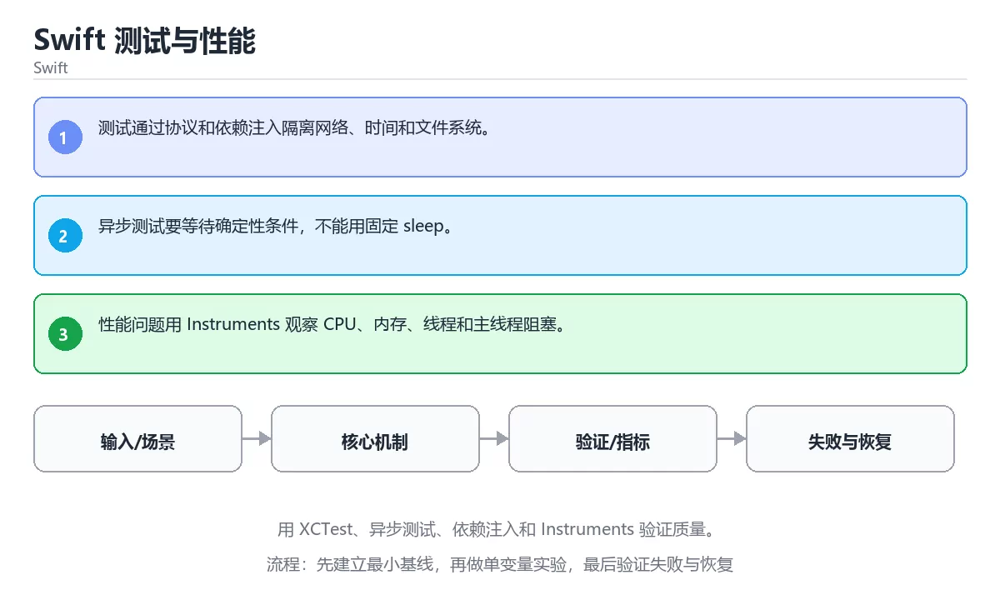

# Swift 测试与性能



> 内容更新时间：2026-10-03 · 学习阶段：高级 · 预计用时：23 分钟

## 学习目标

- 能用自己的话解释：测试通过协议和依赖注入隔离网络、时间和文件系统。
- 能用自己的话解释：异步测试要等待确定性条件，不能用固定 sleep。
- 能用自己的话解释：性能问题用 Instruments 观察 CPU、内存、线程和主线程阻塞。
- 能把本课知识放回「Swift」，并完成练习与测验。

## 前置知识

- 已完成「Swift」的基础课程，能运行正文中的最小示例。
- 本课关键词：XCTest、异步测试、Instruments、依赖注入。
- 遇到不熟悉的术语先记录问题，完成练习后再回读。

## 核心知识

### 1. 测试通过协议和依赖注入隔离网络、时间和文件系统。

- 它解决的问题：把「测试通过协议和依赖注入隔离网络、时间和文件系统。」放回真实场景，说明不做它会带来什么后果。
- 关键做法：先用最小示例建立基线，再逐步加入边界、失败和性能条件。
- 验证标准：结果可复现、错误可解释、边界有测试、失败能恢复。

### 2. 异步测试要等待确定性条件，不能用固定 sleep。

- 它解决的问题：把「异步测试要等待确定性条件，不能用固定 sleep。」放回真实场景，说明不做它会带来什么后果。
- 关键做法：先用最小示例建立基线，再逐步加入边界、失败和性能条件。
- 验证标准：结果可复现、错误可解释、边界有测试、失败能恢复。

### 3. 性能问题用 Instruments 观察 CPU、内存、线程和主线程阻塞。

- 它解决的问题：把「性能问题用 Instruments 观察 CPU、内存、线程和主线程阻塞。」放回真实场景，说明不做它会带来什么后果。
- 关键做法：先用最小示例建立基线，再逐步加入边界、失败和性能条件。
- 验证标准：结果可复现、错误可解释、边界有测试、失败能恢复。

## 关键流程

```text
输入 → 校验 → 核心处理 → 验证 → 记录指标 → 失败恢复
```

## 实践路径

1. 用一句话复述本课要解决的问题。
2. 跑通正文中的最小示例并记录基线。
3. 只改变一个输入或参数，预测并验证结果。
4. 补一个失败路径，记录错误、恢复和指标。
5. 把结论写成可复现的笔记或测试。

## 常见误区

| 误区 | 后果 | 修正 |
| --- | --- | --- |
| 只记术语不做实验 | 遇到真实问题无法判断 | 用最小输入跑通并记录结果 |
| 只测正常路径 | 边界和故障上线才暴露 | 补空值、极值和依赖失败 |
| 没有基线就优化 | 无法证明改进有效 | 先测量再修改 |
| 忽略成本与安全 | 性能和风险失控 | 同时记录资源、权限与失败代价 |

## 动手练习

1. 合上教程，用 3～5 句话解释「Swift 测试与性能」。
2. 从正文选一个例子，改变一个条件并预测结果。
3. 设计一个失败场景，写出止损与恢复步骤。

**验收标准**：留下输入、命令、输出、差异和下一步问题。

## 本课小结

- 本课属于「Swift」，核心关键词是 XCTest、异步测试、Instruments、依赖注入。
- 先保证正确与可复现，再讨论性能和扩展。
- 完成练习和测验后，把仍然不确定的问题写成下一轮验证清单。

> 本课由 P1 内容扩展生成，重点补充原有课程缺失的主题与工程边界。

<!-- domain-supplement:v1 -->

## 语言专项实践：Swift 测试与性能

### 一、工具链

| 阶段 | 推荐工具 | 验收标准 |
| --- | --- | --- |
| 编译构建 | swiftc / xcodebuild | 命令可复现且错误能被定位 |
| 测试 | XCTest + async 测试 | 命令可复现且错误能被定位 |
| 性能 | Instruments / signpost | 命令可复现且错误能被定位 |
| 发布 | TestFlight + App Store 审核 | 命令可复现且错误能被定位 |

### 二、运行时与内存模型

围绕「XCTest、异步测试、Instruments、依赖注入」说明变量生命周期、资源释放、并发模型和错误传播。语言语法只是入口，真正决定行为的是运行时、标准库和平台约束。

### 三、测试策略

- 单元测试覆盖核心规则和边界。
- 集成测试覆盖文件、网络、数据库或平台 API。
- 失败测试覆盖超时、取消、异常和资源耗尽。
- 性能测试记录基线，避免只凭感觉优化。

### 四、发布检查

- [ ] 版本和依赖锁定，构建可复现。
- [ ] 产物经过签名、校验和最小权限配置。
- [ ] 日志不泄露密钥和个人信息。
- [ ] 有升级、回滚和故障恢复说明。

<!-- p2-enrichment:v1 -->

## English Overview

**Title:** Swift Testing and Performance

**Summary:** Use XCTest, async tests, dependency injection and Instruments.

**Category:** Swift  
**Level:** 高级  
**Key terms:** XCTest, 异步测试, Instruments, 依赖注入

> The full tutorial is written in Chinese. This bilingual overview helps English readers identify the topic, scope and key terms before studying the detailed examples.

## 内容元数据

- 内容版本：v2.0
- 最后更新：2026-10-03
- 学习阶段：高级
- 适用环境：Swift 6 / Xcode 16+
- 内容来源：内置结构化课程与工程实践整理
- 相关主题：XCTest、异步测试、Instruments、依赖注入
- 质量版本：P0 测验标准 + P1 覆盖扩展 + P2 体验补全

<!-- minimal-code:v1 -->

## 最小可运行示例

下面示例用于验证「Swift 测试与性能」的最小输入、处理和输出。先原样运行，再只修改一个值：

```python
print(bin(10), hex(255), 0b1010)
```

## 预期输出

```text
0b1010 0xff 10
```

## 验证步骤

1. 记录运行环境、命令和真实输出。
2. 修改一个输入，先写预测再运行。
3. 制造一次错误输入，记录错误信息与修复方式。
4. 把结论写回本课笔记或测试用例。

<!-- top50-rewrite:v1 -->

## 课程专属精读：Swift 测试与性能

### 一、知识地图

- **1. 测试通过协议和依赖注入隔离网络、时间和文件系统。**：理解它的定义、输入、输出和失败边界。
- **2. 异步测试要等待确定性条件，不能用固定 sleep。**：理解它的定义、输入、输出和失败边界。
- **3. 性能问题用 Instruments 观察 CPU、内存、线程和主线程阻塞。**：理解它的定义、输入、输出和失败边界。
- **适用边界**：说明「Swift 测试与性能」在哪些输入、规模和环境下适用，什么时候应该换方案。
- **常见错误**：记录一个最容易犯的错误、错误信息和修复方式。
- **测试与验证**：用正常、边界、失败和恢复四类路径验证结果。

### 二、机制与验证

| 主题 | 需要回答的问题 | 验证方式 |
| --- | --- | --- |
| 1. 测试通过协议和依赖注入隔离网络、时间和文件系统。 | 它解决什么问题，输入和输出是什么？ | 最小示例、边界输入、日志或指标 |
| 2. 异步测试要等待确定性条件，不能用固定 sleep。 | 它解决什么问题，输入和输出是什么？ | 最小示例、边界输入、日志或指标 |
| 3. 性能问题用 Instruments 观察 CPU、内存、线程和主线程阻塞。 | 它解决什么问题，输入和输出是什么？ | 最小示例、边界输入、日志或指标 |
| 适用边界 | 它解决什么问题，输入和输出是什么？ | 最小示例、边界输入、日志或指标 |
| 常见错误 | 它解决什么问题，输入和输出是什么？ | 最小示例、边界输入、日志或指标 |
| 测试与验证 | 它解决什么问题，输入和输出是什么？ | 最小示例、边界输入、日志或指标 |

### 三、专属检查问题

1. 1. 测试通过协议和依赖注入隔离网络、时间和文件系统。 与相邻主题的边界是什么？
2. 2. 异步测试要等待确定性条件，不能用固定 sleep。 与相邻主题的边界是什么？
3. 3. 性能问题用 Instruments 观察 CPU、内存、线程和主线程阻塞。 与相邻主题的边界是什么？
4. 适用边界 与相邻主题的边界是什么？
5. 常见错误 与相邻主题的边界是什么？
6. 测试与验证 与相邻主题的边界是什么？

### 四、故障排查

1. 固定输入和环境，确认问题能复现。
2. 找到第一个异常状态，不从最终错误倒猜。
3. 只改变一个变量，记录预测和真实结果。
4. 修复后补边界、失败和重复执行测试。

## 专属复习题库

**问：1. 测试通过协议和依赖注入隔离网络、时间和文件系统。 的关键点是什么？**

答：理解它的定义、输入、输出和失败边界。 复习时要能用自己的话复述，并给出一个失败场景。

**问：2. 异步测试要等待确定性条件，不能用固定 sleep。 的关键点是什么？**

答：理解它的定义、输入、输出和失败边界。 复习时要能用自己的话复述，并给出一个失败场景。

**问：3. 性能问题用 Instruments 观察 CPU、内存、线程和主线程阻塞。 的关键点是什么？**

答：理解它的定义、输入、输出和失败边界。 复习时要能用自己的话复述，并给出一个失败场景。

**问：适用边界 的关键点是什么？**

答：说明「Swift 测试与性能」在哪些输入、规模和环境下适用，什么时候应该换方案。 复习时要能用自己的话复述，并给出一个失败场景。

**问：常见错误 的关键点是什么？**

答：记录一个最容易犯的错误、错误信息和修复方式。 复习时要能用自己的话复述，并给出一个失败场景。

**问：测试与验证 的关键点是什么？**

答：用正常、边界、失败和恢复四类路径验证结果。 复习时要能用自己的话复述，并给出一个失败场景。

## 逐步练习：Swift 测试与性能

### 练习 1：1. 测试通过协议和依赖注入隔离网络、时间和文件系统。

先复述：理解它的定义、输入、输出和失败边界。

再完成：运行最小示例 → 改变一个输入 → 记录差异 → 补一条测试。

### 练习 2：2. 异步测试要等待确定性条件，不能用固定 sleep。

先复述：理解它的定义、输入、输出和失败边界。

再完成：运行最小示例 → 改变一个输入 → 记录差异 → 补一条测试。

### 练习 3：3. 性能问题用 Instruments 观察 CPU、内存、线程和主线程阻塞。

先复述：理解它的定义、输入、输出和失败边界。

再完成：运行最小示例 → 改变一个输入 → 记录差异 → 补一条测试。

### 练习 4：适用边界

先复述：说明「Swift 测试与性能」在哪些输入、规模和环境下适用，什么时候应该换方案。

再完成：运行最小示例 → 改变一个输入 → 记录差异 → 补一条测试。

### 练习 5：常见错误

先复述：记录一个最容易犯的错误、错误信息和修复方式。

再完成：运行最小示例 → 改变一个输入 → 记录差异 → 补一条测试。

### 练习 6：测试与验证

先复述：用正常、边界、失败和恢复四类路径验证结果。

再完成：运行最小示例 → 改变一个输入 → 记录差异 → 补一条测试。

## 故障排查手册：Swift 测试与性能

| 现象 | 优先检查 | 修复动作 |
| --- | --- | --- |
| 1. 测试通过协议和依赖注入隔离网络、时间和文件系统。 的结果与预期不符 | 输入、环境、依赖版本、日志第一条错误 | 固定最小复现，只改一个变量并回归 |
| 2. 异步测试要等待确定性条件，不能用固定 sleep。 的结果与预期不符 | 输入、环境、依赖版本、日志第一条错误 | 固定最小复现，只改一个变量并回归 |
| 3. 性能问题用 Instruments 观察 CPU、内存、线程和主线程阻塞。 的结果与预期不符 | 输入、环境、依赖版本、日志第一条错误 | 固定最小复现，只改一个变量并回归 |
| 适用边界 的结果与预期不符 | 输入、环境、依赖版本、日志第一条错误 | 固定最小复现，只改一个变量并回归 |
| 常见错误 的结果与预期不符 | 输入、环境、依赖版本、日志第一条错误 | 固定最小复现，只改一个变量并回归 |
| 测试与验证 的结果与预期不符 | 输入、环境、依赖版本、日志第一条错误 | 固定最小复现，只改一个变量并回归 |

> 排查原则：先复现，再定位第一个异常状态，最后用边界和失败测试证明修复有效。

## 自测与面试：Swift 测试与性能

**问：1. 测试通过协议和依赖注入隔离网络、时间和文件系统。 在实际项目中如何使用？**

答：先说明目标和边界，再给出最小实现、验证方式和失败恢复方案。

**问：2. 异步测试要等待确定性条件，不能用固定 sleep。 在实际项目中如何使用？**

答：先说明目标和边界，再给出最小实现、验证方式和失败恢复方案。

**问：3. 性能问题用 Instruments 观察 CPU、内存、线程和主线程阻塞。 在实际项目中如何使用？**

答：先说明目标和边界，再给出最小实现、验证方式和失败恢复方案。

**问：适用边界 在实际项目中如何使用？**

答：先说明目标和边界，再给出最小实现、验证方式和失败恢复方案。

**问：常见错误 在实际项目中如何使用？**

答：先说明目标和边界，再给出最小实现、验证方式和失败恢复方案。

**问：测试与验证 在实际项目中如何使用？**

答：先说明目标和边界，再给出最小实现、验证方式和失败恢复方案。

## 专属进阶任务 5：Swift 测试与性能

- 围绕「1. 测试通过协议和依赖注入隔离网络、时间和文件系统。」完成一个可复现实验，记录输入、输出、指标和失败恢复。
- 围绕「2. 异步测试要等待确定性条件，不能用固定 sleep。」完成一个可复现实验，记录输入、输出、指标和失败恢复。
- 围绕「3. 性能问题用 Instruments 观察 CPU、内存、线程和主线程阻塞。」完成一个可复现实验，记录输入、输出、指标和失败恢复。
- 围绕「适用边界」完成一个可复现实验，记录输入、输出、指标和失败恢复。
- 围绕「常见错误」完成一个可复现实验，记录输入、输出、指标和失败恢复。
- 围绕「测试与验证」完成一个可复现实验，记录输入、输出、指标和失败恢复。

### 验收标准

- [ ] 能复现正文中的最小示例。
- [ ] 能解释该主题的正常、边界和失败路径。
- [ ] 能用测试、日志或指标证明结果。
- [ ] 能把结论放回「swift_testing」所属的学习路径。

<!-- p2-references:v1 -->

## 参考资料与复核

- 最后复核：2026-10-04
- 下次复核：2027-04-04
- 复核范围：版本兼容、API 行为、安全建议与工程实践
- 来源性质：官方文档与标准；本课正文为离线教学重组，不复制原文

| 参考资料 | 本课用途 |
| --- | --- |
| [Swift 官方文档](https://www.swift.org/documentation/) | 语言、并发与包管理 |
| [Apple Developer](https://developer.apple.com/documentation/swift) | 平台 API 与工具链 |

> 本课主题：用 XCTest、异步测试、依赖注入和 Instruments 验证质量。

> App 完全离线展示文字链接，不会自动联网；需要延伸阅读时可复制链接到浏览器。

